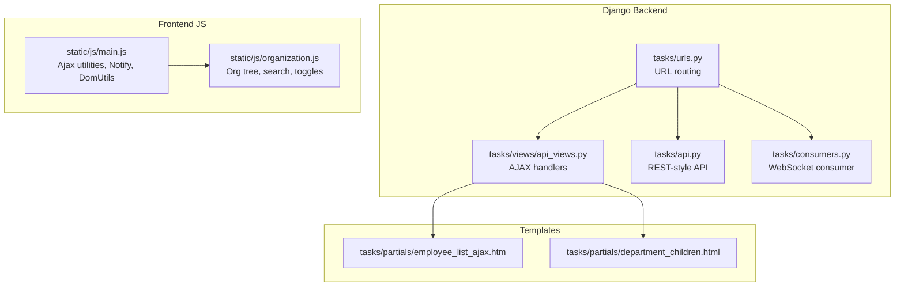
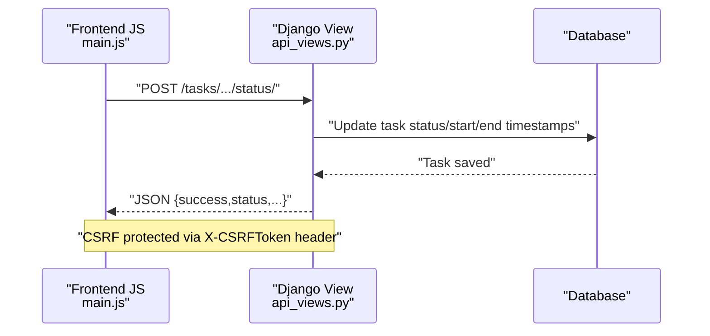
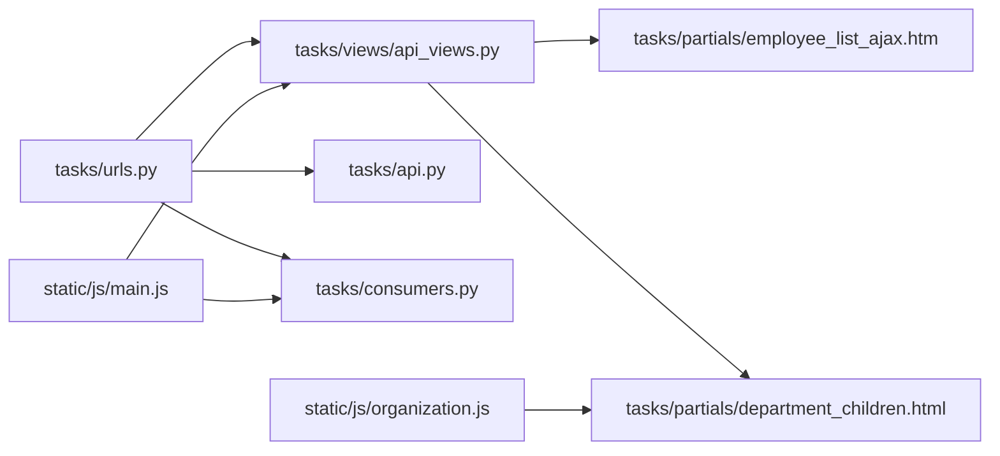

# AJAX Functionality

<cite>
**Referenced Files in This Document**
- [api_views.py](file://tasks/views/api_views.py)
- [api.py](file://tasks/api.py)
- [consumers.py](file://tasks/consumers.py)
- [urls.py](file://tasks/urls.py)
- [main.js](file://static/js/main.js)
- [organization.js](file://static/js/organization.js)
- [employee_list_ajax.htm](file://tasks/templates/tasks/partials/employee_list_ajax.htm)
- [department_children.html](file://tasks/templates/tasks/partials/department_children.html)
- [task_detail.html](file://tasks/templates/tasks/task_detail.html)
- [organization_chart.html](file://tasks/templates/tasks/organization_chart.html)
</cite>

## Table of Contents
1. [Introduction](#introduction)
2. [Project Structure](#project-structure)
3. [Core Components](#core-components)
4. [Architecture Overview](#architecture-overview)
5. [Detailed Component Analysis](#detailed-component-analysis)
6. [Dependency Analysis](#dependency-analysis)
7. [Performance Considerations](#performance-considerations)
8. [Troubleshooting Guide](#troubleshooting-guide)
9. [Conclusion](#conclusion)

## Introduction
This document explains the Task Manager’s AJAX endpoints and real-time functionality. It covers:
- AJAX handlers for task assignment, status updates, employee search, and department detail loading
- Request/response patterns, data serialization, and DOM manipulation callbacks
- Frontend integration examples and user feedback mechanisms
- Security considerations for AJAX requests, CSRF protection, and authentication tokens
- Troubleshooting guide for common AJAX integration issues

## Project Structure
The AJAX functionality spans Django views, URL routing, template partials, and frontend JavaScript utilities.

**Diagram sources**
- [api_views.py:1-130](file://tasks/views/api_views.py#L1-L130)
- [api.py:1-39](file://tasks/api.py#L1-L39)
- [consumers.py:1-36](file://tasks/consumers.py#L1-L36)
- [urls.py:1-100](file://tasks/urls.py#L1-L100)
- [employee_list_ajax.htm:1-8](file://tasks/templates/tasks/partials/employee_list_ajax.htm#L1-L8)
- [department_children.html:1-27](file://tasks/templates/tasks/partials/department_children.html#L1-L27)
- [main.js:1-174](file://static/js/main.js#L1-L174)
- [organization.js:1-179](file://static/js/organization.js#L1-L179)

**Section sources**
- [urls.py:38-100](file://tasks/urls.py#L38-L100)
- [api_views.py:1-130](file://tasks/views/api_views.py#L1-L130)
- [api.py:1-39](file://tasks/api.py#L1-L39)
- [consumers.py:1-36](file://tasks/consumers.py#L1-L36)
- [main.js:88-135](file://static/js/main.js#L88-L135)
- [organization.js:1-179](file://static/js/organization.js#L1-L179)

## Core Components
- AJAX utilities and notification system in main.js
- Organization tree helpers in organization.js
- Django AJAX endpoints for task assignment, status updates, employee search, and department details
- WebSocket consumer for real-time updates
- Template partials rendering dynamic HTML fragments

Key responsibilities:
- Provide lightweight JSON responses for AJAX calls
- Render reusable partials for dynamic UI updates
- Manage CSRF tokens and authentication via Django decorators
- Offer real-time updates through WebSockets

**Section sources**
- [main.js:60-135](file://static/js/main.js#L60-L135)
- [organization.js:1-179](file://static/js/organization.js#L1-L179)
- [api_views.py:9-129](file://tasks/views/api_views.py#L9-L129)
- [consumers.py:4-36](file://tasks/consumers.py#L4-L36)

## Architecture Overview
The AJAX architecture combines synchronous HTTP endpoints and asynchronous WebSocket updates. Frontend scripts use fetch with CSRF tokens and Notify for user feedback.

**Diagram sources**
- [main.js:101-117](file://static/js/main.js#L101-L117)
- [api_views.py:47-70](file://tasks/views/api_views.py#L47-L70)

## Detailed Component Analysis

### AJAX Utilities and Security (main.js)
- Provides Ajax.get, Ajax.post, and Ajax.postForm with automatic JSON parsing
- Adds X-CSRFToken header using getCookie('csrftoken')
- Global Notify utility for user feedback
- DomUtils for DOM manipulation

Security and UX highlights:
- CSRF protection enforced per request
- Centralized error handling with user-visible notifications
- Consistent response parsing and error reporting

**Section sources**
- [main.js:88-135](file://static/js/main.js#L88-L135)
- [main.js:137-151](file://static/js/main.js#L137-L151)
- [main.js:60-86](file://static/js/main.js#L60-L86)

### Organization Tree Helpers (organization.js)
- Manages expand/collapse state for tree nodes
- Implements live search across tree nodes
- Controls visibility of major blocks (science/organization)

DOM manipulation callbacks:
- Toggle node display and chevron icons
- Show/hide containers and update UI state
- Clear search and restore full tree visibility

**Section sources**
- [organization.js:6-50](file://static/js/organization.js#L6-L50)
- [organization.js:108-154](file://static/js/organization.js#L108-L154)

### Task Assignment AJAX Handler
Purpose:
- Assign or replace task performers via POST
- Load filtered employee list via GET with search

Request/response patterns:
- POST: expects form-encoded array employees[]
- GET: accepts query parameter search and returns rendered partial HTML

Data serialization:
- POST uses form-encoded arrays for multiple selections
- GET returns HTML fragment via render_to_string

DOM manipulation callbacks:
- Replace or append HTML content returned by the endpoint
- Update counters and UI state after successful assignment

Template integration:
- Renders tasks/partials/employee_list_ajax.htm

**Section sources**
- [api_views.py:10-45](file://tasks/views/api_views.py#L10-L45)
- [employee_list_ajax.htm:1-8](file://tasks/templates/tasks/partials/employee_list_ajax.htm#L1-L8)

### Task Status Update AJAX Handler
Purpose:
- Update task status and timestamps (start_time, end_time)

Request/response patterns:
- POST: expects status field
- Returns JSON with current status, formatted timestamps, and success flag

Processing logic:
- Validates status against model choices
- Sets start_time on entering in_progress
- Sets end_time on entering done
- Saves task and returns updated fields

**Section sources**
- [api_views.py:47-70](file://tasks/views/api_views.py#L47-L70)

### Employee Search API
Purpose:
- Provide searchable employee list for selection UIs

Request/response patterns:
- GET: q query parameter
- Returns JSON with results array containing id, text, email

Data serialization:
- Paginated results (top 10)
- Structured payload for client-side consumption

**Section sources**
- [api_views.py:73-93](file://tasks/views/api_views.py#L73-L93)

### Department Detail Loading
Purpose:
- Efficiently load department subtree and staff positions

Request/response patterns:
- GET: department id path parameter
- Returns JSON with rendered HTML and counts

Optimization:
- Uses prefetch_related and select_related to minimize queries
- Renders department_children.html partial

DOM manipulation callbacks:
- Inject HTML into target container
- Update counters for children and staff

**Section sources**
- [api_views.py:95-129](file://tasks/views/api_views.py#L95-L129)
- [department_children.html:1-27](file://tasks/templates/tasks/partials/department_children.html#L1-L27)

### REST-style Quick Assignment (tasks/api.py)
Purpose:
- Alternative assignment mechanism via REST-like endpoint

Request/response patterns:
- POST: task_id, employee_id
- Returns structured JSON with success and identifiers

**Section sources**
- [api.py:24-39](file://tasks/api.py#L24-L39)

### Real-time Updates via WebSocket
Purpose:
- Broadcast task updates to connected clients

Behavior:
- Consumer joins group task_{task_id}
- Receives messages and forwards to all group members
- Sends JSON payload back to clients

Frontend integration:
- Connect to WebSocket URL derived from task_id
- Listen for incoming events and update UI accordingly

**Section sources**
- [consumers.py:4-36](file://tasks/consumers.py#L4-L36)

### Frontend Integration Examples
Below are conceptual examples of how frontend code integrates with the endpoints. Replace placeholders with actual selectors and IDs present in your templates.

- Task status update
  - Trigger: button click or dropdown change
  - Action: Ajax.post to the status endpoint with status value
  - Callback: On success, update badge/status text and timestamps

- Task assignment
  - Trigger: Save button in assignment modal
  - Action: Ajax.postForm to assign endpoint with employees[] array
  - Callback: On success, refresh performer list and show notification

- Employee search
  - Trigger: typing in search box
  - Action: Ajax.get to employee search endpoint with q parameter
  - Callback: Populate dropdown/list with returned results

- Department detail
  - Trigger: clicking a department node
  - Action: Ajax.get to department detail endpoint
  - Callback: Insert returned HTML into container and update counters

- Real-time updates
  - Trigger: connection established
  - Action: Subscribe to task_{task_id} group
  - Callback: Apply received updates to UI elements

Note: These examples describe control flow and do not reproduce code from the repository.

**Section sources**
- [main.js:88-135](file://static/js/main.js#L88-L135)
- [organization.js:108-154](file://static/js/organization.js#L108-L154)
- [urls.py:49-91](file://tasks/urls.py#L49-L91)

## Dependency Analysis
The AJAX layer depends on:
- Django URL routing to dispatch requests to views
- Template partials for rendering dynamic HTML
- Frontend utilities for HTTP and DOM operations
- Authentication decorators to enforce login

**Diagram sources**
- [urls.py:38-100](file://tasks/urls.py#L38-L100)
- [api_views.py:1-130](file://tasks/views/api_views.py#L1-L130)
- [api.py:1-39](file://tasks/api.py#L1-L39)
- [consumers.py:1-36](file://tasks/consumers.py#L1-L36)
- [employee_list_ajax.htm:1-8](file://tasks/templates/tasks/partials/employee_list_ajax.htm#L1-L8)
- [department_children.html:1-27](file://tasks/templates/tasks/partials/department_children.html#L1-L27)
- [main.js:1-174](file://static/js/main.js#L1-L174)
- [organization.js:1-179](file://static/js/organization.js#L1-L179)

**Section sources**
- [urls.py:38-100](file://tasks/urls.py#L38-L100)
- [api_views.py:1-130](file://tasks/views/api_views.py#L1-L130)
- [api.py:1-39](file://tasks/api.py#L1-L39)
- [consumers.py:1-36](file://tasks/consumers.py#L1-L36)
- [main.js:1-174](file://static/js/main.js#L1-L174)
- [organization.js:1-179](file://static/js/organization.js#L1-L179)

## Performance Considerations
- Minimize database round trips by using prefetch_related/select_related in department detail handler
- Limit result sets (e.g., top 10 employees) in search endpoints
- Prefer lightweight JSON responses and avoid unnecessary HTML rendering on the server when possible
- Debounce frequent AJAX triggers (e.g., search input) to reduce network load

[No sources needed since this section provides general guidance]

## Troubleshooting Guide
Common issues and resolutions:
- CSRF failure
  - Symptom: Requests rejected with 403
  - Cause: Missing or invalid X-CSRFToken header
  - Fix: Ensure getCookie('csrftoken') is included in headers for POST requests

- Authentication errors
  - Symptom: Unauthorized responses
  - Cause: User not logged in or session expired
  - Fix: Redirect to login or refresh session before making AJAX calls

- Empty or stale data
  - Symptom: No results or outdated content
  - Cause: Missing query parameters or caching
  - Fix: Verify GET parameters (e.g., search, q) and clear caches where applicable

- DOM not updating
  - Symptom: UI does not reflect server response
  - Cause: Missing callback or wrong selector
  - Fix: Confirm success callback injects HTML into correct container and updates counters

- WebSocket not receiving updates
  - Symptom: No real-time updates
  - Cause: Not connected to correct room or group
  - Fix: Ensure connection to task_{task_id} group and listen for events

**Section sources**
- [main.js:101-117](file://static/js/main.js#L101-L117)
- [api_views.py:9-129](file://tasks/views/api_views.py#L9-L129)
- [consumers.py:4-36](file://tasks/consumers.py#L4-L36)

## Conclusion
The Task Manager’s AJAX layer provides efficient, secure, and user-friendly interactions for managing tasks, performers, and organizational details. By leveraging Django’s robust view layer, optimized queries, and reusable template partials, along with frontend utilities for CSRF protection and user feedback, the system delivers responsive experiences. Real-time updates via WebSockets further enhance collaboration. Following the security and integration guidelines outlined here will help maintain reliability and usability.