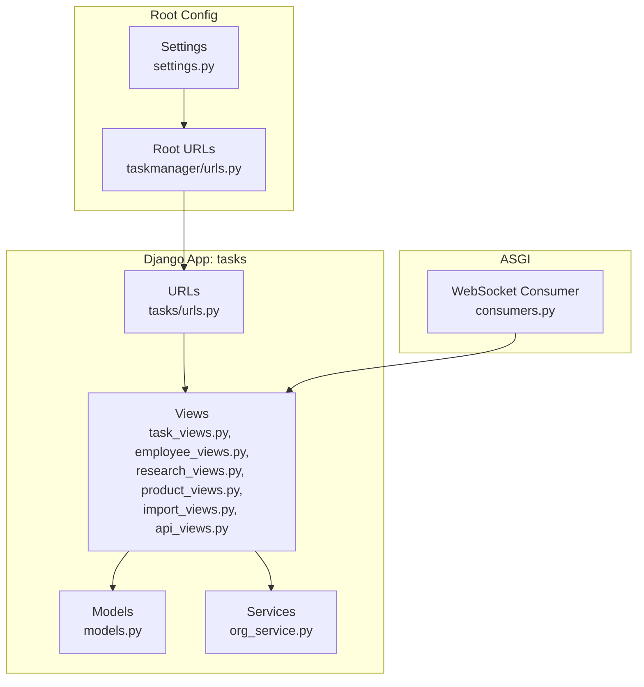
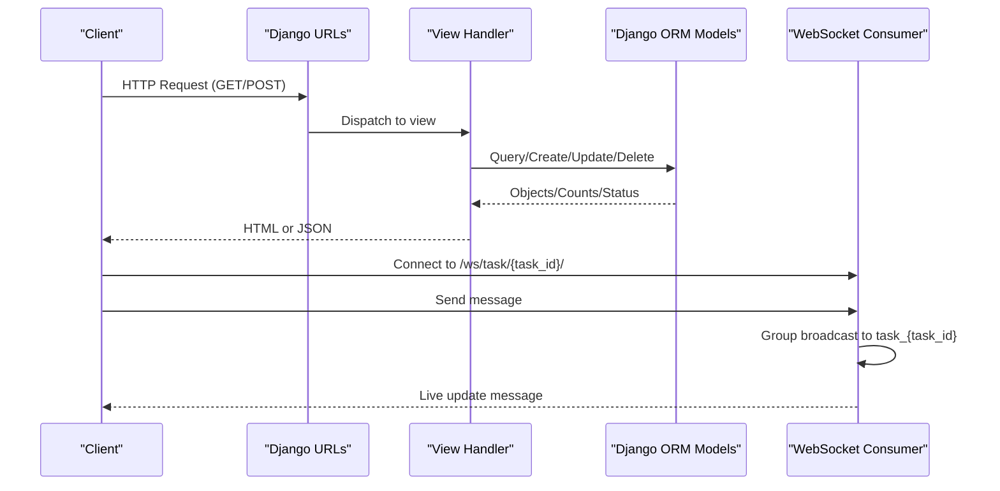
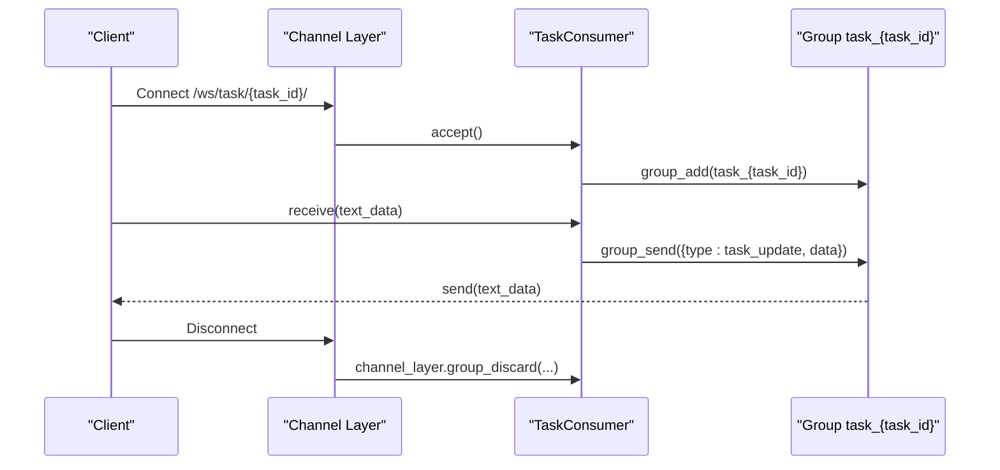
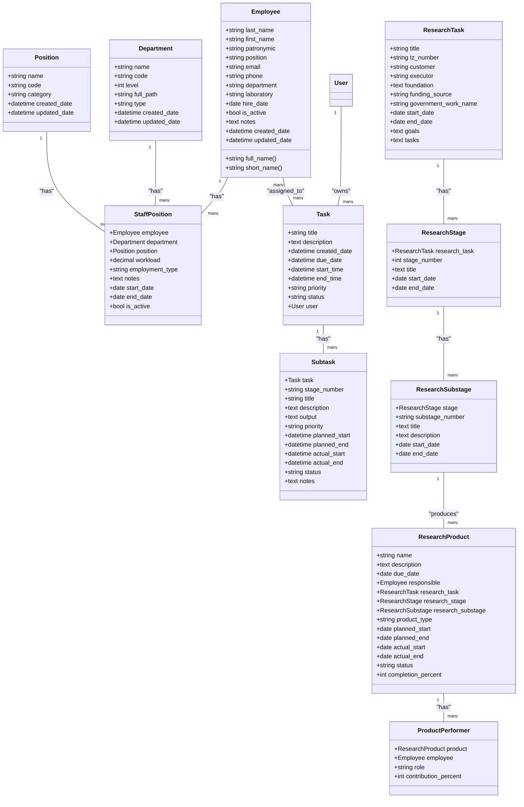
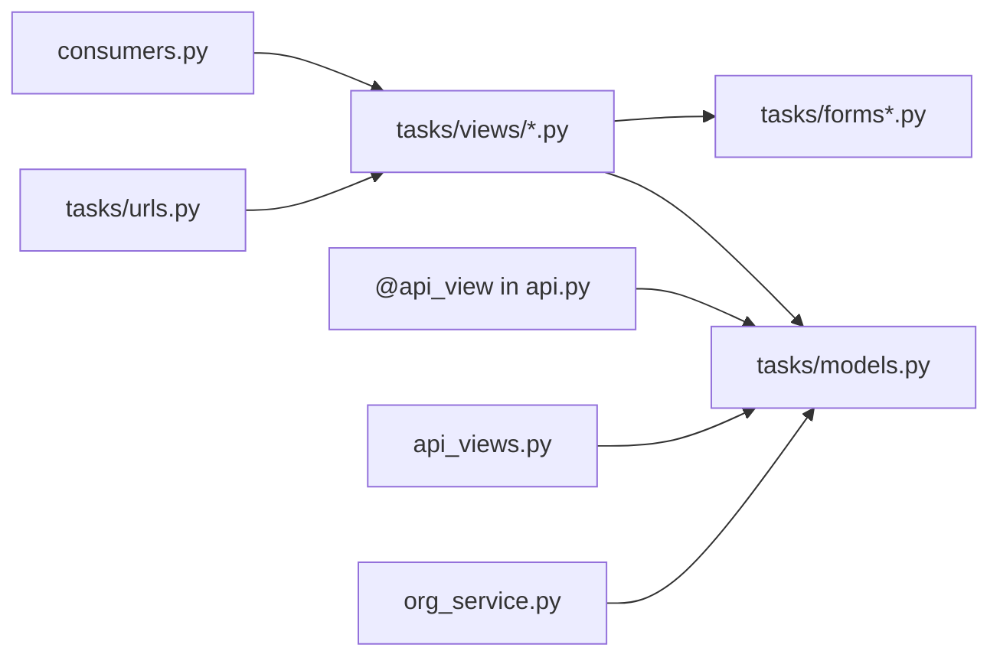

# API Endpoints and Integration

<cite>
**Referenced Files in This Document**
- [urls.py](file://tasks/urls.py)
- [api.py](file://tasks/api.py)
- [api_views.py](file://tasks/views/api_views.py)
- [consumers.py](file://tasks/consumers.py)
- [models.py](file://tasks/models.py)
- [settings.py](file://taskmanager/settings.py)
- [test_api.py](file://tasks/tests/test_api.py)
- [task_views.py](file://tasks/views/task_views.py)
- [employee_views.py](file://tasks/views/employee_views.py)
- [research_views.py](file://tasks/views/research_views.py)
- [product_views.py](file://tasks/views/product_views.py)
- [import_views.py](file://tasks/views/import_views.py)
- [org_service.py](file://tasks/services/org_service.py)
- [taskmanager/urls.py](file://taskmanager/urls.py)
</cite>

## Table of Contents
1. [Introduction](#introduction)
2. [Project Structure](#project-structure)
3. [Core Components](#core-components)
4. [Architecture Overview](#architecture-overview)
5. [Detailed Component Analysis](#detailed-component-analysis)
6. [Dependency Analysis](#dependency-analysis)
7. [Performance Considerations](#performance-considerations)
8. [Troubleshooting Guide](#troubleshooting-guide)
9. [Conclusion](#conclusion)
10. [Appendices](#appendices)

## Introduction
This document describes the Task Manager’s REST API and integration endpoints. It covers HTTP endpoints for task management, research projects, and employee data services, along with AJAX endpoints for real-time functionality, WebSocket connections for live updates, and real-time interaction patterns. It also documents authentication, error handling, API versioning strategy, backward compatibility, deprecation policies, third-party integrations, webhooks, external service communication, rate limiting, security, and performance optimization. Client implementation examples and SDK usage guidelines are included.

## Project Structure
The Task Manager is a Django application with a modular structure:
- URL routing aggregates views under a single include for the tasks app.
- Views are grouped by domain: task, employee, research, product, import, and API helpers.
- Models define core entities: Task, Employee, Department, StaffPosition, ResearchTask, ResearchStage, ResearchSubstage, ResearchProduct, and ProductPerformer.
- ASGI WebSocket consumer enables live updates per task room.
- Settings configure authentication, logging, caching, and static/media assets.

**Diagram sources**
- [taskmanager/urls.py:1-11](file://taskmanager/urls.py#L1-L11)
- [tasks/urls.py:1-100](file://tasks/urls.py#L1-L100)
- [tasks/views/__init__.py:1-11](file://tasks/views/__init__.py#L1-L11)
- [tasks/consumers.py:1-36](file://tasks/consumers.py#L1-L36)
- [taskmanager/settings.py:1-288](file://taskmanager/settings.py#L1-L288)

**Section sources**
- [taskmanager/urls.py:1-11](file://taskmanager/urls.py#L1-L11)
- [tasks/urls.py:1-100](file://tasks/urls.py#L1-L100)
- [tasks/views/__init__.py:1-11](file://tasks/views/__init__.py#L1-L11)

## Core Components
- Authentication: Login-required decorators protect most endpoints. Session-based authentication is used via Django’s built-in middleware.
- REST endpoints: A small subset of endpoints is implemented with Django REST Framework decorators and Response objects.
- AJAX endpoints: Dedicated handlers return JSON for dynamic UI updates.
- Real-time: WebSocket consumer groups tasks by task_id for live updates.
- Import/export: DOCX and Excel importers support research and staff data ingestion.
- Organization service: Optimized queries for hierarchical department structures.

Key capabilities:
- Task CRUD, status transitions, time tracking, assignment.
- Employee CRUD, search, and organizational filtering.
- Research project hierarchy (task → stage → substage → product) with performer assignment.
- AJAX-assisted UI updates for task status and assignees.
- WebSocket live updates per task.

**Section sources**
- [api.py:1-39](file://tasks/api.py#L1-L39)
- [api_views.py:1-130](file://tasks/views/api_views.py#L1-L130)
- [consumers.py:1-36](file://tasks/consumers.py#L1-L36)
- [models.py:1-858](file://tasks/models.py#L1-L858)
- [org_service.py:1-53](file://tasks/services/org_service.py#L1-L53)

## Architecture Overview
The system combines traditional Django views with lightweight REST endpoints and real-time features:
- HTTP endpoints are routed via tasks/urls.py and mapped to views.
- REST endpoints use @api_view and Response for JSON payloads.
- AJAX endpoints return JsonResponse for partial UI updates.
- WebSocket consumer listens for messages and broadcasts updates to a task-specific group.
- Import endpoints process uploaded files and persist structured data.

**Diagram sources**
- [tasks/urls.py:38-100](file://tasks/urls.py#L38-L100)
- [tasks/views/api_views.py:9-130](file://tasks/views/api_views.py#L9-L130)
- [tasks/consumers.py:4-36](file://tasks/consumers.py#L4-L36)
- [tasks/models.py:165-238](file://tasks/models.py#L165-L238)

## Detailed Component Analysis

### Authentication and Security
- Session-based authentication: @login_required decorator guards views. CSRF protection via middleware.
- Settings enforce secure defaults, logging, and session middleware.
- Password validators configured; login/logout handled by Django auth views.

Security highlights:
- CSRF enabled via middleware.
- Session middleware and security middleware active.
- Logging configured for tasks and general Django logs.

**Section sources**
- [api_views.py:2-3](file://tasks/views/api_views.py#L2-L3)
- [task_views.py:19-23](file://tasks/views/task_views.py#L19-L23)
- [settings.py:49-61](file://taskmanager/settings.py#L49-L61)
- [settings.py:116-129](file://taskmanager/settings.py#L116-L129)

### REST Endpoints
- GET /api/tasks/: Returns JSON list of tasks for the authenticated user.
- POST /api/quick-assign/: Assigns an employee to a task and returns success payload.

Response schemas:
- api_tasks: Array of objects with keys id, title, status, priority, due_date (ISO date).
- quick_assign: Object with success flag, task title, and employee short name.

Notes:
- quick_assign uses DRF @api_view and Response.
- api_tasks uses Django JsonResponse.

**Section sources**
- [api.py:10-21](file://tasks/api.py#L10-L21)
- [api.py:24-39](file://tasks/api.py#L24-L39)

### AJAX Endpoints
- POST/GET /task/{task_id}/assign/: AJAX task assignees. On POST sets assignees; on GET renders filtered employee list.
- POST /task/{task_id}/status/: Updates task status, start/end times, and returns formatted timestamps.
- GET /api/employee-search/: Search employees by name/email; returns paginated results.

Response schemas:
- task_assign_employees_ajax: success flag, message, assigned IDs.
- task_update_status_ajax: success flag, status, display label, start_time, end_time.
- employee_search_api: Object with results array of {id, text, email}.

Optimization:
- Department detail AJAX uses prefetch_related to minimize N+1 queries.

**Section sources**
- [api_views.py:9-45](file://tasks/views/api_views.py#L9-L45)
- [api_views.py:46-70](file://tasks/views/api_views.py#L46-L70)
- [api_views.py:72-93](file://tasks/views/api_views.py#L72-L93)
- [api_views.py:95-129](file://tasks/views/api_views.py#L95-L129)

### Task Management Endpoints
- List, detail, create, update, delete, start, finish, reset time, statistics, assign employees.
- Status transitions enforce business rules (can_start/can_complete).
- Time tracking fields: start_time, end_time; duration computed from these.

Endpoints:
- GET /, GET /task/<int:task_id>/, POST /task/create/, POST /task/<int:task_id>/update/, POST /task/<int:task_id>/delete/
- POST /task/<int:task_id>/complete/, POST /task/<int:task_id>/start/, POST /task/<int:task_id>/finish/, POST /task/<int:task_id>/reset-time/
- GET /statistics/, GET /task/<int:task_id>/assign/, GET /task/<int:task_id>/status/

Response schemas:
- task_list/detail: Rendered HTML with context; REST-style JSON not exposed here.
- task_start/finish/reset_time: Redirects with success/error messages.

**Section sources**
- [tasks/urls.py:38-50](file://tasks/urls.py#L38-L50)
- [task_views.py:19-69](file://tasks/views/task_views.py#L19-L69)
- [task_views.py:239-298](file://tasks/views/task_views.py#L239-L298)

### Employee Data Services
- List, detail, create, update, delete, toggle active, tasks, import/export, export template, search API.
- Filters: department, lab, active/inactive, search by name/email/position.
- Gantt-like timelines and research product visualization integrated in detail view.

Endpoints:
- GET /employees/, POST /employee/create/, GET /employee/<int:employee_id>/, POST /employee/<int:employee_id>/update/, POST /employee/<int:employee_id>/delete/
- POST /employee/<int:employee_id>/toggle-active/, GET /employee/<int:employee_id>/tasks/, GET /employees/import/, GET /employees/export/, GET /employees/export-template/
- GET /api/employee-search/

Response schemas:
- employee_list: Paginated list with filters and Gantt data.
- employee_detail: Comprehensive timeline of tasks, subtasks, research items, and products.
- employee_search_api: Results array of {id, text, email}.

**Section sources**
- [tasks/urls.py:52-64](file://tasks/urls.py#L52-L64)
- [employee_views.py:18-332](file://tasks/views/employee_views.py#L18-L332)
- [employee_views.py:334-700](file://tasks/views/employee_views.py#L334-L700)

### Research Project Endpoints
- List, create, edit, detail, stage/substage detail, assign performers, update product status.
- Hierarchical structure: ResearchTask → ResearchStage → ResearchSubstage → ResearchProduct.

Endpoints:
- GET /research/, POST /research/create/, GET /research/<int:task_id>/, POST /research/<int:task_id>/edit/
- GET /research/stage/<int:stage_id>/, GET /research/substage/<int:substage_id>/, GET /research/product/<int:product_id>/
- POST /research/assign/<str:item_type>/<int:item_id>/, POST /research/product/<int:product_id>/status/

Response schemas:
- research_task_detail: Includes stages, substages, products, and progress percentage.
- assign_research_performers: Accepts performers and responsible; redirects accordingly.
- update_product_status: Updates status and returns JSON for AJAX.

**Section sources**
- [tasks/urls.py:73-87](file://tasks/urls.py#L73-L87)
- [research_views.py:8-86](file://tasks/views/research_views.py#L8-L86)
- [research_views.py:118-165](file://tasks/views/research_views.py#L118-L165)

### Product Assignment and Status
- GET/POST /product/<int:product_id>/assign-performers/: Assign performers with filtering by department and search.
- GET/POST /research/products/<int:pk>/status/: Update product status with AJAX support.

Response schemas:
- product_assign_performers: Renders filtered employee list with counts and selections.
- update_product_status: Success flag and status display.

**Section sources**
- [tasks/urls.py:94-99](file://tasks/urls.py#L94-L99)
- [product_views.py:28-48](file://tasks/views/product_views.py#L28-L48)
- [product_views.py:50-170](file://tasks/views/product_views.py#L50-L170)

### Import Endpoints
- POST /research/import/: Import research from DOCX; supports default performers.
- POST /staff/import/: Import staff from Excel.
- POST /task/preview-import/: Preview research structure from DOCX.

Response schemas:
- preview_import: Success flag, title, stages_count, stages array.

**Section sources**
- [tasks/urls.py:84-87](file://tasks/urls.py#L84-L87)
- [import_views.py:14-76](file://tasks/views/import_views.py#L14-L76)
- [import_views.py:77-113](file://tasks/views/import_views.py#L77-L113)

### Organization and Dashboard Endpoints
- GET /org-chart/: Organization chart rendering.
- GET /department/<int:dept_id>/ajax/: Optimized AJAX for department subtree with counts.
- GET /team/dashboard/: Team dashboard view.

Response schemas:
- department_detail_ajax: success flag, HTML snippet, children_count, staff_count.

**Section sources**
- [tasks/urls.py:89-93](file://tasks/urls.py#L89-L93)
- [api_views.py:95-129](file://tasks/views/api_views.py#L95-L129)

### WebSocket Integration
- Endpoint: /ws/task/{task_id}/ connects clients to a group named task_{task_id}.
- Messages are broadcast to all members of the group.
- Typical use: live updates to task status, assignees, or comments.

**Diagram sources**
- [consumers.py:4-36](file://tasks/consumers.py#L4-L36)

**Section sources**
- [consumers.py:1-36](file://tasks/consumers.py#L1-L36)

### Data Models Overview

**Diagram sources**
- [models.py:13-107](file://tasks/models.py#L13-L107)
- [models.py:165-238](file://tasks/models.py#L165-L238)
- [models.py:239-382](file://tasks/models.py#L239-L382)
- [models.py:384-531](file://tasks/models.py#L384-L531)
- [models.py:681-791](file://tasks/models.py#L681-L791)

## Dependency Analysis
- URL routing delegates to views; views depend on models and forms.
- REST endpoints depend on DRF decorators and Response.
- AJAX endpoints depend on JsonResponse and template rendering.
- WebSocket consumer depends on channel layer grouping.
- Organization service encapsulates optimized queries for hierarchical departments.

**Diagram sources**
- [tasks/urls.py:38-100](file://tasks/urls.py#L38-L100)
- [tasks/views/api_views.py:1-130](file://tasks/views/api_views.py#L1-L130)
- [tasks/consumers.py:1-36](file://tasks/consumers.py#L1-L36)
- [tasks/services/org_service.py:1-53](file://tasks/services/org_service.py#L1-L53)

**Section sources**
- [tasks/urls.py:38-100](file://tasks/urls.py#L38-L100)
- [tasks/views/api_views.py:1-130](file://tasks/views/api_views.py#L1-L130)
- [tasks/consumers.py:1-36](file://tasks/consumers.py#L1-L36)
- [tasks/services/org_service.py:1-53](file://tasks/services/org_service.py#L1-L53)

## Performance Considerations
- AJAX optimization: Department detail AJAX uses prefetch_related to reduce database queries to two regardless of tree depth.
- Pagination: Employee list uses Paginator to limit response size.
- Caching: Default cache backend is disabled in development; consider enabling in production.
- GZip middleware enabled; consider enabling compression for static assets.
- Indexes on frequently filtered/sorted fields (e.g., Task, Employee, Department) improve query performance.

Recommendations:
- Enable and tune cache in production.
- Use pagination consistently for list endpoints.
- Consider Redis or database-level caching for heavy analytics endpoints.
- Monitor slow queries and add composite indexes as needed.

**Section sources**
- [api_views.py:95-129](file://tasks/views/api_views.py#L95-L129)
- [settings.py:85-99](file://taskmanager/settings.py#L85-L99)
- [settings.py:266-288](file://taskmanager/settings.py#L266-L288)
- [models.py:58-162](file://tasks/models.py#L58-L162)
- [models.py:203-209](file://tasks/models.py#L203-L209)
- [models.py:312-317](file://tasks/models.py#L312-L317)
- [models.py:565-571](file://tasks/models.py#L565-L571)
- [models.py:668-674](file://tasks/models.py#L668-L674)

## Troubleshooting Guide
Common issues and resolutions:
- Authentication failures: Ensure user is logged in; endpoints are protected by @login_required.
- Invalid AJAX requests: Verify request method and required fields; check JSON responses for success/error flags.
- WebSocket connection errors: Confirm URL pattern /ws/task/{task_id}/ and group membership.
- Import failures: Validate file formats (DOCX/Excel) and permissions; check server logs for exceptions.
- Performance issues: Use pagination, avoid N+1 queries, leverage cached data where appropriate.

Testing:
- Employee search API tested via unit test suite.

**Section sources**
- [api_views.py:9-45](file://tasks/views/api_views.py#L9-L45)
- [api_views.py:46-70](file://tasks/views/api_views.py#L46-L70)
- [api_views.py:72-93](file://tasks/views/api_views.py#L72-L93)
- [consumers.py:4-36](file://tasks/consumers.py#L4-L36)
- [test_api.py:25-38](file://tasks/tests/test_api.py#L25-L38)

## Conclusion
The Task Manager exposes a cohesive set of HTTP endpoints for task and employee management, with dedicated AJAX handlers for dynamic UI updates and a WebSocket consumer for real-time collaboration. REST endpoints are minimal but functional, complemented by robust import/export capabilities and optimized queries for hierarchical organization data. Security is enforced via session-based authentication and CSRF protection, while performance is aided by pagination, prefetching, and middleware compression.

## Appendices

### API Versioning Strategy
- Current implementation does not expose explicit versioned endpoints.
- Recommendation: Introduce versioned routes (e.g., /api/v1/tasks/) to maintain backward compatibility during changes.

### Backward Compatibility and Deprecation
- No deprecation notices observed in current code.
- Recommendation: Add deprecation headers and future-dated sunset dates for breaking changes; maintain multiple versions during transition.

### Third-Party Integrations and Webhooks
- Import endpoints integrate with DOCX and Excel parsers.
- No explicit webhook endpoints found; consider adding signature verification and retry mechanisms for external callbacks.

### Rate Limiting
- No built-in rate limiting detected.
- Recommendation: Use Django middleware or external WAF to enforce per-user or IP limits.

### Security Best Practices
- CSRF enabled; ensure frontend sends CSRF tokens for state-changing requests.
- Use HTTPS in production; configure secure cookies and HSTS.
- Sanitize and validate all inputs; avoid exposing sensitive fields in JSON responses.

### Client Implementation Examples and SDK Guidelines
- Use standard HTTP libraries to call endpoints; handle JSON responses and form submissions.
- For AJAX endpoints, parse success/error flags and update UI accordingly.
- For WebSocket, connect to /ws/task/{task_id}/ and listen for updates.
- For imports, upload files via multipart/form-data and handle returned JSON previews or results.