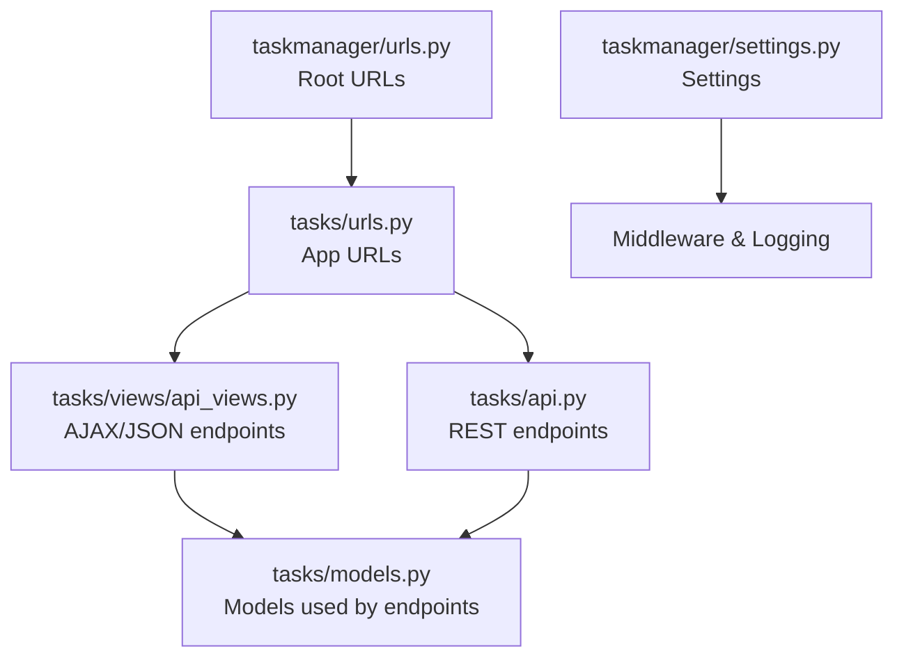
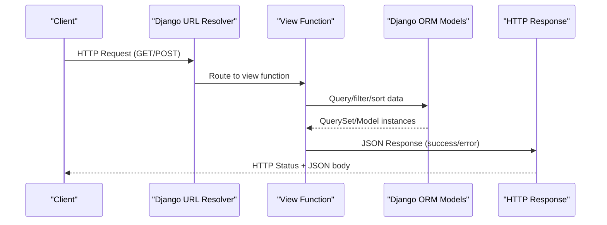
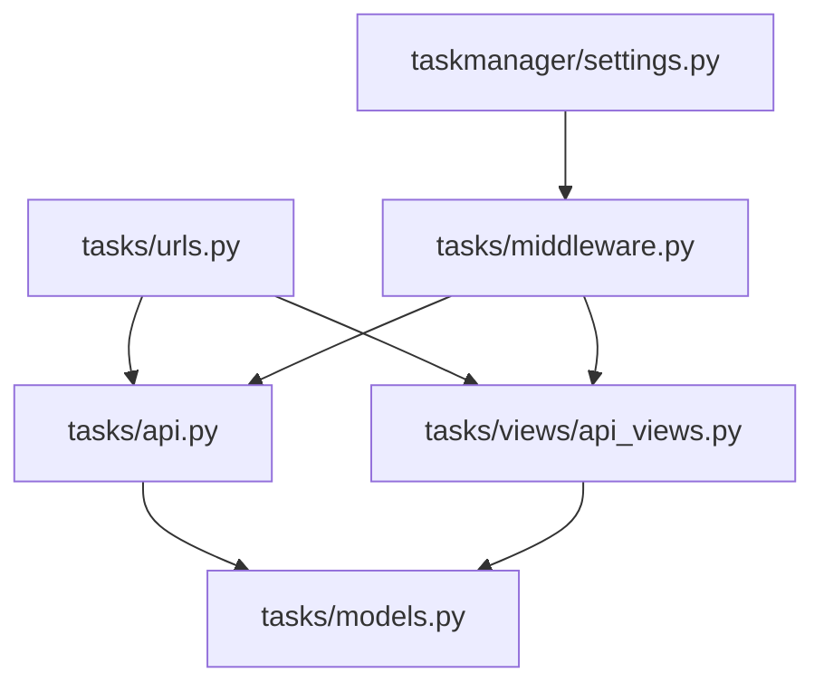

# REST API Endpoints

<cite>
**Referenced Files in This Document**
- [tasks/urls.py](file://tasks/urls.py)
- [tasks/api.py](file://tasks/api.py)
- [tasks/views/api_views.py](file://tasks/views/api_views.py)
- [tasks/tests/test_api.py](file://tasks/tests/test_api.py)
- [taskmanager/settings.py](file://taskmanager/settings.py)
- [taskmanager/urls.py](file://taskmanager/urls.py)
- [tasks/models.py](file://tasks/models.py)
- [tasks/middleware.py](file://tasks/middleware.py)
</cite>

## Table of Contents
1. [Introduction](#introduction)
2. [Project Structure](#project-structure)
3. [Core Components](#core-components)
4. [Architecture Overview](#architecture-overview)
5. [Detailed Component Analysis](#detailed-component-analysis)
6. [Dependency Analysis](#dependency-analysis)
7. [Performance Considerations](#performance-considerations)
8. [Troubleshooting Guide](#troubleshooting-guide)
9. [Conclusion](#conclusion)
10. [Appendices](#appendices)

## Introduction
This document describes the REST API endpoints exposed by the Task Manager application. It focuses on HTTP endpoints for task management, employee search, and department detail services. For each endpoint, we specify method, path, authentication requirements, request/response schemas, validation rules, error handling, status codes, and practical examples. We also document rate limiting, API versioning, backward compatibility, and CORS configuration.

## Project Structure
The API surface is primarily defined via Django URL patterns and view functions. The main routing includes:
- Root-level URLs that include the tasks app URLs
- Tasks app URLs that define endpoints for tasks, employees, subtasks, research, and organization services
- Additional REST endpoints implemented with Django REST Framework decorators

**Diagram sources**
- [taskmanager/urls.py:1-11](file://taskmanager/urls.py#L1-L11)
- [tasks/urls.py:1-100](file://tasks/urls.py#L1-L100)
- [tasks/api.py:1-39](file://tasks/api.py#L1-L39)
- [tasks/views/api_views.py:1-130](file://tasks/views/api_views.py#L1-L130)
- [taskmanager/settings.py:1-288](file://taskmanager/settings.py#L1-L288)
- [tasks/models.py:1-858](file://tasks/models.py#L1-L858)

**Section sources**
- [taskmanager/urls.py:1-11](file://taskmanager/urls.py#L1-L11)
- [tasks/urls.py:1-100](file://tasks/urls.py#L1-L100)

## Core Components
- Authentication: Most endpoints are protected by a login requirement decorator. Requests must be authenticated.
- Response format: JSON for AJAX/REST endpoints; HTML for web views.
- Pagination: Not implemented in the referenced endpoints; defaults apply.
- Validation: Basic parameter extraction and filtering; no formal schema validation.
- Error handling: Returns structured JSON on success/failure for AJAX endpoints; web views use Django messages.

Key endpoint families:
- Task management endpoints (list, detail, create, update, delete, status, assign, statistics)
- Employee endpoints (list, detail, create, update, delete, toggle active, import/export, tasks, search)
- Subtask endpoints (list, create, update, delete, bulk create, update status)
- Research endpoints (list, create, detail, edit, stage/substage detail, product detail/status, assign performers)
- Organization endpoints (department detail AJAX, team dashboard, organization chart)
- REST endpoints (task list, quick assign)

**Section sources**
- [tasks/urls.py:38-100](file://tasks/urls.py#L38-L100)
- [tasks/api.py:10-39](file://tasks/api.py#L10-L39)
- [tasks/views/api_views.py:9-129](file://tasks/views/api_views.py#L9-L129)

## Architecture Overview
The API follows a classic Django view/controller pattern with JSON responses for AJAX/REST use cases. Authentication is enforced centrally via decorators. Middleware logs requests and errors.

**Diagram sources**
- [tasks/views/api_views.py:73-93](file://tasks/views/api_views.py#L73-L93)
- [tasks/api.py:10-39](file://tasks/api.py#L10-L39)
- [tasks/models.py:165-238](file://tasks/models.py#L165-L238)

## Detailed Component Analysis

### Authentication and Authorization
- Login requirement: Views are decorated to require authentication. Unauthenticated requests receive a redirect to the login page.
- Session-based auth: Uses Django’s session middleware and authentication middleware.
- CSRF protection: Enabled by default; REST endpoints decorated with HTTP method restrictions.

Practical impact:
- Clients must authenticate and maintain a valid session.
- For programmatic access, clients should handle cookies/session and CSRF appropriately.

**Section sources**
- [tasks/views/api_views.py:9](file://tasks/views/api_views.py#L9)
- [tasks/api.py:10](file://tasks/api.py#L10)
- [taskmanager/settings.py:49-61](file://taskmanager/settings.py#L49-L61)

### Task Management Endpoints
These endpoints support listing, viewing, creating, updating, deleting tasks, assigning employees, updating status, and retrieving statistics.

- GET /api/tasks/
  - Purpose: Retrieve tasks for the authenticated user.
  - Authentication: Required
  - Query parameters: None
  - Response: Array of task objects
    - Fields: id, title, status, priority, due_date (ISO date)
  - Status codes: 200 OK
  - Example curl:
    - curl -H "Cookie: sessionid=<valid-session>" https://example.com/api/tasks/

- POST /api/quick-assign/
  - Purpose: Quickly assign an employee to a task.
  - Authentication: Required
  - Content-Type: application/json
  - Body fields: task_id, employee_id
  - Response: { success: true, task: string, employee: string }
  - Status codes: 200 OK, 404 Not Found (if task/employee missing), 400 Bad Request (validation)
  - Example curl:
    - curl -X POST -H "Content-Type: application/json" -H "Cookie: sessionid=<valid-session>" -d '{"task_id":1,"employee_id":5}' https://example.com/api/quick-assign/

- GET /task/<int:task_id>/status/
  - Purpose: Update task status via AJAX.
  - Authentication: Required
  - Method: POST
  - Form fields: status
  - Response: { success: boolean, status, status_display, start_time, end_time }
  - Status codes: 200 OK, 400 Bad Request
  - Example curl:
    - curl -X POST --data-urlencode "status=in_progress" -H "Cookie: sessionid=<valid-session>" https://example.com/task/1/status/

- GET /task/<int:task_id>/assign/
  - Purpose: Assign employees to a task.
  - Authentication: Required
  - Method: POST
  - Form fields: employees[] (multiple)
  - Response: Redirect (web view)
  - Status codes: 302 Found (redirect)

- GET /statistics/
  - Purpose: Retrieve task statistics for the authenticated user.
  - Authentication: Required
  - Response: HTML page (not JSON)
  - Status codes: 200 OK

Notes:
- Pagination: Not implemented; all tasks returned.
- Filtering/sorting: Not exposed via REST; handled in web views.

**Section sources**
- [tasks/api.py:10-39](file://tasks/api.py#L10-L39)
- [tasks/views/api_views.py:47-70](file://tasks/views/api_views.py#L47-L70)
- [tasks/views/task_views.py:366-406](file://tasks/views/task_views.py#L366-L406)

### Employee Search Endpoint
- GET /api/employee-search/
  - Purpose: Search employees by name or email.
  - Authentication: Required
  - Query parameters:
    - q (string): search term
  - Response: { results: [ { id, text, email } ] }
    - text: formatted as "<full_name> (<position>)"
  - Limit: Returns up to 10 results.
  - Status codes: 200 OK
  - Example curl:
    - curl "https://example.com/api/employee-search/?q=ivan"

Validation and behavior:
- Filters active employees.
- Case-insensitive substring match on last_name, first_name, email.
- Returns empty array if no matches.

**Section sources**
- [tasks/views/api_views.py:73-93](file://tasks/views/api_views.py#L73-L93)
- [tasks/tests/test_api.py:25-38](file://tasks/tests/test_api.py#L25-L38)

### Department Detail Services
- GET /department/<int:dept_id>/ajax/
  - Purpose: Optimized AJAX response for department details including children and staff positions.
  - Authentication: Required
  - Response: { success: true, html, children_count, staff_count }
  - Status codes: 200 OK
  - Example curl:
    - curl -H "Cookie: sessionid=<valid-session>" https://example.com/department/1/ajax/

Optimization:
- Uses prefetch_related to minimize N+1 queries.

**Section sources**
- [tasks/views/api_views.py:96-129](file://tasks/views/api_views.py#L96-L129)

### Additional REST Endpoints
- GET /api/tasks/ (tasks/api.py)
  - Returns JSON array of tasks for the authenticated user.
  - Response shape: [{ id, title, status, priority, due_date }]
  - Status codes: 200 OK

- POST /api/quick-assign/ (tasks/api.py)
  - Body: { task_id, employee_id }
  - Response: { success, task, employee }
  - Status codes: 200 OK, 404 Not Found, 400 Bad Request

**Section sources**
- [tasks/api.py:10-39](file://tasks/api.py#L10-L39)

## Dependency Analysis
- URL routing: Root includes tasks app; tasks app defines endpoint routes.
- Views: REST endpoints use DRF decorators; AJAX endpoints use Django JsonResponse.
- Models: Endpoints rely on Task, Employee, Department, StaffPosition models.
- Middleware: Request logging middleware records request/response metadata.

**Diagram sources**
- [tasks/urls.py:38-100](file://tasks/urls.py#L38-L100)
- [tasks/api.py:1-39](file://tasks/api.py#L1-L39)
- [tasks/views/api_views.py:1-130](file://tasks/views/api_views.py#L1-L130)
- [tasks/models.py:1-858](file://tasks/models.py#L1-L858)
- [taskmanager/settings.py:49-61](file://taskmanager/settings.py#L49-L61)
- [tasks/middleware.py:1-43](file://tasks/middleware.py#L1-L43)

**Section sources**
- [tasks/urls.py:38-100](file://tasks/urls.py#L38-L100)
- [tasks/api.py:1-39](file://tasks/api.py#L1-L39)
- [tasks/views/api_views.py:1-130](file://tasks/views/api_views.py#L1-L130)
- [tasks/models.py:13-238](file://tasks/models.py#L13-L238)
- [tasks/middleware.py:1-43](file://tasks/middleware.py#L1-L43)

## Performance Considerations
- Query optimization: AJAX endpoints use select_related and prefetch_related to reduce database queries.
- Pagination: Not implemented; consider adding pagination for large datasets.
- Caching: No caching configured in settings; consider enabling cache headers for read-heavy endpoints.
- Logging: Middleware logs request durations and errors; useful for monitoring.

Recommendations:
- Add pagination (limit/offset or cursor-based) for list endpoints.
- Introduce server-side caching for frequently accessed lists.
- Consider rate limiting at the application or WSGI level.

**Section sources**
- [tasks/views/api_views.py:96-129](file://tasks/views/api_views.py#L96-L129)
- [taskmanager/settings.py:85-99](file://taskmanager/settings.py#L85-L99)
- [tasks/middleware.py:9-43](file://tasks/middleware.py#L9-L43)

## Troubleshooting Guide
Common issues and resolutions:
- 401 Unauthorized: Ensure the client is authenticated and includes a valid session cookie.
- 403 Forbidden: CSRF verification failed; include CSRF token or configure CSRF handling for API clients.
- 404 Not Found: Resource does not exist or user lacks permission.
- 400 Bad Request: Invalid parameters (e.g., invalid status value).
- 500 Internal Server Error: Exceptions are logged by middleware; check logs for stack traces.

Logging:
- Requests/responses are logged with timing and status.
- Errors are logged separately with exception details.

**Section sources**
- [tasks/middleware.py:12-43](file://tasks/middleware.py#L12-L43)
- [tasks/views/api_views.py:47-70](file://tasks/views/api_views.py#L47-L70)

## Conclusion
The Task Manager exposes a focused set of REST and AJAX endpoints for task management, employee search, and organizational detail retrieval. Authentication is mandatory, and responses are JSON for AJAX/REST endpoints. While the current implementation prioritizes correctness and performance optimization, enhancements such as pagination, rate limiting, and explicit API versioning would improve robustness and developer experience.

## Appendices

### HTTP Status Codes Reference
- 200 OK: Successful GET/POST
- 302 Found: Redirect (web views)
- 400 Bad Request: Invalid request payload or parameters
- 401 Unauthorized: Missing or invalid authentication
- 403 Forbidden: CSRF or permission denied
- 404 Not Found: Resource not found
- 500 Internal Server Error: Unexpected server error

### Request/Response Schemas

- GET /api/tasks/
  - Response: Array of objects
    - id: integer
    - title: string
    - status: string (todo/in_progress/done)
    - priority: string (low/medium/high)
    - due_date: string (ISO date) or null

- POST /api/quick-assign/
  - Request body: { task_id: integer, employee_id: integer }
  - Response: { success: boolean, task: string, employee: string }

- GET /api/employee-search/?q=search-term
  - Response: { results: [ { id: integer, text: string, email: string } ] }

- GET /department/<int:dept_id>/ajax/
  - Response: { success: boolean, html: string, children_count: integer, staff_count: integer }

### Rate Limiting
- Not configured in the current settings. Consider implementing per-user or IP-based limits using middleware or WSGI middlewares.

**Section sources**
- [tasks/api.py:10-39](file://tasks/api.py#L10-L39)
- [tasks/views/api_views.py:73-93](file://tasks/views/api_views.py#L73-L93)
- [tasks/views/api_views.py:96-129](file://tasks/views/api_views.py#L96-L129)

### API Versioning and Backward Compatibility
- No explicit versioning scheme is present. To ensure backward compatibility:
  - Prefix endpoints with version (e.g., /api/v1/tasks/)
  - Maintain stable field names and shapes
  - Deprecate fields gracefully with notices

[No sources needed since this section provides general guidance]

### CORS Configuration
- No CORS middleware is enabled in settings. For browser-based clients or cross-origin requests:
  - Install django-cors-headers
  - Add to INSTALLED_APPS and MIDDLEWARE
  - Configure CORS_ALLOWED_ORIGINS for trusted origins

[No sources needed since this section provides general guidance]