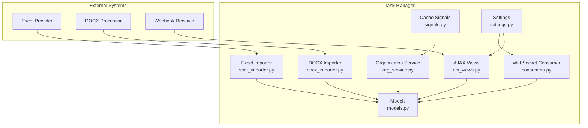
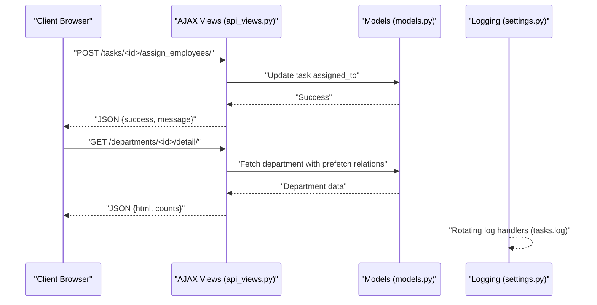
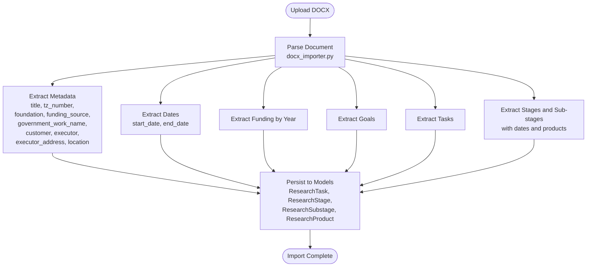
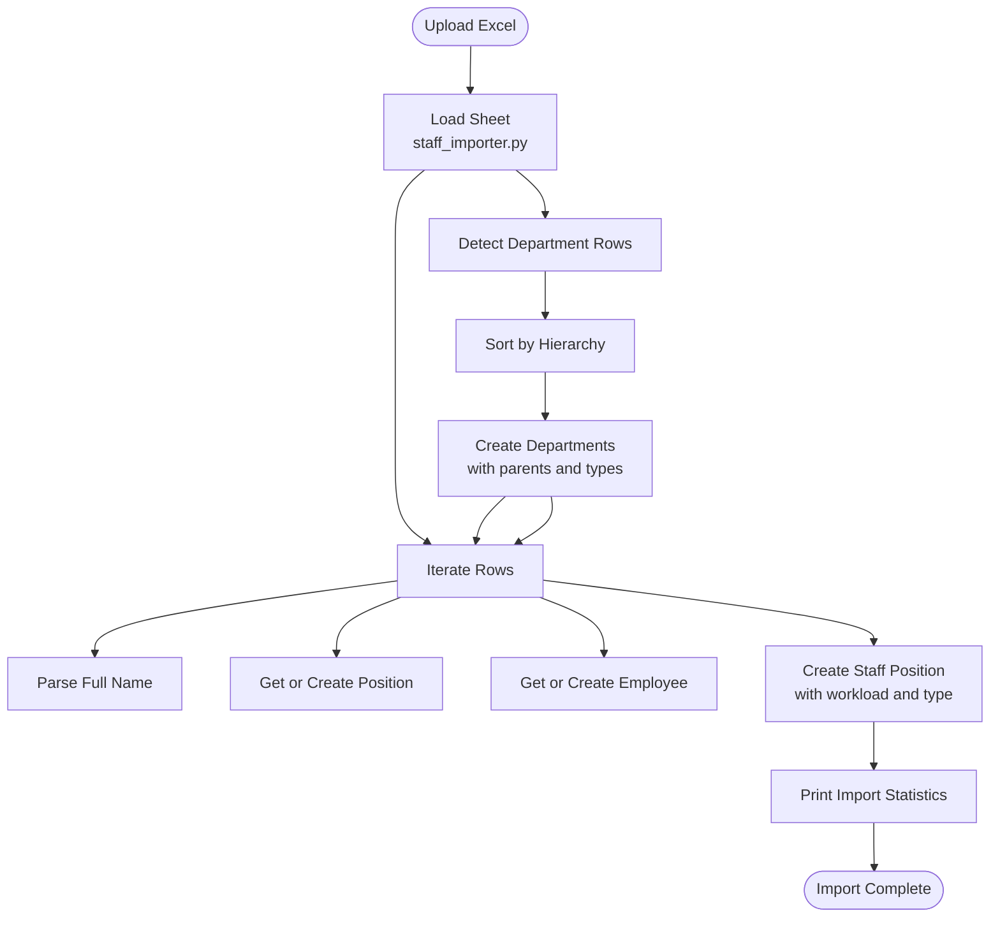
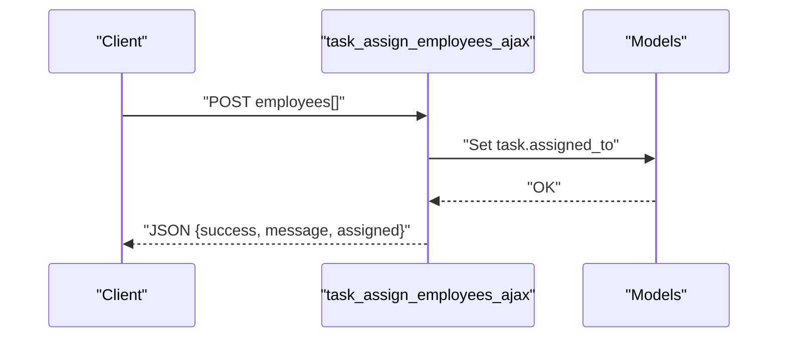
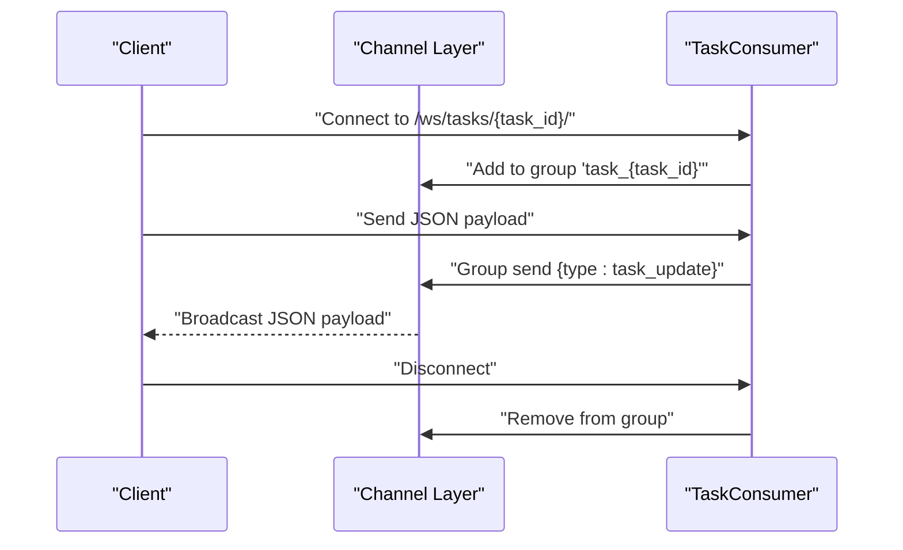
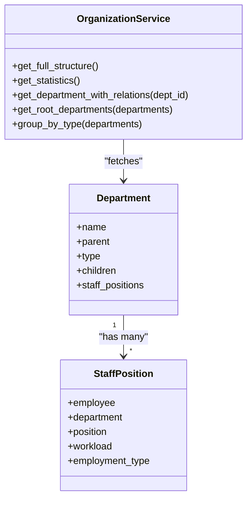
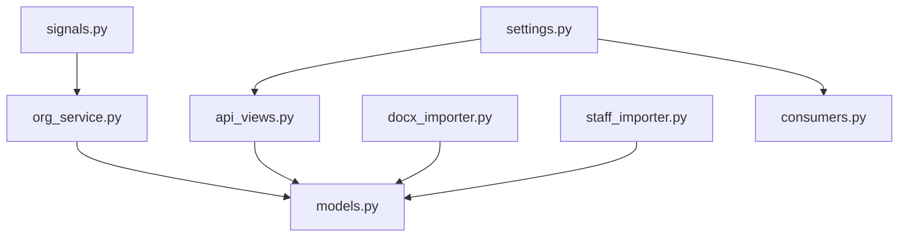

# Third-Party Integrations

<cite>
**Referenced Files in This Document**
- [docx_importer.py](file://tasks/utils/docx_importer.py)
- [staff_importer.py](file://tasks/utils/staff_importer.py)
- [api_views.py](file://tasks/views/api_views.py)
- [consumers.py](file://tasks/consumers.py)
- [org_service.py](file://tasks/services/org_service.py)
- [models.py](file://tasks/models.py)
- [settings.py](file://taskmanager/settings.py)
- [urls.py](file://taskmanager/urls.py)
- [asgi.py](file://taskmanager/asgi.py)
- [signals.py](file://tasks/signals.py)
</cite>

## Table of Contents
1. [Introduction](#introduction)
2. [Project Structure](#project-structure)
3. [Core Components](#core-components)
4. [Architecture Overview](#architecture-overview)
5. [Detailed Component Analysis](#detailed-component-analysis)
6. [Dependency Analysis](#dependency-analysis)
7. [Performance Considerations](#performance-considerations)
8. [Troubleshooting Guide](#troubleshooting-guide)
9. [Conclusion](#conclusion)

## Introduction
This document describes how the Task Manager integrates with external services and third-party systems. It focuses on:
- Webhook implementations and event notifications
- API key management and authentication for external services
- External service communication patterns
- Integration with DOCX processing services and Excel data providers
- Data transformation requirements and error handling strategies
- Security considerations, rate limiting, and service availability monitoring

The Task Manager currently supports:
- DOCX parsing for importing research task structures
- Excel-based staff and organizational data import
- Real-time updates via WebSockets
- REST-style AJAX endpoints for client interactions
- Logging and caching for observability

There are no explicit third-party webhook endpoints or external API keys configured in the codebase. The integration points documented here reflect the existing capabilities and recommended patterns for extending the system.

## Project Structure
The integration-related components are organized as follows:
- Data import utilities for DOCX and Excel
- Django views exposing AJAX endpoints
- Django Channels consumer for real-time updates
- Services for organization data retrieval
- Django settings for logging and environment configuration
- Signals for cache invalidation

**Diagram sources**
- [api_views.py:1-130](file://tasks/views/api_views.py#L1-L130)
- [consumers.py:1-36](file://tasks/consumers.py#L1-L36)
- [docx_importer.py:1-521](file://tasks/utils/docx_importer.py#L1-L521)
- [staff_importer.py:1-328](file://tasks/utils/staff_importer.py#L1-L328)
- [org_service.py:1-53](file://tasks/services/org_service.py#L1-L53)
- [models.py:1-858](file://tasks/models.py#L1-L858)
- [signals.py:1-32](file://tasks/signals.py#L1-L32)
- [settings.py:1-288](file://taskmanager/settings.py#L1-L288)

**Section sources**
- [settings.py:1-288](file://taskmanager/settings.py#L1-L288)
- [urls.py:1-11](file://taskmanager/urls.py#L1-L11)

## Core Components
- DOCX Importer: Parses research task documents and creates internal models for stages, sub-stages, and products.
- Excel Importer: Reads organizational and staff data from Excel and persists normalized entities.
- AJAX Views: Provide JSON responses for dynamic UI updates and status changes.
- WebSocket Consumer: Enables real-time event broadcasting to connected clients.
- Organization Service: Retrieves optimized organization structures and statistics.
- Cache Signals: Invalidate cached organization data on model changes.

**Section sources**
- [docx_importer.py:1-521](file://tasks/utils/docx_importer.py#L1-L521)
- [staff_importer.py:1-328](file://tasks/utils/staff_importer.py#L1-L328)
- [api_views.py:1-130](file://tasks/views/api_views.py#L1-L130)
- [consumers.py:1-36](file://tasks/consumers.py#L1-L36)
- [org_service.py:1-53](file://tasks/services/org_service.py#L1-L53)
- [signals.py:1-32](file://tasks/signals.py#L1-L32)

## Architecture Overview
The Task Manager integrates with external systems through two primary patterns:
- Batch ingestion via file uploads (Excel and DOCX)
- Real-time updates via WebSockets
- REST-like AJAX endpoints for client-driven interactions

**Diagram sources**
- [api_views.py:1-130](file://tasks/views/api_views.py#L1-L130)
- [models.py:165-238](file://tasks/models.py#L165-L238)
- [settings.py:180-249](file://taskmanager/settings.py#L180-L249)

## Detailed Component Analysis

### DOCX Processing Integration
The DOCX importer extracts structured data from research task documents and persists it into the database. It handles:
- Title, funding, customer, executor, and location extraction
- Funding per year parsing
- Goals and tasks extraction
- Stages and sub-stages with dates and products

**Diagram sources**
- [docx_importer.py:14-521](file://tasks/utils/docx_importer.py#L14-L521)
- [models.py:384-531](file://tasks/models.py#L384-L531)

**Section sources**
- [docx_importer.py:1-521](file://tasks/utils/docx_importer.py#L1-L521)
- [models.py:384-531](file://tasks/models.py#L384-L531)

### Excel Data Provider Integration
The Excel importer reads organizational and staff data from spreadsheets and normalizes it into domain entities:
- Departments with hierarchical parent-child relationships
- Positions and employees
- Staff positions linking employees to departments and positions

**Diagram sources**
- [staff_importer.py:186-328](file://tasks/utils/staff_importer.py#L186-L328)
- [models.py:532-677](file://tasks/models.py#L532-L677)

**Section sources**
- [staff_importer.py:1-328](file://tasks/utils/staff_importer.py#L1-L328)
- [models.py:532-677](file://tasks/models.py#L532-L677)

### AJAX API Endpoints
The AJAX views provide JSON responses for:
- Assigning employees to tasks
- Updating task status and timestamps
- Searching employees
- Fetching department details with optimized queries

**Diagram sources**
- [api_views.py:10-21](file://tasks/views/api_views.py#L10-L21)
- [models.py:165-197](file://tasks/models.py#L165-L197)

**Section sources**
- [api_views.py:1-130](file://tasks/views/api_views.py#L1-L130)
- [models.py:165-238](file://tasks/models.py#L165-L238)

### Real-Time Event Notifications (WebSockets)
The WebSocket consumer enables real-time updates for task-specific events:
- Clients join a room per task
- Messages broadcast to all clients in the room
- Clients receive JSON payloads with event data

**Diagram sources**
- [consumers.py:1-36](file://tasks/consumers.py#L1-L36)
- [asgi.py:1-17](file://taskmanager/asgi.py#L1-L17)

**Section sources**
- [consumers.py:1-36](file://tasks/consumers.py#L1-L36)
- [asgi.py:1-17](file://taskmanager/asgi.py#L1-L17)

### Organization Data Retrieval
The organization service provides optimized queries for:
- Full organizational structure with children and staff positions
- Statistics aggregation
- Root departments filtering
- Grouping by department type

**Diagram sources**
- [org_service.py:1-53](file://tasks/services/org_service.py#L1-L53)
- [models.py:532-677](file://tasks/models.py#L532-L677)

**Section sources**
- [org_service.py:1-53](file://tasks/services/org_service.py#L1-L53)
- [models.py:532-677](file://tasks/models.py#L532-L677)

## Dependency Analysis
Key dependencies and relationships:
- AJAX views depend on models for task and employee data
- Organization service depends on Department and StaffPosition models
- DOCX and Excel importers persist data into models
- Cache signals invalidate organization cache on model changes
- Settings configure logging and environment variables

**Diagram sources**
- [api_views.py:1-130](file://tasks/views/api_views.py#L1-L130)
- [org_service.py:1-53](file://tasks/services/org_service.py#L1-L53)
- [docx_importer.py:1-521](file://tasks/utils/docx_importer.py#L1-L521)
- [staff_importer.py:1-328](file://tasks/utils/staff_importer.py#L1-L328)
- [signals.py:1-32](file://tasks/signals.py#L1-L32)
- [settings.py:1-288](file://taskmanager/settings.py#L1-L288)

**Section sources**
- [api_views.py:1-130](file://tasks/views/api_views.py#L1-L130)
- [org_service.py:1-53](file://tasks/services/org_service.py#L1-L53)
- [docx_importer.py:1-521](file://tasks/utils/docx_importer.py#L1-L521)
- [staff_importer.py:1-328](file://tasks/utils/staff_importer.py#L1-L328)
- [signals.py:1-32](file://tasks/signals.py#L1-L32)
- [settings.py:1-288](file://taskmanager/settings.py#L1-L288)

## Performance Considerations
- AJAX endpoints use prefetching to minimize database queries for department details.
- Organization service leverages select_related and Prefetch to reduce N+1 queries.
- Logging uses rotating file handlers to manage disk usage.
- Caching is disabled by default; signals clear a specific cache key when organization data changes.

Recommendations:
- Enable a persistent cache backend in production to reduce repeated computations for organization charts.
- Add pagination for large AJAX responses to avoid excessive payloads.
- Consider background tasks for heavy imports (Excel/DOCX) to prevent request timeouts.

**Section sources**
- [api_views.py:96-129](file://tasks/views/api_views.py#L96-L129)
- [org_service.py:8-32](file://tasks/services/org_service.py#L8-L32)
- [settings.py:85-99](file://taskmanager/settings.py#L85-L99)
- [signals.py:1-32](file://tasks/signals.py#L1-L32)

## Troubleshooting Guide
Common issues and resolutions:
- Excel import errors: Validate column order and presence of required headers. Ensure department numbers follow the hierarchical pattern.
- DOCX parsing mismatches: Confirm document structure aligns with expected metadata and table layouts.
- WebSocket connection failures: Verify ASGI server configuration and channel layer settings.
- Logging not captured: Check log directory permissions and handler configurations.

Security and operational notes:
- Authentication: All AJAX endpoints require login; CSRF protection is enabled via Django middleware.
- Rate limiting: No built-in rate limiting; consider adding throttling for AJAX endpoints if exposed publicly.
- Availability monitoring: Use logging and health checks to monitor service uptime.

**Section sources**
- [staff_importer.py:186-328](file://tasks/utils/staff_importer.py#L186-L328)
- [docx_importer.py:14-521](file://tasks/utils/docx_importer.py#L14-L521)
- [consumers.py:1-36](file://tasks/consumers.py#L1-L36)
- [settings.py:180-249](file://taskmanager/settings.py#L180-L249)

## Conclusion
The Task Manager integrates with external systems primarily through file-based ingestion (Excel and DOCX) and real-time WebSockets. While there are no explicit third-party webhook endpoints or API key configurations in the codebase, the architecture supports extension points for:
- Adding webhook receivers with signature verification
- Implementing API key management for outbound integrations
- Introducing rate limiting and retry policies
- Enhancing monitoring and alerting for service availability

These patterns enable secure, scalable, and observable integrations tailored to the Task Manager’s domain.