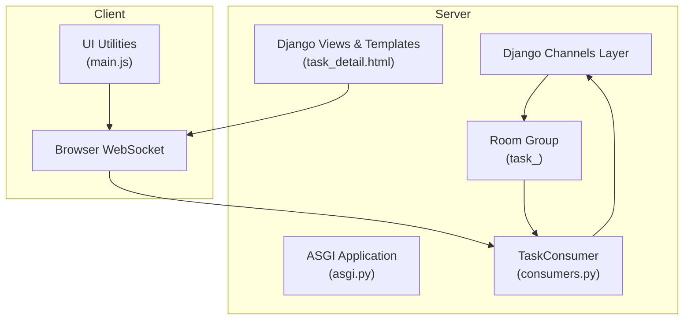
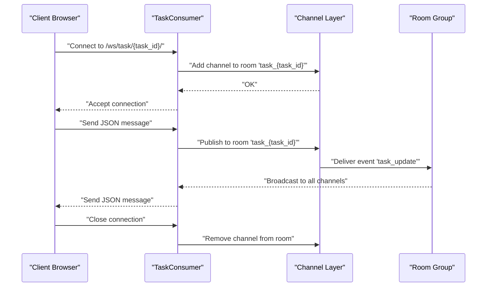
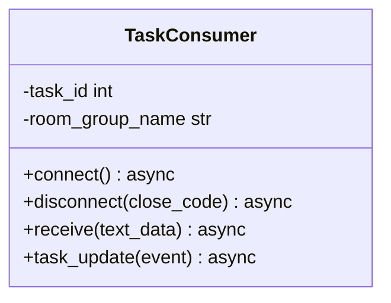
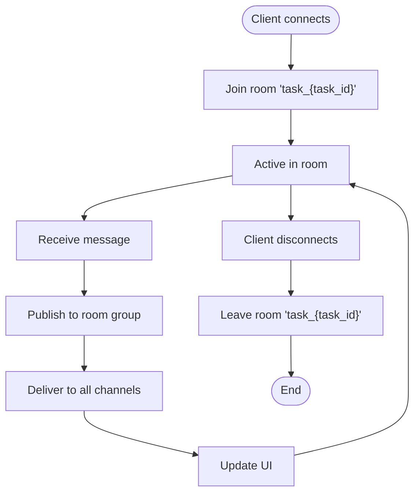
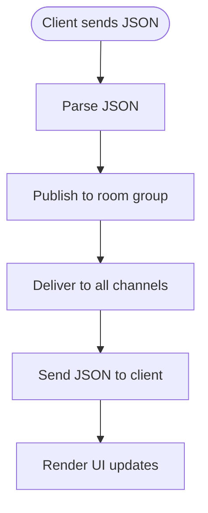
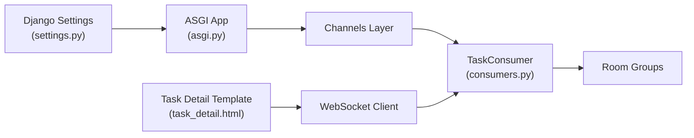

# WebSocket Integration

<cite>
**Referenced Files in This Document**
- [consumers.py](file://tasks/consumers.py)
- [urls.py](file://tasks/urls.py)
- [task_detail.html](file://tasks/templates/tasks/task_detail.html)
- [main.js](file://static/js/main.js)
- [settings.py](file://taskmanager/settings.py)
- [asgi.py](file://taskmanager/asgi.py)
- [taskmanager/urls.py](file://taskmanager/urls.py)
- [models.py](file://tasks/models.py)
- [api.py](file://tasks/api.py)
</cite>

## Table of Contents
1. [Introduction](#introduction)
2. [Project Structure](#project-structure)
3. [Core Components](#core-components)
4. [Architecture Overview](#architecture-overview)
5. [Detailed Component Analysis](#detailed-component-analysis)
6. [Dependency Analysis](#dependency-analysis)
7. [Performance Considerations](#performance-considerations)
8. [Troubleshooting Guide](#troubleshooting-guide)
9. [Conclusion](#conclusion)
10. [Appendices](#appendices)

## Introduction
This document describes the WebSocket integration for real-time communication in the Task Manager. It covers the WebSocket consumer implementation, connection lifecycle, message routing, event-driven updates, and client-side integration patterns. It also documents message formats, event types, state management patterns, broadcasting and room-based messaging, user presence tracking, security and authentication considerations, and performance optimization and monitoring approaches.

## Project Structure
The WebSocket implementation centers around Django Channels and a single consumer that manages per-task rooms. The consumer is reachable via a URL route that embeds the task identifier. The client-side integration relies on browser-native WebSocket APIs and basic UI update utilities.

**Diagram sources**
- [asgi.py:1-17](file://taskmanager/asgi.py#L1-L17)
- [consumers.py:1-36](file://tasks/consumers.py#L1-L36)
- [task_detail.html:1-211](file://tasks/templates/tasks/task_detail.html#L1-L211)
- [main.js:1-174](file://static/js/main.js#L1-L174)

**Section sources**
- [asgi.py:1-17](file://taskmanager/asgi.py#L1-L17)
- [consumers.py:1-36](file://tasks/consumers.py#L1-L36)
- [taskmanager/urls.py:1-11](file://taskmanager/urls.py#L1-L11)
- [urls.py:1-100](file://tasks/urls.py#L1-L100)
- [task_detail.html:1-211](file://tasks/templates/tasks/task_detail.html#L1-L211)
- [main.js:1-174](file://static/js/main.js#L1-L174)

## Core Components
- TaskConsumer: An asynchronous WebSocket consumer that manages per-task rooms, accepts connections, routes incoming messages to the room group, and broadcasts updates to connected clients.
- Room-based messaging: Each task has a dedicated room identified by the task ID. Clients join the room upon connecting and leave on disconnect.
- Message routing: Incoming JSON messages are broadcast to all members of the room.
- Client-side integration: The task detail page establishes a WebSocket connection and updates the UI when receiving messages.

Key implementation references:
- Consumer lifecycle and room management: [consumers.py:4-20](file://tasks/consumers.py#L4-L20)
- Message reception and broadcasting: [consumers.py:22-32](file://tasks/consumers.py#L22-L32)
- Event handler for outgoing messages: [consumers.py:34-36](file://tasks/consumers.py#L34-L36)
- URL routing for WebSocket endpoint: [urls.py:38-50](file://tasks/urls.py#L38-L50)
- Task detail template (client-side integration): [task_detail.html:1-211](file://tasks/templates/tasks/task_detail.html#L1-L211)
- Client utilities (DOM, notifications, AJAX): [main.js:1-174](file://static/js/main.js#L1-L174)

**Section sources**
- [consumers.py:1-36](file://tasks/consumers.py#L1-L36)
- [urls.py:38-50](file://tasks/urls.py#L38-L50)
- [task_detail.html:1-211](file://tasks/templates/tasks/task_detail.html#L1-L211)
- [main.js:1-174](file://static/js/main.js#L1-L174)

## Architecture Overview
The WebSocket architecture follows a simple publish-subscribe model:
- Clients connect to a WebSocket endpoint scoped to a specific task.
- The server adds the client channel to a room group keyed by the task ID.
- When a client sends a JSON message, the server publishes it to the room group.
- All clients in the room receive the message and update their UI accordingly.

**Diagram sources**
- [consumers.py:4-36](file://tasks/consumers.py#L4-L36)
- [urls.py:38-50](file://tasks/urls.py#L38-L50)

## Detailed Component Analysis

### TaskConsumer Implementation
The consumer defines the WebSocket lifecycle and message routing:
- Connection: Extracts task_id from the URL route, constructs the room group name, and joins the group.
- Disconnection: Removes the channel from the room group.
- Receive: Parses JSON payload and publishes it to the room group under a specific event type.
- Task update event: Sends the received data back to the client.

**Diagram sources**
- [consumers.py:4-36](file://tasks/consumers.py#L4-L36)

**Section sources**
- [consumers.py:4-36](file://tasks/consumers.py#L4-L36)

### URL Routing and Endpoint Exposure
The WebSocket endpoint is exposed via a URL pattern that captures the task ID. The task detail template constructs the WebSocket URL using the current task ID.

- URL pattern for task detail: [urls.py:38-50](file://tasks/urls.py#L38-L50)
- Template constructs WebSocket URL and initializes connection: [task_detail.html:1-211](file://tasks/templates/tasks/task_detail.html#L1-L211)

Note: The template does not include explicit WebSocket initialization code in the provided snippet. The client-side integration pattern is described below.

**Section sources**
- [urls.py:38-50](file://tasks/urls.py#L38-L50)
- [task_detail.html:1-211](file://tasks/templates/tasks/task_detail.html#L1-L211)

### Client-Side WebSocket Integration
The client establishes a WebSocket connection to the server, listens for incoming messages, and updates the UI. The integration leverages existing utilities for DOM manipulation and notifications.

- Establishing connection: Construct WebSocket URL using the task ID and open a WebSocket connection.
- Receiving messages: Listen for message events and parse JSON payloads.
- Updating UI: Use DOM utilities to reflect changes in real-time.
- Reconnection strategies: Implement retry with exponential backoff and jitter; handle connection errors gracefully; reconnect on page focus if applicable.

Example integration outline (no code content):
- Connect to ws://host/ws/task/{task_id}/
- On message, update task status, subtask lists, or other relevant UI areas
- On error, schedule a retry with backoff
- On close, attempt to reconnect until successful

**Section sources**
- [task_detail.html:1-211](file://tasks/templates/tasks/task_detail.html#L1-L211)
- [main.js:1-174](file://static/js/main.js#L1-L174)

### Broadcasting Mechanisms and Room-Based Messaging
- Room naming: Each task has a dedicated room named using the task ID.
- Group membership: Channels are added to and removed from the room during connect/disconnect.
- Broadcast: Messages are published to the room group and delivered to all channels.

Room membership flow:

**Diagram sources**
- [consumers.py:4-20](file://tasks/consumers.py#L4-L20)

**Section sources**
- [consumers.py:4-20](file://tasks/consumers.py#L4-L20)

### Message Formats and Event Types
- Incoming message format: JSON payload sent by clients.
- Outgoing message format: JSON payload delivered to clients.
- Event type: The consumer uses a specific event type to route messages internally.

Message handling flow:

**Diagram sources**
- [consumers.py:22-36](file://tasks/consumers.py#L22-L36)

**Section sources**
- [consumers.py:22-36](file://tasks/consumers.py#L22-L36)

### State Management Patterns
- Local UI state: Maintain minimal local state for rendering and user interactions.
- Real-time synchronization: Update state from incoming WebSocket messages.
- Idempotent updates: Ensure UI updates are resilient to out-of-order or duplicate messages.

[No sources needed since this section provides general guidance]

### Security, Authentication, and Authorization
- Authentication: The consumer does not enforce authentication. To secure the WebSocket, integrate authentication checks in the consumer’s connect method.
- Authorization: Verify that the user has permission to access the task before joining the room.
- CSRF protection: For WebSocket requests originating from the same origin, CSRF protection is generally not required. Cross-origin WebSocket requests should be restricted.
- Transport security: Use wss:// in production to encrypt traffic.

Recommended additions to the consumer:
- Enforce login requirement in connect
- Validate task ownership and permissions
- Restrict rooms to authorized users only

**Section sources**
- [consumers.py:4-20](file://tasks/consumers.py#L4-L20)

### User Presence Tracking
The current implementation does not track user presence. To add presence:
- Track channel counts per room to infer online users
- Emit presence events when users join/leave
- Maintain a simple presence map keyed by task ID

[No sources needed since this section provides general guidance]

## Dependency Analysis
The WebSocket layer depends on Django Channels and the ASGI application. The consumer interacts with the channel layer for group management and message delivery.

**Diagram sources**
- [settings.py:1-288](file://taskmanager/settings.py#L1-L288)
- [asgi.py:1-17](file://taskmanager/asgi.py#L1-L17)
- [consumers.py:1-36](file://tasks/consumers.py#L1-L36)
- [task_detail.html:1-211](file://tasks/templates/tasks/task_detail.html#L1-L211)

**Section sources**
- [settings.py:1-288](file://taskmanager/settings.py#L1-L288)
- [asgi.py:1-17](file://taskmanager/asgi.py#L1-L17)
- [consumers.py:1-36](file://tasks/consumers.py#L1-L36)
- [task_detail.html:1-211](file://tasks/templates/tasks/task_detail.html#L1-L211)

## Performance Considerations
- Minimize payload sizes: Send only necessary fields in messages.
- Debounce rapid updates: Coalesce frequent UI updates to reduce render pressure.
- Efficient rendering: Use virtual DOM or selective DOM updates.
- Backpressure handling: Throttle or buffer messages if clients cannot keep up.
- Scalability: Use a distributed channel layer backend (e.g., Redis) for multi-process deployments.
- Monitoring: Track connection counts, message rates, and latency.

[No sources needed since this section provides general guidance]

## Troubleshooting Guide
Common issues and resolutions:
- Connection failures: Verify WebSocket URL construction and that the task ID is valid.
- No messages received: Confirm the client is connected to the correct room and that the consumer is publishing to the room group.
- Authentication problems: Ensure the consumer enforces authentication and authorization.
- Reconnection loops: Implement exponential backoff and circuit breaker logic on the client.

**Section sources**
- [consumers.py:4-36](file://tasks/consumers.py#L4-L36)
- [task_detail.html:1-211](file://tasks/templates/tasks/task_detail.html#L1-L211)
- [main.js:1-174](file://static/js/main.js#L1-L174)

## Conclusion
The Task Manager implements a straightforward, room-based WebSocket system centered on per-task groups. The consumer handles connection lifecycle, message routing, and broadcasting. To enhance the system for production, integrate authentication and authorization, add presence tracking, and adopt performance and monitoring best practices.

[No sources needed since this section summarizes without analyzing specific files]

## Appendices

### Appendix A: Message and Event Reference
- Event type: task_update
- Room naming: task_{task_id}
- Message format: JSON object (payload defined by client)

**Section sources**
- [consumers.py:22-36](file://tasks/consumers.py#L22-L36)
- [urls.py:38-50](file://tasks/urls.py#L38-L50)

### Appendix B: Client Integration Checklist
- Construct WebSocket URL using the current task ID
- Open connection on page load
- Parse incoming JSON and update UI
- Implement reconnection with backoff
- Handle errors and notify users

**Section sources**
- [task_detail.html:1-211](file://tasks/templates/tasks/task_detail.html#L1-L211)
- [main.js:1-174](file://static/js/main.js#L1-L174)