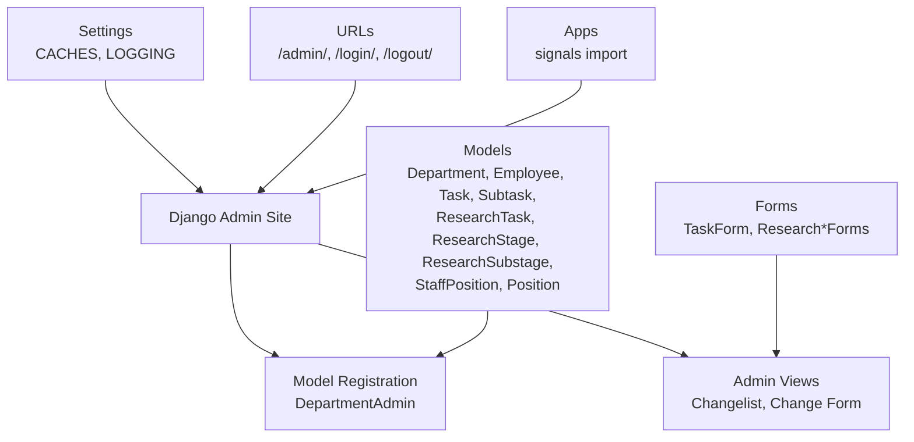
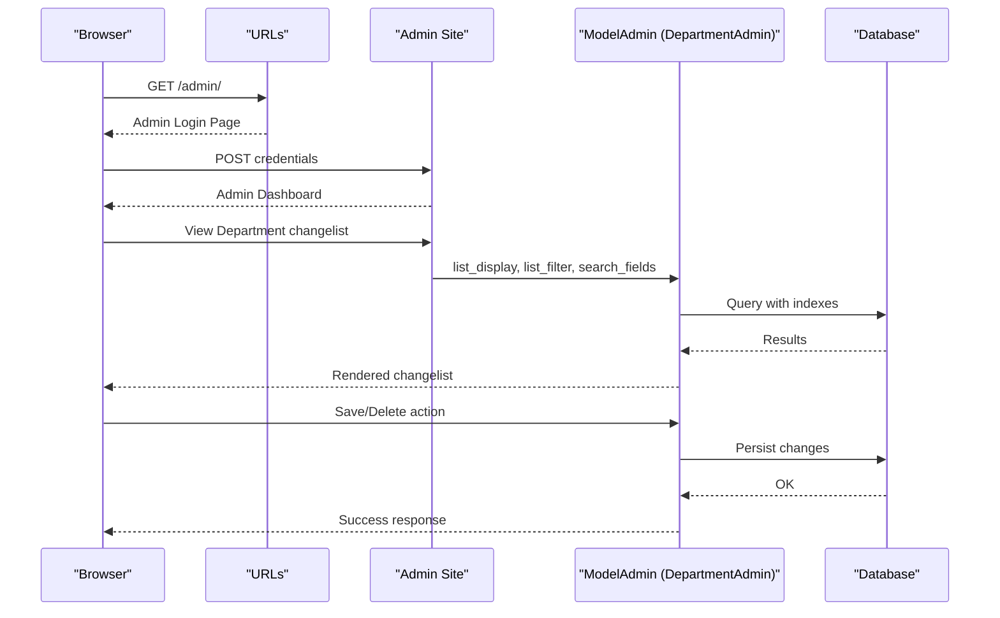
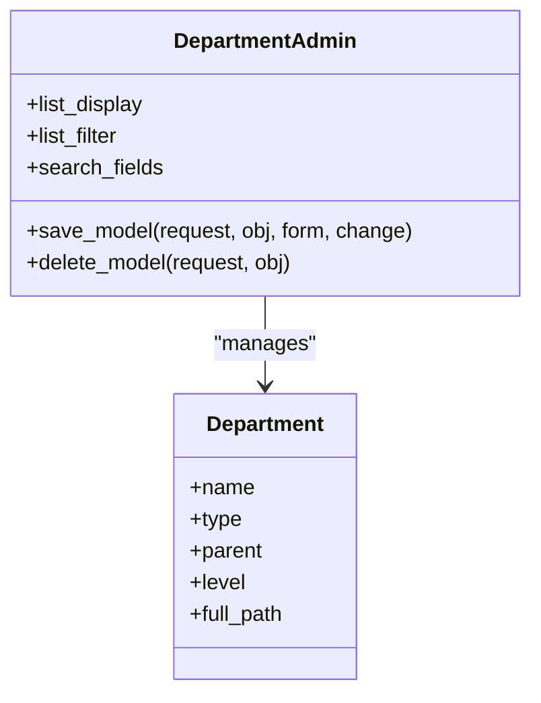
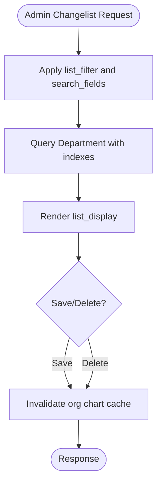
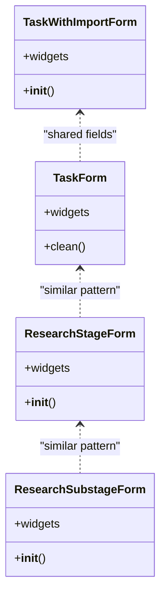
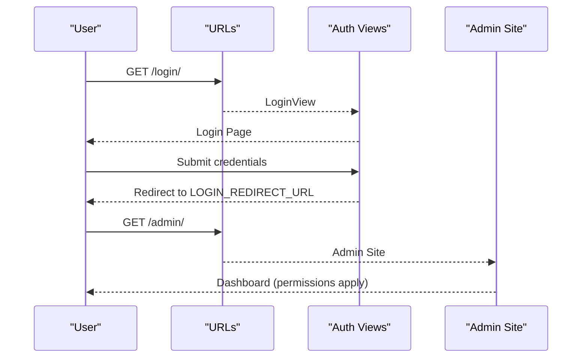
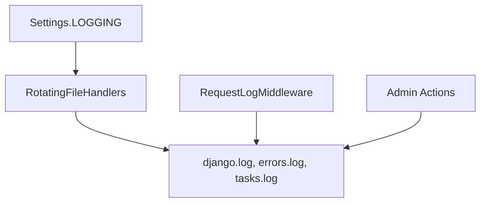
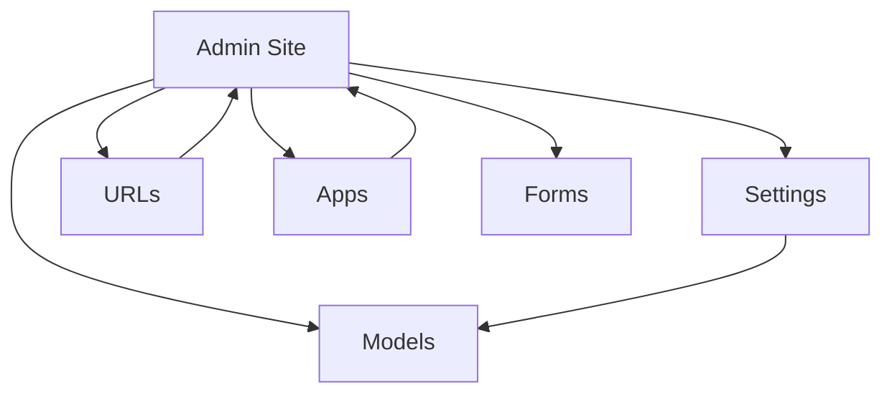

# Administration and Django Admin

<cite>
**Referenced Files in This Document**
- [tasks/admin.py](file://tasks/admin.py)
- [tasks/models.py](file://tasks/models.py)
- [tasks/forms.py](file://tasks/forms.py)
- [taskmanager/settings.py](file://taskmanager/settings.py)
- [taskmanager/urls.py](file://taskmanager/urls.py)
- [tasks/apps.py](file://tasks/apps.py)
</cite>

## Table of Contents
1. [Introduction](#introduction)
2. [Project Structure](#project-structure)
3. [Core Components](#core-components)
4. [Architecture Overview](#architecture-overview)
5. [Detailed Component Analysis](#detailed-component-analysis)
6. [Dependency Analysis](#dependency-analysis)
7. [Performance Considerations](#performance-considerations)
8. [Troubleshooting Guide](#troubleshooting-guide)
9. [Conclusion](#conclusion)

## Introduction
This document explains the Django Admin interface and administrative functionality for the Task Manager project. It covers admin configuration, model registration, custom admin views, actions and bulk operations, customization via forms and filters, permissions and access control, performance optimization and caching, logging and auditing, and security and maintenance practices. The goal is to provide a practical guide for administrators and developers working with the admin interface.

## Project Structure
The admin functionality is primarily implemented in the tasks app, with integration points in the project’s settings and URL routing. The key files include:
- Admin configuration and model registration
- Model definitions and indexes
- Forms used in admin and views
- Settings for caching, logging, and middleware
- URL routing for admin and authentication

**Diagram sources**
- [tasks/admin.py:1-21](file://tasks/admin.py#L1-L21)
- [tasks/models.py:532-678](file://tasks/models.py#L532-L678)
- [tasks/forms.py:5-224](file://tasks/forms.py#L5-L224)
- [taskmanager/settings.py:85-249](file://taskmanager/settings.py#L85-L249)
- [taskmanager/urls.py:6-11](file://taskmanager/urls.py#L6-L11)
- [tasks/apps.py:7-8](file://tasks/apps.py#L7-L8)

**Section sources**
- [tasks/admin.py:1-21](file://tasks/admin.py#L1-L21)
- [tasks/models.py:532-678](file://tasks/models.py#L532-L678)
- [tasks/forms.py:5-224](file://tasks/forms.py#L5-L224)
- [taskmanager/settings.py:85-249](file://taskmanager/settings.py#L85-L249)
- [taskmanager/urls.py:6-11](file://taskmanager/urls.py#L6-L11)
- [tasks/apps.py:7-8](file://tasks/apps.py#L7-L8)

## Core Components
- Admin configuration and model registration: The tasks app registers models with ModelAdmin classes to control list display, filtering, search, and save/delete hooks.
- Models and indexes: Models define fields, relationships, and database indexes to optimize queries and admin performance.
- Forms: Forms customize widget rendering, validation, and querysets for admin and views.
- Settings: Caching and logging are configured in settings; middleware integrates request logging.
- URL routing: Admin and authentication URLs are wired in the project’s URL configuration.

Key implementation references:
- Admin registration and hooks for Department model
- Model indexes for performance
- Form widgets and validation
- Settings for caching and logging
- URL routing for admin and auth views

**Section sources**
- [tasks/admin.py:1-21](file://tasks/admin.py#L1-L21)
- [tasks/models.py:532-678](file://tasks/models.py#L532-L678)
- [tasks/forms.py:5-224](file://tasks/forms.py#L5-L224)
- [taskmanager/settings.py:85-249](file://taskmanager/settings.py#L85-L249)
- [taskmanager/urls.py:6-11](file://taskmanager/urls.py#L6-L11)

## Architecture Overview
The admin architecture centers on Django’s ModelAdmin classes and the admin site. Administrators interact with changelists, search, filters, and change forms. The tasks app registers models and customizes their admin behavior. Middleware and logging capture operational events, while settings configure caching and database backends.

**Diagram sources**
- [taskmanager/urls.py:6-11](file://taskmanager/urls.py#L6-L11)
- [tasks/admin.py:5-19](file://tasks/admin.py#L5-L19)
- [tasks/models.py:532-584](file://tasks/models.py#L532-L584)

## Detailed Component Analysis

### Admin Configuration and Model Registration
- DepartmentAdmin registers the Department model with list_display, list_filter, and search_fields.
- save_model and delete_model hooks invalidate a cached organization chart key after changes to keep admin data consistent.
- Additional model registrations are indicated by a placeholder comment.

**Diagram sources**
- [tasks/admin.py:5-19](file://tasks/admin.py#L5-L19)
- [tasks/models.py:532-584](file://tasks/models.py#L532-L584)

**Section sources**
- [tasks/admin.py:5-19](file://tasks/admin.py#L5-L19)
- [tasks/models.py:532-584](file://tasks/models.py#L532-L584)

### Custom Admin Views and Changelist Behavior
- The admin site renders changelists based on list_display and list_filter configured in ModelAdmin classes.
- search_fields enable quick filtering by name in the admin changelist.
- save_model and delete_model hooks ensure cache consistency after edits.

**Diagram sources**
- [tasks/admin.py:5-19](file://tasks/admin.py#L5-L19)
- [tasks/models.py:532-584](file://tasks/models.py#L532-L584)

**Section sources**
- [tasks/admin.py:5-19](file://tasks/admin.py#L5-L19)
- [tasks/models.py:532-584](file://tasks/models.py#L532-L584)

### Admin Actions, Bulk Operations, and Data Management
- Django Admin supports bulk actions on changelists. While no custom actions are defined in the provided files, ModelAdmin classes can be extended to add custom actions for mass updates or deletions.
- Bulk operations benefit from existing database indexes on frequently filtered/sorted fields (e.g., type, name, parent) to improve performance.

**Section sources**
- [tasks/admin.py:5-19](file://tasks/admin.py#L5-L19)
- [tasks/models.py:532-584](file://tasks/models.py#L532-L584)

### Admin Customization: Forms, Filters, and Search
- Forms customize widget rendering, validation, and querysets for admin and views. Examples include:
  - TaskForm with datetime-local widgets and validation rules.
  - ResearchStageForm and ResearchSubstageForm with select2 widgets and active employee querysets.
  - TaskWithImportForm enabling DOCX import and dynamic field behavior.
- These form patterns can be mirrored in admin forms to enhance usability.

**Diagram sources**
- [tasks/forms.py:5-45](file://tasks/forms.py#L5-L45)
- [tasks/forms.py:96-140](file://tasks/forms.py#L96-L140)
- [tasks/forms.py:118-140](file://tasks/forms.py#L118-L140)
- [tasks/forms.py:164-201](file://tasks/forms.py#L164-L201)

**Section sources**
- [tasks/forms.py:5-45](file://tasks/forms.py#L5-L45)
- [tasks/forms.py:96-140](file://tasks/forms.py#L96-L140)
- [tasks/forms.py:118-140](file://tasks/forms.py#L118-L140)
- [tasks/forms.py:164-201](file://tasks/forms.py#L164-L201)

### Permissions, User Management, and Access Control
- Authentication and redirects are configured in settings (LOGIN_URL, LOGIN_REDIRECT_URL, LOGOUT_REDIRECT_URL).
- URL routing includes login and logout views from django.contrib.auth.
- Access control is enforced by Django’s built-in permission system; ModelAdmin classes can restrict access via has_*_permission methods if customized.

**Diagram sources**
- [taskmanager/settings.py:163-167](file://taskmanager/settings.py#L163-L167)
- [taskmanager/urls.py:8-10](file://taskmanager/urls.py#L8-L10)

**Section sources**
- [taskmanager/settings.py:163-167](file://taskmanager/settings.py#L163-L167)
- [taskmanager/urls.py:8-10](file://taskmanager/urls.py#L8-L10)

### Admin Logging, Audit Trails, and Reporting
- Logging is configured in settings with rotating file handlers for console, general logs, error logs, and task-specific logs.
- Middleware can be used to log requests; the tasks app imports middleware that may contribute to request logging.
- For audit trails, consider adding a dedicated AuditLog model and overriding ModelAdmin.save_model and delete_model to record changes.

**Diagram sources**
- [taskmanager/settings.py:180-249](file://taskmanager/settings.py#L180-L249)
- [tasks/apps.py:7-8](file://tasks/apps.py#L7-L8)

**Section sources**
- [taskmanager/settings.py:180-249](file://taskmanager/settings.py#L180-L249)
- [tasks/apps.py:7-8](file://tasks/apps.py#L7-L8)

### Security, Backup Procedures, and Maintenance
- Security settings include CSRF, session, and gzip middleware; adjust ALLOWED_HOSTS and SECRET_KEY appropriately for production.
- Backup procedures are not implemented in the provided files; implement database and media backups externally and test restore procedures regularly.
- Maintenance tasks can leverage management commands (e.g., cleanup scripts) and scheduled jobs for routine tasks.

[No sources needed since this section provides general guidance]

## Dependency Analysis
The admin depends on:
- ModelAdmin classes to render changelists and forms
- Models with appropriate indexes for efficient queries
- Settings for caching and logging
- URL routing for admin and auth views
- Middleware for request logging

**Diagram sources**
- [tasks/admin.py:1-21](file://tasks/admin.py#L1-L21)
- [tasks/models.py:532-678](file://tasks/models.py#L532-L678)
- [tasks/forms.py:5-224](file://tasks/forms.py#L5-L224)
- [taskmanager/settings.py:85-249](file://taskmanager/settings.py#L85-L249)
- [taskmanager/urls.py:6-11](file://taskmanager/urls.py#L6-L11)
- [tasks/apps.py:7-8](file://tasks/apps.py#L7-L8)

**Section sources**
- [tasks/admin.py:1-21](file://tasks/admin.py#L1-L21)
- [tasks/models.py:532-678](file://tasks/models.py#L532-L678)
- [tasks/forms.py:5-224](file://tasks/forms.py#L5-L224)
- [taskmanager/settings.py:85-249](file://taskmanager/settings.py#L85-L249)
- [taskmanager/urls.py:6-11](file://taskmanager/urls.py#L6-L11)
- [tasks/apps.py:7-8](file://tasks/apps.py#L7-L8)

## Performance Considerations
- Database indexes: Models include indexes on frequently filtered/sorted fields (e.g., parent, type, name, full_path, level). These improve admin changelist performance.
- Caching: The default cache backend is disabled (dummy cache). Enable a production-grade cache backend and consider caching admin-specific data where appropriate.
- Middleware: GZip middleware is enabled; consider enabling cache middleware for admin pages if caching is enabled.

**Section sources**
- [tasks/models.py:565-571](file://tasks/models.py#L565-L571)
- [taskmanager/settings.py:92-96](file://taskmanager/settings.py#L92-L96)
- [taskmanager/settings.py:50](file://taskmanager/settings.py#L50)

## Troubleshooting Guide
- Admin not loading: Verify admin URL is included and login credentials are valid.
- Slow changelists: Confirm indexes exist on filter/search fields; review query performance.
- Cache inconsistencies: After editing Department records, the org chart cache is invalidated; ensure cache backend is configured if needed.
- Logging issues: Check log file locations and permissions; confirm handler levels and rotation settings.

**Section sources**
- [taskmanager/urls.py:6-11](file://taskmanager/urls.py#L6-L11)
- [tasks/admin.py:11-19](file://tasks/admin.py#L11-L19)
- [taskmanager/settings.py:180-249](file://taskmanager/settings.py#L180-L249)

## Conclusion
The Django Admin interface in this project is configured with basic ModelAdmin classes for Department and associated hooks to maintain cache consistency. Customization is supported via forms and can be extended to include custom actions, advanced filters, and audit logging. Performance benefits from existing database indexes, and settings provide a foundation for caching and logging. Security and maintenance should be addressed through proper configuration and external backup/restore procedures.