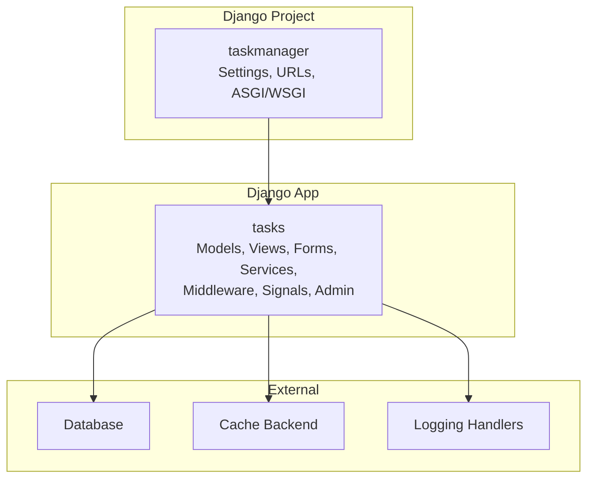
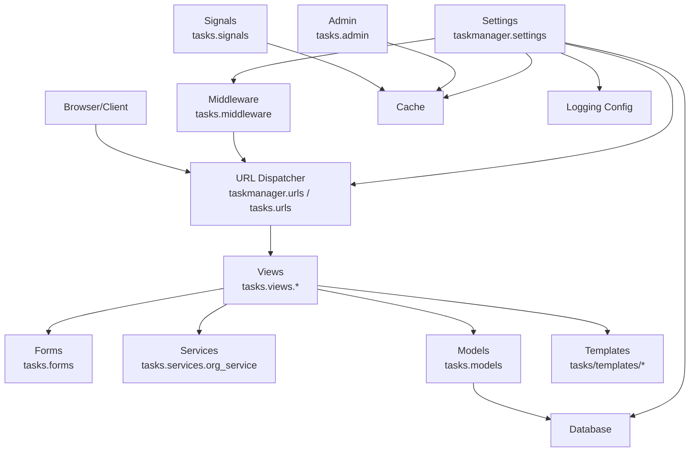
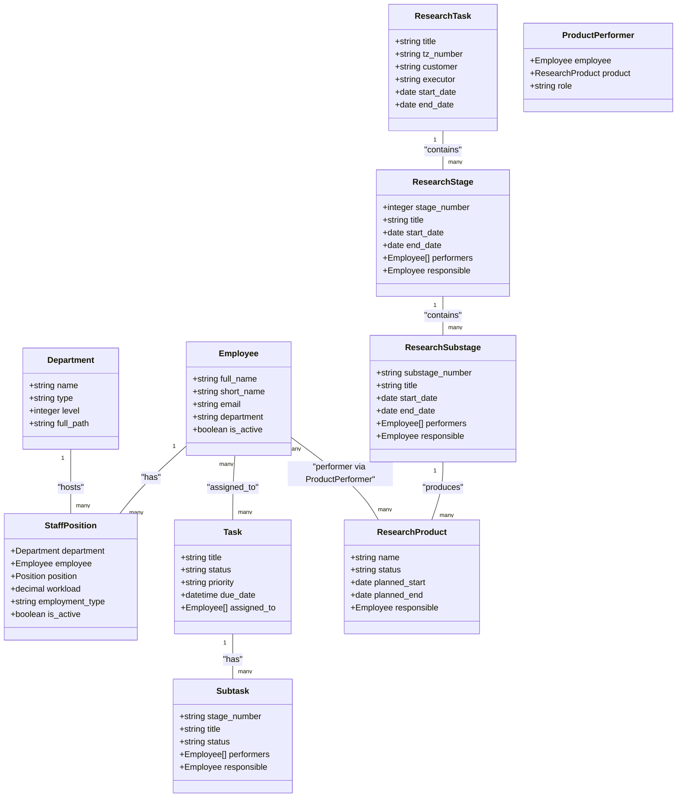
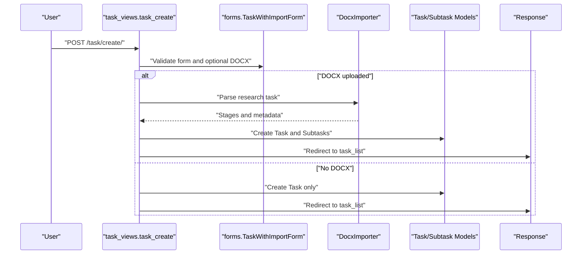
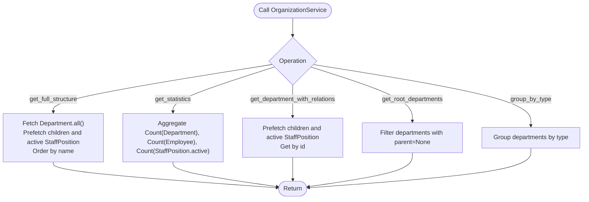
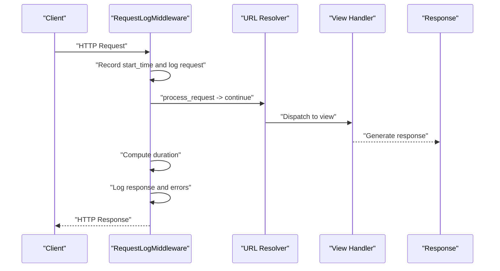
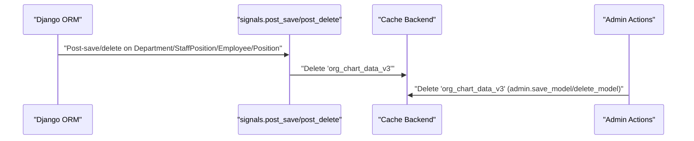
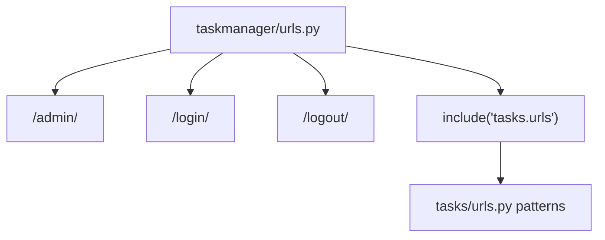
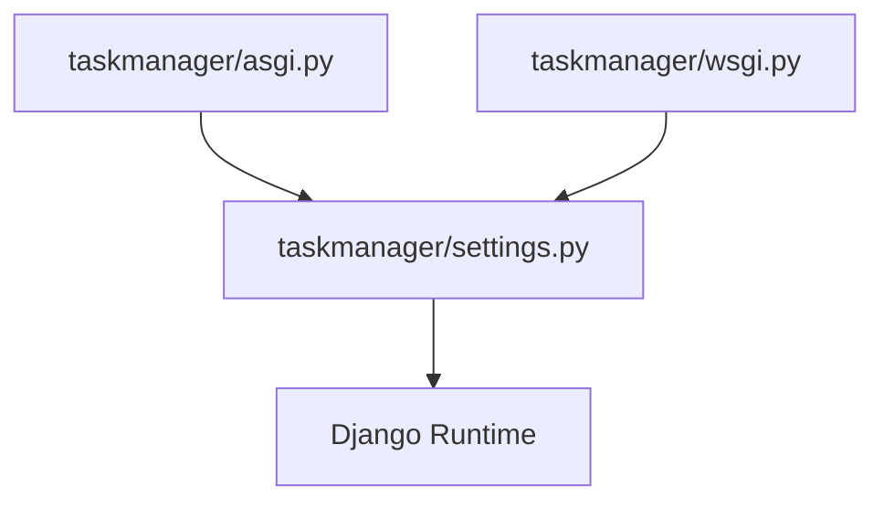
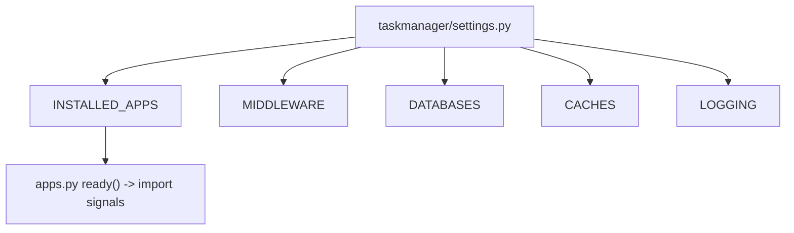

# Architecture Overview

<cite>
**Referenced Files in This Document**
- [settings.py](file://taskmanager/settings.py)
- [urls.py](file://taskmanager/urls.py)
- [urls.py](file://tasks/urls.py)
- [apps.py](file://tasks/apps.py)
- [models.py](file://tasks/models.py)
- [middleware.py](file://tasks/middleware.py)
- [signals.py](file://tasks/signals.py)
- [org_service.py](file://tasks/services/org_service.py)
- [task_views.py](file://tasks/views/task_views.py)
- [base.py](file://tasks/views/base.py)
- [forms.py](file://tasks/forms.py)
- [admin.py](file://tasks/admin.py)
- [asgi.py](file://taskmanager/asgi.py)
- [wsgi.py](file://taskmanager/wsgi.py)
- [manage.py](file://manage.py)
</cite>

## Table of Contents
1. [Introduction](#introduction)
2. [Project Structure](#project-structure)
3. [Core Components](#core-components)
4. [Architecture Overview](#architecture-overview)
5. [Detailed Component Analysis](#detailed-component-analysis)
6. [Dependency Analysis](#dependency-analysis)
7. [Performance Considerations](#performance-considerations)
8. [Troubleshooting Guide](#troubleshooting-guide)
9. [Conclusion](#conclusion)
10. [Appendices](#appendices)

## Introduction
This document presents the architecture of the Task Manager system built with Django. The system follows the Model-View-Template (MVT) pattern augmented with a service layer to encapsulate domain logic. It integrates authentication, authorization, middleware processing, and signal-driven cache invalidation. The project configuration demonstrates pragmatic choices for development (SQLite via environment-driven database URL), caching strategies, and a robust logging architecture. Cross-cutting concerns such as request logging, organization structure caching, and admin-triggered cache invalidation are central to the design.

## Project Structure
The project is organized into two primary packages:
- taskmanager: Django project configuration (settings, URLs, ASGI/WSGI, and management)
- tasks: Django application implementing models, views, forms, services, middleware, signals, and templates

Key characteristics:
- Single Django app (tasks) handles all business logic and presentation concerns
- Centralized settings define databases, middleware, templates, static/media, caching, logging, and authentication redirects
- URL routing is split between the project root and the tasks app
- Signals and middleware provide cross-cutting behaviors (cache invalidation and request logging)
- A dedicated service layer organizes organizational structure queries

**Diagram sources**
- [settings.py:38-47](file://taskmanager/settings.py#L38-L47)
- [urls.py:6-10](file://taskmanager/urls.py#L6-L10)
- [urls.py:38-99](file://tasks/urls.py#L38-L99)

**Section sources**
- [settings.py:38-47](file://taskmanager/settings.py#L38-L47)
- [urls.py:6-10](file://taskmanager/urls.py#L6-L10)
- [urls.py:38-99](file://tasks/urls.py#L38-L99)

## Core Components
- Models: Define the domain entities (Task, Subtask, Employee, Department, StaffPosition, ResearchTask, ResearchStage, ResearchSubstage, ResearchProduct, ProductPerformer) and their relationships. Indexes and constraints optimize queries and enforce uniqueness.
- Views: Implement request handlers for task CRUD, organization charts, dashboards, research workflows, and import/export features. Views leverage decorators for authentication and use forms for validation.
- Forms: Encapsulate form logic and validation for tasks, research stages, and import workflows.
- Services: Provide optimized queries for organization structure retrieval and statistics aggregation.
- Middleware: Log requests/responses and exceptions for observability.
- Signals: Invalidate cached organization chart data upon changes to organizational entities.
- Admin: Integrates cache invalidation during admin operations.

**Section sources**
- [models.py:13-80](file://tasks/models.py#L13-L80)
- [models.py:165-238](file://tasks/models.py#L165-L238)
- [models.py:239-382](file://tasks/models.py#L239-L382)
- [models.py:383-531](file://tasks/models.py#L383-L531)
- [models.py:532-677](file://tasks/models.py#L532-L677)
- [models.py:681-791](file://tasks/models.py#L681-L791)
- [task_views.py:19-69](file://tasks/views/task_views.py#L19-L69)
- [forms.py:5-44](file://tasks/forms.py#L5-L44)
- [org_service.py:4-32](file://tasks/services/org_service.py#L4-L32)
- [middleware.py:9-42](file://tasks/middleware.py#L9-L42)
- [signals.py:1-32](file://tasks/signals.py#L1-L32)
- [admin.py:5-20](file://tasks/admin.py#L5-L20)

## Architecture Overview
The system follows Django’s MVT pattern with a service layer:
- Model: Data persistence and business rules
- View: Request handling and orchestration
- Template: Presentation rendering
- Service: Domain logic and optimized queries
- Middleware: Cross-cutting request/response processing
- Signals: Event-driven cache invalidation
- Admin: Operational cache invalidation

**Diagram sources**
- [urls.py:6-10](file://taskmanager/urls.py#L6-L10)
- [urls.py:38-99](file://tasks/urls.py#L38-L99)
- [middleware.py:9-42](file://tasks/middleware.py#L9-L42)
- [signals.py:1-32](file://tasks/signals.py#L1-L32)
- [admin.py:5-20](file://tasks/admin.py#L5-L20)
- [settings.py:49-61](file://taskmanager/settings.py#L49-L61)
- [settings.py:106-110](file://taskmanager/settings.py#L106-L110)
- [settings.py:85-98](file://taskmanager/settings.py#L85-L98)
- [settings.py:180-249](file://taskmanager/settings.py#L180-L249)

## Detailed Component Analysis

### Models and Data Layer
The models define a hierarchical organization structure and task-centric workflows:
- Employee, Department, StaffPosition: Organizational hierarchy with levels and full paths
- Task, Subtask: Work breakdown with statuses, priorities, and performer assignments
- ResearchTask, ResearchStage, ResearchSubstage: Scientific research workflow with performers and responsible parties
- ResearchProduct, ProductPerformer: Research output with performers and roles

**Diagram sources**
- [models.py:13-163](file://tasks/models.py#L13-L163)
- [models.py:532-677](file://tasks/models.py#L532-L677)
- [models.py:681-791](file://tasks/models.py#L681-L791)
- [models.py:165-238](file://tasks/models.py#L165-L238)
- [models.py:239-382](file://tasks/models.py#L239-L382)
- [models.py:383-531](file://tasks/models.py#L383-L531)

**Section sources**
- [models.py:13-163](file://tasks/models.py#L13-L163)
- [models.py:165-238](file://tasks/models.py#L165-L238)
- [models.py:239-382](file://tasks/models.py#L239-L382)
- [models.py:383-531](file://tasks/models.py#L383-L531)
- [models.py:532-677](file://tasks/models.py#L532-L677)
- [models.py:681-791](file://tasks/models.py#L681-L791)

### Views and Workflow Orchestration
Views handle user interactions and coordinate with models, forms, and services:
- Task list/detail/create/update: Filter, search, sort, and paginate tasks per user
- Import from DOCX: Parse technical specifications and create research stages/substages
- Organization chart and dashboards: Render hierarchical structures and KPIs
- AJAX endpoints: Status updates and department detail retrieval

**Diagram sources**
- [task_views.py:79-179](file://tasks/views/task_views.py#L79-L179)
- [forms.py:164-200](file://tasks/forms.py#L164-L200)

**Section sources**
- [task_views.py:19-69](file://tasks/views/task_views.py#L19-L69)
- [task_views.py:79-179](file://tasks/views/task_views.py#L79-L179)
- [forms.py:164-200](file://tasks/forms.py#L164-L200)

### Service Layer
OrganizationService encapsulates optimized queries for organizational structure:
- Full structure with prefetch relations
- Statistics aggregation
- Root and grouped department retrieval

**Diagram sources**
- [org_service.py:4-53](file://tasks/services/org_service.py#L4-L53)

**Section sources**
- [org_service.py:4-53](file://tasks/services/org_service.py#L4-L53)

### Middleware and Observability
RequestLogMiddleware logs requests, responses, and errors with timing information. It leverages the tasks logger and integrates with Django’s middleware chain.

**Diagram sources**
- [middleware.py:9-42](file://tasks/middleware.py#L9-L42)

**Section sources**
- [middleware.py:9-42](file://tasks/middleware.py#L9-L42)

### Signals and Cache Invalidation
Signals invalidate the organization chart cache on changes to Department, StaffPosition, Employee, and Position. Admin actions also trigger cache clearing.

**Diagram sources**
- [signals.py:1-32](file://tasks/signals.py#L1-L32)
- [admin.py:11-19](file://tasks/admin.py#L11-L19)

**Section sources**
- [signals.py:1-32](file://tasks/signals.py#L1-L32)
- [admin.py:11-19](file://tasks/admin.py#L11-L19)

### URL Routing and Entry Points
URL routing is centralized in taskmanager/urls.py and extended by tasks/urls.py. The project exposes admin, login/logout, and delegates most routes to the tasks app.

**Diagram sources**
- [urls.py:6-10](file://taskmanager/urls.py#L6-L10)
- [urls.py:38-99](file://tasks/urls.py#L38-L99)

**Section sources**
- [urls.py:6-10](file://taskmanager/urls.py#L6-L10)
- [urls.py:38-99](file://tasks/urls.py#L38-L99)

### Deployment Entrypoints (ASGI/WSGI)
The project supports both ASGI and WSGI deployments, configured via separate entry files.

**Diagram sources**
- [asgi.py:10-16](file://taskmanager/asgi.py#L10-L16)
- [wsgi.py:10-16](file://taskmanager/wsgi.py#L10-L16)
- [settings.py:106-110](file://taskmanager/settings.py#L106-L110)

**Section sources**
- [asgi.py:10-16](file://taskmanager/asgi.py#L10-L16)
- [wsgi.py:10-16](file://taskmanager/wsgi.py#L10-L16)
- [settings.py:106-110](file://taskmanager/settings.py#L106-L110)

## Dependency Analysis
- App registration: tasks app is included in INSTALLED_APPS
- Middleware chain: includes gzip, security, session, CSRF, auth, message, X-Frame-Options, and custom RequestLogMiddleware
- Database configuration: SQLite by default, overridden by DATABASE_URL environment variable
- Caching: Dummy cache backend enabled; cache keys used for organization chart
- Logging: Rotating file handlers for console, general, errors, and tasks-specific logs
- Signals: Auto-loaded via apps.ready()

**Diagram sources**
- [settings.py:38-47](file://taskmanager/settings.py#L38-L47)
- [settings.py:49-61](file://taskmanager/settings.py#L49-L61)
- [settings.py:106-110](file://taskmanager/settings.py#L106-L110)
- [settings.py:85-98](file://taskmanager/settings.py#L85-L98)
- [settings.py:180-249](file://taskmanager/settings.py#L180-L249)
- [apps.py:7-8](file://tasks/apps.py#L7-L8)

**Section sources**
- [settings.py:38-47](file://taskmanager/settings.py#L38-L47)
- [settings.py:49-61](file://taskmanager/settings.py#L49-L61)
- [settings.py:106-110](file://taskmanager/settings.py#L106-L110)
- [settings.py:85-98](file://taskmanager/settings.py#L85-L98)
- [settings.py:180-249](file://taskmanager/settings.py#L180-L249)
- [apps.py:7-8](file://tasks/apps.py#L7-L8)

## Performance Considerations
- Database selection: SQLite is convenient for development and local runs; production-grade deployments should consider managed PostgreSQL/MySQL backends for concurrency and scaling.
- Caching: The current configuration uses a dummy cache backend. For production, enable a real cache backend and consider page-level caching and selective model caching with appropriate invalidation strategies.
- Queries: The service layer uses prefetch_related and select_related to reduce N+1 queries. Continue applying similar patterns in views and templates.
- Logging: Rotating file handlers are efficient; ensure log levels are tuned for production to avoid excessive I/O.
- Static files: Compressor settings are present; evaluate enabling compression in production builds.

[No sources needed since this section provides general guidance]

## Troubleshooting Guide
- Authentication redirects: LOGIN_URL, LOGIN_REDIRECT_URL, LOGOUT_REDIRECT_URL are configured in settings. Verify these match your URL names.
- Request logging: Enable RequestLogMiddleware to capture request/response timings and errors. Check tasks logger output.
- Cache invalidation: If organization charts appear stale after admin edits, confirm signals and admin overrides are clearing the cache key.
- Database connectivity: Ensure DATABASE_URL environment variable is set appropriately; defaults to SQLite when unset.
- Logging output: Logs are written to rotating files under the logs directory. Confirm permissions and disk space.

**Section sources**
- [settings.py:163-167](file://taskmanager/settings.py#L163-L167)
- [middleware.py:9-42](file://tasks/middleware.py#L9-L42)
- [signals.py:1-32](file://tasks/signals.py#L1-L32)
- [admin.py:11-19](file://tasks/admin.py#L11-L19)
- [settings.py:106-110](file://taskmanager/settings.py#L106-L110)
- [settings.py:180-249](file://taskmanager/settings.py#L180-L249)

## Conclusion
The Task Manager system employs a clean Django MVT architecture with a service layer for organizational queries, middleware for observability, and signals for cache consistency. Development defaults (SQLite, dummy cache) simplify local development, while the configuration supports straightforward transitions to production-grade backends and caching. The modular structure and explicit cross-cutting concerns make the system maintainable and extensible.

[No sources needed since this section summarizes without analyzing specific files]

## Appendices

### Technology Stack and Third-Party Dependencies
- Django core and contrib apps
- Environment-driven database configuration via dj-database-url
- Optional static asset compression via django-compressor (finders configured)
- Logging via Python logging with rotating file handlers

**Section sources**
- [settings.py:104-110](file://taskmanager/settings.py#L104-L110)
- [settings.py:266-288](file://taskmanager/settings.py#L266-L288)

### Architectural Patterns Used
- MVT (Model-View-Template)
- Service Layer for domain logic
- Middleware for cross-cutting concerns
- Signal-driven event handling
- Admin-driven operational hooks

**Section sources**
- [org_service.py:4-32](file://tasks/services/org_service.py#L4-L32)
- [middleware.py:9-42](file://tasks/middleware.py#L9-L42)
- [signals.py:1-32](file://tasks/signals.py#L1-L32)
- [admin.py:11-19](file://tasks/admin.py#L11-L19)