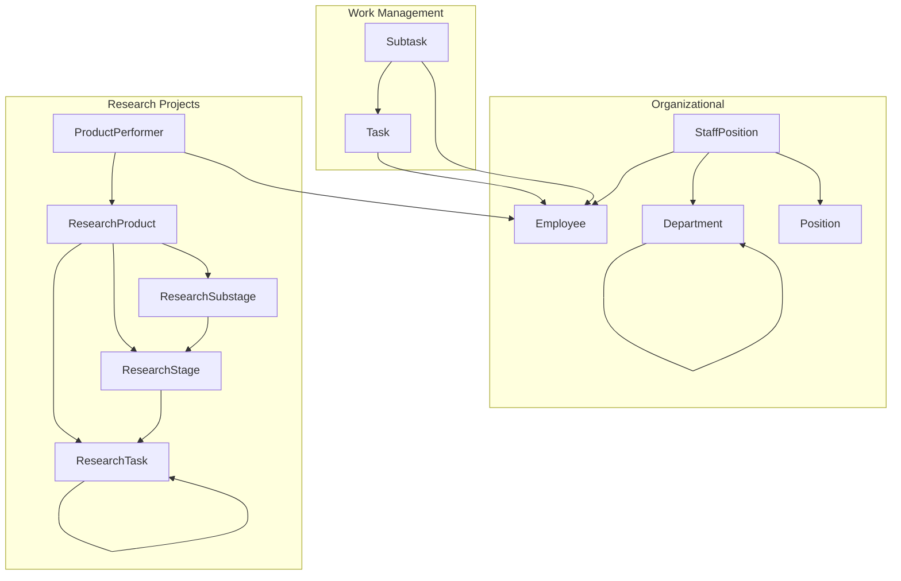
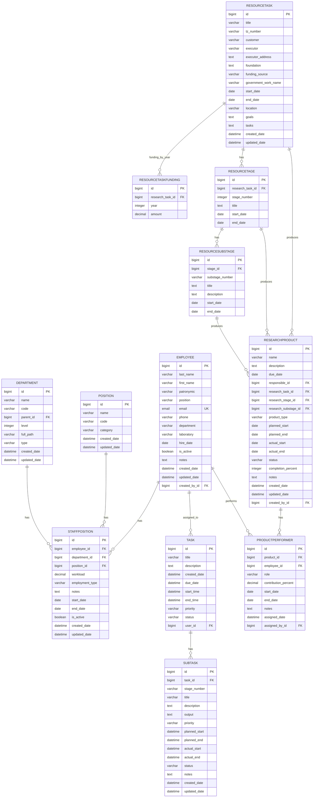
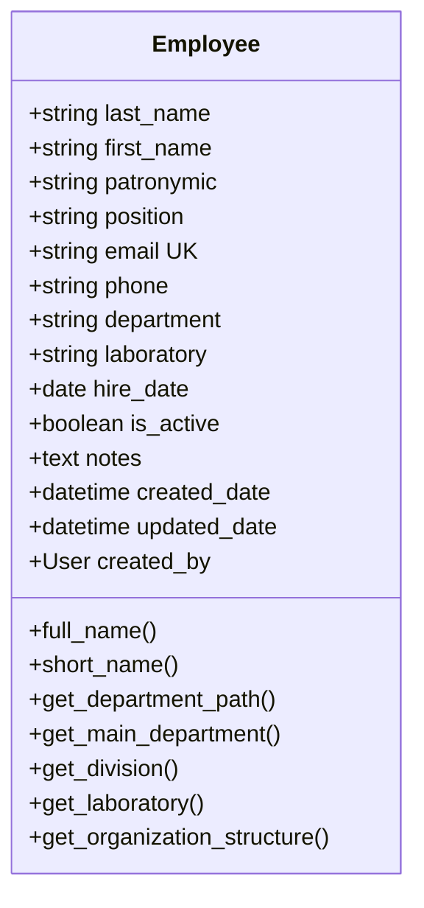
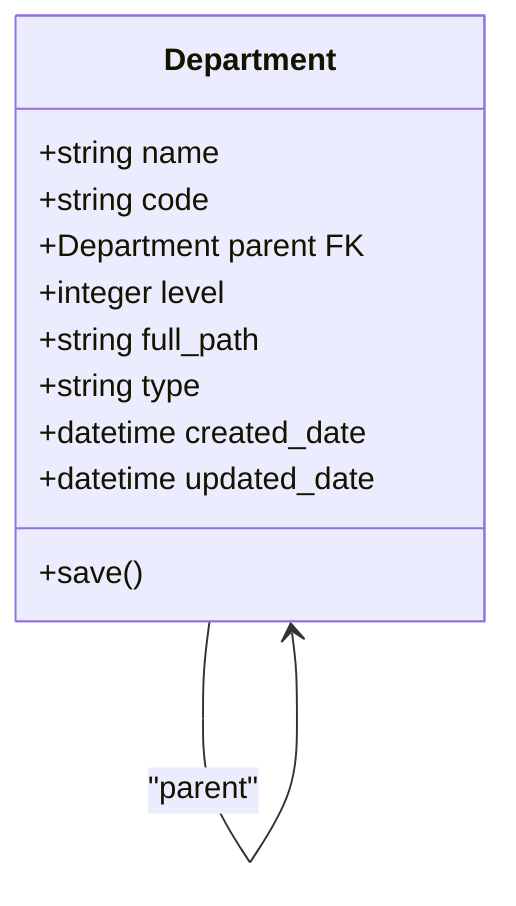
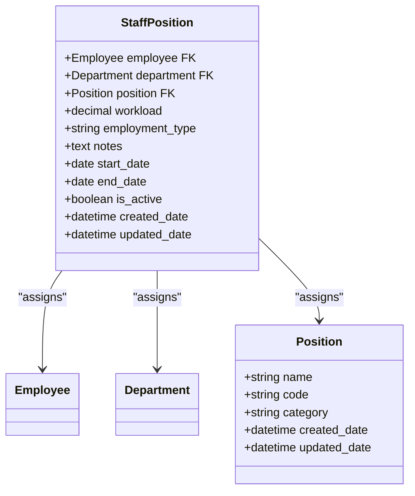
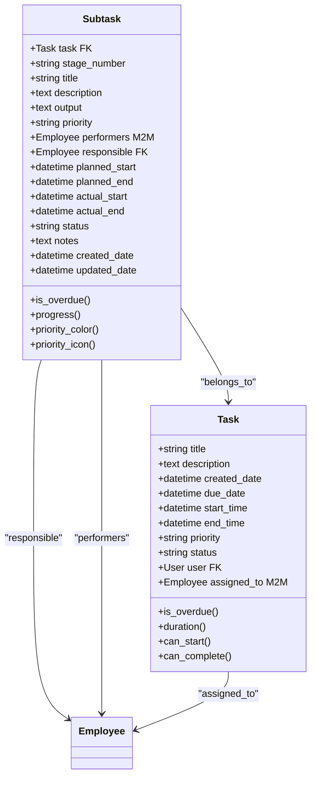
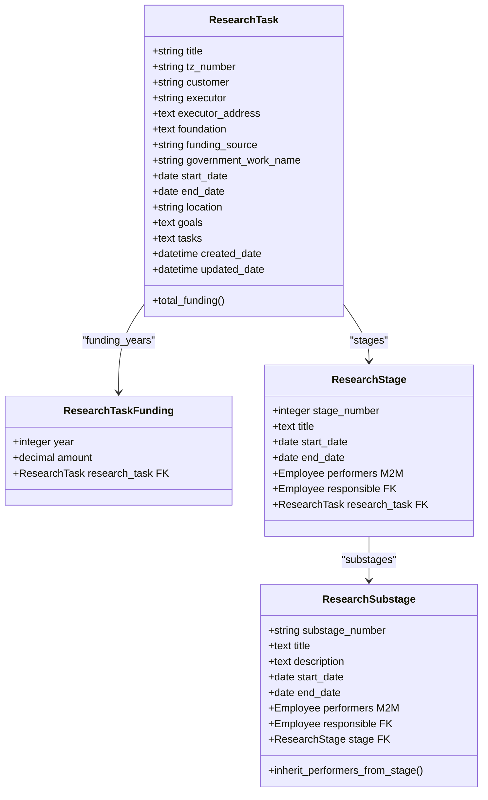
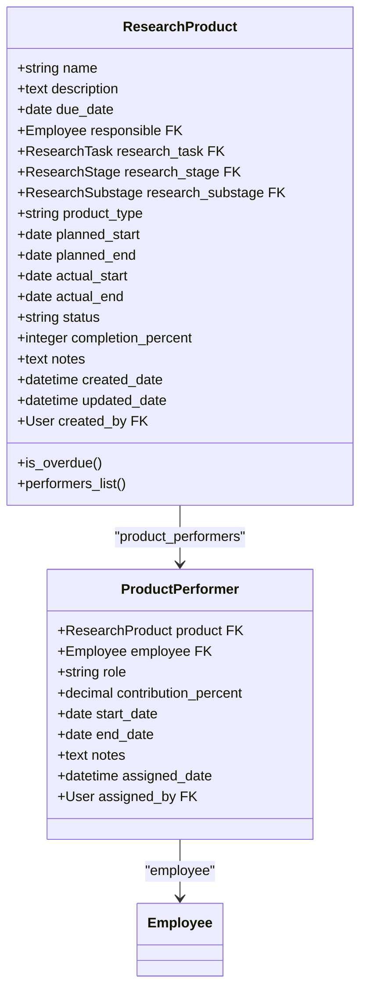
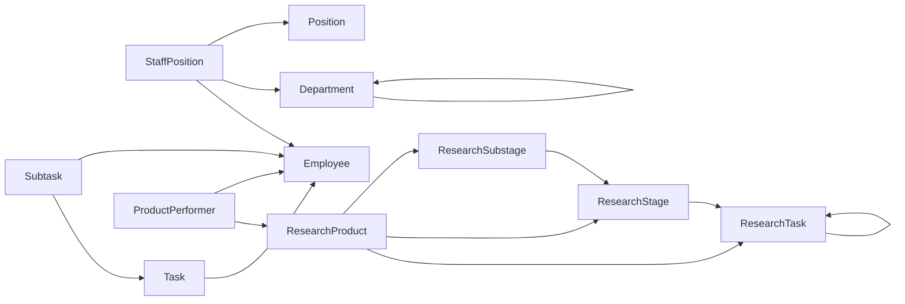

# Core Data Models

<cite>
**Referenced Files in This Document**
- [models.py](file://tasks/models.py)
- [admin.py](file://tasks/admin.py)
- [0001_initial.py](file://tasks/migrations/0001_initial.py)
- [0002_add_m2m_performers.py](file://tasks/migrations/0002_add_m2m_performers.py)
- [0003_remove_researchproduct_performers_and_more.py](file://tasks/migrations/0003_remove_researchproduct_performers_and_more.py)
- [0004_remove_researchproduct_subtask.py](file://tasks/migrations/0004_remove_researchproduct_subtask.py)
- [test_models.py](file://tasks/tests/test_models.py)
- [forms_employee.py](file://tasks/forms_employee.py)
- [forms.py](file://tasks/forms.py)
</cite>

## Table of Contents
1. [Introduction](#introduction)
2. [Project Structure](#project-structure)
3. [Core Components](#core-components)
4. [Architecture Overview](#architecture-overview)
5. [Detailed Component Analysis](#detailed-component-analysis)
6. [Dependency Analysis](#dependency-analysis)
7. [Performance Considerations](#performance-considerations)
8. [Troubleshooting Guide](#troubleshooting-guide)
9. [Conclusion](#conclusion)
10. [Appendices](#appendices)

## Introduction
This document provides comprehensive data model documentation for the Task Manager’s core entities. It covers the complete database schema with 15+ model classes, including Employees, Departments, Tasks, Subtasks, and Research Projects. It explains entity relationships, field definitions, data types, primary/foreign keys, database constraints, hierarchical organization, many-to-many relationships for performers, cascading deletion rules, indexing strategies, validation rules, and data lifecycle management.

## Project Structure
The data models are defined in a single module and evolve through Django migrations. The models are organized around:
- Organizational structure: Department hierarchy with parent-child relationships
- Human resources: Employee, Position, StaffPosition (organizational assignment)
- Work management: Task, Subtask
- Research projects: ResearchTask, ResearchStage, ResearchSubstage, ResearchProduct, ProductPerformer
- Administrative metadata: User audit fields and timestamps

**Diagram sources**
- [models.py:13-858](file://tasks/models.py#L13-L858)
- [0001_initial.py:1-376](file://tasks/migrations/0001_initial.py#L1-L376)

**Section sources**
- [models.py:13-858](file://tasks/models.py#L13-L858)
- [0001_initial.py:1-376](file://tasks/migrations/0001_initial.py#L1-L376)

## Core Components
Below are the core model classes and their responsibilities:

- Employee: Person in the organization with personal, contact, organizational, and system fields; supports derived organization structure helpers.
- Department: Hierarchical organizational unit with type, level, and full_path computed on save.
- Position: Job title with category metadata.
- StaffPosition: Assignment of Employee to Department and Position with workload, employment type, and period.
- Task: Work item with priority, status, user ownership, and many-to-many performers.
- Subtask: Stage within Task with performers, responsible, timing, and status.
- ResearchTask: Scientific research project with customer/executor info, funding source, goals/tasks, and yearly funding.
- ResearchStage: Major stage within ResearchTask with performers/responsible.
- ResearchSubstage: Sub-stage within ResearchStage with performers/responsible.
- ResearchProduct: Output/product of research with type, timeline, status, and performers via ProductPerformer.
- ProductPerformer: Link between ResearchProduct and Employee with role and contribution percentage.

**Section sources**
- [models.py:13-858](file://tasks/models.py#L13-L858)

## Architecture Overview
The data model architecture enforces referential integrity and supports hierarchical organization and research project tracking. The relationships are designed to:
- Preserve historical organization structure via Department parent-child relationships
- Allow flexible performer assignments across tasks and research stages
- Separate research product performers from direct employee links
- Enforce business constraints via model-level properties and form-level validation

**Diagram sources**
- [models.py:13-858](file://tasks/models.py#L13-L858)
- [0001_initial.py:1-376](file://tasks/migrations/0001_initial.py#L1-L376)

## Detailed Component Analysis

### Employee Model
- Purpose: Represents individuals with personal, contact, organizational, and HR-related attributes.
- Key fields: Personal (last_name, first_name, patronymic), Contact (email unique, phone), Organization (department, laboratory), HR (hire_date, is_active), System (created_date, updated_date, created_by).
- Derived helpers: full_name, short_name, and organization structure getters (department path, main department, division, laboratory).
- Indexes: composite name index, email, is_active, department.

**Diagram sources**
- [models.py:13-163](file://tasks/models.py#L13-L163)

**Section sources**
- [models.py:13-163](file://tasks/models.py#L13-L163)

### Department Model
- Purpose: Hierarchical organizational unit with type, level, and computed full_path.
- Key fields: name, code, parent (self-FK), level, full_path, type, timestamps.
- Behavior: On save, computes level and full_path based on parent.
- Indexes: parent, type, name, full_path, level.

**Diagram sources**
- [models.py:532-584](file://tasks/models.py#L532-L584)

**Section sources**
- [models.py:532-584](file://tasks/models.py#L532-L584)

### Position and StaffPosition Models
- Position: Job title with optional category.
- StaffPosition: Assignment of Employee to Department and Position with workload, employment_type, period, and activity flag.
- Unique constraint: (employee, department, position, start_date).
- Indexes: department, employee, position, is_active, employment_type.

**Diagram sources**
- [models.py:587-677](file://tasks/models.py#L587-L677)

**Section sources**
- [models.py:587-677](file://tasks/models.py#L587-L677)

### Task and Subtask Models
- Task: Title, description, dates, priority, status, user owner, many-to-many performers.
- Subtask: Stage within Task with stage_number, performers, responsible, timing, status, notes.
- Constraints: unique_together(task, stage_number) enforced by migration.
- Indexes: user, status, priority, due_date, created_date for Task; task, status, priority, planned_end for Subtask.

**Diagram sources**
- [models.py:165-382](file://tasks/models.py#L165-L382)
- [0001_initial.py:246-270](file://tasks/migrations/0001_initial.py#L246-L270)
- [0001_initial.py:215-244](file://tasks/migrations/0001_initial.py#L215-L244)
- [0001_initial.py:371-374](file://tasks/migrations/0001_initial.py#L371-L374)

**Section sources**
- [models.py:165-382](file://tasks/models.py#L165-L382)
- [0001_initial.py:215-270](file://tasks/migrations/0001_initial.py#L215-L270)
- [0001_initial.py:371-374](file://tasks/migrations/0001_initial.py#L371-L374)

### ResearchTask, ResearchStage, ResearchSubstage Models
- ResearchTask: Scientific project with customer/executor info, funding source, goals/tasks, location, and yearly funding via ResearchTaskFunding.
- ResearchStage: Major stage with performers and responsible.
- ResearchSubstage: Sub-stage with performers and responsible; inherits performers/responsible from parent stage if not set.
- Indexes: ResearchTaskFunding (year, unique_together research_task/year).

**Diagram sources**
- [models.py:384-531](file://tasks/models.py#L384-L531)
- [0003_remove_researchproduct_performers_and_more.py:62-77](file://tasks/migrations/0003_remove_researchproduct_performers_and_more.py#L62-L77)

**Section sources**
- [models.py:384-531](file://tasks/models.py#L384-L531)
- [0003_remove_researchproduct_performers_and_more.py:62-77](file://tasks/migrations/0003_remove_researchproduct_performers_and_more.py#L62-L77)

### ResearchProduct and ProductPerformer Models
- ResearchProduct: Output/product with type, timeline, status, and performers via ProductPerformer.
- ProductPerformer: Links ResearchProduct and Employee with role and contribution_percent; ensures only one responsible per product.
- Unique constraint: (product, employee) to prevent duplicate performer entries.
- Indexes: product, employee, role, contribution_percent.

**Diagram sources**
- [models.py:681-858](file://tasks/models.py#L681-L858)
- [0001_initial.py:96-140](file://tasks/migrations/0001_initial.py#L96-L140)

**Section sources**
- [models.py:681-858](file://tasks/models.py#L681-L858)
- [0001_initial.py:96-140](file://tasks/migrations/0001_initial.py#L96-L140)

### Data Validation Rules and Business Constraints
- Email uniqueness enforced at model level (Employee.email).
- Unique constraints:
  - StaffPosition: (employee, department, position, start_date)
  - Subtask: (task, stage_number)
  - ProductPerformer: (product, employee)
  - ResearchTaskFunding: (research_task, year)
- Form-level validations:
  - EmployeeForm: Phone length validation.
  - TaskForm: Time/date ordering checks (end_time >= start_time, due_date >= start_time).
- Model-level helpers:
  - Task.is_overdue, Subtask.is_overdue, ResearchProduct.is_overdue
  - Subtask.progress calculation
  - Department.save computes level/full_path
  - ProductPerformer.save ensures single responsible per product

**Section sources**
- [models.py:41-42](file://tasks/models.py#L41-L42)
- [models.py:667-668](file://tasks/models.py#L667-L668)
- [models.py:311-311](file://tasks/models.py#L311-L311)
- [models.py:839-839](file://tasks/models.py#L839-L839)
- [models.py:442-442](file://tasks/models.py#L442-L442)
- [forms_employee.py:32-39](file://tasks/forms_employee.py#L32-L39)
- [forms.py:32-44](file://tasks/forms.py#L32-L44)

### Cascading Deletion Rules
- Department: CASCADE on parent.self (hierarchical cascade)
- Task: CASCADE on user (owner deletion)
- Subtask: CASCADE on task (stage deletion)
- ResearchStage: CASCADE on research_task (project deletion)
- ResearchSubstage: CASCADE on stage (stage deletion)
- ResearchProduct: SET_NULL on research_task/stage/substage (optional linkage)
- ProductPerformer: CASCADE on product/employee (link removal)
- StaffPosition: CASCADE on employee/department/position (assignment removal)
- ResearchTaskFunding: CASCADE on research_task (funding removal)

**Section sources**
- [0001_initial.py:62-62](file://tasks/migrations/0001_initial.py#L62-L62)
- [0001_initial.py:151-151](file://tasks/migrations/0001_initial.py#L151-L151)
- [0001_initial.py:175-175](file://tasks/migrations/0001_initial.py#L175-L175)
- [0001_initial.py:191-191](file://tasks/migrations/0001_initial.py#L191-L191)
- [0001_initial.py:207-207](file://tasks/migrations/0001_initial.py#L207-L207)
- [0001_initial.py:42-42](file://tasks/migrations/0001_initial.py#L42-L42)
- [0001_initial.py:68-68](file://tasks/migrations/0001_initial.py#L68-L68)
- [0003_remove_researchproduct_performers_and_more.py:68-68](file://tasks/migrations/0003_remove_researchproduct_performers_and_more.py#L68-L68)

### Indexing Strategies
- Employee: emp_name_idx, emp_email_idx, emp_active_idx, emp_dept_idx
- Department: dept_parent_idx, dept_type_idx, dept_name_idx, dept_full_path_idx, dept_level_idx
- StaffPosition: staff_dept_idx, staff_employee_idx, staff_position_idx, staff_active_idx, staff_empl_type_idx
- Task: task_user_idx, task_status_idx, task_priority_idx, task_due_date_idx, task_created_idx
- Subtask: subtask_task_idx, subtask_status_idx, subtask_priority_idx, subtask_planned_end_idx
- ResearchTaskFunding: year (unique_together with research_task)

**Section sources**
- [0001_initial.py:292-306](file://tasks/migrations/0001_initial.py#L292-L306)
- [0001_initial.py:271-290](file://tasks/migrations/0001_initial.py#L271-L290)
- [0001_initial.py:311-330](file://tasks/migrations/0001_initial.py#L311-L330)
- [0001_initial.py:335-370](file://tasks/migrations/0001_initial.py#L335-L370)
- [0003_remove_researchproduct_performers_and_more.py:68-75](file://tasks/migrations/0003_remove_researchproduct_performers_and_more.py#L68-L75)

### Data Lifecycle Management
- Creation: auto_now_add=True on created_date fields; created_by/assigned_by set via request context in views.
- Updates: auto_now=True on updated_date fields; save hooks adjust related fields (e.g., responsible, progress).
- Archival: No explicit archival fields; soft-delete patterns are not present in models. Historical tracking occurs via timestamps and related records.

**Section sources**
- [models.py:54-56](file://tasks/models.py#L54-L56)
- [models.py:180-189](file://tasks/models.py#L180-L189)
- [models.py:304-305](file://tasks/models.py#L304-L305)
- [models.py:411-412](file://tasks/models.py#L411-L412)
- [models.py:764-771](file://tasks/models.py#L764-L771)

### Sample Data Examples
- Employee: last_name, first_name, patronymic, position, email, phone, department, laboratory, hire_date, is_active, notes.
- Department: name, code, parent, level, full_path, type.
- StaffPosition: employee, department, position, workload, employment_type, start_date, end_date, is_active.
- Task: title, description, due_date, priority, status, user, assigned_to.
- Subtask: task, stage_number, title, description, output, priority, performers, responsible, planned_start/end, actual_start/end, status, notes.
- ResearchTask: title, tz_number, customer, executor, executor_address, foundation, funding_source, government_work_name, start_date, end_date, location, goals, tasks.
- ResearchStage: research_task, stage_number, title, start_date, end_date, performers, responsible.
- ResearchSubstage: stage, substage_number, title, description, start_date, end_date, performers, responsible.
- ResearchProduct: name, description, due_date, responsible, research_task, research_stage, research_substage, product_type, planned_start, planned_end, actual_start, actual_end, status, completion_percent, notes, created_by.
- ProductPerformer: product, employee, role, contribution_percent, start_date, end_date, notes, assigned_by.

**Section sources**
- [models.py:13-858](file://tasks/models.py#L13-L858)

## Dependency Analysis
The models exhibit clear dependency chains:
- Department parent-child defines hierarchical organization
- StaffPosition binds Employee to Department and Position
- Task/Subtask form the work management hierarchy
- ResearchTask/Stage/Substage define research project hierarchy
- ResearchProduct links to research hierarchy and performers via ProductPerformer

**Diagram sources**
- [models.py:13-858](file://tasks/models.py#L13-L858)

**Section sources**
- [models.py:13-858](file://tasks/models.py#L13-L858)

## Performance Considerations
- Use select_related/prefetch_related in views to reduce N+1 queries (as seen in product listing).
- Leverage existing indexes for filtering/sorting by status, priority, dates, and hierarchy fields.
- Consider adding composite indexes for frequent filter combinations (e.g., Task by user/status/priority).
- Avoid unnecessary joins; denormalized fields like Department.full_path support fast path queries.

[No sources needed since this section provides general guidance]

## Troubleshooting Guide
- Duplicate performer entries: ProductPerformer unique_together prevents multiple entries per (product, employee).
- Overlapping staff positions: StaffPosition unique_together prevents duplicate assignments at the same period.
- Stage numbering conflicts: Subtask unique_together(task, stage_number) prevents duplicates.
- Funding duplication: ResearchTaskFunding unique_together(research_task, year) prevents duplicate years.
- Cascading deletions: Removing a parent cascades to children; confirm impact before deletion.
- Admin cache invalidation: Department admin clears org chart cache on save/delete.

**Section sources**
- [models.py:839-839](file://tasks/models.py#L839-L839)
- [models.py:667-668](file://tasks/models.py#L667-L668)
- [models.py:311-311](file://tasks/models.py#L311-L311)
- [models.py:442-442](file://tasks/models.py#L442-L442)
- [admin.py:11-19](file://tasks/admin.py#L11-L19)

## Conclusion
The Task Manager’s data models provide a robust foundation for organizational, HR, work, and research project management. They enforce referential integrity, support hierarchical organization, enable flexible performer assignments, and incorporate business rules via model and form validations. The schema is designed for maintainability and performance through strategic indexing and clear dependency relationships.

[No sources needed since this section summarizes without analyzing specific files]

## Appendices

### Migration Evolution Summary
- Initial schema with Employee, Department, Position, Task, Subtask, ResearchTask, ResearchStage, ResearchSubstage, ResearchProduct, ProductPerformer.
- Added many-to-many performers to ResearchProduct (later removed to centralize via ProductPerformer).
- Removed ResearchProduct.subtask FK and moved to ResearchTask/Stage/Substage hierarchy.
- Introduced ResearchTaskFunding with yearly funding entries and unique_together.

**Section sources**
- [0001_initial.py:1-376](file://tasks/migrations/0001_initial.py#L1-L376)
- [0002_add_m2m_performers.py:1-16](file://tasks/migrations/0002_add_m2m_performers.py#L1-L16)
- [0003_remove_researchproduct_performers_and_more.py:1-78](file://tasks/migrations/0003_remove_researchproduct_performers_and_more.py#L1-L78)
- [0004_remove_researchproduct_subtask.py:1-18](file://tasks/migrations/0004_remove_researchproduct_subtask.py#L1-L18)

### Test Coverage Highlights
- Employee: full_name, short_name, creation, str representation, is_active default.
- Department: parent-child relationships, full_path computation, level auto-detection.
- Position: creation and str representation.
- StaffPosition: creation, str representation, unique constraint verification.
- Task: creation, overdue checks, start/completion eligibility.
- Subtask: stage_number uniqueness, progress calculation, overdue checks.

**Section sources**
- [test_models.py:8-178](file://tasks/tests/test_models.py#L8-L178)