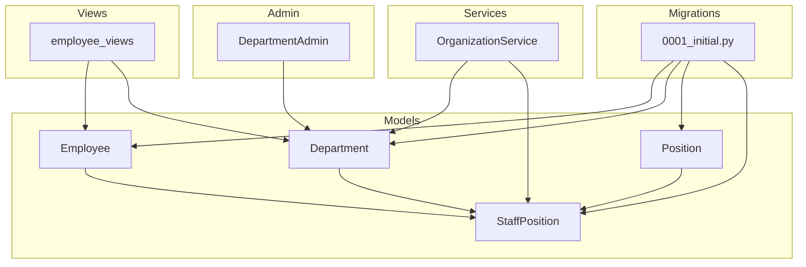
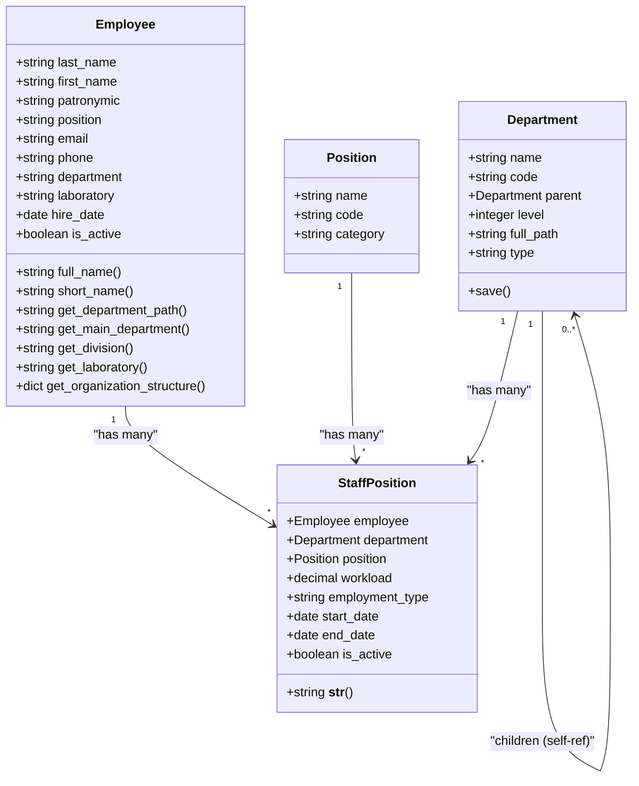
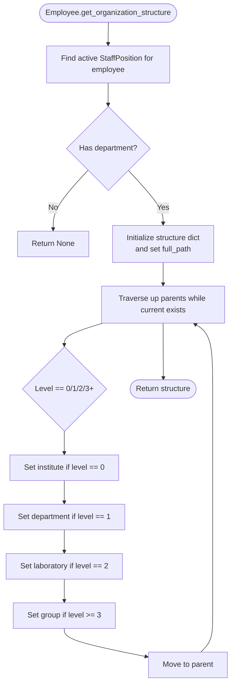
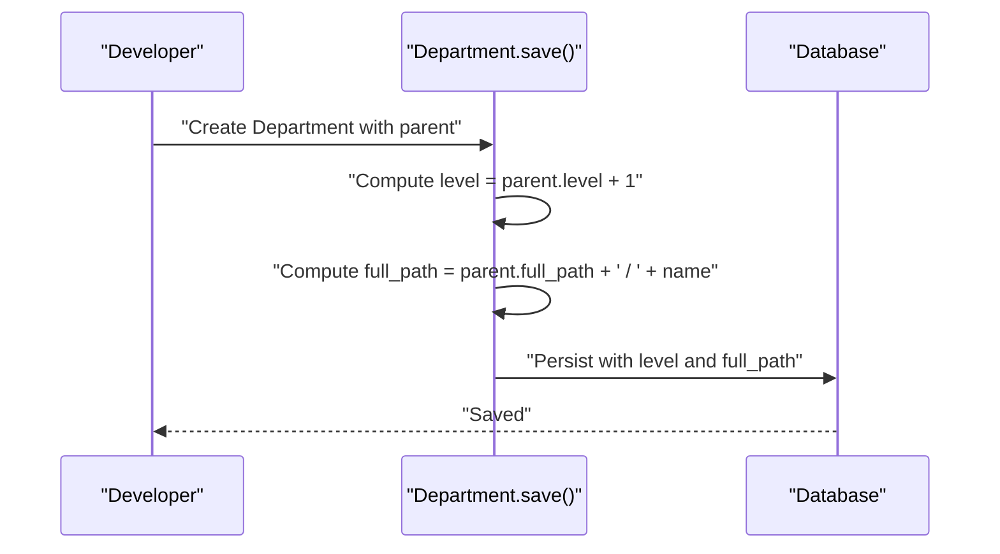
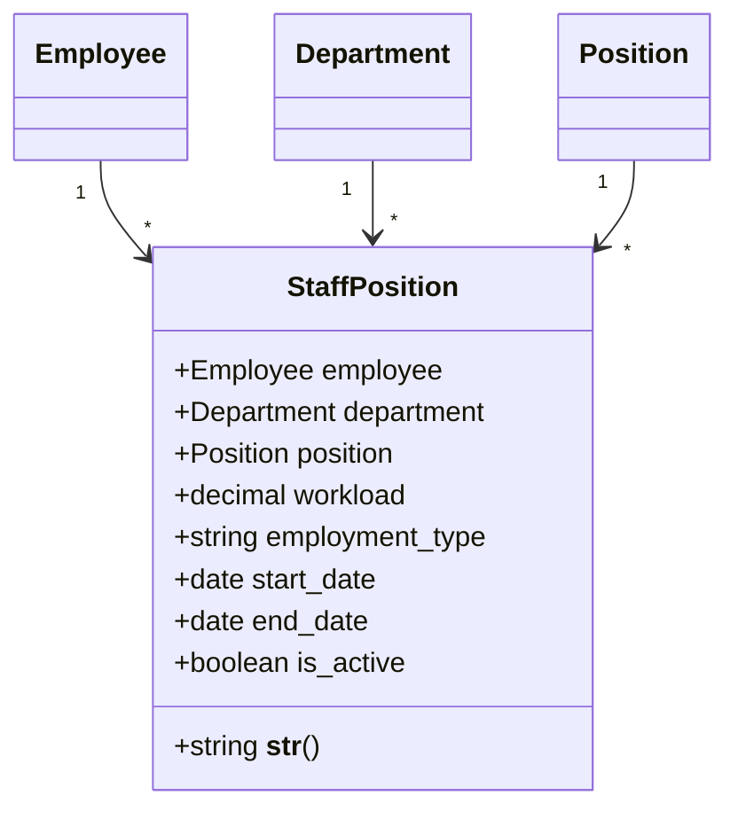
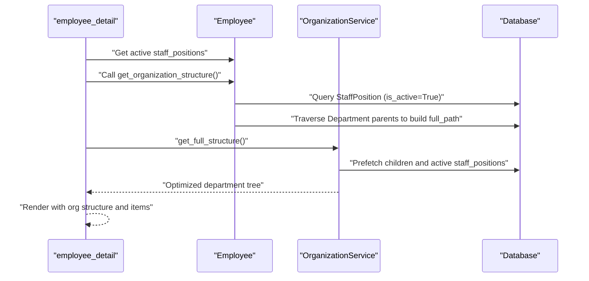
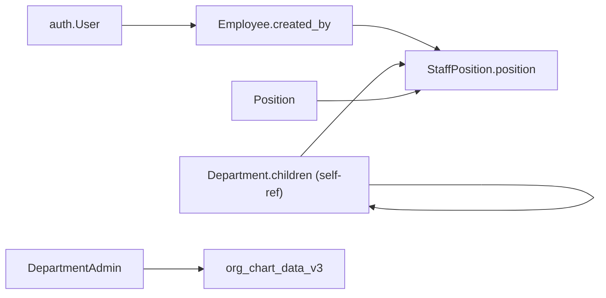

# Employee and Department Models

<cite>
**Referenced Files in This Document**
- [models.py](file://tasks/models.py)
- [admin.py](file://tasks/admin.py)
- [org_service.py](file://tasks/services/org_service.py)
- [employee_views.py](file://tasks/views/employee_views.py)
- [0001_initial.py](file://tasks/migrations/0001_initial.py)
- [test_models.py](file://tasks/tests/test_models.py)
</cite>

## Table of Contents
1. [Introduction](#introduction)
2. [Project Structure](#project-structure)
3. [Core Components](#core-components)
4. [Architecture Overview](#architecture-overview)
5. [Detailed Component Analysis](#detailed-component-analysis)
6. [Dependency Analysis](#dependency-analysis)
7. [Performance Considerations](#performance-considerations)
8. [Troubleshooting Guide](#troubleshooting-guide)
9. [Conclusion](#conclusion)

## Introduction
This document provides comprehensive data model documentation for Employee and Department entities, along with supporting models and services used for organizational reporting. It covers field definitions, validation rules, foreign key relationships, indexing strategies, and hierarchical department structure with automatic path generation. It also explains the StaffPosition model that links employees to departments and positions with workload calculations, and demonstrates practical query patterns for organizational reporting.

## Project Structure
The relevant models and supporting components are organized as follows:
- Data models: Employee, Department, Position, StaffPosition, and related research models
- Services: OrganizationService for optimized queries and aggregations
- Admin integration: Department admin clears caches on changes
- Views: Employee views integrate organization structure and reporting
- Migrations: Initial schema creation and indexes
- Tests: Model-level validation and behavior verification

**Diagram sources**
- [models.py:13-167](file://tasks/models.py#L13-L167)
- [models.py:532-585](file://tasks/models.py#L532-L585)
- [models.py:587-678](file://tasks/models.py#L587-L678)
- [org_service.py:4-32](file://tasks/services/org_service.py#L4-L32)
- [employee_views.py:335-692](file://tasks/views/employee_views.py#L335-L692)
- [admin.py:5-19](file://tasks/admin.py#L5-L19)
- [0001_initial.py:16-376](file://tasks/migrations/0001_initial.py#L16-L376)

**Section sources**
- [models.py:13-167](file://tasks/models.py#L13-L167)
- [models.py:532-585](file://tasks/models.py#L532-L585)
- [models.py:587-678](file://tasks/models.py#L587-L678)
- [org_service.py:4-32](file://tasks/services/org_service.py#L4-L32)
- [employee_views.py:335-692](file://tasks/views/employee_views.py#L335-L692)
- [admin.py:5-19](file://tasks/admin.py#L5-L19)
- [0001_initial.py:16-376](file://tasks/migrations/0001_initial.py#L16-L376)

## Core Components
This section documents the core models and their relationships, focusing on Employee, Department, Position, and StaffPosition.

- Employee
  - Purpose: Stores personal and organizational information for staff members
  - Key fields: name components, position, contact details, department, laboratory, hire date, activity status, notes, system metadata
  - Validation: Unique email constraint; optional patronymic; active/inactive flag
  - Indexes: composite name index, email, activity status, department
  - Methods: computed full_name and short_name; organization structure helpers

- Department
  - Purpose: Hierarchical organizational unit with type classification
  - Key fields: name, code, parent, level, full_path, type, timestamps
  - Validation: Self-referencing parent; automatic level and full_path computation on save
  - Indexes: parent, type, name, full_path, level
  - Methods: automatic hierarchy path generation

- Position
  - Purpose: Job title catalog with optional code and category
  - Key fields: name, code, category, timestamps
  - Indexes: none (no explicit indexes)

- StaffPosition
  - Purpose: Links Employee to Department and Position with workload and employment type
  - Key fields: employee, department, position, workload, employment_type, period, activity flag, notes, timestamps
  - Validation: Unique together constraint on employee, department, position, start_date
  - Indexes: department, employee, position, activity status, employment type
  - Methods: string representation combining employee, position, and department

**Section sources**
- [models.py:13-167](file://tasks/models.py#L13-L167)
- [models.py:532-585](file://tasks/models.py#L532-L585)
- [models.py:587-602](file://tasks/models.py#L587-L602)
- [models.py:604-678](file://tasks/models.py#L604-L678)
- [0001_initial.py:71-94](file://tasks/migrations/0001_initial.py#L71-L94)
- [0001_initial.py:52-69](file://tasks/migrations/0001_initial.py#L52-L69)
- [0001_initial.py:19-31](file://tasks/migrations/0001_initial.py#L19-L31)
- [0001_initial.py:194-213](file://tasks/migrations/0001_initial.py#L194-L213)

## Architecture Overview
The Employee-Department-Position-StaffPosition model architecture supports:
- Hierarchical department structure with automatic path generation
- Employee-to-department-and-position linkage via StaffPosition
- Workload tracking per assignment
- Efficient querying through targeted indexes and prefetching

**Diagram sources**
- [models.py:13-167](file://tasks/models.py#L13-L167)
- [models.py:532-585](file://tasks/models.py#L532-L585)
- [models.py:587-602](file://tasks/models.py#L587-L602)
- [models.py:604-678](file://tasks/models.py#L604-L678)

## Detailed Component Analysis

### Employee Model
- Fields and constraints
  - Personal: last_name, first_name, patronymic (optional)
  - Contact: email (unique), phone
  - Organization: department (choices), laboratory (choices), hire_date, is_active, notes
  - Metadata: created_date, updated_date, created_by (foreign key to User)
- Indexes
  - Composite name index for efficient sorting and filtering
  - Email uniqueness and index
  - Activity status and department filters
- Computed properties and helpers
  - full_name and short_name for display
  - get_organization_structure to extract institute/department/laboratory/group levels
  - get_main_department, get_division, get_laboratory for quick access to organizational levels
  - get_department_path to resolve the full department path via active StaffPosition

**Diagram sources**
- [models.py:134-162](file://tasks/models.py#L134-L162)

**Section sources**
- [models.py:13-167](file://tasks/models.py#L13-L167)
- [0001_initial.py:71-94](file://tasks/migrations/0001_initial.py#L71-L94)

### Department Model
- Fields and constraints
  - Self-referencing parent relationship for hierarchy
  - Automatic level calculation and full_path generation on save
  - Type choices include directorate, department, laboratory, group, service, division
- Indexes
  - Parent, type, name, full_path, level for efficient filtering and traversal
- Behavior
  - On save: computes level and full_path based on parent; ensures root has level 0 and full_path equals name

**Diagram sources**
- [models.py:576-584](file://tasks/models.py#L576-L584)
- [0001_initial.py:52-69](file://tasks/migrations/0001_initial.py#L52-L69)

**Section sources**
- [models.py:532-585](file://tasks/models.py#L532-L585)
- [0001_initial.py:52-69](file://tasks/migrations/0001_initial.py#L52-L69)

### Position Model
- Purpose: Catalog job titles with optional code and category
- No special constraints or indexes in the schema; primarily referenced by StaffPosition

**Section sources**
- [models.py:587-602](file://tasks/models.py#L587-L602)
- [0001_initial.py:19-31](file://tasks/migrations/0001_initial.py#L19-L31)

### StaffPosition Model
- Purpose: Bridge between Employee, Department, and Position with workload and employment type
- Key fields
  - employee, department, position (foreign keys)
  - workload (decimal), employment_type (choices), period (start_date, end_date)
  - is_active flag, notes, timestamps
- Uniqueness
  - Unique together on (employee, department, position, start_date)
- Indexes
  - Optimized for filtering by department, employee, position, activity status, and employment type
- String representation
  - Combines employee full_name, position name, and department name

**Diagram sources**
- [models.py:604-678](file://tasks/models.py#L604-L678)
- [0001_initial.py:194-213](file://tasks/migrations/0001_initial.py#L194-L213)

**Section sources**
- [models.py:604-678](file://tasks/models.py#L604-L678)
- [0001_initial.py:194-213](file://tasks/migrations/0001_initial.py#L194-L213)

### Organization Reporting and Queries
- OrganizationService
  - get_full_structure: Returns all departments with children prefetched and active staff_positions with select_related employee and position
  - get_statistics: Aggregates total departments, total employees (distinct), and total active staff positions
  - get_department_with_relations: Fetches a single department with children and active staff_positions
  - group_by_type: Groups departments by type categories
- Views integration
  - employee_detail: Uses get_organization_structure and active staff_positions to build organizational context
  - employee_list: Filters and sorts employees with pagination and search across name, email, and position

**Diagram sources**
- [employee_views.py:363-364](file://tasks/views/employee_views.py#L363-L364)
- [employee_views.py:335-692](file://tasks/views/employee_views.py#L335-L692)
- [org_service.py:8-14](file://tasks/services/org_service.py#L8-L14)

**Section sources**
- [org_service.py:4-32](file://tasks/services/org_service.py#L4-L32)
- [employee_views.py:335-692](file://tasks/views/employee_views.py#L335-L692)

## Dependency Analysis
- Internal dependencies
  - Employee depends on User via created_by
  - StaffPosition depends on Employee, Department, and Position
  - Department is self-referencing via parent
- External dependencies
  - Django ORM and contrib.auth User model
  - Django utils for timezone
- Admin integration
  - DepartmentAdmin clears organization chart cache on save/delete to keep cached charts consistent

**Diagram sources**
- [models.py:56-56](file://tasks/models.py#L56-L56)
- [models.py:606-623](file://tasks/models.py#L606-L623)
- [models.py:536-543](file://tasks/models.py#L536-L543)
- [admin.py:11-19](file://tasks/admin.py#L11-L19)

**Section sources**
- [models.py:56-56](file://tasks/models.py#L56-L56)
- [models.py:606-623](file://tasks/models.py#L606-L623)
- [models.py:536-543](file://tasks/models.py#L536-L543)
- [admin.py:11-19](file://tasks/admin.py#L11-L19)

## Performance Considerations
- Indexes
  - Employee: name (composite), email, is_active, department
  - Department: parent, type, name, full_path, level
  - StaffPosition: department, employee, position, is_active, employment_type
- Prefetching and select_related
  - OrganizationService prefetches children and active staff_positions with select_related for efficient rendering
- Caching
  - DepartmentAdmin clears org chart cache after changes to avoid stale data
- Query patterns
  - Use is_active=True filters for current assignments
  - Prefer unique_together constraints to prevent redundant records

[No sources needed since this section provides general guidance]

## Troubleshooting Guide
- Department path not updating
  - Ensure save() is called on Department instances; level and full_path are computed in save()
- Incorrect hierarchy levels
  - Verify parent relationships; level is derived from parent.level + 1
- Missing organization structure in views
  - Confirm active StaffPosition exists for the employee; inactive positions are excluded
- Cache inconsistencies after department changes
  - Admin clears org chart cache automatically; manually clear cache if needed

**Section sources**
- [models.py:576-584](file://tasks/models.py#L576-L584)
- [admin.py:11-19](file://tasks/admin.py#L11-L19)
- [employee_views.py:363-364](file://tasks/views/employee_views.py#L363-L364)

## Conclusion
The Employee and Department models, supported by Position and StaffPosition, form a robust foundation for organizational data management. The hierarchical Department structure with automatic path generation, combined with StaffPosition workload tracking and targeted indexes, enables efficient reporting and navigation. Services like OrganizationService and views such as employee_detail leverage these models to deliver optimized queries and meaningful organizational insights.