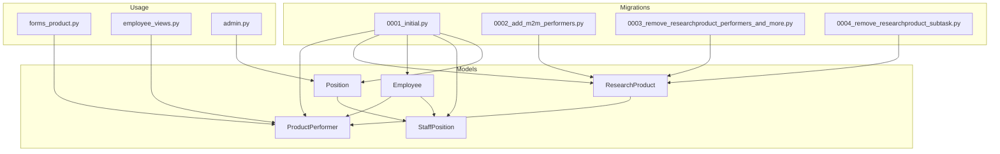
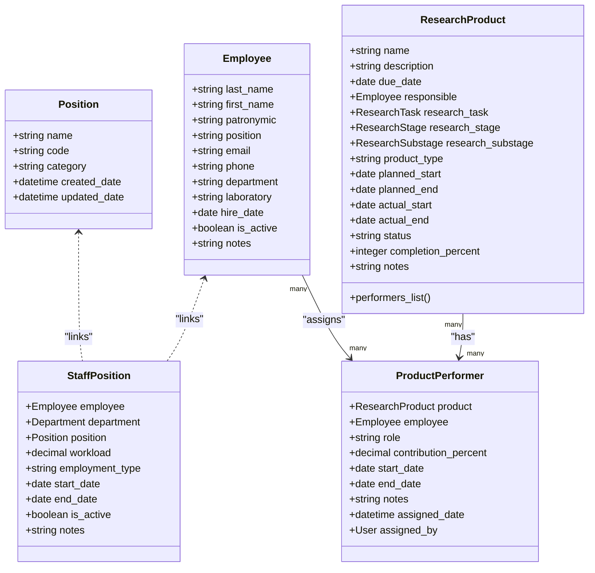
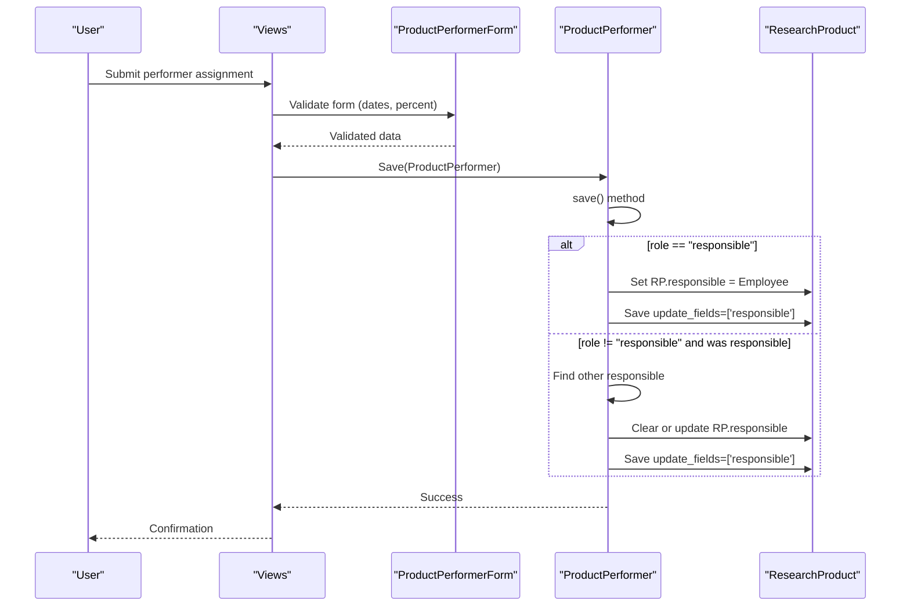
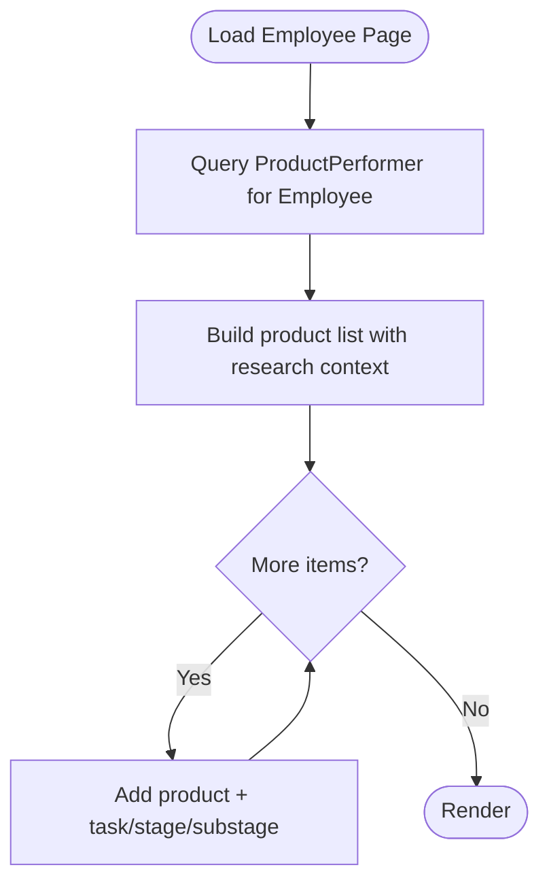
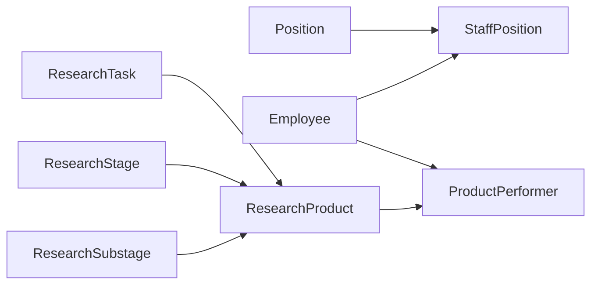

# Supporting Models and Relationships

<cite>
**Referenced Files in This Document**
- [models.py](file://tasks/models.py)
- [0001_initial.py](file://tasks/migrations/0001_initial.py)
- [0002_add_m2m_performers.py](file://tasks/migrations/0002_add_m2m_performers.py)
- [0003_remove_researchproduct_performers_and_more.py](file://tasks/migrations/0003_remove_researchproduct_performers_and_more.py)
- [0004_remove_researchproduct_subtask.py](file://tasks/migrations/0004_remove_researchproduct_subtask.py)
- [forms_product.py](file://tasks/forms_product.py)
- [employee_views.py](file://tasks/views/employee_views.py)
- [admin.py](file://tasks/admin.py)
</cite>

## Table of Contents
1. [Introduction](#introduction)
2. [Project Structure](#project-structure)
3. [Core Components](#core-components)
4. [Architecture Overview](#architecture-overview)
5. [Detailed Component Analysis](#detailed-component-analysis)
6. [Dependency Analysis](#dependency-analysis)
7. [Performance Considerations](#performance-considerations)
8. [Troubleshooting Guide](#troubleshooting-guide)
9. [Conclusion](#conclusion)

## Introduction
This document describes the supporting models and relationships that enable flexible performer assignments in scientific product workflows. It focuses on:
- Position: standardized job titles and categories
- ProductPerformer: many-to-many relationship with role classification for scientific products
- Utility models and indexing strategies that support efficient queries across performer assignments and organizational hierarchy

It explains field definitions, choice enumerations, validation constraints, indexing strategies, and performance considerations. It also illustrates role hierarchies, performer assignment patterns, and cross-references between models.

## Project Structure
The relevant models and supporting artifacts are primarily located under tasks/models.py with associated migrations under tasks/migrations/. Forms and views demonstrate usage patterns for performer assignment and cross-model navigation.

**Diagram sources**
- [models.py:587-858](file://tasks/models.py#L587-L858)
- [0001_initial.py:18-140](file://tasks/migrations/0001_initial.py#L18-L140)
- [0002_add_m2m_performers.py:11-15](file://tasks/migrations/0002_add_m2m_performers.py#L11-L15)
- [0003_remove_researchproduct_performers_and_more.py:62-77](file://tasks/migrations/0003_remove_researchproduct_performers_and_more.py#L62-L77)
- [0004_remove_researchproduct_subtask.py:13-17](file://tasks/migrations/0004_remove_researchproduct_subtask.py#L13-L17)
- [forms_product.py:56-126](file://tasks/forms_product.py#L56-L126)
- [employee_views.py:127-200](file://tasks/views/employee_views.py#L127-L200)
- [admin.py:1-21](file://tasks/admin.py#L1-L21)

**Section sources**
- [models.py:587-858](file://tasks/models.py#L587-L858)
- [0001_initial.py:1-376](file://tasks/migrations/0001_initial.py#L1-L376)

## Core Components
This section documents the Position, ProductPerformer, and related utility models that support performer assignments and organizational structure.

- Position
  - Purpose: Standardized job titles and categories for employees
  - Fields: name, code, category, timestamps
  - Indexes: none defined at class level; relies on default database indexes
  - Typical usage: Linked via StaffPosition to Employees and Departments

- StaffPosition
  - Purpose: Links Employee to Department and Position with workload and employment type
  - Fields: employee, department, position, workload, employment_type, dates, is_active, notes
  - Unique constraint: (employee, department, position, start_date)
  - Indexes: department, employee, position, is_active, employment_type
  - Notes: Supports active/inactive states and type categorization

- Employee
  - Purpose: Person record with contact, department, and organizational metadata
  - Includes numerous fields and indexes for fast lookups (name, email, activity, department)
  - Provides computed properties for organization structure extraction

- ResearchProduct
  - Purpose: Scientific product with lifecycle and performer tracking
  - Has a property to list performers via ProductPerformer
  - Maintains a responsible employee field synchronized by ProductPerformer

- ProductPerformer
  - Purpose: Through-table for assigning Employees to ResearchProducts with roles and contributions
  - Fields: product, employee, role, contribution_percent, start/end dates, notes, assigned_date, assigned_by
  - Choices: role supports responsible, executor, consultant, reviewer, approver
  - Constraints: unique_together(product, employee) ensures one performer per product per employee
  - Behavior: On save, updates ResearchProduct.responsible when role becomes responsible

**Section sources**
- [models.py:587-678](file://tasks/models.py#L587-L678)
- [models.py:681-791](file://tasks/models.py#L681-L791)
- [models.py:793-858](file://tasks/models.py#L793-L858)

## Architecture Overview
The performer assignment architecture centers on a many-to-many relationship mediated by ProductPerformer. This design decouples role semantics from the product itself, enabling flexible role assignments, contribution tracking, and synchronization of the product’s responsible party.

**Diagram sources**
- [models.py:587-858](file://tasks/models.py#L587-L858)

## Detailed Component Analysis

### Position Model
- Purpose: Centralized repository for job titles and categories
- Design: Minimal schema with optional code and category fields
- Usage: Referenced by StaffPosition to formalize organizational roles

Constraints and validations:
- No explicit validators on Position fields in the model
- Category may be used for pay grade grouping elsewhere in the system

Indexing:
- No dedicated indexes on Position; rely on primary key and default database behavior

Operational notes:
- Used indirectly by StaffPosition for role standardization

**Section sources**
- [models.py:587-602](file://tasks/models.py#L587-L602)

### StaffPosition Model
- Purpose: Formalizes an employee’s role within a department with workload and employment type
- Unique constraint: Prevents duplicate staff positions with identical attributes
- Indexes: Optimizes queries by department, employee, position, activity, and employment type

Validation and behavior:
- Employment type choices enumerate main, internal combination, external combination, combination, part-time, vacant, decree, allowance
- Workload stored as decimal with two decimals; typical values include 1.0, 0.5, 0.25

Cross-references:
- Links Employee, Department, and Position
- Supports active/inactive toggles and date ranges

**Section sources**
- [models.py:604-678](file://tasks/models.py#L604-L678)
- [0001_initial.py:194-213](file://tasks/migrations/0001_initial.py#L194-L213)

### Employee Model
- Purpose: Stores person-level data and organizational metadata
- Indexes: Name composite, email, activity flag, department
- Organization helpers: Methods to derive department path, main department, division, and laboratory

Validation and behavior:
- Full and short name properties for display
- Organization structure extraction via linked StaffPosition

**Section sources**
- [models.py:13-162](file://tasks/models.py#L13-L162)

### ResearchProduct Model
- Purpose: Scientific product with lifecycle and performer tracking
- Cross-references: Links to ResearchTask, ResearchStage, ResearchSubstage
- Performer integration: Uses ProductPerformer for assignments; exposes a property to list performers

Responsibility synchronization:
- Maintains a responsible employee field
- Synchronized automatically by ProductPerformer on save

**Section sources**
- [models.py:681-791](file://tasks/models.py#L681-L791)

### ProductPerformer Model
- Purpose: Through-table for assigning Employees to ResearchProducts with role and contribution tracking
- Role classifications: responsible, executor, consultant, reviewer, approver
- Constraints: unique_together(product, employee) prevents duplicate assignments
- Behavior: On save, updates ResearchProduct.responsible when role becomes responsible; if removed, attempts to preserve another responsible if present

Validation and constraints:
- Contribution percent validated to be within 0–100 when provided
- Date range validation in bulk assignment form (start_date ≤ end_date)

**Diagram sources**
- [models.py:845-858](file://tasks/models.py#L845-L858)
- [forms_product.py:56-86](file://tasks/forms_product.py#L56-L86)

**Section sources**
- [models.py:793-858](file://tasks/models.py#L793-L858)
- [forms_product.py:56-86](file://tasks/forms_product.py#L56-L86)

### Many-to-Many Through-Table Pattern
- ResearchProduct ↔ Employee via ProductPerformer
- Benefits:
  - Role semantics per assignment
  - Contribution percentage tracking
  - Period scoping (start/end dates)
  - Audit trail (assigned_by, assigned_date)

Migration history:
- Initial creation of ProductPerformer in 0001_initial.py
- Temporary m2m field on ResearchProduct added and later removed in subsequent migrations
- Final pattern solidified with unique constraint and role choices

**Section sources**
- [0001_initial.py:122-140](file://tasks/migrations/0001_initial.py#L122-L140)
- [0002_add_m2m_performers.py:11-15](file://tasks/migrations/0002_add_m2m_performers.py#L11-L15)
- [0003_remove_researchproduct_performers_and_more.py:62-77](file://tasks/migrations/0003_remove_researchproduct_performers_and_more.py#L62-L77)
- [0004_remove_researchproduct_subtask.py:13-17](file://tasks/migrations/0004_remove_researchproduct_subtask.py#L13-L17)

### Role Hierarchies and Cross-References
- Role hierarchy: responsible > executor > consultant/reviewer/approver
- Cross-references:
  - ResearchProduct → ResearchTask/Stage/Substage
  - ProductPerformer → Employee → ResearchProduct
  - Views traverse ProductPerformer to enrich product details with research context

**Diagram sources**
- [employee_views.py:127-200](file://tasks/views/employee_views.py#L127-L200)

**Section sources**
- [employee_views.py:127-200](file://tasks/views/employee_views.py#L127-L200)

## Dependency Analysis
- Internal dependencies:
  - ProductPerformer depends on Employee and ResearchProduct
  - ResearchProduct depends on ResearchTask/Stage/Substage
  - StaffPosition depends on Employee, Department, Position
- External dependencies:
  - Django auth User for assigned_by and created_by fields
- Migration dependencies:
  - ProductPerformer introduced in initial migration
  - Temporary m2m field on ResearchProduct later removed
  - Subtask field on ResearchProduct removed in latest migration

**Diagram sources**
- [models.py:587-858](file://tasks/models.py#L587-L858)
- [0001_initial.py:18-140](file://tasks/migrations/0001_initial.py#L18-L140)

**Section sources**
- [models.py:587-858](file://tasks/models.py#L587-L858)
- [0001_initial.py:1-376](file://tasks/migrations/0001_initial.py#L1-L376)

## Performance Considerations
- Indexes
  - Employee: name composite, email, is_active, department
  - Department: parent, type, name, full_path, level
  - StaffPosition: department, employee, position, is_active, employment_type
  - Task/Subtask: user, status, priority, due_date, created_date, task foreign key
- Query patterns
  - Use select_related and prefetch_related to avoid N+1 queries when rendering performer lists or product details
  - Leverage unique_together on ProductPerformer to prevent redundant assignments
- Caching
  - Admin actions on Department trigger cache invalidation for organization chart data, reducing stale UI rendering

Recommendations:
- Add indexes on ProductPerformer fields if frequent filtering by role/contribution/date is needed
- Consider denormalized summary fields on ResearchProduct if performer counts or percentages are heavily queried
- Use pagination for performer lists on product detail pages

**Section sources**
- [models.py:62-67](file://tasks/models.py#L62-L67)
- [models.py:565-571](file://tasks/models.py#L565-L571)
- [models.py:668-674](file://tasks/models.py#L668-L674)
- [models.py:199-209](file://tasks/models.py#L199-L209)
- [models.py:312-317](file://tasks/models.py#L312-L317)
- [admin.py:11-19](file://tasks/admin.py#L11-L19)

## Troubleshooting Guide
Common issues and resolutions:
- Duplicate performer assignment
  - Symptom: IntegrityError on unique constraint
  - Resolution: Ensure unique_together(product, employee) is respected before saving
- Responsible party not updating
  - Symptom: ResearchProduct.responsible remains unchanged after role change
  - Resolution: Verify ProductPerformer.save() logic runs and other responsible exists if removing sole responsible
- Invalid contribution percent
  - Symptom: Validation error on form submission
  - Resolution: Ensure value is between 0 and 100 when provided
- Date range errors
  - Symptom: Validation error for start_date > end_date
  - Resolution: Validate date ranges in forms and views

**Section sources**
- [models.py:845-858](file://tasks/models.py#L845-L858)
- [forms_product.py:81-85](file://tasks/forms_product.py#L81-L85)
- [forms_product.py:118-126](file://tasks/forms_product.py#L118-L126)

## Conclusion
The Position and ProductPerformer models, along with supporting indexes and migration history, establish a robust, flexible framework for managing scientific product performer assignments. The through-table pattern enables rich role semantics, contribution tracking, and synchronization of the product’s responsible party. Proper indexing and query strategies ensure performance at scale, while forms and views enforce validation and provide intuitive assignment workflows.