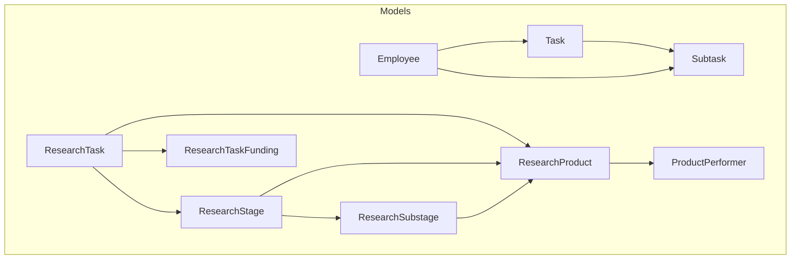
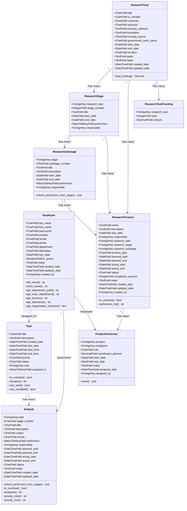
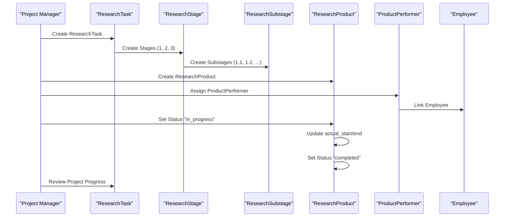
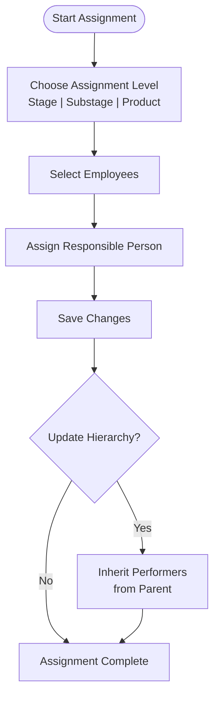
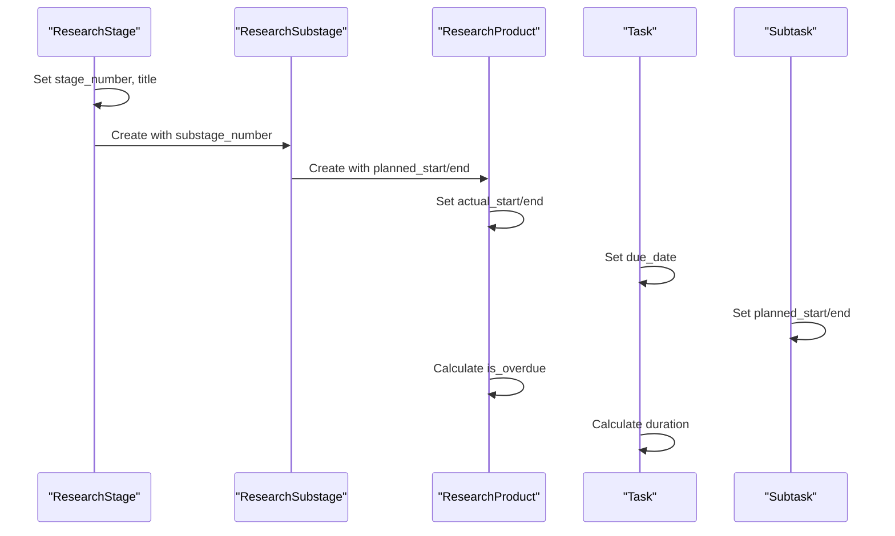
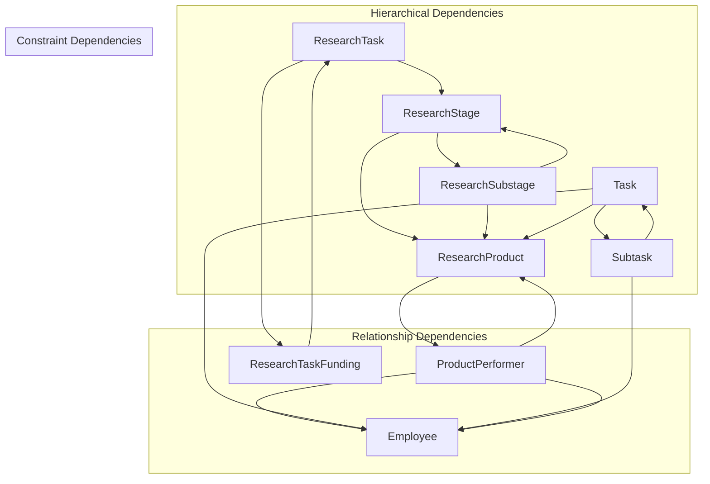

# Task and Research Project Models

<cite>
**Referenced Files in This Document**
- [models.py](file://tasks/models.py)
- [0001_initial.py](file://tasks/migrations/0001_initial.py)
- [0002_add_m2m_performers.py](file://tasks/migrations/0002_add_m2m_performers.py)
- [0003_remove_researchproduct_performers_and_more.py](file://tasks/migrations/0003_remove_researchproduct_performers_and_more.py)
- [0004_remove_researchproduct_subtask.py](file://tasks/migrations/0004_remove_researchproduct_subtask.py)
- [forms_product.py](file://tasks/forms_product.py)
- [product_views.py](file://tasks/views/product_views.py)
- [research_views.py](file://tasks/views/research_views.py)
</cite>

## Table of Contents
1. [Introduction](#introduction)
2. [Project Structure](#project-structure)
3. [Core Components](#core-components)
4. [Architecture Overview](#architecture-overview)
5. [Detailed Component Analysis](#detailed-component-analysis)
6. [Dependency Analysis](#dependency-analysis)
7. [Performance Considerations](#performance-considerations)
8. [Troubleshooting Guide](#troubleshooting-guide)
9. [Conclusion](#conclusion)

## Introduction
This document provides comprehensive data model documentation for Task and Research Project entities in the system. It covers the Task model with lifecycle management (creation, assignment, time tracking), priority and status fields, and many-to-many performer relationships. It details the ResearchTask model with scientific project attributes (title, government work name, funding sources, dates), and the hierarchical ResearchStage and ResearchSubstage models for project phases. It explains the ResearchProduct model for scientific outputs with type classifications and status tracking, and the ResearchTaskFunding model for annual budget tracking. The document includes field definitions, business rules, cascade behaviors, relationship constraints, examples of research project workflows, performer assignments, and timeline management. It also documents inheritance patterns and how subtasks relate to main tasks.

## Project Structure
The data models are defined in the tasks application under the models.py file. Migrations define the database schema evolution, and views and forms demonstrate usage patterns for research project workflows.

**Diagram sources**
- [models.py:165-858](file://tasks/models.py#L165-L858)

**Section sources**
- [models.py:165-858](file://tasks/models.py#L165-L858)

## Core Components
This section documents the primary models and their relationships, focusing on fields, constraints, and behaviors.

- Task
  - Purpose: Tracks individual tasks with lifecycle, priority, status, and performer assignments.
  - Key fields: title, description, created_date, due_date, start_time, end_time, priority, status, user, assigned_to (many-to-many Employee).
  - Lifecycle methods: is_overdue(), duration(), can_start(), can_complete().
  - Indexes: user, status, priority, due_date, created_date.

- Subtask
  - Purpose: Represents stages within a Task with detailed timing and performer tracking.
  - Key fields: task (foreign key), stage_number, title, description, output, priority, performers (many-to-many Employee), responsible (Employee), planned_start, planned_end, actual_start, actual_end, status, notes, created_date, updated_date.
  - Unique constraint: (task, stage_number).
  - Auto-behavior: Automatically sets responsible if only one performer exists.

- Employee
  - Purpose: Represents staff members with organizational metadata and derived structure accessors.
  - Key fields: personal info (last_name, first_name, patronymic, position), contact info (email, phone), organizational info (department, laboratory), HR info (hire_date, is_active, notes), system info (created_date, updated_date, created_by).
  - Methods: full_name, short_name, get_department_path, get_main_department, get_division, get_laboratory, get_organization_structure.

- ResearchTask
  - Purpose: Scientific research project entity with project metadata and financial tracking.
  - Key fields: title, tz_number, customer, executor, executor_address, foundation, funding_source, government_work_name, start_date, end_date, location, goals, tasks, created_date, updated_date.
  - Computed property: total_funding (sum of ResearchTaskFunding entries).

- ResearchStage
  - Purpose: Major phase of a ResearchTask with performer and timeline tracking.
  - Key fields: research_task (foreign key), stage_number, title, start_date, end_date, performers (many-to-many Employee), responsible (Employee).

- ResearchSubstage
  - Purpose: Detailed subdivision of a ResearchStage with performer inheritance capabilities.
  - Key fields: stage (foreign key), substage_number, title, description, start_date, end_date, performers (many-to-many Employee), responsible (Employee).
  - Method: inherit_performers_from_stage() to populate performers and responsible from parent stage.

- ResearchProduct
  - Purpose: Scientific output tied to ResearchTask/Stage/Substage with performer assignments.
  - Key fields: name, description, due_date, responsible (Employee), research_task, research_stage, research_substage, product_type, planned_start, planned_end, actual_start, actual_end, status, completion_percent, notes, created_date, updated_date, created_by.
  - Type classifications: report, article, patent, methodology, software, other.
  - Status tracking: pending, in_progress, completed, delayed, cancelled.
  - Computed property: is_overdue, performers_list.

- ProductPerformer
  - Purpose: Junction model linking ResearchProduct to Employee with role and contribution tracking.
  - Key fields: product (ResearchProduct), employee (Employee), role, contribution_percent, start_date, end_date, notes, assigned_date, assigned_by.
  - Role choices: responsible, executor, consultant, reviewer, approver.
  - Unique constraint: (product, employee).
  - Behavior: Updates ResearchProduct.responsible when role changes to 'responsible'.

- ResearchTaskFunding
  - Purpose: Annual budget tracking for ResearchTask.
  - Key fields: research_task (foreign key), year, amount.
  - Unique constraint: (research_task, year).

**Section sources**
- [models.py:165-858](file://tasks/models.py#L165-L858)
- [0001_initial.py:246-270](file://tasks/migrations/0001_initial.py#L246-L270)
- [0003_remove_researchproduct_performers_and_more.py:62-77](file://tasks/migrations/0003_remove_researchproduct_performers_and_more.py#L62-L77)

## Architecture Overview
The system implements a hierarchical research project model with clear separation between administrative tasks and scientific research workflows. The Task/Subtask model handles operational task management, while the ResearchTask/Stage/Substage/Product model manages scientific project lifecycle.

**Diagram sources**
- [models.py:165-858](file://tasks/models.py#L165-L858)

## Detailed Component Analysis

### Task Model Analysis
The Task model encapsulates operational task management with lifecycle controls and time tracking capabilities.

Key business rules:
- Priority levels: low, medium, high (default: medium)
- Status levels: todo, in_progress, done (default: todo)
- Overdue detection: due_date comparison with current time when status != 'done'
- Duration calculation: difference between start_time and end_time
- Lifecycle transitions: can_start() requires status 'todo' and unset start_time; can_complete() requires status 'in_progress' with start_time and unset end_time

Performance characteristics:
- Indexed fields: user, status, priority, due_date, created_date
- Efficient filtering by status and priority for dashboards
- Time-based queries for overdue tasks

**Section sources**
- [models.py:165-238](file://tasks/models.py#L165-L238)
- [0001_initial.py:246-270](file://tasks/migrations/0001_initial.py#L246-L270)

### Subtask Model Analysis
The Subtask model provides granular stage-level tracking within tasks, supporting detailed timeline management and performer assignments.

Key business rules:
- Stage numbering: CharField allowing flexible numbering (e.g., "1", "1.1", "2")
- Priority levels: low, medium, high, critical (default: medium)
- Status levels: pending, in_progress, completed, delayed (default: pending)
- Unique constraint: (task, stage_number) prevents duplicate stage numbers per task
- Automatic responsible assignment: when only one performer exists, automatically sets responsible field
- Progress calculation: computes percentage based on planned_start/planned_end and actual_start

Timeline management:
- Planned vs actual timestamps for realistic scheduling
- Overdue detection based on planned_end
- Color-coded priority display for visual management

**Section sources**
- [models.py:239-382](file://tasks/models.py#L239-L382)
- [0001_initial.py:214-244](file://tasks/migrations/0001_initial.py#L214-L244)

### ResearchTask Model Analysis
The ResearchTask model represents scientific research projects with comprehensive metadata and financial tracking.

Scientific project attributes:
- Title and identification: title, tz_number
- Contractual information: customer, executor, executor_address
- Legal and funding basis: foundation, funding_source, government_work_name
- Timeline and location: start_date, end_date, location
- Project scope: goals, tasks
- Audit trail: created_date, updated_date

Financial management:
- Centralized funding tracking via ResearchTaskFunding model
- Aggregated total_funding property for reporting
- Yearly budget allocation support

**Section sources**
- [models.py:384-425](file://tasks/models.py#L384-L425)
- [0003_remove_researchproduct_performers_and_more.py:22-56](file://tasks/migrations/0003_remove_researchproduct_performers_and_more.py#L22-L56)

### ResearchStage and ResearchSubstage Models Analysis
The hierarchical structure enables detailed project phase management with automatic performer inheritance.

ResearchStage:
- Major project phases with numbered stages
- Performer and responsible tracking at stage level
- Timeline management for phase-level planning

ResearchSubstage:
- Detailed subdivisions with flexible numbering (e.g., "1.1", "1.2")
- Automatic performer inheritance from parent stage via inherit_performers_from_stage()
- Independent timeline tracking

Inheritance patterns:
- ResearchSubstage inherits performers and responsible from ResearchStage when not explicitly set
- Supports cascading performer assignments across project hierarchy

**Section sources**
- [models.py:448-531](file://tasks/models.py#L448-L531)
- [0001_initial.py:142-182](file://tasks/migrations/0001_initial.py#L142-L182)

### ResearchProduct Model Analysis
The ResearchProduct model manages scientific outputs with comprehensive tracking and performer assignment capabilities.

Output classification:
- Types: report, article, patent, methodology, software, other (default: report)
- Flexible categorization supporting diverse scientific outputs

Status tracking:
- Status levels: pending, in_progress, completed, delayed, cancelled (default: pending)
- Overdue detection: compares planned_end with current date when not completed or cancelled
- Progress indicators: completion_percent field for quantitative tracking

Performer management:
- Many-to-many relationship with employees via ProductPerformer junction model
- Role-based assignments: responsible, executor, consultant, reviewer, approver
- Contribution percentage tracking for effort distribution
- Automatic responsible assignment when role is set to 'responsible'

**Section sources**
- [models.py:681-791](file://tasks/models.py#L681-L791)
- [0001_initial.py:96-140](file://tasks/migrations/0001_initial.py#L96-L140)

### ProductPerformer Model Analysis
The ProductPerformer model implements a sophisticated performer assignment system with role-based permissions and contribution tracking.

Role-based permissions:
- responsible: primary accountability for the product
- executor: primary performer
- consultant: advisory role
- reviewer: quality assurance
- approver: approval authority

Contribution tracking:
- contribution_percent allows fractional contributions
- Sum of contributions can exceed 100% for multiple roles
- Date-based assignment with start_date and end_date

Cascade behaviors:
- On save: updates ResearchProduct.responsible when role changes to 'responsible'
- Automatic removal of responsible role when role changes away from 'responsible'

**Section sources**
- [models.py:793-858](file://tasks/models.py#L793-L858)
- [0001_initial.py:122-140](file://tasks/migrations/0001_initial.py#L122-L140)

### ResearchTaskFunding Model Analysis
The ResearchTaskFunding model provides annual budget tracking with unique yearly allocations.

Budget management:
- Yearly funding entries per ResearchTask
- Unique constraint ensures single entry per year
- Decimal precision for monetary amounts

Reporting:
- ResearchTask.total_funding aggregates all yearly amounts
- Supports financial planning and reporting

**Section sources**
- [models.py:427-446](file://tasks/models.py#L427-L446)
- [0003_remove_researchproduct_performers_and_more.py:62-77](file://tasks/migrations/0003_remove_researchproduct_performers_and_more.py#L62-L77)

## Architecture Overview

### Research Project Workflow Example
This sequence demonstrates a typical research project workflow from initiation to completion.

**Diagram sources**
- [research_views.py:54-86](file://tasks/views/research_views.py#L54-L86)
- [product_views.py:10-26](file://tasks/views/product_views.py#L10-L26)

### Performer Assignment Workflow
This flow illustrates how performers are assigned across different project levels.

**Diagram sources**
- [research_views.py:118-165](file://tasks/views/research_views.py#L118-L165)
- [models.py:525-531](file://tasks/models.py#L525-L531)

### Timeline Management Example
This sequence shows how timeline data flows through the research hierarchy.

**Diagram sources**
- [models.py:448-531](file://tasks/models.py#L448-L531)
- [models.py:681-791](file://tasks/models.py#L681-L791)
- [models.py:165-238](file://tasks/models.py#L165-L238)

## Dependency Analysis
The models exhibit clear hierarchical dependencies with well-defined cascade behaviors and constraints.

**Diagram sources**
- [models.py:165-858](file://tasks/models.py#L165-L858)

Key dependency characteristics:
- Cascade deletion: Subtask, ResearchSubstage, ResearchProduct, ProductPerformer, ResearchTaskFunding follow CASCADE on delete
- Unique constraints: (task, stage_number) in Subtask; (research_task, year) in ResearchTaskFunding; (product, employee) in ProductPerformer
- Self-referential relationships: Department.parent, Employee.created_by
- Many-to-many relationships: Task.assigned_to, Subtask.performers, ResearchStage.performers, ResearchSubstage.performers, ResearchProduct.product_performers

**Section sources**
- [models.py:165-858](file://tasks/models.py#L165-L858)
- [0001_initial.py:1-376](file://tasks/migrations/0001_initial.py#L1-L376)
- [0003_remove_researchproduct_performers_and_more.py:1-78](file://tasks/migrations/0003_remove_researchproduct_performers_and_more.py#L1-L78)

## Performance Considerations
The model design incorporates several performance optimizations:

- Database indexing:
  - Task: user, status, priority, due_date, created_date
  - Subtask: task, status, priority, planned_end
  - Employee: last_name_first_name, email, is_active, department
  - Department: parent, type, name, full_path, level
  - StaffPosition: department, employee, position, is_active, employment_type

- Select_related and prefetch_related usage in views:
  - ResearchTask detail: prefetch_related('stages__substages__products')
  - ResearchProduct list: select_related('research_task', 'research_stage', 'research_substage')

- Computed properties:
  - ResearchTask.total_funding reduces repeated aggregation queries
  - ResearchProduct.is_overdue performs efficient date comparisons

- Query optimization patterns:
  - Views use filtered querysets to minimize database load
  - Form validation occurs before database writes

## Troubleshooting Guide
Common issues and solutions:

### Overdue Detection Issues
Problem: Tasks/products not flagged as overdue
- Verify due_date/planned_end fields are set correctly
- Check timezone settings for accurate comparisons
- Ensure status != 'completed' for overdue calculations

### Performer Assignment Problems
Problem: ProductPerformer not updating responsible field
- Confirm role is set to 'responsible' during creation/update
- Check unique constraint (product, employee) prevents duplicate entries
- Verify ProductPerformer.save() triggers responsible field updates

### Hierarchy Inheritance Failures
Problem: ResearchSubstage performers not inherited from stage
- Ensure stage.performers exists before calling inherit_performers_from_stage()
- Verify substage has no existing performers to prevent override
- Check that inherit_performers_from_stage() is called appropriately

### Budget Tracking Issues
Problem: ResearchTask.total_funding incorrect
- Verify ResearchTaskFunding entries exist for all years
- Check decimal precision and rounding in calculations
- Ensure unique_together constraint prevents duplicate yearly entries

**Section sources**
- [models.py:214-238](file://tasks/models.py#L214-L238)
- [models.py:782-786](file://tasks/models.py#L782-L786)
- [models.py:845-858](file://tasks/models.py#L845-L858)
- [models.py:525-531](file://tasks/models.py#L525-L531)

## Conclusion
The Task and Research Project models provide a comprehensive framework for managing both operational tasks and scientific research projects. The design balances flexibility with strong constraints, enabling complex project hierarchies while maintaining data integrity. Key strengths include:

- Clear separation between operational and research workflows
- Hierarchical structure supporting detailed project management
- Comprehensive performer assignment system with role-based permissions
- Robust timeline and status tracking capabilities
- Financial tracking with annual budget management
- Performance optimizations through strategic indexing and query patterns

The models support complex research project scenarios while remaining maintainable and extensible for future enhancements.