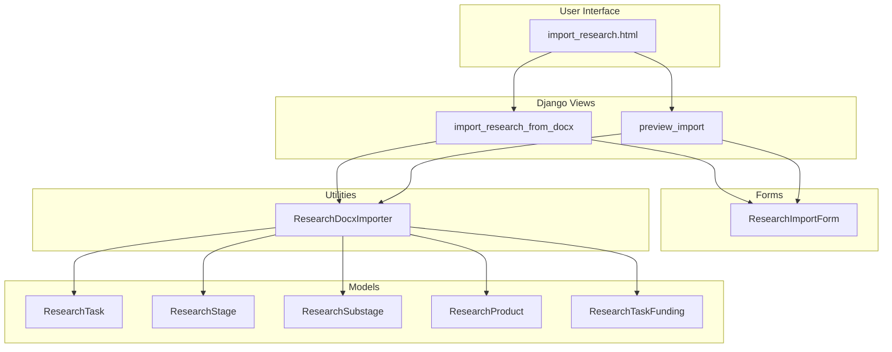
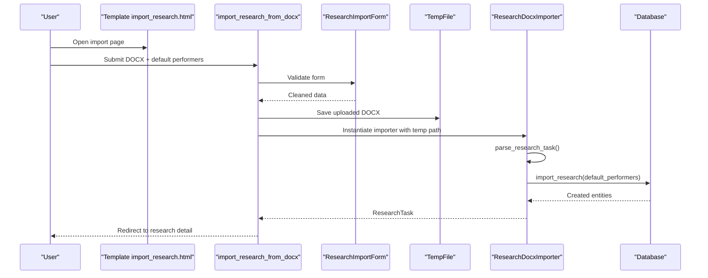
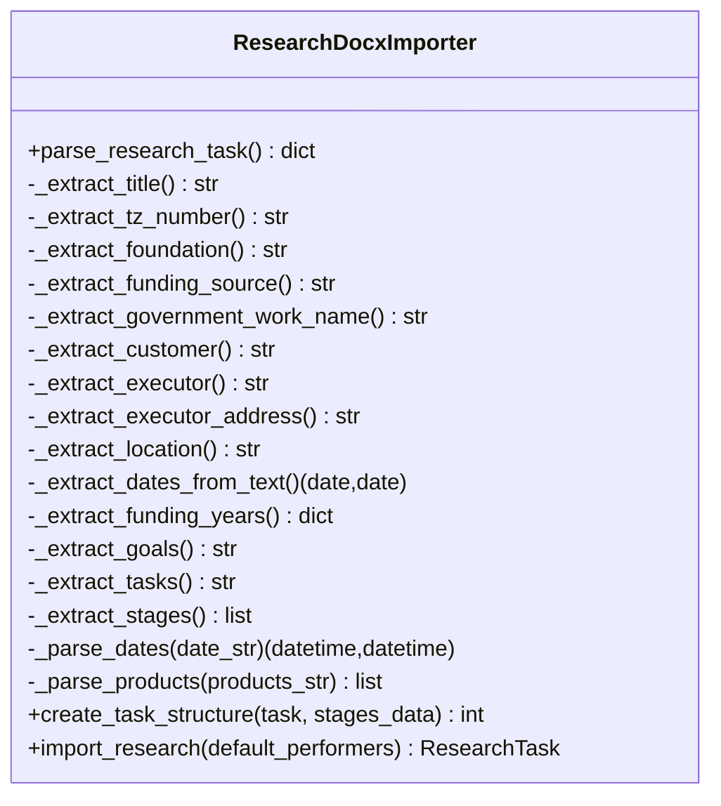
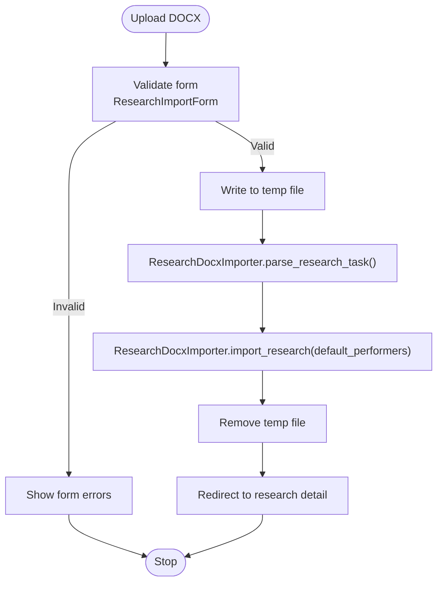
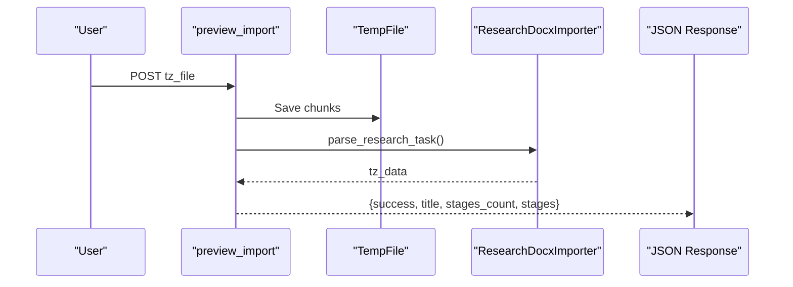
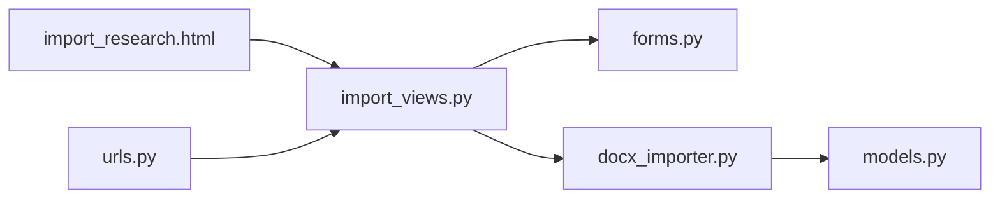

# DOCX Import for Research Data

<cite>
**Referenced Files in This Document**
- [docx_importer.py](file://tasks/utils/docx_importer.py)
- [import_views.py](file://tasks/views/import_views.py)
- [forms.py](file://tasks/forms.py)
- [models.py](file://tasks/models.py)
- [import_research.html](file://tasks/templates/tasks/import_research.html)
- [urls.py](file://tasks/urls.py)
</cite>

## Table of Contents
1. [Introduction](#introduction)
2. [Project Structure](#project-structure)
3. [Core Components](#core-components)
4. [Architecture Overview](#architecture-overview)
5. [Detailed Component Analysis](#detailed-component-analysis)
6. [Dependency Analysis](#dependency-analysis)
7. [Performance Considerations](#performance-considerations)
8. [Troubleshooting Guide](#troubleshooting-guide)
9. [Conclusion](#conclusion)
10. [Appendices](#appendices)

## Introduction
This document explains the DOCX import functionality used to import research projects from Microsoft Word documents. It focuses on the ResearchDocxImporter class, the parsing and validation logic, the import workflow from file upload to database creation, supported DOCX formats and required structure, field mapping, preview functionality, and integration with the import research view. It also provides error handling strategies, validation failures, and recovery mechanisms.

## Project Structure
The DOCX import feature spans several modules:
- A reusable parser that extracts metadata, funding, goals, tasks, and stages from a DOCX file
- Django views that handle file uploads, temporary storage, and JSON previews
- Django forms that define the import interface and validation
- Django templates that render the import UI
- Django URL routing that connects endpoints to views
- Domain models that represent research tasks, stages, substages, and products

**Diagram sources**
- [import_research.html:1-111](file://tasks/templates/tasks/import_research.html#L1-L111)
- [import_views.py:14-113](file://tasks/views/import_views.py#L14-L113)
- [forms.py:47-68](file://tasks/forms.py#L47-L68)
- [docx_importer.py:6-521](file://tasks/utils/docx_importer.py#L6-L521)
- [models.py:384-523](file://tasks/models.py#L384-L523)
- [urls.py:84-87](file://tasks/urls.py#L84-L87)

**Section sources**
- [import_research.html:1-111](file://tasks/templates/tasks/import_research.html#L1-L111)
- [import_views.py:14-113](file://tasks/views/import_views.py#L14-L113)
- [forms.py:47-68](file://tasks/forms.py#L47-L68)
- [docx_importer.py:6-521](file://tasks/utils/docx_importer.py#L6-L521)
- [models.py:384-523](file://tasks/models.py#L384-L523)
- [urls.py:84-87](file://tasks/urls.py#L84-L87)

## Core Components
- ResearchDocxImporter: Parses a DOCX file and builds a structured representation of a research task, including metadata, funding per year, goals, tasks, and hierarchical stages with substages. It also creates ResearchTask, ResearchStage, ResearchSubstage, ResearchProduct, and ResearchTaskFunding records.
- import_research_from_docx: Handles the upload of a DOCX file, saves it temporarily, instantiates the importer, and persists the parsed data to the database. It supports assigning default performers and responsible parties to stages.
- preview_import: Allows users to preview the extracted structure (title, stages count, and stage details) without persisting to the database.
- ResearchImportForm: Validates the uploaded DOCX file and selected default performers/responsible parties.
- Models: ResearchTask, ResearchStage, ResearchSubstage, ResearchProduct, ResearchTaskFunding define the domain entities and relationships.

**Section sources**
- [docx_importer.py:6-521](file://tasks/utils/docx_importer.py#L6-L521)
- [import_views.py:14-113](file://tasks/views/import_views.py#L14-L113)
- [forms.py:47-68](file://tasks/forms.py#L47-L68)
- [models.py:384-523](file://tasks/models.py#L384-L523)

## Architecture Overview
The import pipeline follows a clear separation of concerns:
- Presentation: HTML template renders the import form and JS for Select2 widgets.
- Control: Views process uploads, validate forms, and orchestrate parsing and persistence.
- Parsing: ResearchDocxImporter reads the DOCX via python-docx, applies regex and table heuristics, and normalizes dates.
- Persistence: Views call ResearchDocxImporter.import_research to create ResearchTask and related entities.

**Diagram sources**
- [import_research.html:28-80](file://tasks/templates/tasks/import_research.html#L28-L80)
- [import_views.py:14-46](file://tasks/views/import_views.py#L14-L46)
- [forms.py:47-68](file://tasks/forms.py#L47-L68)
- [docx_importer.py:442-521](file://tasks/utils/docx_importer.py#L442-L521)

## Detailed Component Analysis

### ResearchDocxImporter
The parser extracts:
- Metadata: title, tz_number, foundation, funding_source, government_work_name, customer, executor, executor_address, location, start_date, end_date
- Funding: per-year amounts parsed from tables
- Goals and Tasks: extracted from specific tables
- Stages and Substages: detected by table characteristics and date ranges; nested under current stage

Key methods and behaviors:
- parse_research_task: orchestrates extraction and returns a normalized dictionary
- Field extractors: _extract_title, _extract_tz_number, _extract_foundation, _extract_funding_source, _extract_government_work_name, _extract_customer, _extract_executor, _extract_executor_address, _extract_location, _extract_dates_from_text, _extract_funding_years, _extract_goals, _extract_tasks
- Stage extraction: _extract_stages identifies a candidate table by row/column counts, parses stage/substage rows, and validates numeric patterns for stage numbers and dotted substage numbers
- Date parsing: _parse_dates handles date ranges like dd.mm.yyyy – dd.mm.yyyy and attaches timezone-aware datetime boundaries
- Products parsing: _parse_products splits by semicolon/period/newline and cleans leading numbering
- Persistence helpers: create_task_structure builds Subtask hierarchy for regular tasks; import_research builds ResearchTask, ResearchStage, ResearchSubstage, ResearchProduct, and ResearchTaskFunding

**Diagram sources**
- [docx_importer.py:6-521](file://tasks/utils/docx_importer.py#L6-L521)

**Section sources**
- [docx_importer.py:14-521](file://tasks/utils/docx_importer.py#L14-L521)

### Import Workflow
End-to-end flow:
- Upload: User selects a DOCX file and optional default performers/responsible
- Validation: ResearchImportForm ensures a valid DOCX and optional selections
- Temporary storage: View writes chunks to a temporary file
- Parsing: ResearchDocxImporter loads the DOCX and extracts metadata, funding, goals, tasks, and stages
- Persistence: import_research creates ResearchTask and related entities; optionally assigns default performers
- Cleanup: Temporary file is removed after processing
- Feedback: Success message and redirect to the created research task detail

**Diagram sources**
- [import_views.py:14-46](file://tasks/views/import_views.py#L14-L46)
- [forms.py:47-68](file://tasks/forms.py#L47-L68)
- [docx_importer.py:442-521](file://tasks/utils/docx_importer.py#L442-L521)

**Section sources**
- [import_views.py:14-46](file://tasks/views/import_views.py#L14-L46)
- [forms.py:47-68](file://tasks/forms.py#L47-L68)
- [docx_importer.py:442-521](file://tasks/utils/docx_importer.py#L442-L521)

### Preview Functionality
The preview endpoint allows users to inspect extracted data without committing to the database:
- Accepts a DOCX file via POST
- Writes to a temporary file
- Instantiates ResearchDocxImporter and calls parse_research_task
- Returns JSON with success flag, title, stages count, and stage details
- On error, returns JSON with error message

**Diagram sources**
- [import_views.py:48-75](file://tasks/views/import_views.py#L48-L75)
- [docx_importer.py:14-44](file://tasks/utils/docx_importer.py#L14-L44)

**Section sources**
- [import_views.py:48-75](file://tasks/views/import_views.py#L48-L75)
- [docx_importer.py:14-44](file://tasks/utils/docx_importer.py#L14-L44)

### Supported DOCX Formats and Required Structure
Supported DOCX format:
- Standard .docx files produced by Microsoft Word

Required document structure expectations:
- Title extraction: looks for a paragraph containing the project title pattern
- Funding per year: expects a table with entries matching a year and amount pattern; amount normalization removes spaces and limits length
- Goals and Tasks: expects specific tables by index
- Stages table: identified by a large number of rows and four columns; stage rows are validated by numeric stage number and optional dotted substage number; date ranges are parsed from the fourth column

Validation and heuristics:
- Stage table detection: minimum row/column thresholds
- Stage/substage numeric validation: integer stage numbers and dotted substage numbers
- Date range parsing: strict pattern for dd.mm.yyyy – dd.mm.yyyy with timezone-aware conversion
- Products: split by semicolon/period/newline and filtered by length and URL exclusion

**Section sources**
- [docx_importer.py:132-350](file://tasks/utils/docx_importer.py#L132-L350)

### Field Mapping and Database Creation
The importer maps extracted fields to ResearchTask and related models:
- ResearchTask: title, tz_number, foundation, funding_source, government_work_name, customer, executor, executor_address, start_date, end_date, location, goals, tasks
- ResearchTaskFunding: per-year funding entries
- ResearchStage: stage_number, title, start_date, end_date; optional performers and responsible inherited from ResearchStageForm defaults
- ResearchSubstage: substage_number, title, description, start_date, end_date; optional performers and responsible
- ResearchProduct: name, description, status; linked to ResearchSubstage

Default performers/responsible assignment:
- Optional default_performers passed to import_research are assigned to ResearchStage and ResearchSubstage instances

**Section sources**
- [docx_importer.py:442-521](file://tasks/utils/docx_importer.py#L442-L521)
- [models.py:384-523](file://tasks/models.py#L384-L523)

### Integration with Import Research View
- URL routing: /tasks/research/import/ and /tasks/task/preview-import/
- Template: import_research.html renders the form with Select2 widgets for performers and responsible
- Form: ResearchImportForm enforces DOCX file acceptance and optional selections
- View: import_research_from_docx orchestrates upload, validation, parsing, persistence, and cleanup

**Section sources**
- [urls.py:84-87](file://tasks/urls.py#L84-L87)
- [import_research.html:1-111](file://tasks/templates/tasks/import_research.html#L1-L111)
- [forms.py:47-68](file://tasks/forms.py#L47-L68)
- [import_views.py:14-46](file://tasks/views/import_views.py#L14-L46)

## Dependency Analysis
- ResearchDocxImporter depends on:
  - python-docx for reading DOCX paragraphs and tables
  - datetime and timezone utilities for date normalization
  - Django ORM models for ResearchTask, ResearchStage, ResearchSubstage, ResearchProduct, ResearchTaskFunding
- Views depend on:
  - ResearchImportForm for validation
  - ResearchDocxImporter for parsing and persistence
  - Django’s temporary file handling for uploads
- Forms depend on:
  - Employee model for performer/responsible selection
- Templates depend on:
  - Select2 for multi-select widgets

**Diagram sources**
- [import_views.py:14-46](file://tasks/views/import_views.py#L14-L46)
- [forms.py:47-68](file://tasks/forms.py#L47-L68)
- [docx_importer.py:6-12](file://tasks/utils/docx_importer.py#L6-L12)
- [models.py:384-523](file://tasks/models.py#L384-L523)
- [import_research.html:1-111](file://tasks/templates/tasks/import_research.html#L1-L111)
- [urls.py:84-87](file://tasks/urls.py#L84-L87)

**Section sources**
- [import_views.py:14-46](file://tasks/views/import_views.py#L14-L46)
- [forms.py:47-68](file://tasks/forms.py#L47-L68)
- [docx_importer.py:6-12](file://tasks/utils/docx_importer.py#L6-L12)
- [models.py:384-523](file://tasks/models.py#L384-L523)
- [import_research.html:1-111](file://tasks/templates/tasks/import_research.html#L1-L111)
- [urls.py:84-87](file://tasks/urls.py#L84-L87)

## Performance Considerations
- File handling: Writing uploaded DOCX to a temporary file avoids keeping large binary data in memory during parsing.
- Regex parsing: Pattern matching for dates and funding is linear in document size; ensure patterns remain efficient.
- Table scanning: Stage table detection scans multiple tables; keep the document structure predictable to avoid false positives.
- Database writes: Bulk creation is used for stages and substages; consider batching if very large documents are expected.
- Timezone handling: Dates are normalized to timezone-aware datetimes; ensure consistent timezone configuration in the Django app.

## Troubleshooting Guide
Common issues and resolutions:
- Unsupported DOCX format
  - Ensure the file is a standard .docx saved from Microsoft Word.
  - Verify the document contains the expected structure (title, funding table, goals/tasks tables, and a stage table with four columns).
- Missing or empty extracted data
  - Confirm the stage table has sufficient rows and four columns.
  - Ensure date ranges are formatted as dd.mm.yyyy – dd.mm.yyyy in the fourth column.
  - Check that funding entries include a year and amount pattern.
- Stage/substage mismatch
  - Substage numbers must follow the format x.y where x matches the current stage number; otherwise, the importer attempts to match by stage number.
- Date parsing errors
  - Validate date ranges adhere to the expected pattern; invalid formats will be skipped with logged errors.
- Funding amount parsing errors
  - Amounts are normalized by removing spaces and limiting length; extremely long numeric strings may be truncated.
- Temporary file cleanup
  - If an exception occurs, the view removes the temporary file; ensure filesystem permissions allow deletion.
- Form validation errors
  - The form requires a DOCX file and optional default performers/responsible; ensure selections are valid.

**Section sources**
- [docx_importer.py:132-350](file://tasks/utils/docx_importer.py#L132-L350)
- [import_views.py:14-46](file://tasks/views/import_views.py#L14-L46)

## Conclusion
The DOCX import functionality provides a robust pipeline to transform research project documents into structured database entities. By leveraging a dedicated parser, strict validation rules, and a clear separation of concerns across views, forms, and templates, the system supports reliable import workflows with preview capabilities and sensible defaults for performers and responsible parties.

## Appendices

### Supported Document Fields and Extraction Patterns
- Title: Extracted from a paragraph containing the project title pattern
- Funding per year: Extracted from a table row matching a year and amount pattern; amount normalization removes spaces and limits length
- Goals and Tasks: Extracted from specific tables by index
- Stages table: Detected by row/column thresholds; stage rows validated by numeric stage number and dotted substage number; date ranges parsed from the fourth column

**Section sources**
- [docx_importer.py:132-350](file://tasks/utils/docx_importer.py#L132-L350)

### Example Workflows
- Import research from DOCX:
  - Upload a properly structured DOCX via the import page
  - Optionally select default performers and responsible
  - Review success message and navigate to the created research task
- Preview import:
  - Upload a DOCX to the preview endpoint
  - Inspect returned JSON with title, stages count, and stage details before committing

**Section sources**
- [import_research.html:19-26](file://tasks/templates/tasks/import_research.html#L19-L26)
- [import_views.py:14-46](file://tasks/views/import_views.py#L14-L46)
- [import_views.py:48-75](file://tasks/views/import_views.py#L48-L75)