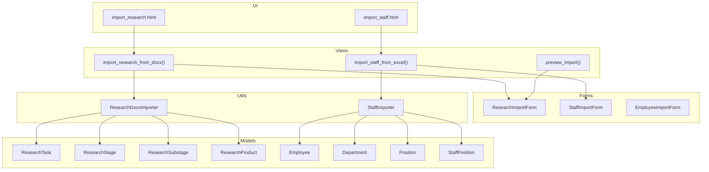
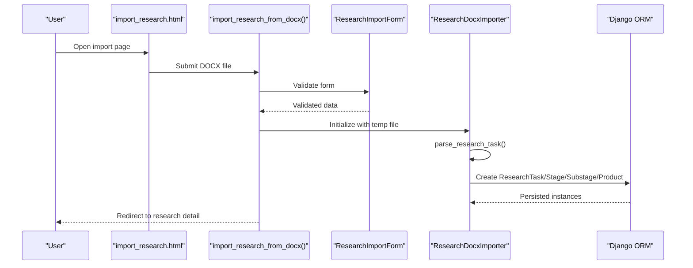
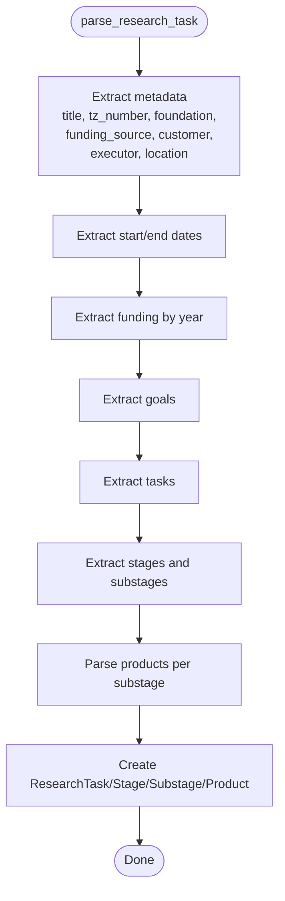
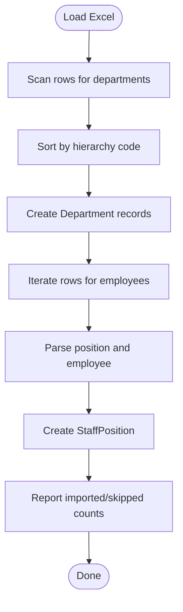
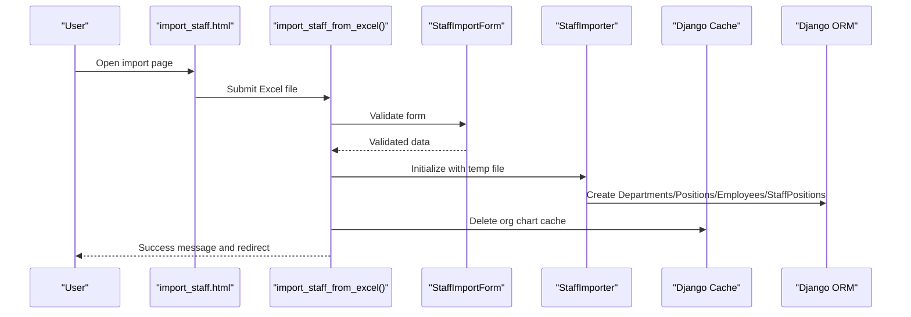
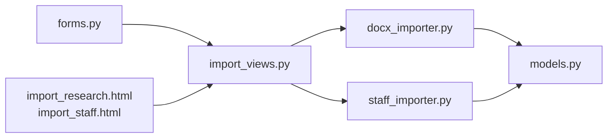

# Data Import and Export

<cite>
**Referenced Files in This Document**
- [docx_importer.py](file://tasks/utils/docx_importer.py)
- [staff_importer.py](file://tasks/utils/staff_importer.py)
- [import_views.py](file://tasks/views/import_views.py)
- [forms.py](file://tasks/forms.py)
- [forms_employee.py](file://tasks/forms_employee.py)
- [models.py](file://tasks/models.py)
- [import_research.html](file://tasks/templates/tasks/import_research.html)
- [import_staff.html](file://tasks/templates/tasks/import_staff.html)
- [urls.py](file://tasks/urls.py)
</cite>

## Table of Contents
1. [Introduction](#introduction)
2. [Project Structure](#project-structure)
3. [Core Components](#core-components)
4. [Architecture Overview](#architecture-overview)
5. [Detailed Component Analysis](#detailed-component-analysis)
6. [Dependency Analysis](#dependency-analysis)
7. [Performance Considerations](#performance-considerations)
8. [Troubleshooting Guide](#troubleshooting-guide)
9. [Conclusion](#conclusion)
10. [Appendices](#appendices)

## Introduction
This document describes the Data Import and Export system for research and organizational data within the application. It covers:
- DOCX import for research data processing, including document parsing, field extraction, validation rules, and creation of research tasks, stages, substages, and products.
- Excel import for employee data, including spreadsheet parsing, mapping, and error handling.
- Export capabilities for reports, statistics, and organizational data.
- Data validation strategies, error detection and correction, and batch processing workflows.
- File format specifications, supported document types, and data transformation processes.
- Performance optimization, memory management, and large dataset handling.
- User interface components for import operations and progress tracking.

## Project Structure
The import/export functionality is organized around:
- Utilities that parse and transform raw data into domain models.
- Django views that orchestrate upload, temporary storage, parsing, and persistence.
- Forms that define validation and UI behavior for uploads.
- Templates that render import pages and instructions.
- Models that represent persisted entities.

**Diagram sources**
- [import_research.html:1-111](file://tasks/templates/tasks/import_research.html#L1-L111)
- [import_staff.html:1-99](file://tasks/templates/tasks/import_staff.html#L1-L99)
- [import_views.py:14-113](file://tasks/views/import_views.py#L14-L113)
- [forms.py:47-224](file://tasks/forms.py#L47-L224)
- [docx_importer.py:6-521](file://tasks/utils/docx_importer.py#L6-L521)
- [staff_importer.py:7-328](file://tasks/utils/staff_importer.py#L7-L328)
- [models.py:384-858](file://tasks/models.py#L384-L858)

**Section sources**
- [urls.py:38-100](file://tasks/urls.py#L38-L100)
- [import_views.py:14-113](file://tasks/views/import_views.py#L14-L113)
- [forms.py:47-224](file://tasks/forms.py#L47-L224)
- [forms_employee.py:42-53](file://tasks/forms_employee.py#L42-L53)
- [docx_importer.py:6-521](file://tasks/utils/docx_importer.py#L6-L521)
- [staff_importer.py:7-328](file://tasks/utils/staff_importer.py#L7-L328)
- [models.py:384-858](file://tasks/models.py#L384-L858)

## Core Components
- ResearchDocxImporter: Parses DOCX files containing research task documents, extracts metadata, funding, stages, and products, and persists them as ResearchTask, ResearchStage, ResearchSubstage, and ResearchProduct.
- StaffImporter: Reads Excel spreadsheets, parses hierarchical departments, positions, and employees, and creates Department, Position, Employee, and StaffPosition records.
- Import Views: Handle file uploads, temporary storage, parsing, and persistence, with feedback via Django messages and redirects.
- Forms: Define validation rules and UI behavior for DOCX and Excel uploads.
- Models: Define the persistent entities and relationships used by importers.

**Section sources**
- [docx_importer.py:6-521](file://tasks/utils/docx_importer.py#L6-L521)
- [staff_importer.py:7-328](file://tasks/utils/staff_importer.py#L7-L328)
- [import_views.py:14-113](file://tasks/views/import_views.py#L14-L113)
- [forms.py:47-224](file://tasks/forms.py#L47-L224)
- [models.py:384-858](file://tasks/models.py#L384-L858)

## Architecture Overview
The import pipeline follows a consistent flow:
- User submits a file via a template-rendered form.
- View validates the form, writes the uploaded file to a temporary location, and instantiates the appropriate importer.
- Importer parses the file, transforms data into domain objects, and persists them to the database.
- On success, the view redirects to a relevant detail page; on failure, it displays an error message.

**Diagram sources**
- [import_research.html:28-80](file://tasks/templates/tasks/import_research.html#L28-L80)
- [import_views.py:14-46](file://tasks/views/import_views.py#L14-L46)
- [forms.py:47-68](file://tasks/forms.py#L47-L68)
- [docx_importer.py:14-521](file://tasks/utils/docx_importer.py#L14-L521)

**Section sources**
- [import_views.py:14-46](file://tasks/views/import_views.py#L14-L46)
- [docx_importer.py:14-521](file://tasks/utils/docx_importer.py#L14-L521)

## Detailed Component Analysis

### DOCX Importer (Research)
The ResearchDocxImporter performs structured parsing of research task documents:
- Document loading and basic statistics.
- Extraction of metadata: title, tz_number, foundation, funding_source, government_work_name, customer, executor, executor_address, location.
- Funding per year extraction from tables.
- Goals and tasks extraction from specific tables.
- Stages and substages parsing from a table with a specific structure, including date ranges and product lists.
- Creation of ResearchTask, ResearchStage, ResearchSubstage, and ResearchProduct entries.
- Optional default performers assignment.

Key parsing logic:
- Text-based extraction using pattern matching and regular expressions.
- Table-based extraction with row/column scanning and numeric checks.
- Date parsing with timezone-aware conversion.
- Product list normalization and deduplication.

Validation and error handling:
- Graceful fallbacks when expected sections are missing.
- Numeric and date parsing with try/catch blocks.
- Logging of parsing results and errors.

**Diagram sources**
- [docx_importer.py:14-521](file://tasks/utils/docx_importer.py#L14-L521)

**Section sources**
- [docx_importer.py:6-521](file://tasks/utils/docx_importer.py#L6-L521)
- [models.py:384-766](file://tasks/models.py#L384-L766)

### Excel Importer (Staff)
The StaffImporter reads Excel spreadsheets and builds organizational structures:
- Loads Excel file into a DataFrame.
- Discovers departments by scanning rows for hierarchical codes.
- Sorts departments by code to ensure parent nodes are created before children.
- Creates Department records with inferred parent-child relationships and types.
- Parses positions and employees, normalizing names and creating Position and Employee records.
- Creates StaffPosition entries linking employees to departments and positions, with workload and employment type.
- Tracks counts of imported and skipped entries.

Parsing and mapping highlights:
- Hierarchical department codes (e.g., “9.1.1”) imply parent relationships.
- Employment type classification based on keywords.
- Workload normalization to numeric values.

**Diagram sources**
- [staff_importer.py:186-328](file://tasks/utils/staff_importer.py#L186-L328)

**Section sources**
- [staff_importer.py:7-328](file://tasks/utils/staff_importer.py#L7-L328)
- [models.py:532-678](file://tasks/models.py#L532-L678)

### Import Views and UI
- Research import view handles DOCX uploads, temporary file writing, and delegation to ResearchDocxImporter. It supports selecting default performers and responsible parties.
- Preview endpoint allows users to inspect parsed stages before committing to import.
- Staff import view handles Excel uploads, delegates to StaffImporter, and clears organization chart cache upon successful import.
- Forms enforce file type constraints and optional flags for employee creation/update.
- Templates provide step-by-step instructions and Select2-powered multi-selects for performer selection.

**Diagram sources**
- [import_staff.html:32-70](file://tasks/templates/tasks/import_staff.html#L32-L70)
- [import_views.py:77-113](file://tasks/views/import_views.py#L77-L113)
- [forms.py:202-224](file://tasks/forms.py#L202-L224)
- [staff_importer.py:186-328](file://tasks/utils/staff_importer.py#L186-L328)

**Section sources**
- [import_views.py:14-113](file://tasks/views/import_views.py#L14-L113)
- [forms.py:47-224](file://tasks/forms.py#L47-L224)
- [import_research.html:11-84](file://tasks/templates/tasks/import_research.html#L11-L84)
- [import_staff.html:5-70](file://tasks/templates/tasks/import_staff.html#L5-L70)

### Export Capabilities
- Employee export endpoints are defined in the URL configuration, enabling report generation and organizational exports.
- Export templates and views are present in the repository and can be extended to support CSV/XLSX exports of employee data, statistics, and organizational charts.

Note: The current implementation focuses on import; export logic is referenced by URL names and templates.

**Section sources**
- [urls.py:61-63](file://tasks/urls.py#L61-L63)

## Dependency Analysis
- Importers depend on:
  - Python-docx for DOCX parsing.
  - Pandas for Excel parsing.
  - Django ORM for model creation and updates.
- Views depend on forms for validation and on importers for data transformation.
- Templates depend on Select2 for enhanced dropdowns and Bootstrap for layout.

**Diagram sources**
- [docx_importer.py:1-10](file://tasks/utils/docx_importer.py#L1-L10)
- [staff_importer.py:1-6](file://tasks/utils/staff_importer.py#L1-L6)
- [models.py:384-858](file://tasks/models.py#L384-L858)
- [import_views.py:14-113](file://tasks/views/import_views.py#L14-L113)
- [forms.py:47-224](file://tasks/forms.py#L47-L224)
- [import_research.html:1-111](file://tasks/templates/tasks/import_research.html#L1-L111)
- [import_staff.html:1-99](file://tasks/templates/tasks/import_staff.html#L1-L99)

**Section sources**
- [docx_importer.py:1-10](file://tasks/utils/docx_importer.py#L1-L10)
- [staff_importer.py:1-6](file://tasks/utils/staff_importer.py#L1-L6)
- [models.py:384-858](file://tasks/models.py#L384-L858)
- [import_views.py:14-113](file://tasks/views/import_views.py#L14-L113)
- [forms.py:47-224](file://tasks/forms.py#L47-L224)

## Performance Considerations
- Temporary file handling: Uploads are written to disk in chunks to avoid excessive memory usage during parsing.
- Batch creation: Importers minimize repeated queries by bulk operations and caching created objects in dictionaries.
- Sorting departments: Hierarchical sorting ensures parents are created before children, preventing foreign key issues.
- Caching invalidation: Organization chart cache is cleared after staff import to reflect structural changes.
- Large datasets: Excel parsing leverages vectorized operations via pandas; consider chunking for very large spreadsheets if needed.

[No sources needed since this section provides general guidance]

## Troubleshooting Guide
Common issues and resolutions:
- DOCX parsing failures:
  - Verify the document structure matches expected patterns (titles, funding tables, stage tables).
  - Ensure dates and numeric formats are consistent.
- Excel import anomalies:
  - Confirm department codes are hierarchical and free of typos.
  - Check that column order and headers align with expectations.
- Validation errors:
  - Forms enforce acceptable file extensions and optional flags; review error messages for corrective actions.
- Cache-related inconsistencies:
  - After staff import, the organization chart cache is cleared automatically; refresh the browser if stale data appears.

**Section sources**
- [import_views.py:19-42](file://tasks/views/import_views.py#L19-L42)
- [import_views.py:83-110](file://tasks/views/import_views.py#L83-L110)
- [forms.py:47-68](file://tasks/forms.py#L47-L68)
- [forms.py:202-224](file://tasks/forms.py#L202-L224)
- [staff_importer.py:186-328](file://tasks/utils/staff_importer.py#L186-L328)

## Conclusion
The Data Import and Export system provides robust mechanisms for ingesting research task documents and organizational data from spreadsheets. It emphasizes structured parsing, validation, and efficient persistence while offering user-friendly interfaces and progress feedback. Export capabilities are integrated via URL endpoints and templates, ready for extension to CSV/XLSX formats.

[No sources needed since this section summarizes without analyzing specific files]

## Appendices

### Supported File Formats and Specifications
- DOCX (Research import): Technical specification documents containing metadata, funding, stages, and products.
- Excel (Staff import): Spreadsheet with columns for hierarchical departments, professional qualification groups, positions, names, workloads, and employment types.

**Section sources**
- [forms.py:47-68](file://tasks/forms.py#L47-L68)
- [forms.py:202-224](file://tasks/forms.py#L202-L224)
- [import_staff.html:14-29](file://tasks/templates/tasks/import_staff.html#L14-L29)

### Data Transformation Processes
- Research:
  - Metadata extraction via text patterns and regex.
  - Funding aggregation by year from tabular data.
  - Stage/substage normalization with date parsing and product extraction.
- Staff:
  - Department discovery and parent-child inference from hierarchical codes.
  - Position and employee normalization with name parsing.
  - StaffPosition creation with workload and employment type mapping.

**Section sources**
- [docx_importer.py:14-521](file://tasks/utils/docx_importer.py#L14-L521)
- [staff_importer.py:186-328](file://tasks/utils/staff_importer.py#L186-L328)

### User Interface Components for Import Operations
- Research import page: Instructions, file upload, and multi-select for default performers/responsible.
- Staff import page: Instructions, file upload, and checkboxes for creating/updating employees.
- Preview endpoint: Returns parsed stages and counts for user confirmation prior to import.

**Section sources**
- [import_research.html:11-84](file://tasks/templates/tasks/import_research.html#L11-L84)
- [import_staff.html:13-70](file://tasks/templates/tasks/import_staff.html#L13-L70)
- [import_views.py:48-75](file://tasks/views/import_views.py#L48-L75)