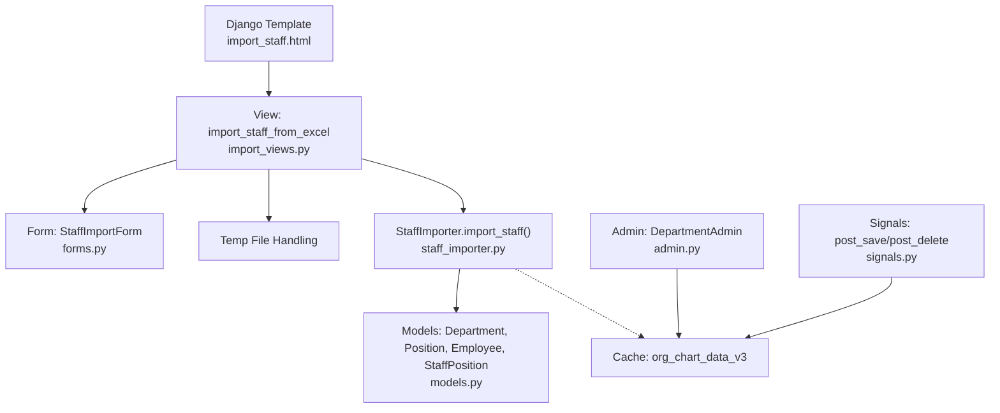
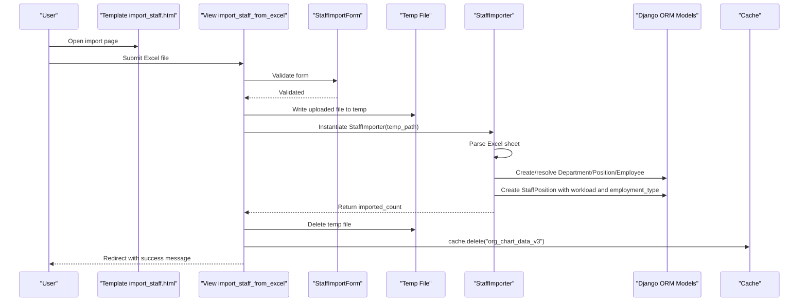
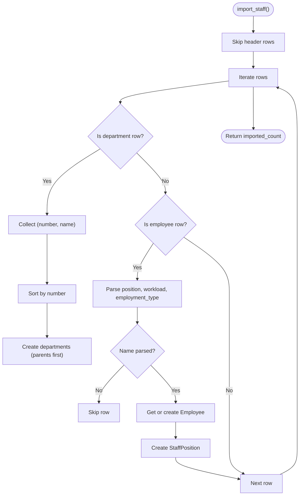
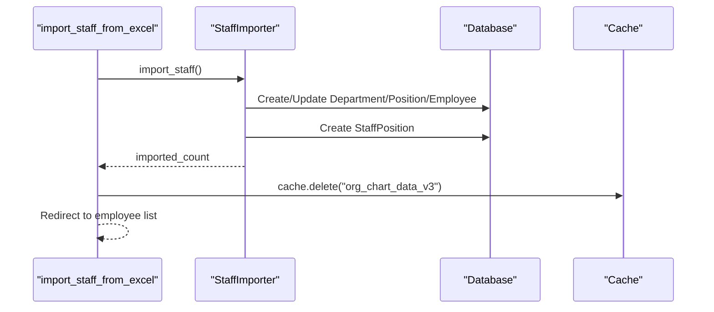
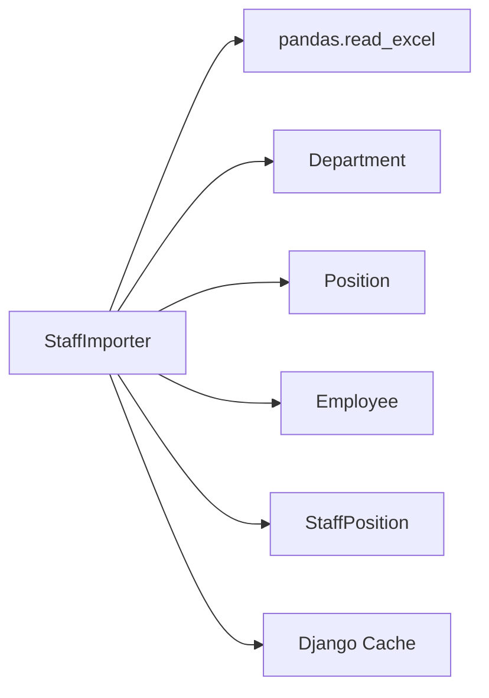

# Excel Import for Employee Data

<cite>
**Referenced Files in This Document**
- [staff_importer.py](file://tasks/utils/staff_importer.py)
- [import_views.py](file://tasks/views/import_views.py)
- [forms.py](file://tasks/forms.py)
- [models.py](file://tasks/models.py)
- [import_staff.html](file://tasks/templates/tasks/import_staff.html)
- [admin.py](file://tasks/admin.py)
- [signals.py](file://tasks/signals.py)
</cite>

## Table of Contents
1. [Introduction](#introduction)
2. [Project Structure](#project-structure)
3. [Core Components](#core-components)
4. [Architecture Overview](#architecture-overview)
5. [Detailed Component Analysis](#detailed-component-analysis)
6. [Dependency Analysis](#dependency-analysis)
7. [Performance Considerations](#performance-considerations)
8. [Troubleshooting Guide](#troubleshooting-guide)
9. [Conclusion](#conclusion)

## Introduction
This document explains the Excel import system used to import employee and staff data from Microsoft Excel spreadsheets. It focuses on the StaffImporter class, spreadsheet parsing, column mapping, data validation, supported formats, and the end-to-end import workflow from file upload to database updates. It also covers error handling, integration with the Django admin interface, and cache invalidation after successful imports.

## Project Structure
The Excel import feature spans several modules:
- A reusable importer utility that parses Excel sheets and creates organizational and personnel records
- A Django view that handles file uploads and orchestrates the import process
- A Django form that validates uploaded files and presents import options
- Templates that guide users on preparing and uploading spreadsheets
- Django admin and signals that invalidate caches upon structural changes

**Diagram sources**
- [import_staff.html:1-99](file://tasks/templates/tasks/import_staff.html#L1-L99)
- [import_views.py:77-113](file://tasks/views/import_views.py#L77-L113)
- [forms.py:202-224](file://tasks/forms.py#L202-L224)
- [staff_importer.py:186-328](file://tasks/utils/staff_importer.py#L186-L328)
- [models.py:532-678](file://tasks/models.py#L532-L678)
- [admin.py:5-21](file://tasks/admin.py#L5-L21)
- [signals.py:1-32](file://tasks/signals.py#L1-L32)

**Section sources**
- [import_staff.html:1-99](file://tasks/templates/tasks/import_staff.html#L1-L99)
- [import_views.py:77-113](file://tasks/views/import_views.py#L77-L113)
- [forms.py:202-224](file://tasks/forms.py#L202-L224)
- [staff_importer.py:186-328](file://tasks/utils/staff_importer.py#L186-L328)
- [models.py:532-678](file://tasks/models.py#L532-L678)
- [admin.py:5-21](file://tasks/admin.py#L5-L21)
- [signals.py:1-32](file://tasks/signals.py#L1-L32)

## Core Components
- StaffImporter: Parses Excel sheets, builds hierarchical departments, resolves positions, normalizes employee names, and creates staff positions with workload and employment type.
- import_staff_from_excel: Django view that validates the uploaded file, writes it to a temporary location, invokes the importer, cleans up, and invalidates caches.
- StaffImportForm: Validates Excel file uploads and exposes optional flags for future extension.
- Models: Department, Position, Employee, and StaffPosition define the data model for the import target structure.
- Admin and Signals: Invalidate the organization chart cache on structural changes.
- Template: Guides users on required columns and structure.

**Section sources**
- [staff_importer.py:7-328](file://tasks/utils/staff_importer.py#L7-L328)
- [import_views.py:77-113](file://tasks/views/import_views.py#L77-L113)
- [forms.py:202-224](file://tasks/forms.py#L202-L224)
- [models.py:532-678](file://tasks/models.py#L532-L678)
- [admin.py:5-21](file://tasks/admin.py#L5-L21)
- [signals.py:1-32](file://tasks/signals.py#L1-L32)
- [import_staff.html:13-30](file://tasks/templates/tasks/import_staff.html#L13-L30)

## Architecture Overview
The import pipeline is a controlled flow from user upload to persistence and cache invalidation.

**Diagram sources**
- [import_staff.html:32-70](file://tasks/templates/tasks/import_staff.html#L32-L70)
- [import_views.py:77-113](file://tasks/views/import_views.py#L77-L113)
- [forms.py:202-224](file://tasks/forms.py#L202-L224)
- [staff_importer.py:10-14](file://tasks/utils/staff_importer.py#L10-L14)
- [staff_importer.py:186-328](file://tasks/utils/staff_importer.py#L186-L328)
- [models.py:532-678](file://tasks/models.py#L532-L678)
- [admin.py:11-19](file://tasks/admin.py#L11-L19)
- [signals.py:7-32](file://tasks/signals.py#L7-L32)

## Detailed Component Analysis

### StaffImporter: Spreadsheet Parsing, Column Mapping, and Validation
- Initialization reads the Excel file into a DataFrame and initializes internal caches for departments, positions, and employees.
- Department creation:
  - Extracts hierarchical department codes and names from the first two columns.
  - Sorts codes to ensure parents are created before children.
  - Infers department type from name keywords and sets parent via dot-delimited hierarchy.
- Position creation:
  - Creates or retrieves positions by name; category is set from the “Professional Qualification Group” (PCK) value.
- Employee creation and deduplication:
  - Parses full names into last name, first name, and patronymic, ignoring parenthetical designations.
  - Deduplicates by normalized name; existing employees are reused and optionally updated.
- Staff position creation:
  - Associates employee, department, and position; infers workload and employment type from columns.
  - Skips rows with missing department context or invalid names.
- Robustness:
  - Gracefully handles missing or malformed values by falling back to defaults.
  - Tracks counts of imported and skipped entries.

**Diagram sources**
- [staff_importer.py:186-328](file://tasks/utils/staff_importer.py#L186-L328)
- [staff_importer.py:211-237](file://tasks/utils/staff_importer.py#L211-L237)
- [staff_importer.py:266-316](file://tasks/utils/staff_importer.py#L266-L316)

**Section sources**
- [staff_importer.py:10-14](file://tasks/utils/staff_importer.py#L10-L14)
- [staff_importer.py:77-104](file://tasks/utils/staff_importer.py#L77-L104)
- [staff_importer.py:106-116](file://tasks/utils/staff_importer.py#L106-L116)
- [staff_importer.py:118-152](file://tasks/utils/staff_importer.py#L118-L152)
- [staff_importer.py:154-184](file://tasks/utils/staff_importer.py#L154-L184)
- [staff_importer.py:186-328](file://tasks/utils/staff_importer.py#L186-L328)

### Supported Formats and Required Columns
- Supported formats: .xlsx and .xls (as accepted by the form).
- Required columns (based on template guidance):
  - Structural unit hierarchy
  - Professional Qualification Group (PCK)
  - Position
  - Full name
  - Workload (e.g., 1.0, 0.5, 0.25)
  - Employment type
- The importer uses the first two columns for department hierarchy and subsequent columns for employee and position data.

**Section sources**
- [forms.py:202-208](file://tasks/forms.py#L202-L208)
- [import_staff.html:16-29](file://tasks/templates/tasks/import_staff.html#L16-L29)
- [staff_importer.py:217-228](file://tasks/utils/staff_importer.py#L217-L228)
- [staff_importer.py:267-271](file://tasks/utils/staff_importer.py#L267-L271)

### Data Types and Validation Rules
- Department number: Dot-delimited numeric hierarchy; rows with non-matching patterns are ignored.
- Department name: Free text; totals rows are skipped.
- Position name: Used to create or reuse positions; rows labeled as “PCK” are skipped.
- Full name: Supports 2 or 3 parts; parenthetical designations are stripped; “vacancy” entries are treated as vacancies.
- Workload: Numeric; defaults to 1.0 if empty or invalid.
- Employment type: String matched against known categories; defaults to “main” if empty or unrecognized.

**Section sources**
- [staff_importer.py:226-228](file://tasks/utils/staff_importer.py#L226-L228)
- [staff_importer.py:273-274](file://tasks/utils/staff_importer.py#L273-L274)
- [staff_importer.py:287-289](file://tasks/utils/staff_importer.py#L287-L289)
- [staff_importer.py:154-162](file://tasks/utils/staff_importer.py#L154-L162)
- [staff_importer.py:164-184](file://tasks/utils/staff_importer.py#L164-L184)

### Import Workflow: From Upload to Database Updates
- The view validates the form, writes the uploaded file to a temporary location, instantiates the importer, and calls the main import routine.
- After successful import, the temporary file is deleted, and the organization chart cache is invalidated.
- The view redirects to the employee list with a success message indicating the number of staff positions created.

**Diagram sources**
- [import_views.py:77-113](file://tasks/views/import_views.py#L77-L113)
- [staff_importer.py:186-328](file://tasks/utils/staff_importer.py#L186-L328)
- [admin.py:11-19](file://tasks/admin.py#L11-L19)
- [signals.py:7-32](file://tasks/signals.py#L7-L32)

**Section sources**
- [import_views.py:77-113](file://tasks/views/import_views.py#L77-L113)
- [staff_importer.py:186-328](file://tasks/utils/staff_importer.py#L186-L328)

### Django Admin Integration and Cache Invalidation
- Admin: Saving or deleting a Department clears the organization chart cache.
- Signals: Post-save/delete handlers on Department, StaffPosition, Employee, and Position also clear the cache.
- Import view additionally clears the cache after a successful import.

**Section sources**
- [admin.py:5-21](file://tasks/admin.py#L5-L21)
- [signals.py:1-32](file://tasks/signals.py#L1-L32)
- [import_views.py:101-103](file://tasks/views/import_views.py#L101-L103)

## Dependency Analysis
The importer depends on:
- Pandas for Excel parsing
- Django ORM models for persistence
- Django cache for performance

**Diagram sources**
- [staff_importer.py:1-6](file://tasks/utils/staff_importer.py#L1-L6)
- [models.py:532-678](file://tasks/models.py#L532-L678)

**Section sources**
- [staff_importer.py:1-6](file://tasks/utils/staff_importer.py#L1-L6)
- [models.py:532-678](file://tasks/models.py#L532-L678)

## Performance Considerations
- Batch creation: The importer iterates rows and performs ORM operations per record; for very large spreadsheets, consider batching saves or using bulk operations to reduce database round-trips.
- Caching: Frequent cache deletions occur on structural changes; ensure cache backend is tuned for expected write frequency.
- Memory: Loading entire sheets into memory is efficient for moderate sizes; for very large files, consider chunked processing.

## Troubleshooting Guide
Common issues and resolutions:
- Malformed department numbers:
  - Symptom: Departments not created or orphaned.
  - Cause: Non-hierarchical or non-numeric codes.
  - Fix: Ensure codes follow dot-delimited numeric hierarchy (e.g., 1.2.3).
- Missing or invalid full names:
  - Symptom: Rows skipped during import.
  - Cause: Empty cells or unparseable names.
  - Fix: Provide valid last name and first name; avoid extra parentheses unless part of the name.
- Vacancy rows:
  - Symptom: No employee created for a row.
  - Cause: Name indicates vacancy or is empty.
  - Fix: Use “vacancy” indicators as documented or provide a real name.
- Employment type and workload:
  - Symptom: Defaults applied unexpectedly.
  - Cause: Empty or unrecognized values.
  - Fix: Provide recognized employment type keywords and numeric workload values.
- Duplicate employees:
  - Symptom: Existing employee reused.
  - Cause: Matching by normalized name.
  - Fix: Ensure names are unique; otherwise, deduplication is expected.
- Cache not updating:
  - Symptom: Outdated organization charts.
  - Cause: Cache not invalidated after import or admin changes.
  - Fix: Confirm cache deletion occurs on import and admin actions.

**Section sources**
- [staff_importer.py:226-228](file://tasks/utils/staff_importer.py#L226-L228)
- [staff_importer.py:287-289](file://tasks/utils/staff_importer.py#L287-L289)
- [staff_importer.py:154-162](file://tasks/utils/staff_importer.py#L154-L162)
- [staff_importer.py:164-184](file://tasks/utils/staff_importer.py#L164-L184)
- [import_views.py:101-103](file://tasks/views/import_views.py#L101-L103)
- [admin.py:11-19](file://tasks/admin.py#L11-L19)
- [signals.py:7-32](file://tasks/signals.py#L7-L32)

## Conclusion
The Excel import system provides a robust pipeline for transforming structured spreadsheets into organizational and personnel records. The StaffImporter encapsulates parsing, normalization, and persistence logic, while the Django view and template integrate cleanly with the admin interface. Cache invalidation ensures accurate organization charts after structural changes. By adhering to the required column structure and data types, administrators can reliably import staff data with minimal manual intervention.