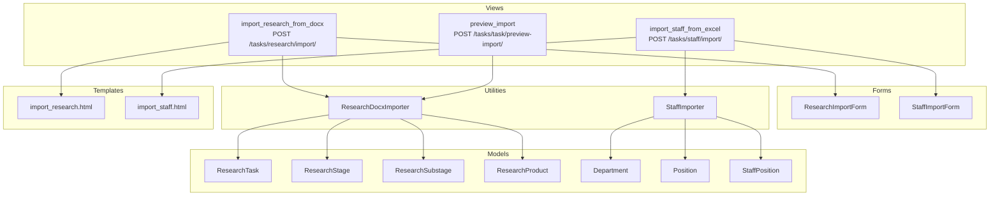
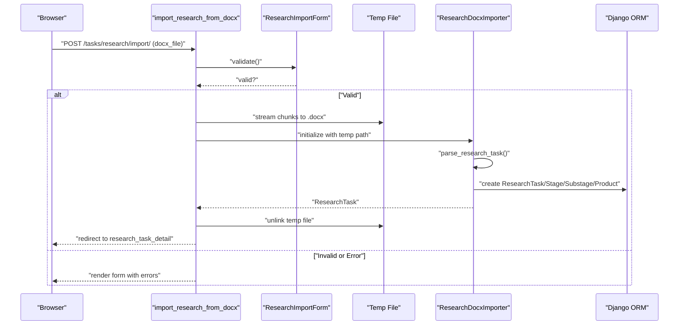
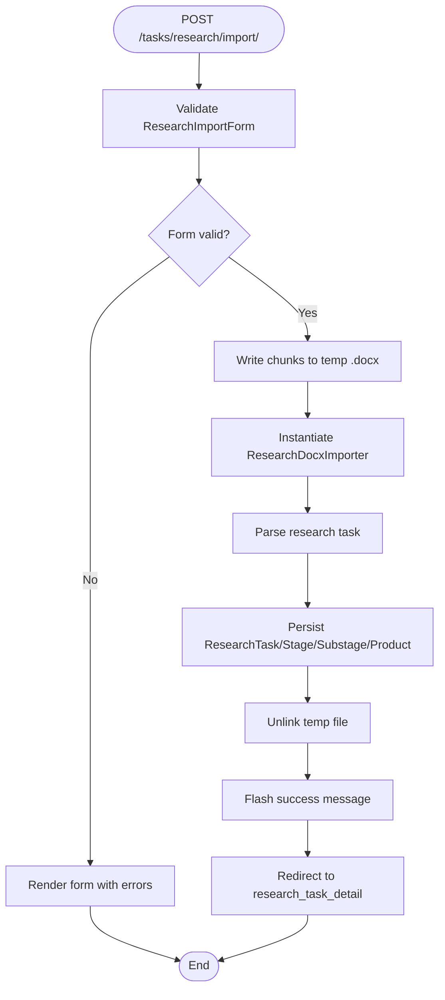
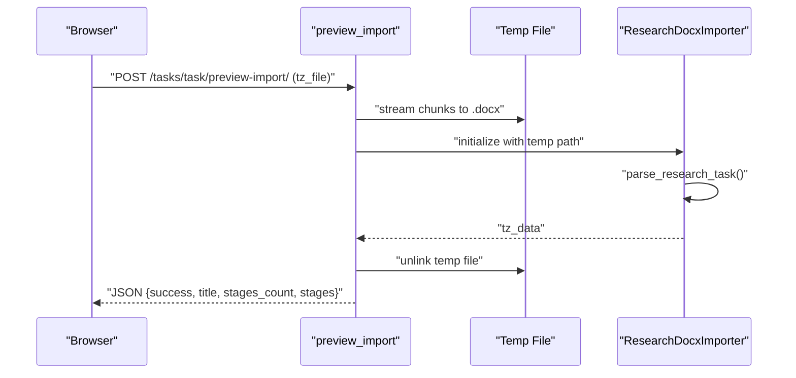
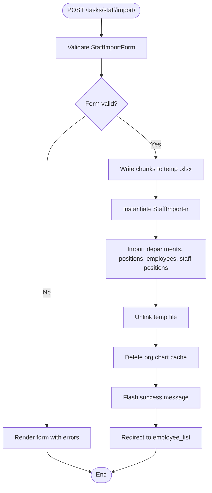
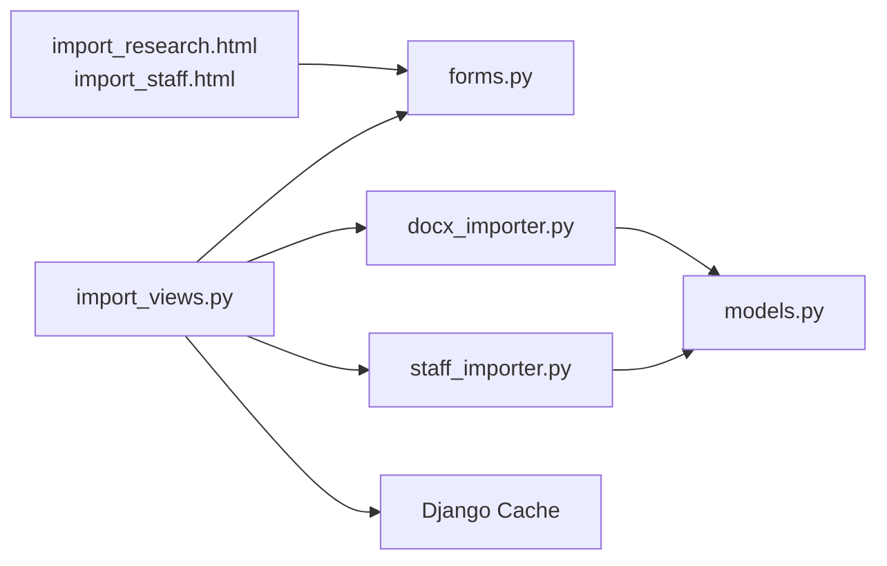

# Import Workflow and Management

<cite>
**Referenced Files in This Document**
- [import_views.py](file://tasks/views/import_views.py)
- [docx_importer.py](file://tasks/utils/docx_importer.py)
- [staff_importer.py](file://tasks/utils/staff_importer.py)
- [forms.py](file://tasks/forms.py)
- [urls.py](file://tasks/urls.py)
- [models.py](file://tasks/models.py)
- [org_service.py](file://tasks/services/org_service.py)
- [import_research.html](file://tasks/templates/tasks/import_research.html)
- [import_staff.html](file://tasks/templates/tasks/import_staff.html)
- [research_task_detail.html](file://tasks/templates/tasks/research_task_detail.html)
</cite>

## Table of Contents
1. [Introduction](#introduction)
2. [Project Structure](#project-structure)
3. [Core Components](#core-components)
4. [Architecture Overview](#architecture-overview)
5. [Detailed Component Analysis](#detailed-component-analysis)
6. [Dependency Analysis](#dependency-analysis)
7. [Performance Considerations](#performance-considerations)
8. [Troubleshooting Guide](#troubleshooting-guide)
9. [Conclusion](#conclusion)

## Introduction
This document describes the import workflow management system that coordinates DOCX and Excel import operations for research tasks and staff data. It covers view functions handling user interactions, form validation, error reporting, temporary file handling, security considerations, cleanup procedures, Django messaging integration, cache management for organizational charts, preview functionality for research task imports, and UI components. It also outlines best practices for handling large files, memory management, and progress indication for long-running imports.

## Project Structure
The import system spans views, forms, utilities, templates, models, and services:
- Views: handle HTTP requests, validate forms, orchestrate imports, and render responses.
- Forms: define validation rules and UI fields for DOCX and Excel uploads.
- Utilities: encapsulate parsing and import logic for DOCX and Excel.
- Templates: present upload forms, instructions, and previews.
- Models: represent persisted entities for research tasks, stages, substages, products, departments, positions, and staff positions.
- Services: provide optimized queries for organizational structure.

**Diagram sources**
- [import_views.py:14-113](file://tasks/views/import_views.py#L14-L113)
- [forms.py:47-224](file://tasks/forms.py#L47-L224)
- [docx_importer.py:6-521](file://tasks/utils/docx_importer.py#L6-L521)
- [staff_importer.py:7-328](file://tasks/utils/staff_importer.py#L7-L328)
- [models.py:414-791](file://tasks/models.py#L414-L791)
- [import_research.html:1-111](file://tasks/templates/tasks/import_research.html#L1-L111)
- [import_staff.html:1-99](file://tasks/templates/tasks/import_staff.html#L1-L99)

**Section sources**
- [import_views.py:14-113](file://tasks/views/import_views.py#L14-L113)
- [forms.py:47-224](file://tasks/forms.py#L47-L224)
- [urls.py:84-87](file://tasks/urls.py#L84-L87)

## Core Components
- Research DOCX Importer: Parses DOCX files to extract research task metadata, stages, substages, and scientific products; creates ResearchTask, ResearchStage, ResearchSubstage, and ResearchProduct records.
- Staff Excel Importer: Reads Excel sheets to build hierarchical departments, positions, employees, and staff positions; supports creation and updating of entities.
- View Controllers: Validate forms, stream uploaded files to temporary storage, delegate to importers, and manage Django messages and redirects.
- Forms: Define accepted file types, validation rules, and UI widgets for DOCX and Excel uploads.
- Cache Management: Clears organizational chart cache after staff import and on related model changes.

**Section sources**
- [docx_importer.py:6-521](file://tasks/utils/docx_importer.py#L6-L521)
- [staff_importer.py:7-328](file://tasks/utils/staff_importer.py#L7-L328)
- [import_views.py:14-113](file://tasks/views/import_views.py#L14-L113)
- [forms.py:47-224](file://tasks/forms.py#L47-L224)
- [models.py:414-791](file://tasks/models.py#L414-L791)

## Architecture Overview
The import workflow follows a layered pattern:
- Presentation Layer: Templates render upload forms and instructions.
- Controller Layer: Views validate forms, write chunks to temporary files, instantiate importers, and handle exceptions.
- Service Layer: Importers encapsulate parsing and persistence logic.
- Persistence Layer: Models persist research and staff data.

**Diagram sources**
- [import_views.py:14-46](file://tasks/views/import_views.py#L14-L46)
- [docx_importer.py:14-44](file://tasks/utils/docx_importer.py#L14-L44)
- [forms.py:47-70](file://tasks/forms.py#L47-L70)

**Section sources**
- [import_views.py:14-46](file://tasks/views/import_views.py#L14-L46)
- [docx_importer.py:14-44](file://tasks/utils/docx_importer.py#L14-L44)

## Detailed Component Analysis

### Research DOCX Import Workflow
- Purpose: Convert a DOCX technical specification into a structured research task with stages, substages, and products.
- Key steps:
  - Validate ResearchImportForm (DOCX upload and optional default performers/responsible).
  - Stream uploaded DOCX to a temporary file using chunked writes.
  - Parse DOCX via ResearchDocxImporter to extract metadata, stages, dates, and products.
  - Persist entities (ResearchTask, ResearchStage, ResearchSubstage, ResearchProduct).
  - Clean up temporary file.
  - Provide success/error feedback via Django messages and redirect.

**Diagram sources**
- [import_views.py:14-46](file://tasks/views/import_views.py#L14-L46)
- [docx_importer.py:14-521](file://tasks/utils/docx_importer.py#L14-L521)
- [forms.py:47-70](file://tasks/forms.py#L47-L70)

**Section sources**
- [import_views.py:14-46](file://tasks/views/import_views.py#L14-L46)
- [docx_importer.py:14-521](file://tasks/utils/docx_importer.py#L14-L521)
- [forms.py:47-70](file://tasks/forms.py#L47-L70)

### Preview Import for Research Tasks
- Purpose: Allow users to preview parsed data from a DOCX technical specification before committing to import.
- Behavior:
  - Accepts a DOCX file via POST.
  - Streams to a temporary file.
  - Uses ResearchDocxImporter to parse and return a JSON summary (title, stages count, stages).
  - Cleans up the temporary file.
  - Returns JSON success/error responses.

**Diagram sources**
- [import_views.py:48-75](file://tasks/views/import_views.py#L48-L75)
- [docx_importer.py:14-44](file://tasks/utils/docx_importer.py#L14-L44)

**Section sources**
- [import_views.py:48-75](file://tasks/views/import_views.py#L48-L75)
- [docx_importer.py:14-44](file://tasks/utils/docx_importer.py#L14-L44)

### Staff Excel Import Workflow
- Purpose: Import organizational structure and staff data from Excel into Departments, Positions, Employees, and StaffPositions.
- Key steps:
  - Validate StaffImportForm (Excel upload and options).
  - Stream uploaded Excel to a temporary file.
  - Instantiate StaffImporter and import staff.
  - Clean up temporary file.
  - Clear organizational chart cache to reflect structural changes.
  - Provide success/error feedback and redirect to employee list.

**Diagram sources**
- [import_views.py:77-113](file://tasks/views/import_views.py#L77-L113)
- [staff_importer.py:186-328](file://tasks/utils/staff_importer.py#L186-L328)

**Section sources**
- [import_views.py:77-113](file://tasks/views/import_views.py#L77-L113)
- [staff_importer.py:186-328](file://tasks/utils/staff_importer.py#L186-L328)

### Form Validation and UI Components
- ResearchImportForm:
  - DOCX file upload with accept=".docx".
  - Optional default performers and responsible selection.
  - Active employee filtering for performer/responsible fields.
- StaffImportForm:
  - Excel file upload with accept=".xlsx,.xls".
  - Options to create new employees and update existing ones.
- Templates:
  - import_research.html: Instructions, file upload, performer/responsible selectors with Select2.
  - import_staff.html: Instructions, Excel upload, checkboxes for create/update options.

**Section sources**
- [forms.py:47-70](file://tasks/forms.py#L47-L70)
- [forms.py:202-224](file://tasks/forms.py#L202-L224)
- [import_research.html:1-111](file://tasks/templates/tasks/import_research.html#L1-L111)
- [import_staff.html:1-99](file://tasks/templates/tasks/import_staff.html#L1-L99)

### Temporary File Handling and Security
- Temporary Files:
  - NamedTemporaryFile with delete=False used to stream uploaded files in chunks.
  - Temporary path stored and unlinked after processing.
- Security Considerations:
  - File type validation via form widgets (accept attributes).
  - Chunked streaming prevents loading entire file into memory.
  - Temporary files are removed immediately after use.
- Cleanup:
  - os.unlink(temp_path) ensures no leftover files.

**Section sources**
- [import_views.py:20-42](file://tasks/views/import_views.py#L20-L42)
- [import_views.py:54-73](file://tasks/views/import_views.py#L54-L73)
- [import_views.py:86-99](file://tasks/views/import_views.py#L86-L99)

### Django Messaging and Feedback
- Success/Error Messages:
  - messages.success for successful imports.
  - messages.error for exceptions with sanitized error messages.
- Redirects:
  - Redirect to research_task_detail after DOCX import.
  - Redirect to employee_list after Excel import.

**Section sources**
- [import_views.py:36-42](file://tasks/views/import_views.py#L36-L42)
- [import_views.py:105-106](file://tasks/views/import_views.py#L105-L106)

### Cache Management for Organizational Charts
- Cache Key: org_chart_data_v3.
- Clearing:
  - After Excel import in the view.
  - Via signals on Department, StaffPosition, Employee, and Position changes.
- Service: OrganizationService provides optimized queries for organizational structure.

**Section sources**
- [import_views.py:101-103](file://tasks/views/import_views.py#L101-L103)
- [org_service.py:8-32](file://tasks/services/org_service.py#L8-L32)
- [models.py:532-677](file://tasks/models.py#L532-L677)

### Preview Functionality for Research Task Imports
- Endpoint: POST /tasks/task/preview-import/.
- Behavior: Parses DOCX and returns JSON with title, stages count, and stages array.
- UI Integration: Enables users to review before committing to import.

**Section sources**
- [import_views.py:48-75](file://tasks/views/import_views.py#L48-L75)
- [docx_importer.py:14-44](file://tasks/utils/docx_importer.py#L14-L44)

### User Interface Components for Import Operations
- Research Import Page:
  - Instructions, file upload, performer/responsible selectors with Select2.
- Staff Import Page:
  - Instructions, Excel upload, create/update toggles, structural example.

**Section sources**
- [import_research.html:11-84](file://tasks/templates/tasks/import_research.html#L11-L84)
- [import_staff.html:5-70](file://tasks/templates/tasks/import_staff.html#L5-L70)

## Dependency Analysis
- Views depend on forms for validation and on importers for parsing/persistence.
- Importers depend on models for database operations.
- Cache clearing is triggered by view logic and signals.
- Templates depend on forms for rendering fields and messages.

**Diagram sources**
- [import_views.py:14-113](file://tasks/views/import_views.py#L14-L113)
- [forms.py:47-224](file://tasks/forms.py#L47-L224)
- [docx_importer.py:6-521](file://tasks/utils/docx_importer.py#L6-L521)
- [staff_importer.py:7-328](file://tasks/utils/staff_importer.py#L7-L328)
- [models.py:414-791](file://tasks/models.py#L414-L791)
- [import_research.html:1-111](file://tasks/templates/tasks/import_research.html#L1-L111)
- [import_staff.html:1-99](file://tasks/templates/tasks/import_staff.html#L1-L99)

**Section sources**
- [urls.py:84-87](file://tasks/urls.py#L84-L87)
- [import_views.py:14-113](file://tasks/views/import_views.py#L14-L113)

## Performance Considerations
- Streaming Uploads: Use chunked iteration to avoid high memory usage for large files.
- Minimal Parsing: Extract only required fields from DOCX/Excel to reduce processing overhead.
- Bulk Creation: Prefer bulk operations where possible to minimize database round trips.
- Caching: Use Django cache for organizational charts; invalidate on structural changes.
- Pagination and Prefetch: Optimize queries for large datasets using prefetch_related and pagination.
- Asynchronous Processing: For very large imports, consider offloading to background tasks and providing progress updates.

## Troubleshooting Guide
- DOCX Parsing Failures:
  - Verify DOCX structure matches expected schema (titles, tables).
  - Check date formats and numeric parsing.
- Excel Import Issues:
  - Confirm column order and headers.
  - Validate hierarchical numbering for departments.
- Temporary File Errors:
  - Ensure filesystem permissions allow temp file creation and deletion.
- Cache Stale Data:
  - Manually clear org chart cache after structural changes.
- Validation Errors:
  - Review form error messages and field constraints.

**Section sources**
- [import_views.py:39-42](file://tasks/views/import_views.py#L39-L42)
- [import_views.py:72-73](file://tasks/views/import_views.py#L72-L73)
- [import_views.py:108-109](file://tasks/views/import_views.py#L108-L109)

## Conclusion
The import workflow integrates robust validation, secure temporary file handling, and efficient parsing to support DOCX and Excel imports. It leverages Django’s messaging for user feedback, maintains cache consistency for organizational charts, and provides preview capabilities for research task imports. Following the outlined best practices ensures scalability and reliability for large-scale imports.