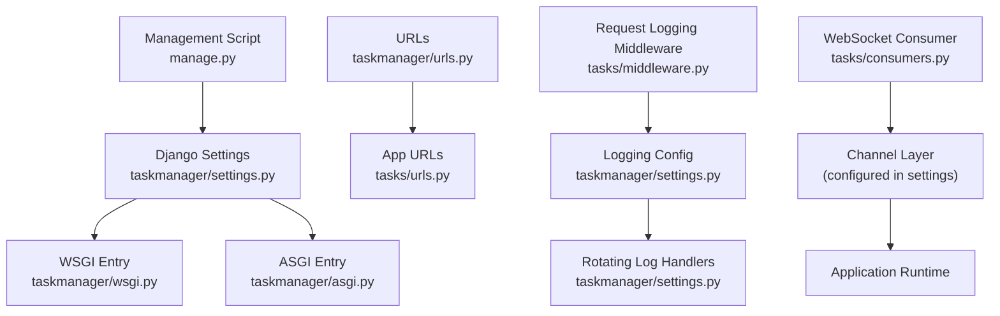
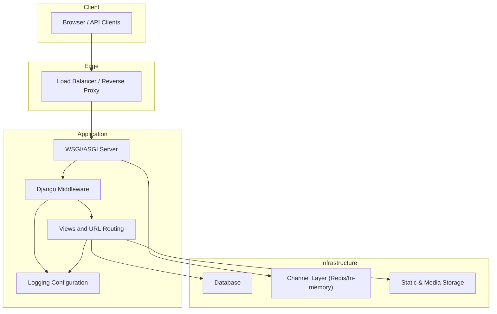
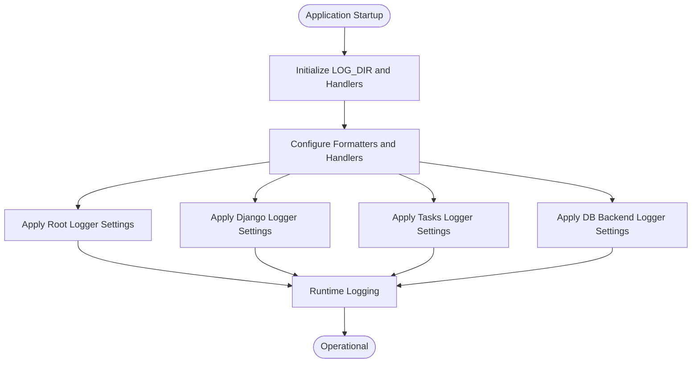
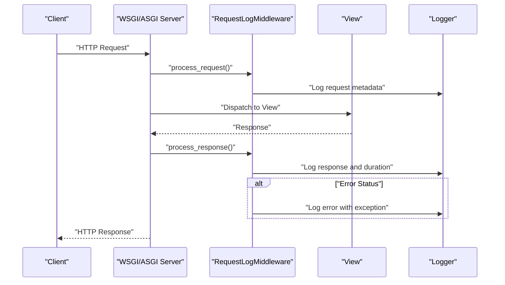
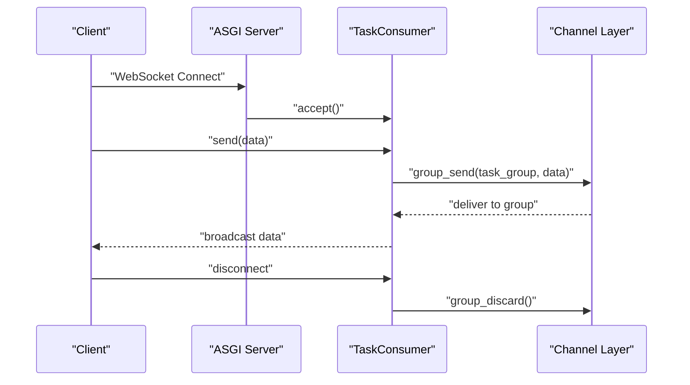
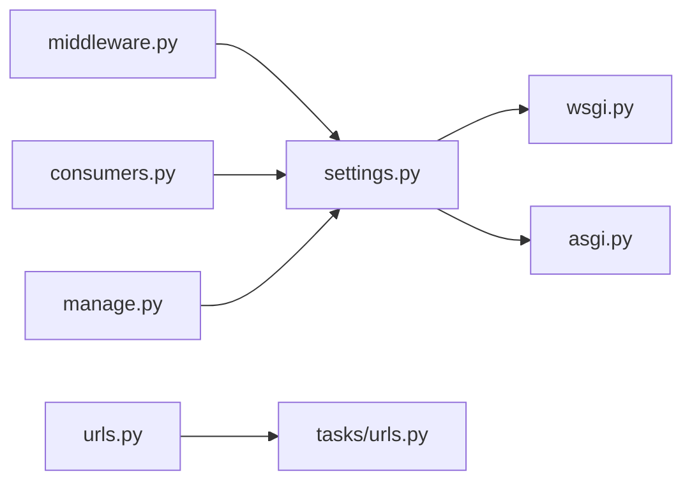

# Deployment and Operations

<cite>
**Referenced Files in This Document**
- [settings.py](file://taskmanager/settings.py)
- [wsgi.py](file://taskmanager/wsgi.py)
- [asgi.py](file://taskmanager/asgi.py)
- [urls.py](file://taskmanager/urls.py)
- [manage.py](file://manage.py)
- [middleware.py](file://tasks/middleware.py)
- [consumers.py](file://tasks/consumers.py)
- [logging.conf](file://logging.conf)
- [clean_logs.py](file://clean_logs.py)
</cite>

## Table of Contents
1. [Introduction](#introduction)
2. [Project Structure](#project-structure)
3. [Core Components](#core-components)
4. [Architecture Overview](#architecture-overview)
5. [Detailed Component Analysis](#detailed-component-analysis)
6. [Dependency Analysis](#dependency-analysis)
7. [Performance Considerations](#performance-considerations)
8. [Troubleshooting Guide](#troubleshooting-guide)
9. [Conclusion](#conclusion)
10. [Appendices](#appendices)

## Introduction
This document provides comprehensive guidance for deploying and operating the Task Manager application in production. It covers environment configuration, security hardening, containerization and cloud deployment strategies, WSGI/ASGI configuration, process management, load balancing, logging and monitoring, backups and disaster recovery, maintenance schedules, updates and rollbacks, and operational security and compliance.

## Project Structure
The application is a Django project with a single app (tasks). The deployment-relevant configuration resides primarily in the settings module and WSGI/ASGI entry points. URLs are routed via a central URLconf that includes the app’s URL patterns. Logging is configured programmatically in settings, with an auxiliary logging configuration file present but not used in the current runtime.

**Diagram sources**
- [settings.py](file://taskmanager/settings.py)
- [wsgi.py](file://taskmanager/wsgi.py)
- [asgi.py](file://taskmanager/asgi.py)
- [urls.py](file://taskmanager/urls.py)
- [manage.py](file://manage.py)
- [middleware.py](file://tasks/middleware.py)
- [consumers.py](file://tasks/consumers.py)

**Section sources**
- [settings.py](file://taskmanager/settings.py)
- [urls.py](file://taskmanager/urls.py)
- [manage.py](file://manage.py)

## Core Components
- Environment and secrets management
  - Secret key, debug mode, allowed hosts, database URL, and other settings are loaded from environment variables. A .env loader is present to support local development.
  - Production-grade deployments should externalize secrets and avoid committing sensitive values.
- Database configuration
  - Uses a database URL parsed by a dedicated library, enabling easy configuration for various backends (including Heroku-style Postgres).
- Static and media assets
  - Static files served via Django; media roots defined for user-uploaded content.
- Logging
  - Console and rotating file handlers configured for general, Django, tasks, and database backends. Logs are written under a logs directory with rotation and encoding.
- Middleware and request logging
  - Custom middleware logs requests/responses and errors with timing and user context.
- ASGI/WSGI
  - Standard Django WSGI entry point configured; ASGI entry point exists for WebSocket support.
- URL routing
  - Central URL configuration includes admin, auth, and app routes.

**Section sources**
- [settings.py](file://taskmanager/settings.py)
- [middleware.py](file://tasks/middleware.py)
- [wsgi.py](file://taskmanager/wsgi.py)
- [asgi.py](file://taskmanager/asgi.py)
- [urls.py](file://taskmanager/urls.py)

## Architecture Overview
The runtime architecture integrates Django’s WSGI interface for HTTP traffic and ASGI for WebSockets. Requests traverse middleware, URL resolution, and app views. Logging is centralized through Django’s logging configuration, with request telemetry captured by middleware.

[No sources needed since this diagram shows conceptual workflow, not actual code structure]

## Detailed Component Analysis

### Environment Variables and Secrets Management
- Critical variables to define in production:
  - SECRET_KEY: Cryptographically strong value
  - DEBUG: Set to False
  - ALLOWED_HOSTS: Comma-separated list of hostnames
  - DATABASE_URL: Full database connection string
  - DJANGO_SETTINGS_MODULE: Set to the settings module path
- Local development support:
  - A .env loader is present to populate environment variables during development.
- Security hardening recommendations:
  - Rotate SECRET_KEY regularly.
  - Restrict ALLOWED_HOSTS to production domains.
  - Use HTTPS-only cookies and CSRF protection.
  - Enforce secure session settings in production.

**Section sources**
- [settings.py](file://taskmanager/settings.py)

### Database Configuration
- The default database is configured via a database URL parsed at runtime, enabling flexible backend selection.
- For production, ensure:
  - A managed database service with replication and backups enabled.
  - Connection pooling and timeouts configured at the application level.
  - SSL enforced for connections where supported.

**Section sources**
- [settings.py](file://taskmanager/settings.py)

### Static and Media Assets
- Static files are collected to a static root directory and served by the web server or CDN.
- Media files are stored under a separate media root; ensure appropriate storage permissions and backups.
- Recommendations:
  - Serve static/media via a CDN or reverse proxy in production.
  - Store media on durable, replicated storage.

**Section sources**
- [settings.py](file://taskmanager/settings.py)

### Logging Configuration
- Handlers:
  - Console handler for real-time visibility.
  - Rotating file handlers for general, error, and app-specific logs with fixed-size rotation and backup counts.
- Loggers:
  - Root and Django loggers configured for INFO level.
  - App-specific logger for tasks configured for DEBUG level.
  - Database backend logger set to ERROR to reduce noise.
- Operational practices:
  - Monitor log directories for disk usage and rotation.
  - Forward logs to centralized logging systems (e.g., syslog, ELK, or cloud logging).
  - Retain logs per policy and purge old entries periodically.

**Diagram sources**
- [settings.py](file://taskmanager/settings.py)

**Section sources**
- [settings.py](file://taskmanager/settings.py)
- [logging.conf](file://logging.conf)
- [clean_logs.py](file://clean_logs.py)

### Request Logging Middleware
- Captures:
  - Request method, path, and user identity.
  - Response status code and request duration.
  - Errors and exceptions with stack traces.
- Recommendations:
  - Consider sampling or rate-limiting logs in high-volume environments.
  - Add correlation IDs for distributed tracing.

**Diagram sources**
- [middleware.py](file://tasks/middleware.py)
- [settings.py](file://taskmanager/settings.py)

**Section sources**
- [middleware.py](file://tasks/middleware.py)
- [settings.py](file://taskmanager/settings.py)

### ASGI and WebSocket Support
- ASGI entry point enables WebSocket communication for real-time features.
- Consumers handle group messaging for task updates.
- Recommendations:
  - Use a production-grade channel layer (e.g., Redis) for clustering and persistence.
  - Scale workers behind a load balancer and configure sticky sessions if required.

**Diagram sources**
- [asgi.py](file://taskmanager/asgi.py)
- [consumers.py](file://tasks/consumers.py)

**Section sources**
- [asgi.py](file://taskmanager/asgi.py)
- [consumers.py](file://tasks/consumers.py)

### WSGI/ASGI Configuration and Process Management
- WSGI entry point is configured in the settings module and exposed via the WSGI module.
- For production:
  - Run multiple worker processes behind a WSGI server (e.g., Gunicorn/uWSGI).
  - Use systemd or similar supervisors to manage processes and auto-restart on failure.
  - Enable health checks and graceful shutdown hooks.

**Section sources**
- [settings.py](file://taskmanager/settings.py)
- [wsgi.py](file://taskmanager/wsgi.py)

### Load Balancing Setup
- Place a reverse proxy/load balancer in front of application servers.
- Configure:
  - Health checks against a lightweight endpoint.
  - Sticky sessions if required by session affinity.
  - SSL termination and compression.
- Scale horizontally by adding more application instances behind the load balancer.

[No sources needed since this section provides general guidance]

### Monitoring and Alerting
- Logging:
  - Ensure logs are aggregated and searchable.
  - Define alerts for error spikes, latency increases, and disk usage thresholds.
- Metrics:
  - Expose metrics endpoints (e.g., Prometheus) and scrape them.
  - Track request rates, response times, error rates, and database query durations.
- Dashboards:
  - Visualize trends and anomalies for proactive incident response.

[No sources needed since this section provides general guidance]

### Backup Procedures and Disaster Recovery
- Backups:
  - Database snapshots on schedule; retain multiple generations.
  - Archive static and media assets to durable storage.
  - Automate and test restoration procedures.
- DR Plan:
  - Define RPO/RTO targets.
  - Maintain secondary region deployments and failover mechanisms.
  - Regularly rehearse disaster recovery drills.

[No sources needed since this section provides general guidance]

### Maintenance Schedules
- Routine tasks:
  - Apply OS and Python package updates with testing.
  - Rotate secrets and certificates.
  - Review and prune logs per retention policies.
- Capacity planning:
  - Monitor resource utilization and scale accordingly.

[No sources needed since this section provides general guidance]

### Update Procedures, Rollback, and Zero-Downtime Deployment
- Zero-downtime strategy:
  - Use blue/green or rolling deployments behind a load balancer.
  - Run database migrations before switching traffic.
- Rollback:
  - Keep previous artifact versions and database migration history.
  - Re-deploy previous version and revert migrations if necessary.
- Validation:
  - Smoke tests, health checks, and canary releases before full rollout.

[No sources needed since this section provides general guidance]

### Operational Security, Access Control, and Compliance
- Security hardening:
  - Disable DEBUG, enforce HTTPS, and secure cookies.
  - Limit exposure via firewalls and network ACLs.
  - Use least-privilege credentials and principle of least privilege for services.
- Access control:
  - Role-based access controls in the application.
  - Principle of least privilege for infrastructure accounts.
- Compliance:
  - Audit logs retention and access controls.
  - Data localization and encryption at rest/in-transit per applicable regulations.

[No sources needed since this section provides general guidance]

## Dependency Analysis
The deployment configuration centers around Django settings and entry points. The middleware and consumers depend on logging and channel-layer configuration. The URL routing ties the admin, authentication, and app endpoints together.

**Diagram sources**
- [settings.py](file://taskmanager/settings.py)
- [wsgi.py](file://taskmanager/wsgi.py)
- [asgi.py](file://taskmanager/asgi.py)
- [urls.py](file://taskmanager/urls.py)
- [middleware.py](file://tasks/middleware.py)
- [consumers.py](file://tasks/consumers.py)
- [manage.py](file://manage.py)

**Section sources**
- [settings.py](file://taskmanager/settings.py)
- [urls.py](file://taskmanager/urls.py)
- [middleware.py](file://tasks/middleware.py)
- [consumers.py](file://tasks/consumers.py)
- [manage.py](file://manage.py)

## Performance Considerations
- Database:
  - Use connection pooling and optimize queries; monitor slow queries.
- Caching:
  - Consider enabling cache backends and middleware caching for static pages.
- Static files:
  - Serve via CDN and enable long-lived caching headers.
- Workers:
  - Tune concurrency and worker class for workload characteristics.
- Observability:
  - Add tracing and profiling to identify bottlenecks.

[No sources needed since this section provides general guidance]

## Troubleshooting Guide
- Logs:
  - Verify log directory creation and permissions.
  - Confirm rotating file handlers are active and not filling disk space.
- Request telemetry:
  - Ensure middleware is enabled and logging levels are appropriate.
- Database connectivity:
  - Validate DATABASE_URL and network access to the database.
- Health checks:
  - Confirm WSGI/ASGI server readiness and worker status.

**Section sources**
- [settings.py](file://taskmanager/settings.py)
- [middleware.py](file://tasks/middleware.py)
- [clean_logs.py](file://clean_logs.py)

## Conclusion
This guide consolidates production deployment and operations practices for the Task Manager application. By externalizing secrets, configuring robust logging, scaling horizontally, and implementing secure access controls, teams can operate the system reliably and securely. Adopt standardized CI/CD, monitoring, and DR procedures to further strengthen operations.

## Appendices
- Environment variables reference
  - SECRET_KEY: Application secret key
  - DEBUG: Enable/disable debug mode
  - ALLOWED_HOSTS: Comma-separated list of allowed hosts
  - DATABASE_URL: Database connection string
  - DJANGO_SETTINGS_MODULE: Settings module path
- Log retention and cleanup
  - Use the provided script to remove logs older than a threshold.
  - Integrate with system logrotate or equivalent for automated rotation.

**Section sources**
- [settings.py](file://taskmanager/settings.py)
- [clean_logs.py](file://clean_logs.py)