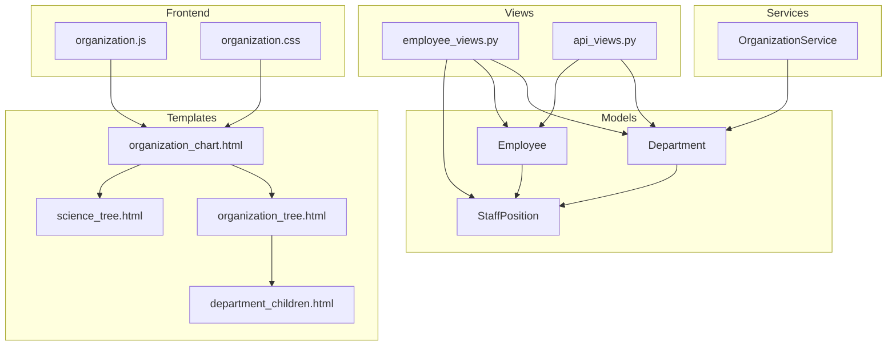
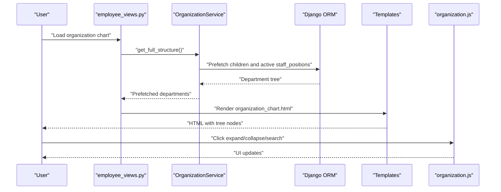
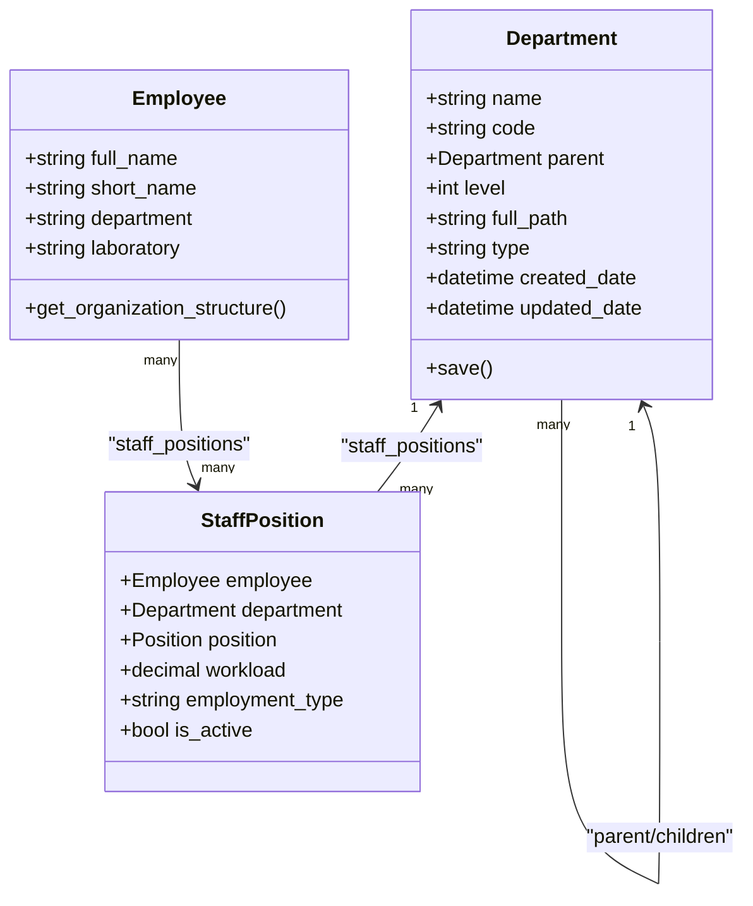
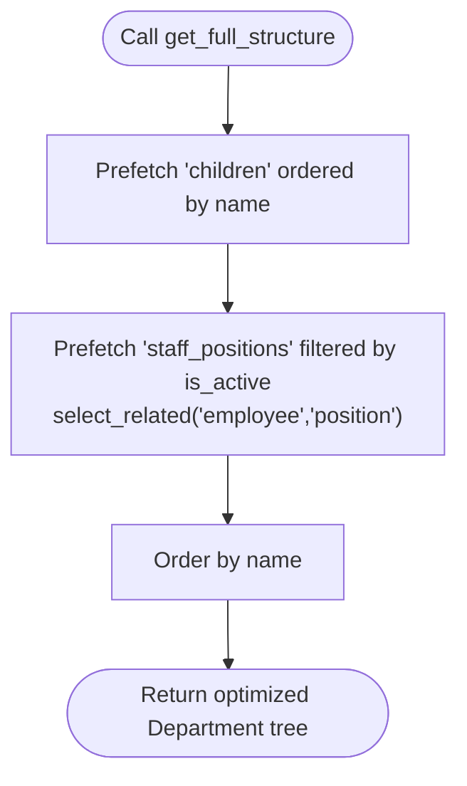
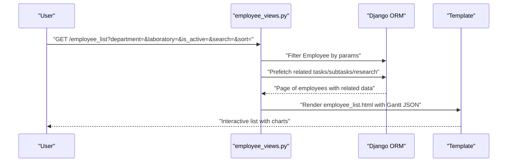
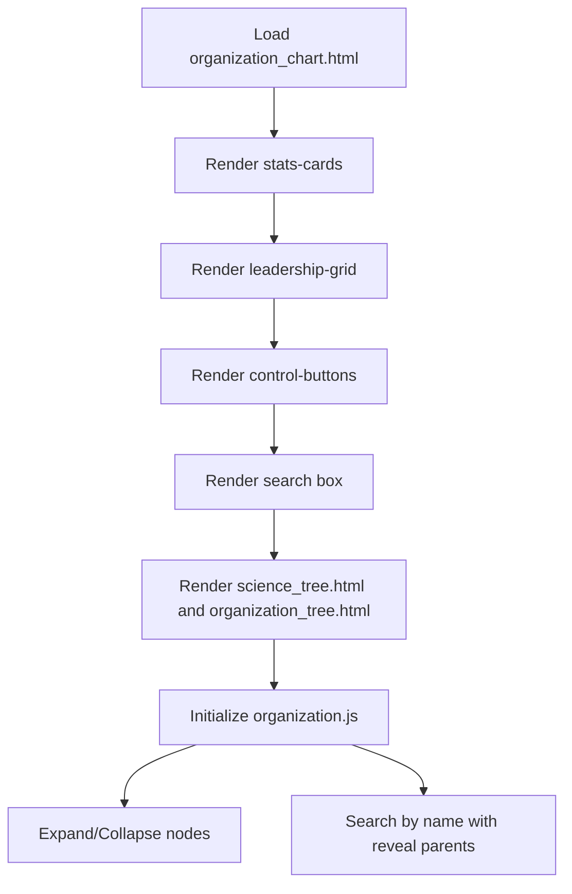
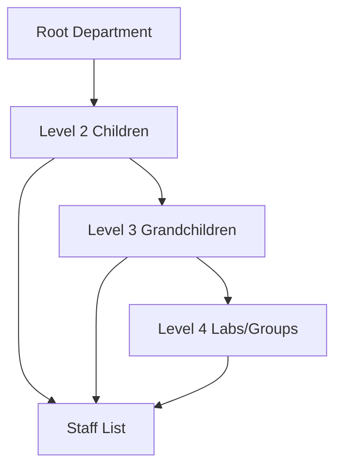
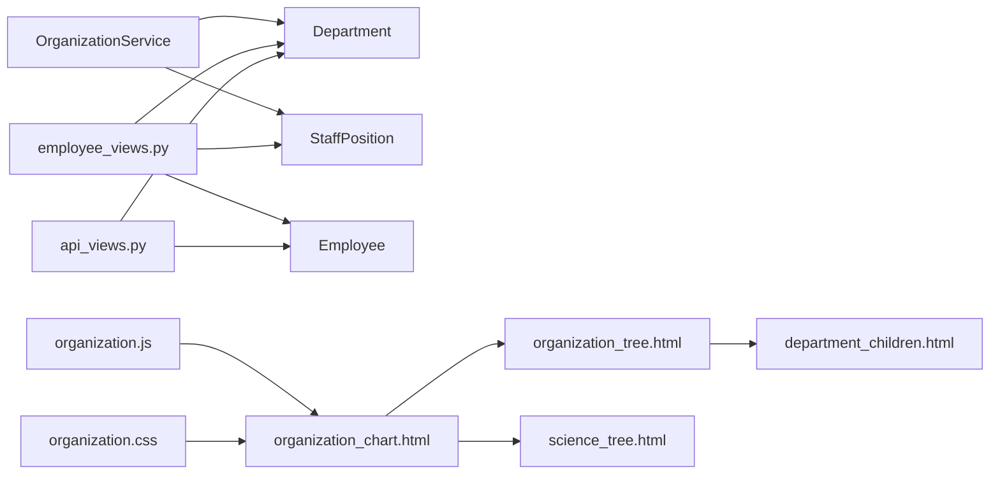

# Department Structure Management

<cite>
**Referenced Files in This Document**
- [models.py](file://tasks/models.py)
- [org_service.py](file://tasks/services/org_service.py)
- [employee_views.py](file://tasks/views/employee_views.py)
- [organization.js](file://static/js/organization.js)
- [organization.css](file://static/css/organization.css)
- [organization_chart.html](file://tasks/templates/tasks/organization_chart.html)
- [organization_tree.html](file://tasks/templates/tasks/partials/organization_tree.html)
- [science_tree.html](file://tasks/templates/tasks/partials/science_tree.html)
- [department_children.html](file://tasks/templates/tasks/partials/department_children.html)
- [api_views.py](file://tasks/views/api_views.py)
- [admin.py](file://tasks/admin.py)
</cite>

## Table of Contents
1. [Introduction](#introduction)
2. [Project Structure](#project-structure)
3. [Core Components](#core-components)
4. [Architecture Overview](#architecture-overview)
5. [Detailed Component Analysis](#detailed-component-analysis)
6. [Dependency Analysis](#dependency-analysis)
7. [Performance Considerations](#performance-considerations)
8. [Troubleshooting Guide](#troubleshooting-guide)
9. [Conclusion](#conclusion)

## Introduction
This document explains the department structure management and organizational hierarchy implementation. It covers the Department model with parent-child relationships and hierarchical navigation, the OrganizationService for efficient tree operations and queries, integration between departments, laboratories, and employee assignments, organization chart generation and navigation, filtering in employee views, search across organizational units, reporting capabilities, visualization techniques, and performance optimization for large hierarchies.

## Project Structure
The organizational hierarchy spans models, service layer, views, templates, and frontend assets:
- Models define Department, Employee, StaffPosition, and related research entities.
- OrganizationService provides optimized tree retrieval and grouping.
- Views handle employee lists, detail pages, and AJAX endpoints for dynamic UI updates.
- Templates render the organization chart and partial tree nodes.
- Frontend JavaScript/CSS implement interactive tree navigation and search.

**Diagram sources**
- [models.py:532-678](file://tasks/models.py#L532-L678)
- [org_service.py:4-53](file://tasks/services/org_service.py#L4-L53)
- [employee_views.py:18-332](file://tasks/views/employee_views.py#L18-L332)
- [api_views.py:9-130](file://tasks/views/api_views.py#L9-L130)
- [organization_chart.html:1-131](file://tasks/templates/tasks/organization_chart.html#L1-L131)
- [organization_tree.html:1-55](file://tasks/templates/tasks/partials/organization_tree.html#L1-L55)
- [science_tree.html:1-141](file://tasks/templates/tasks/partials/science_tree.html#L1-L141)
- [department_children.html:1-27](file://tasks/templates/tasks/partials/department_children.html#L1-L27)
- [organization.js:1-179](file://static/js/organization.js#L1-L179)
- [organization.css:1-591](file://static/css/organization.css#L1-L591)

**Section sources**
- [models.py:532-678](file://tasks/models.py#L532-L678)
- [org_service.py:4-53](file://tasks/services/org_service.py#L4-L53)
- [employee_views.py:18-332](file://tasks/views/employee_views.py#L18-L332)
- [organization_chart.html:1-131](file://tasks/templates/tasks/organization_chart.html#L1-L131)

## Core Components
- Department model with parent-child hierarchy, computed full_path, and level tracking.
- OrganizationService with prefetch-heavy queries, statistics aggregation, and grouping helpers.
- Employee integration via StaffPosition linking employees to departments and positions.
- Frontend organization chart with expand/collapse, search, and dynamic loading.

Key implementation references:
- Department model and save logic for full_path and level: [models.py:532-584](file://tasks/models.py#L532-L584)
- OrganizationService tree retrieval and statistics: [org_service.py:7-23](file://tasks/services/org_service.py#L7-L23)
- Employee-to-department resolution and organization structure extraction: [models.py:90-162](file://tasks/models.py#L90-L162)
- Frontend tree navigation and search: [organization.js:6-50](file://static/js/organization.js#L6-L50)

**Section sources**
- [models.py:532-584](file://tasks/models.py#L532-L584)
- [org_service.py:7-23](file://tasks/services/org_service.py#L7-L23)
- [models.py:90-162](file://tasks/models.py#L90-L162)
- [organization.js:6-50](file://static/js/organization.js#L6-L50)

## Architecture Overview
The system separates concerns across backend and frontend:
- Backend: Models define the hierarchy; OrganizationService optimizes tree queries; Views orchestrate rendering and AJAX responses.
- Frontend: organization.js manages UI state and interactions; organization.css styles the tree; templates assemble the chart and partial nodes.

**Diagram sources**
- [employee_views.py:18-332](file://tasks/views/employee_views.py#L18-L332)
- [org_service.py:7-14](file://tasks/services/org_service.py#L7-L14)
- [organization_chart.html:1-131](file://tasks/templates/tasks/organization_chart.html#L1-L131)
- [organization.js:157-179](file://static/js/organization.js#L157-L179)

## Detailed Component Analysis

### Department Model and Hierarchical Navigation
The Department model implements a recursive parent-child relationship with:
- Automatic level computation on save.
- Full path construction for human-readable hierarchy display.
- Type enumeration supporting directorate, department, laboratory, group, service, division.

- Parent-child traversal is supported by the foreign key relationship and computed full_path.
- Level-based navigation is used by Employee methods to resolve organizational tiers.

**Diagram sources**
- [models.py:532-584](file://tasks/models.py#L532-L584)
- [models.py:604-678](file://tasks/models.py#L604-L678)
- [models.py:134-162](file://tasks/models.py#L134-L162)

**Section sources**
- [models.py:532-584](file://tasks/models.py#L532-L584)
- [models.py:134-162](file://tasks/models.py#L134-L162)

### OrganizationService: Tree Operations and Queries
OrganizationService centralizes efficient tree operations:
- get_full_structure: Prefetches children and active staff_positions to minimize N+1 queries.
- get_statistics: Aggregates counts for departments, employees, and active staff positions.
- get_department_with_relations: Loads a single department with children and active staff.
- get_root_departments: Filters root nodes by parent being None.
- group_by_type: Groups departments by type for rendering specialized sections.

**Diagram sources**
- [org_service.py:7-14](file://tasks/services/org_service.py#L7-L14)

**Section sources**
- [org_service.py:7-23](file://tasks/services/org_service.py#L7-L23)
- [org_service.py:35-53](file://tasks/services/org_service.py#L35-L53)

### Employee Views: Filtering, Search, and Reporting
Employee views implement:
- Department and laboratory filtering via GET parameters.
- Active/inactive filtering and free-text search across names, email, and position.
- Sorting and pagination.
- Rich context for each employee including tasks, subtasks, research products, and Gantt data.
- AJAX endpoints for dynamic assignment and department detail loading.

**Diagram sources**
- [employee_views.py:18-332](file://tasks/views/employee_views.py#L18-L332)

**Section sources**
- [employee_views.py:18-332](file://tasks/views/employee_views.py#L18-L332)
- [api_views.py:73-93](file://tasks/views/api_views.py#L73-L93)
- [api_views.py:96-130](file://tasks/views/api_views.py#L96-L130)

### Organization Chart Generation and Navigation Controls
The organization chart page renders:
- Statistics cards for departments, employees, and staff positions.
- Leadership cards for leadership-type departments.
- Toggleable blocks for scientific and organizational sections.
- Interactive tree with expand/collapse and search.

**Diagram sources**
- [organization_chart.html:1-131](file://tasks/templates/tasks/organization_chart.html#L1-L131)
- [science_tree.html:1-141](file://tasks/templates/tasks/partials/science_tree.html#L1-L141)
- [organization_tree.html:1-55](file://tasks/templates/tasks/partials/organization_tree.html#L1-L55)
- [organization.js:157-179](file://static/js/organization.js#L157-L179)

**Section sources**
- [organization_chart.html:1-131](file://tasks/templates/tasks/organization_chart.html#L1-L131)
- [organization.js:6-50](file://static/js/organization.js#L6-L50)

### Tree Data Representation and Visualization
Tree rendering uses:
- Partial templates for scientific and organizational subtrees.
- Recursive children containers with connecting lines and staff lists.
- CSS grid and flex layouts to arrange nodes by level.
- JavaScript toggling to show/hide children and reveal staff.

**Diagram sources**
- [science_tree.html:31-82](file://tasks/templates/tasks/partials/science_tree.html#L31-L82)
- [organization_tree.html:20-51](file://tasks/templates/tasks/partials/organization_tree.html#L20-L51)
- [department_children.html:1-27](file://tasks/templates/tasks/partials/department_children.html#L1-L27)
- [organization.css:12-184](file://static/css/organization.css#L12-L184)

**Section sources**
- [science_tree.html:1-141](file://tasks/templates/tasks/partials/science_tree.html#L1-L141)
- [organization_tree.html:1-55](file://tasks/templates/tasks/partials/organization_tree.html#L1-L55)
- [department_children.html:1-27](file://tasks/templates/tasks/partials/department_children.html#L1-L27)
- [organization.css:12-184](file://static/css/organization.css#L12-L184)

### Department-Based Filtering and Search Across Units
- Employee list supports filtering by department, laboratory, and active status, plus search across names, email, and position.
- AJAX endpoints support dynamic assignment and lightweight employee search.
- OrganizationService groups departments by type for targeted rendering.

**Section sources**
- [employee_views.py:24-46](file://tasks/views/employee_views.py#L24-L46)
- [api_views.py:73-93](file://tasks/views/api_views.py#L73-L93)
- [org_service.py:42-53](file://tasks/services/org_service.py#L42-L53)

### Administrative Workflows and Caching
- Admin integration clears organization chart cache on Department changes to keep rendered charts fresh.
- This ensures that UI reflects structural changes immediately after edits.

**Section sources**
- [admin.py:11-19](file://tasks/admin.py#L11-L19)

## Dependency Analysis
The following diagram maps key dependencies among components:

**Diagram sources**
- [org_service.py:1-53](file://tasks/services/org_service.py#L1-L53)
- [employee_views.py:1-12](file://tasks/views/employee_views.py#L1-L12)
- [api_views.py:1-7](file://tasks/views/api_views.py#L1-L7)
- [organization_chart.html:1-131](file://tasks/templates/tasks/organization_chart.html#L1-L131)
- [organization_tree.html:1-55](file://tasks/templates/tasks/partials/organization_tree.html#L1-L55)
- [science_tree.html:1-141](file://tasks/templates/tasks/partials/science_tree.html#L1-L141)
- [department_children.html:1-27](file://tasks/templates/tasks/partials/department_children.html#L1-L27)
- [organization.js:1-179](file://static/js/organization.js#L1-L179)
- [organization.css:1-591](file://static/css/organization.css#L1-L591)

**Section sources**
- [org_service.py:1-53](file://tasks/services/org_service.py#L1-L53)
- [employee_views.py:1-12](file://tasks/views/employee_views.py#L1-L12)
- [api_views.py:1-7](file://tasks/views/api_views.py#L1-L7)

## Performance Considerations
- Efficient tree loading: OrganizationService uses prefetch_related and select_related to avoid N+1 queries when rendering the full tree.
- Indexes: Models include database indexes on parent, type, name, full_path, and level to accelerate lookups and sorting.
- Pagination: Employee list uses pagination to limit response sizes.
- Minimal DOM re-renders: Frontend toggles visibility and reveals parents during search to reduce server requests.
- Cache invalidation: Admin clears cached organization chart data on structural changes.

Recommendations:
- For very large hierarchies, consider paginating tree nodes and lazy-loading grandchildren on demand.
- Add caching for frequently accessed department aggregates and group_by_type results.
- Optimize CSS animations and JavaScript event handlers to prevent layout thrashing on deep trees.

**Section sources**
- [org_service.py:7-14](file://tasks/services/org_service.py#L7-L14)
- [models.py:561-571](file://tasks/models.py#L561-L571)
- [organization.js:108-154](file://static/js/organization.js#L108-L154)
- [admin.py:11-19](file://tasks/admin.py#L11-L19)

## Troubleshooting Guide
Common issues and resolutions:
- Empty or stale organization chart after structural changes: Ensure admin saves trigger cache deletion so the chart reloads fresh data.
- Slow tree rendering: Verify OrganizationService prefetches are applied and indexes are present on parent/type/name/full_path/level.
- Search not revealing parents: Confirm the search handler iterates up the DOM to show ancestor nodes when a child matches.
- Excessive memory usage on deep trees: Implement lazy loading of children and limit visible nodes per screen.

**Section sources**
- [admin.py:11-19](file://tasks/admin.py#L11-L19)
- [org_service.py:7-14](file://tasks/services/org_service.py#L7-L14)
- [organization.js:108-154](file://static/js/organization.js#L108-L154)

## Conclusion
The system provides a robust, efficient framework for managing organizational hierarchies. The Department model’s automatic path and level computation, combined with OrganizationService’s prefetch-heavy queries, enables scalable tree rendering. The integration with Employees via StaffPosition ties people to departments and positions. The organization chart UI offers intuitive navigation, search, and dynamic loading, while views and AJAX endpoints support filtering, reporting, and real-time updates. Performance is addressed through indexing, prefetching, pagination, and cache invalidation.