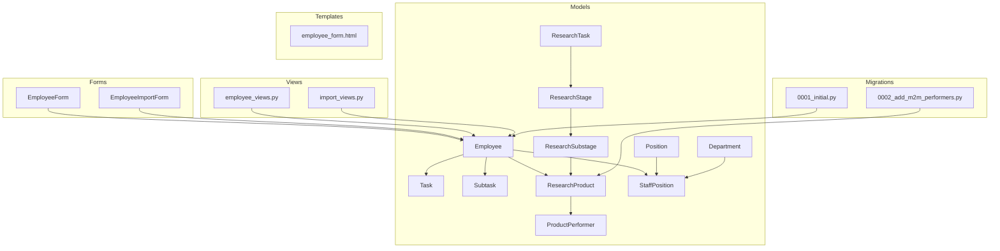
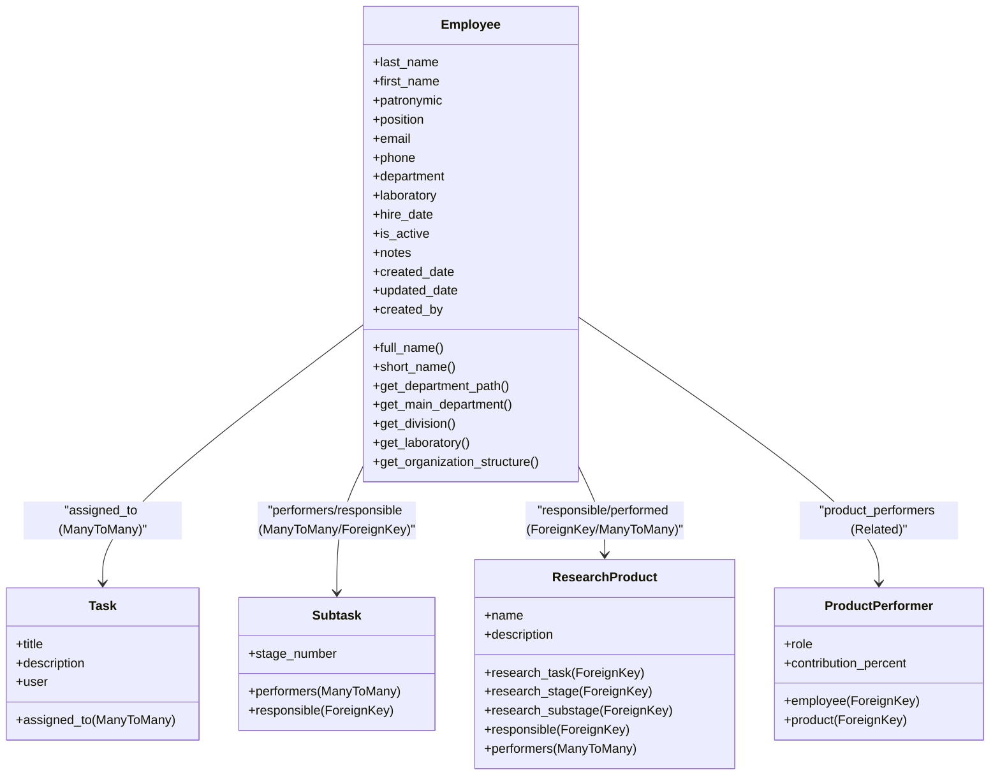
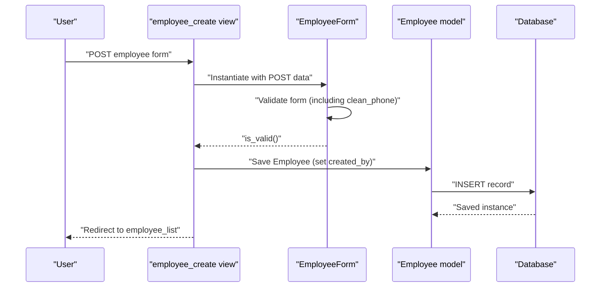
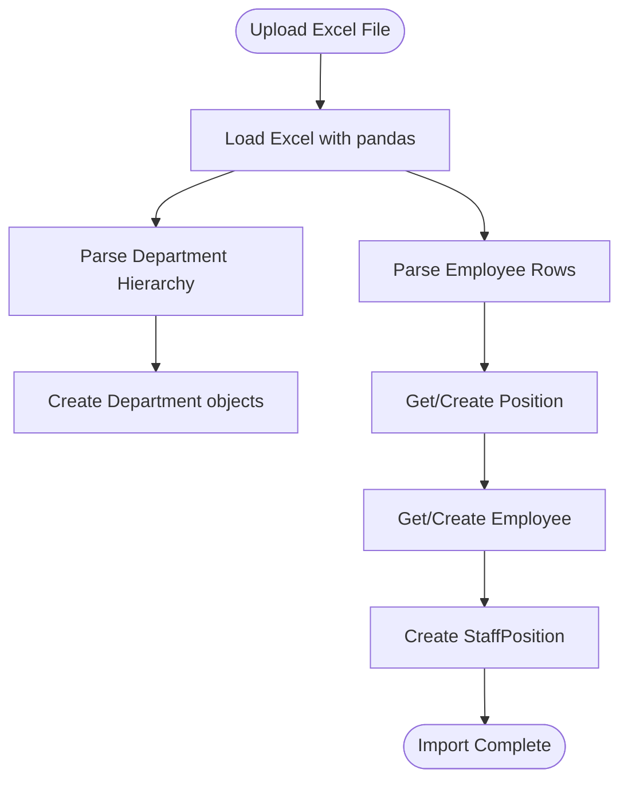
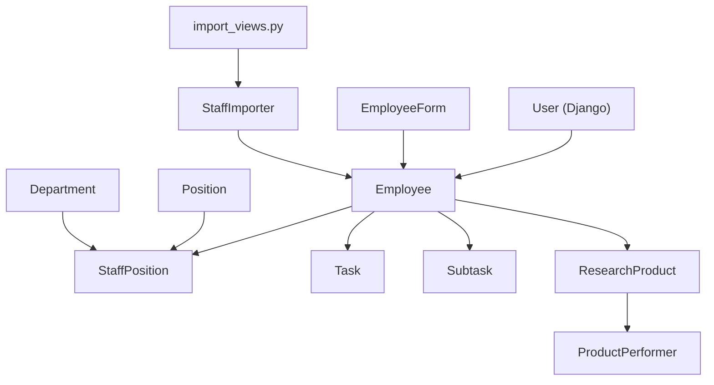

# Employee Data Model

<cite>
**Referenced Files in This Document**
- [models.py](file://tasks/models.py)
- [forms_employee.py](file://tasks/forms_employee.py)
- [employee_views.py](file://tasks/views/employee_views.py)
- [staff_importer.py](file://tasks/utils/staff_importer.py)
- [import_views.py](file://tasks/views/import_views.py)
- [employee_form.html](file://tasks/templates/tasks/employee_form.html)
- [0001_initial.py](file://tasks/migrations/0001_initial.py)
- [0002_add_m2m_performers.py](file://tasks/migrations/0002_add_m2m_performers.py)
</cite>

## Table of Contents
1. [Introduction](#introduction)
2. [Project Structure](#project-structure)
3. [Core Components](#core-components)
4. [Architecture Overview](#architecture-overview)
5. [Detailed Component Analysis](#detailed-component-analysis)
6. [Dependency Analysis](#dependency-analysis)
7. [Performance Considerations](#performance-considerations)
8. [Troubleshooting Guide](#troubleshooting-guide)
9. [Conclusion](#conclusion)

## Introduction
This document provides comprehensive documentation for the Employee data model and related form handling within the task management system. It covers the Employee model structure, relationships with Tasks, Subtasks, ResearchTask, ResearchStage, ResearchSubstage, and ResearchProduct, as well as the EmployeeForm implementation for validation and processing. It also documents the employee creation workflow, data import processes, and integration with Django's authentication system. Finally, it addresses data integrity constraints, indexing strategies, and performance considerations for large employee datasets.

## Project Structure
The Employee model and related functionality are organized across several modules:
- Data models: Employee, Task, Subtask, ResearchTask, ResearchStage, ResearchSubstage, ResearchProduct, Position, Department, StaffPosition, and ProductPerformer
- Forms: EmployeeForm and EmployeeImportForm
- Views: Employee CRUD operations and import handlers
- Templates: Employee form rendering
- Migrations: Initial model definitions and subsequent relationship additions
- Utilities: StaffImporter for Excel-based staff data import

**Diagram sources**
- [models.py:13-858](file://tasks/models.py#L13-L858)
- [forms_employee.py:6-53](file://tasks/forms_employee.py#L6-L53)
- [employee_views.py:1-1013](file://tasks/views/employee_views.py#L1-L1013)
- [staff_importer.py:1-328](file://tasks/utils/staff_importer.py#L1-L328)
- [import_views.py:1-113](file://tasks/views/import_views.py#L1-L113)
- [employee_form.html:1-44](file://tasks/templates/tasks/employee_form.html#L1-L44)
- [0001_initial.py:1-376](file://tasks/migrations/0001_initial.py#L1-L376)
- [0002_add_m2m_performers.py:1-16](file://tasks/migrations/0002_add_m2m_performers.py#L1-L16)

**Section sources**
- [models.py:13-858](file://tasks/models.py#L13-L858)
- [forms_employee.py:6-53](file://tasks/forms_employee.py#L6-L53)
- [employee_views.py:1-1013](file://tasks/views/employee_views.py#L1-L1013)
- [staff_importer.py:1-328](file://tasks/utils/staff_importer.py#L1-L328)
- [import_views.py:1-113](file://tasks/views/import_views.py#L1-L113)
- [employee_form.html:1-44](file://tasks/templates/tasks/employee_form.html#L1-L44)
- [0001_initial.py:1-376](file://tasks/migrations/0001_initial.py#L1-L376)
- [0002_add_m2m_performers.py:1-16](file://tasks/migrations/0002_add_m2m_performers.py#L1-L16)

## Core Components
This section documents the Employee model fields, validation rules, and model methods, along with the EmployeeForm implementation.

- Employee model fields:
  - Personal information: last_name, first_name, patronymic, position
  - Contact information: email (unique), phone
  - Employment details: department (choice field), laboratory (choice field)
  - Additional information: hire_date, is_active, notes
  - System information: created_date, updated_date, created_by (ForeignKey to User)

- Choice fields:
  - DEPARTMENT_CHOICES: development, design, marketing, sales, hr, administration, research, other
  - LABORATORY_CHOICES: lab1, lab2, lab3, research_lab, test_lab, other

- Model methods:
  - full_name: concatenation of last_name, first_name, and optional patronymic
  - short_name: last_name plus first and patronymic initials
  - get_department_path, get_main_department, get_division, get_laboratory: organizational hierarchy helpers
  - get_organization_structure: returns institute, department, laboratory, group, and full_path

- EmployeeForm:
  - Fields: last_name, first_name, patronymic, position, email, phone, department, laboratory, hire_date, is_active, notes
  - Widgets: date input for hire_date, textarea for notes, placeholder for phone
  - Validation: clean_phone ensures minimum digit length for phone numbers

- Authentication integration:
  - created_by field links Employee records to Django's User model
  - Views enforce login requirement via @login_required decorator

**Section sources**
- [models.py:13-89](file://tasks/models.py#L13-L89)
- [models.py:72-162](file://tasks/models.py#L72-L162)
- [forms_employee.py:6-40](file://tasks/forms_employee.py#L6-L40)
- [employee_views.py:702-718](file://tasks/views/employee_views.py#L702-L718)

## Architecture Overview
The Employee model participates in multiple relationships across the task management domain. The following diagram illustrates the primary relationships between Employee and other models, focusing on ManyToMany and ForeignKey associations.

**Diagram sources**
- [models.py:165-238](file://tasks/models.py#L165-L238)
- [models.py:239-382](file://tasks/models.py#L239-L382)
- [models.py:681-791](file://tasks/models.py#L681-L791)
- [models.py:793-858](file://tasks/models.py#L793-L858)

## Detailed Component Analysis

### Employee Model Analysis
The Employee model encapsulates personnel data and organizational context. It includes:
- Field definitions with constraints and choices
- Properties for computed display values
- Methods for organizational hierarchy extraction
- Meta options for ordering and indexing

Key implementation patterns:
- Choice fields ensure controlled vocabulary for department and laboratory categories
- Unique constraint on email prevents duplicates
- created_by maintains provenance linked to Django's User model
- Indexes optimize common queries (name combinations, email, active status, department)

**Section sources**
- [models.py:13-89](file://tasks/models.py#L13-L89)
- [models.py:58-67](file://tasks/models.py#L58-L67)
- [models.py:72-162](file://tasks/models.py#L72-L162)

### EmployeeForm Implementation
The EmployeeForm extends Django's ModelForm to handle Employee instances with:
- Explicit field selection and widget customization
- Dynamic class assignment for form controls
- Required field indicators
- Phone number validation ensuring a minimum digit threshold

Validation rules:
- clean_phone: removes non-digit characters and validates minimum length

**Section sources**
- [forms_employee.py:6-40](file://tasks/forms_employee.py#L6-L40)

### Employee Creation Workflow
The employee creation workflow integrates form processing, authentication, and data persistence:
1. View receives POST with form data
2. Form validation occurs automatically
3. On success, a new Employee instance is created with created_by set to the current user
4. Success message and redirection to employee list

**Diagram sources**
- [employee_views.py:702-718](file://tasks/views/employee_views.py#L702-L718)
- [forms_employee.py:6-40](file://tasks/forms_employee.py#L6-L40)
- [models.py:13-89](file://tasks/models.py#L13-L89)

**Section sources**
- [employee_views.py:702-718](file://tasks/views/employee_views.py#L702-L718)
- [employee_form.html:13-39](file://tasks/templates/tasks/employee_form.html#L13-L39)

### Data Import Processes
The system supports importing staff data from Excel files using StaffImporter:
- Parses department hierarchy and creates Department entries
- Creates Position entries and Employee records
- Establishes StaffPosition relationships linking Employee, Department, and Position
- Handles workloads and employment types with parsing logic
- Imports research product performers via ProductPerformer model

**Diagram sources**
- [staff_importer.py:186-328](file://tasks/utils/staff_importer.py#L186-L328)
- [import_views.py:78-113](file://tasks/views/import_views.py#L78-L113)

**Section sources**
- [staff_importer.py:1-328](file://tasks/utils/staff_importer.py#L1-L328)
- [import_views.py:78-113](file://tasks/views/import_views.py#L78-L113)

### Model Relationships with Tasks and Research
Employee participates in numerous relationships:
- Task.assigned_to: ManyToMany<Employee>
- Subtask.performers: ManyToMany<Employee>, Subtask.responsible: ForeignKey<Employee>
- ResearchProduct.responsible: ForeignKey<Employee>, ResearchProduct.performers: ManyToMany<Employee>
- ProductPerformer.employee: ForeignKey<Employee>, ProductPerformer.product: ForeignKey<ResearchProduct>

These relationships enable tracking who performs or is responsible for tasks and research deliverables.

**Section sources**
- [models.py:191-197](file://tasks/models.py#L191-L197)
- [models.py:269-285](file://tasks/models.py#L269-L285)
- [models.py:695-703](file://tasks/models.py#L695-L703)
- [models.py:793-858](file://tasks/models.py#L793-L858)

## Dependency Analysis
The Employee model and related components exhibit the following dependencies:
- Employee depends on Django's User model via created_by
- Employee is central to multiple ManyToMany and ForeignKey relationships across Task, Subtask, ResearchProduct, and ProductPerformer
- StaffPosition bridges Employee, Department, and Position, enabling hierarchical organization
- Forms depend on models for validation and field definitions
- Views orchestrate form processing and model interactions
- Migrations define initial schema and later relationship additions

**Diagram sources**
- [models.py:13-89](file://tasks/models.py#L13-L89)
- [models.py:604-677](file://tasks/models.py#L604-L677)
- [models.py:681-791](file://tasks/models.py#L681-L791)
- [forms_employee.py:6-40](file://tasks/forms_employee.py#L6-L40)
- [staff_importer.py:1-328](file://tasks/utils/staff_importer.py#L1-L328)
- [import_views.py:78-113](file://tasks/views/import_views.py#L78-L113)

**Section sources**
- [models.py:13-858](file://tasks/models.py#L13-L858)
- [forms_employee.py:6-53](file://tasks/forms_employee.py#L6-L53)
- [staff_importer.py:1-328](file://tasks/utils/staff_importer.py#L1-L328)
- [import_views.py:78-113](file://tasks/views/import_views.py#L78-L113)

## Performance Considerations
- Indexes: The Employee model defines indexes on name combination, email, active status, and department to accelerate filtering and sorting operations.
- Query optimization: Views leverage select_related and prefetch_related to minimize database hits when fetching related objects (e.g., tasks, subtasks, research products).
- Pagination: Employee listing uses pagination to limit result sets for large datasets.
- Caching: Import operations trigger cache invalidation for organizational chart data to keep derived views consistent.
- Data integrity: Unique constraints (email) and unique_together constraints (e.g., StaffPosition) prevent inconsistent states.

Best practices:
- Use select_related/select_prefetch_related consistently for related fields in list/detail views
- Leverage database indexes for frequent filter/sort fields (email, is_active, department)
- Batch operations during imports to reduce transaction overhead
- Monitor query performance with Django Debug Toolbar or similar tools

**Section sources**
- [models.py:58-67](file://tasks/models.py#L58-L67)
- [models.py:664-674](file://tasks/models.py#L664-L674)
- [employee_views.py:18-56](file://tasks/views/employee_views.py#L18-L56)
- [import_views.py:101-103](file://tasks/views/import_views.py#L101-L103)

## Troubleshooting Guide
Common issues and resolutions:
- Duplicate email errors: Ensure email uniqueness when creating or updating Employees
- Phone validation failures: Verify phone numbers meet minimum digit requirements after cleaning
- Deletion conflicts: Employees cannot be deleted if they have active tasks or products; resolve active items first
- Import inconsistencies: Confirm Excel formatting matches expected schema; verify department hierarchy precedence

Debugging tips:
- Use Django shell to inspect Employee instances and related objects
- Check migration history for missing relationships (e.g., ResearchProduct performers)
- Review cache invalidation after import operations affecting organizational charts

**Section sources**
- [forms_employee.py:32-39](file://tasks/forms_employee.py#L32-L39)
- [employee_views.py:754-800](file://tasks/views/employee_views.py#L754-L800)
- [0002_add_m2m_performers.py:10-16](file://tasks/migrations/0002_add_m2m_performers.py#L10-L16)

## Conclusion
The Employee model serves as a central entity in the task management system, integrating personal and organizational attributes with robust relationships to tasks, subtasks, and research deliverables. The EmployeeForm provides essential validation and user interface integration, while import utilities streamline onboarding of staff data. Proper indexing, query optimization, and adherence to data integrity constraints ensure reliable performance at scale. The documented workflows and troubleshooting guidance support maintainable operation of the employee management functionality.