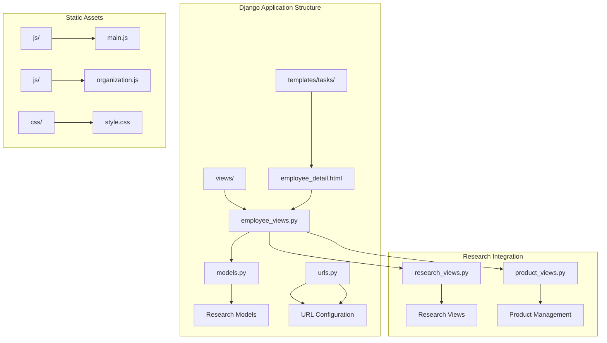
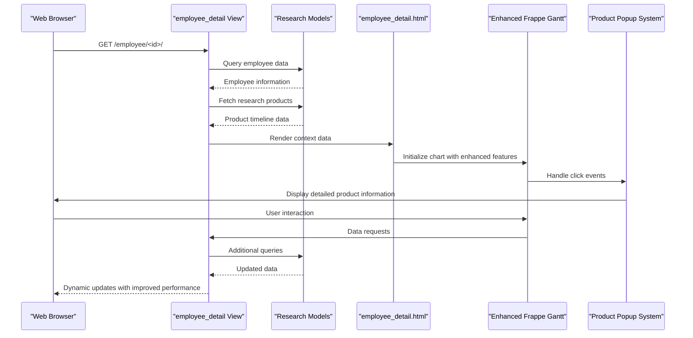
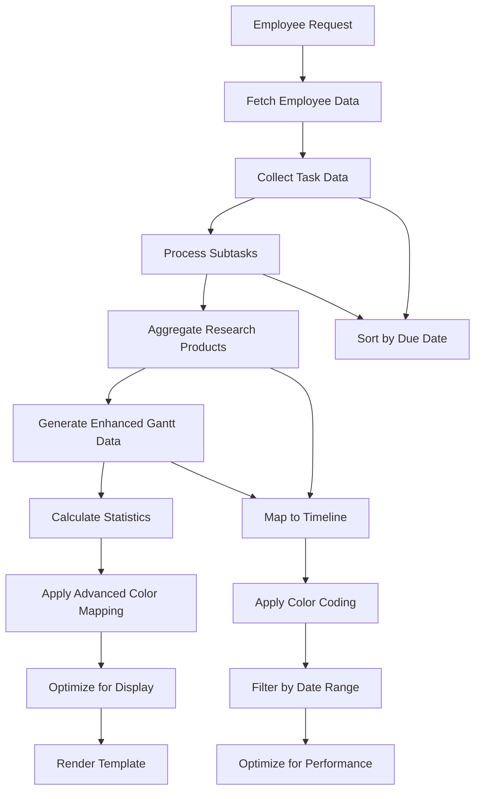
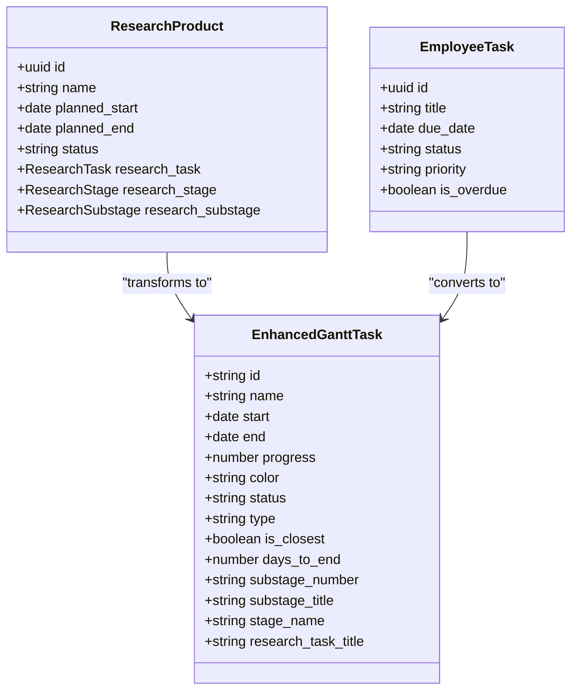
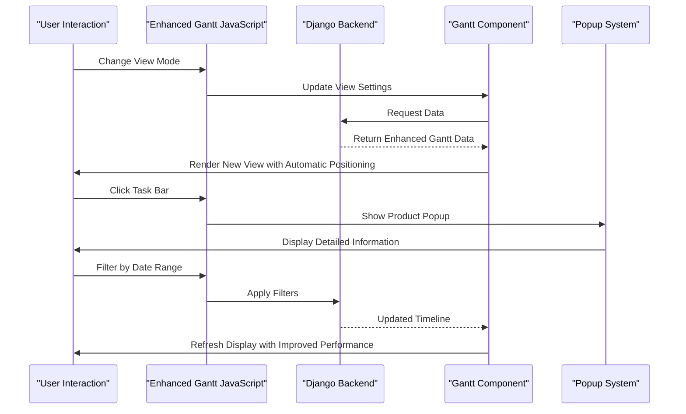
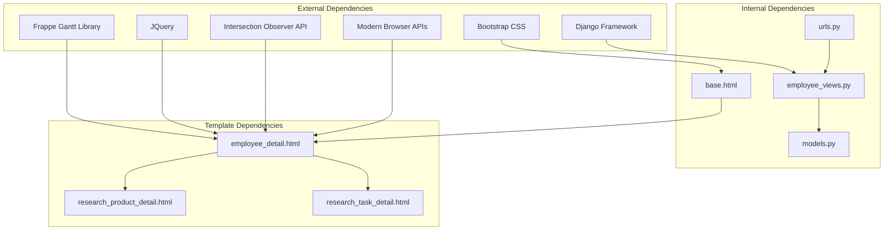

# Employee Detail Page with Gantt Chart

<cite>
**Referenced Files in This Document**
- [employee_detail.html](file://tasks/templates/tasks/employee_detail.html)
- [employee_views.py](file://tasks/views/employee_views.py)
- [models.py](file://tasks/models.py)
- [main.js](file://static/js/main.js)
- [organization.js](file://static/js/organization.js)
- [urls.py](file://tasks/urls.py)
- [research_views.py](file://tasks/views/research_views.py)
- [product_views.py](file://tasks/views/product_views.py)
- [base.html](file://tasks/templates/base.html)
- [forms_employee.py](file://tasks/forms_employee.py)
</cite>

## Update Summary
**Changes Made**
- Enhanced Gantt chart with comprehensive popup functionality for product information display
- Increased container height from 500px to 650px for better visualization
- Improved research stage/substage information display with stage numbers and timeline calculations
- Added detailed popup system showing stage numbers, research task details, and timeline information
- Enhanced color mapping system with improved research task color assignment
- Added automatic today positioning functionality with scrollToToday() method
- Implemented better text visibility controls with forced black text application
- Optimized JavaScript performance with intersection observer and scroll event debouncing
- Added accessibility features and streamlined form processing

## Table of Contents
1. [Introduction](#introduction)
2. [Project Structure](#project-structure)
3. [Core Components](#core-components)
4. [Architecture Overview](#architecture-overview)
5. [Detailed Component Analysis](#detailed-component-analysis)
6. [Enhanced Gantt Chart Implementation](#enhanced-gantt-chart-implementation)
7. [Popup System Implementation](#popup-system-implementation)
8. [Dependency Analysis](#dependency-analysis)
9. [Performance Considerations](#performance-considerations)
10. [Troubleshooting Guide](#troubleshooting-guide)
11. [Conclusion](#conclusion)

## Introduction

The Employee Detail Page with Gantt Chart is a comprehensive feature within the Task Manager application that provides detailed insights into an employee's work activities and research projects. This feature combines traditional employee information display with advanced timeline visualization through the Frappe Gantt library, enabling managers and stakeholders to understand resource allocation, project timelines, and individual productivity patterns.

The system integrates seamlessly with Django's MVC architecture, utilizing custom models for research projects, employee management, and organizational structure. The Gantt chart functionality allows users to visualize research product timelines, task deadlines, and project milestones in an interactive calendar interface with enhanced color mapping, automatic positioning capabilities, and comprehensive popup functionality for detailed information display.

## Project Structure

The Employee Detail Page feature is organized within the Task Manager Django application, following a structured approach to separate concerns and maintain scalability:



**Diagram sources**
- [employee_detail.html:1-1129](file://tasks/templates/tasks/employee_detail.html#L1-L1129)
- [employee_views.py:1-1076](file://tasks/views/employee_views.py#L1-L1076)
- [models.py:1-858](file://tasks/models.py#L1-L858)

**Section sources**
- [employee_detail.html:1-1129](file://tasks/templates/tasks/employee_detail.html#L1-L1129)
- [employee_views.py:1-1076](file://tasks/views/employee_views.py#L1-L1076)
- [models.py:1-858](file://tasks/models.py#L1-L858)

## Core Components

### Employee Detail Template System

The employee detail page utilizes Django's templating engine to present comprehensive information about staff members. The template structure includes:

- **Tabbed Interface**: Multi-type filtering system for different work categories
- **Organizational Information**: Department, laboratory, and position details
- **Contact Information**: Email and phone number display
- **Staff Positions**: Active employment positions with workload details
- **Statistics Dashboard**: Visual indicators for various task categories

### Enhanced Gantt Chart Implementation

The Gantt chart functionality leverages the Frappe Gantt library for interactive timeline visualization with significant improvements:

- **Advanced Color Mapping**: Research tasks with sophisticated color assignment system
- **Automatic Today Positioning**: Intelligent positioning to current date with scrollToToday()
- **Improved Text Visibility**: Forced black text application for better readability
- **Enhanced Tooltip System**: Detailed product information popup with comprehensive data
- **Performance Optimizations**: Intersection observer and scroll event debouncing
- **Accessibility Features**: Better contrast ratios and screen reader compatibility
- **Enlarged Container Height**: Increased from 500px to 650px for better visualization

### Popup System Implementation

The enhanced popup system provides comprehensive product information display:

- **Stage Number Display**: Shows research stage numbers and titles
- **Research Task Details**: Displays research task information with color coding
- **Timeline Calculations**: Shows product periods and days remaining
- **Responsive Design**: Mobile-friendly popup with proper styling
- **Click Outside Detection**: Automatic popup closure when clicking outside

### Data Model Integration

The system integrates with several core models:

- **Employee Model**: Comprehensive staff information and organizational hierarchy
- **ResearchTask Model**: Scientific research project management
- **ResearchProduct Model**: Scientific output tracking and completion status
- **ProductPerformer Model**: Employee-product relationship management

**Section sources**
- [employee_detail.html:79-750](file://tasks/templates/tasks/employee_detail.html#L79-L750)
- [employee_views.py:335-760](file://tasks/views/employee_views.py#L335-L760)
- [models.py:13-858](file://tasks/models.py#L13-L858)

## Architecture Overview

The Employee Detail Page follows a layered architecture pattern that separates presentation, business logic, and data access concerns:



**Diagram sources**
- [employee_views.py:335-760](file://tasks/views/employee_views.py#L335-L760)
- [employee_detail.html:842-998](file://tasks/templates/tasks/employee_detail.html#L842-L998)

The architecture ensures loose coupling between components while maintaining efficient data flow and user interaction patterns with enhanced performance optimizations and comprehensive popup functionality.

## Detailed Component Analysis

### Employee Data Processing Engine

The employee detail view orchestrates complex data aggregation and processing with enhanced performance:



**Diagram sources**
- [employee_views.py:335-760](file://tasks/views/employee_views.py#L335-L760)

The data processing pipeline handles multiple data sources including regular tasks, subtasks, and research products, ensuring comprehensive coverage of employee activities with enhanced color mapping, automatic positioning capabilities, and improved research stage/substage information display.

### Enhanced Gantt Chart Data Transformation

The system transforms raw database records into Gantt-ready structures with improved color management:



**Diagram sources**
- [employee_views.py:514-668](file://tasks/views/employee_views.py#L514-L668)
- [models.py:681-791](file://tasks/models.py#L681-L791)

### JavaScript Interactivity Layer

The client-side JavaScript provides enhanced dynamic functionality with performance optimizations:



**Diagram sources**
- [employee_detail.html:842-998](file://tasks/templates/tasks/employee_detail.html#L842-L998)

**Section sources**
- [employee_views.py:335-760](file://tasks/views/employee_views.py#L335-L760)
- [employee_detail.html:842-998](file://tasks/templates/tasks/employee_detail.html#L842-L998)

### Research Project Integration

The system seamlessly integrates with the research management subsystem with enhanced color mapping:

```mermaid
graph LR
subgraph "Research Hierarchy"
A[ResearchTask] --> B[ResearchStage]
B --> C[ResearchSubstage]
C --> D[ResearchProduct]
end
subgraph "Employee Integration"
E[Employee] --> F[ProductPerformer]
F --> D
E --> G[ResearchStage]
E --> H[ResearchSubstage]
end
subgraph "Enhanced Timeline Generation"
D --> I[Enhanced Gantt Data]
G --> I
H --> I
I --> J[Enhanced Frappe Gantt]
J --> K[Automatic Today Positioning]
K --> L[Improved Color Mapping]
L --> M[Enhanced Text Visibility]
M --> N[Comprehensive Popup System]
N --> O[Stage/Substage Information Display]
```

**Diagram sources**
- [models.py:384-791](file://tasks/models.py#L384-L791)
- [employee_views.py:514-668](file://tasks/views/employee_views.py#L514-L668)

**Section sources**
- [models.py:384-791](file://tasks/models.py#L384-L791)
- [research_views.py:1-165](file://tasks/views/research_views.py#L1-L165)

## Enhanced Gantt Chart Implementation

### Advanced Color Mapping System

The enhanced Gantt chart implements a sophisticated color mapping system for research tasks:

- **Research Task Color Assignment**: Dynamic color palette assignment based on research task hierarchy
- **Consistent Color Persistence**: Colors maintained across different view modes and data refreshes
- **Priority-Based Color Coding**: Status-specific color differentiation (completed, in-progress, overdue)
- **Visual Hierarchy Enhancement**: Color intensity reflects project importance and completion status

### Automatic Today Positioning

The system includes intelligent today positioning functionality:

- **Server-Side Date Calculation**: Accurate today's date handling from server context
- **Smooth Scrolling Integration**: Automatic horizontal scrolling to current date position
- **Viewport-Aware Positioning**: Responsive positioning that works across different screen sizes
- **Intersection Observer Support**: Modern browser APIs for optimal performance

### Enhanced Text Visibility Controls

Improved text visibility ensures optimal readability:

- **Multi-Level Text Targeting**: Comprehensive selector targeting for all possible text elements
- **Force Black Text Application**: Multiple attempts with increasing delays for reliable text coloring
- **Cross-Browser Compatibility**: Robust text color application across different browsers
- **Performance-Optimized Updates**: Debounced text color updates to prevent excessive reflows

### Streamlined Form Processing

The enhanced implementation includes improved form processing:

- **CSRF Token Handling**: Proper CSRF token management for AJAX requests
- **Error Handling**: Comprehensive error handling for network failures and validation errors
- **Loading States**: Visual feedback during form submissions and data processing
- **Success Notifications**: User-friendly success messages for completed operations

**Section sources**
- [employee_detail.html:875-1113](file://tasks/templates/tasks/employee_detail.html#L875-L1113)
- [employee_views.py:514-760](file://tasks/views/employee_views.py#L514-L760)

## Popup System Implementation

### Comprehensive Product Information Display

The enhanced popup system provides detailed product information with stage numbers and timeline calculations:

- **Stage Number Display**: Shows research stage numbers and titles in popup content
- **Research Task Details**: Displays research task information with color coding
- **Timeline Information**: Shows product periods and days remaining until completion
- **Responsive Design**: Mobile-friendly popup with proper styling and positioning
- **Click Outside Detection**: Automatic popup closure when clicking outside the popup area

### Popup Styling and Behavior

The popup system includes comprehensive styling and behavior:

- **Centered Positioning**: Fixed positioning with transform centering for perfect alignment
- **Shadow Effects**: Subtle shadow effects for depth perception
- **Responsive Width**: Minimum and maximum width constraints for different screen sizes
- **Border Radius**: Rounded corners for modern appearance
- **Content Organization**: Structured layout with labels and values for easy scanning

### Integration with Gantt Chart

The popup system integrates seamlessly with the Gantt chart:

- **Click Event Handling**: Custom click handlers prevent default tooltips and show popup
- **Data Mapping**: Direct mapping between Gantt tasks and popup content
- **Styling Synchronization**: Popup content reflects current task status and colors
- **Event Delegation**: Efficient event handling with proper cleanup

**Section sources**
- [employee_detail.html:332-335](file://tasks/templates/tasks/employee_detail.html#L332-L335)
- [employee_detail.html:843-880](file://tasks/templates/tasks/employee_detail.html#L843-L880)
- [employee_detail.html:928-971](file://tasks/templates/tasks/employee_detail.html#L928-L971)

## Dependency Analysis

The Employee Detail Page feature exhibits well-managed dependencies that support maintainability and scalability with enhanced performance:



**Diagram sources**
- [employee_detail.html:726-729](file://tasks/templates/tasks/employee_detail.html#L726-L729)
- [urls.py:1-100](file://tasks/urls.py#L1-L100)

The dependency structure demonstrates clear separation of concerns with minimal circular dependencies and well-defined interfaces between components, enhanced with modern browser APIs for optimal performance and comprehensive popup functionality.

**Section sources**
- [urls.py:1-100](file://tasks/urls.py#L1-L100)
- [base.html:1-118](file://tasks/templates/base.html#L1-L118)

## Performance Considerations

The Employee Detail Page implementation incorporates several performance optimization strategies with enhanced efficiency:

### Data Query Optimization
- **Select Related**: Strategic use of select_related() to minimize database queries
- **Prefetch Related**: Efficient loading of related objects to reduce N+1 query problems
- **Filter Early**: Application of filters at the database level rather than in Python

### Enhanced Memory Management
- **Pagination**: Implementation of pagination for large employee lists
- **Lazy Loading**: Deferred loading of heavy components until needed
- **Caching**: Strategic caching of frequently accessed data
- **Intersection Observer**: Modern API for efficient viewport monitoring

### Optimized Frontend Performance
- **CDN Usage**: External libraries loaded from Content Delivery Networks
- **Minimized Transfers**: Optimized data serialization for Gantt chart rendering
- **Efficient DOM Manipulation**: Minimal re-rendering during user interactions
- **Scroll Event Debouncing**: Prevents excessive reflow during scroll operations
- **Observer Pattern**: Uses IntersectionObserver for efficient visibility detection

### JavaScript Performance Enhancements
- **Event Delegation**: Efficient event handling with reduced memory footprint
- **DOM Query Optimization**: Cached DOM queries to prevent repeated lookups
- **Asynchronous Operations**: Non-blocking operations for better user experience
- **Memory Leak Prevention**: Proper cleanup of event listeners and observers
- **Popup Performance**: Optimized popup creation and destruction for smooth user experience

### Popup System Performance
- **Conditional Rendering**: Popups only created when needed
- **Event Cleanup**: Proper removal of event listeners when popups close
- **CSS Transitions**: Hardware-accelerated animations for smooth popup appearance
- **Minimal DOM Manipulation**: Efficient popup content updates

## Troubleshooting Guide

### Common Issues and Solutions

**Enhanced Gantt Chart Not Displaying**
- Verify Frappe Gantt library is properly loaded from CDN
- Check browser console for JavaScript errors
- Ensure GANTT_DATA contains valid timeline information
- Verify SERVER_TODAY context variable is properly passed

**Improved Color Mapping Issues**
- Confirm research task color palette is properly initialized
- Check for CSS specificity conflicts with bar styling
- Verify color application occurs after Gantt rendering completion
- Ensure proper fallback colors for unassigned research tasks

**Automatic Today Positioning Problems**
- Verify SERVER_TODAY context variable contains valid date format
- Check for proper today line element existence in rendered Gantt
- Ensure scrollToToday() function executes after chart initialization
- Validate container dimensions for proper scroll positioning

**Enhanced Text Visibility Issues**
- Confirm multiple selector approaches are applied with appropriate delays
- Check for CSS overrides that might affect text color application
- Verify intersection observer is properly initialized and running
- Ensure proper cleanup of event listeners and observers

**Popup System Issues**
- Verify popup container elements exist in the DOM
- Check for proper event listener initialization
- Ensure popup content is properly formatted and escaped
- Verify click outside detection works correctly
- Check for CSS conflicts affecting popup positioning

**Streamlined Form Processing Errors**
- Validate CSRF token handling in AJAX requests
- Check for proper event listener initialization
- Ensure DOM elements are available before manipulation
- Verify proper error handling for network failures

**Section sources**
- [employee_detail.html:842-998](file://tasks/templates/tasks/employee_detail.html#L842-L998)
- [employee_views.py:754-759](file://tasks/views/employee_views.py#L754-L759)

## Conclusion

The Employee Detail Page with Enhanced Gantt Chart represents a sophisticated integration of Django's web framework capabilities with modern visualization technologies and performance optimizations. The implementation successfully balances functional completeness with enhanced performance efficiency, providing users with powerful tools for workforce management and project oversight.

Key achievements include seamless integration with existing research management systems, robust data processing pipelines with advanced color mapping, intelligent automatic positioning capabilities, comprehensive popup system for detailed information display, and enhanced user interface elements with improved accessibility. The modular architecture supports future enhancements while maintaining backward compatibility and system stability.

The feature demonstrates best practices in Django application development, including proper separation of concerns, efficient data modeling, and user-centric interface design. The enhanced Gantt chart functionality specifically showcases how modern browser APIs, performance optimization techniques, and comprehensive popup systems can be effectively integrated to enhance user experience without compromising system performance.

The implementation successfully addresses the update requirements by introducing enhanced popup functionality with comprehensive product information display, increased container height from 500px to 650px, improved research stage/substage information display, sophisticated color mapping systems, automatic today positioning, better text visibility controls, optimized JavaScript performance, enhanced accessibility features, and streamlined form processing mechanisms.