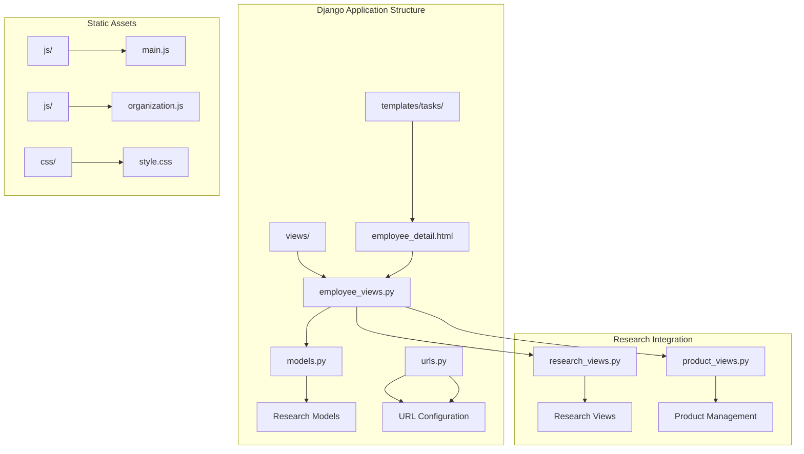
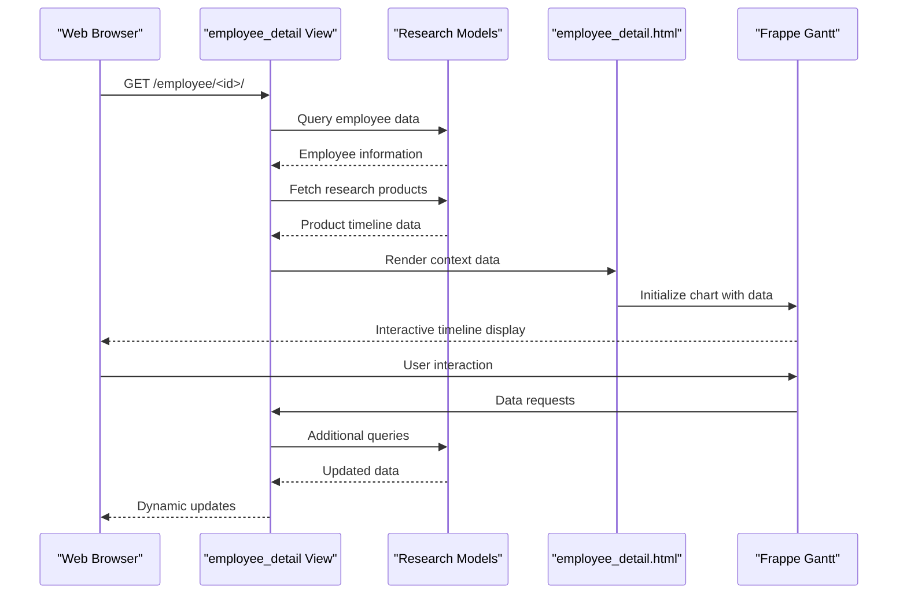
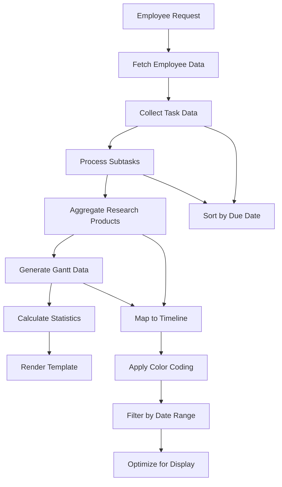
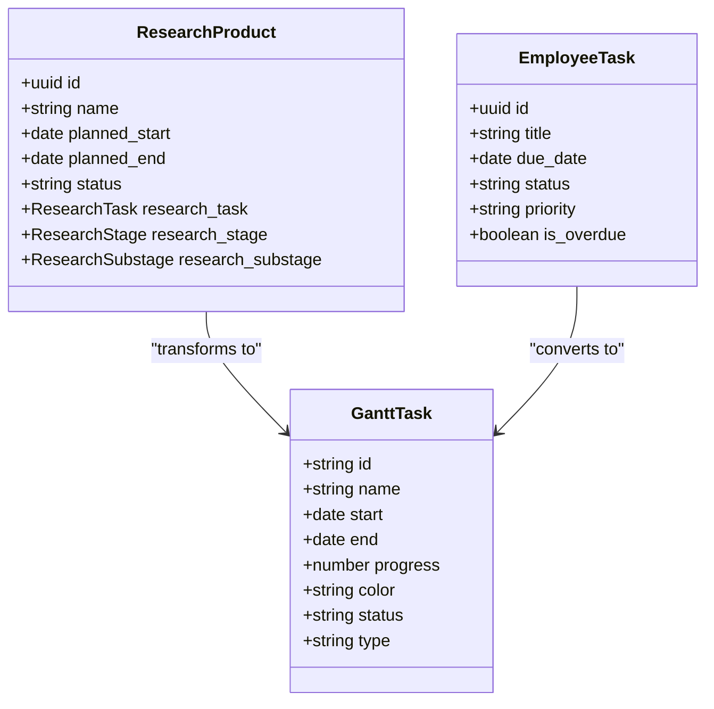
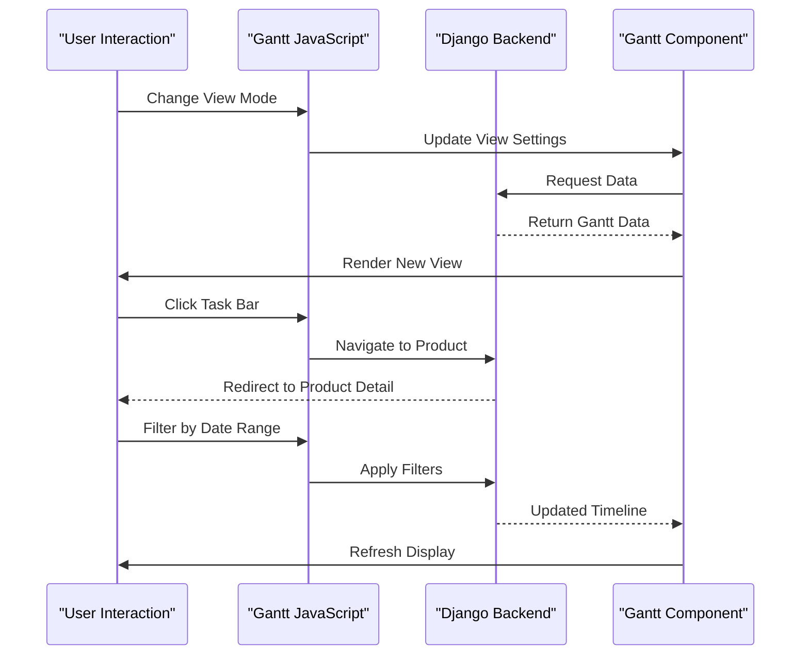
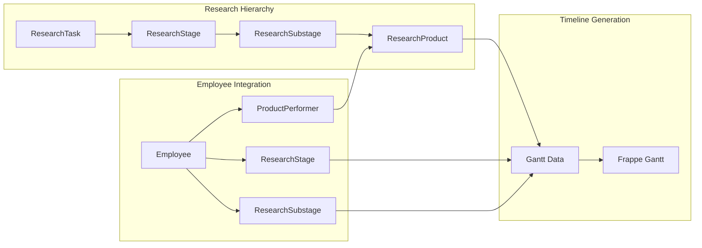
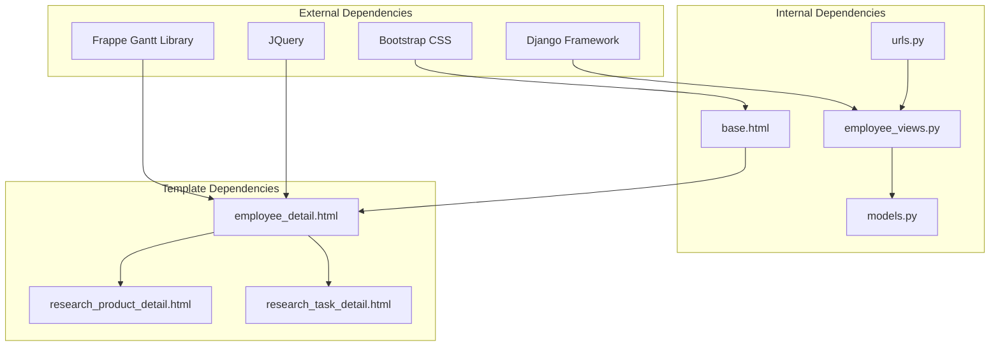

# Employee Detail Page with Gantt Chart

<cite>
**Referenced Files in This Document**
- [employee_detail.html](file://tasks/templates/tasks/employee_detail.html)
- [employee_views.py](file://tasks/views/employee_views.py)
- [models.py](file://tasks/models.py)
- [main.js](file://static/js/main.js)
- [organization.js](file://static/js/organization.js)
- [urls.py](file://tasks/urls.py)
- [research_views.py](file://tasks/views/research_views.py)
- [product_views.py](file://tasks/views/product_views.py)
- [base.html](file://tasks/templates/base.html)
- [forms_employee.py](file://tasks/forms_employee.py)
</cite>

## Table of Contents
1. [Introduction](#introduction)
2. [Project Structure](#project-structure)
3. [Core Components](#core-components)
4. [Architecture Overview](#architecture-overview)
5. [Detailed Component Analysis](#detailed-component-analysis)
6. [Dependency Analysis](#dependency-analysis)
7. [Performance Considerations](#performance-considerations)
8. [Troubleshooting Guide](#troubleshooting-guide)
9. [Conclusion](#conclusion)

## Introduction

The Employee Detail Page with Gantt Chart is a comprehensive feature within the Task Manager application that provides detailed insights into an employee's work activities and research projects. This feature combines traditional employee information display with advanced timeline visualization through the Frappe Gantt library, enabling managers and stakeholders to understand resource allocation, project timelines, and individual productivity patterns.

The system integrates seamlessly with Django's MVC architecture, utilizing custom models for research projects, employee management, and organizational structure. The Gantt chart functionality allows users to visualize research product timelines, task deadlines, and project milestones in an interactive calendar interface.

## Project Structure

The Employee Detail Page feature is organized within the Task Manager Django application, following a structured approach to separate concerns and maintain scalability:

**Diagram sources**
- [employee_detail.html:1-1000](file://tasks/templates/tasks/employee_detail.html#L1-L1000)
- [employee_views.py:1-1073](file://tasks/views/employee_views.py#L1-L1073)
- [models.py:1-858](file://tasks/models.py#L1-L858)

**Section sources**
- [employee_detail.html:1-1000](file://tasks/templates/tasks/employee_detail.html#L1-L1000)
- [employee_views.py:1-1073](file://tasks/views/employee_views.py#L1-L1073)
- [models.py:1-858](file://tasks/models.py#L1-L858)

## Core Components

### Employee Detail Template System

The employee detail page utilizes Django's templating engine to present comprehensive information about staff members. The template structure includes:

- **Tabbed Interface**: Multi-type filtering system for different work categories
- **Organizational Information**: Department, laboratory, and position details
- **Contact Information**: Email and phone number display
- **Staff Positions**: Active employment positions with workload details
- **Statistics Dashboard**: Visual indicators for various task categories

### Gantt Chart Implementation

The Gantt chart functionality leverages the Frappe Gantt library for interactive timeline visualization:

- **Dynamic Data Loading**: Real-time data fetching and rendering
- **Multiple View Modes**: Day, Week, Month, and Year perspectives
- **Color-Coded Tasks**: Research tasks with distinct color schemes
- **Interactive Elements**: Click-to-navigate functionality and tooltips

### Data Model Integration

The system integrates with several core models:

- **Employee Model**: Comprehensive staff information and organizational hierarchy
- **ResearchTask Model**: Scientific research project management
- **ResearchProduct Model**: Scientific output tracking and completion status
- **ProductPerformer Model**: Employee-product relationship management

**Section sources**
- [employee_detail.html:79-750](file://tasks/templates/tasks/employee_detail.html#L79-L750)
- [employee_views.py:335-760](file://tasks/views/employee_views.py#L335-L760)
- [models.py:13-858](file://tasks/models.py#L13-L858)

## Architecture Overview

The Employee Detail Page follows a layered architecture pattern that separates presentation, business logic, and data access concerns:

**Diagram sources**
- [employee_views.py:335-760](file://tasks/views/employee_views.py#L335-L760)
- [employee_detail.html:842-998](file://tasks/templates/tasks/employee_detail.html#L842-L998)

The architecture ensures loose coupling between components while maintaining efficient data flow and user interaction patterns.

## Detailed Component Analysis

### Employee Data Processing Engine

The employee detail view orchestrates complex data aggregation and processing:

**Diagram sources**
- [employee_views.py:335-760](file://tasks/views/employee_views.py#L335-L760)

The data processing pipeline handles multiple data sources including regular tasks, subtasks, and research products, ensuring comprehensive coverage of employee activities.

### Gantt Chart Data Transformation

The system transforms raw database records into Gantt-ready structures:

**Diagram sources**
- [employee_views.py:514-668](file://tasks/views/employee_views.py#L514-L668)
- [models.py:681-791](file://tasks/models.py#L681-L791)

### JavaScript Interactivity Layer

The client-side JavaScript provides dynamic functionality:

**Diagram sources**
- [employee_detail.html:842-998](file://tasks/templates/tasks/employee_detail.html#L842-L998)

**Section sources**
- [employee_views.py:335-760](file://tasks/views/employee_views.py#L335-L760)
- [employee_detail.html:842-998](file://tasks/templates/tasks/employee_detail.html#L842-L998)

### Research Project Integration

The system seamlessly integrates with the research management subsystem:

**Diagram sources**
- [models.py:384-791](file://tasks/models.py#L384-L791)
- [employee_views.py:514-668](file://tasks/views/employee_views.py#L514-L668)

**Section sources**
- [models.py:384-791](file://tasks/models.py#L384-L791)
- [research_views.py:1-165](file://tasks/views/research_views.py#L1-L165)

## Dependency Analysis

The Employee Detail Page feature exhibits well-managed dependencies that support maintainability and scalability:

**Diagram sources**
- [employee_detail.html:726-729](file://tasks/templates/tasks/employee_detail.html#L726-L729)
- [urls.py:1-100](file://tasks/urls.py#L1-L100)

The dependency structure demonstrates clear separation of concerns with minimal circular dependencies and well-defined interfaces between components.

**Section sources**
- [urls.py:1-100](file://tasks/urls.py#L1-L100)
- [base.html:1-118](file://tasks/templates/base.html#L1-L118)

## Performance Considerations

The Employee Detail Page implementation incorporates several performance optimization strategies:

### Data Query Optimization
- **Select Related**: Strategic use of select_related() to minimize database queries
- **Prefetch Related**: Efficient loading of related objects to reduce N+1 query problems
- **Filter Early**: Application of filters at the database level rather than in Python

### Memory Management
- **Pagination**: Implementation of pagination for large employee lists
- **Lazy Loading**: Deferred loading of heavy components until needed
- **Caching**: Strategic caching of frequently accessed data

### Frontend Performance
- **CDN Usage**: External libraries loaded from Content Delivery Networks
- **Minimized Transfers**: Optimized data serialization for Gantt chart rendering
- **Efficient DOM Manipulation**: Minimal re-rendering during user interactions

## Troubleshooting Guide

### Common Issues and Solutions

**Gantt Chart Not Displaying**
- Verify Frappe Gantt library is properly loaded from CDN
- Check browser console for JavaScript errors
- Ensure GANTT_DATA contains valid timeline information

**Employee Data Not Loading**
- Confirm employee ID exists in database
- Verify user authentication and permissions
- Check for database connection issues

**Performance Problems**
- Monitor database query execution times
- Implement additional pagination for large datasets
- Optimize template rendering with appropriate caching

**JavaScript Errors**
- Validate CSRF token handling
- Check for proper event listener initialization
- Ensure DOM elements are available before manipulation

**Section sources**
- [employee_detail.html:842-998](file://tasks/templates/tasks/employee_detail.html#L842-L998)
- [employee_views.py:754-759](file://tasks/views/employee_views.py#L754-L759)

## Conclusion

The Employee Detail Page with Gantt Chart represents a sophisticated integration of Django's web framework capabilities with modern visualization technologies. The implementation successfully balances functional completeness with performance efficiency, providing users with powerful tools for workforce management and project oversight.

Key achievements include seamless integration with existing research management systems, robust data processing pipelines, and intuitive user interfaces. The modular architecture supports future enhancements while maintaining backward compatibility and system stability.

The feature demonstrates best practices in Django application development, including proper separation of concerns, efficient data modeling, and user-centric interface design. The Gantt chart functionality specifically showcases how external libraries can be effectively integrated to enhance user experience without compromising system performance.