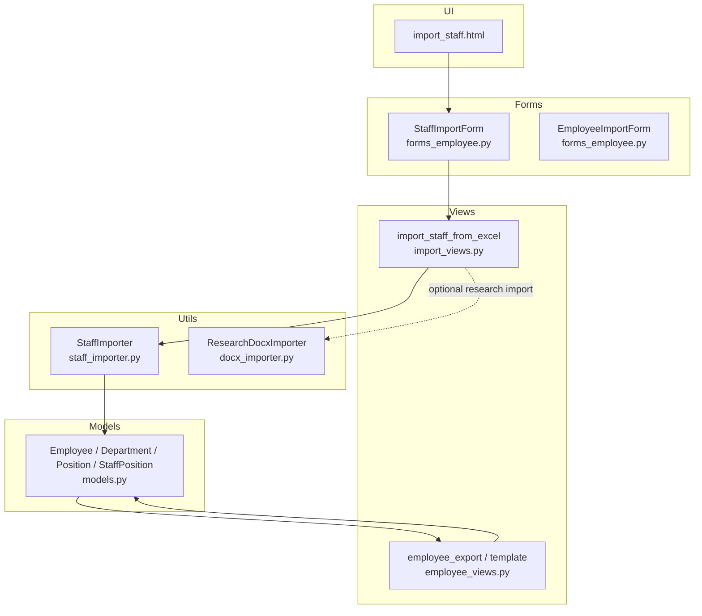
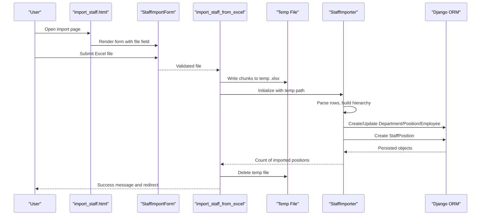
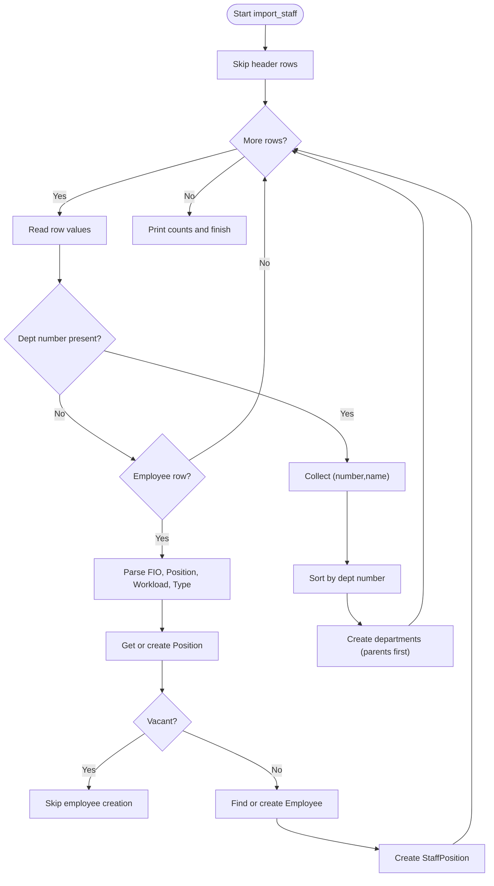
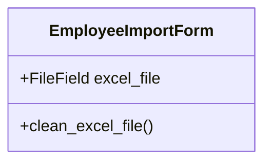
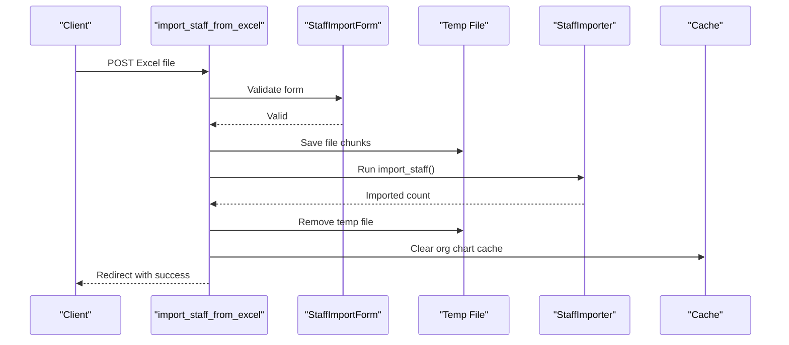
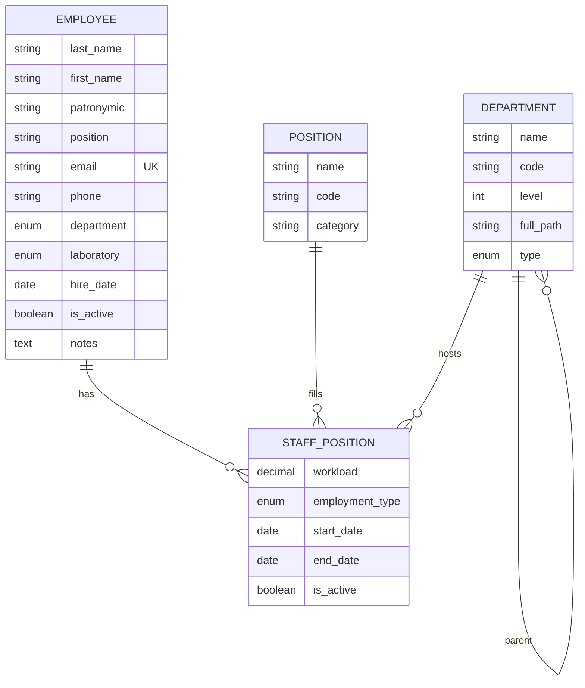
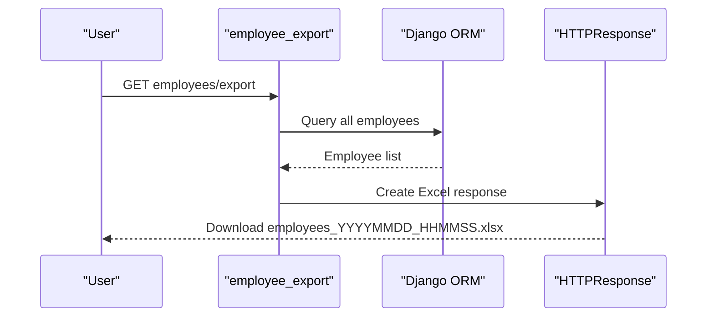
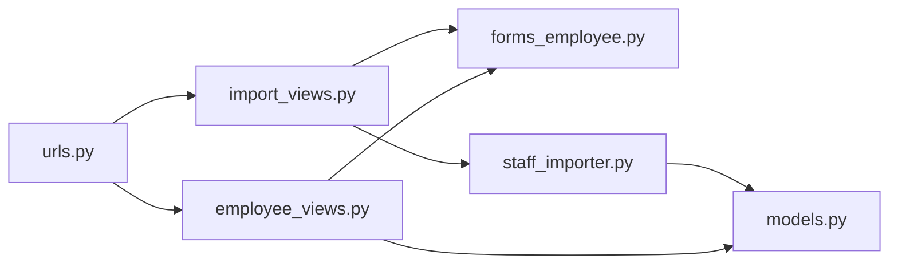

# Employee Import and Export

<cite>
**Referenced Files in This Document**
- [staff_importer.py](file://tasks/utils/staff_importer.py)
- [forms_employee.py](file://tasks/forms_employee.py)
- [import_views.py](file://tasks/views/import_views.py)
- [models.py](file://tasks/models.py)
- [employee_views.py](file://tasks/views/employee_views.py)
- [import_staff.html](file://tasks/templates/tasks/import_staff.html)
- [urls.py](file://tasks/urls.py)
- [docx_importer.py](file://tasks/utils/docx_importer.py)
</cite>

## Table of Contents
1. [Introduction](#introduction)
2. [Project Structure](#project-structure)
3. [Core Components](#core-components)
4. [Architecture Overview](#architecture-overview)
5. [Detailed Component Analysis](#detailed-component-analysis)
6. [Dependency Analysis](#dependency-analysis)
7. [Performance Considerations](#performance-considerations)
8. [Troubleshooting Guide](#troubleshooting-guide)
9. [Conclusion](#conclusion)
10. [Appendices](#appendices)

## Introduction
This document explains the employee data import and export capabilities of the system. It covers:
- Excel/CSV import of staff data via a dedicated importer
- File upload handling and validation rules
- Data parsing, transformation, and batch creation of organizational units, positions, and staff assignments
- Duplicate detection and conflict resolution strategies
- Export functionality for generating employee reports and templates
- Error handling, progress visibility, and data quality safeguards
- Bulk operation characteristics and performance considerations

## Project Structure
The import/export features are implemented across utilities, forms, views, models, templates, and URL routing:
- Import pipeline: Form → View → Importer utility → Django ORM
- Export pipeline: View → Pandas DataFrame → Excel response
- Supporting models define Departments, Positions, Employees, and StaffPositions (the “headcount unit”)

**Diagram sources**
- [import_staff.html:1-99](file://tasks/templates/tasks/import_staff.html#L1-L99)
- [forms_employee.py:42-53](file://tasks/forms_employee.py#L42-L53)
- [import_views.py:77-113](file://tasks/views/import_views.py#L77-L113)
- [staff_importer.py:7-328](file://tasks/utils/staff_importer.py#L7-L328)
- [models.py:13-678](file://tasks/models.py#L13-L678)
- [employee_views.py:896-1013](file://tasks/views/employee_views.py#L896-L1013)
- [docx_importer.py:6-521](file://tasks/utils/docx_importer.py#L6-L521)

**Section sources**
- [import_staff.html:1-99](file://tasks/templates/tasks/import_staff.html#L1-L99)
- [forms_employee.py:42-53](file://tasks/forms_employee.py#L42-L53)
- [import_views.py:77-113](file://tasks/views/import_views.py#L77-L113)
- [staff_importer.py:7-328](file://tasks/utils/staff_importer.py#L7-L328)
- [models.py:13-678](file://tasks/models.py#L13-L678)
- [employee_views.py:896-1013](file://tasks/views/employee_views.py#L896-L1013)
- [urls.py:38-100](file://tasks/urls.py#L38-L100)

## Core Components
- StaffImporter: Parses Excel rows, builds hierarchical departments, resolves positions, normalizes names, and creates StaffPosition records.
- EmployeeImportForm: Validates uploaded Excel file extension and renders import UI with guidance.
- import_staff_from_excel: Handles file upload, writes to a temporary file, invokes StaffImporter, clears caches, and reports results.
- Employee export: Generates an Excel spreadsheet of all employees with metadata.
- Employee export template: Provides a downloadable template for future imports.

Key responsibilities:
- Data validation and transformation
- Duplicate detection and updates
- Conflict resolution for existing employees and departments
- Batch processing and transaction-like behavior (no explicit atomic transactions in code)
- Audit-friendly logging and counts

**Section sources**
- [staff_importer.py:7-328](file://tasks/utils/staff_importer.py#L7-L328)
- [forms_employee.py:42-53](file://tasks/forms_employee.py#L42-L53)
- [import_views.py:77-113](file://tasks/views/import_views.py#L77-L113)
- [employee_views.py:896-1013](file://tasks/views/employee_views.py#L896-L1013)

## Architecture Overview
End-to-end flow for importing staff from Excel:

**Diagram sources**
- [import_staff.html:32-70](file://tasks/templates/tasks/import_staff.html#L32-L70)
- [forms_employee.py:202-224](file://tasks/forms_employee.py#L202-L224)
- [import_views.py:77-113](file://tasks/views/import_views.py#L77-L113)
- [staff_importer.py:186-328](file://tasks/utils/staff_importer.py#L186-L328)

## Detailed Component Analysis

### StaffImporter: Excel Parsing and Batch Creation
Responsibilities:
- Load Excel via pandas
- Parse hierarchical department codes (e.g., dotted numbering)
- Infer department type from name keywords
- Normalize employee Full Names and detect existing employees
- Resolve positions and categories
- Create StaffPosition entries with workload and employment type
- Track counts and log progress

Processing logic highlights:
- Iterates rows after skipping headers
- Builds departments in order by code to ensure parent-first creation
- Skips summary rows containing totals
- Uses dictionaries to cache created Department/Position/Employee instances to avoid duplicates
- Creates StaffPosition linking Employee, Department, and Position with workload and employment type

**Diagram sources**
- [staff_importer.py:186-328](file://tasks/utils/staff_importer.py#L186-L328)

**Section sources**
- [staff_importer.py:7-328](file://tasks/utils/staff_importer.py#L7-L328)

### EmployeeImportForm: Upload Validation and UI
- Accepts .xlsx/.xls files only
- Renders a form with file input and optional checkboxes for import behavior
- Provides inline help and validation feedback

**Diagram sources**
- [forms_employee.py:42-53](file://tasks/forms_employee.py#L42-L53)

**Section sources**
- [forms_employee.py:42-53](file://tasks/forms_employee.py#L42-L53)
- [import_staff.html:32-70](file://tasks/templates/tasks/import_staff.html#L32-L70)

### import_staff_from_excel: View Orchestration
- Requires login
- Validates file upload via form
- Streams uploaded file to a temporary .xlsx file
- Instantiates StaffImporter and runs import
- Cleans up temp file
- Clears organization chart cache
- Redirects with success message

**Diagram sources**
- [import_views.py:77-113](file://tasks/views/import_views.py#L77-L113)
- [staff_importer.py:186-328](file://tasks/utils/staff_importer.py#L186-L328)

**Section sources**
- [import_views.py:77-113](file://tasks/views/import_views.py#L77-L113)

### Models: Data Mapping and Constraints
- Employee: personal info, contact, department/laboratory, active flag, timestamps
- Department: hierarchical with parent/level/full_path
- Position: job title and category
- StaffPosition: the headcount unit linking Employee, Department, Position with workload and employment type

**Diagram sources**
- [models.py:13-678](file://tasks/models.py#L13-L678)

**Section sources**
- [models.py:13-678](file://tasks/models.py#L13-L678)

### Export Functionality
- employee_export: Serializes all employees into a DataFrame and streams an Excel file download
- employee_export_template: Returns a minimal template Excel file for import guidance

**Diagram sources**
- [employee_views.py:896-925](file://tasks/views/employee_views.py#L896-L925)

**Section sources**
- [employee_views.py:896-1013](file://tasks/views/employee_views.py#L896-L1013)

### Supported Formats and Mapping
- Import: Excel (.xlsx, .xls) via pandas
- Export: Excel (.xlsx) via pandas ExcelWriter
- Mapping highlights:
  - Department code hierarchy parsed from dotted numbering
  - Employment type inferred from free-text fields
  - Workload normalized to numeric values
  - Employee normalization via name parser

**Section sources**
- [forms_employee.py:42-53](file://tasks/forms_employee.py#L42-L53)
- [staff_importer.py:186-328](file://tasks/utils/staff_importer.py#L186-L328)
- [employee_views.py:896-925](file://tasks/views/employee_views.py#L896-L925)

## Dependency Analysis
- Views depend on Forms for validation and on Utils for parsing
- Utils depend on Models for persistence
- Templates provide UI and instructions
- URLs route requests to appropriate views

**Diagram sources**
- [urls.py:38-100](file://tasks/urls.py#L38-L100)
- [import_views.py:77-113](file://tasks/views/import_views.py#L77-L113)
- [employee_views.py:896-1013](file://tasks/views/employee_views.py#L896-L1013)
- [forms_employee.py:42-53](file://tasks/forms_employee.py#L42-L53)
- [staff_importer.py:7-328](file://tasks/utils/staff_importer.py#L7-L328)
- [models.py:13-678](file://tasks/models.py#L13-L678)

**Section sources**
- [urls.py:38-100](file://tasks/urls.py#L38-L100)
- [import_views.py:77-113](file://tasks/views/import_views.py#L77-L113)
- [employee_views.py:896-1013](file://tasks/views/employee_views.py#L896-L1013)
- [forms_employee.py:42-53](file://tasks/forms_employee.py#L42-L53)
- [staff_importer.py:7-328](file://tasks/utils/staff_importer.py#L7-L328)
- [models.py:13-678](file://tasks/models.py#L13-L678)

## Performance Considerations
- Batch creation: The importer iterates rows and performs ORM writes; no explicit bulk operations are used in the code
- Memory: Loading entire Excel into memory via pandas; very large files may increase memory usage
- Network: Uploaded file is streamed to disk before processing
- Caching: Organization chart cache is cleared post-import to reflect structural changes
- Recommendations:
  - For very large datasets, consider chunked processing and bulk operations
  - Add pagination or progress indicators in the UI
  - Validate file size and enforce limits in forms
  - Use database transactions around batch writes if consistency across the batch is critical

[No sources needed since this section provides general guidance]

## Troubleshooting Guide
Common issues and remedies:
- Unsupported file type: Ensure .xlsx or .xls; validation raises an error otherwise
- Empty or malformed Excel: Verify column order and presence of required fields
- Department hierarchy errors: Ensure dotted department codes are ordered so parents precede children
- Duplicate employees: Existing employees are detected by normalized name; existing records are reused and optionally updated
- Cache staleness: Organization chart cache is cleared after import; refresh the page to see updated structure
- Large uploads: Increase server upload limits and consider chunked processing

**Section sources**
- [forms_employee.py:42-53](file://tasks/forms_employee.py#L42-L53)
- [import_views.py:77-113](file://tasks/views/import_views.py#L77-L113)
- [staff_importer.py:186-328](file://tasks/utils/staff_importer.py#L186-L328)

## Conclusion
The system provides a robust pipeline for importing staff data from Excel and exporting employee lists to Excel. It supports hierarchical department creation, position normalization, and staff assignment with workload and employment type. While the current implementation focuses on straightforward row-by-row processing, enhancements such as bulk operations, transactional batches, and progress reporting would further improve reliability and scalability for large-scale imports.

[No sources needed since this section summarizes without analyzing specific files]

## Appendices

### Data Validation Rules
- File type: Only .xlsx and .xls are accepted
- Required columns for staff import (as per template and parsing logic): Department code/path, Position, Full Name, Workload, Employment type
- Employment type inference supports multiple variants; ensure consistent wording for predictable mapping
- Workload normalization defaults to 1.0 when empty or invalid

**Section sources**
- [forms_employee.py:42-53](file://tasks/forms_employee.py#L42-L53)
- [staff_importer.py:154-184](file://tasks/utils/staff_importer.py#L154-L184)

### Import Workflow Summary
- Upload Excel via import_staff.html
- Form validates file type
- View saves file to temp storage and runs StaffImporter
- Importer parses rows, creates departments/positions/employees, and StaffPosition entries
- Success message and redirect; cache cleared

**Section sources**
- [import_staff.html:32-70](file://tasks/templates/tasks/import_staff.html#L32-L70)
- [import_views.py:77-113](file://tasks/views/import_views.py#L77-L113)
- [staff_importer.py:186-328](file://tasks/utils/staff_importer.py#L186-L328)