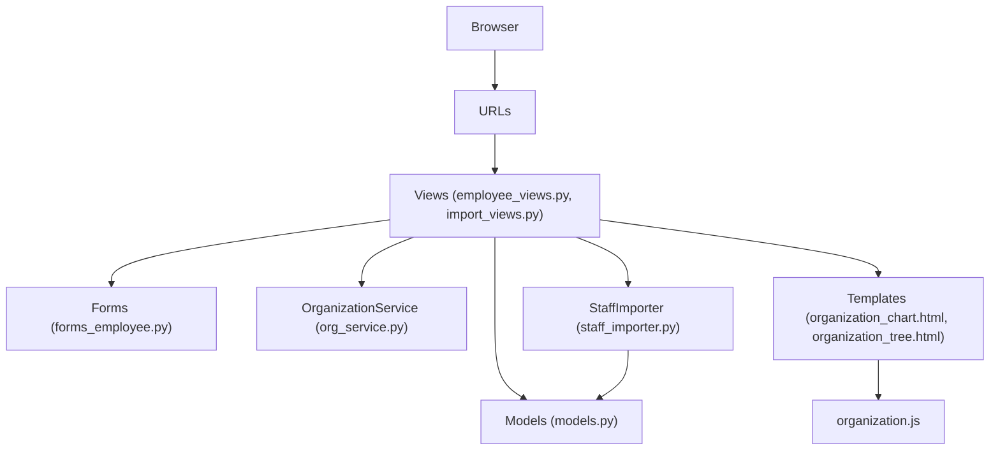
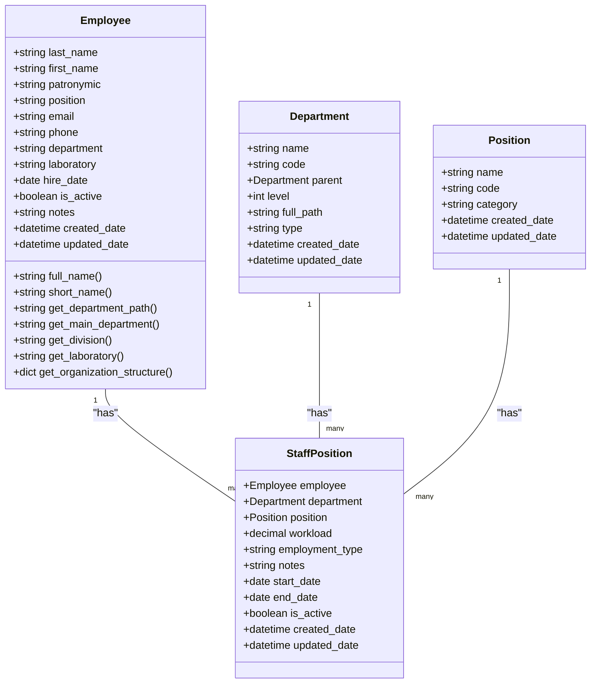
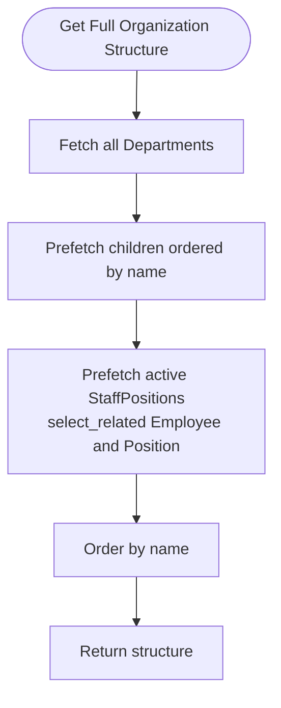
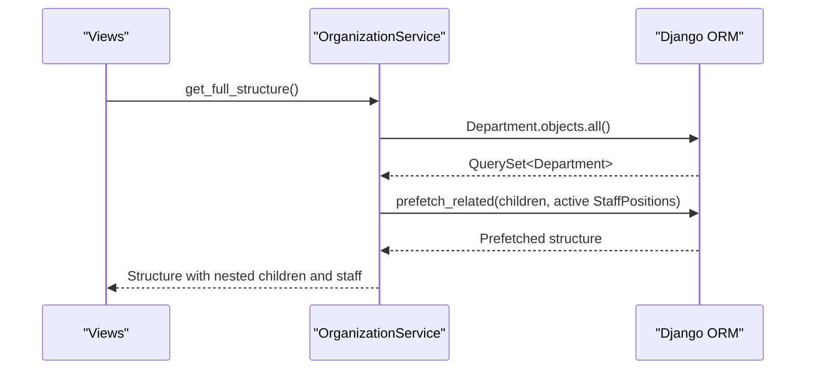
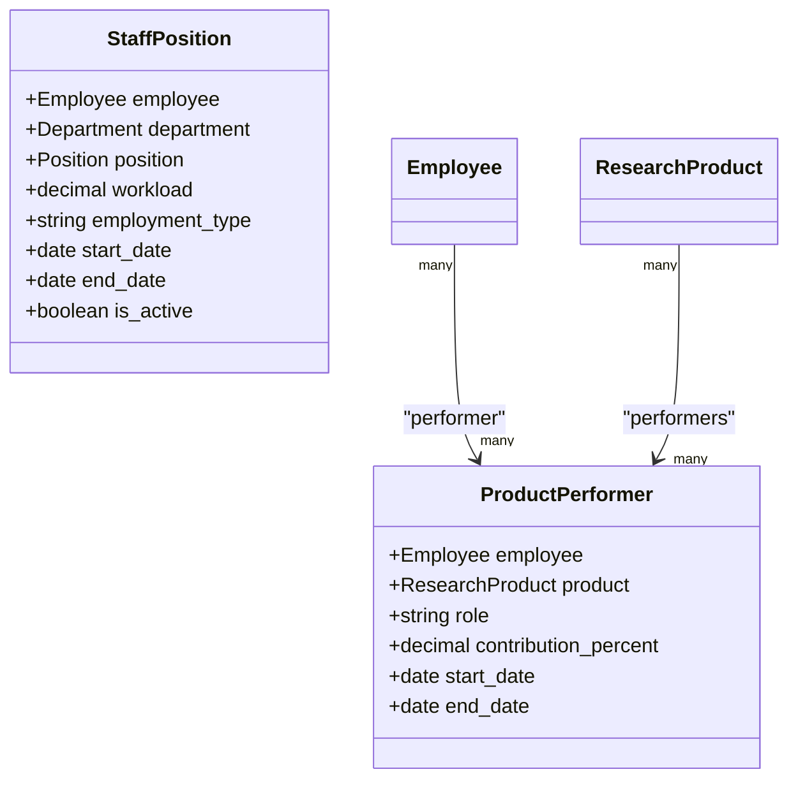
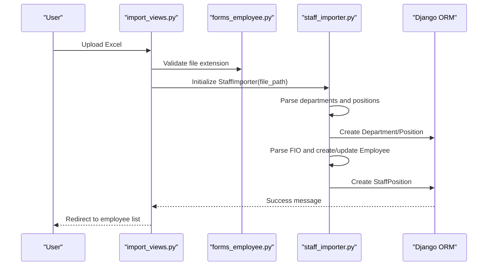
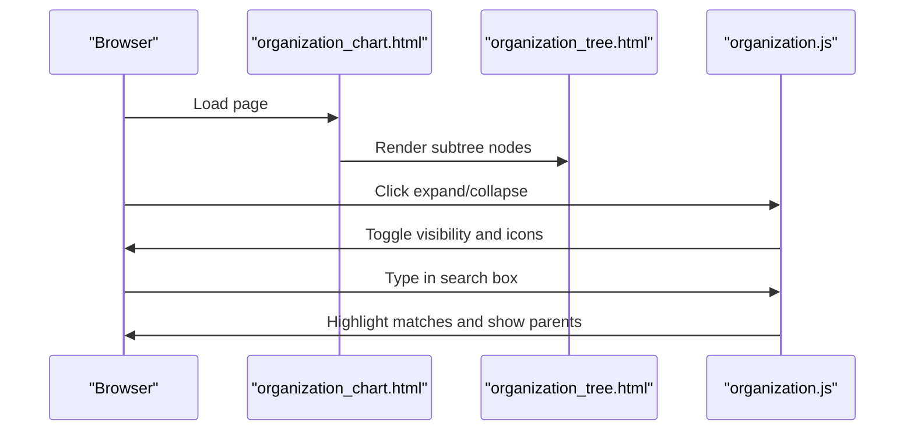
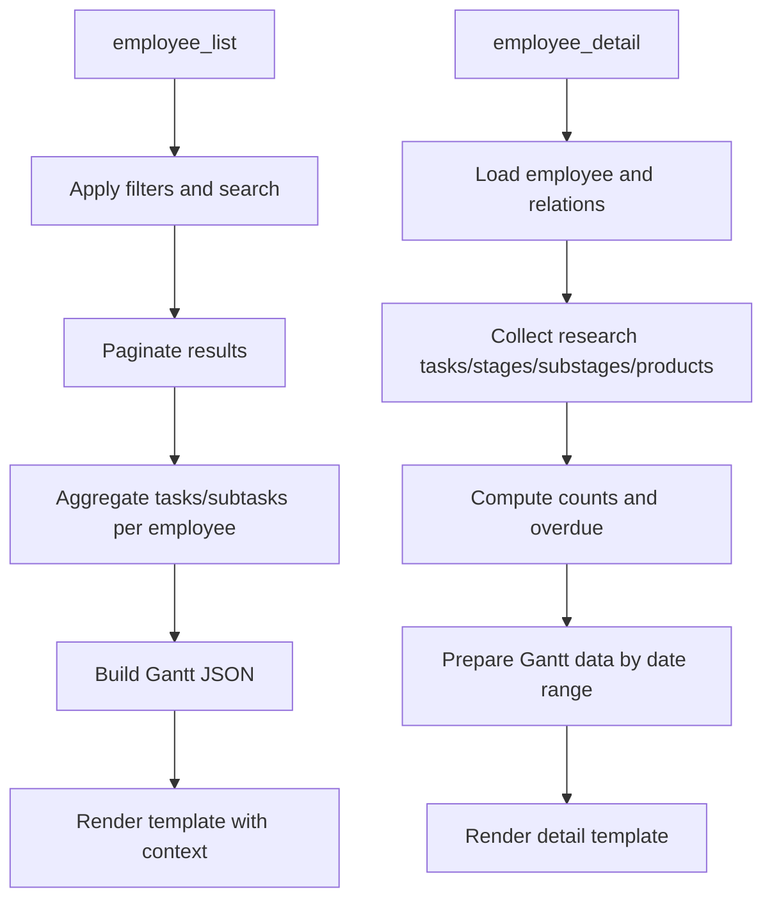
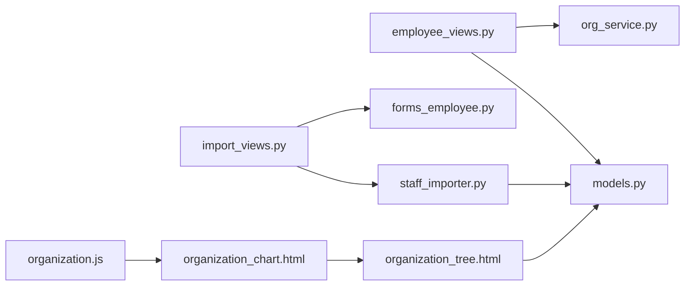

# Employee and Organization Management

<cite>
**Referenced Files in This Document**
- [models.py](file://tasks/models.py)
- [org_service.py](file://tasks/services/org_service.py)
- [forms_employee.py](file://tasks/forms_employee.py)
- [employee_views.py](file://tasks/views/employee_views.py)
- [staff_importer.py](file://tasks/utils/staff_importer.py)
- [import_views.py](file://tasks/views/import_views.py)
- [organization_chart.html](file://tasks/templates/tasks/organization_chart.html)
- [organization_tree.html](file://tasks/templates/tasks/partials/organization_tree.html)
- [organization.js](file://static/js/organization.js)
- [admin.py](file://tasks/admin.py)
- [urls.py](file://tasks/urls.py)
- [0001_initial.py](file://tasks/migrations/0001_initial.py)
- [base.py](file://tasks/views/base.py)
- [decorators.py](file://tasks/decorators.py)
</cite>

## Table of Contents
1. [Introduction](#introduction)
2. [Project Structure](#project-structure)
3. [Core Components](#core-components)
4. [Architecture Overview](#architecture-overview)
5. [Detailed Component Analysis](#detailed-component-analysis)
6. [Dependency Analysis](#dependency-analysis)
7. [Performance Considerations](#performance-considerations)
8. [Troubleshooting Guide](#troubleshooting-guide)
9. [Conclusion](#conclusion)
10. [Appendices](#appendices)

## Introduction
This document describes the Employee and Organization Management subsystem of the Task Manager application. It covers the employee data model, department hierarchy, organizational chart generation, staff position assignments, role permissions, and access control. It also documents the OrganizationService for efficient tree traversal, import/export capabilities for staff data, and integrations with tasks and research products. Finally, it outlines reporting and analytics features such as headcount statistics and personnel insights.

## Project Structure
The Employee and Organization Management functionality spans models, services, views, forms, utilities, templates, and static assets:
- Data models define Employees, Departments, Positions, StaffPositions, Tasks, Subtasks, and Research-related entities.
- Services encapsulate organizational tree traversal and statistics.
- Views handle CRUD operations, filtering, pagination, and rendering of lists and details.
- Forms provide validation for employee creation/editing and import file validation.
- Utilities implement Excel-based staff import.
- Templates render organization charts and employee dashboards.
- Static JavaScript enables interactive tree navigation and filtering.

```mermaid
graph TB
subgraph "Models"
E["Employee"]
D["Department"]
P["Position"]
SP["StaffPosition"]
T["Task"]
ST["Subtask"]
RT["ResearchTask"]
RS["ResearchStage"]
RST["ResearchSubstage"]
RP["ResearchProduct"]
PP["ProductPerformer"]
end
subgraph "Services"
OS["OrganizationService"]
end
subgraph "Views"
EV["employee_views.py"]
IV["import_views.py"]
end
subgraph "Forms"
EF["forms_employee.py"]
end
subgraph "Utilities"
SI["staff_importer.py"]
end
subgraph "Templates"
OC["organization_chart.html"]
OT["organization_tree.html"]
end
subgraph "Static JS"
OJ["organization.js"]
end
E --> SP
D --> SP
P --> SP
E < --> T
E < --> ST
E < --> RP
SP --> D
SP --> P
T --> ST
RT --> RS
RS --> RST
RST --> RP
RP --> PP
EV --> E
EV --> D
EV --> SP
IV --> SI
OC --> OT
OT --> D
OJ --> OC
OS --> D
OS --> SP
```

**Diagram sources**
- [models.py:13-800](file://tasks/models.py#L13-L800)
- [org_service.py:1-53](file://tasks/services/org_service.py#L1-L53)
- [employee_views.py:1-1013](file://tasks/views/employee_views.py#L1-L1013)
- [import_views.py:1-113](file://tasks/views/import_views.py#L1-L113)
- [forms_employee.py:1-53](file://tasks/forms_employee.py#L1-L53)
- [staff_importer.py:1-328](file://tasks/utils/staff_importer.py#L1-L328)
- [organization_chart.html:1-131](file://tasks/templates/tasks/organization_chart.html#L1-L131)
- [organization_tree.html:1-55](file://tasks/templates/tasks/partials/organization_tree.html#L1-L55)
- [organization.js:1-179](file://static/js/organization.js#L1-L179)

**Section sources**
- [models.py:13-800](file://tasks/models.py#L13-L800)
- [org_service.py:1-53](file://tasks/services/org_service.py#L1-L53)
- [employee_views.py:1-1013](file://tasks/views/employee_views.py#L1-L1013)
- [import_views.py:1-113](file://tasks/views/import_views.py#L1-L113)
- [forms_employee.py:1-53](file://tasks/forms_employee.py#L1-L53)
- [staff_importer.py:1-328](file://tasks/utils/staff_importer.py#L1-L328)
- [organization_chart.html:1-131](file://tasks/templates/tasks/organization_chart.html#L1-L131)
- [organization_tree.html:1-55](file://tasks/templates/tasks/partials/organization_tree.html#L1-L55)
- [organization.js:1-179](file://static/js/organization.js#L1-L179)

## Core Components
- Employee: Stores personal and contact information, department and lab assignment, hiring date, activity status, and audit fields. Provides helpers to derive organizational structure and roles.
- Department: Hierarchical structure with type, level, and full_path computed on save. Supports parent-child relations and indexing.
- Position: Job title with optional category.
- StaffPosition: Links Employee to Department and Position, captures workload, employment type, period, and activation status.
- Task/Subtask: Work items assigned to Employees; supports priority, status, scheduling, and time tracking.
- ResearchTask/Stage/Substage/Product: Scientific work pipeline with performers and responsible parties.
- OrganizationService: Optimized retrieval of department trees, statistics, and grouping by type.
- Import/Export: Excel-based staff import via StaffImporter; employee list export/import endpoints exist in URLs and views.

Key model relationships and indexes are defined in the initial migration.

**Section sources**
- [models.py:13-800](file://tasks/models.py#L13-L800)
- [0001_initial.py:1-376](file://tasks/migrations/0001_initial.py#L1-L376)

## Architecture Overview
The system separates concerns across models, services, and presentation layers:
- Models define domain entities and relationships.
- Services encapsulate organizational queries and aggregations.
- Views orchestrate requests, apply filters/sorting/pagination, and render templates.
- Forms validate inputs and enforce constraints.
- Utilities process external data (Excel).
- Templates render interactive organization charts and employee dashboards.
- Static JavaScript enhances client-side interactivity.



**Diagram sources**
- [urls.py:1-100](file://tasks/urls.py#L1-L100)
- [employee_views.py:1-1013](file://tasks/views/employee_views.py#L1-L1013)
- [import_views.py:1-113](file://tasks/views/import_views.py#L1-L113)
- [forms_employee.py:1-53](file://tasks/forms_employee.py#L1-L53)
- [models.py:13-800](file://tasks/models.py#L13-L800)
- [org_service.py:1-53](file://tasks/services/org_service.py#L1-L53)
- [staff_importer.py:1-328](file://tasks/utils/staff_importer.py#L1-L328)
- [organization_chart.html:1-131](file://tasks/templates/tasks/organization_chart.html#L1-L131)
- [organization_tree.html:1-55](file://tasks/templates/tasks/partials/organization_tree.html#L1-L55)
- [organization.js:1-179](file://static/js/organization.js#L1-L179)

## Detailed Component Analysis

### Employee Data Model and Integrations
- Personal and contact info: last_name, first_name, patronymic, position, email, phone.
- Employment metadata: department, laboratory, hire_date, is_active, notes.
- Audit: created_date, updated_date, created_by.
- Helpers:
  - get_department_path, get_main_department, get_division, get_laboratory, get_organization_structure.
- Integrations:
  - Many-to-many with Task (assigned_to).
  - Many-to-many with Subtask (performers/responsible).
  - Many-to-many with ResearchProduct via ProductPerformer.
  - One-to-many with StaffPosition.



**Diagram sources**
- [models.py:13-800](file://tasks/models.py#L13-L800)

**Section sources**
- [models.py:13-163](file://tasks/models.py#L13-L163)

### Department Structure and Hierarchical Relationships
- Department defines a recursive parent-child relationship with computed full_path and level.
- Type enumeration supports Directorate, Department, Laboratory, Group, Service, Division.
- Indexes optimize parent/type/name/full_path/level lookups.
- OrganizationService provides:
  - get_full_structure with prefetch_related for children and active staff_positions.
  - get_statistics aggregation across departments, employees, and positions.
  - get_department_with_relations for a single dept with relations.
  - get_root_departments and group_by_type helpers.



**Diagram sources**
- [org_service.py:8-14](file://tasks/services/org_service.py#L8-L14)

**Section sources**
- [models.py:532-585](file://tasks/models.py#L532-L585)
- [org_service.py:1-53](file://tasks/services/org_service.py#L1-L53)

### OrganizationService Implementation
- get_full_structure: Returns a fully prefetched tree with children and active staff_positions.
- get_statistics: Aggregates total departments, unique employees via staff_positions, and active staff positions.
- get_department_with_relations: Retrieves a department with children and active staff_positions.
- get_root_departments: Filters top-level departments (parent is None).
- group_by_type: Groups departments by type for UI segmentation.



**Diagram sources**
- [org_service.py:8-14](file://tasks/services/org_service.py#L8-L14)

**Section sources**
- [org_service.py:1-53](file://tasks/services/org_service.py#L1-L53)

### Staff Position Assignments and Role Permissions
- StaffPosition links Employee to Department and Position, with workload and employment_type.
- Employment types include main, internal combination, external combination, combination, part-time, vacant, decree, allowance.
- Access control:
  - Login-required decorators on views.
  - Admin integration clears org chart cache on Department changes.
- Role permissions:
  - ProductPerformer defines roles: responsible, executor, consultant, reviewer, approver.
  - Helper function update_substage_performers synchronizes substage performers from products.



**Diagram sources**
- [models.py:604-678](file://tasks/models.py#L604-L678)
- [models.py:793-800](file://tasks/models.py#L793-L800)
- [base.py:1-20](file://tasks/views/base.py#L1-L20)

**Section sources**
- [models.py:604-678](file://tasks/models.py#L604-L678)
- [models.py:793-800](file://tasks/models.py#L793-L800)
- [base.py:1-20](file://tasks/views/base.py#L1-L20)
- [admin.py:1-21](file://tasks/admin.py#L1-L21)

### Employee Import/Export and Bulk Operations
- Import:
  - Excel-based import via StaffImporter parsing department hierarchy, positions, and staff.
  - Validates and normalizes FIO, workload, employment type.
  - Creates Department, Position, Employee, and StaffPosition records.
- Export:
  - URLs include endpoints for employee export and template download.
- Validation:
  - EmployeeForm validates required fields and phone number format.
  - EmployeeImportForm validates Excel file extension.



**Diagram sources**
- [import_views.py:78-113](file://tasks/views/import_views.py#L78-L113)
- [forms_employee.py:42-53](file://tasks/forms_employee.py#L42-L53)
- [staff_importer.py:186-328](file://tasks/utils/staff_importer.py#L186-L328)

**Section sources**
- [import_views.py:1-113](file://tasks/views/import_views.py#L1-L113)
- [forms_employee.py:1-53](file://tasks/forms_employee.py#L1-L53)
- [staff_importer.py:1-328](file://tasks/utils/staff_importer.py#L1-L328)
- [urls.py:52-63](file://tasks/urls.py#L52-L63)

### Organization Chart Generation and UI Interactions
- Template organization_chart.html renders:
  - Statistics cards (departments, employees, staff positions).
  - Leadership grid for directorate-type departments.
  - Toggleable blocks for scientific and organizational subtrees.
  - Search box and control buttons.
- Partial organization_tree.html renders hierarchical nodes with counts and staff lists.
- Static organization.js provides:
  - Expand/collapse tree nodes.
  - Toggle scientific/organizational blocks.
  - Show department/lab staff lists.
  - Live search highlighting parents.



**Diagram sources**
- [organization_chart.html:1-131](file://tasks/templates/tasks/organization_chart.html#L1-L131)
- [organization_tree.html:1-55](file://tasks/templates/tasks/partials/organization_tree.html#L1-L55)
- [organization.js:1-179](file://static/js/organization.js#L1-L179)

**Section sources**
- [organization_chart.html:1-131](file://tasks/templates/tasks/organization_chart.html#L1-L131)
- [organization_tree.html:1-55](file://tasks/templates/tasks/partials/organization_tree.html#L1-L55)
- [organization.js:1-179](file://static/js/organization.js#L1-L179)

### Employee List, Filtering, Pagination, and Dashboards
- employee_list view:
  - Filters by department, laboratory, activity status.
  - Search across name, email, position.
  - Sorting by various fields.
  - Pagination with 20 items per page.
  - Aggregates tasks and subtasks per employee for near-term deadlines.
  - Builds Gantt-compatible JSON for timeline visualization.
- employee_detail view:
  - Displays tasks, subtasks, research tasks, stages, substages, and products.
  - Calculates overdue items and completion metrics.
  - Renders Gantt data filtered by selected year/date range.
  - Provides statistics counters for each entity type.



**Diagram sources**
- [employee_views.py:18-332](file://tasks/views/employee_views.py#L18-L332)
- [employee_views.py:334-692](file://tasks/views/employee_views.py#L334-L692)

**Section sources**
- [employee_views.py:1-1013](file://tasks/views/employee_views.py#L1-L1013)

### Access Control and Security
- Login-required decorators protect most views.
- Admin integration clears org chart cache on Department changes to keep UI consistent.
- Decors provide centralized logging for view execution time and errors.

**Section sources**
- [employee_views.py:17-16](file://tasks/views/employee_views.py#L17-L16)
- [admin.py:11-19](file://tasks/admin.py#L11-L19)
- [decorators.py:8-21](file://tasks/decorators.py#L8-L21)

## Dependency Analysis
- Models:
  - Employee depends on User for created_by.
  - Department self-references via parent.
  - StaffPosition links Employee, Department, and Position.
  - Task/Subtask link to Employee via M2M.
  - Research* models link to Employee via M2M and FK.
- Services:
  - OrganizationService relies on Department and StaffPosition with select_related/prefetch_related.
- Views:
  - employee_list and employee_detail orchestrate model queries and template rendering.
  - import_views coordinates file upload, temporary storage, and importer execution.
- Forms:
  - EmployeeForm and EmployeeImportForm validate inputs and file types.
- Utilities:
  - StaffImporter parses Excel and creates domain entities.



**Diagram sources**
- [employee_views.py:1-1013](file://tasks/views/employee_views.py#L1-L1013)
- [org_service.py:1-53](file://tasks/services/org_service.py#L1-L53)
- [import_views.py:1-113](file://tasks/views/import_views.py#L1-L113)
- [forms_employee.py:1-53](file://tasks/forms_employee.py#L1-L53)
- [staff_importer.py:1-328](file://tasks/utils/staff_importer.py#L1-L328)
- [models.py:13-800](file://tasks/models.py#L13-L800)
- [organization_chart.html:1-131](file://tasks/templates/tasks/organization_chart.html#L1-L131)
- [organization_tree.html:1-55](file://tasks/templates/tasks/partials/organization_tree.html#L1-L55)
- [organization.js:1-179](file://static/js/organization.js#L1-L179)

**Section sources**
- [models.py:13-800](file://tasks/models.py#L13-L800)
- [org_service.py:1-53](file://tasks/services/org_service.py#L1-L53)
- [employee_views.py:1-1013](file://tasks/views/employee_views.py#L1-L1013)
- [import_views.py:1-113](file://tasks/views/import_views.py#L1-L113)
- [forms_employee.py:1-53](file://tasks/forms_employee.py#L1-L53)
- [staff_importer.py:1-328](file://tasks/utils/staff_importer.py#L1-L328)
- [organization_chart.html:1-131](file://tasks/templates/tasks/organization_chart.html#L1-L131)
- [organization_tree.html:1-55](file://tasks/templates/tasks/partials/organization_tree.html#L1-L55)
- [organization.js:1-179](file://static/js/organization.js#L1-L179)

## Performance Considerations
- Efficient tree traversal:
  - OrganizationService uses prefetch_related and select_related to avoid N+1 queries.
  - Indexes on Department and Employee fields reduce lookup costs.
- Pagination:
  - employee_list uses Paginator to limit result sets.
- Caching:
  - Admin changes invalidate org chart cache to prevent stale UI.
- Logging:
  - Decorator logs view execution time and exceptions for monitoring.

[No sources needed since this section provides general guidance]

## Troubleshooting Guide
- Import failures:
  - Verify Excel file extension and structure; ensure department numbering and FIO formatting.
  - Check StaffImporter logs for skipped rows and missing departments.
- View errors:
  - Use decorator-provided logs to identify slow or failing views.
- Cache invalidation:
  - After editing Department, admin clears org chart cache automatically.
- Data validation:
  - EmployeeForm enforces required fields and phone length/format.
  - EmployeeImportForm restricts file types to .xlsx/.xls.

**Section sources**
- [staff_importer.py:186-328](file://tasks/utils/staff_importer.py#L186-L328)
- [decorators.py:8-21](file://tasks/decorators.py#L8-L21)
- [admin.py:11-19](file://tasks/admin.py#L11-L19)
- [forms_employee.py:32-53](file://tasks/forms_employee.py#L32-L53)

## Conclusion
The Employee and Organization Management subsystem integrates a robust data model with optimized service-layer queries, comprehensive import/export capabilities, and an interactive organization chart. It supports hierarchical department structures, precise staff position assignments, and deep integrations with tasks and research workflows. The architecture balances performance with maintainability, enabling reporting, headcount analytics, and user-friendly dashboards.

## Appendices

### API and Endpoint Summary
- Employee endpoints:
  - List, create, update, delete, toggle active, tasks, import, export, export template, search API.
- Import endpoints:
  - Staff import from Excel, research import from DOCX, preview import.
- Organization endpoints:
  - Organization chart, department AJAX detail.

**Section sources**
- [urls.py:52-100](file://tasks/urls.py#L52-L100)