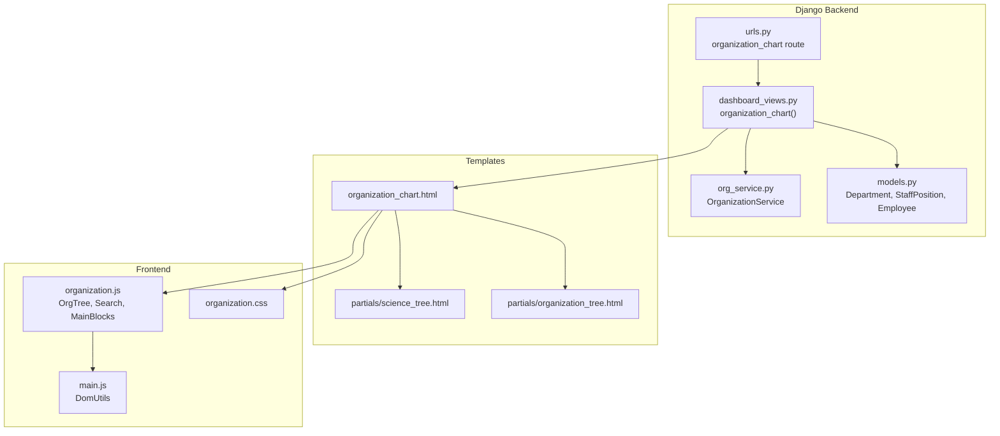
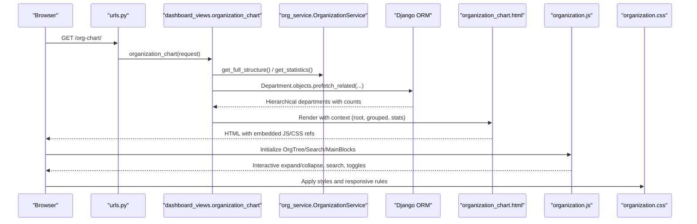
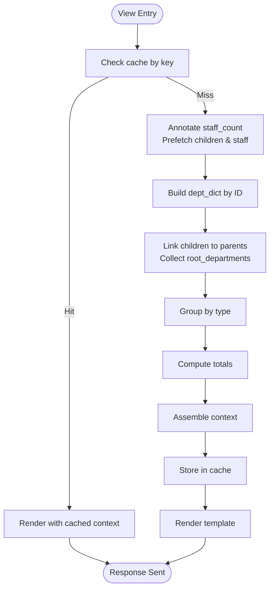
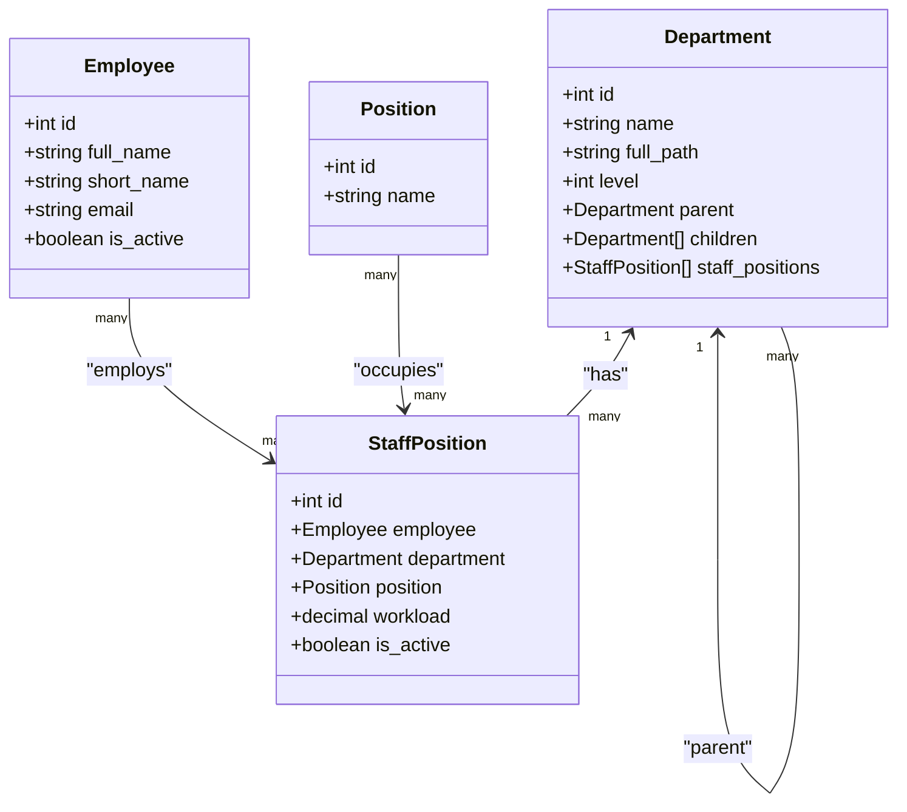
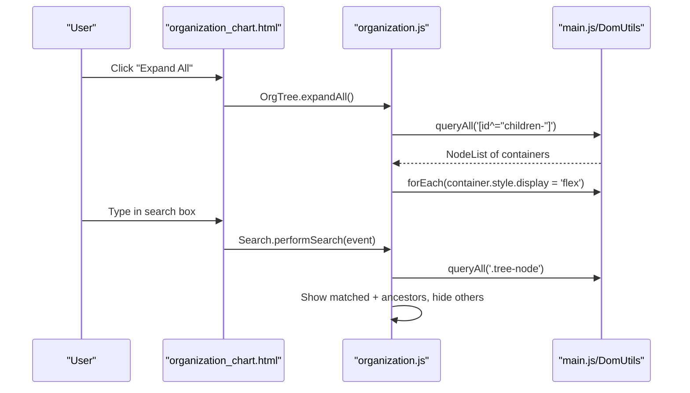
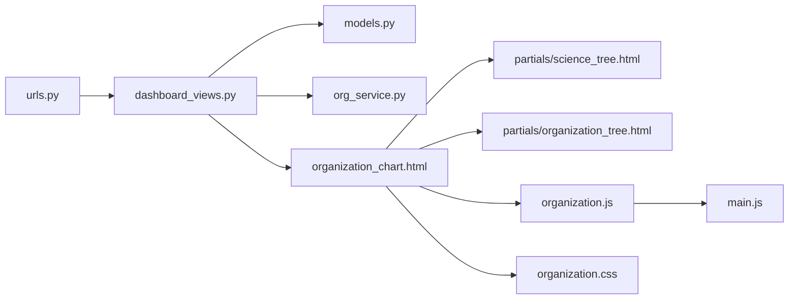

# Organization Chart Generation

<cite>
**Referenced Files in This Document**
- [organization_chart.html](file://tasks/templates/tasks/organization_chart.html)
- [organization_tree.html](file://tasks/templates/tasks/partials/organization_tree.html)
- [science_tree.html](file://tasks/templates/tasks/partials/science_tree.html)
- [organization.js](file://static/js/organization.js)
- [organization.css](file://static/css/organization.css)
- [main.js](file://static/js/main.js)
- [dashboard_views.py](file://tasks/views/dashboard_views.py)
- [org_service.py](file://tasks/services/org_service.py)
- [models.py](file://tasks/models.py)
- [urls.py](file://tasks/urls.py)
</cite>

## Table of Contents
1. [Introduction](#introduction)
2. [Project Structure](#project-structure)
3. [Core Components](#core-components)
4. [Architecture Overview](#architecture-overview)
5. [Detailed Component Analysis](#detailed-component-analysis)
6. [Dependency Analysis](#dependency-analysis)
7. [Performance Considerations](#performance-considerations)
8. [Troubleshooting Guide](#troubleshooting-guide)
9. [Conclusion](#conclusion)

## Introduction
This document explains the organization chart generation and visualization system. It covers how hierarchical organizational data is extracted from the database, transformed into a client-ready structure, rendered as an interactive tree, and styled responsively. It also documents the integration between Django views, services, models, templates, and frontend JavaScript/CSS, along with performance optimizations, navigation controls, and accessibility considerations.

## Project Structure
The organization chart feature spans backend Django views and services, models defining the hierarchy, and frontend templates and scripts for rendering and interactivity.

**Diagram sources**
- [dashboard_views.py:14-109](file://tasks/views/dashboard_views.py#L14-L109)
- [org_service.py:4-53](file://tasks/services/org_service.py#L4-L53)
- [models.py:532-678](file://tasks/models.py#L532-L678)
- [urls.py:89-92](file://tasks/urls.py#L89-L92)
- [organization_chart.html:1-131](file://tasks/templates/tasks/organization_chart.html#L1-L131)
- [science_tree.html:1-141](file://tasks/templates/tasks/partials/science_tree.html#L1-L141)
- [organization_tree.html:1-55](file://tasks/templates/tasks/partials/organization_tree.html#L1-L55)
- [organization.js:1-179](file://static/js/organization.js#L1-L179)
- [main.js:5-29](file://static/js/main.js#L5-L29)
- [organization.css:1-591](file://static/css/organization.css#L1-L591)

**Section sources**
- [organization_chart.html:1-131](file://tasks/templates/tasks/organization_chart.html#L1-L131)
- [organization.js:1-179](file://static/js/organization.js#L1-L179)
- [organization.css:1-591](file://static/css/organization.css#L1-L591)
- [dashboard_views.py:14-109](file://tasks/views/dashboard_views.py#L14-L109)
- [models.py:532-678](file://tasks/models.py#L532-L678)
- [urls.py:89-92](file://tasks/urls.py#L89-L92)

## Core Components
- Backend data preparation and caching:
  - View loads departments with prefetches for children and staff positions, annotates counts, builds a tree, groups by type, computes statistics, and caches the context.
- Services:
  - Provides optimized queries for full structure, statistics, and root departments.
- Templates:
  - Base page with stats, leadership cards, control buttons, search box, and two main blocks for scientific and organizational departments.
  - Partials render the hierarchical nodes and staff lists.
- Frontend:
  - JavaScript manages expand/collapse, search filtering, and toggling of main blocks.
  - CSS defines tree layout, connectors, cards, and responsive behavior.

**Section sources**
- [dashboard_views.py:14-109](file://tasks/views/dashboard_views.py#L14-L109)
- [org_service.py:4-53](file://tasks/services/org_service.py#L4-L53)
- [organization_chart.html:10-126](file://tasks/templates/tasks/organization_chart.html#L10-L126)
- [organization.js:6-50](file://static/js/organization.js#L6-L50)
- [organization.css:6-173](file://static/css/organization.css#L6-L173)

## Architecture Overview
The system follows a layered pattern: URL routing triggers a view that prepares data via ORM queries and services, renders a template with partials, and serves static assets for interactivity and styling.

**Diagram sources**
- [urls.py:89-92](file://tasks/urls.py#L89-L92)
- [dashboard_views.py:14-109](file://tasks/views/dashboard_views.py#L14-L109)
- [org_service.py:7-23](file://tasks/services/org_service.py#L7-L23)
- [organization_chart.html:129-131](file://tasks/templates/tasks/organization_chart.html#L129-L131)
- [organization.js:157-179](file://static/js/organization.js#L157-L179)
- [organization.css:558-591](file://static/css/organization.css#L558-L591)

## Detailed Component Analysis

### Backend Data Pipeline
- Data extraction:
  - The view annotates staff counts per department and prefetches children and staff positions recursively up to three levels to minimize N+1 queries.
  - It constructs a dictionary mapping IDs to departments and builds a tree by linking children to parents.
  - Departments are grouped by type (institute/directorate, department, laboratory, group, service).
- Statistics:
  - Counts total departments, employees, and active staff positions.
- Caching:
  - Results are cached under a dedicated key for ten minutes; the view checks cache before hitting the database.

**Diagram sources**
- [dashboard_views.py:14-109](file://tasks/views/dashboard_views.py#L14-L109)

**Section sources**
- [dashboard_views.py:25-48](file://tasks/views/dashboard_views.py#L25-L48)
- [dashboard_views.py:56-84](file://tasks/views/dashboard_views.py#L56-L84)
- [dashboard_views.py:92-104](file://tasks/views/dashboard_views.py#L92-L104)

### Service Layer
- Optimized queries:
  - Full structure with prefetches for children and active staff positions.
  - Statistics aggregation across departments and staff positions.
  - Root retrieval and grouping helpers.

**Section sources**
- [org_service.py:7-23](file://tasks/services/org_service.py#L7-L23)
- [org_service.py:34-53](file://tasks/services/org_service.py#L34-L53)

### Model Relationships
- Department is a recursive tree with parent/children relations and a computed full_path.
- StaffPosition links Employee to Department and Position, with an is_active flag and workload.
- The view leverages these relationships to compute counts and build the tree.

**Diagram sources**
- [models.py:532-678](file://tasks/models.py#L532-L678)

**Section sources**
- [models.py:532-678](file://tasks/models.py#L532-L678)

### Template Rendering and Partials
- Base template:
  - Includes statistics cards, leadership section, control buttons, search box, and two main blocks for scientific and organizational departments.
  - Renders two containers for the science and organization trees, initially hidden.
- Partials:
  - science_tree.html: Renders institutes, departments, and laboratories with nested children and staff lists.
  - organization_tree.html: Renders department-level nodes and their children with staff lists.

**Section sources**
- [organization_chart.html:10-126](file://tasks/templates/tasks/organization_chart.html#L10-L126)
- [science_tree.html:13-86](file://tasks/templates/tasks/partials/science_tree.html#L13-L86)
- [science_tree.html:88-141](file://tasks/templates/tasks/partials/science_tree.html#L88-L141)
- [organization_tree.html:1-55](file://tasks/templates/tasks/partials/organization_tree.html#L1-L55)

### Frontend Interactions and Navigation
- Expand/Collapse:
  - OrgTree maintains a set of expanded node IDs and toggles visibility of children containers and chevron icons.
- Search:
  - Search filters nodes by name, reveals matching nodes, and expands ancestors to reveal context.
- Main Blocks:
  - MainBlocks toggles visibility of scientific and organizational containers and updates chevrons.
- DOM Utilities:
  - DomUtils centralizes element queries and toggling to keep the code concise.

**Diagram sources**
- [organization.js:29-49](file://static/js/organization.js#L29-L49)
- [organization.js:118-144](file://static/js/organization.js#L118-L144)
- [main.js:5-29](file://static/js/main.js#L5-L29)

**Section sources**
- [organization.js:6-50](file://static/js/organization.js#L6-L50)
- [organization.js:108-154](file://static/js/organization.js#L108-L154)
- [main.js:5-29](file://static/js/main.js#L5-L29)

### Styling and Responsive Design
- Tree layout:
  - Levels and nodes are arranged with centered flex containers and connecting lines.
- Cards and typography:
  - Node cards vary by level with borders and gradients; hover effects lift and shadow.
- Connectors:
  - Pseudo-elements draw vertical and horizontal lines between parent and children.
- Responsive:
  - Media queries stack levels vertically on small screens, reduce margins, and adjust indentation for labs and staff lists.

**Section sources**
- [organization.css:6-173](file://static/css/organization.css#L6-L173)
- [organization.css:558-591](file://static/css/organization.css#L558-L591)

## Dependency Analysis
- URL routing delegates to the organization_chart view.
- The view depends on models for data and services for optimized queries.
- Templates depend on context variables populated by the view.
- Frontend scripts depend on DOM utilities and templates for rendering.

**Diagram sources**
- [urls.py:89-92](file://tasks/urls.py#L89-L92)
- [dashboard_views.py:14-109](file://tasks/views/dashboard_views.py#L14-L109)
- [org_service.py:4-53](file://tasks/services/org_service.py#L4-L53)
- [models.py:532-678](file://tasks/models.py#L532-L678)
- [organization_chart.html:115-125](file://tasks/templates/tasks/organization_chart.html#L115-L125)
- [organization.js:1-179](file://static/js/organization.js#L1-L179)
- [main.js:5-29](file://static/js/main.js#L5-L29)
- [organization.css:1-591](file://static/css/organization.css#L1-L591)

**Section sources**
- [urls.py:89-92](file://tasks/urls.py#L89-L92)
- [dashboard_views.py:14-109](file://tasks/views/dashboard_views.py#L14-L109)
- [organization_chart.html:115-125](file://tasks/templates/tasks/organization_chart.html#L115-L125)

## Performance Considerations
- Database optimization:
  - Annotated staff counts eliminate additional COUNT queries per node.
  - Prefetch depth limits reduce repeated queries across levels.
- Caching:
  - View caches the prepared context for ten minutes; signals clear the cache on model changes to keep data fresh.
- Frontend efficiency:
  - Minimal DOM manipulation via DomUtils reduces overhead.
  - Search filters operate on visible nodes only after initial reveal.

Recommendations:
- Lazy loading:
  - For very large trees, consider loading children on-demand via AJAX endpoints and appending nodes dynamically.
- Pagination or virtualization:
  - For long staff lists, implement virtual scrolling to limit DOM nodes.
- Debounced search:
  - Add a debounce to Search.performSearch to avoid frequent reflows during typing.

**Section sources**
- [dashboard_views.py:14-21](file://tasks/views/dashboard_views.py#L14-L21)
- [dashboard_views.py:25-48](file://tasks/views/dashboard_views.py#L25-L48)
- [organization.js:118-144](file://static/js/organization.js#L118-L144)

## Troubleshooting Guide
- Empty or stale chart:
  - Clear the cache key used by the view to force regeneration.
- Missing children or incorrect counts:
  - Verify Department.save sets full_path and level; ensure prefetches include children and staff positions.
- Search not working:
  - Confirm the search input exists and event listeners are attached after DOMContentLoaded.
- Icons not rendering:
  - Ensure the Bootstrap Icons CDN/link is present in the base template.

**Section sources**
- [dashboard_views.py:14-21](file://tasks/views/dashboard_views.py#L14-L21)
- [models.py:576-584](file://tasks/models.py#L576-L584)
- [organization.js:157-161](file://static/js/organization.js#L157-L161)
- [organization_chart.html:6-8](file://tasks/templates/tasks/organization_chart.html#L6-L8)

## Conclusion
The organization chart system integrates Django’s ORM and caching with a lightweight frontend to deliver a responsive, interactive visualization of hierarchical departments and staff. The backend efficiently prepares data with prefetches and counts, while the frontend provides intuitive controls and styling. With optional lazy-loading and debounced search, the system can scale to larger organizations.