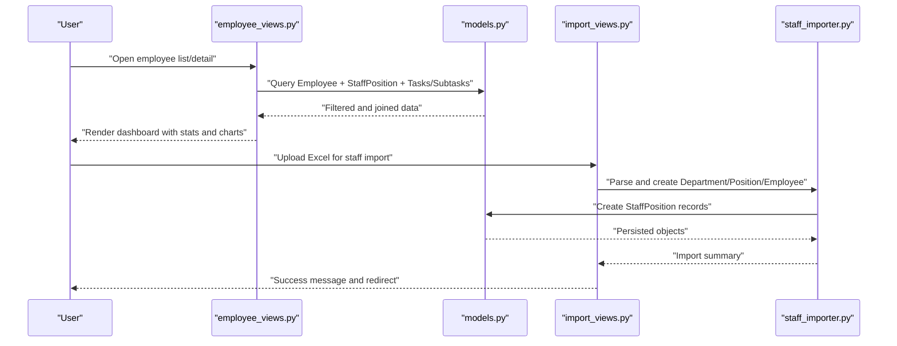
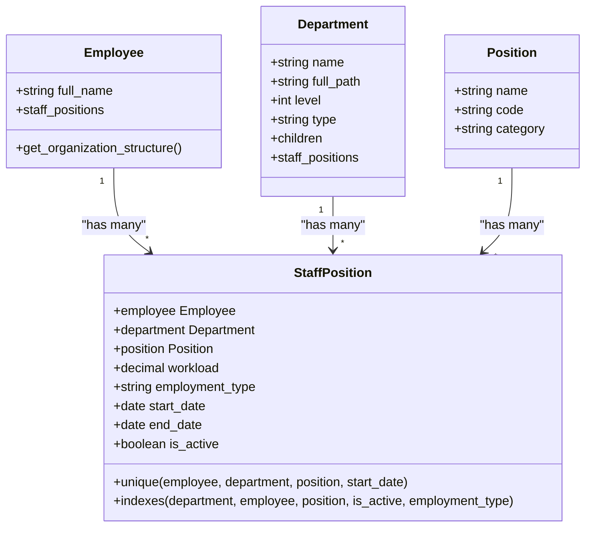
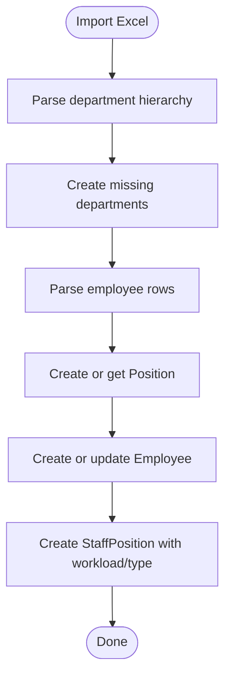
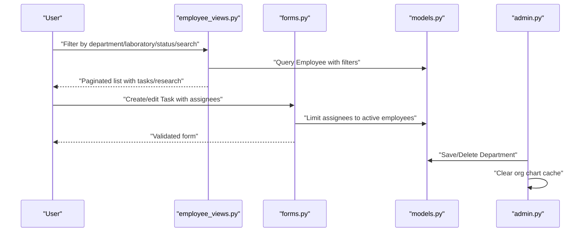
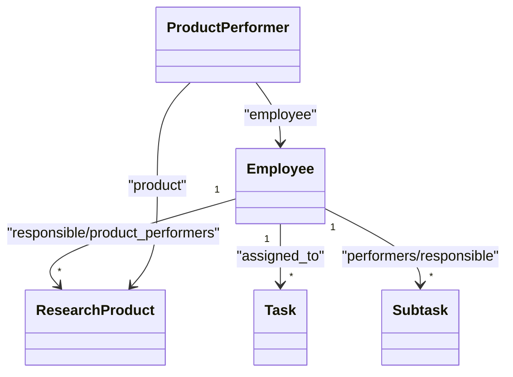
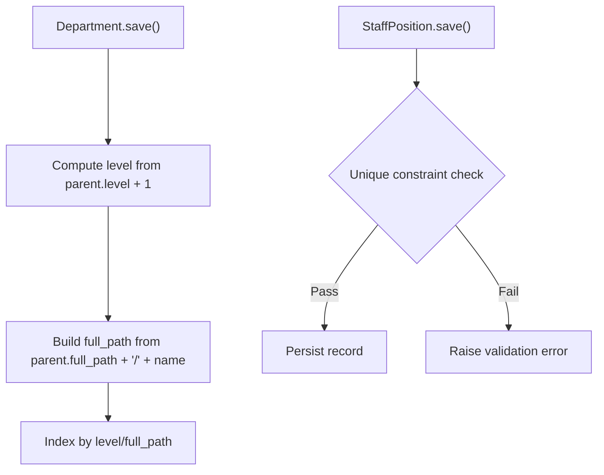
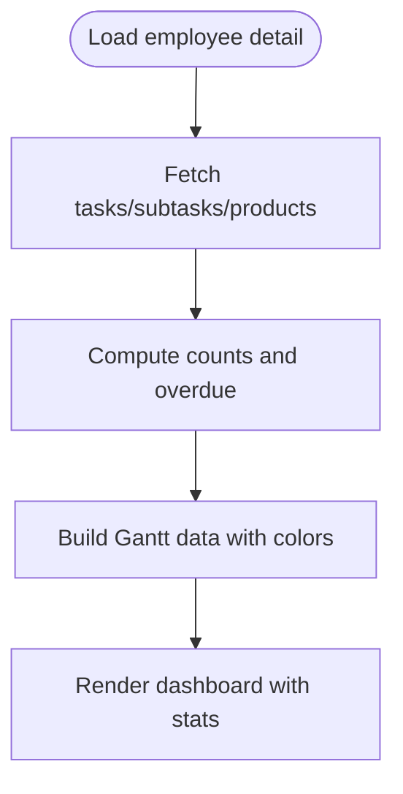
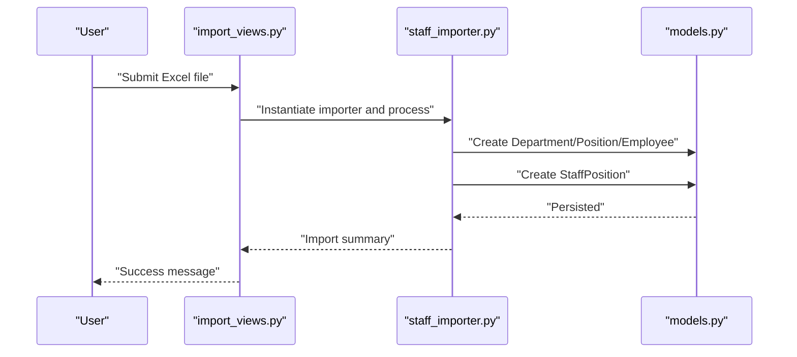
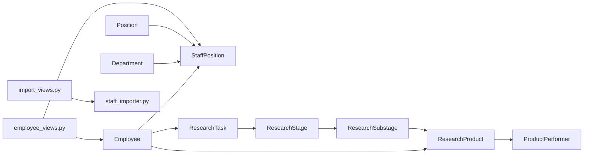

# Staff Position Assignments

<cite>
**Referenced Files in This Document**
- [models.py](file://tasks/models.py)
- [employee_views.py](file://tasks/views/employee_views.py)
- [staff_importer.py](file://tasks/utils/staff_importer.py)
- [import_views.py](file://tasks/views/import_views.py)
- [forms.py](file://tasks/forms.py)
- [admin.py](file://tasks/admin.py)
</cite>

## Table of Contents
1. [Introduction](#introduction)
2. [Project Structure](#project-structure)
3. [Core Components](#core-components)
4. [Architecture Overview](#architecture-overview)
5. [Detailed Component Analysis](#detailed-component-analysis)
6. [Dependency Analysis](#dependency-analysis)
7. [Performance Considerations](#performance-considerations)
8. [Troubleshooting Guide](#troubleshooting-guide)
9. [Conclusion](#conclusion)

## Introduction
This document explains the staff position assignment and role management system. It covers how employee positions are tracked over time via the StaffPosition model, how position history and effective dates are managed, and how the many-to-many relationship between employees and positions integrates with organizational roles. It also documents position assignment workflows, historical tracking, position-based access control, filtering in employee views, administrative management, integration with task assignments and research projects, position validation rules, hierarchy enforcement, statistics, import/export capabilities, data integrity, and audit trails.

## Project Structure
The position management system spans models, views, utilities, forms, and admin configurations:
- Models define Employees, Departments, Positions, and StaffPositions, along with ResearchTask, ResearchStage, ResearchSubstage, ResearchProduct, and ProductPerformer for research integration.
- Views implement employee listing, detail pages, and import flows.
- Utilities provide Excel-based staff import with hierarchy parsing and creation.
- Forms constrain selection to active employees and validate task timing.
- Admin clears caches after organizational structure changes.

```mermaid
graph TB
subgraph "Models"
E["Employee"]
D["Department"]
P["Position"]
SP["StaffPosition"]
RT["ResearchTask"]
RS["ResearchStage"]
RSub["ResearchSubstage"]
RP["ResearchProduct"]
PP["ProductPerformer"]
end
subgraph "Views"
EV["employee_views.py"]
IV["import_views.py"]
end
subgraph "Utils"
SI["staff_importer.py"]
end
subgraph "Forms/Admin"
F["forms.py"]
A["admin.py"]
end
E < --> SP
D < --> SP
P < --> SP
EV --> E
EV --> SP
IV --> SI
SI --> SP
F --> E
A --> D
A --> SP
RT --> RS
RS --> RSub
RSub --> RP
E < --> RP
PP --> RP
PP --> E
```

**Diagram sources**
- [models.py:13-858](file://tasks/models.py#L13-L858)
- [employee_views.py:1-1013](file://tasks/views/employee_views.py#L1-L1013)
- [staff_importer.py:1-328](file://tasks/utils/staff_importer.py#L1-L328)
- [import_views.py:1-113](file://tasks/views/import_views.py#L1-L113)
- [forms.py:1-224](file://tasks/forms.py#L1-L224)
- [admin.py:1-21](file://tasks/admin.py#L1-L21)

**Section sources**
- [models.py:13-858](file://tasks/models.py#L13-L858)
- [employee_views.py:1-1013](file://tasks/views/employee_views.py#L1-L1013)
- [staff_importer.py:1-328](file://tasks/utils/staff_importer.py#L1-L328)
- [import_views.py:1-113](file://tasks/views/import_views.py#L1-L113)
- [forms.py:1-224](file://tasks/forms.py#L1-L224)
- [admin.py:1-21](file://tasks/admin.py#L1-L21)

## Core Components
- Employee: Stores personal and organizational attributes, with computed organization structure helpers and many-to-many relations to tasks and subtasks.
- Department: Hierarchical structure with type, level, and full_path indexing for efficient navigation.
- Position: Job classification with optional category metadata.
- StaffPosition: Tracks employee-to-department-and-position assignments with workload, employment type, period, and activity flag. Includes uniqueness constraints for historical tracking.
- Research models: ResearchTask, ResearchStage, ResearchSubstage, ResearchProduct, and ProductPerformer integrate position-based roles in research workflows.
- Import pipeline: Excel-based staff importer parses hierarchical departments, creates missing nodes, and builds StaffPosition records.

Key relationships:
- Employee → StaffPosition (reverse: related_name='staff_positions')
- Department → StaffPosition (reverse: related_name='staff_positions')
- Position → StaffPosition (reverse: related_name='staff_positions')
- Employee ↔ ResearchProduct via ProductPerformer
- ResearchStage/Substage → ResearchProduct for research project alignment

**Section sources**
- [models.py:13-858](file://tasks/models.py#L13-L858)
- [staff_importer.py:1-328](file://tasks/utils/staff_importer.py#L1-L328)

## Architecture Overview
The system separates concerns across models, views, utilities, and admin:
- Model layer defines entities and constraints.
- View layer orchestrates employee-centric dashboards, filtering, and research integration.
- Utility layer handles structured import of hierarchical organizations and staff assignments.
- Admin layer maintains cache invalidation for organizational chart updates.



**Diagram sources**
- [employee_views.py:18-332](file://tasks/views/employee_views.py#L18-L332)
- [models.py:13-858](file://tasks/models.py#L13-L858)
- [import_views.py:78-113](file://tasks/views/import_views.py#L78-L113)
- [staff_importer.py:186-328](file://tasks/utils/staff_importer.py#L186-L328)

## Detailed Component Analysis

### StaffPosition Model and Historical Tracking
StaffPosition captures the temporal dimension of assignments:
- Fields include employee, department, position, workload, employment_type, notes, and a period (start_date/end_date) with is_active flag.
- Unique constraint ensures only one active assignment per employee-department-position-start_date combination, enabling historical tracking.
- Indexes support filtering by department, employee, position, activity, and employment type.



**Diagram sources**
- [models.py:604-678](file://tasks/models.py#L604-L678)

**Section sources**
- [models.py:604-678](file://tasks/models.py#L604-L678)

### Position Assignment Workflows
- Creation: Excel import parses department hierarchy, creates missing nodes, and builds StaffPosition entries with workload and employment type.
- Activation/Deactivation: is_active toggles enable/disable current assignments.
- Period management: start_date/end_date define effective periods; uniqueness prevents overlapping active assignments.
- Employment types: internal/external combination, part-time, vacant, decree, allowance, etc., mapped from textual input.



**Diagram sources**
- [staff_importer.py:186-328](file://tasks/utils/staff_importer.py#L186-L328)

**Section sources**
- [staff_importer.py:1-328](file://tasks/utils/staff_importer.py#L1-L328)

### Position-Based Access Control and Filtering
- Employee views filter by department, laboratory, activity status, and search terms, leveraging indexes on Employee and StaffPosition.
- Forms restrict task assignees to active employees only.
- Admin clears organizational cache after structural changes to keep dashboards accurate.



**Diagram sources**
- [employee_views.py:18-332](file://tasks/views/employee_views.py#L18-L332)
- [forms.py:27-31](file://tasks/forms.py#L27-L31)
- [admin.py:11-19](file://tasks/admin.py#L11-L19)

**Section sources**
- [employee_views.py:18-332](file://tasks/views/employee_views.py#L18-L332)
- [forms.py:27-31](file://tasks/forms.py#L27-L31)
- [admin.py:11-19](file://tasks/admin.py#L11-L19)

### Integration with Task Assignments and Research Projects
- Employee ↔ Task: Many-to-many via assigned_to; views aggregate tasks and subtasks with due dates and statuses.
- Employee ↔ ResearchProduct: Many-to-many via ProductPerformer; roles (responsible, executor, consultant, reviewer, approver) and contribution percentages capture position-based responsibilities.
- ResearchStage/Substage connect to ResearchProduct, enabling hierarchical research project alignment with staff assignments.



**Diagram sources**
- [models.py:165-382](file://tasks/models.py#L165-L382)
- [models.py:681-858](file://tasks/models.py#L681-L858)

**Section sources**
- [models.py:165-382](file://tasks/models.py#L165-L382)
- [models.py:681-858](file://tasks/models.py#L681-L858)
- [employee_views.py:334-692](file://tasks/views/employee_views.py#L334-L692)

### Position Validation Rules and Hierarchy Enforcement
- Department hierarchy: Parent-child relationships enforce type and level; full_path is automatically constructed and indexed.
- StaffPosition uniqueness: Prevents overlapping active assignments for the same employee-department-position-start_date.
- Employment type parsing: Converts textual inputs to normalized choices.
- Workload parsing: Defaults to full-time if unspecified.



**Diagram sources**
- [models.py:576-584](file://tasks/models.py#L576-L584)
- [models.py:664-674](file://tasks/models.py#L664-L674)

**Section sources**
- [models.py:576-584](file://tasks/models.py#L576-L584)
- [models.py:664-674](file://tasks/models.py#L664-L674)
- [staff_importer.py:164-184](file://tasks/utils/staff_importer.py#L164-L184)

### Position-Based Statistics and Reporting
- Employee detail view aggregates counts for tasks, subtasks, research tasks, stages, substages, products, and overdue items.
- Gantt-style timelines combine regular tasks and research products with color-coded categories and overdue indicators.
- Organization structure helpers compute institute, department, laboratory, and group levels from active StaffPosition.



**Diagram sources**
- [employee_views.py:334-692](file://tasks/views/employee_views.py#L334-L692)

**Section sources**
- [employee_views.py:334-692](file://tasks/views/employee_views.py#L334-L692)

### Position Import/Export and Data Integrity
- Import: Excel-based importer parses department numbers, creates hierarchy, extracts positions and employees, and generates StaffPosition records with workload and employment type.
- Export: No explicit export endpoint is present; import is the primary ingestion mechanism.
- Data integrity: Unique constraints on StaffPosition, indexed fields on Department and StaffPosition, and cache invalidation after structural changes maintain consistency.



**Diagram sources**
- [import_views.py:78-113](file://tasks/views/import_views.py#L78-L113)
- [staff_importer.py:186-328](file://tasks/utils/staff_importer.py#L186-L328)
- [models.py:532-678](file://tasks/models.py#L532-L678)

**Section sources**
- [import_views.py:78-113](file://tasks/views/import_views.py#L78-L113)
- [staff_importer.py:1-328](file://tasks/utils/staff_importer.py#L1-L328)
- [models.py:532-678](file://tasks/models.py#L532-L678)

### Administrative Position Management
- Admin clears org chart cache after saving/deleting departments to reflect structural changes immediately.
- Admin interface registers Department, StaffPosition, Employee, and Position for management.

**Section sources**
- [admin.py:1-21](file://tasks/admin.py#L1-L21)

## Dependency Analysis
- Employee depends on StaffPosition for organization structure and role context.
- Department enforces hierarchy and type constraints; StaffPosition links employees to departments.
- Position provides job classification; StaffPosition links employees to positions.
- Research models depend on Employee via ProductPerformer and ResearchStage/Substage for project alignment.
- Views depend on models for filtering, aggregation, and rendering dashboards.
- Import views depend on staff_importer for ingestion.



**Diagram sources**
- [models.py:13-858](file://tasks/models.py#L13-L858)
- [employee_views.py:1-1013](file://tasks/views/employee_views.py#L1-L1013)
- [import_views.py:1-113](file://tasks/views/import_views.py#L1-L113)
- [staff_importer.py:1-328](file://tasks/utils/staff_importer.py#L1-L328)

**Section sources**
- [models.py:13-858](file://tasks/models.py#L13-L858)
- [employee_views.py:1-1013](file://tasks/views/employee_views.py#L1-L1013)
- [import_views.py:1-113](file://tasks/views/import_views.py#L1-L113)
- [staff_importer.py:1-328](file://tasks/utils/staff_importer.py#L1-L328)

## Performance Considerations
- Indexes on Department (level, full_path) and StaffPosition (department, employee, position, is_active, employment_type) improve filtering and joins.
- Select_related and prefetch_related usage in views reduces N+1 queries for research and performer data.
- Cache invalidation after structural changes avoids stale organization charts.
- Pagination and sorting minimize rendering overhead in employee lists.

[No sources needed since this section provides general guidance]

## Troubleshooting Guide
Common issues and resolutions:
- Duplicate active assignments: Unique constraint prevents overlapping active StaffPosition entries; deactivate previous records or adjust dates.
- Department hierarchy errors: Ensure parent departments exist before children; importer sorts by number to create parents first.
- Inconsistent employment types: Import parser normalizes text; verify input spelling and casing.
- Cache inconsistencies: Admin clears org chart cache on department changes; manually clear cache if needed.
- Overdue and timeline discrepancies: Verify due dates and statuses; ensure proper date/time handling in views.

**Section sources**
- [models.py:664-674](file://tasks/models.py#L664-L674)
- [staff_importer.py:230-237](file://tasks/utils/staff_importer.py#L230-L237)
- [admin.py:11-19](file://tasks/admin.py#L11-L19)
- [employee_views.py:334-692](file://tasks/views/employee_views.py#L334-L692)

## Conclusion
The staff position assignment system provides robust tracking of employee roles over time, integrates seamlessly with task and research workflows, and supports administrative management through import/export and cache-aware operations. Constraints and indexes ensure data integrity and performance, while views deliver actionable insights via filtering, statistics, and timelines.