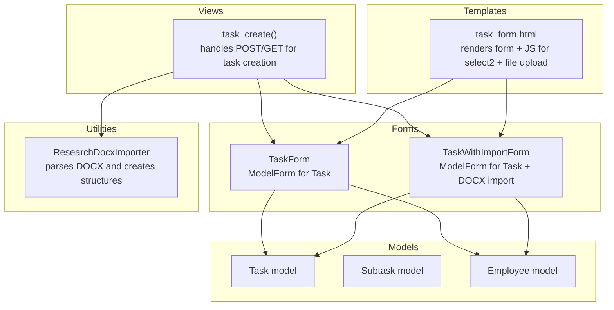
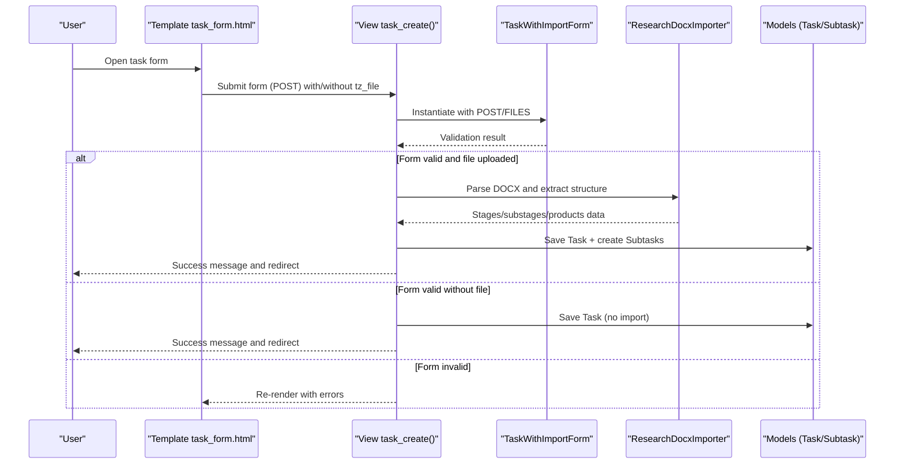
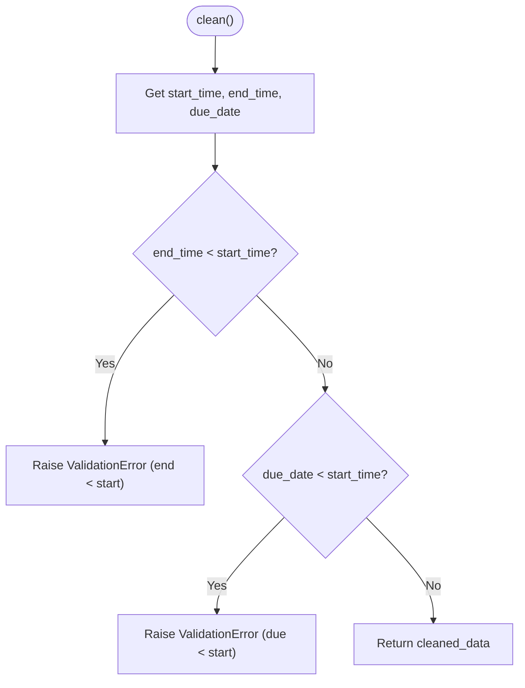
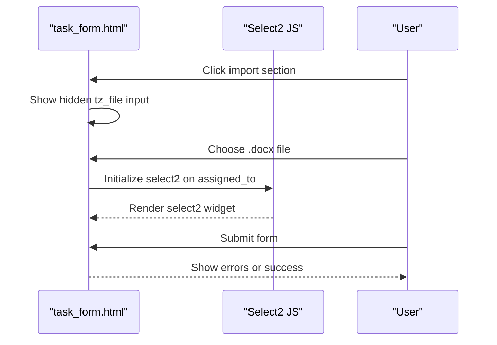
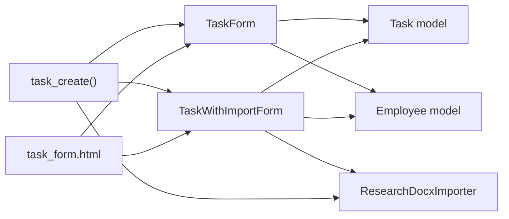

# Core Task Forms

<cite>
**Referenced Files in This Document**
- [forms.py](file://tasks/forms.py)
- [models.py](file://tasks/models.py)
- [task_views.py](file://tasks/views/task_views.py)
- [task_form.html](file://tasks/templates/tasks/task_form.html)
- [test_forms.py](file://tasks/tests/test_forms.py)
- [docx_importer.py](file://tasks/utils/docx_importer.py)
</cite>

## Table of Contents
1. [Introduction](#introduction)
2. [Project Structure](#project-structure)
3. [Core Components](#core-components)
4. [Architecture Overview](#architecture-overview)
5. [Detailed Component Analysis](#detailed-component-analysis)
6. [Dependency Analysis](#dependency-analysis)
7. [Performance Considerations](#performance-considerations)
8. [Troubleshooting Guide](#troubleshooting-guide)
9. [Conclusion](#conclusion)

## Introduction
This document focuses on the core task forms used to create and edit tasks, with special emphasis on TaskForm and TaskWithImportForm. It explains the ModelForm configuration for the Task model, field definitions, widget customization, and validation logic. It also documents the datetime-local widget implementation, select2 multiple choice fields, and dynamic queryset filtering for active employees. The TaskWithImportForm’s special handling for DOCX file imports and conditional field requirements is covered, along with practical examples of form instantiation, field rendering, and error handling patterns.

## Project Structure
The relevant components for the core task forms are organized as follows:
- Form definitions: tasks/forms.py
- Model definitions: tasks/models.py
- View logic for task creation/import: tasks/views/task_views.py
- Template rendering and client-side integration: tasks/templates/tasks/task_form.html
- Tests validating form behavior: tasks/tests/test_forms.py
- DOCX import utilities: tasks/utils/docx_importer.py



**Diagram sources**
- [forms.py:5-44](file://tasks/forms.py#L5-L44)
- [forms.py:164-201](file://tasks/forms.py#L164-L201)
- [models.py:165-238](file://tasks/models.py#L165-L238)
- [task_views.py:79-179](file://tasks/views/task_views.py#L79-L179)
- [task_form.html:60-159](file://tasks/templates/tasks/task_form.html#L60-L159)
- [docx_importer.py:1-521](file://tasks/utils/docx_importer.py#L1-L521)

**Section sources**
- [forms.py:1-224](file://tasks/forms.py#L1-L224)
- [models.py:165-238](file://tasks/models.py#L165-L238)
- [task_views.py:79-179](file://tasks/views/task_views.py#L79-L179)
- [task_form.html:1-226](file://tasks/templates/tasks/task_form.html#L1-L226)
- [test_forms.py:1-65](file://tasks/tests/test_forms.py#L1-L65)
- [docx_importer.py:1-521](file://tasks/utils/docx_importer.py#L1-L521)

## Core Components
- TaskForm: A Django ModelForm for the Task model. It configures widgets for datetime-local inputs, textarea for description, and select2 multiple choice for assigned_to. It dynamically limits the assigned_to queryset to active employees and applies custom validation to enforce time and date constraints.
- TaskWithImportForm: A ModelForm for Task with an additional optional DOCX file field. It makes the title field conditionally optional (auto-filled from the imported file) and retains the same widget and active employee filtering behavior as TaskForm.

Key characteristics:
- Widget customization: datetime-local for time/due date fields; select2 multiple for performers; Bootstrap classes applied consistently.
- Dynamic queryset filtering: assigned_to restricted to Employee records where is_active=True.
- Validation: custom clean() enforces that end_time >= start_time and due_date >= start_time.
- Import integration: TaskWithImportForm integrates with ResearchDocxImporter to create task structures from DOCX.

**Section sources**
- [forms.py:5-44](file://tasks/forms.py#L5-L44)
- [forms.py:164-201](file://tasks/forms.py#L164-L201)

## Architecture Overview
The end-to-end flow for creating a task with DOCX import involves the template, view, form, and importer.



**Diagram sources**
- [task_form.html:60-159](file://tasks/templates/tasks/task_form.html#L60-L159)
- [task_views.py:79-179](file://tasks/views/task_views.py#L79-L179)
- [forms.py:164-201](file://tasks/forms.py#L164-L201)
- [docx_importer.py:1-521](file://tasks/utils/docx_importer.py#L1-L521)

## Detailed Component Analysis

### TaskForm Analysis
TaskForm is a ModelForm bound to the Task model. It defines:
- Fields: title, description, start_time, end_time, due_date, priority, status, assigned_to.
- Widgets:
  - datetime-local for start_time, end_time, due_date.
  - textarea for description.
  - select2 multiple for assigned_to with placeholder and width configuration.
- Initialization (__init__):
  - Applies Bootstrap form-control class to most fields.
  - Filters assigned_to to Employee where is_active=True and sets labels/help text.
- Validation (clean):
  - Enforces end_time >= start_time.
  - Enforces due_date >= start_time.
  - Raises ValidationError with localized messages when violated.

```mermaid
classDiagram
class TaskForm {
+Meta.model = Task
+Meta.fields = [...]
+widgets = {...}
+__init__(*args, **kwargs)
+clean() dict
}
class Task {
+title
+description
+start_time
+end_time
+due_date
+priority
+status
+assigned_to (ManyToMany)
}
class Employee {
+is_active
+last_name
+first_name
}
TaskForm --> Task : "ModelForm for"
TaskForm --> Employee : "assigned_to filtered by is_active"
```

**Diagram sources**
- [forms.py:5-44](file://tasks/forms.py#L5-L44)
- [models.py:165-238](file://tasks/models.py#L165-L238)

Practical usage patterns:
- Instantiation: TaskForm(data) for POST validation; TaskForm(instance=obj) for editing.
- Field rendering: {{ form.field }} in templates; errors rendered via form.field.errors.
- Error handling: ValidationError raised in clean() is surfaced in form.errors.

Validation flow:


**Diagram sources**
- [forms.py:32-44](file://tasks/forms.py#L32-L44)

**Section sources**
- [forms.py:5-44](file://tasks/forms.py#L5-L44)
- [test_forms.py:7-44](file://tasks/tests/test_forms.py#L7-L44)

### TaskWithImportForm Analysis
TaskWithImportForm extends the TaskForm behavior with:
- Additional field: tz_file (optional FileField accepting .docx).
- Conditional logic:
  - title becomes optional; help text indicates it can be taken from the DOCX.
  - assigned_to remains a select2 multiple choice filtered to active employees.
- Integration:
  - Used in task_create() to process uploads and delegate parsing to ResearchDocxImporter.
  - On successful import, the Task is saved and Subtasks are created from parsed stages.

```mermaid
classDiagram
class TaskWithImportForm {
+tz_file (optional)
+Meta.model = Task
+Meta.fields = [...]
+widgets = {...}
+__init__(*args, **kwargs)
}
class ResearchDocxImporter {
+parse_research_task() dict
+create_task_structure(task, stages_data)
+import_research(default_performers)
}
TaskWithImportForm --> Task : "ModelForm for"
TaskWithImportForm --> ResearchDocxImporter : "used by view to import"
```

**Diagram sources**
- [forms.py:164-201](file://tasks/forms.py#L164-L201)
- [docx_importer.py:1-521](file://tasks/utils/docx_importer.py#L1-L521)

Implementation highlights:
- Widget customization mirrors TaskForm for consistency.
- In task_create(), if a file is present, the view saves it temporarily, parses it, optionally fills task.title, saves the Task, deletes existing subtasks, and creates new ones from the parsed stages.

**Section sources**
- [forms.py:164-201](file://tasks/forms.py#L164-L201)
- [task_views.py:79-179](file://tasks/views/task_views.py#L79-L179)
- [task_form.html:77-92](file://tasks/templates/tasks/task_form.html#L77-L92)

### Template Integration and Client-Side Behavior
The task_form.html template:
- Renders the form with CSRF protection and multipart/form-data encoding.
- Provides a clickable “Import from Research Task” section that triggers the hidden tz_file input.
- Initializes select2 for the assigned_to multiple choice field with Bootstrap 5 theme and Russian localization.
- Displays non-field and field-specific errors returned by the form.
- Optionally previews import stages via AJAX (preview_import endpoint).



**Diagram sources**
- [task_form.html:49-159](file://tasks/templates/tasks/task_form.html#L49-L159)

**Section sources**
- [task_form.html:1-226](file://tasks/templates/tasks/task_form.html#L1-L226)

## Dependency Analysis
- TaskForm depends on:
  - Task model for fields and constraints.
  - Employee model for assigned_to filtering.
  - Django forms framework for ModelForm and validation.
- TaskWithImportForm depends on:
  - TaskForm for shared behavior.
  - ResearchDocxImporter for parsing DOCX and creating structures.
  - View logic to orchestrate file handling and saving.
- Views depend on:
  - Forms for validation.
  - Models for persistence.
  - Importer for parsing external data.



**Diagram sources**
- [forms.py:5-44](file://tasks/forms.py#L5-L44)
- [forms.py:164-201](file://tasks/forms.py#L164-L201)
- [models.py:165-238](file://tasks/models.py#L165-L238)
- [task_views.py:79-179](file://tasks/views/task_views.py#L79-L179)
- [task_form.html:60-159](file://tasks/templates/tasks/task_form.html#L60-L159)
- [docx_importer.py:1-521](file://tasks/utils/docx_importer.py#L1-L521)

**Section sources**
- [forms.py:5-44](file://tasks/forms.py#L5-L44)
- [forms.py:164-201](file://tasks/forms.py#L164-L201)
- [models.py:165-238](file://tasks/models.py#L165-L238)
- [task_views.py:79-179](file://tasks/views/task_views.py#L79-L179)
- [task_form.html:60-159](file://tasks/templates/tasks/task_form.html#L60-L159)
- [docx_importer.py:1-521](file://tasks/utils/docx_importer.py#L1-L521)

## Performance Considerations
- QuerySet filtering: assigned_to is filtered to Employee where is_active=True, ensuring efficient rendering and avoiding inactive employees in selection lists.
- Widget initialization: select2 adds client-side overhead; initialize only on visible multiple-choice fields to minimize DOM manipulation.
- File handling: temporary file creation during import should be cleaned up promptly to avoid disk pressure.
- Validation: custom clean() runs after field-specific validators, keeping validation logic centralized and efficient.

## Troubleshooting Guide
Common issues and resolutions:
- Validation errors for time/due date:
  - Symptom: ValidationError indicating end_time < start_time or due_date < start_time.
  - Cause: clean() enforces temporal constraints.
  - Resolution: Adjust input values so end_time >= start_time and due_date >= start_time.
- Empty title with import:
  - Symptom: Form invalid when title is empty and no file is provided.
  - Cause: title is required by Task model; TaskWithImportForm makes it optional only when importing.
  - Resolution: Provide a title or upload a valid DOCX file.
- Select2 not rendering:
  - Symptom: Multiple choice field appears as standard select.
  - Cause: Missing select2 assets or incorrect initialization selector.
  - Resolution: Ensure CDN links and initialization script are present and the selector matches the field id_for_label.
- DOCX import failures:
  - Symptom: Error message during import.
  - Cause: Malformed DOCX or missing expected sections.
  - Resolution: Verify DOCX structure and content; check server logs for stack traces.

**Section sources**
- [forms.py:32-44](file://tasks/forms.py#L32-L44)
- [task_views.py:147-161](file://tasks/views/task_views.py#L147-L161)
- [task_form.html:166-225](file://tasks/templates/tasks/task_form.html#L166-L225)
- [test_forms.py:34-44](file://tasks/tests/test_forms.py#L34-L44)

## Conclusion
TaskForm and TaskWithImportForm encapsulate robust UI and validation logic for task creation. TaskForm ensures temporal consistency and restricts performer selection to active employees. TaskWithImportForm extends this with DOCX import capabilities, enabling automatic creation of task structures and conditional field behavior. Together, they integrate seamlessly with views and templates to deliver a reliable user experience.