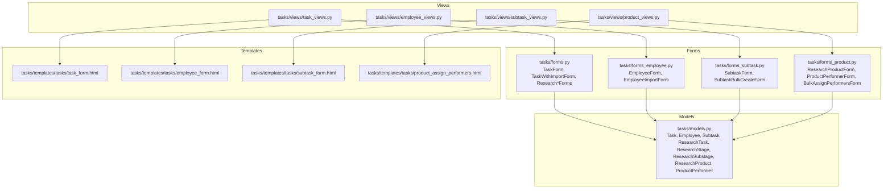
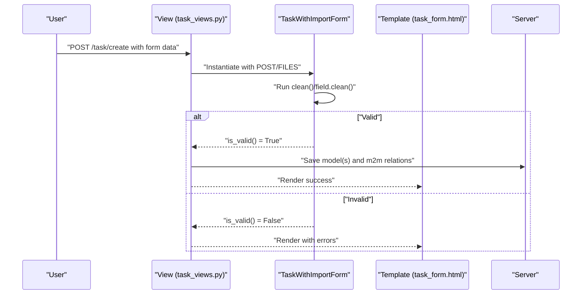
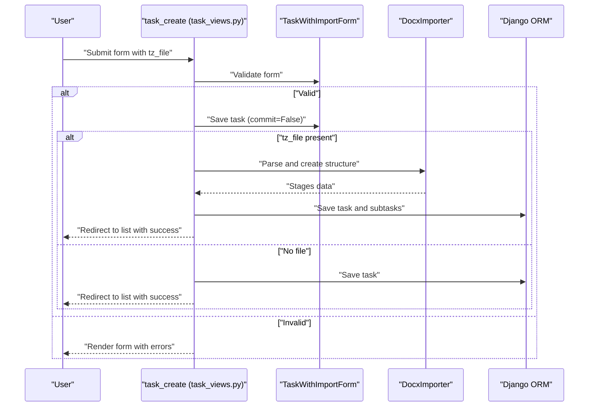
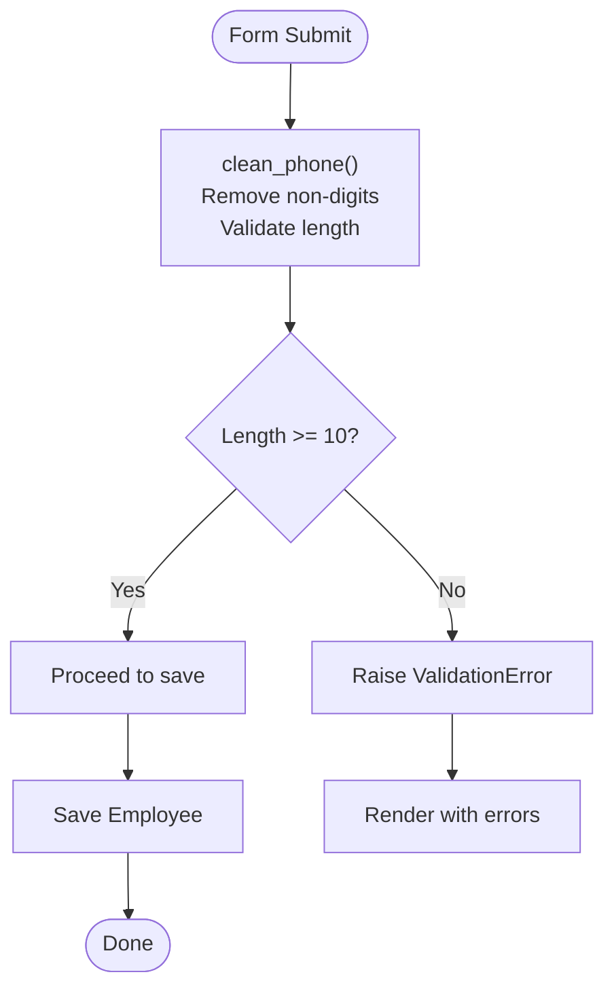
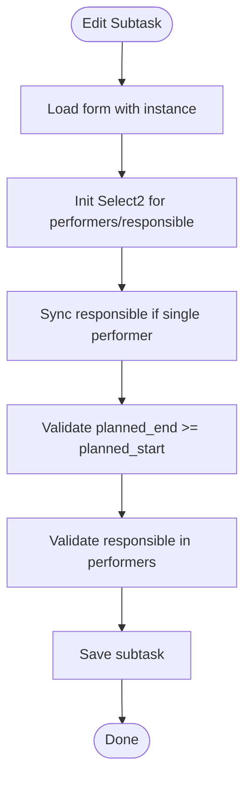
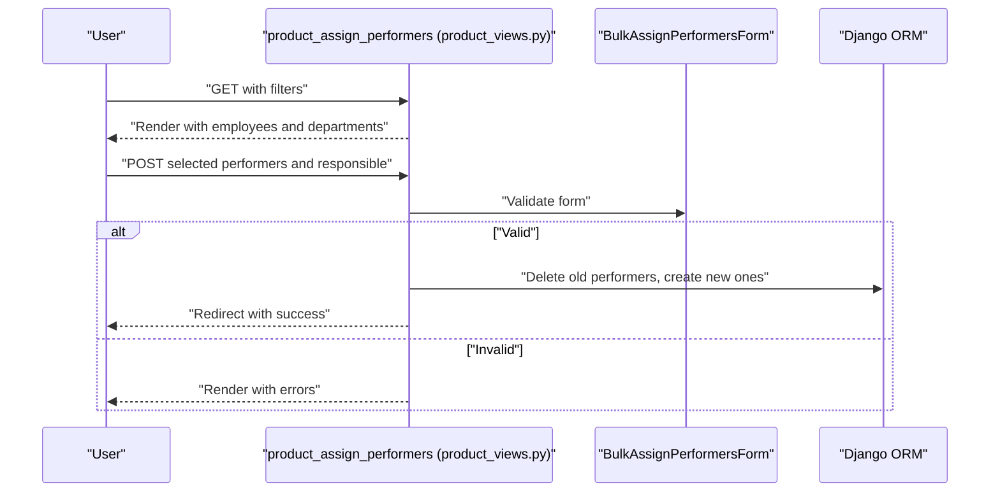
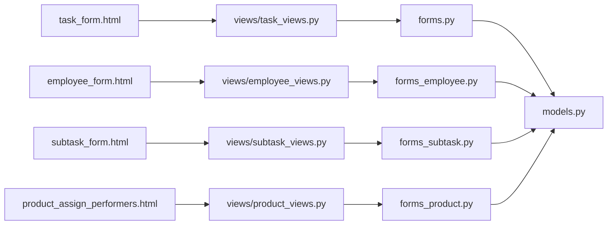

# Forms and Validation

<cite>
**Referenced Files in This Document**
- [tasks/forms.py](file://tasks/forms.py)
- [tasks/forms_employee.py](file://tasks/forms_employee.py)
- [tasks/forms_product.py](file://tasks/forms_product.py)
- [tasks/forms_subtask.py](file://tasks/forms_subtask.py)
- [tasks/models.py](file://tasks/models.py)
- [tasks/templates/tasks/task_form.html](file://tasks/templates/tasks/task_form.html)
- [tasks/templates/tasks/employee_form.html](file://tasks/templates/tasks/employee_form.html)
- [tasks/templates/tasks/subtask_form.html](file://tasks/templates/tasks/subtask_form.html)
- [tasks/templates/tasks/product_assign_performers.html](file://tasks/templates/tasks/product_assign_performers.html)
- [tasks/views/task_views.py](file://tasks/views/task_views.py)
- [tasks/views/employee_views.py](file://tasks/views/employee_views.py)
- [tasks/views/product_views.py](file://tasks/views/product_views.py)
- [tasks/views/subtask_views.py](file://tasks/views/subtask_views.py)
</cite>

## Table of Contents
1. [Introduction](#introduction)
2. [Project Structure](#project-structure)
3. [Core Components](#core-components)
4. [Architecture Overview](#architecture-overview)
5. [Detailed Component Analysis](#detailed-component-analysis)
6. [Dependency Analysis](#dependency-analysis)
7. [Performance Considerations](#performance-considerations)
8. [Troubleshooting Guide](#troubleshooting-guide)
9. [Conclusion](#conclusion)

## Introduction
This document describes the Forms and Validation system used across the Task Manager application. It covers all form classes for tasks, employees, subtasks, and scientific product assignment, including field definitions, validation rules, error messages, and custom validators. It also explains form rendering, widget customization, template integration, AJAX handling, real-time validation, user feedback mechanisms, security measures (CSRF, input sanitization, permissions), decorators and access control, and state management with persistence and error recovery strategies.

## Project Structure
The Forms and Validation system spans several modules:
- Form definitions: located under tasks/forms*.py
- Model definitions: tasks/models.py
- View handlers: tasks/views/*.py
- Templates: tasks/templates/tasks/*.html

**Diagram sources**
- [tasks/forms.py:5-224](file://tasks/forms.py#L5-L224)
- [tasks/forms_employee.py:6-53](file://tasks/forms_employee.py#L6-L53)
- [tasks/forms_subtask.py:4-129](file://tasks/forms_subtask.py#L4-L129)
- [tasks/forms_product.py:8-126](file://tasks/forms_product.py#L8-L126)
- [tasks/models.py:13-800](file://tasks/models.py#L13-L800)
- [tasks/views/task_views.py:79-200](file://tasks/views/task_views.py#L79-L200)
- [tasks/views/employee_views.py:17-200](file://tasks/views/employee_views.py#L17-L200)
- [tasks/views/subtask_views.py:68-200](file://tasks/views/subtask_views.py#L68-L200)
- [tasks/views/product_views.py:50-170](file://tasks/views/product_views.py#L50-L170)
- [tasks/templates/tasks/task_form.html:60-160](file://tasks/templates/tasks/task_form.html#L60-L160)
- [tasks/templates/tasks/employee_form.html:13-40](file://tasks/templates/tasks/employee_form.html#L13-L40)
- [tasks/templates/tasks/subtask_form.html:36-180](file://tasks/templates/tasks/subtask_form.html#L36-L180)
- [tasks/templates/tasks/product_assign_performers.html:186-280](file://tasks/templates/tasks/product_assign_performers.html#L186-L280)

**Section sources**
- [tasks/forms.py:5-224](file://tasks/forms.py#L5-L224)
- [tasks/forms_employee.py:6-53](file://tasks/forms_employee.py#L6-L53)
- [tasks/forms_subtask.py:4-129](file://tasks/forms_subtask.py#L4-L129)
- [tasks/forms_product.py:8-126](file://tasks/forms_product.py#L8-L126)
- [tasks/models.py:13-800](file://tasks/models.py#L13-L800)
- [tasks/views/task_views.py:79-200](file://tasks/views/task_views.py#L79-L200)
- [tasks/views/employee_views.py:17-200](file://tasks/views/employee_views.py#L17-L200)
- [tasks/views/subtask_views.py:68-200](file://tasks/views/subtask_views.py#L68-L200)
- [tasks/views/product_views.py:50-170](file://tasks/views/product_views.py#L50-L170)
- [tasks/templates/tasks/task_form.html:60-160](file://tasks/templates/tasks/task_form.html#L60-L160)
- [tasks/templates/tasks/employee_form.html:13-40](file://tasks/templates/tasks/employee_form.html#L13-L40)
- [tasks/templates/tasks/subtask_form.html:36-180](file://tasks/templates/tasks/subtask_form.html#L36-L180)
- [tasks/templates/tasks/product_assign_performers.html:186-280](file://tasks/templates/tasks/product_assign_performers.html#L186-L280)

## Core Components
This section documents each form class, its fields, widgets, validation rules, and custom validators.

- TaskForm
  - Fields: title, description, start_time, end_time, due_date, priority, status, assigned_to
  - Widgets: DateTimeInput for time fields, Textarea for description, SelectMultiple for assigned_to with select2
  - Validation: ensures end_time >= start_time and due_date >= start_time; limits assigned_to to active employees
  - Template integration: renders via task_form.html with CSRF and error blocks

- TaskWithImportForm
  - Fields: same as TaskForm plus tz_file for DOCX import
  - Widgets: same as TaskForm with additional file input
  - Validation: title optional when importing from DOCX; clean overrides to set title from imported data
  - Template integration: task_form.html with import section and AJAX preview button

- EmployeeForm
  - Fields: personal and organizational attributes; widgets for dates and phone placeholder
  - Validation: custom clean_phone enforces minimum digits; required labels marked with asterisks
  - Template integration: employee_form.html generic rendering

- SubtaskForm
  - Fields: stage_number, title, description, output, priority, performers, responsible, planned_start, planned_end, status, notes
  - Widgets: Select2 for performers/responsible; DateInput for planned_* fields
  - Validation: responsible must be among performers; planned_end >= planned_start
  - Template integration: subtask_form.html with Select2 initialization and automatic responsible sync

- ResearchProductForm
  - Fields: name, product_type, description, research_task/stage/substage/subtask, planned_start/end/due_date, status, notes
  - Dynamic filtering: research_stage filtered by selected research_task
  - Validation: planned_start <= planned_end; planned_end <= due_date
  - Template integration: rendered in product detail pages

- ProductPerformerForm
  - Fields: employee, role, contribution_percent, start_date, end_date, notes
  - Validation: contribution_percent in [0..100]; clean_contribution_percent
  - Dynamic filtering: employee excludes current performers

- BulkAssignPerformersForm
  - Fields: employees (multiple), role, contribution_percent, start_date, end_date
  - Validation: start_date <= end_date

- ResearchImportForm (auxiliary)
  - Fields: docx_file, default_performers, default_responsible
  - Validation: file extension check for Excel import forms; used in research import flows

**Section sources**
- [tasks/forms.py:5-44](file://tasks/forms.py#L5-L44)
- [tasks/forms.py:164-201](file://tasks/forms.py#L164-L201)
- [tasks/forms_employee.py:6-40](file://tasks/forms_employee.py#L6-L40)
- [tasks/forms_subtask.py:4-78](file://tasks/forms_subtask.py#L4-L78)
- [tasks/forms_product.py:8-53](file://tasks/forms_product.py#L8-L53)
- [tasks/forms_product.py:56-86](file://tasks/forms_product.py#L56-L86)
- [tasks/forms_product.py:88-126](file://tasks/forms_product.py#L88-L126)
- [tasks/forms.py:47-68](file://tasks/forms.py#L47-L68)

## Architecture Overview
The Forms and Validation pipeline follows Django’s standard MVC-like flow:
- Views receive requests, instantiate forms, validate data, persist to models, and render templates.
- Forms define field-level validation and clean methods.
- Templates render forms with Bootstrap and Select2 widgets, and include client-side scripts for UX and AJAX.

**Diagram sources**
- [tasks/views/task_views.py:79-179](file://tasks/views/task_views.py#L79-L179)
- [tasks/forms.py:164-201](file://tasks/forms.py#L164-L201)
- [tasks/templates/tasks/task_form.html:60-160](file://tasks/templates/tasks/task_form.html#L60-L160)

## Detailed Component Analysis

### Task Creation with Import (TaskWithImportForm)
- Purpose: Create a Task and optionally import stages/substages from a DOCX file.
- Key behaviors:
  - Optional title; if missing, populated from imported data.
  - Assigned performers propagated to imported stages.
  - Temporary file handling during import; error handling and rollback on failure.
- Validation highlights:
  - Time boundary checks in TaskForm base.
  - Clean method allows optional title when importing.
- Template integration:
  - task_form.html includes an import section, file input, and AJAX preview button.
  - Select2 initialized for assigned_to.
  - Non-field errors and per-field error rendering.

**Diagram sources**
- [tasks/views/task_views.py:79-179](file://tasks/views/task_views.py#L79-L179)
- [tasks/forms.py:164-201](file://tasks/forms.py#L164-L201)
- [tasks/templates/tasks/task_form.html:60-160](file://tasks/templates/tasks/task_form.html#L60-L160)

**Section sources**
- [tasks/views/task_views.py:79-179](file://tasks/views/task_views.py#L79-L179)
- [tasks/forms.py:164-201](file://tasks/forms.py#L164-L201)
- [tasks/templates/tasks/task_form.html:60-160](file://tasks/templates/tasks/task_form.html#L60-L160)

### Employee Management (EmployeeForm)
- Purpose: Manage employee records with phone sanitization and required fields.
- Validation highlights:
  - clean_phone removes non-digits and enforces minimum length.
  - Required fields marked with asterisks.
- Template integration:
  - employee_form.html renders all fields generically with labels, help texts, and errors.

**Diagram sources**
- [tasks/forms_employee.py:32-39](file://tasks/forms_employee.py#L32-L39)

**Section sources**
- [tasks/forms_employee.py:6-40](file://tasks/forms_employee.py#L6-L40)
- [tasks/templates/tasks/employee_form.html:13-40](file://tasks/templates/tasks/employee_form.html#L13-L40)

### Subtask Management (SubtaskForm)
- Purpose: Create and edit subtasks with performers and responsible person.
- Validation highlights:
  - Responsible must be selected from performers.
  - Planned end date must not precede planned start date.
  - Automatic responsible assignment when single performer.
- Template integration:
  - subtask_form.html initializes Select2 for performers and responsible.
  - Real-time sync updates responsible when performers change.
  - Date formatting for DateInput.

**Diagram sources**
- [tasks/forms_subtask.py:63-78](file://tasks/forms_subtask.py#L63-L78)
- [tasks/templates/tasks/subtask_form.html:193-232](file://tasks/templates/tasks/subtask_form.html#L193-L232)

**Section sources**
- [tasks/forms_subtask.py:4-78](file://tasks/forms_subtask.py#L4-L78)
- [tasks/templates/tasks/subtask_form.html:36-180](file://tasks/templates/tasks/subtask_form.html#L36-L180)

### Scientific Product Assignment (ProductPerformerForm and BulkAssignPerformersForm)
- Purpose: Assign performers to a ResearchProduct with roles and contribution percentages.
- Validation highlights:
  - contribution_percent constrained to [0..100].
  - BulkAssignPerformersForm validates start_date <= end_date.
  - Dynamic employee filtering excludes current performers.
- Template integration:
  - product_assign_performers.html provides a rich UI with department tree, search, and bulk selection.
  - AJAX for external employee creation and department filtering.

**Diagram sources**
- [tasks/views/product_views.py:50-170](file://tasks/views/product_views.py#L50-L170)
- [tasks/forms_product.py:88-126](file://tasks/forms_product.py#L88-L126)
- [tasks/templates/tasks/product_assign_performers.html:186-280](file://tasks/templates/tasks/product_assign_performers.html#L186-L280)

**Section sources**
- [tasks/forms_product.py:56-86](file://tasks/forms_product.py#L56-L86)
- [tasks/forms_product.py:88-126](file://tasks/forms_product.py#L88-L126)
- [tasks/views/product_views.py:50-170](file://tasks/views/product_views.py#L50-L170)
- [tasks/templates/tasks/product_assign_performers.html:186-280](file://tasks/templates/tasks/product_assign_performers.html#L186-L280)

### Research Product Planning (ResearchProductForm)
- Purpose: Plan scientific products with hierarchical linkage to research stages and substages.
- Validation highlights:
  - planned_start <= planned_end
  - planned_end <= due_date
  - Dynamic filtering of research_stage based on selected research_task.
- Template integration:
  - Used in research product detail and planning flows.

**Section sources**
- [tasks/forms_product.py:8-53](file://tasks/forms_product.py#L8-L53)
- [tasks/models.py:681-791](file://tasks/models.py#L681-L791)

## Dependency Analysis
- Forms depend on models for field types, choices, and reverse relations.
- Views depend on forms for validation and on templates for rendering.
- Templates depend on forms for field rendering and on JavaScript libraries for UX.

**Diagram sources**
- [tasks/forms.py:1-224](file://tasks/forms.py#L1-L224)
- [tasks/forms_employee.py:1-53](file://tasks/forms_employee.py#L1-L53)
- [tasks/forms_subtask.py:1-129](file://tasks/forms_subtask.py#L1-L129)
- [tasks/forms_product.py:1-126](file://tasks/forms_product.py#L1-L126)
- [tasks/models.py:13-800](file://tasks/models.py#L13-L800)
- [tasks/views/task_views.py:1-200](file://tasks/views/task_views.py#L1-L200)
- [tasks/views/employee_views.py:1-200](file://tasks/views/employee_views.py#L1-L200)
- [tasks/views/subtask_views.py:1-200](file://tasks/views/subtask_views.py#L1-L200)
- [tasks/views/product_views.py:1-200](file://tasks/views/product_views.py#L1-L200)
- [tasks/templates/tasks/task_form.html:1-226](file://tasks/templates/tasks/task_form.html#L1-L226)
- [tasks/templates/tasks/employee_form.html:1-44](file://tasks/templates/tasks/employee_form.html#L1-L44)
- [tasks/templates/tasks/subtask_form.html:1-234](file://tasks/templates/tasks/subtask_form.html#L1-L234)
- [tasks/templates/tasks/product_assign_performers.html:1-594](file://tasks/templates/tasks/product_assign_performers.html#L1-L594)

**Section sources**
- [tasks/forms.py:1-224](file://tasks/forms.py#L1-L224)
- [tasks/forms_employee.py:1-53](file://tasks/forms_employee.py#L1-L53)
- [tasks/forms_subtask.py:1-129](file://tasks/forms_subtask.py#L1-L129)
- [tasks/forms_product.py:1-126](file://tasks/forms_product.py#L1-L126)
- [tasks/models.py:13-800](file://tasks/models.py#L13-L800)
- [tasks/views/task_views.py:1-200](file://tasks/views/task_views.py#L1-L200)
- [tasks/views/employee_views.py:1-200](file://tasks/views/employee_views.py#L1-L200)
- [tasks/views/subtask_views.py:1-200](file://tasks/views/subtask_views.py#L1-L200)
- [tasks/views/product_views.py:1-200](file://tasks/views/product_views.py#L1-L200)
- [tasks/templates/tasks/task_form.html:1-226](file://tasks/templates/tasks/task_form.html#L1-L226)
- [tasks/templates/tasks/employee_form.html:1-44](file://tasks/templates/tasks/employee_form.html#L1-L44)
- [tasks/templates/tasks/subtask_form.html:1-234](file://tasks/templates/tasks/subtask_form.html#L1-L234)
- [tasks/templates/tasks/product_assign_performers.html:1-594](file://tasks/templates/tasks/product_assign_performers.html#L1-L594)

## Performance Considerations
- Select2 initialization occurs on demand in templates; defer heavy queries to views and use pagination where appropriate.
- Bulk operations (e.g., mass subtask creation) should batch database writes and avoid N+1 queries by prefetching related objects.
- File uploads (DOCX import) should stream chunks and clean up temporary files promptly.

## Troubleshooting Guide
- CSRF failures: Ensure templates include  inside forms.
- File upload errors: Verify enctype="multipart/form-data" and accept attributes match supported formats.
- Validation errors:
  - Time/date boundaries: Check clean methods and template JS constraints.
  - Phone number: Confirm digits-only cleaning and minimum length.
  - Responsible vs performers: Ensure responsible is included in performers list.
- AJAX previews and external employee creation:
  - Confirm CSRF token handling in JS and endpoint availability.
  - Validate JSON responses and error handling in callbacks.

**Section sources**
- [tasks/templates/tasks/task_form.html:60-160](file://tasks/templates/tasks/task_form.html#L60-L160)
- [tasks/templates/tasks/subtask_form.html:193-232](file://tasks/templates/tasks/subtask_form.html#L193-L232)
- [tasks/templates/tasks/product_assign_performers.html:455-480](file://tasks/templates/tasks/product_assign_performers.html#L455-L480)

## Conclusion
The Forms and Validation system integrates tightly with models, views, and templates to deliver robust, user-friendly interfaces. It emphasizes strong validation, dynamic filtering, and responsive UX through Select2 and AJAX. Security is addressed via CSRF tokens, permission decorators, and controlled access patterns. The system supports complex workflows such as DOCX import and multi-stage product assignment with clear error reporting and recovery strategies.