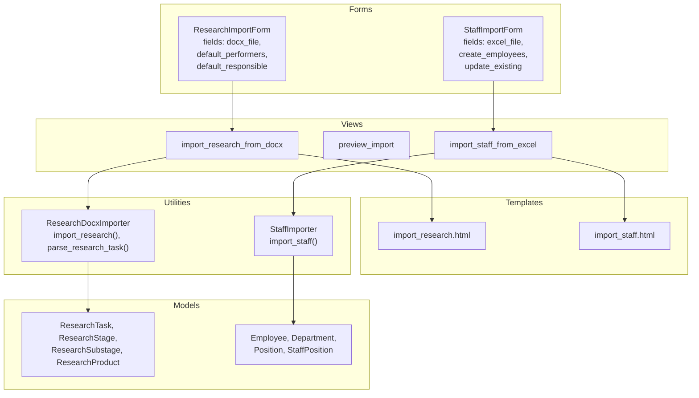
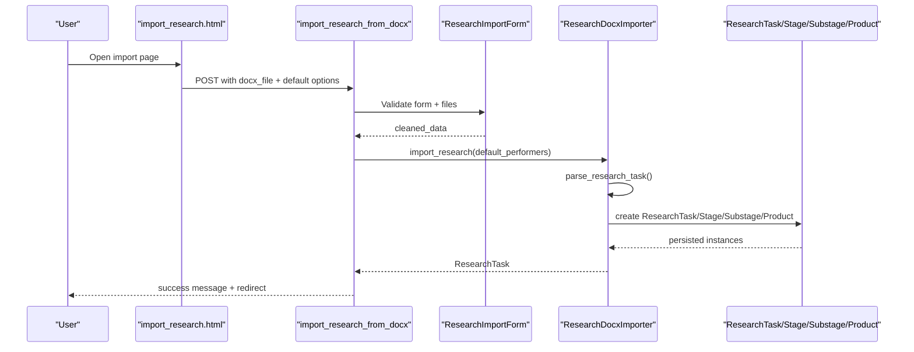
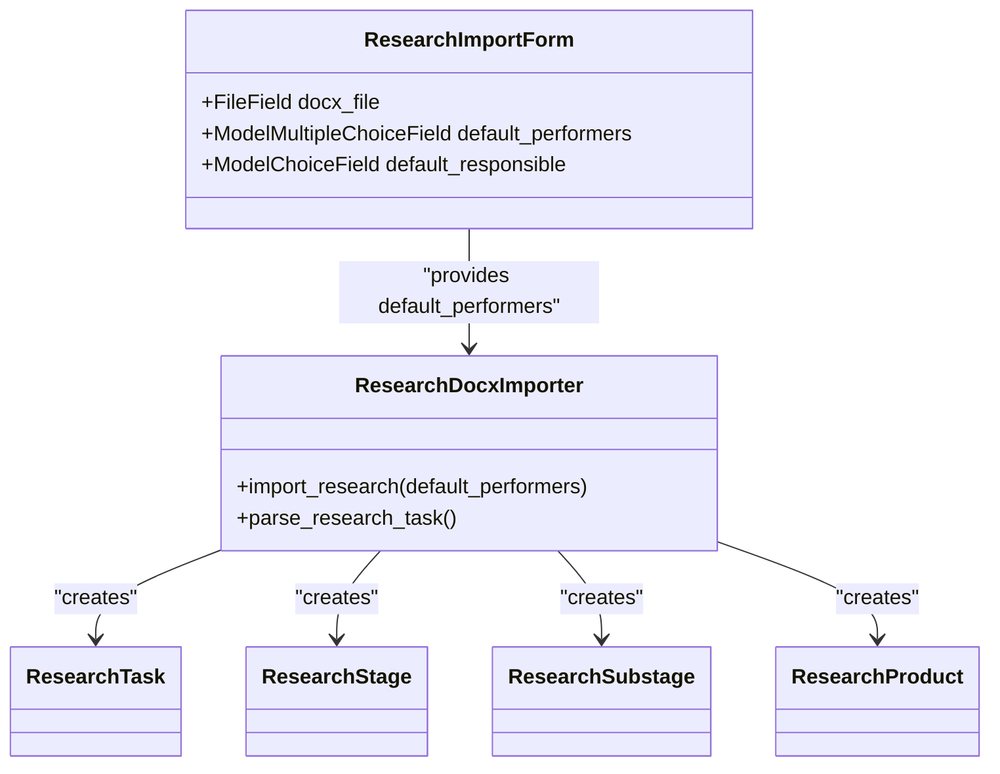
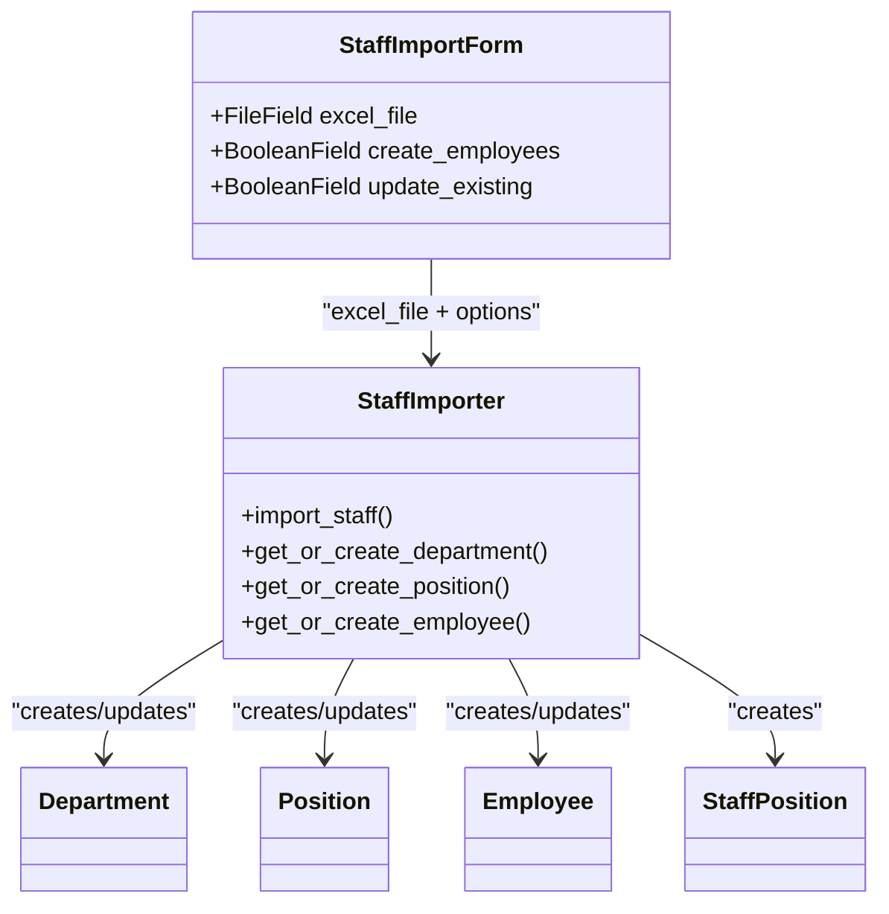
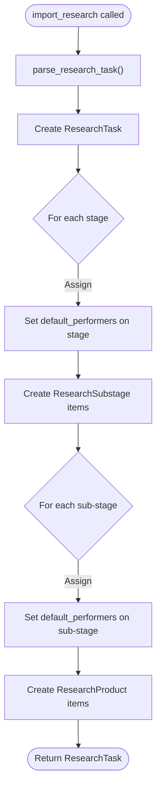
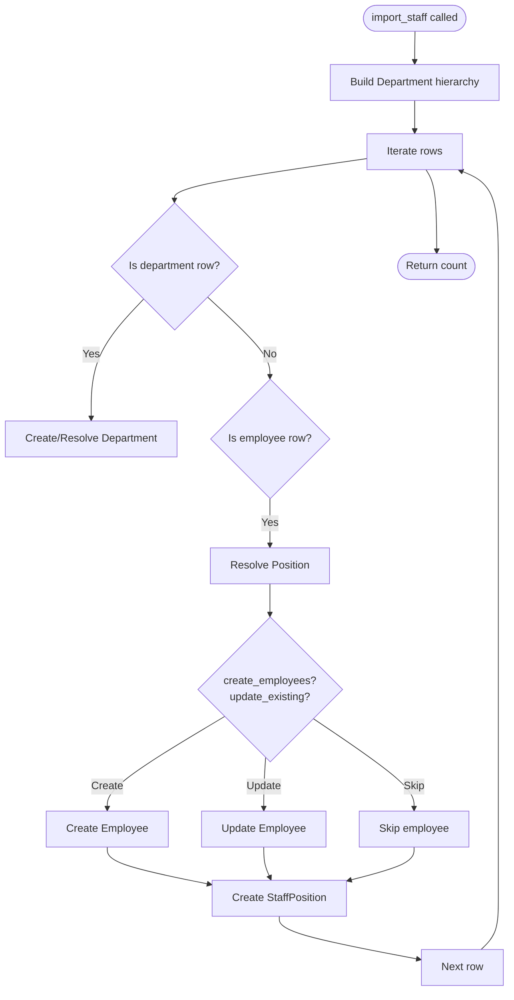
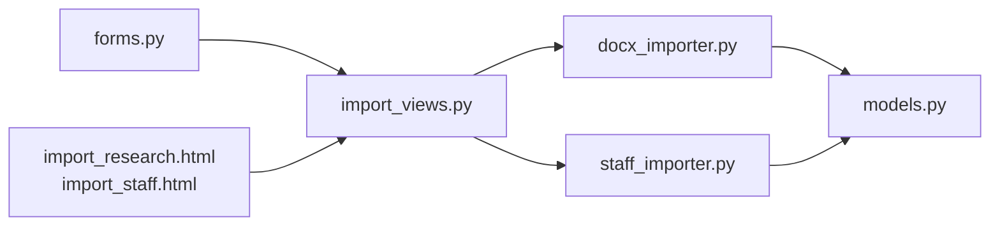

# Import and Data Forms

<cite>
**Referenced Files in This Document**
- [forms.py](file://tasks/forms.py)
- [docx_importer.py](file://tasks/utils/docx_importer.py)
- [staff_importer.py](file://tasks/utils/staff_importer.py)
- [import_views.py](file://tasks/views/import_views.py)
- [import_research.html](file://tasks/templates/tasks/import_research.html)
- [import_staff.html](file://tasks/templates/tasks/import_staff.html)
- [models.py](file://tasks/models.py)
</cite>

## Table of Contents
1. [Introduction](#introduction)
2. [Project Structure](#project-structure)
3. [Core Components](#core-components)
4. [Architecture Overview](#architecture-overview)
5. [Detailed Component Analysis](#detailed-component-analysis)
6. [Dependency Analysis](#dependency-analysis)
7. [Performance Considerations](#performance-considerations)
8. [Troubleshooting Guide](#troubleshooting-guide)
9. [Conclusion](#conclusion)

## Introduction
This document explains the import-related forms used to process external data into the task manager system. It focuses on:
- ResearchImportForm for importing scientific research documents (DOCX) and automatically creating research tasks, stages, and sub-stages
- StaffImportForm for importing organizational staffing data from Excel spreadsheets
It covers file upload field configurations, validation, error handling, and the integration with dedicated import utilities and data processing workflows.

## Project Structure
The import functionality spans forms, views, templates, and utility modules:
- Forms define the UI and validation for file uploads and options
- Views handle request processing, temporary file handling, and orchestrate import utilities
- Templates render the forms and provide user guidance
- Utilities parse and persist structured data from uploaded files

**Diagram sources**
- [forms.py:47-68](file://tasks/forms.py#L47-L68)
- [forms.py:202-224](file://tasks/forms.py#L202-L224)
- [import_views.py:14-46](file://tasks/views/import_views.py#L14-L46)
- [import_views.py:77-113](file://tasks/views/import_views.py#L77-L113)
- [import_research.html:28-80](file://tasks/templates/tasks/import_research.html#L28-L80)
- [import_staff.html:32-70](file://tasks/templates/tasks/import_staff.html#L32-L70)
- [docx_importer.py:6:521](file://tasks/utils/docx_importer.py#L6-L521)
- [staff_importer.py:7:328](file://tasks/utils/staff_importer.py#L7-L328)
- [models.py:384-531](file://tasks/models.py#L384-L531)
- [models.py:532-677](file://tasks/models.py#L532-L677)

**Section sources**
- [forms.py:47-68](file://tasks/forms.py#L47-L68)
- [forms.py:202-224](file://tasks/forms.py#L202-L224)
- [import_views.py:14-46](file://tasks/views/import_views.py#L14-L46)
- [import_views.py:77-113](file://tasks/views/import_views.py#L77-L113)
- [import_research.html:28-80](file://tasks/templates/tasks/import_research.html#L28-L80)
- [import_staff.html:32-70](file://tasks/templates/tasks/import_staff.html#L32-L70)
- [docx_importer.py:6:521](file://tasks/utils/docx_importer.py#L6-L521)
- [staff_importer.py:7:328](file://tasks/utils/staff_importer.py#L7-L328)
- [models.py:384-531](file://tasks/models.py#L384-L531)
- [models.py:532-677](file://tasks/models.py#L532-L677)

## Core Components
- ResearchImportForm
  - File upload: DOCX document via a file input with accept=".docx"
  - Options: default_performers (multiple employees) and default_responsible (single employee)
  - Purpose: drive automatic creation of ResearchTask, ResearchStage, ResearchSubstage, and ResearchProduct entries
- StaffImportForm
  - File upload: Excel spreadsheet via a file input with accept=".xlsx,.xls"
  - Options: create_employees and update_existing booleans controlling whether new employees are created and existing employees are updated

Validation and error handling:
- Forms rely on Django’s built-in validation and error reporting
- Views wrap processing in try/catch blocks and use Django messages to surface errors
- Utilities raise exceptions on parsing failures, which propagate to views

**Section sources**
- [forms.py:47-68](file://tasks/forms.py#L47-L68)
- [forms.py:202-224](file://tasks/forms.py#L202-L224)
- [import_views.py:14-46](file://tasks/views/import_views.py#L14-L46)
- [import_views.py:77-113](file://tasks/views/import_views.py#L77-L113)

## Architecture Overview
The import pipeline follows a consistent pattern:
- User submits a form with a file and optional options
- View validates the form, writes the uploaded file to a temporary location, and invokes the appropriate importer
- Importer parses the file, constructs domain objects, and persists them to the database
- On success, the view redirects to a relevant detail page; on failure, it displays an error message

**Diagram sources**
- [import_research.html:28-80](file://tasks/templates/tasks/import_research.html#L28-L80)
- [import_views.py:14-46](file://tasks/views/import_views.py#L14-L46)
- [docx_importer.py:442-521](file://tasks/utils/docx_importer.py#L442-L521)
- [models.py:384-531](file://tasks/models.py#L384-L531)

**Section sources**
- [import_research.html:28-80](file://tasks/templates/tasks/import_research.html#L28-L80)
- [import_views.py:14-46](file://tasks/views/import_views.py#L14-L46)
- [docx_importer.py:442-521](file://tasks/utils/docx_importer.py#L442-L521)
- [models.py:384-531](file://tasks/models.py#L384-L531)

## Detailed Component Analysis

### ResearchImportForm
- Fields and configuration
  - docx_file: FileField with accept=".docx" to restrict uploads to DOCX files
  - default_performers: ModelMultipleChoiceField over active employees; used to assign performers to all stages during import
  - default_responsible: ModelChoiceField over active employees; used to set a responsible person for all stages during import
- Behavior
  - The view passes cleaned_data['default_performers'] to the importer’s import_research method
  - The importer creates ResearchTask, ResearchStage, ResearchSubstage, and ResearchProduct entries
  - If default_performers are provided, they are assigned to each stage and sub-stage

**Diagram sources**
- [forms.py:47-68](file://tasks/forms.py#L47-L68)
- [docx_importer.py:442-521](file://tasks/utils/docx_importer.py#L442-L521)
- [models.py:384-531](file://tasks/models.py#L384-L531)

**Section sources**
- [forms.py:47-68](file://tasks/forms.py#L47-L68)
- [import_views.py:14-46](file://tasks/views/import_views.py#L14-L46)
- [docx_importer.py:442-521](file://tasks/utils/docx_importer.py#L442-L521)
- [models.py:384-531](file://tasks/models.py#L384-L531)

### StaffImportForm
- Fields and configuration
  - excel_file: FileField with accept=".xlsx,.xls" to restrict uploads to Excel files
  - create_employees: Boolean checkbox controlling whether to create new employees
  - update_existing: Boolean checkbox controlling whether to update existing employee records
- Behavior
  - The view passes the uploaded Excel file to StaffImporter.import_staff
  - The importer builds Department and Position hierarchies, resolves Employee records, and creates StaffPosition entries
  - The importer respects the boolean options to decide creation and updates

**Diagram sources**
- [forms.py:202-224](file://tasks/forms.py#L202-L224)
- [staff_importer.py:186:328](file://tasks/utils/staff_importer.py#L186-L328)
- [models.py:532-677](file://tasks/models.py#L532-L677)

**Section sources**
- [forms.py:202-224](file://tasks/forms.py#L202-L224)
- [import_views.py:77-113](file://tasks/views/import_views.py#L77-L113)
- [staff_importer.py:186:328](file://tasks/utils/staff_importer.py#L186-L328)
- [models.py:532-677](file://tasks/models.py#L532-L677)

### File Upload Field Configurations
- ResearchImportForm
  - docx_file configured with accept=".docx" to constrain file type selection in the browser
- StaffImportForm
  - excel_file configured with accept=".xlsx,.xls" to constrain file type selection in the browser

These attributes improve user experience by filtering visible files and reduce invalid submissions.

**Section sources**
- [forms.py:47-68](file://tasks/forms.py#L47-L68)
- [forms.py:202-224](file://tasks/forms.py#L202-L224)

### Research Task Creation and Default Assignments
- The ResearchDocxImporter.import_research method accepts default_performers and assigns them to each created ResearchStage and ResearchSubstage
- This enables automated research task creation with predefined performers and responsible persons

**Diagram sources**
- [docx_importer.py:442-521](file://tasks/utils/docx_importer.py#L442-L521)

**Section sources**
- [docx_importer.py:442-521](file://tasks/utils/docx_importer.py#L442-L521)

### Staff Import Policies: Create and Update
- create_employees: When enabled, the importer attempts to create new Employee records for recognized FIO entries
- update_existing: When enabled, the importer updates existing Employee records (e.g., position) when encountered again
- The importer also manages Department hierarchy and StaffPosition creation

**Diagram sources**
- [staff_importer.py:186:328](file://tasks/utils/staff_importer.py#L186-L328)

**Section sources**
- [staff_importer.py:186:328](file://tasks/utils/staff_importer.py#L186-L328)

### File Validation, Size Limitations, and Error Handling
- Browser-side file type constraints via accept attributes
- Backend validation occurs implicitly through Django’s FileField and form validation
- Temporary file handling
  - Views write uploaded files to temporary files using chunks to avoid memory pressure
- Error handling
  - Try/catch around import operations
  - Messages framework used to communicate success or error to the user
  - Exceptions raised by importers propagate to views and are caught centrally

Notes on size limitations:
- There are no explicit size limits configured in the forms or views shown here. If enforced, they would typically be configured at the web server or Django level (e.g., FILE_UPLOAD_MAX_MEMORY_SIZE). This document does not introduce such settings.

**Section sources**
- [forms.py:47-68](file://tasks/forms.py#L47-L68)
- [forms.py:202-224](file://tasks/forms.py#L202-L224)
- [import_views.py:14-46](file://tasks/views/import_views.py#L14-L46)
- [import_views.py:77-113](file://tasks/views/import_views.py#L77-L113)

### Integration with Import Utilities and Workflows
- Research import
  - View: import_research_from_docx
  - Utility: ResearchDocxImporter.import_research
  - Models: ResearchTask, ResearchStage, ResearchSubstage, ResearchProduct
- Staff import
  - View: import_staff_from_excel
  - Utility: StaffImporter.import_staff
  - Models: Employee, Department, Position, StaffPosition

Both workflows:
- Render a user-friendly template
- Validate the form submission
- Persist data to the database
- Clear caches when appropriate (e.g., org chart cache after staff import)

**Section sources**
- [import_views.py:14-46](file://tasks/views/import_views.py#L14-L46)
- [import_views.py:77-113](file://tasks/views/import_views.py#L77-L113)
- [docx_importer.py:442-521](file://tasks/utils/docx_importer.py#L442-L521)
- [staff_importer.py:186:328](file://tasks/utils/staff_importer.py#L186-L328)
- [models.py:384-531](file://tasks/models.py#L384-L531)
- [models.py:532-677](file://tasks/models.py#L532-L677)

### Examples of Form Processing, File Validation, and Batch Import Scenarios
- Research import scenario
  - User uploads a DOCX via import_research.html
  - View validates the form and writes the file to a temporary location
  - Importer parses the document and creates research entities
  - Success: redirect to research detail; Failure: display error message
- Staff import scenario
  - User uploads an Excel via import_staff.html
  - View validates the form and writes the file to a temporary location
  - Importer iterates rows, creates departments and positions, resolves employees, and creates staff positions
  - Success: redirect to employee list; Failure: display error message

**Section sources**
- [import_research.html:28-80](file://tasks/templates/tasks/import_research.html#L28-L80)
- [import_staff.html:32-70](file://tasks/templates/tasks/import_staff.html#L32-L70)
- [import_views.py:14-46](file://tasks/views/import_views.py#L14-L46)
- [import_views.py:77-113](file://tasks/views/import_views.py#L77-L113)

## Dependency Analysis
- Forms depend on models for querysets (active employees) and form widgets
- Views depend on forms and import utilities
- Import utilities depend on models to persist data
- Templates depend on forms for rendering and user guidance

**Diagram sources**
- [forms.py:47-68](file://tasks/forms.py#L47-L68)
- [forms.py:202-224](file://tasks/forms.py#L202-L224)
- [import_views.py:14-46](file://tasks/views/import_views.py#L14-L46)
- [import_views.py:77-113](file://tasks/views/import_views.py#L77-L113)
- [docx_importer.py:6:521](file://tasks/utils/docx_importer.py#L6-L521)
- [staff_importer.py:7:328](file://tasks/utils/staff_importer.py#L7-L328)
- [models.py:384-531](file://tasks/models.py#L384-L531)
- [models.py:532-677](file://tasks/models.py#L532-L677)
- [import_research.html:28-80](file://tasks/templates/tasks/import_research.html#L28-L80)
- [import_staff.html:32-70](file://tasks/templates/tasks/import_staff.html#L32-L70)

**Section sources**
- [forms.py:47-68](file://tasks/forms.py#L47-L68)
- [forms.py:202-224](file://tasks/forms.py#L202-L224)
- [import_views.py:14-46](file://tasks/views/import_views.py#L14-L46)
- [import_views.py:77-113](file://tasks/views/import_views.py#L77-L113)
- [docx_importer.py:6:521](file://tasks/utils/docx_importer.py#L6-L521)
- [staff_importer.py:7:328](file://tasks/utils/staff_importer.py#L7-L328)
- [models.py:384-531](file://tasks/models.py#L384-L531)
- [models.py:532-677](file://tasks/models.py#L532-L677)
- [import_research.html:28-80](file://tasks/templates/tasks/import_research.html#L28-L80)
- [import_staff.html:32-70](file://tasks/templates/tasks/import_staff.html#L32-L70)

## Performance Considerations
- Large Excel files: The importer reads the entire sheet into memory; consider chunking or streaming for very large datasets
- Temporary file handling: Writing uploaded files to disk avoids memory spikes
- Caching: After staff import, the organization chart cache is cleared to reflect structural changes

[No sources needed since this section provides general guidance]

## Troubleshooting Guide
Common issues and resolutions:
- Invalid file type
  - Ensure the file extension matches the accept attribute (.docx for research, .xlsx/.xls for staff)
- Parsing errors
  - Verify the DOCX or Excel structure aligns with expected formats
  - Check that required columns and rows are present
- Permission or access errors
  - Confirm the user has permission to create research or staff records
- Cache inconsistencies
  - After staff import, the organization chart cache is cleared automatically

**Section sources**
- [import_views.py:14-46](file://tasks/views/import_views.py#L14-L46)
- [import_views.py:77-113](file://tasks/views/import_views.py#L77-L113)

## Conclusion
The import forms provide a robust interface for bringing external data into the system:
- ResearchImportForm streamlines research task creation with default performer and responsible person assignments
- StaffImportForm supports hierarchical organization import with flexible creation and update policies
Together with their respective import utilities and views, they deliver a reliable, user-friendly import experience with clear validation and error handling.