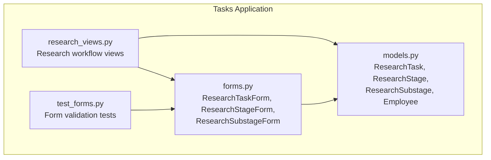
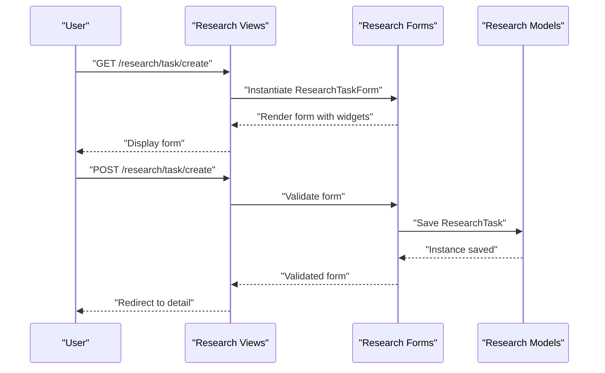
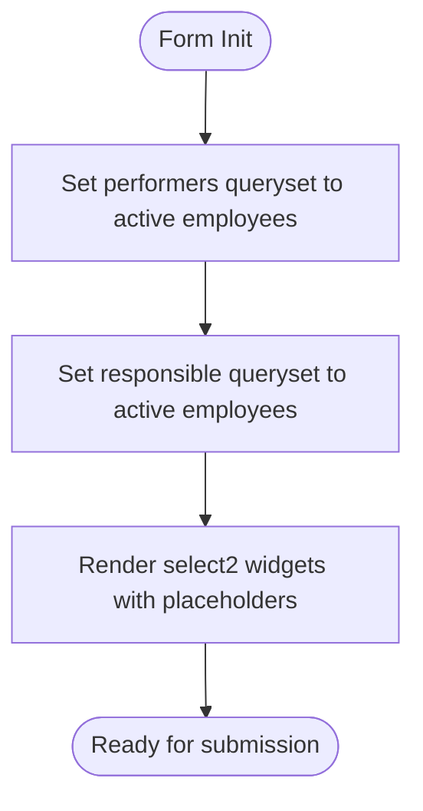
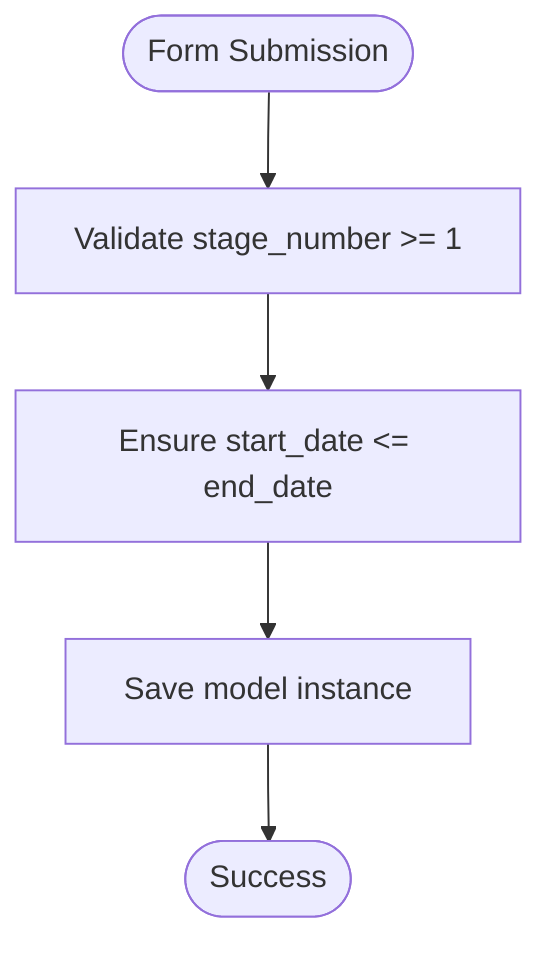
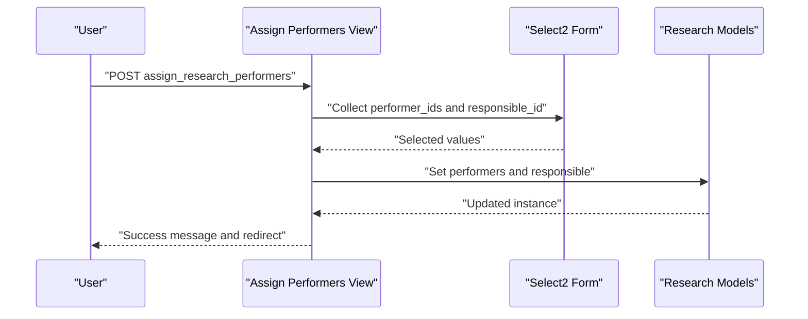
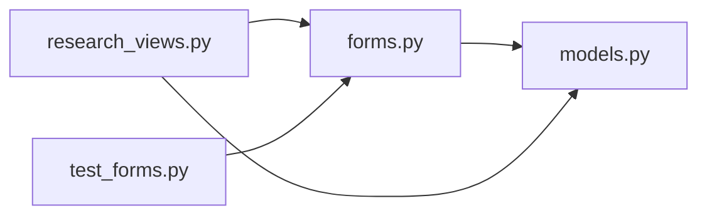

# Research Project Forms

<cite>
**Referenced Files in This Document**
- [forms.py](file://tasks/forms.py)
- [models.py](file://tasks/models.py)
- [research_views.py](file://tasks/views/research_views.py)
- [test_forms.py](file://tasks/tests/test_forms.py)
</cite>

## Table of Contents
1. [Introduction](#introduction)
2. [Project Structure](#project-structure)
3. [Core Components](#core-components)
4. [Architecture Overview](#architecture-overview)
5. [Detailed Component Analysis](#detailed-component-analysis)
6. [Dependency Analysis](#dependency-analysis)
7. [Performance Considerations](#performance-considerations)
8. [Troubleshooting Guide](#troubleshooting-guide)
9. [Conclusion](#conclusion)

## Introduction
This document provides comprehensive documentation for the research project forms focused on the research hierarchy: ResearchTaskForm, ResearchStageForm, and ResearchSubstageForm. It explains Django ModelForm configurations, specialized widgets for dates, textareas, and multiple choice fields, and the select2 widget implementations for performer and responsible person selection with dynamic querysets. It also covers stage/substage number validation, date range constraints, performer assignment patterns, form initialization methods, placeholder configurations, and field-specific validation rules. Finally, it includes examples of research workflow form handling and hierarchical data management.

## Project Structure
The research forms are implemented in the tasks application and integrate with the research models to support creation, editing, and assignment of performers/responsible persons across the research hierarchy.



**Diagram sources**
- [forms.py:71-140](file://tasks/forms.py#L71-L140)
- [models.py:384-531](file://tasks/models.py#L384-L531)
- [research_views.py:1-165](file://tasks/views/research_views.py#L1-L165)
- [test_forms.py:1-65](file://tasks/tests/test_forms.py#L1-L65)

**Section sources**
- [forms.py:71-140](file://tasks/forms.py#L71-L140)
- [models.py:384-531](file://tasks/models.py#L384-L531)
- [research_views.py:1-165](file://tasks/views/research_views.py#L1-L165)
- [test_forms.py:1-65](file://tasks/tests/test_forms.py#L1-L65)

## Core Components
- ResearchTaskForm: Handles creation/editing of the top-level research task with specialized date and textarea widgets.
- ResearchStageForm: Manages research stages with stage_number validation, date range constraints, and select2 widgets for performers and responsible person.
- ResearchSubstageForm: Manages sub-stages with flexible substage_number handling, date range constraints, and select2 widgets for performers and responsible person.

Key characteristics:
- Date inputs use HTML5 date widgets with Bootstrap classes.
- Textarea widgets configured for readability and consistent styling.
- Select2 widgets enable searchable multi-select for performers and single-select for responsible person.
- Dynamic querysets restrict selections to active employees.
- Placeholder attributes guide users on expected input.

**Section sources**
- [forms.py:71-140](file://tasks/forms.py#L71-L140)

## Architecture Overview
The research forms participate in a three-tier workflow:
- Creation/Edit: Forms render and validate user input.
- Assignment: Views handle performer and responsible person assignments via dedicated endpoints.
- Detail: Views present hierarchical data with statistics and progress.



**Diagram sources**
- [research_views.py:19-31](file://tasks/views/research_views.py#L19-L31)
- [forms.py:71-94](file://tasks/forms.py#L71-L94)
- [models.py:384-424](file://tasks/models.py#L384-L424)

## Detailed Component Analysis

### ResearchTaskForm
- Purpose: Create and edit the top-level research task (ResearchTask).
- Fields: Title, TZ number, customer, executor, executor address, foundation, funding source, government work name, start/end dates, location, goals, tasks.
- Widgets:
  - Textareas for concise titles and multi-line fields.
  - Date inputs for start_date and end_date.
  - Text inputs for scalar fields.
- Initialization: Adds Bootstrap classes to all fields and sets placeholder/help text via Meta widgets.
- Validation: No custom clean method; relies on model-level constraints.

```mermaid
classDiagram
class ResearchTaskForm {
    +Meta model: "ResearchTask"
    +Meta fields: "[...]"
    +Meta widgets: "{...}"
    +__init__()
    +clean()
}
class ResearchTask {
    +title
    +tz_number
    +customer
    +executor
    +executor_address
    +foundation
    +funding_source
    +government_work_name
    +start_date
    +end_date
    +location
    +goals
    +tasks
}
ResearchTaskForm --> ResearchTask : "ModelForm binds to"
```

**Diagram sources**
- [forms.py:71-94](file://tasks/forms.py#L71-L94)
- [models.py:384-424](file://tasks/models.py#L384-L424)

**Section sources**
- [forms.py:71-94](file://tasks/forms.py#L71-L94)
- [models.py:384-424](file://tasks/models.py#L384-L424)

### ResearchStageForm
- Purpose: Manage research stages with numbered stage identification.
- Fields: stage_number, title, start_date, end_date, performers (multi-select), responsible (single select).
- Widgets:
  - NumberInput for stage_number with minimum value constraint.
  - Date inputs for start_date and end_date.
  - SelectMultiple and Select for performers and responsible with select2 classes and placeholders.
- Initialization: Restricts performers and responsible to active employees and orders by last_name, first_name.
- Validation: No custom clean method; relies on model-level constraints.

```mermaid
classDiagram
class ResearchStageForm {
+Meta : model=ResearchStage
+Meta : fields=[...]
+Meta : widgets={...}
+__init__()
+clean()
}
class ResearchStage {
+stage_number
+title
+start_date
+end_date
+performers
+responsible
}
ResearchStageForm --> ResearchStage : "ModelForm binds to"
```

**Diagram sources**
- [forms.py:96-116](file://tasks/forms.py#L96-L116)
- [models.py:448-484](file://tasks/models.py#L448-L484)

**Section sources**
- [forms.py:96-116](file://tasks/forms.py#L96-L116)
- [models.py:448-484](file://tasks/models.py#L448-L484)

### ResearchSubstageForm
- Purpose: Manage sub-stages with flexible substage numbering.
- Fields: substage_number, title, description, start_date, end_date, performers (multi-select), responsible (single select).
- Widgets:
  - TextInput for substage_number to support dot notation (e.g., "1.1", "1.2").
  - Date inputs for start_date and end_date.
  - SelectMultiple and Select for performers and responsible with select2 classes and placeholders.
- Initialization: Accepts optional stage context via constructor kwargs and restricts performers and responsible to active employees.
- Validation: No custom clean method; relies on model-level constraints.

```mermaid
classDiagram
class ResearchSubstageForm {
+Meta : model=ResearchSubstage
+Meta : fields=[...]
+Meta : widgets={...}
+__init__(stage=None)
+clean()
}
class ResearchSubstage {
+substage_number
+title
+description
+start_date
+end_date
+performers
+responsible
}
ResearchSubstageForm --> ResearchSubstage : "ModelForm binds to"
```

**Diagram sources**
- [forms.py:118-140](file://tasks/forms.py#L118-L140)
- [models.py:487-531](file://tasks/models.py#L487-L531)

**Section sources**
- [forms.py:118-140](file://tasks/forms.py#L118-L140)
- [models.py:487-531](file://tasks/models.py#L487-L531)

### Performer and Responsible Person Selection with Select2
- Both ResearchStageForm and ResearchSubstageForm use select2-enabled widgets for performers and responsible fields.
- Dynamic querysets limit selections to active employees and order by last_name, first_name.
- Placeholders guide users to select performers and responsible persons.



**Diagram sources**
- [forms.py:112-139](file://tasks/forms.py#L112-L139)

**Section sources**
- [forms.py:105-132](file://tasks/forms.py#L105-L132)
- [forms.py:112-139](file://tasks/forms.py#L112-L139)

### Stage/Substage Number Validation and Date Range Constraints
- Stage number validation:
  - stage_number is validated as an integer with a minimum value constraint in the widget definition.
- Date range constraints:
  - While forms do not implement explicit clean methods for date ranges, views demonstrate enforcement of logical constraints during performer assignment and detail rendering.
  - Example: end_date should not precede start_date in practical usage; this is enforced by view logic and model relationships.



**Diagram sources**
- [forms.py:101-104](file://tasks/forms.py#L101-L104)
- [research_views.py:118-165](file://tasks/views/research_views.py#L118-L165)

**Section sources**
- [forms.py:101-104](file://tasks/forms.py#L101-L104)
- [research_views.py:118-165](file://tasks/views/research_views.py#L118-L165)

### Form Initialization Methods and Placeholder Configurations
- Initialization patterns:
  - ResearchStageForm and ResearchSubstageForm override __init__ to set dynamic querysets for performers and responsible.
  - ResearchSubstageForm accepts an optional stage argument to contextualize substage creation.
- Placeholder configurations:
  - Select2 widgets include data-placeholder attributes to guide users.

**Section sources**
- [forms.py:112-139](file://tasks/forms.py#L112-L139)

### Field-Specific Validation Rules
- stage_number: Integer with minimum value constraint.
- start_date/end_date: Date inputs; logical validation occurs in views and model relationships.
- performers/responsible: Multi-select/single-select with select2; dynamic querysets restrict to active employees.

**Section sources**
- [forms.py:101-132](file://tasks/forms.py#L101-L132)

### Examples of Research Workflow Form Handling and Hierarchical Data Management
- Creating a research task:
  - View handles POST/GET, instantiates ResearchTaskForm, validates, saves, and redirects to detail.
- Assigning performers and responsible persons:
  - Dedicated view supports assigning performers and responsible for stages, sub-stages, and products, updating ManyToMany and ForeignKey relationships accordingly.
- Managing hierarchical data:
  - Detail views prefetch related substages/products and compute progress metrics.



**Diagram sources**
- [research_views.py:118-165](file://tasks/views/research_views.py#L118-L165)
- [forms.py:105-132](file://tasks/forms.py#L105-L132)

**Section sources**
- [research_views.py:118-165](file://tasks/views/research_views.py#L118-L165)
- [forms.py:105-132](file://tasks/forms.py#L105-L132)

## Dependency Analysis
- Forms depend on models for field definitions and relationships.
- Views orchestrate form instantiation, validation, saving, and redirection.
- Tests validate form behavior and error conditions.



**Diagram sources**
- [forms.py:71-140](file://tasks/forms.py#L71-L140)
- [models.py:384-531](file://tasks/models.py#L384-L531)
- [research_views.py:1-165](file://tasks/views/research_views.py#L1-L165)
- [test_forms.py:1-65](file://tasks/tests/test_forms.py#L1-L65)

**Section sources**
- [forms.py:71-140](file://tasks/forms.py#L71-L140)
- [models.py:384-531](file://tasks/models.py#L384-L531)
- [research_views.py:1-165](file://tasks/views/research_views.py#L1-L165)
- [test_forms.py:1-65](file://tasks/tests/test_forms.py#L1-L65)

## Performance Considerations
- Limit querysets to active employees to reduce selection size and improve UX responsiveness.
- Use select2 widgets for efficient multi-select handling on large datasets.
- Prefetch related objects in views to minimize database queries when rendering hierarchical details.

## Troubleshooting Guide
- Select2 not working:
  - Ensure select2 CSS/JS assets are loaded and initialized on the page.
  - Verify select2 classes and data-placeholder attributes are present in widgets.
- Empty performer/responsible lists:
  - Confirm Employee records exist and are marked as active.
- Stage/substage number errors:
  - Ensure stage_number is an integer >= 1.
- Date range issues:
  - Validate that start_date does not exceed end_date in forms and views.

**Section sources**
- [forms.py:105-132](file://tasks/forms.py#L105-L132)
- [forms.py:112-139](file://tasks/forms.py#L112-L139)
- [test_forms.py:34-43](file://tasks/tests/test_forms.py#L34-L43)

## Conclusion
The research project forms provide a robust, user-friendly interface for managing the research hierarchy. They leverage specialized widgets, dynamic querysets, and select2 integration to streamline performer and responsible person selection. Initialization methods ensure only active employees are selectable, while placeholder configurations enhance usability. The accompanying views demonstrate practical enforcement of date ranges and hierarchical data management, supporting a clear research workflow from task creation to stage/sub-stage assignment and progress tracking.