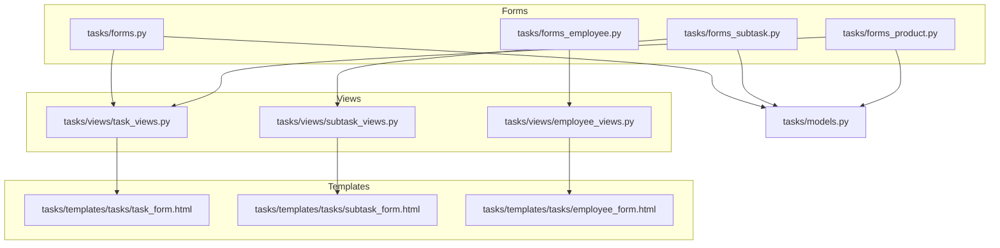
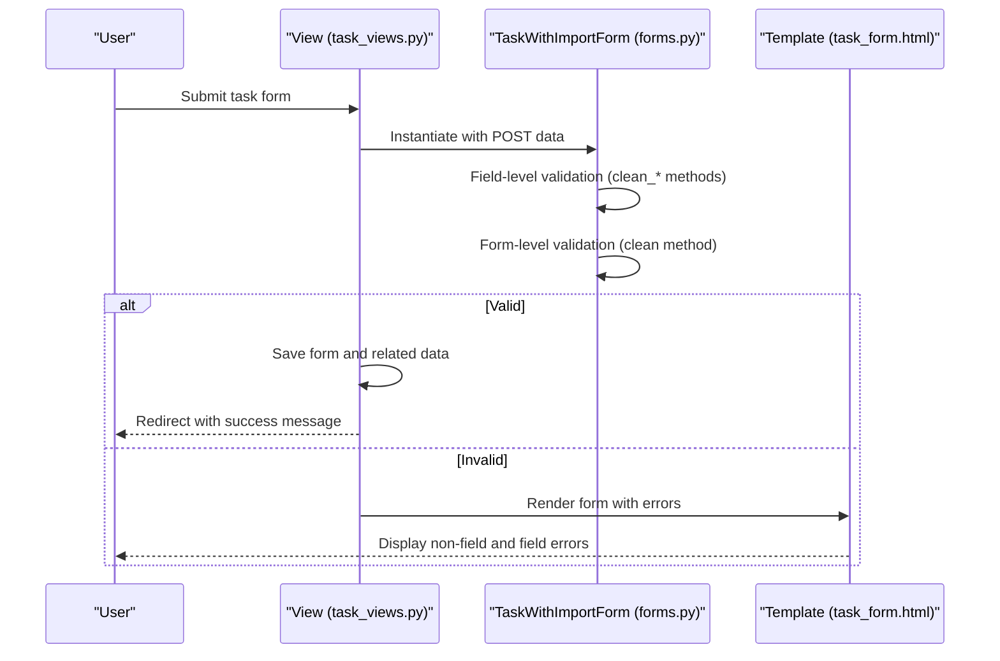
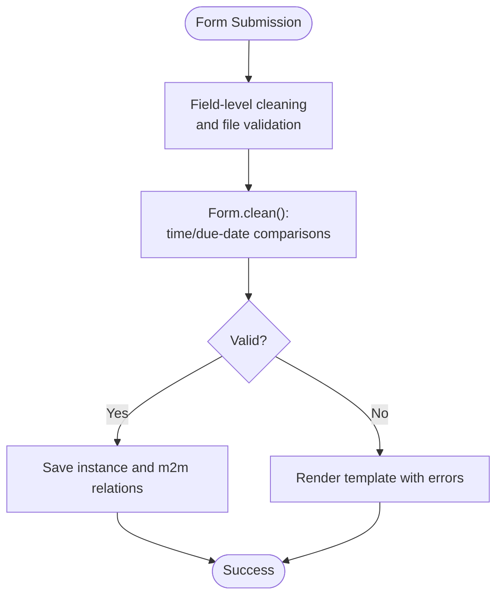
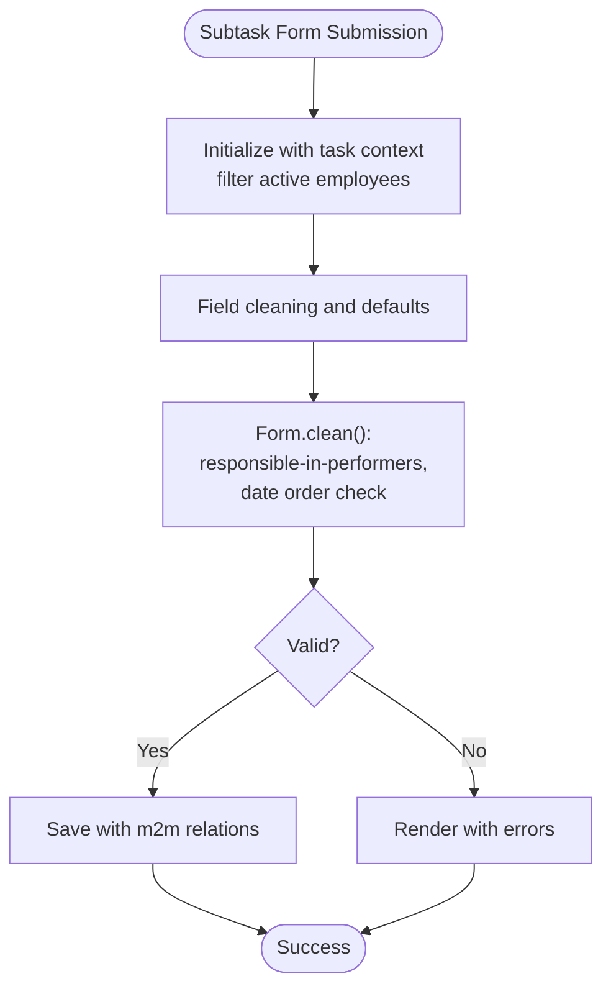
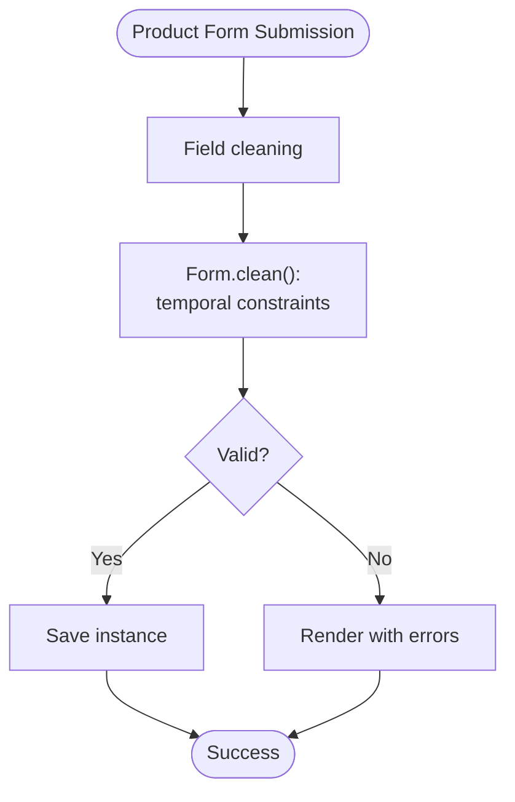
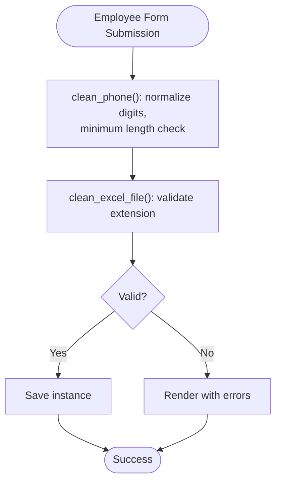
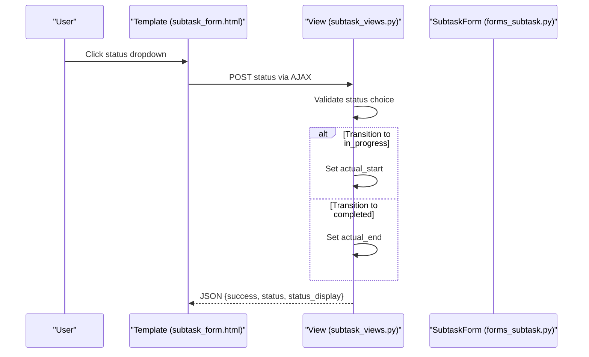
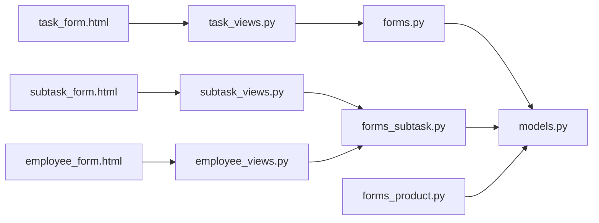

# Validation Rules and Error Handling

<cite>
**Referenced Files in This Document**
- [forms.py](file://tasks/forms.py)
- [forms_employee.py](file://tasks/forms_employee.py)
- [forms_subtask.py](file://tasks/forms_subtask.py)
- [forms_product.py](file://tasks/forms_product.py)
- [task_views.py](file://tasks/views/task_views.py)
- [subtask_views.py](file://tasks/views/subtask_views.py)
- [employee_views.py](file://tasks/views/employee_views.py)
- [task_form.html](file://tasks/templates/tasks/task_form.html)
- [subtask_form.html](file://tasks/templates/tasks/subtask_form.html)
- [employee_form.html](file://tasks/templates/tasks/employee_form.html)
- [test_forms.py](file://tasks/tests/test_forms.py)
- [models.py](file://tasks/models.py)
</cite>

## Table of Contents
1. [Introduction](#introduction)
2. [Project Structure](#project-structure)
3. [Core Components](#core-components)
4. [Architecture Overview](#architecture-overview)
5. [Detailed Component Analysis](#detailed-component-analysis)
6. [Dependency Analysis](#dependency-analysis)
7. [Performance Considerations](#performance-considerations)
8. [Troubleshooting Guide](#troubleshooting-guide)
9. [Conclusion](#conclusion)

## Introduction
This document explains the form validation rules and error handling mechanisms implemented in the project. It covers custom validation methods for time constraints, date relationships, and business rules; distinguishes form-level versus field-level validation; documents error presentation and internationalization; and describes AJAX-driven validation and real-time feedback. It also outlines permission-based access patterns and security validation approaches used in the application.

## Project Structure
The validation logic is primarily implemented in Django forms, with complementary business rules enforced in model methods and view controllers. Templates render user-friendly error messages and integrate client-side feedback.

**Diagram sources**
- [forms.py:1-224](file://tasks/forms.py#L1-L224)
- [forms_employee.py:1-53](file://tasks/forms_employee.py#L1-L53)
- [forms_subtask.py:1-129](file://tasks/forms_subtask.py#L1-L129)
- [forms_product.py:1-126](file://tasks/forms_product.py#L1-L126)
- [task_views.py:1-471](file://tasks/views/task_views.py#L1-L471)
- [subtask_views.py:1-218](file://tasks/views/subtask_views.py#L1-L218)
- [employee_views.py:1-1013](file://tasks/views/employee_views.py#L1-L1013)
- [task_form.html:1-226](file://tasks/templates/tasks/task_form.html#L1-L226)
- [subtask_form.html:1-234](file://tasks/templates/tasks/subtask_form.html#L1-L234)
- [employee_form.html:1-44](file://tasks/templates/tasks/employee_form.html#L1-L44)
- [models.py:165-382](file://tasks/models.py#L165-L382)

**Section sources**
- [forms.py:1-224](file://tasks/forms.py#L1-L224)
- [forms_employee.py:1-53](file://tasks/forms_employee.py#L1-L53)
- [forms_subtask.py:1-129](file://tasks/forms_subtask.py#L1-L129)
- [forms_product.py:1-126](file://tasks/forms_product.py#L1-L126)
- [task_views.py:1-471](file://tasks/views/task_views.py#L1-L471)
- [subtask_views.py:1-218](file://tasks/views/subtask_views.py#L1-L218)
- [employee_views.py:1-1013](file://tasks/views/employee_views.py#L1-L1013)
- [task_form.html:1-226](file://tasks/templates/tasks/task_form.html#L1-L226)
- [subtask_form.html:1-234](file://tasks/templates/tasks/subtask_form.html#L1-L234)
- [employee_form.html:1-44](file://tasks/templates/tasks/employee_form.html#L1-L44)
- [models.py:165-382](file://tasks/models.py#L165-L382)

## Core Components
- Form-level validators enforce cross-field constraints and business rules:
  - Task creation/editing form validates time and due-date relationships.
  - Subtask form enforces performer/responsible consistency and date ordering.
  - Product forms validate temporal constraints and percentage bounds.
  - Employee form validates phone length and file upload formats.
- Field-level validators:
  - Phone number normalization and minimum digit validation.
  - Contribution percentage range validation.
- Model-level helpers:
  - Business logic for task lifecycle and overdue checks supports validation decisions.
- View-level integration:
  - Forms are instantiated in views, validated, saved, and rendered with error messages.
  - AJAX endpoints support real-time updates for subtask status.
- Template-level rendering:
  - Non-field and field-specific errors are displayed with Bootstrap-styled alerts and inline labels.

**Section sources**
- [forms.py:32-44](file://tasks/forms.py#L32-L44)
- [forms_subtask.py:63-78](file://tasks/forms_subtask.py#L63-L78)
- [forms_product.py:41-53](file://tasks/forms_product.py#L41-L53)
- [forms_employee.py:32-39](file://tasks/forms_employee.py#L32-L39)
- [forms_product.py:81-85](file://tasks/forms_product.py#L81-L85)
- [models.py:214-238](file://tasks/models.py#L214-L238)
- [task_views.py:81-179](file://tasks/views/task_views.py#L81-L179)
- [subtask_views.py:193-217](file://tasks/views/subtask_views.py#L193-L217)
- [task_form.html:69-159](file://tasks/templates/tasks/task_form.html#L69-L159)
- [subtask_form.html:39-181](file://tasks/templates/tasks/subtask_form.html#L39-L181)
- [employee_form.html:16-39](file://tasks/templates/tasks/employee_form.html#L16-L39)

## Architecture Overview
The validation pipeline follows a consistent pattern across components: form instantiation in views, field and form validation, error collection, and user feedback via templates. AJAX endpoints enable real-time updates for subtask status transitions.

**Diagram sources**
- [task_views.py:81-179](file://tasks/views/task_views.py#L81-L179)
- [forms.py:164-201](file://tasks/forms.py#L164-L201)
- [task_form.html:69-159](file://tasks/templates/tasks/task_form.html#L69-L159)

**Section sources**
- [task_views.py:81-179](file://tasks/views/task_views.py#L81-L179)
- [forms.py:164-201](file://tasks/forms.py#L164-L201)
- [task_form.html:69-159](file://tasks/templates/tasks/task_form.html#L69-L159)

## Detailed Component Analysis

### Task and TaskWithImport Forms
- Purpose: Create and optionally import research structure from a technical specification file; manage time/due-date relationships and assignees.
- Field-level validations:
  - Assignees filtered to active employees.
  - Optional title fallback when importing from file.
- Form-level validations:
  - End time must not precede start time.
  - Due date must not precede start time.
- Error presentation:
  - Non-field errors container displays cross-field validation failures.
  - Inline field errors beneath each input.
- AJAX integration:
  - Import preview button triggers an AJAX call to preview stages count from the uploaded file.

**Diagram sources**
- [forms.py:32-44](file://tasks/forms.py#L32-L44)
- [forms.py:164-201](file://tasks/forms.py#L164-L201)
- [task_views.py:81-179](file://tasks/views/task_views.py#L81-L179)
- [task_form.html:69-159](file://tasks/templates/tasks/task_form.html#L69-L159)

**Section sources**
- [forms.py:32-44](file://tasks/forms.py#L32-L44)
- [forms.py:164-201](file://tasks/forms.py#L164-L201)
- [task_views.py:81-179](file://tasks/views/task_views.py#L81-L179)
- [task_form.html:69-159](file://tasks/templates/tasks/task_form.html#L69-L159)
- [test_forms.py:34-44](file://tasks/tests/test_forms.py#L34-L44)

### Subtask Form
- Purpose: Manage research stage/substage stages with performers and responsible person.
- Field-level validations:
  - Performers and responsible are restricted to active employees.
  - Automatic assignment of responsible when a single performer is selected.
- Form-level validations:
  - Responsible must be among performers.
  - Planned end must not precede planned start.
- Error presentation:
  - Non-field errors and inline field errors rendered in the template.

**Diagram sources**
- [forms_subtask.py:33-78](file://tasks/forms_subtask.py#L33-L78)
- [subtask_views.py:69-116](file://tasks/views/subtask_views.py#L69-L116)
- [subtask_form.html:39-181](file://tasks/templates/tasks/subtask_form.html#L39-L181)

**Section sources**
- [forms_subtask.py:33-78](file://tasks/forms_subtask.py#L33-L78)
- [subtask_views.py:69-116](file://tasks/views/subtask_views.py#L69-L116)
- [subtask_form.html:39-181](file://tasks/templates/tasks/subtask_form.html#L39-L181)

### Research Product and Performer Forms
- Purpose: Create scientific products linked to research stages and assign performers with roles and contribution percentages.
- Form-level validations:
  - Planned start must not exceed planned end.
  - Due date must not precede planned end.
  - Contribution percent must be within 0–100.
- Error presentation:
  - Non-field errors container and inline field errors.

**Diagram sources**
- [forms_product.py:41-53](file://tasks/forms_product.py#L41-L53)
- [forms_product.py:81-85](file://tasks/forms_product.py#L81-L85)
- [task_views.py:81-179](file://tasks/views/task_views.py#L81-L179)

**Section sources**
- [forms_product.py:41-53](file://tasks/forms_product.py#L41-L53)
- [forms_product.py:81-85](file://tasks/forms_product.py#L81-L85)
- [task_views.py:81-179](file://tasks/views/task_views.py#L81-L179)

### Employee Form and Import
- Purpose: Create/update employee records and validate phone number format and file uploads.
- Field-level validations:
  - Phone normalization and minimum digit requirement.
  - Excel file extension validation.
- Error presentation:
  - Loop over form fields to render labels, help text, and errors.

**Diagram sources**
- [forms_employee.py:32-39](file://tasks/forms_employee.py#L32-L39)
- [forms_employee.py:49-53](file://tasks/forms_employee.py#L49-L53)
- [employee_views.py:702-740](file://tasks/views/employee_views.py#L702-L740)
- [employee_form.html:16-39](file://tasks/templates/tasks/employee_form.html#L16-L39)

**Section sources**
- [forms_employee.py:32-39](file://tasks/forms_employee.py#L32-L39)
- [forms_employee.py:49-53](file://tasks/forms_employee.py#L49-L53)
- [employee_views.py:702-740](file://tasks/views/employee_views.py#L702-L740)
- [employee_form.html:16-39](file://tasks/templates/tasks/employee_form.html#L16-L39)

### AJAX Real-Time Feedback
- Endpoint: Subtask status update via AJAX.
- Behavior:
  - Validates status against allowed choices.
  - On transition to in-progress, sets actual start time.
  - On transition to completed, sets actual end time.
  - Returns JSON response for non-HTML requests.

**Diagram sources**
- [subtask_views.py:193-217](file://tasks/views/subtask_views.py#L193-L217)
- [subtask_form.html:173-181](file://tasks/templates/tasks/subtask_form.html#L173-L181)

**Section sources**
- [subtask_views.py:193-217](file://tasks/views/subtask_views.py#L193-L217)
- [subtask_form.html:173-181](file://tasks/templates/tasks/subtask_form.html#L173-L181)

### Permission-Based Access and Security Patterns
- Authentication:
  - Views decorated with login-required ensure only authenticated users can access endpoints.
- Authorization:
  - Objects are retrieved with user filters (e.g., task.user) to prevent unauthorized access.
- Security validation:
  - CSRF protection enabled via template inclusion.
  - File uploads validated for extensions and processed securely (temporary files).
  - No explicit custom permission decorators are used; access control relies on user-scoped retrieval and login requirements.

**Section sources**
- [task_views.py:19-79](file://tasks/views/task_views.py#L19-L79)
- [subtask_views.py:10-116](file://tasks/views/subtask_views.py#L10-L116)
- [employee_views.py:17-740](file://tasks/views/employee_views.py#L17-L740)
- [task_form.html:60](file://tasks/templates/tasks/task_form.html#L60)

## Dependency Analysis
- Forms depend on models for field choices and related constraints.
- Views orchestrate form instantiation, validation, saving, and error rendering.
- Templates render errors and integrate client-side libraries for UX.

**Diagram sources**
- [forms.py:1-224](file://tasks/forms.py#L1-L224)
- [forms_subtask.py:1-129](file://tasks/forms_subtask.py#L1-L129)
- [forms_product.py:1-126](file://tasks/forms_product.py#L1-L126)
- [models.py:165-382](file://tasks/models.py#L165-L382)
- [task_views.py:1-471](file://tasks/views/task_views.py#L1-L471)
- [subtask_views.py:1-218](file://tasks/views/subtask_views.py#L1-L218)
- [employee_views.py:1-1013](file://tasks/views/employee_views.py#L1-L1013)
- [task_form.html:1-226](file://tasks/templates/tasks/task_form.html#L1-L226)
- [subtask_form.html:1-234](file://tasks/templates/tasks/subtask_form.html#L1-L234)
- [employee_form.html:1-44](file://tasks/templates/tasks/employee_form.html#L1-L44)

**Section sources**
- [forms.py:1-224](file://tasks/forms.py#L1-L224)
- [forms_subtask.py:1-129](file://tasks/forms_subtask.py#L1-L129)
- [forms_product.py:1-126](file://tasks/forms_product.py#L1-L126)
- [models.py:165-382](file://tasks/models.py#L165-L382)
- [task_views.py:1-471](file://tasks/views/task_views.py#L1-L471)
- [subtask_views.py:1-218](file://tasks/views/subtask_views.py#L1-L218)
- [employee_views.py:1-1013](file://tasks/views/employee_views.py#L1-L1013)
- [task_form.html:1-226](file://tasks/templates/tasks/task_form.html#L1-L226)
- [subtask_form.html:1-234](file://tasks/templates/tasks/subtask_form.html#L1-L234)
- [employee_form.html:1-44](file://tasks/templates/tasks/employee_form.html#L1-L44)

## Performance Considerations
- Minimize database queries in forms by filtering querysets efficiently (e.g., active employees).
- Use select_related and prefetch_related in views to reduce N+1 queries when rendering lists and related objects.
- Keep validation logic lightweight; avoid heavy computations in clean methods.
- For AJAX endpoints, return minimal JSON payloads to reduce bandwidth and improve responsiveness.

## Troubleshooting Guide
- Cross-field validation failures:
  - Verify form.clean() logic for time/due-date comparisons and performer/responsible consistency.
  - Confirm that non-field errors are rendered in templates.
- File upload issues:
  - Ensure accept attributes match supported extensions and server-side validation is applied.
  - Check temporary file handling and cleanup after processing.
- AJAX status updates:
  - Confirm X-Requested-With header detection and JSON response formatting.
  - Validate allowed status choices and transitions.
- Test coverage:
  - Use unit tests to assert invalid forms and error message presence.

**Section sources**
- [test_forms.py:34-44](file://tasks/tests/test_forms.py#L34-L44)
- [task_views.py:147-151](file://tasks/views/task_views.py#L147-L151)
- [subtask_views.py:193-217](file://tasks/views/subtask_views.py#L193-L217)

## Conclusion
The project implements robust form validation through a combination of field-level and form-level validators, complemented by model-level business logic and view-level integration. Error messages are user-friendly and localized in templates, with optional AJAX support for real-time feedback. Access control is enforced via authentication and user-scoped object retrieval, ensuring secure operation.