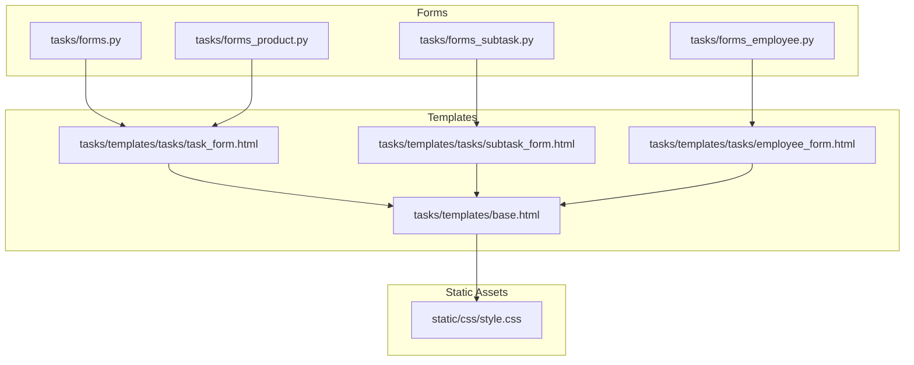
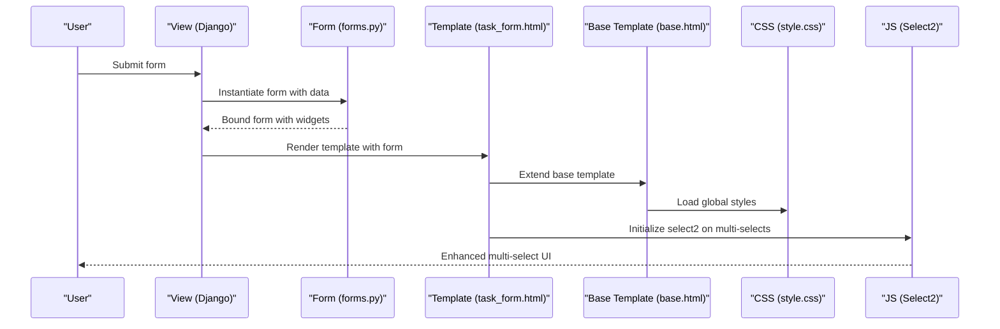
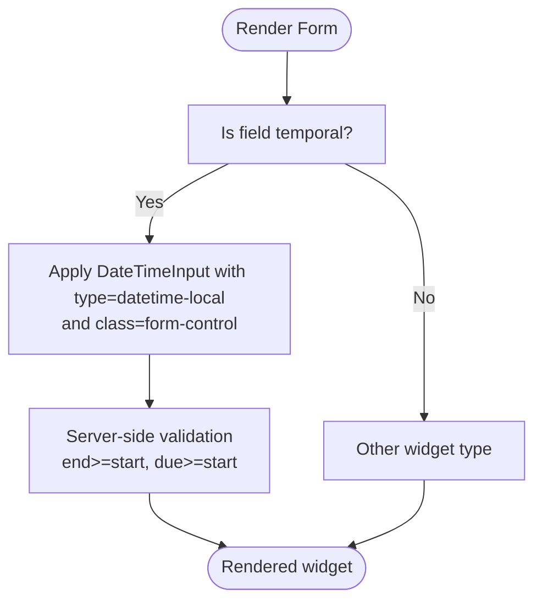
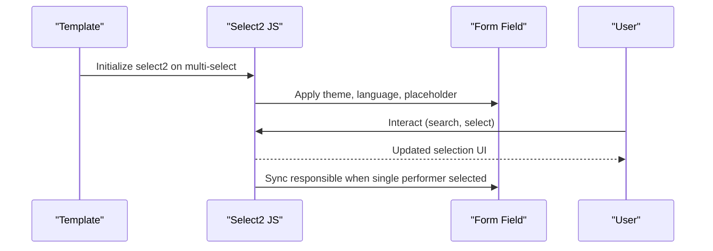
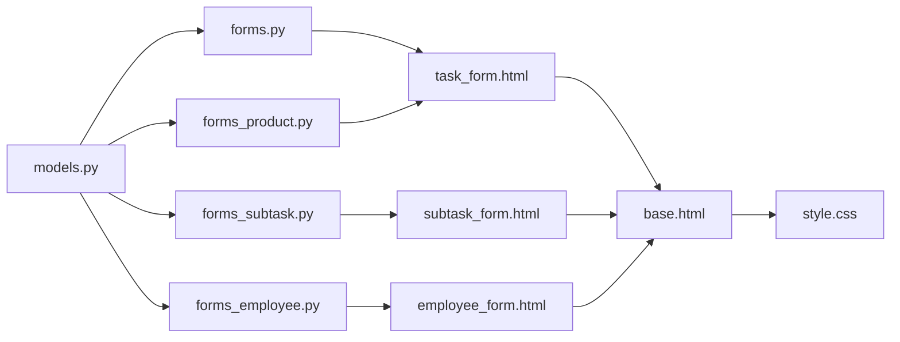

# Widget Customization and Rendering

<cite>
**Referenced Files in This Document**
- [forms.py](file://tasks/forms.py)
- [forms_employee.py](file://tasks/forms_employee.py)
- [forms_subtask.py](file://tasks/forms_subtask.py)
- [forms_product.py](file://tasks/forms_product.py)
- [task_form.html](file://tasks/templates/tasks/task_form.html)
- [subtask_form.html](file://tasks/templates/tasks/subtask_form.html)
- [employee_form.html](file://tasks/templates/tasks/employee_form.html)
- [base.html](file://tasks/templates/base.html)
- [style.css](file://static/css/style.css)
- [models.py](file://tasks/models.py)
</cite>

## Table of Contents
1. [Introduction](#introduction)
2. [Project Structure](#project-structure)
3. [Core Components](#core-components)
4. [Architecture Overview](#architecture-overview)
5. [Detailed Component Analysis](#detailed-component-analysis)
6. [Dependency Analysis](#dependency-analysis)
7. [Performance Considerations](#performance-considerations)
8. [Troubleshooting Guide](#troubleshooting-guide)
9. [Conclusion](#conclusion)

## Introduction
This document explains how form widgets are customized and rendered across the project. It focuses on three key patterns:
- datetime-local widgets for precise temporal inputs
- select2 multiple choice widgets for enhanced multi-selection
- textarea configurations for flexible text editing

It also covers widget attribute customization (CSS classes, placeholders, data attributes), Bootstrap integration, responsive design, accessibility, keyboard navigation, screen reader compatibility, and advanced configuration examples. Finally, it outlines strategies for custom widget development and template integration.

## Project Structure
The widget customization spans Django forms, templates, and CSS/JS assets:
- Forms define widget types, attributes, and runtime adjustments
- Templates render widgets and integrate JavaScript libraries
- Base templates provide Bootstrap and global styles
- CSS defines form controls and responsive behavior

**Diagram sources**
- [forms.py:1-224](file://tasks/forms.py#L1-L224)
- [forms_employee.py:1-53](file://tasks/forms_employee.py#L1-L53)
- [forms_subtask.py:1-129](file://tasks/forms_subtask.py#L1-L129)
- [forms_product.py:1-126](file://tasks/forms_product.py#L1-L126)
- [task_form.html:1-226](file://tasks/templates/tasks/task_form.html#L1-L226)
- [subtask_form.html:1-234](file://tasks/templates/tasks/subtask_form.html#L1-L234)
- [employee_form.html:1-44](file://tasks/templates/tasks/employee_form.html#L1-L44)
- [base.html:1-118](file://tasks/templates/base.html#L1-L118)
- [style.css:1-314](file://static/css/style.css#L1-L314)

**Section sources**
- [forms.py:1-224](file://tasks/forms.py#L1-L224)
- [forms_employee.py:1-53](file://tasks/forms_employee.py#L1-L53)
- [forms_subtask.py:1-129](file://tasks/forms_subtask.py#L1-L129)
- [forms_product.py:1-126](file://tasks/forms_product.py#L1-L126)
- [task_form.html:1-226](file://tasks/templates/tasks/task_form.html#L1-L226)
- [subtask_form.html:1-234](file://tasks/templates/tasks/subtask_form.html#L1-L234)
- [employee_form.html:1-44](file://tasks/templates/tasks/employee_form.html#L1-L44)
- [base.html:1-118](file://tasks/templates/base.html#L1-L118)
- [style.css:1-314](file://static/css/style.css#L1-L314)

## Core Components
- datetime-local widgets: Used for start/end/due temporal fields to capture date and time with browser-native pickers
- select2 multiple choice widgets: Enhanced multi-select for performers/responsible roles with search and placeholder
- textarea configurations: Rows and responsive sizing for long-form text inputs

Key implementation highlights:
- Forms define widget classes and attributes (e.g., type, class, rows, placeholder)
- Templates render widgets and initialize select2 with Bootstrap 5 theme
- Global CSS ensures consistent form-control styling and responsive layout

**Section sources**
- [forms.py:9-19](file://tasks/forms.py#L9-L19)
- [forms.py:100-110](file://tasks/forms.py#L100-L110)
- [forms_subtask.py:10-31](file://tasks/forms_subtask.py#L10-L31)
- [forms_employee.py:14-18](file://tasks/forms_employee.py#L14-L18)
- [task_form.html:6-8](file://tasks/templates/tasks/task_form.html#L6-L8)
- [subtask_form.html:7-8](file://tasks/templates/tasks/subtask_form.html#L7-L8)
- [style.css:139-152](file://static/css/style.css#L139-L152)

## Architecture Overview
The rendering pipeline connects forms to templates and assets:

**Diagram sources**
- [forms.py:1-224](file://tasks/forms.py#L1-L224)
- [task_form.html:1-226](file://tasks/templates/tasks/task_form.html#L1-L226)
- [base.html:1-118](file://tasks/templates/base.html#L1-L118)
- [style.css:1-314](file://static/css/style.css#L1-L314)

## Detailed Component Analysis

### Datetime-Local Widgets
- Purpose: Capture date and time with native browser UI
- Implementation:
  - Forms specify DateTimeInput with type set to datetime-local and Bootstrap class form-control
  - Additional date-only inputs use DateInput with type set to date
- Behavior:
  - Browser-native picker improves UX
  - Validation ensures logical ordering (end after start, due after start)

**Diagram sources**
- [forms.py:9-19](file://tasks/forms.py#L9-L19)
- [forms.py:88-93](file://tasks/forms.py#L88-L93)
- [forms_subtask.py:21-29](file://tasks/forms_subtask.py#L21-L29)

**Section sources**
- [forms.py:9-19](file://tasks/forms.py#L9-L19)
- [forms.py:32-44](file://tasks/forms.py#L32-L44)
- [forms_subtask.py:21-29](file://tasks/forms_subtask.py#L21-L29)
- [forms_subtask.py:63-78](file://tasks/forms_subtask.py#L63-L78)

### Select2 Multiple Choice Widgets
- Purpose: Enhance multi-select with search, placeholder, and Bootstrap 5 theming
- Implementation:
  - Forms define SelectMultiple with class form-control select2 and data-placeholder
  - Templates include CDN-hosted Select2 CSS/JS and initialize with theme and language
  - JavaScript initializes select2 on target selects and synchronizes responsible field
- Behavior:
  - Placeholder text guides users
  - Allow clear option supports resetting selections
  - Responsive width adapts to container

**Diagram sources**
- [forms.py:14-18](file://tasks/forms.py#L14-L18)
- [forms.py:186-190](file://tasks/forms.py#L186-L190)
- [forms_subtask.py:16-21](file://tasks/forms_subtask.py#L16-L21)
- [forms_subtask.py:105-110](file://tasks/forms_subtask.py#L105-L110)
- [task_form.html:6-9](file://tasks/templates/tasks/task_form.html#L6-L9)
- [task_form.html:167-180](file://tasks/templates/tasks/task_form.html#L167-L180)
- [subtask_form.html:7-8](file://tasks/templates/tasks/subtask_form.html#L7-L8)
- [subtask_form.html:193-210](file://tasks/templates/tasks/subtask_form.html#L193-L210)

**Section sources**
- [forms.py:14-18](file://tasks/forms.py#L14-L18)
- [forms.py:186-190](file://tasks/forms.py#L186-L190)
- [forms_subtask.py:16-21](file://tasks/forms_subtask.py#L16-L21)
- [forms_subtask.py:105-110](file://tasks/forms_subtask.py#L105-L110)
- [task_form.html:6-9](file://tasks/templates/tasks/task_form.html#L6-L9)
- [task_form.html:167-180](file://tasks/templates/tasks/task_form.html#L167-L180)
- [subtask_form.html:7-8](file://tasks/templates/tasks/subtask_form.html#L7-L8)
- [subtask_form.html:193-210](file://tasks/templates/tasks/subtask_form.html#L193-L210)

### Textarea Configurations
- Purpose: Provide flexible multi-line text input with Bootstrap styling
- Implementation:
  - Forms set rows and class form-control for consistent sizing
  - Additional placeholder attributes can be added via attrs
- Behavior:
  - Responsive height adapts to content
  - Consistent focus styling and spacing

**Section sources**
- [forms.py:13](file://tasks/forms.py#L13)
- [forms_employee.py:16-17](file://tasks/forms_employee.py#L16-L17)
- [forms_subtask.py:13-15](file://tasks/forms_subtask.py#L13-L15)
- [forms_product.py:23-25](file://tasks/forms_product.py#L23-L25)

### Widget Attribute Customization
- CSS classes: All form inputs receive class form-control for uniform styling
- Placeholders: Select2 widgets use data-placeholder; text inputs can set placeholder attribute
- Data attributes: Select2 widgets include data-placeholder for localized prompts
- Dynamic updates: Forms adjust attributes during initialization for consistency

**Section sources**
- [forms.py:21-25](file://tasks/forms.py#L21-L25)
- [forms_employee.py:17](file://tasks/forms_employee.py#L17)
- [forms_subtask.py:16-21](file://tasks/forms_subtask.py#L16-L21)
- [forms_subtask.py:105-110](file://tasks/forms_subtask.py#L105-L110)

### Bootstrap Integration and Responsive Design
- Bootstrap CSS and JS are included in the base template
- Global CSS defines form-control focus states, spacing, and responsive grid utilities
- Templates use Bootstrap grid classes (e.g., col-md-*) and utility classes (justify-content, mb-*)

**Section sources**
- [base.html:10-23](file://tasks/templates/base.html#L10-L23)
- [style.css:139-152](file://static/css/style.css#L139-L152)
- [task_form.html:41-163](file://tasks/templates/tasks/task_form.html#L41-L163)
- [subtask_form.html:26-185](file://tasks/templates/tasks/subtask_form.html#L26-L185)

### Accessibility, Keyboard Navigation, and Screen Reader Compatibility
- Labels: Each field is wrapped with a label element bound to the field’s id_for_label
- Focus management: Global focus styles improve keyboard navigation visibility
- Select2: Provides accessible keyboard interactions and ARIA-compliant dropdowns
- Error presentation: Non-field and field-specific errors are rendered with semantic markup

**Section sources**
- [task_form.html:84-92](file://tasks/templates/tasks/task_form.html#L84-L92)
- [subtask_form.html:49-67](file://tasks/templates/tasks/subtask_form.html#L49-L67)
- [style.css:148-152](file://static/css/style.css#L148-L152)
- [task_form.html:69-75](file://tasks/templates/tasks/task_form.html#L69-L75)

### Advanced Widget Configurations and Custom Implementations
- Placeholder-driven defaults: File inputs and text inputs use placeholders to guide users
- Conditional behavior: JavaScript adjusts placeholders and enables previews based on user actions
- Multi-step initialization: Select2 is initialized with theme, language, and width parameters
- Model-driven queries: Forms limit querysets to active employees and prefill related fields

**Section sources**
- [forms.py:166-175](file://tasks/forms.py#L166-L175)
- [forms_employee.py:42-53](file://tasks/forms_employee.py#L42-L53)
- [task_form.html:182-199](file://tasks/templates/tasks/task_form.html#L182-L199)
- [subtask_form.html:193-210](file://tasks/templates/tasks/subtask_form.html#L193-L210)

## Dependency Analysis
The following diagram shows how forms, templates, and assets depend on each other:

**Diagram sources**
- [models.py:1-858](file://tasks/models.py#L1-L858)
- [forms.py:1-224](file://tasks/forms.py#L1-L224)
- [forms_employee.py:1-53](file://tasks/forms_employee.py#L1-L53)
- [forms_subtask.py:1-129](file://tasks/forms_subtask.py#L1-L129)
- [forms_product.py:1-126](file://tasks/forms_product.py#L1-L126)
- [task_form.html:1-226](file://tasks/templates/tasks/task_form.html#L1-L226)
- [subtask_form.html:1-234](file://tasks/templates/tasks/subtask_form.html#L1-L234)
- [employee_form.html:1-44](file://tasks/templates/tasks/employee_form.html#L1-L44)
- [base.html:1-118](file://tasks/templates/base.html#L1-L118)
- [style.css:1-314](file://static/css/style.css#L1-L314)

**Section sources**
- [models.py:1-858](file://tasks/models.py#L1-L858)
- [forms.py:1-224](file://tasks/forms.py#L1-L224)
- [forms_employee.py:1-53](file://tasks/forms_employee.py#L1-L53)
- [forms_subtask.py:1-129](file://tasks/forms_subtask.py#L1-L129)
- [forms_product.py:1-126](file://tasks/forms_product.py#L1-L126)
- [task_form.html:1-226](file://tasks/templates/tasks/task_form.html#L1-L226)
- [subtask_form.html:1-234](file://tasks/templates/tasks/subtask_form.html#L1-L234)
- [employee_form.html:1-44](file://tasks/templates/tasks/employee_form.html#L1-L44)
- [base.html:1-118](file://tasks/templates/base.html#L1-L118)
- [style.css:1-314](file://static/css/style.css#L1-L314)

## Performance Considerations
- Minimize DOM manipulation: Initialize select2 once per page load
- Limit querysets: Filter related fields to active records to reduce rendering overhead
- Defer heavy computations: Perform validations on the server side to keep client scripts lightweight
- Asset delivery: Use CDN-hosted libraries for select2 to leverage caching and global availability

## Troubleshooting Guide
Common issues and resolutions:
- Select2 not initializing:
  - Ensure CDN links are present and script runs after DOM ready
  - Verify selector matches the field’s id_for_label
- Placeholder not visible:
  - Confirm data-placeholder is set in widget attrs and language is configured
- Styling inconsistencies:
  - Check that form-control class is applied to all inputs
  - Confirm base template includes Bootstrap and local CSS
- Validation errors:
  - Review server-side clean_* methods and form-level clean()

**Section sources**
- [task_form.html:167-180](file://tasks/templates/tasks/task_form.html#L167-L180)
- [subtask_form.html:193-210](file://tasks/templates/tasks/subtask_form.html#L193-L210)
- [forms.py:32-44](file://tasks/forms.py#L32-L44)
- [forms_subtask.py:63-78](file://tasks/forms_subtask.py#L63-L78)

## Conclusion
The project demonstrates robust widget customization through Django forms, Bootstrap integration, and Select2 enhancements. By consistently applying form-control classes, leveraging placeholders and data attributes, and structuring templates with accessibility in mind, the system delivers a responsive, user-friendly interface. Advanced configurations—such as dynamic querysets, conditional placeholders, and synchronized fields—enhance usability while maintaining maintainability.