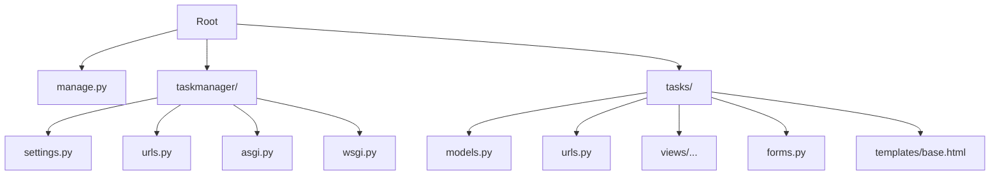
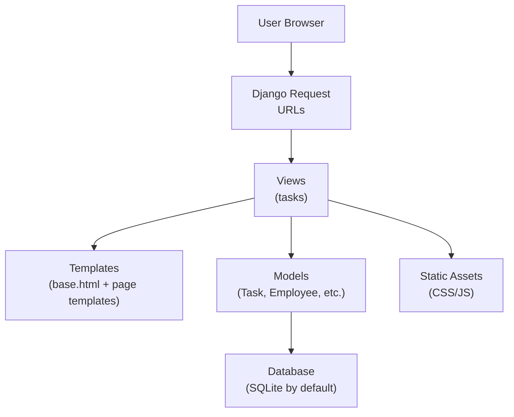
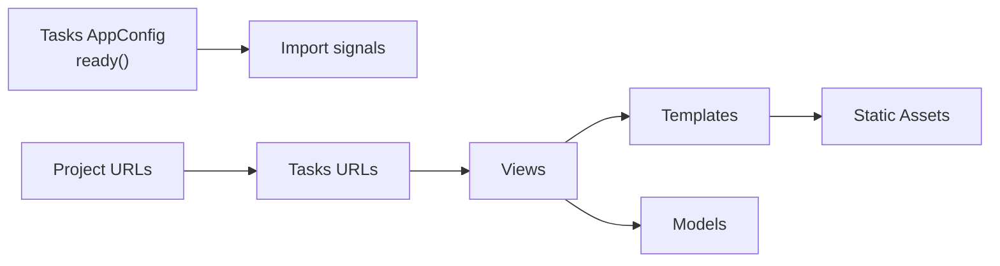

# Getting Started

<cite>
**Referenced Files in This Document**
- [manage.py](file://manage.py)
- [settings.py](file://taskmanager/settings.py)
- [urls.py](file://taskmanager/urls.py)
- [urls.py](file://tasks/urls.py)
- [base.html](file://tasks/templates/base.html)
- [models.py](file://tasks/models.py)
- [admin.py](file://tasks/admin.py)
- [apps.py](file://tasks/apps.py)
- [task_views.py](file://tasks/views/task_views.py)
- [forms.py](file://tasks/forms.py)
- [asgi.py](file://taskmanager/asgi.py)
- [wsgi.py](file://taskmanager/wsgi.py)
</cite>

## Table of Contents
1. [Introduction](#introduction)
2. [Project Structure](#project-structure)
3. [Core Components](#core-components)
4. [Architecture Overview](#architecture-overview)
5. [Detailed Component Analysis](#detailed-component-analysis)
6. [Dependency Analysis](#dependency-analysis)
7. [Performance Considerations](#performance-considerations)
8. [Troubleshooting Guide](#troubleshooting-guide)
9. [Conclusion](#conclusion)
10. [Appendices](#appendices)

## Introduction
This guide helps you install and run the Task Manager application locally. It covers prerequisites, environment setup, database configuration, initial project setup, environment variables, first-time user creation, basic usage, and troubleshooting. The application is built with Django 5.0.3 and uses a SQLite database by default. It provides task management, employee/team views, organizational charts, and research-related workflows.

## Project Structure
The repository follows a standard Django layout:
- Root management script to run Django commands
- Settings, URLs, ASGI/WSGI entry points
- A single Django app named tasks containing models, views, forms, templates, and URLs
- Templates and static assets for the frontend

**Diagram sources**
- [manage.py:1-23](file://manage.py#L1-L23)
- [settings.py:1-288](file://taskmanager/settings.py#L1-L288)
- [urls.py:1-11](file://taskmanager/urls.py#L1-L11)
- [urls.py:1-100](file://tasks/urls.py#L1-L100)
- [base.html:1-118](file://tasks/templates/base.html#L1-L118)
- [models.py:1-858](file://tasks/models.py#L1-L858)
- [forms.py:1-224](file://tasks/forms.py#L1-L224)
- [asgi.py:1-16](file://taskmanager/asgi.py#L1-L16)
- [wsgi.py:1-16](file://taskmanager/wsgi.py#L1-L16)

**Section sources**
- [manage.py:1-23](file://manage.py#L1-L23)
- [settings.py:1-288](file://taskmanager/settings.py#L1-L288)
- [urls.py:1-11](file://taskmanager/urls.py#L1-L11)
- [urls.py:1-100](file://tasks/urls.py#L1-L100)
- [base.html:1-118](file://tasks/templates/base.html#L1-L118)

## Core Components
- Django settings define apps, middleware, templates, static/media, caching, logging, internationalization, authentication redirects, and database via environment variables.
- The tasks app registers models and signals, and defines URL routes for tasks, employees, subtasks, research items, and dashboards.
- The base template provides navigation, Bootstrap integration, and shared UI elements.

Key implementation references:
- Settings and environment variables: [settings.py:17-33](file://taskmanager/settings.py#L17-L33), [settings.py:106-110](file://taskmanager/settings.py#L106-L110)
- Installed apps and middleware: [settings.py:38-61](file://taskmanager/settings.py#L38-L61)
- Template configuration and static/media: [settings.py:66-156](file://taskmanager/settings.py#L66-L156)
- Logging configuration: [settings.py:180-249](file://taskmanager/settings.py#L180-L249)
- Authentication redirects: [settings.py:163-166](file://taskmanager/settings.py#L163-L166)
- Tasks app configuration and signal import: [apps.py:1-8](file://tasks/apps.py#L1-L8)
- Tasks app URLs: [urls.py:38-100](file://tasks/urls.py#L38-L100)
- Base template navigation and assets: [base.html:25-117](file://tasks/templates/base.html#L25-L117)

**Section sources**
- [settings.py:17-33](file://taskmanager/settings.py#L17-L33)
- [settings.py:38-61](file://taskmanager/settings.py#L38-L61)
- [settings.py:66-156](file://taskmanager/settings.py#L66-L156)
- [settings.py:106-110](file://taskmanager/settings.py#L106-L110)
- [settings.py:180-249](file://taskmanager/settings.py#L180-L249)
- [settings.py:163-166](file://taskmanager/settings.py#L163-L166)
- [apps.py:1-8](file://tasks/apps.py#L1-L8)
- [urls.py:38-100](file://tasks/urls.py#L38-L100)
- [base.html:25-117](file://tasks/templates/base.html#L25-L117)

## Architecture Overview
The application uses Django’s request-response cycle with a single tasks app. URLs route to views that render templates and interact with models. Authentication is handled by Django’s contrib.auth, with login/logout endpoints wired in the project-level URLs.

**Diagram sources**
- [urls.py:6-11](file://taskmanager/urls.py#L6-L11)
- [urls.py:38-100](file://tasks/urls.py#L38-L100)
- [base.html:1-118](file://tasks/templates/base.html#L1-L118)
- [models.py:165-238](file://tasks/models.py#L165-L238)

**Section sources**
- [urls.py:6-11](file://taskmanager/urls.py#L6-L11)
- [urls.py:38-100](file://tasks/urls.py#L38-L100)
- [base.html:1-118](file://tasks/templates/base.html#L1-L118)
- [models.py:165-238](file://tasks/models.py#L165-L238)

## Detailed Component Analysis

### Prerequisites
- Python 3.8 or newer
- Django 5.0.3
- Additional dependencies are configured via environment variables and optional packages referenced in settings (e.g., database URL parsing and optional compression)

Environment variables used by the project:
- SECRET_KEY
- DEBUG
- ALLOWED_HOSTS
- DATABASE_URL
- CACHE_BACKEND
- CACHE_LOCATION

These are loaded from a .env file and applied in settings.

**Section sources**
- [settings.py:17-33](file://taskmanager/settings.py#L17-L33)
- [settings.py:104-110](file://taskmanager/settings.py#L104-L110)

### Step-by-Step Installation

1) Create and activate a virtual environment
- Use your preferred method to create a Python 3.8+ virtual environment and activate it.

2) Install dependencies
- Install Django 5.0.3 and other runtime dependencies. The project relies on environment variables for configuration and optional packages referenced in settings.

3) Set up environment variables
- Create a .env file at the project root with the following keys:
  - SECRET_KEY
  - DEBUG
  - ALLOWED_HOSTS
  - DATABASE_URL
  - CACHE_BACKEND
  - CACHE_LOCATION
- Example values:
  - SECRET_KEY: your-secret-key-here
  - DEBUG: True
  - ALLOWED_HOSTS: localhost,127.0.0.1
  - DATABASE_URL: sqlite:///db.sqlite3 (default)
  - CACHE_BACKEND: django.core.cache.backends.locmem.LocMemCache
  - CACHE_LOCATION: unique-snowflake

4) Initialize the database
- Run migrations to create tables:
  - python manage.py makemigrations
  - python manage.py migrate

5) Collect static files
- Prepare static assets:
  - python manage.py collectstatic

6) Create a superuser (optional)
- python manage.py createsuperuser

7) Start the development server
- python manage.py runserver

Access the app at http://127.0.0.1:8000

**Section sources**
- [settings.py:17-33](file://taskmanager/settings.py#L17-L33)
- [settings.py:104-110](file://taskmanager/settings.py#L104-L110)
- [manage.py:1-23](file://manage.py#L1-L23)

### Environment Variable Configuration
- SECRET_KEY: Used for cryptographic signing. Keep it secret.
- DEBUG: Controls Django debug mode.
- ALLOWED_HOSTS: Comma-separated hostnames/IPs allowed to serve the site.
- DATABASE_URL: Configures the default database using dj_database_url. Defaults to SQLite if unset.
- CACHE_BACKEND and CACHE_LOCATION: Configure Django cache backend and location.

These are loaded at startup and applied in settings.

**Section sources**
- [settings.py:17-33](file://taskmanager/settings.py#L17-L33)
- [settings.py:104-110](file://taskmanager/settings.py#L104-L110)
- [settings.py:85-98](file://taskmanager/settings.py#L85-L98)

### Database Initialization
- The project defaults to SQLite when DATABASE_URL is not set.
- To use another database, set DATABASE_URL accordingly.
- Apply migrations after changing settings.

```mermaid
flowchart TD
Start(["Start"]) --> CheckEnv["Check DATABASE_URL"]
CheckEnv --> IsSet{"Is DATABASE_URL set?"}
IsSet --> |Yes| UseEnv["Use dj_database_url.config()"]
IsSet --> |No| UseDefault["Use sqlite:///{BASE_DIR}/db.sqlite3"]
UseEnv --> Migrate["Run migrations"]
UseDefault --> Migrate
Migrate --> Done(["Ready"])
```

**Diagram sources**
- [settings.py:104-110](file://taskmanager/settings.py#L104-L110)

**Section sources**
- [settings.py:104-110](file://taskmanager/settings.py#L104-L110)

### First-Time User Setup
- Create a superuser account:
  - python manage.py createsuperuser
- Access the admin at /admin/ to manage data if needed.
- Navigate to the main pages via the top navigation bar.

Note: Login/logout URLs are defined in the project-level URLs.

**Section sources**
- [manage.py:1-23](file://manage.py#L1-L23)
- [urls.py:6-11](file://taskmanager/urls.py#L6-L11)
- [base.html:66-88](file://tasks/templates/base.html#L66-L88)

### Basic Usage Examples
- View tasks: Visit the home page or /tasks/.
- Create a task: Use the “Create task” form. You can optionally upload a DOCX to import research stages.
- Assign employees: Select from the active employee list during task creation/edit.
- View organization chart: Use the “Structure” menu item.
- Team dashboard: Use the “Team dashboard” menu item.

References:
- Task list view and filtering/sorting: [task_views.py:19-69](file://tasks/views/task_views.py#L19-L69)
- Task creation with optional import: [task_views.py:78-179](file://tasks/views/task_views.py#L78-L179)
- Forms for tasks and imports: [forms.py:5-44](file://tasks/forms.py#L5-L44), [forms.py:164-200](file://tasks/forms.py#L164-L200)
- Navigation and links: [base.html:27-92](file://tasks/templates/base.html#L27-L92)

**Section sources**
- [task_views.py:19-69](file://tasks/views/task_views.py#L19-L69)
- [task_views.py:78-179](file://tasks/views/task_views.py#L78-L179)
- [forms.py:5-44](file://tasks/forms.py#L5-L44)
- [forms.py:164-200](file://tasks/forms.py#L164-L200)
- [base.html:27-92](file://tasks/templates/base.html#L27-L92)

## Dependency Analysis
- The tasks app registers models and imports signals on startup.
- The project-level URLs include admin, login/logout, and routes to the tasks app.
- The base template loads Bootstrap and local static assets.

**Diagram sources**
- [apps.py:7-8](file://tasks/apps.py#L7-L8)
- [urls.py:6-11](file://taskmanager/urls.py#L6-L11)
- [urls.py:38-100](file://tasks/urls.py#L38-L100)
- [base.html:10-24](file://tasks/templates/base.html#L10-L24)

**Section sources**
- [apps.py:7-8](file://tasks/apps.py#L7-L8)
- [urls.py:6-11](file://taskmanager/urls.py#L6-L11)
- [urls.py:38-100](file://tasks/urls.py#L38-L100)
- [base.html:10-24](file://tasks/templates/base.html#L10-L24)

## Performance Considerations
- Caching is configurable via environment variables. The default settings disable caching in development.
- Static files are collected and served via staticfiles; ensure collectstatic is run after adding new assets.
- Logging is configured to write to rotating files and console; adjust levels as needed.

[No sources needed since this section provides general guidance]

## Troubleshooting Guide
Common issues and resolutions:
- Django not found or import error
  - Ensure the virtual environment is activated and Django is installed.
  - Reference: [manage.py:10-17](file://manage.py#L10-L17)
- Database connection errors
  - Verify DATABASE_URL format and connectivity.
  - Reference: [settings.py:104-110](file://taskmanager/settings.py#L104-L110)
- Static files missing
  - Run collectstatic to gather static assets.
  - Reference: [manage.py:1-23](file://manage.py#L1-L23)
- Admin permissions
  - Create a superuser to access /admin/.
  - Reference: [manage.py:1-23](file://manage.py#L1-L23)
- Cache-related warnings
  - Confirm CACHE_BACKEND and CACHE_LOCATION values.
  - Reference: [settings.py:85-98](file://taskmanager/settings.py#L85-L98)

**Section sources**
- [manage.py:10-17](file://manage.py#L10-L17)
- [settings.py:104-110](file://taskmanager/settings.py#L104-L110)
- [manage.py:1-23](file://manage.py#L1-L23)
- [settings.py:85-98](file://taskmanager/settings.py#L85-L98)

## Conclusion
You now have the essentials to install, configure, and run the Task Manager application. Use the provided environment variables, initialize the database, and explore the UI via the navigation bar. For advanced customization, adjust settings and environment variables as needed.

[No sources needed since this section summarizes without analyzing specific files]

## Appendices

### A. Environment Variables Reference
- SECRET_KEY: Django secret key
- DEBUG: Enable/disable debug mode
- ALLOWED_HOSTS: Hosts allowed to serve the app
- DATABASE_URL: Database URL (defaults to SQLite)
- CACHE_BACKEND: Cache backend class
- CACHE_LOCATION: Cache location identifier

**Section sources**
- [settings.py:17-33](file://taskmanager/settings.py#L17-L33)
- [settings.py:104-110](file://taskmanager/settings.py#L104-L110)
- [settings.py:85-98](file://taskmanager/settings.py#L85-L98)

### B. Entry Points and WSGI/ASGI
- WSGI entry point: [wsgi.py:1-16](file://taskmanager/wsgi.py#L1-L16)
- ASGI entry point: [asgi.py:1-16](file://taskmanager/asgi.py#L1-L16)
- Management script: [manage.py:1-23](file://manage.py#L1-L23)

**Section sources**
- [wsgi.py:1-16](file://taskmanager/wsgi.py#L1-L16)
- [asgi.py:1-16](file://taskmanager/asgi.py#L1-L16)
- [manage.py:1-23](file://manage.py#L1-L23)