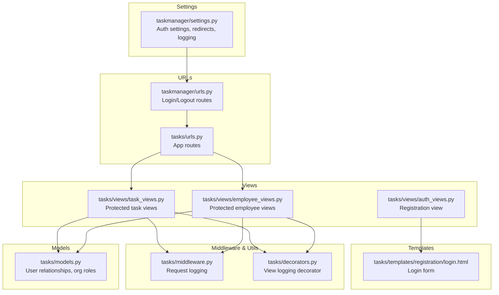
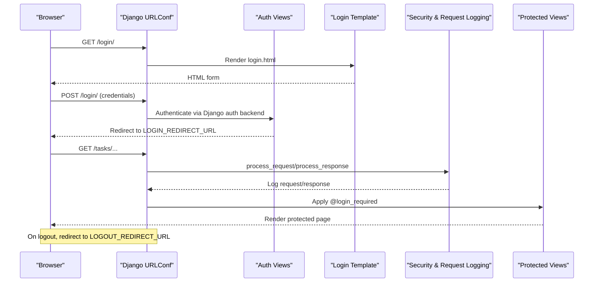
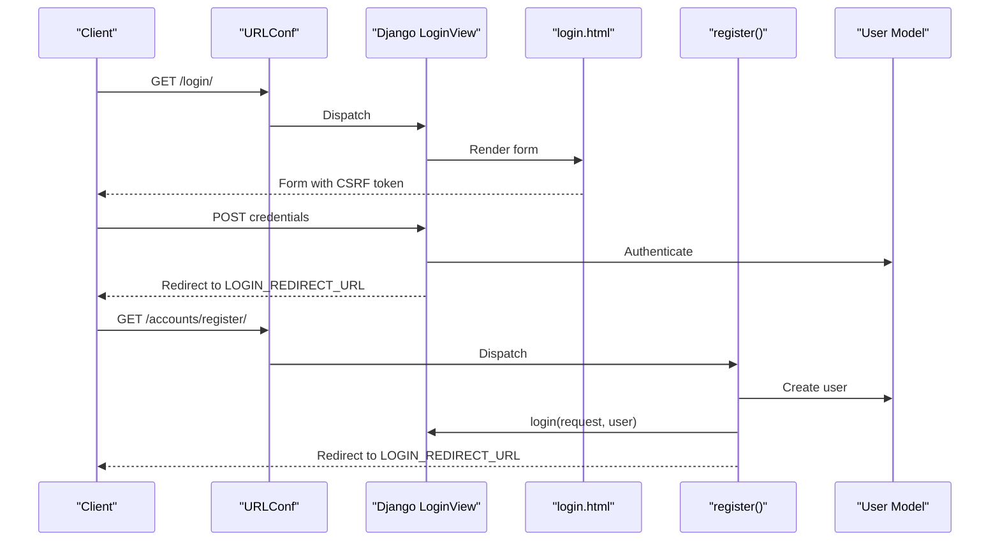
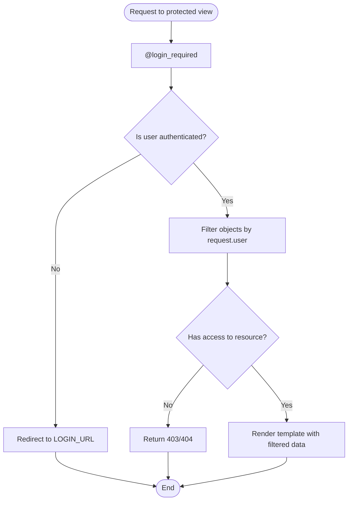
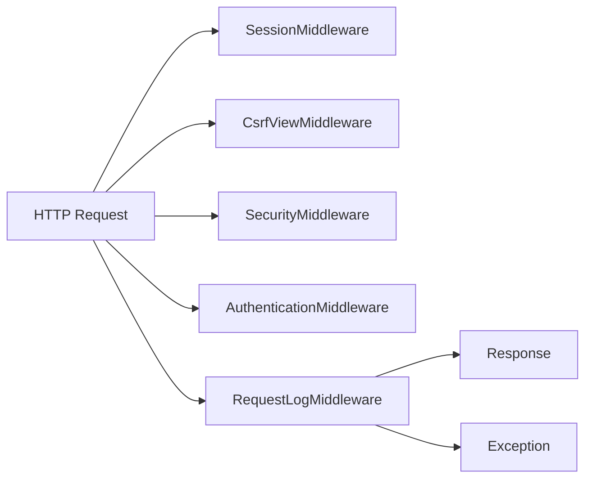
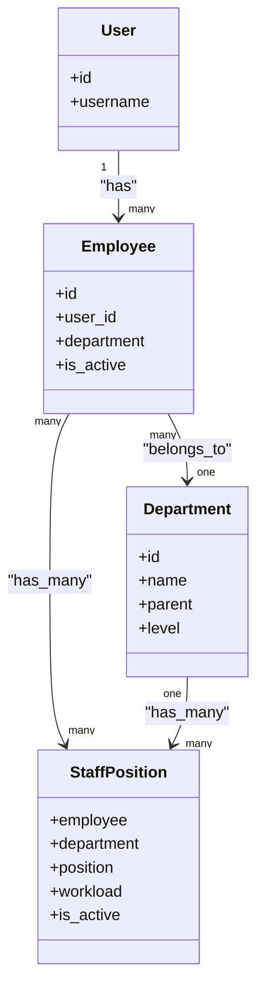
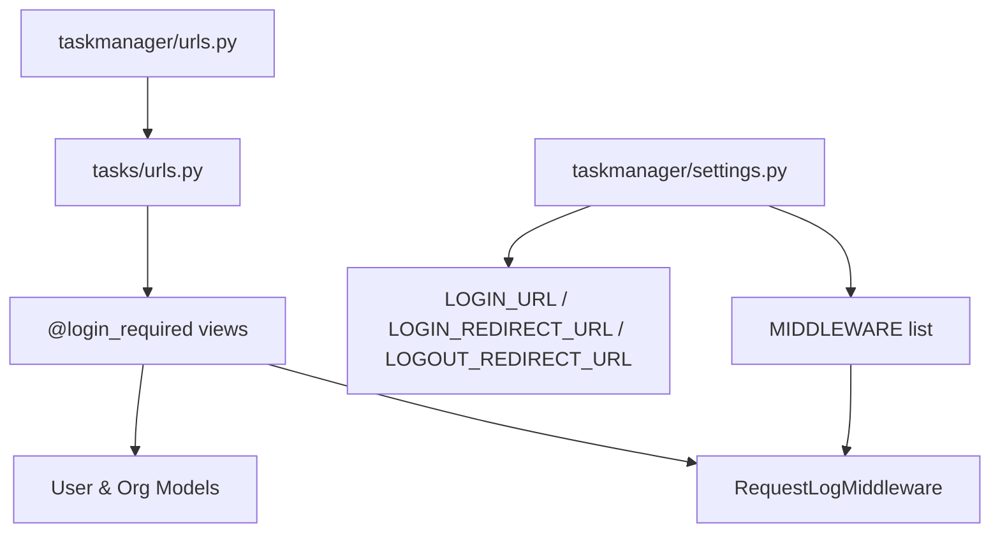

# Authentication and Authorization

<cite>
**Referenced Files in This Document**
- [settings.py](file://taskmanager/settings.py)
- [urls.py](file://taskmanager/urls.py)
- [urls.py](file://tasks/urls.py)
- [auth_views.py](file://tasks/views/auth_views.py)
- [login.html](file://tasks/templates/registration/login.html)
- [middleware.py](file://tasks/middleware.py)
- [decorators.py](file://tasks/decorators.py)
- [task_views.py](file://tasks/views/task_views.py)
- [employee_views.py](file://tasks/views/employee_views.py)
- [models.py](file://tasks/models.py)
- [admin.py](file://tasks/admin.py)
</cite>

## Table of Contents
1. [Introduction](#introduction)
2. [Project Structure](#project-structure)
3. [Core Components](#core-components)
4. [Architecture Overview](#architecture-overview)
5. [Detailed Component Analysis](#detailed-component-analysis)
6. [Dependency Analysis](#dependency-analysis)
7. [Performance Considerations](#performance-considerations)
8. [Troubleshooting Guide](#troubleshooting-guide)
9. [Conclusion](#conclusion)

## Introduction
This document explains the authentication and authorization systems in the project. It covers login/logout flows, session management, authentication backends, security middleware, and view-level protection. It also documents how user sessions are enforced, how access control is applied at the view level, and how to extend the system with custom permissions and roles. Practical examples are provided via file references to guide implementation.

## Project Structure
The authentication system spans several layers:
- Settings define authentication backends, password validators, and redirects.
- URL routing exposes login and logout views and includes the app’s URL patterns.
- Views enforce authentication via decorators and protect resources.
- Templates provide the login UI.
- Middleware logs requests and exceptions for security visibility.
- Models support user-centric relationships and organizational roles.

**Diagram sources**
- [settings.py](file://taskmanager/settings.py)
- [urls.py](file://taskmanager/urls.py)
- [urls.py](file://tasks/urls.py)
- [auth_views.py](file://tasks/views/auth_views.py)
- [login.html](file://tasks/templates/registration/login.html)
- [middleware.py](file://tasks/middleware.py)
- [decorators.py](file://tasks/decorators.py)
- [task_views.py](file://tasks/views/task_views.py)
- [employee_views.py](file://tasks/views/employee_views.py)
- [models.py](file://tasks/models.py)

**Section sources**
- [settings.py](file://taskmanager/settings.py)
- [urls.py](file://taskmanager/urls.py)
- [urls.py](file://tasks/urls.py)

## Core Components
- Authentication settings and redirects:
  - Login URL, login redirect, and logout redirect are configured centrally.
  - Password validators are enabled for strong credentials.
- Built-in login/logout:
  - Login and logout are handled by Django’s generic views with a custom template for login.
- View-level protection:
  - Views use the built-in login-required decorator to enforce authentication.
- Session and security middleware:
  - Session middleware, CSRF, security middleware, and a custom request logger capture traffic and errors.
- Registration flow:
  - A dedicated registration view creates a user and logs them in automatically.

**Section sources**
- [settings.py](file://taskmanager/settings.py)
- [urls.py](file://taskmanager/urls.py)
- [auth_views.py](file://tasks/views/auth_views.py)
- [login.html](file://tasks/templates/registration/login.html)
- [middleware.py](file://tasks/middleware.py)
- [task_views.py](file://tasks/views/task_views.py)
- [employee_views.py](file://tasks/views/employee_views.py)

## Architecture Overview
The authentication pipeline integrates Django’s contrib.auth with project-specific views and templates. Requests are logged and exceptions captured for auditing. Protected views restrict access to authenticated users.

**Diagram sources**
- [urls.py](file://taskmanager/urls.py)
- [auth_views.py](file://tasks/views/auth_views.py)
- [login.html](file://tasks/templates/registration/login.html)
- [middleware.py](file://tasks/middleware.py)
- [task_views.py](file://tasks/views/task_views.py)

## Detailed Component Analysis

### Login and Logout Flow
- Login:
  - URL routing maps to Django’s LoginView with a custom template.
  - The template renders a CSRF-protected form and displays authentication errors.
- Logout:
  - URL routing maps to Django’s LogoutView.
- Registration:
  - A custom view handles user creation and automatic login.

**Diagram sources**
- [urls.py](file://taskmanager/urls.py)
- [login.html](file://tasks/templates/registration/login.html)
- [auth_views.py](file://tasks/views/auth_views.py)

**Section sources**
- [urls.py](file://taskmanager/urls.py)
- [login.html](file://tasks/templates/registration/login.html)
- [auth_views.py](file://tasks/views/auth_views.py)

### View-Level Protection and Access Control Patterns
- Decorator-based enforcement:
  - Many views apply the login-required decorator to ensure only authenticated users can access them.
  - Examples include task listing, detail, creation, updates, and employee views.
- Per-view filtering:
  - Views filter data by the authenticated user to enforce ownership and access boundaries.
- Organization-aware access:
  - Views leverage related models (employees, departments, positions) to scope data access.

**Diagram sources**
- [task_views.py](file://tasks/views/task_views.py)
- [employee_views.py](file://tasks/views/employee_views.py)

**Section sources**
- [task_views.py](file://tasks/views/task_views.py)
- [employee_views.py](file://tasks/views/employee_views.py)

### Session Management and Security Middleware
- Middleware stack:
  - Session middleware manages sessions.
  - CSRF middleware protects against cross-site request forgery.
  - Security middleware adds security headers.
  - A custom request logger captures request/response metadata and errors.
- Logging:
  - Requests are logged with method, path, user identity, and response codes.
  - Errors and exceptions are captured for diagnostics.

**Diagram sources**
- [settings.py](file://taskmanager/settings.py)
- [middleware.py](file://tasks/middleware.py)

**Section sources**
- [settings.py](file://taskmanager/settings.py)
- [middleware.py](file://tasks/middleware.py)

### Role-Based Access Control and Permissions
- Built-in groups and permissions:
  - Django’s contrib.auth supports groups and model-level permissions out of the box.
- Organizational roles:
  - The project models include employees, departments, positions, and staff positions, enabling role-based scoping in views and templates.
- Implementation pattern:
  - Views filter by the authenticated user and related organizational entities to limit access to relevant data.
  - Administrative actions clear caches when organizational structures change to maintain consistency.

**Diagram sources**
- [models.py](file://tasks/models.py)

**Section sources**
- [models.py](file://tasks/models.py)
- [admin.py](file://tasks/admin.py)

### Custom Permissions and Permission Checking Mechanisms
- Recommended approach:
  - Define model-level permissions in the app’s models or use Django’s built-in add/change/delete permissions.
  - Add a custom decorator to check permissions alongside @login_required for fine-grained control.
  - Alternatively, override get_object_or_404 in views to verify user-object relationships before rendering.
- Example pattern:
  - Combine @login_required with per-object checks using request.user and related fields to ensure only authorized users modify or view resources.

[No sources needed since this section provides general guidance]

### Protecting Views and Managing Roles
- Protecting views:
  - Apply @login_required to all user-facing views.
  - For sensitive operations, combine with custom permission checks or per-object ownership checks.
- Managing roles:
  - Use the Employee and StaffPosition models to represent roles and assignments.
  - Views can filter lists and forms by active employees and organizational hierarchy.

**Section sources**
- [task_views.py](file://tasks/views/task_views.py)
- [employee_views.py](file://tasks/views/employee_views.py)
- [models.py](file://tasks/models.py)

### Authentication Backends and Security Best Practices
- Backends:
  - The project relies on Django’s default ModelBackend for authentication.
- Best practices:
  - Keep SECRET_KEY secret and environment-controlled.
  - Enforce HTTPS in production and configure security middleware appropriately.
  - Use strong password validators and rotate secrets regularly.
  - Avoid storing sensitive data in templates or logs; sanitize logs as configured.

**Section sources**
- [settings.py](file://taskmanager/settings.py)

## Dependency Analysis
Authentication and authorization depend on:
- Settings for middleware order and redirects.
- URL routing to expose login/logout and include app routes.
- Views decorated with @login_required and scoped to the authenticated user.
- Middleware for logging and security.
- Models for user relationships and organizational roles.

**Diagram sources**
- [settings.py](file://taskmanager/settings.py)
- [urls.py](file://taskmanager/urls.py)
- [urls.py](file://tasks/urls.py)
- [task_views.py](file://tasks/views/task_views.py)
- [models.py](file://tasks/models.py)
- [middleware.py](file://tasks/middleware.py)

**Section sources**
- [settings.py](file://taskmanager/settings.py)
- [urls.py](file://taskmanager/urls.py)
- [urls.py](file://tasks/urls.py)
- [task_views.py](file://tasks/views/task_views.py)
- [models.py](file://tasks/models.py)
- [middleware.py](file://tasks/middleware.py)

## Performance Considerations
- Minimize database queries in protected views by selecting related fields and using prefetch/annotate where appropriate.
- Use pagination for large lists to reduce payload sizes.
- Keep logging levels tuned for production to avoid excessive I/O.

[No sources needed since this section provides general guidance]

## Troubleshooting Guide
- Users redirected to login unexpectedly:
  - Ensure @login_required is applied to protected views and that sessions are active.
- Login failures:
  - Verify the login template includes CSRF token and that credentials are valid.
- Excessive logging:
  - Adjust logging levels and handlers in settings for production environments.
- Exceptions during requests:
  - Inspect the request logger output for error traces and status codes.

**Section sources**
- [middleware.py](file://tasks/middleware.py)
- [login.html](file://tasks/templates/registration/login.html)
- [settings.py](file://taskmanager/settings.py)

## Conclusion
The project implements a straightforward, robust authentication and authorization setup using Django’s built-in components. Login/logout are handled by generic views with a custom template, views are protected via decorators, and middleware ensures logging and security. The models support organizational roles and ownership scoping. Extending the system with custom permissions and RBAC follows Django’s proven patterns, and the provided references offer concrete implementation points.