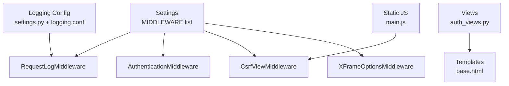
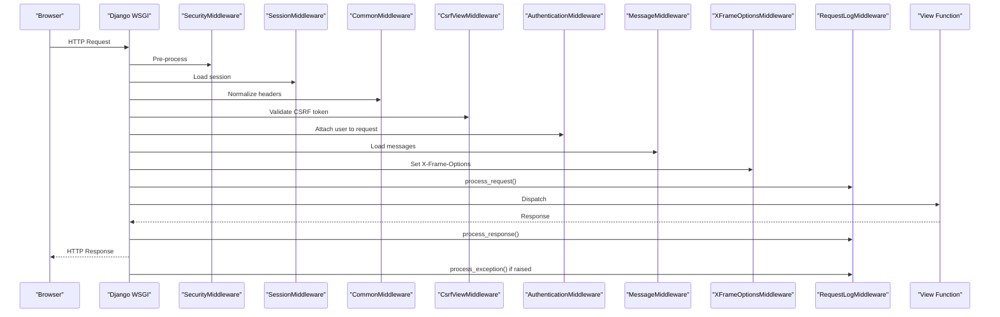
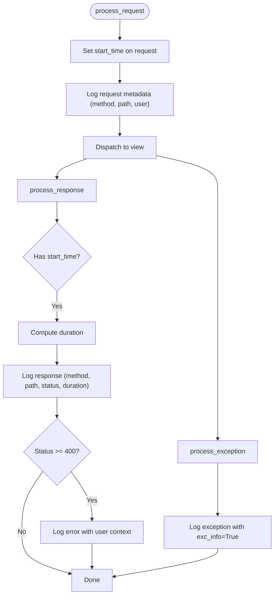
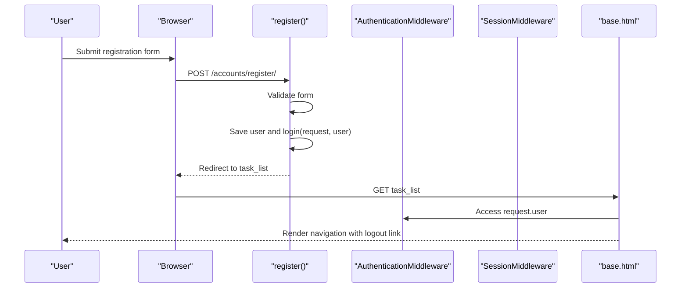
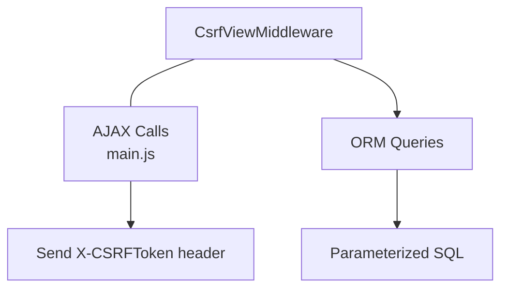
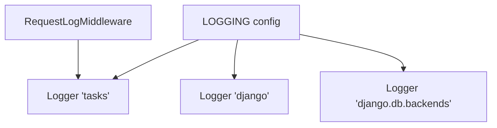
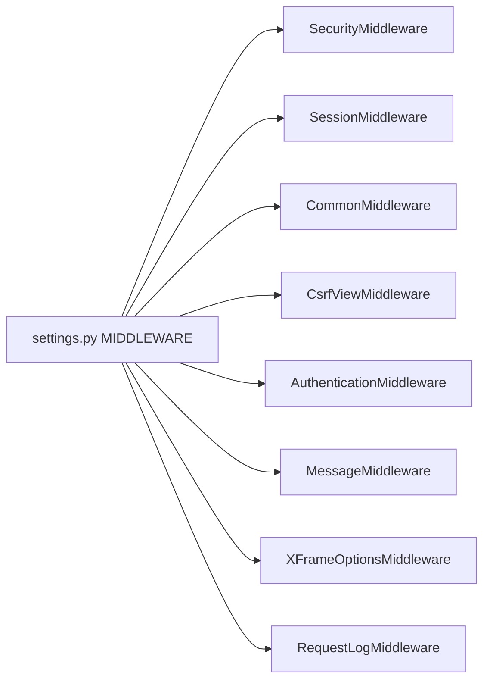

# Middleware and Security

<cite>
**Referenced Files in This Document**
- [middleware.py](file://tasks/middleware.py)
- [decorators.py](file://tasks/decorators.py)
- [settings.py](file://taskmanager/settings.py)
- [auth_views.py](file://tasks/views/auth_views.py)
- [urls.py](file://tasks/urls.py)
- [base.html](file://tasks/templates/base.html)
- [main.js](file://static/js/main.js)
- [logging.conf](file://taskmanager/logging.conf)
- [models.py](file://tasks/models.py)
</cite>

## Table of Contents
1. [Introduction](#introduction)
2. [Project Structure](#project-structure)
3. [Core Components](#core-components)
4. [Architecture Overview](#architecture-overview)
5. [Detailed Component Analysis](#detailed-component-analysis)
6. [Dependency Analysis](#dependency-analysis)
7. [Performance Considerations](#performance-considerations)
8. [Troubleshooting Guide](#troubleshooting-guide)
9. [Conclusion](#conclusion)
10. [Appendices](#appendices)

## Introduction
This document focuses on the Middleware and Security components of the Task Manager application. It explains the custom RequestLogMiddleware for request tracking and performance monitoring, authentication and session management, user authorization, and security middleware such as CSRF protection, XSS prevention, and SQL injection mitigation. It also documents decorator usage for permission checking, login requirements, and access control, along with security best practices, threat modeling, vulnerability assessment, audit logging, activity tracking, compliance considerations, secure configuration, environment variable management, and production hardening.

## Project Structure
Security and middleware concerns span several modules:
- Middleware stack and custom middleware are configured in settings and implemented in tasks/middleware.py.
- Authentication views and templates integrate with Django’s auth middleware and sessions.
- Logging configuration centralizes audit trails and error tracking.
- Frontend JavaScript enforces CSRF token handling for AJAX requests.
- Decorators provide lightweight view-level timing and error logging.

**Diagram sources**
- [settings.py:49-61](file://taskmanager/settings.py#L49-L61)
- [middleware.py:9-43](file://tasks/middleware.py#L9-L43)
- [auth_views.py:9-21](file://tasks/views/auth_views.py#L9-L21)
- [base.html:27-88](file://tasks/templates/base.html#L27-L88)
- [main.js:108-147](file://static/js/main.js#L108-L147)
- [logging.conf:1-30](file://taskmanager/logging.conf#L1-L30)

**Section sources**
- [settings.py:49-61](file://taskmanager/settings.py#L49-L61)
- [middleware.py:9-43](file://tasks/middleware.py#L9-L43)
- [auth_views.py:9-21](file://tasks/views/auth_views.py#L9-L21)
- [base.html:27-88](file://tasks/templates/base.html#L27-L88)
- [main.js:108-147](file://static/js/main.js#L108-L147)
- [logging.conf:1-30](file://taskmanager/logging.conf#L1-L30)

## Core Components
- RequestLogMiddleware: Logs incoming requests, response durations, and errors; captures exceptions for observability and incident response.
- Authentication and Session Management: Uses Django’s built-in auth middleware and session middleware; registration view integrates with Django’s User model and messages framework.
- Security Middleware: Includes Django’s SecurityMiddleware, CSRF protection, and clickjacking/X-Frame-Options protection.
- View-Level Decorators: Provides a lightweight timing and error logging decorator for view functions.
- Logging and Audit: Centralized logging configuration with rotating file handlers and dedicated loggers for tasks and database backend queries.

**Section sources**
- [middleware.py:9-43](file://tasks/middleware.py#L9-L43)
- [auth_views.py:9-21](file://tasks/views/auth_views.py#L9-L21)
- [settings.py:49-61](file://taskmanager/settings.py#L49-L61)
- [decorators.py:8-21](file://tasks/decorators.py#L8-L21)
- [settings.py:180-249](file://taskmanager/settings.py#L180-L249)
- [logging.conf:1-30](file://taskmanager/logging.conf#L1-L30)

## Architecture Overview
The security architecture leverages Django’s middleware chain plus a custom request logger. Requests traverse middleware in order, with authentication and session middleware preceding custom middleware. CSRF protection is enforced via Django’s CSRF middleware and frontend JavaScript ensures AJAX requests include the CSRF token.

**Diagram sources**
- [settings.py:49-61](file://taskmanager/settings.py#L49-L61)
- [middleware.py:12-42](file://tasks/middleware.py#L12-L42)
- [auth_views.py:9-21](file://tasks/views/auth_views.py#L9-L21)

## Detailed Component Analysis

### RequestLogMiddleware
Purpose:
- Track request lifecycle with timing and status codes.
- Log anonymized user context for non-authenticated users.
- Capture 4xx/5xx responses and unhandled exceptions for auditing and alerting.

Key behaviors:
- Records request start time in process_request().
- Computes duration and logs response metadata in process_response().
- Emits error logs for non-2xx responses.
- Logs unhandled exceptions via process_exception().

**Diagram sources**
- [middleware.py:12-42](file://tasks/middleware.py#L12-L42)

**Section sources**
- [middleware.py:9-43](file://tasks/middleware.py#L9-L43)

### Authentication, Sessions, and Authorization
- Authentication middleware attaches the user object to every request.
- Session middleware manages session storage.
- Registration view uses Django’s UserCreationForm and login() to authenticate newly registered users.
- Templates conditionally render login/logout links based on user.is_authenticated.
- URLs define the registration endpoint.

**Diagram sources**
- [auth_views.py:9-21](file://tasks/views/auth_views.py#L9-L21)
- [base.html:66-88](file://tasks/templates/base.html#L66-L88)
- [urls.py:38-100](file://tasks/urls.py#L38-L100)

**Section sources**
- [auth_views.py:9-21](file://tasks/views/auth_views.py#L9-L21)
- [base.html:66-88](file://tasks/templates/base.html#L66-L88)
- [urls.py:38-100](file://tasks/urls.py#L38-L100)

### Security Middleware: CSRF, XSS, Clickjacking
- CSRF protection: Enabled via CsrfViewMiddleware; frontend JavaScript sends the CSRF token header for AJAX requests.
- XSS prevention: Django’s template context processors and strict X-Frame-Options via XFrameOptionsMiddleware.
- SQL injection mitigation: Reliance on Django ORM and parameterized queries prevents raw SQL injection; avoid manual SQL unless absolutely necessary.

**Diagram sources**
- [settings.py:49-61](file://taskmanager/settings.py#L49-L61)
- [main.js:108-147](file://static/js/main.js#L108-L147)

**Section sources**
- [settings.py:49-61](file://taskmanager/settings.py#L49-L61)
- [main.js:108-147](file://static/js/main.js#L108-L147)

### Decorator Usage: Permission Checking, Login Requirements, Access Control
- The provided log_view decorator measures view execution time and logs exceptions, aiding operational visibility and incident triage.
- For explicit login requirements, apply Django’s @login_required decorator at the view level or via URL configuration.
- For permission-based access control, use Django’s permission checks or custom decorators around views.

Note: The repository does not include a dedicated permission decorator; implement custom decorators or rely on Django’s built-in decorators and mixins for granular access control.

**Section sources**
- [decorators.py:8-21](file://tasks/decorators.py#L8-L21)

### Audit Logging, Activity Tracking, and Compliance
- Centralized logging configuration defines rotating file handlers for console, general logs, error logs, and a dedicated tasks logger.
- RequestLogMiddleware augments audit logs with request/response metrics and exceptions.
- Database query logging is configured to capture errors separately for forensic analysis.

**Diagram sources**
- [settings.py:180-249](file://taskmanager/settings.py#L180-L249)
- [middleware.py:9-43](file://tasks/middleware.py#L9-L43)
- [logging.conf:1-30](file://taskmanager/logging.conf#L1-L30)

**Section sources**
- [settings.py:180-249](file://taskmanager/settings.py#L180-L249)
- [middleware.py:9-43](file://tasks/middleware.py#L9-L43)
- [logging.conf:1-30](file://taskmanager/logging.conf#L1-L30)

## Dependency Analysis
- Middleware stack order determines request processing sequence and security posture.
- RequestLogMiddleware depends on Django’s middleware mixin and logging infrastructure.
- Authentication and session middleware are foundational for user authorization and CSRF enforcement.
- Template rendering depends on request.user availability from AuthenticationMiddleware.

**Diagram sources**
- [settings.py:49-61](file://taskmanager/settings.py#L49-L61)

**Section sources**
- [settings.py:49-61](file://taskmanager/settings.py#L49-L61)

## Performance Considerations
- RequestLogMiddleware introduces minimal overhead by recording timestamps and logging at request/response boundaries.
- Consider sampling or structured logging in high-throughput environments to reduce I/O overhead.
- Keep CSRF and session middleware enabled; disabling them weakens security without measurable performance gains.

[No sources needed since this section provides general guidance]

## Troubleshooting Guide
- CSRF failures: Ensure AJAX requests send the X-CSRFToken header and that the CSRF cookie is present.
- Authentication issues: Verify AuthenticationMiddleware and SessionMiddleware are enabled and that user sessions are persisted.
- Excessive logging: Adjust LOGGING levels and handlers to balance observability and disk usage.
- Unhandled exceptions: Review RequestLogMiddleware’s process_exception output and dedicated error log files.

**Section sources**
- [main.js:108-147](file://static/js/main.js#L108-L147)
- [settings.py:49-61](file://taskmanager/settings.py#L49-L61)
- [settings.py:180-249](file://taskmanager/settings.py#L180-L249)
- [middleware.py:37-42](file://tasks/middleware.py#L37-L42)

## Conclusion
The Task Manager employs Django’s robust middleware stack complemented by a custom RequestLogMiddleware for request tracking and performance monitoring. Authentication and session management are handled by Django’s built-in components, while CSRF protection, XSS safeguards, and clickjacking controls are enforced through dedicated middleware. Logging is centralized with rotating file handlers and dedicated loggers for audit and forensics. For production, maintain strict middleware ordering, enforce CSRF for all state-changing requests, and apply appropriate decorators for login and permission checks.

[No sources needed since this section summarizes without analyzing specific files]

## Appendices

### Security Best Practices
- Enforce HTTPS in production and configure Django’s SecurityMiddleware appropriately.
- Rotate SECRET_KEY regularly and store it in environment variables.
- Limit ALLOWED_HOSTS to trusted domains.
- Use strong password validators and enforce policy via AUTH_PASSWORD_VALIDATORS.
- Sanitize user inputs and rely on Django ORM to prevent SQL injection.
- Apply rate limiting and consider adding throttling for sensitive endpoints.
- Regularly review and prune unused middleware and apps.

[No sources needed since this section provides general guidance]

### Threat Modeling and Vulnerability Assessment
- CSRF: Mitigated by CsrfViewMiddleware and frontend token inclusion for AJAX.
- XSS: Mitigated by Django’s automatic escaping in templates and X-Frame-Options.
- SQL Injection: Mitigated by ORM usage; avoid raw SQL unless unavoidable.
- Session Hijacking: Mitigated by secure session middleware and HTTPS.
- Information Disclosure: Mitigate by disabling DEBUG in production and controlling log levels.

[No sources needed since this section provides general guidance]

### Secure Configuration and Environment Variables
- Store SECRET_KEY, DATABASE_URL, DEBUG, and ALLOWED_HOSTS in environment variables.
- Load environment variables using python-dotenv in settings.py.
- Restrict file permissions on log directories and database files.
- Use separate credentials for local and production databases.

**Section sources**
- [settings.py:17-34](file://taskmanager/settings.py#L17-L34)
- [settings.py:106-110](file://taskmanager/settings.py#L106-L110)

### Production Hardening Checklist
- Disable DEBUG and set ALLOWED_HOSTS.
- Configure HTTPS and security headers.
- Enable database error logging and monitor error logs.
- Review middleware order and remove unnecessary middleware.
- Implement rate limiting and monitoring for suspicious activity.
- Back up logs securely and retain them per compliance requirements.

[No sources needed since this section provides general guidance]