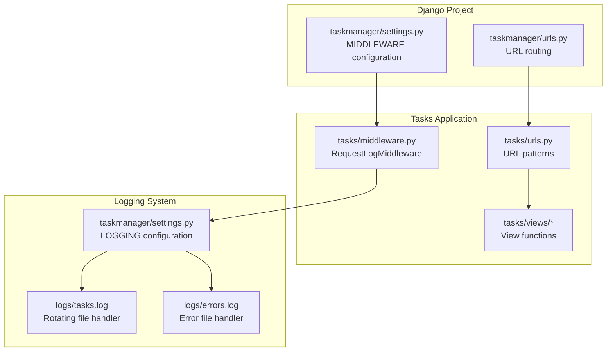
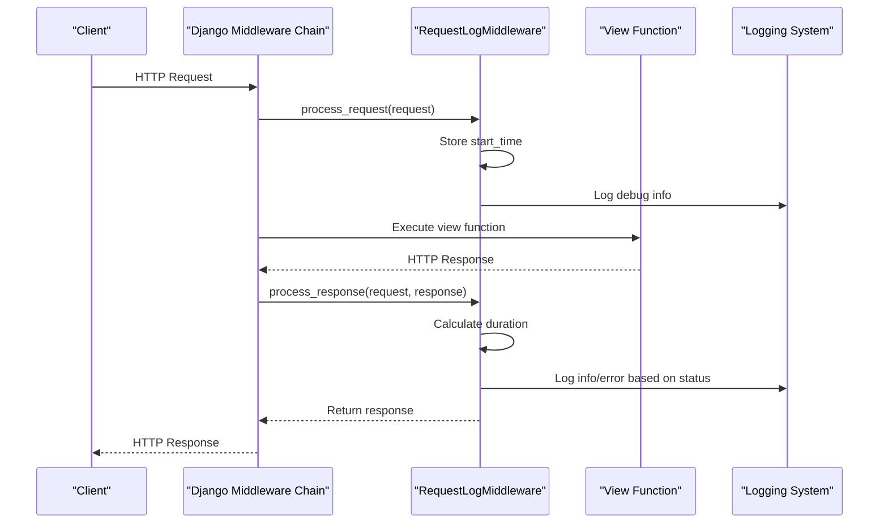
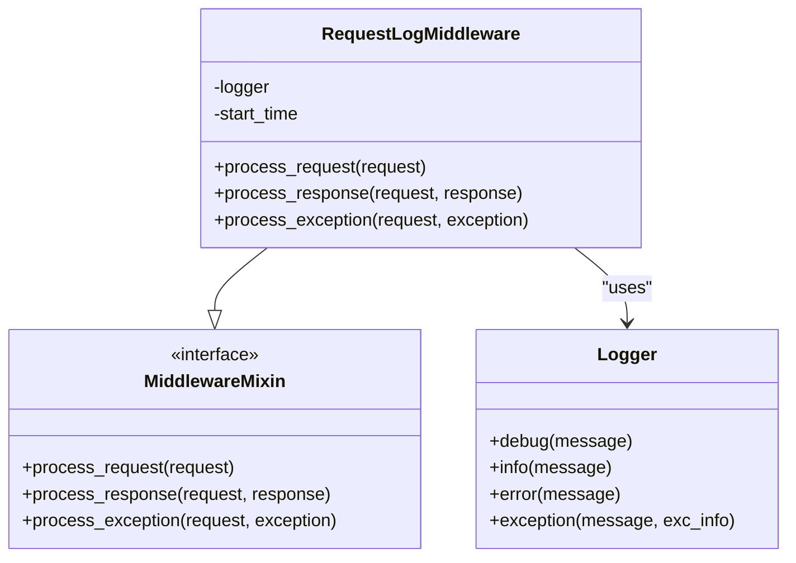
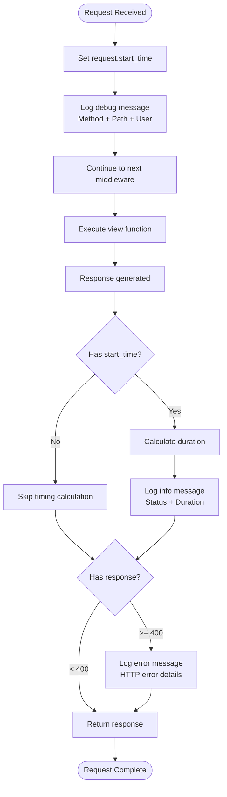
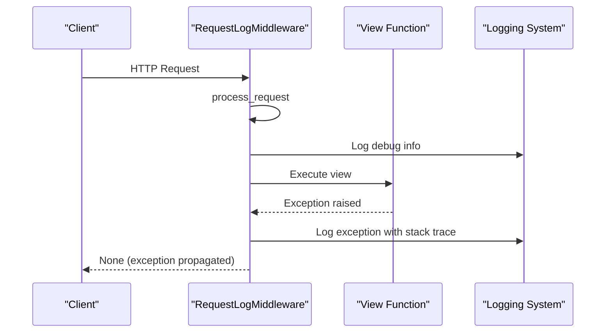
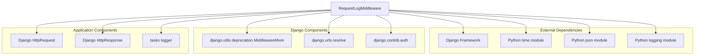

# Request Logging Middleware

<cite>
**Referenced Files in This Document**
- [middleware.py](file://tasks/middleware.py)
- [settings.py](file://taskmanager/settings.py)
- [urls.py](file://tasks/urls.py)
- [urls.py](file://taskmanager/urls.py)
- [logging.conf](file://logging.conf)
</cite>

## Table of Contents
1. [Introduction](#introduction)
2. [Project Structure](#project-structure)
3. [Core Components](#core-components)
4. [Architecture Overview](#architecture-overview)
5. [Detailed Component Analysis](#detailed-component-analysis)
6. [Dependency Analysis](#dependency-analysis)
7. [Performance Considerations](#performance-considerations)
8. [Troubleshooting Guide](#troubleshooting-guide)
9. [Conclusion](#conclusion)

## Introduction
This document provides comprehensive documentation for the RequestLogMiddleware implementation in the task manager project. The middleware is designed to capture and log HTTP request lifecycle events, including request processing, response handling, and exception scenarios. It implements timing mechanisms for performance monitoring, structured logging with multiple severity levels, and integrates seamlessly with Django's middleware pipeline.

The middleware operates at the global level, intercepting all incoming requests and outgoing responses to provide observability into application behavior. It captures request metadata, measures processing duration, monitors response status codes, and logs exceptions with detailed context.

## Project Structure
The RequestLogMiddleware is part of the tasks application and is configured within the Django project's middleware stack. The middleware integrates with the project's logging configuration to route logs to console and file handlers.

**Diagram sources**
- [settings.py:49-61](file://taskmanager/settings.py#L49-L61)
- [middleware.py:9-43](file://tasks/middleware.py#L9-L43)
- [urls.py:1-100](file://tasks/urls.py#L1-L100)
- [urls.py:1-11](file://taskmanager/urls.py#L1-L11)

**Section sources**
- [settings.py:49-61](file://taskmanager/settings.py#L49-L61)
- [middleware.py:1-43](file://tasks/middleware.py#L1-L43)

## Core Components
The RequestLogMiddleware consists of three primary lifecycle methods that handle different phases of request processing:

### Request Processing Lifecycle
The middleware implements Django's MiddlewareMixin interface with three key methods:
- `process_request`: Captures request start time and initial metadata
- `process_response`: Calculates duration and logs response information
- `process_exception`: Handles uncaught exceptions during request processing

### Timing Mechanisms
The middleware uses Python's time module to measure request duration with high precision. It stores the start timestamp on the request object and calculates elapsed time during response processing.

### Logging Strategy
The middleware employs structured logging with three severity levels:
- Debug level: Basic request information including method, path, and user context
- Info level: Response details including status codes and processing duration
- Error level: HTTP error responses (4xx and 5xx status codes) with user context

**Section sources**
- [middleware.py:9-43](file://tasks/middleware.py#L9-L43)

## Architecture Overview
The RequestLogMiddleware participates in Django's middleware chain, executing before and after view processing. The middleware integrates with the project's logging configuration to provide comprehensive request observability.

**Diagram sources**
- [middleware.py:12-35](file://tasks/middleware.py#L12-L35)
- [settings.py:49-61](file://taskmanager/settings.py#L49-L61)

## Detailed Component Analysis

### RequestLogMiddleware Class Structure
The middleware class inherits from Django's MiddlewareMixin and implements the standard request processing lifecycle methods.

**Diagram sources**
- [middleware.py:9-43](file://tasks/middleware.py#L9-L43)

### Request Processing Flow
The middleware captures request metadata during the initial processing phase, storing timing information for later calculation.

**Diagram sources**
- [middleware.py:12-35](file://tasks/middleware.py#L12-L35)

### Exception Handling Mechanism
The middleware provides comprehensive exception logging with full stack trace information when unhandled exceptions occur.

**Diagram sources**
- [middleware.py:37-43](file://tasks/middleware.py#L37-L43)

**Section sources**
- [middleware.py:9-43](file://tasks/middleware.py#L9-L43)

## Dependency Analysis
The RequestLogMiddleware has specific dependencies on Django's middleware framework and Python's standard library components.

**Diagram sources**
- [middleware.py:1-7](file://tasks/middleware.py#L1-L7)

### Integration Points
The middleware integrates with multiple Django components and follows established patterns for request processing:

- **Middleware Chain Integration**: Registered in the MIDDLEWARE setting with proper ordering
- **Request Object Enhancement**: Adds timing attributes to the request object
- **Response Processing**: Intercepts response objects to calculate and log metrics
- **Exception Propagation**: Maintains Django's exception handling behavior

**Section sources**
- [settings.py:49-61](file://taskmanager/settings.py#L49-L61)
- [middleware.py:1-7](file://tasks/middleware.py#L1-L7)

## Performance Considerations
The middleware is designed with minimal performance impact through several optimization strategies:

### Timing Precision
- Uses high-resolution time measurements for accurate duration calculations
- Stores timing data on the request object to avoid repeated time calls
- Performs timing calculations only when request timing data is available

### Memory Efficiency
- Creates minimal temporary objects during request processing
- Uses lightweight string concatenation for log messages
- Avoids heavy data structures or caching mechanisms

### Logging Overhead
- Implements selective logging based on request characteristics
- Uses efficient string formatting with f-strings
- Leverages Django's logging infrastructure for optimal performance

### Scalability Factors
- Stateless middleware design allows concurrent request processing
- Minimal shared state reduces contention in multi-threaded environments
- Efficient log formatting minimizes I/O overhead

## Troubleshooting Guide

### Common Issues and Solutions

#### Middleware Not Executing
**Symptoms**: No request logs appearing in the console or files
**Causes**: 
- Middleware not properly registered in settings
- Incorrect import path in MIDDLEWARE configuration
- Middleware order conflicts with other middleware

**Solutions**:
- Verify middleware registration in taskmanager/settings.py
- Ensure correct import path: 'tasks.middleware.RequestLogMiddleware'
- Check middleware order in the MIDDLEWARE list

#### Missing Response Logs
**Symptoms**: Request logs appear but response logs are missing
**Causes**:
- Early middleware exceptions preventing response processing
- Redirect responses that bypass normal response processing
- Asynchronous view functions with custom response handling

**Solutions**:
- Check for exceptions in earlier middleware components
- Verify response status codes are being set appropriately
- Review custom response handling in view functions

#### Performance Impact
**Symptoms**: Application performance degradation with middleware enabled
**Causes**:
- Excessive logging volume in production environments
- Heavy log formatting operations
- File I/O bottlenecks with rotating file handlers

**Solutions**:
- Adjust logging levels in production settings
- Consider reducing log verbosity for high-traffic endpoints
- Monitor file system performance and adjust rotation parameters

#### Log Formatting Issues
**Symptoms**: Malformed or incomplete log entries
**Causes**:
- Unicode encoding problems with special characters
- Missing user context in anonymous requests
- Special characters in URL paths causing formatting errors

**Solutions**:
- Verify UTF-8 encoding support in logging handlers
- Handle None values in user context gracefully
- Escape special characters in log messages

**Section sources**
- [settings.py:180-249](file://taskmanager/settings.py#L180-L249)
- [middleware.py:12-43](file://tasks/middleware.py#L12-L43)

## Conclusion
The RequestLogMiddleware provides comprehensive request observability for the task manager application through its three-phase lifecycle implementation. The middleware effectively captures request metadata, measures processing performance, monitors response status codes, and handles exceptions with detailed context information.

Key strengths of the implementation include:
- **Minimal Performance Impact**: Lightweight timing and logging operations
- **Comprehensive Coverage**: Full request lifecycle monitoring
- **Structured Logging**: Multi-level logging with appropriate severity
- **Integration Compatibility**: Seamless integration with Django's middleware ecosystem
- **Production Ready**: Configurable logging levels and file rotation

The middleware serves as an essential tool for application monitoring, debugging, and performance analysis while maintaining low operational overhead. Its design follows Django best practices and provides a solid foundation for application observability.