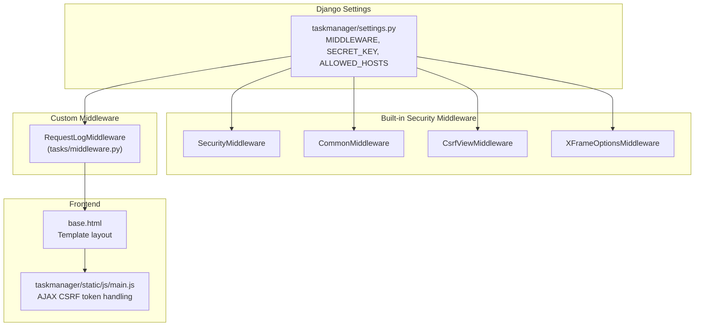
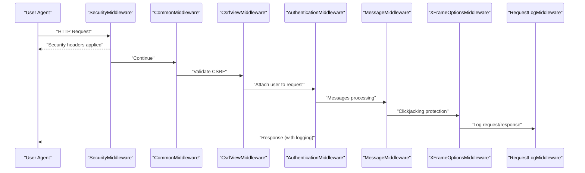
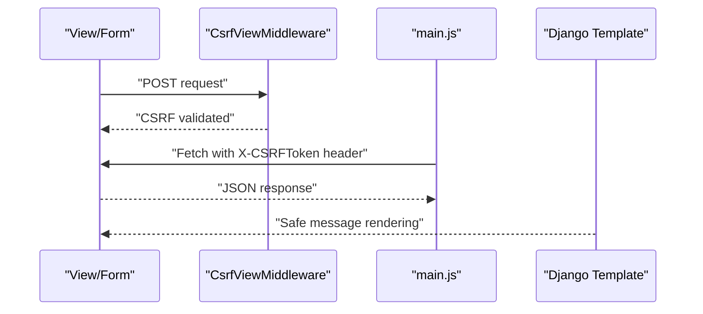
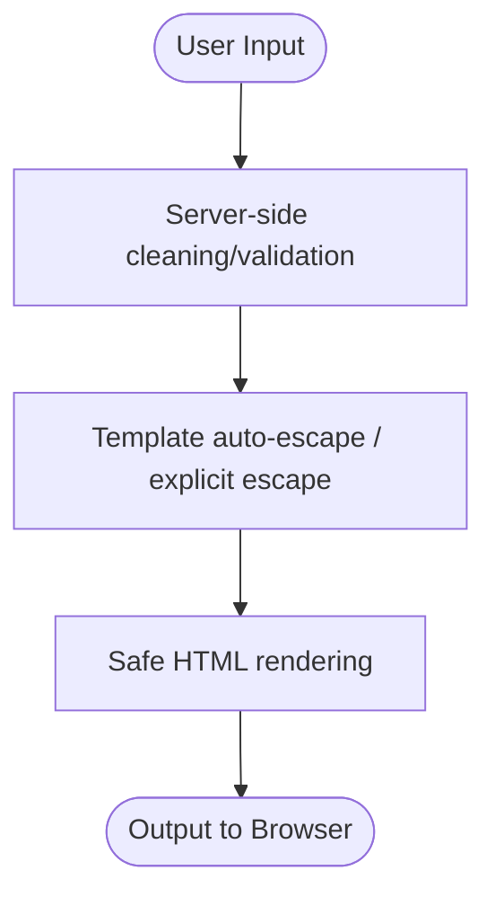
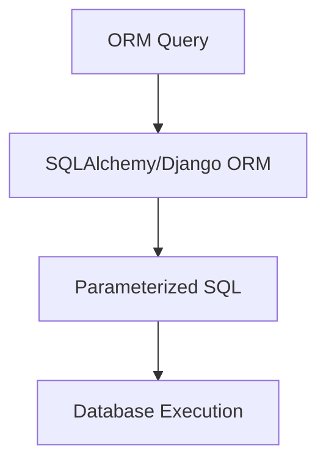
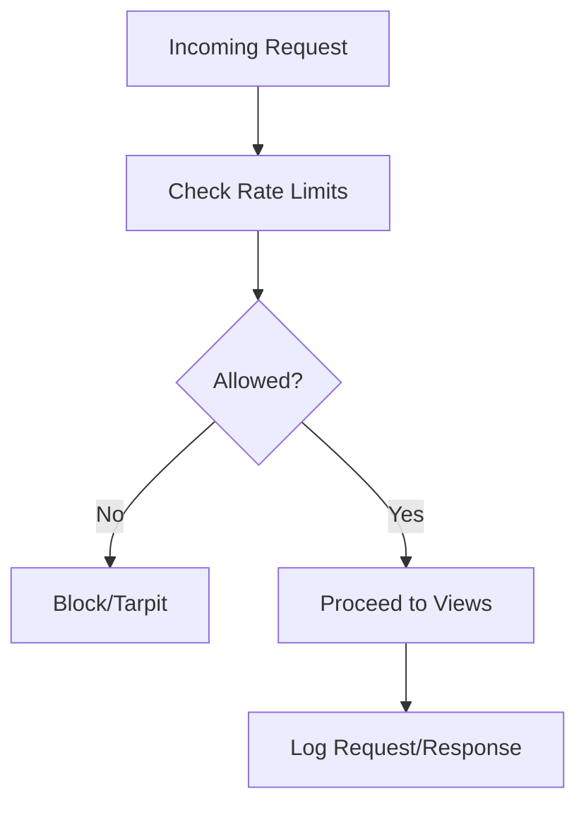
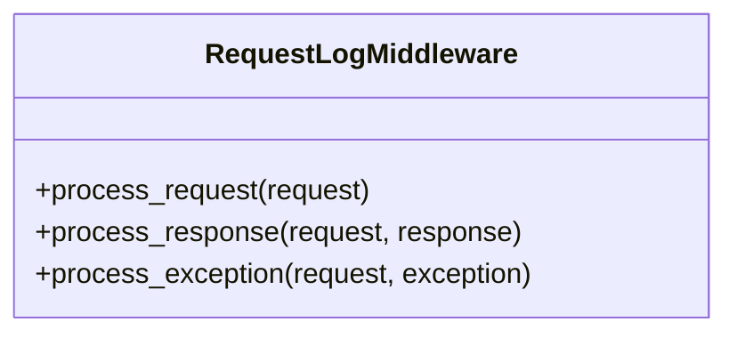
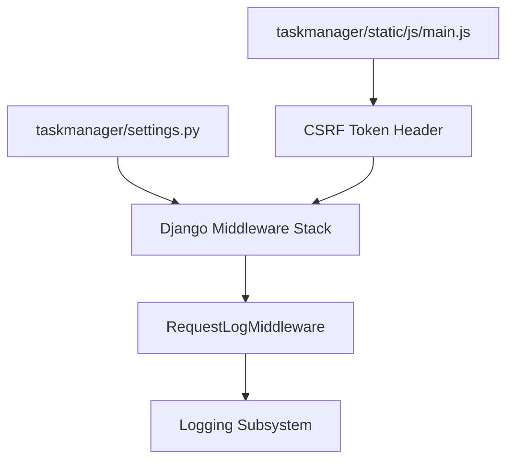

# Security Middleware

<cite>
**Referenced Files in This Document**
- [settings.py](file://taskmanager/settings.py)
- [middleware.py](file://tasks/middleware.py)
- [main.js](file://taskmanager/static/js/main.js)
- [base.html](file://tasks/templates/base.html)
- [auth_views.py](file://tasks/views/auth_views.py)
- [forms.py](file://tasks/forms.py)
- [wsgi.py](file://taskmanager/wsgi.py)
- [asgi.py](file://taskmanager/asgi.py)
</cite>

## Table of Contents
1. [Introduction](#introduction)
2. [Project Structure](#project-structure)
3. [Core Components](#core-components)
4. [Architecture Overview](#architecture-overview)
5. [Detailed Component Analysis](#detailed-component-analysis)
6. [Dependency Analysis](#dependency-analysis)
7. [Performance Considerations](#performance-considerations)
8. [Troubleshooting Guide](#troubleshooting-guide)
9. [Conclusion](#conclusion)
10. [Appendices](#appendices)

## Introduction
This document explains the security middleware implementations in the project, focusing on CSRF protection, XSS prevention, SQL injection mitigation, security headers, content security policy, secure cookie settings, rate limiting, brute force protection, suspicious activity detection, middleware ordering, custom security implementations, and integration with Django’s security framework. It also provides production hardening guidance, vulnerability assessment tips, and compliance considerations.

## Project Structure
Security-related configuration and middleware are primarily defined in the Django settings module and implemented via Django’s built-in middleware stack plus a custom request logging middleware. Frontend security is handled through CSRF token inclusion in AJAX requests and safe rendering of user messages.

**Diagram sources**
- [settings.py:49-61](file://taskmanager/settings.py#L49-L61)
- [middleware.py:9-43](file://tasks/middleware.py#L9-L43)
- [base.html:1-118](file://tasks/templates/base.html#L1-L118)
- [main.js:108-147](file://taskmanager/static/js/main.js#L108-L147)

**Section sources**
- [settings.py:49-61](file://taskmanager/settings.py#L49-L61)
- [middleware.py:9-43](file://tasks/middleware.py#L9-L43)
- [base.html:1-118](file://tasks/templates/base.html#L1-L118)
- [main.js:108-147](file://taskmanager/static/js/main.js#L108-L147)

## Core Components
- CSRF Protection: Enabled via Django’s CsrfViewMiddleware and enforced in frontend AJAX requests using the X-CSRFToken header.
- XSS Prevention: Django’s automatic escaping in templates and explicit HTML escaping in JavaScript-rendered content.
- SQL Injection Mitigation: Django ORM usage prevents raw SQL queries in the examined code; database configuration uses environment variables.
- Security Headers: SecurityMiddleware applies HSTS-like protections; CSP can be extended via Django’s SECURE_* settings.
- Secure Cookies: Session cookie settings are managed by Django defaults; can be hardened via SECURE_* settings.
- Rate Limiting and Brute Force: Not implemented in code; can be added via third-party packages or custom middleware.
- Suspicious Activity Detection: Implemented via custom RequestLogMiddleware for audit trails.
- Middleware Ordering: Security middleware is placed early in the chain to protect all downstream processing.

**Section sources**
- [settings.py:49-61](file://taskmanager/settings.py#L49-L61)
- [auth_views.py:9-21](file://tasks/views/auth_views.py#L9-L21)
- [forms.py:32-44](file://tasks/forms.py#L32-L44)
- [middleware.py:9-43](file://tasks/middleware.py#L9-L43)
- [main.js:108-147](file://taskmanager/static/js/main.js#L108-L147)

## Architecture Overview
The security architecture leverages Django’s middleware pipeline for transport and request-level protections, augmented by a custom logging middleware for operational visibility.

**Diagram sources**
- [settings.py:49-61](file://taskmanager/settings.py#L49-L61)
- [middleware.py:9-43](file://tasks/middleware.py#L9-L43)

## Detailed Component Analysis

### CSRF Protection
- Middleware: CsrfViewMiddleware validates incoming requests for CSRF tokens.
- Frontend: AJAX requests include the X-CSRFToken header retrieved from the csrftoken cookie.
- Template: Messages are rendered safely by Django’s template engine.

**Diagram sources**
- [settings.py:55](file://taskmanager/settings.py#L55)
- [main.js:108-147](file://taskmanager/static/js/main.js#L108-L147)
- [base.html:95-102](file://tasks/templates/base.html#L95-L102)

**Section sources**
- [settings.py:55](file://taskmanager/settings.py#L55)
- [main.js:108-147](file://taskmanager/static/js/main.js#L108-L147)
- [base.html:95-102](file://tasks/templates/base.html#L95-L102)

### XSS Prevention
- Django auto-escaping in templates prevents accidental script execution.
- Explicit HTML escaping is used when rendering dynamic content in JavaScript-generated HTML.
- Forms enforce server-side validation and clean data before processing.

**Diagram sources**
- [forms.py:32-44](file://tasks/forms.py#L32-L44)
- [base.html:95-102](file://tasks/templates/base.html#L95-L102)

**Section sources**
- [forms.py:32-44](file://tasks/forms.py#L32-L44)
- [base.html:95-102](file://tasks/templates/base.html#L95-L102)

### SQL Injection Mitigation
- The codebase relies on Django ORM for all database operations, avoiding raw SQL queries.
- Database URLs are configured via environment variables, reducing risk of exposure in code.

**Diagram sources**
- [settings.py:106-110](file://taskmanager/settings.py#L106-L110)

**Section sources**
- [settings.py:106-110](file://taskmanager/settings.py#L106-L110)

### Security Headers and Content Security Policy
- SecurityMiddleware applies security-related headers. Extend via Django’s SECURE_* settings for HSTS, XSS protection, and frame options.
- Content Security Policy can be configured centrally; current templates do not define CSP meta tags.

Recommendations:
- Add SECURE_HSTS_SECONDS, SECURE_HSTS_INCLUDE_SUBDOMAINS, SECURE_HSTS_PRELOAD.
- Set SECURE_CONTENT_TYPE_NOSNIFF and SECURE_BROWSER_XSS_FILTER.
- Configure SESSION_COOKIE_SECURE and SESSION_COOKIE_HTTPONLY for secure cookies.

**Section sources**
- [settings.py:51](file://taskmanager/settings.py#L51)

### Secure Cookie Settings
- Session cookies are handled by Django’s session middleware. Harden by enabling SECURE_SESSION_COOKIE and SAME_SITE policies via Django settings.
- Ensure HTTPS termination at the reverse proxy/load balancer when deploying behind TLS.

**Section sources**
- [settings.py:52](file://taskmanager/settings.py#L52)

### Rate Limiting, Brute Force Protection, and Suspicious Activity Detection
- Not implemented in the current codebase.
- Recommended approaches:
  - Use django-ratelimit or custom middleware to throttle login attempts.
  - Integrate with fail2ban or cloud WAF for network-level blocking.
  - Enrich RequestLogMiddleware to detect anomalies (IP frequency, unusual routes, error spikes).

[No sources needed since this diagram shows conceptual workflow, not actual code structure]

**Section sources**
- [middleware.py:9-43](file://tasks/middleware.py#L9-L43)

### Security Middleware Ordering
Correct order ensures early protection:
1. GZipMiddleware
2. SecurityMiddleware
3. SessionMiddleware
4. CommonMiddleware
5. CsrfViewMiddleware
6. AuthenticationMiddleware
7. MessageMiddleware
8. XFrameOptionsMiddleware
9. Custom RequestLogMiddleware

```mermaid
graph LR
GM["GZipMiddleware"] --> SEM["SecurityMiddleware"]
SEM --> SM["SessionMiddleware"]
SM --> CM["CommonMiddleware"]
CM --> CSM["CsrfViewMiddleware"]
CSM --> AM["AuthenticationMiddleware"]
AM --> MM["MessageMiddleware"]
MM --> XFO["XFrameOptionsMiddleware"]
XFO --> RLM["RequestLogMiddleware"]
```

**Diagram sources**
- [settings.py:49-61](file://taskmanager/settings.py#L49-L61)

**Section sources**
- [settings.py:49-61](file://taskmanager/settings.py#L49-L61)

### Custom Security Implementations
- RequestLogMiddleware logs requests, durations, and errors for auditability and incident response.
- Can be extended to capture IP reputation, user agent, and anomaly metrics.

**Diagram sources**
- [middleware.py:9-43](file://tasks/middleware.py#L9-L43)

**Section sources**
- [middleware.py:9-43](file://tasks/middleware.py#L9-L43)

### Integration with Django’s Security Framework
- Authentication and authorization rely on Django’s contrib.auth and login decorators.
- Password validators are enabled to enforce strong passwords.
- Login/logout redirects are configured centrally.

**Section sources**
- [auth_views.py:9-21](file://tasks/views/auth_views.py#L9-L21)
- [settings.py:116-129](file://taskmanager/settings.py#L116-L129)
- [settings.py:164-166](file://taskmanager/settings.py#L164-L166)

## Dependency Analysis
- Settings module defines middleware stack and environment-driven configuration.
- Custom middleware depends on Django’s MiddlewareMixin and logging infrastructure.
- Frontend depends on CSRF cookie availability and consistent header usage.

**Diagram sources**
- [settings.py:49-61](file://taskmanager/settings.py#L49-L61)
- [middleware.py:9-43](file://tasks/middleware.py#L9-L43)
- [main.js:108-147](file://taskmanager/static/js/main.js#L108-L147)

**Section sources**
- [settings.py:49-61](file://taskmanager/settings.py#L49-L61)
- [middleware.py:9-43](file://tasks/middleware.py#L9-L43)
- [main.js:108-147](file://taskmanager/static/js/main.js#L108-L147)

## Performance Considerations
- Keep GZipMiddleware early to reduce payload sizes before other middleware.
- Avoid excessive logging in production; tune log levels and handlers.
- Use database connection pooling and avoid N+1 queries to minimize latency.

[No sources needed since this section provides general guidance]

## Troubleshooting Guide
- CSRF failures: Verify X-CSRFToken header presence in AJAX requests and cookie availability.
- 4xx/5xx errors: Inspect RequestLogMiddleware logs for patterns and exceptions.
- Authentication loops: Confirm LOGIN_URL, LOGIN_REDIRECT_URL, and logout redirects.

**Section sources**
- [middleware.py:18-42](file://tasks/middleware.py#L18-L42)
- [settings.py:164-166](file://taskmanager/settings.py#L164-L166)

## Conclusion
The project employs Django’s robust security middleware stack with a custom logging layer. CSRF, XSS, and SQL injection are mitigated through standard Django mechanisms. For production, harden headers, cookies, and add rate limiting and anomaly detection to meet compliance and resilience goals.

[No sources needed since this section summarizes without analyzing specific files]

## Appendices

### Production Hardening Checklist
- Enable and configure SECURE_* settings for HSTS, XSS, and content type enforcement.
- Set SESSION_COOKIE_SECURE and SESSION_COOKIE_HTTPONLY; configure SameSite.
- Add rate limiting and brute force protection middleware or services.
- Implement centralized CSP via headers or Django’s security middleware.
- Rotate SECRET_KEY regularly and restrict ALLOWED_HOSTS.
- Monitor logs and integrate with SIEM for suspicious activity detection.

[No sources needed since this section provides general guidance]