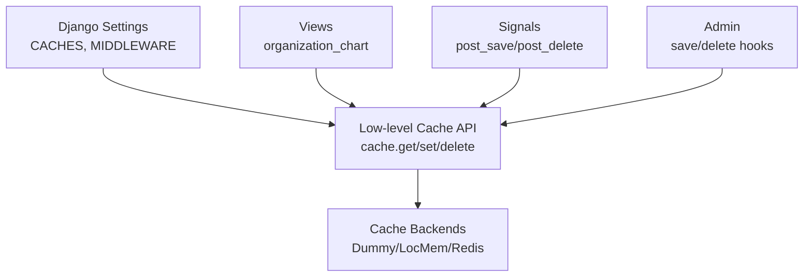
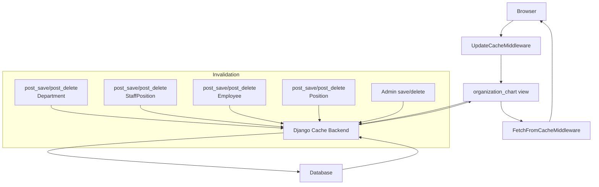
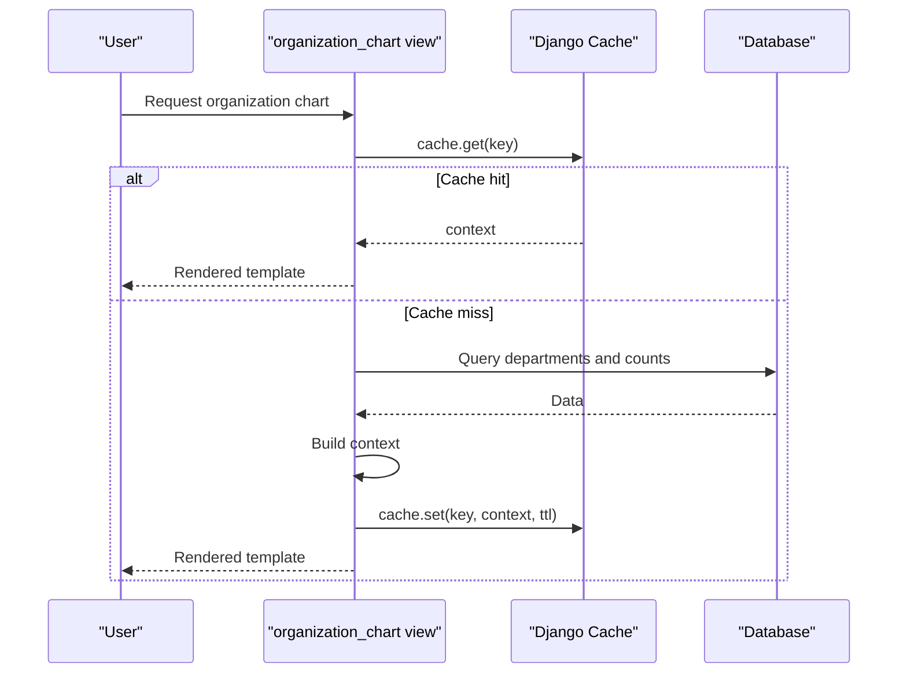
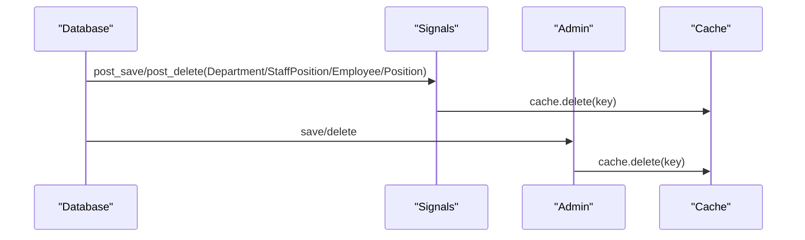
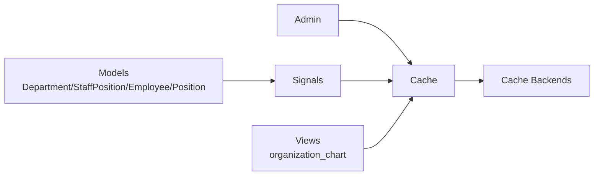

# Caching Strategies

<cite>
**Referenced Files in This Document**
- [settings.py](file://taskmanager/settings.py)
- [dashboard_views.py](file://tasks/views/dashboard_views.py)
- [signals.py](file://tasks/signals.py)
- [admin.py](file://tasks/admin.py)
- [models.py](file://tasks/models.py)
- [urls.py](file://tasks/urls.py)
</cite>

## Table of Contents
1. [Introduction](#introduction)
2. [Project Structure](#project-structure)
3. [Core Components](#core-components)
4. [Architecture Overview](#architecture-overview)
5. [Detailed Component Analysis](#detailed-component-analysis)
6. [Dependency Analysis](#dependency-analysis)
7. [Performance Considerations](#performance-considerations)
8. [Troubleshooting Guide](#troubleshooting-guide)
9. [Conclusion](#conclusion)

## Introduction
This document explains the caching strategies implemented in the project, focusing on Django’s cache framework configuration, cache backends, and practical caching patterns used in the codebase. It covers object caching via the low-level cache API, cache invalidation through signals and admin hooks, and outlines how page-level caching could be enabled. It also provides guidance on Redis integration, cache clustering, distributed caching, performance monitoring, cache warming, and debugging techniques.

## Project Structure
The caching implementation centers around:
- Django cache configuration in settings
- Low-level cache usage in views for object caching
- Cache invalidation via Django signals and admin hooks
- Optional page-level caching middleware (currently disabled)

**Diagram sources**
- [settings.py:85-99](file://taskmanager/settings.py#L85-L99)
- [dashboard_views.py:10-109](file://tasks/views/dashboard_views.py#L10-L109)
- [signals.py:1-32](file://tasks/signals.py#L1-L32)
- [admin.py:1-21](file://tasks/admin.py#L1-L21)

**Section sources**
- [settings.py:85-99](file://taskmanager/settings.py#L85-L99)
- [urls.py:1-100](file://tasks/urls.py#L1-L100)

## Core Components
- Cache configuration: The project defines a default cache backend and disables page-level caching middleware by default. A commented configuration demonstrates how to switch to a real backend (e.g., LocMem or Redis).
- Object caching: The organization chart view uses the low-level cache API to store a computed context for ten minutes under a fixed key.
- Cache invalidation: Signals and admin hooks invalidate the cached organization chart when related models change.
- Page caching: Middleware for page caching is present but disabled; enabling it would require adjusting middleware order and settings.

Key implementation references:
- Cache configuration and middleware toggles: [settings.py:85-99](file://taskmanager/settings.py#L85-L99), [settings.py:49-61](file://taskmanager/settings.py#L49-L61)
- Object caching pattern: [dashboard_views.py:10-109](file://tasks/views/dashboard_views.py#L10-L109)
- Cache invalidation: [signals.py:1-32](file://tasks/signals.py#L1-L32), [admin.py:1-21](file://tasks/admin.py#L1-L21)

**Section sources**
- [settings.py:85-99](file://taskmanager/settings.py#L85-L99)
- [dashboard_views.py:10-109](file://tasks/views/dashboard_views.py#L10-L109)
- [signals.py:1-32](file://tasks/signals.py#L1-L32)
- [admin.py:1-21](file://tasks/admin.py#L1-L21)

## Architecture Overview
The caching architecture combines:
- Low-level cache for expensive view computations
- Event-driven invalidation via signals and admin
- Optional page-level caching middleware

**Diagram sources**
- [settings.py:49-61](file://taskmanager/settings.py#L49-L61)
- [dashboard_views.py:10-109](file://tasks/views/dashboard_views.py#L10-L109)
- [signals.py:1-32](file://tasks/signals.py#L1-L32)
- [admin.py:1-21](file://tasks/admin.py#L1-L21)

## Detailed Component Analysis

### Cache Configuration and Backends
- Default cache backend is set to a dummy cache in production-like environments, effectively disabling caching at runtime.
- A commented configuration shows how to select a real backend (e.g., LocMem) and configure a location.
- Page caching middleware is present in the middleware list but disabled; enabling it requires setting appropriate middleware order and cache timeout.

Recommendations:
- For local development, LocMem can be used for speed and simplicity.
- For production, Redis is recommended for distributed caching and resilience.
- Ensure cache keys are unique per tenant or request scope when multi-tenancy is introduced.

**Section sources**
- [settings.py:85-99](file://taskmanager/settings.py#L85-L99)
- [settings.py:49-61](file://taskmanager/settings.py#L49-L61)

### Object Caching Pattern (Organization Chart)
The organization chart view implements a simple object caching strategy:
- Generates a cache key
- Attempts to fetch the cached context
- Computes and stores the context if missing
- Uses a fixed TTL of ten minutes

**Diagram sources**
- [dashboard_views.py:10-109](file://tasks/views/dashboard_views.py#L10-L109)

**Section sources**
- [dashboard_views.py:10-109](file://tasks/views/dashboard_views.py#L10-L109)

### Cache Invalidation Mechanisms
Cache invalidation is handled through two channels:
- Django signals on model changes
- Admin save/delete hooks

**Diagram sources**
- [signals.py:1-32](file://tasks/signals.py#L1-L32)
- [admin.py:1-21](file://tasks/admin.py#L1-L21)

**Section sources**
- [signals.py:1-32](file://tasks/signals.py#L1-L32)
- [admin.py:1-21](file://tasks/admin.py#L1-L21)

### Page Caching Strategy
Page caching is supported by Django middleware but is currently disabled in the project. To enable:
- Add the cache middleware in the correct order
- Set cache timeout
- Consider vary-on-cookie or user-specific variants if needed

Current middleware configuration indicates page caching is intentionally off.

**Section sources**
- [settings.py:49-61](file://taskmanager/settings.py#L49-L61)

### Fragment Caching Strategy
There is no explicit fragment caching in the codebase. Fragment caching can be implemented using template-level cache tags or by caching partial contexts in the low-level cache and rendering fragments from cached data.

[No sources needed since this section doesn't analyze specific files]

### Cache Key Design Patterns
- Fixed key for organization chart: reuse the same key across requests to share the computed context.
- Consider adding request-scoped suffixes (e.g., user ID) for personalized views.
- Use hierarchical keys for composite data to simplify invalidation.

**Section sources**
- [dashboard_views.py:10-109](file://tasks/views/dashboard_views.py#L10-L109)

### Cache Warming Techniques
- Warm cache during off-peak hours by triggering the view once to populate the cache.
- Pre-compute and store frequently accessed reports or dashboards.

[No sources needed since this section provides general guidance]

### Cache Serialization, Compression, and Memory Optimization
- Serialization: Django cache backends serialize data; ensure stored objects are serializable.
- Compression: Enable compression at the storage backend or web server level if supported.
- Memory optimization: Use shorter TTLs for volatile data, avoid storing large objects, and shard caches by function.

[No sources needed since this section provides general guidance]

### Distributed Caching and Redis Integration
- Replace the dummy backend with a Redis-backed backend for distributed caching.
- Configure connection details and consider clustering for high availability.
- Ensure consistent cache keys across instances.

[No sources needed since this section provides general guidance]

## Dependency Analysis
The caching layer interacts with models, views, signals, and admin. The following diagram shows these relationships:

**Diagram sources**
- [models.py:532-678](file://tasks/models.py#L532-L678)
- [signals.py:1-32](file://tasks/signals.py#L1-L32)
- [admin.py:1-21](file://tasks/admin.py#L1-L21)
- [dashboard_views.py:10-109](file://tasks/views/dashboard_views.py#L10-L109)

**Section sources**
- [models.py:532-678](file://tasks/models.py#L532-L678)
- [signals.py:1-32](file://tasks/signals.py#L1-L32)
- [admin.py:1-21](file://tasks/admin.py#L1-L21)
- [dashboard_views.py:10-109](file://tasks/views/dashboard_views.py#L10-L109)

## Performance Considerations
- Prefer object caching for expensive view computations.
- Use TTLs aligned with data volatility.
- Monitor cache hit ratios and adjust TTLs and warming schedules accordingly.
- For high-traffic pages, consider enabling page caching with appropriate vary rules.

[No sources needed since this section provides general guidance]

## Troubleshooting Guide
Common issues and resolutions:
- Cache not taking effect: Verify the default backend is not set to dummy and that middleware is configured if enabling page caching.
- Stale data after edits: Confirm signals and admin hooks are deleting the cache key.
- Cache misses: Ensure cache keys match across reads and writes; check TTLs and backend capacity.

Debugging tips:
- Temporarily log cache hits/misses in views.
- Use Django cache commands to inspect keys and TTLs.
- Validate backend connectivity (for Redis).

**Section sources**
- [settings.py:85-99](file://taskmanager/settings.py#L85-L99)
- [signals.py:1-32](file://tasks/signals.py#L1-L32)
- [admin.py:1-21](file://tasks/admin.py#L1-L21)

## Conclusion
The project implements a pragmatic caching strategy centered on object caching for expensive views, complemented by event-driven invalidation via signals and admin hooks. Page caching is available but disabled. By selecting an appropriate backend (e.g., Redis), tuning TTLs, and implementing cache warming, the system can achieve significant performance improvements while maintaining correctness.