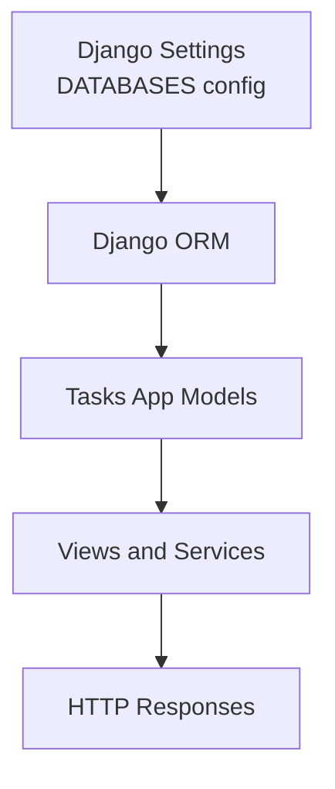
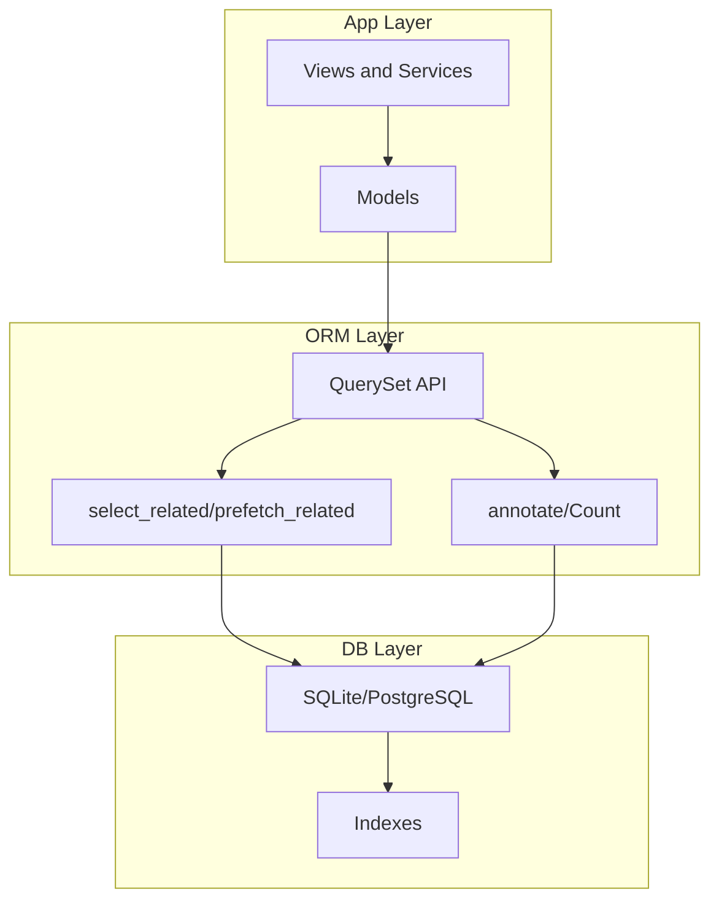
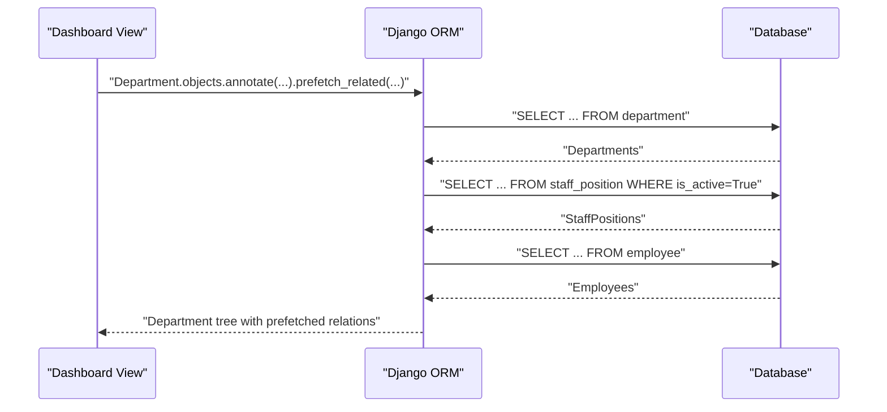
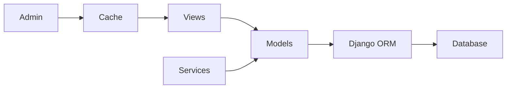

# Database Optimization

<cite>
**Referenced Files in This Document**
- [settings.py](file://taskmanager/settings.py)
- [models.py](file://tasks/models.py)
- [0001_initial.py](file://tasks/migrations/0001_initial.py)
- [org_service.py](file://tasks/services/org_service.py)
- [dashboard_views.py](file://tasks/views/dashboard_views.py)
- [admin.py](file://tasks/admin.py)
- [manage.py](file://manage.py)
</cite>

## Table of Contents
1. [Introduction](#introduction)
2. [Project Structure](#project-structure)
3. [Core Components](#core-components)
4. [Architecture Overview](#architecture-overview)
5. [Detailed Component Analysis](#detailed-component-analysis)
6. [Dependency Analysis](#dependency-analysis)
7. [Performance Considerations](#performance-considerations)
8. [Troubleshooting Guide](#troubleshooting-guide)
9. [Conclusion](#conclusion)
10. [Appendices](#appendices)

## Introduction
This document provides comprehensive guidance for database optimization in the project, focusing on query optimization, indexing strategies, ORM patterns, connection and transaction tuning, bulk operations, schema and constraint design, execution plans, database-specific optimizations, monitoring, and maintenance. It synthesizes real-world patterns present in the codebase and augments them with best practices for performance and scalability.

## Project Structure
The project uses Django with a single app (tasks) and a shared settings module. Database configuration is environment-driven via a library that reads DATABASE_URL. The tasks app defines models for organizational hierarchy and task management, with explicit indexes and ORM usage patterns that demonstrate optimization techniques such as select_related and prefetch_related.

**Diagram sources**
- [settings.py:101-110](file://taskmanager/settings.py#L101-L110)
- [models.py:1-800](file://tasks/models.py#L1-L800)

**Section sources**
- [settings.py:101-110](file://taskmanager/settings.py#L101-L110)
- [manage.py:1-23](file://manage.py#L1-L23)

## Core Components
- Database configuration: Environment-driven via DATABASE_URL with a fallback to SQLite.
- Models: Define relationships, indexes, ordering, and constraints that influence query performance.
- Views and Services: Demonstrate select_related(), prefetch_related(), aggregation, and annotation patterns.
- Admin: Integrates cache invalidation on model changes to maintain consistency and reduce stale queries.

Key optimization patterns visible in the codebase:
- Using select_related() to fetch foreign keys in a single query.
- Using prefetch_related() with Prefetch to optimize reverse foreign key and many-to-many relationships.
- Using annotate() and Count() to compute aggregates efficiently in the database.
- Using unique_together and composite indexes to enforce constraints and speed up lookups.

**Section sources**
- [models.py:58-67](file://tasks/models.py#L58-L67)
- [models.py:199-209](file://tasks/models.py#L199-L209)
- [models.py:310-317](file://tasks/models.py#L310-L317)
- [models.py:561-571](file://tasks/models.py#L561-L571)
- [models.py:664-674](file://tasks/models.py#L664-L674)
- [org_service.py:7-14](file://tasks/services/org_service.py#L7-L14)
- [dashboard_views.py:27-48](file://tasks/views/dashboard_views.py#L27-L48)
- [admin.py:11-19](file://tasks/admin.py#L11-L19)

## Architecture Overview
The database layer is centralized in Django ORM. The settings module configures the database backend, while models define schema and indexes. Views and services orchestrate optimized queries using select_related() and prefetch_related(), and leverage aggregation and annotation to minimize Python-side computation.

**Diagram sources**
- [settings.py:101-110](file://taskmanager/settings.py#L101-L110)
- [models.py:1-800](file://tasks/models.py#L1-L800)
- [org_service.py:1-53](file://tasks/services/org_service.py#L1-L53)
- [dashboard_views.py:1-143](file://tasks/views/dashboard_views.py#L1-L143)

## Detailed Component Analysis

### Database Configuration and Connection Pooling
- The project uses an environment-driven database URL with a fallback to SQLite. This supports local development and deployment flexibility.
- Connection pooling is not explicitly configured in the provided settings. For production, configure a persistent connection pooler (e.g., PgBouncer for PostgreSQL) and tune pool size and timeouts according to concurrency needs.

Recommendations:
- Set DATABASE_URL to a PostgreSQL URL in production.
- Use a dedicated pooler and configure idle timeouts and max connections.
- For SQLite, avoid concurrent writes; prefer a single writer or WAL mode with appropriate pragmas.

**Section sources**
- [settings.py:101-110](file://taskmanager/settings.py#L101-L110)

### Indexing Strategies and Schema Constraints
- Composite indexes on frequently filtered/sorted fields improve query performance:
  - Employee: name composite, email, is_active, department.
  - Task: user, status, priority, due_date, created_date.
  - Subtask: task, status, priority, planned_end; unique_together on task + stage_number.
  - Department: parent, type, name, full_path, level.
  - StaffPosition: department, employee, position, is_active, employment_type; unique_together on employee + department + position + start_date.
- Ordering directives in Meta.optimize database queries by avoiding sorts in memory.

Best practices:
- Add indexes for foreign keys involved in JOINs and filters.
- Use covering indexes for frequent SELECT queries that do not require fetching the full row.
- Normalize carefully; denormalized fields (e.g., full_path) can speed up hierarchical traversal but require triggers or post-save logic to maintain.

**Section sources**
- [models.py:58-67](file://tasks/models.py#L58-L67)
- [models.py:199-209](file://tasks/models.py#L199-L209)
- [models.py:310-317](file://tasks/models.py#L310-L317)
- [models.py:561-571](file://tasks/models.py#L561-L571)
- [models.py:664-674](file://tasks/models.py#L664-L674)
- [0001_initial.py:271-370](file://tasks/migrations/0001_initial.py#L271-L370)

### Django ORM Optimization Patterns: select_related() and prefetch_related()
- select_related(): Used to fetch foreign keys in a single query to avoid N+1 on foreign-key relations.
  - Example: prefetching related employee and position for active staff positions.
- prefetch_related(): Used to fetch reverse foreign keys and many-to-many relationships efficiently.
  - Example: prefetching children and staff_positions recursively for department trees.

N+1 Prevention:
- Always use select_related() for ForeignKey relations accessed in templates or loops.
- Use prefetch_related() with Prefetch(queryset=...) to limit fetched data and apply filters.

**Diagram sources**
- [dashboard_views.py:27-48](file://tasks/views/dashboard_views.py#L27-L48)
- [org_service.py:7-14](file://tasks/services/org_service.py#L7-L14)

**Section sources**
- [dashboard_views.py:27-48](file://tasks/views/dashboard_views.py#L27-L48)
- [org_service.py:7-14](file://tasks/services/org_service.py#L7-L14)

### Aggregation, Annotation, and Bulk Operations
- Aggregation: Use aggregate() and Count() to compute totals and counts server-side.
  - Example: counting departments, employees, and active staff positions.
- Annotation: Annotate querysets with Count() to compute per-row metrics without extra round trips.
  - Example: annotating departments with staff counts and recursive counts for children.
- Bulk operations: Use bulk_create(), bulk_update(), and bulk_delete() to minimize round-trips for large datasets. While not shown in the provided files, this pattern is recommended for high-volume updates.

**Section sources**
- [org_service.py:17-23](file://tasks/services/org_service.py#L17-L23)
- [dashboard_views.py:27-48](file://tasks/views/dashboard_views.py#L27-L48)

### Transaction Optimization
- Wrap write-heavy sequences in atomic() blocks to ensure consistency and reduce rollback overhead.
- Minimize transaction duration; keep work inside transactions minimal.
- Use select_for_update() for optimistic locking scenarios when updating shared resources.

[No sources needed since this section provides general guidance]

### Database-Specific Optimizations
- SQLite:
  - Enable WAL mode for improved concurrency.
  - Use pragmas for synchronous and journal_mode tuning in production deployments.
  - Prefer batch inserts and avoid autocommit per statement.
- PostgreSQL:
  - Use connection pooling (e.g., PgBouncer) and tune work_mem, maintenance_work_mem, and effective_cache_size.
  - Use EXPLAIN/EXPLAIN ANALYZE to inspect query plans and add missing indexes.
  - Consider partitioning large tables by date or tenant.

[No sources needed since this section provides general guidance]

### Monitoring, Slow Query Detection, and Profiling
- Logging:
  - The project logs SQL errors and general Django logs to rotating files. Use this to detect slow or failing queries during development.
- Query inspection:
  - The settings module includes a handler that prints SQL queries and timing when db.backends is enabled. Use this to profile queries locally.
- Profiling:
  - Use Django Debug Toolbar in development to inspect queries, time, and template rendering.
  - For production, use application performance monitoring (APM) tools that capture database spans.

**Section sources**
- [settings.py:180-249](file://taskmanager/settings.py#L180-L249)

### Maintenance, Vacuum/Analyze, and Backup Optimization
- SQLite:
  - Periodically run VACUUM after large deletions or schema changes.
  - Use PRAGMA integrity_check and PRAGMA quick_check for integrity verification.
- PostgreSQL:
  - Schedule regular VACUUM/ANALYZE or use autovacuum tuning parameters.
  - Use logical backups (e.g., pg_dump/pg_restore) for point-in-time recovery.
- Backups:
  - Automate offsite backups and test restore procedures regularly.
  - For high availability, consider streaming replication or managed services.

[No sources needed since this section provides general guidance]

## Dependency Analysis
The tasks app depends on Django ORM and the models defined under tasks/models.py. Views and services depend on models and use ORM APIs to construct optimized queries. Admin integrates with caching to invalidate derived data after structural changes.

**Diagram sources**
- [admin.py:1-21](file://tasks/admin.py#L1-L21)
- [dashboard_views.py:1-143](file://tasks/views/dashboard_views.py#L1-L143)
- [org_service.py:1-53](file://tasks/services/org_service.py#L1-L53)
- [models.py:1-800](file://tasks/models.py#L1-L800)

**Section sources**
- [admin.py:1-21](file://tasks/admin.py#L1-L21)
- [dashboard_views.py:1-143](file://tasks/views/dashboard_views.py#L1-L143)
- [org_service.py:1-53](file://tasks/services/org_service.py#L1-L53)
- [models.py:1-800](file://tasks/models.py#L1-L800)

## Performance Considerations
- Favor read-optimized queries with select_related() and prefetch_related().
- Use indexes aligned with filter/order fields; avoid wildcard LIKE queries on indexed columns.
- Keep migrations minimal and additive; avoid expensive schema changes during peak hours.
- Use pagination for large lists; avoid retrieving entire tables into memory.
- Cache expensive computed views (as seen with org chart caching) and invalidate on model changes.

[No sources needed since this section provides general guidance]

## Troubleshooting Guide
Common issues and remedies:
- N+1 queries:
  - Identify repeated foreign key lookups in loops and replace with select_related() or prefetch_related().
- Excessive joins:
  - Add composite indexes on join/filter columns; consider denormalized fields where appropriate.
- Slow aggregations:
  - Ensure proper indexes exist; rewrite queries to use filtered aggregates.
- Stale cached data:
  - Invalidate caches after structural changes (as done in admin).

**Section sources**
- [admin.py:11-19](file://tasks/admin.py#L11-L19)
- [dashboard_views.py:14-21](file://tasks/views/dashboard_views.py#L14-L21)

## Conclusion
The project demonstrates practical ORM optimization patterns, including selective eager-loading, aggregation, and schema-level indexes. By extending these patterns—adding connection pooling, robust monitoring, and database-specific tuning—the system can achieve predictable performance at scale. Regular maintenance, careful indexing, and disciplined query construction remain central to long-term database health.

[No sources needed since this section summarizes without analyzing specific files]

## Appendices

### Appendix A: Query Optimization Checklist
- Identify hotspots via logging and profiling.
- Replace N+1 queries with select_related() and prefetch_related().
- Add indexes for filters, joins, and orderings.
- Use annotate() and aggregate() to compute metrics server-side.
- Batch writes and minimize transaction durations.
- Monitor and maintain database statistics.

[No sources needed since this section provides general guidance]