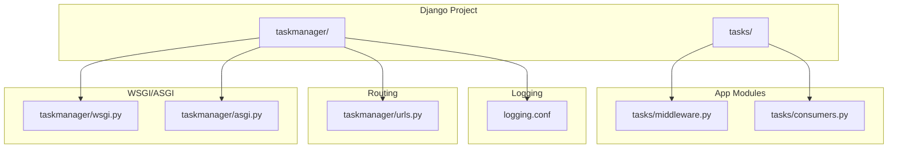
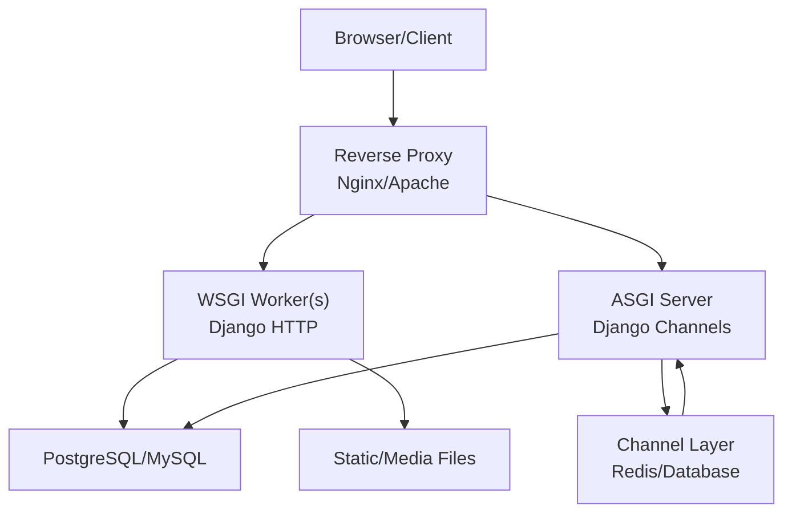
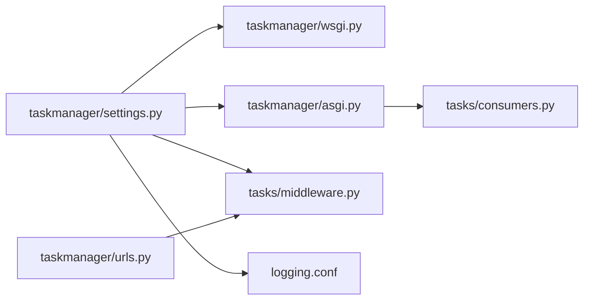

# Deployment Optimization

<cite>
**Referenced Files in This Document**
- [settings.py](file://taskmanager/settings.py)
- [wsgi.py](file://taskmanager/wsgi.py)
- [asgi.py](file://taskmanager/asgi.py)
- [urls.py](file://taskmanager/urls.py)
- [middleware.py](file://tasks/middleware.py)
- [consumers.py](file://tasks/consumers.py)
- [manage.py](file://taskmanager/manage.py)
- [logging.conf](file://logging.conf)
</cite>

## Table of Contents
1. [Introduction](#introduction)
2. [Project Structure](#project-structure)
3. [Core Components](#core-components)
4. [Architecture Overview](#architecture-overview)
5. [Detailed Component Analysis](#detailed-component-analysis)
6. [Dependency Analysis](#dependency-analysis)
7. [Performance Considerations](#performance-considerations)
8. [Troubleshooting Guide](#troubleshooting-guide)
9. [Conclusion](#conclusion)
10. [Appendices](#appendices)

## Introduction
This document provides a comprehensive guide to deploying and optimizing the Task Manager Django application in production. It focuses on server configuration, WSGI/ASGI server selection and tuning, process management, load balancing and reverse proxy setup, SSL/TLS hardening, environment-specific optimizations, database tuning, resource allocation, deployment automation, zero-downtime techniques, rollback strategies, monitoring and health checks, performance metrics collection, containerization, cloud deployment considerations, and scaling strategies.

## Project Structure
The Task Manager project follows a standard Django layout with a main application (tasks) and a top-level Django project (taskmanager). Key deployment-relevant files include settings, WSGI/ASGI entry points, URL routing, middleware, WebSocket consumers, and logging configuration.

**Diagram sources**
- [wsgi.py:1-17](file://taskmanager/wsgi.py#L1-L17)
- [asgi.py:1-17](file://taskmanager/asgi.py#L1-L17)
- [urls.py:1-11](file://taskmanager/urls.py#L1-L11)
- [middleware.py:1-43](file://tasks/middleware.py#L1-L43)
- [consumers.py:1-36](file://tasks/consumers.py#L1-L36)
- [logging.conf:1-30](file://logging.conf#L1-L30)

**Section sources**
- [settings.py:1-288](file://taskmanager/settings.py#L1-L288)
- [wsgi.py:1-17](file://taskmanager/wsgi.py#L1-L17)
- [asgi.py:1-17](file://taskmanager/asgi.py#L1-L17)
- [urls.py:1-11](file://taskmanager/urls.py#L1-L11)
- [middleware.py:1-43](file://tasks/middleware.py#L1-L43)
- [consumers.py:1-36](file://tasks/consumers.py#L1-L36)
- [logging.conf:1-30](file://logging.conf#L1-L30)

## Core Components
- Settings and Environment Variables: Centralized via environment variables for SECRET_KEY, DEBUG, ALLOWED_HOSTS, DATABASE_URL, cache backend, compression settings, and logging configuration.
- WSGI/ASGI Entrypoints: Standard Django WSGI and ASGI applications configured for production servers.
- URL Routing: Root URLs include admin, login/logout, and the tasks app routes.
- Middleware: Request/response logging middleware for observability.
- Channels Consumers: WebSocket consumer for real-time updates per task room group.
- Logging: Structured logging with rotating file handlers and loggers for different subsystems.

**Section sources**
- [settings.py:17-34](file://taskmanager/settings.py#L17-L34)
- [settings.py:106-110](file://taskmanager/settings.py#L106-L110)
- [settings.py:180-249](file://taskmanager/settings.py#L180-L249)
- [wsgi.py:10-16](file://taskmanager/wsgi.py#L10-L16)
- [asgi.py:10-16](file://taskmanager/asgi.py#L10-L16)
- [urls.py:6-11](file://taskmanager/urls.py#L6-L11)
- [middleware.py:9-43](file://tasks/middleware.py#L9-L43)
- [consumers.py:4-36](file://tasks/consumers.py#L4-L36)

## Architecture Overview
The application supports both synchronous HTTP (WSGI) and asynchronous WebSocket (ASGI) traffic. Production deployments typically run the WSGI application behind a reverse proxy and optionally scale horizontally with multiple workers/processes. For real-time features, configure an ASGI server with a channel layer backend.

[No sources needed since this diagram shows conceptual workflow, not actual code structure]

## Detailed Component Analysis

### WSGI/ASGI Server Configuration
- WSGI: The WSGI application is loaded from the settings module and suitable for production with a WSGI server (e.g., Gunicorn/uWSGI).
- ASGI: The ASGI application enables Django Channels and requires a channel layer backend (e.g., Redis) for WebSocket support.

Optimization recommendations:
- Choose a WSGI server appropriate for your platform and workload.
- Configure worker and thread counts based on CPU cores and I/O characteristics.
- Enable keep-alive and connection pooling at the reverse proxy.
- For ASGI, deploy alongside a channel layer backend and ensure shared state across instances.

**Section sources**
- [wsgi.py:10-16](file://taskmanager/wsgi.py#L10-L16)
- [asgi.py:10-16](file://taskmanager/asgi.py#L10-L16)
- [settings.py:82-82](file://taskmanager/settings.py#L82-L82)

### Reverse Proxy and Load Balancing
- Place a reverse proxy (Nginx/Apache) in front of the WSGI server to handle TLS termination, static file serving, rate limiting, and request buffering.
- Use sticky sessions only if session affinity is required; otherwise, rely on shared database/session storage.
- Configure health checks pointing to a lightweight endpoint (e.g., a dedicated health view) to gate traffic during startup or maintenance.

[No sources needed since this section doesn't analyze specific files]

### SSL/TLS Hardening
- Terminate TLS at the reverse proxy with strong ciphers and protocols.
- Enforce HSTS, OCSP stapling, and certificate renewal automation.
- Redirect HTTP to HTTPS and set appropriate security headers.

[No sources needed since this section doesn't analyze specific files]

### Process Management and Scaling
- Use systemd or similar init systems to manage the WSGI/ASGI processes.
- Scale horizontally by adding worker processes/instances behind a load balancer.
- For ASGI, ensure the channel layer is externalized (e.g., Redis) to share state across instances.

[No sources needed since this section doesn't analyze specific files]

### Environment-Specific Optimizations
- Production:
  - Set DEBUG to false and restrict ALLOWED_HOSTS.
  - Use a robust database (PostgreSQL/MySQL) via DATABASE_URL.
  - Enable compression and caching where applicable.
  - Configure structured logging with rotating files and appropriate log levels.
- Staging:
  - Mirror production settings except for less strict limits and more verbose logging.
- Development:
  - Keep DEBUG enabled and use SQLite for simplicity.

**Section sources**
- [settings.py:31-31](file://taskmanager/settings.py#L31-L31)
- [settings.py:33-33](file://taskmanager/settings.py#L33-L33)
- [settings.py:106-110](file://taskmanager/settings.py#L106-L110)
- [settings.py:180-249](file://taskmanager/settings.py#L180-L249)

### Production Database Tuning
- Use a managed database service or self-managed PostgreSQL/MySQL with tuned parameters (shared_buffers, effective_cache_size, work_mem, maintenance_work_mem).
- Optimize indexes based on query patterns (see application indexes in models).
- Monitor slow queries and apply EXPLAIN plans to refine queries and add missing indexes.
- Use connection pooling at the application or proxy level.

[No sources needed since this section doesn't analyze specific files]

### Resource Allocation Strategies
- CPU: Allocate cores proportional to concurrent requests and I/O-bound operations.
- Memory: Account for process memory overhead, static/media serving offload, and database buffer sizes.
- Disk: Separate logs, static/media, and database directories on different volumes; enable compression for static assets.

[No sources needed since this section doesn't analyze specific files]

### Deployment Automation and Zero-Downtime Deployments
- Use CI/CD pipelines to build artifacts, run tests, and deploy to staging/production.
- Zero-downtime:
  - Blue/green deployments: run two identical environments and switch traffic atomically.
  - Rolling restarts: drain connections gracefully and restart workers in batches.
- Rollback:
  - Keep previous artifact versions and reverse proxy configuration changes.
  - Maintain database migration history and have reversible migrations.

[No sources needed since this section doesn't analyze specific files]

### Monitoring, Health Checks, and Metrics
- Health checks:
  - Implement a lightweight health endpoint returning 200 when the app and DB are reachable.
  - Integrate with reverse proxy health probes.
- Logging:
  - Use structured logging with rotating files and separate loggers for app, Django, and DB layers.
  - Ship logs to centralized logging (e.g., ELK, Loki) for alerting and dashboards.
- Metrics:
  - Expose Prometheus metrics for request rates, durations, error rates, and queue lengths.
  - Track database query latency and count.

**Section sources**
- [middleware.py:9-43](file://tasks/middleware.py#L9-L43)
- [settings.py:180-249](file://taskmanager/settings.py#L180-L249)
- [logging.conf:1-30](file://logging.conf#L1-L30)

### Container Optimization and Cloud Deployment
- Containers:
  - Multi-stage builds to minimize image size.
  - Non-root user, minimal base images, and deterministic installs.
  - Mount persistent volumes for logs, staticfiles collection, and media.
- Orchestration:
  - Use Kubernetes or cloud platforms with rolling updates, readiness/liveness probes, and autoscaling.
  - Externalize secrets and configuration via environment variables or secret managers.
- Cloud specifics:
  - Use managed databases and caches.
  - Enable CDN for static assets and media.
  - Configure auto-scaling based on CPU/memory or request rate.

[No sources needed since this section doesn't analyze specific files]

### Scaling Strategies
- Vertical scaling: Increase CPU/RAM per instance.
- Horizontal scaling: Add instances behind a load balancer; ensure shared state (channel layer, sessions).
- Database scaling: Read replicas, connection pooling, and query optimization.
- Caching: Use Redis/Memcached for sessions, template fragments, and API responses.

[No sources needed since this section doesn't analyze specific files]

## Dependency Analysis
The deployment stack depends on the WSGI/ASGI entry points, settings, middleware, and consumers. Proper configuration of these components ensures reliable operation under load.

**Diagram sources**
- [settings.py:1-288](file://taskmanager/settings.py#L1-L288)
- [wsgi.py:1-17](file://taskmanager/wsgi.py#L1-L17)
- [asgi.py:1-17](file://taskmanager/asgi.py#L1-L17)
- [urls.py:1-11](file://taskmanager/urls.py#L1-L11)
- [middleware.py:1-43](file://tasks/middleware.py#L1-L43)
- [consumers.py:1-36](file://tasks/consumers.py#L1-L36)
- [logging.conf:1-30](file://logging.conf#L1-L30)

**Section sources**
- [settings.py:1-288](file://taskmanager/settings.py#L1-L288)
- [wsgi.py:1-17](file://taskmanager/wsgi.py#L1-L17)
- [asgi.py:1-17](file://taskmanager/asgi.py#L1-L17)
- [urls.py:1-11](file://taskmanager/urls.py#L1-L11)
- [middleware.py:1-43](file://tasks/middleware.py#L1-L43)
- [consumers.py:1-36](file://tasks/consumers.py#L1-L36)
- [logging.conf:1-30](file://logging.conf#L1-L30)

## Performance Considerations
- Static files: Serve via reverse proxy or CDN; collect static assets during deployment.
- Compression: Enable gzip/deflate at the proxy; consider Brotli for modern clients.
- Database: Use connection pooling, optimize queries, and monitor slow queries.
- Caching: Use application-level caching for expensive views; avoid heavy cache backends in single-instance setups.
- Middleware: Keep middleware minimal; each adds overhead to every request.

[No sources needed since this section provides general guidance]

## Troubleshooting Guide
- Logging:
  - Verify log directory permissions and rotation thresholds.
  - Confirm loggers are configured for app, Django, and database layers.
- Health:
  - Implement and test a health check endpoint.
  - Use reverse proxy health probes to detect failing instances.
- Requests:
  - Use request/response logging middleware to capture timing and errors.
- ASGI/WebSocket:
  - Ensure channel layer is reachable and configured consistently across instances.

**Section sources**
- [settings.py:180-249](file://taskmanager/settings.py#L180-L249)
- [logging.conf:1-30](file://logging.conf#L1-L30)
- [middleware.py:9-43](file://tasks/middleware.py#L9-L43)
- [consumers.py:4-36](file://tasks/consumers.py#L4-L36)

## Conclusion
Deploying the Task Manager application in production requires careful attention to server configuration, process management, reverse proxy setup, and database tuning. By leveraging WSGI/ASGI separation, robust logging, health checks, and scalable infrastructure, you can achieve reliable, secure, and high-performance operations. Adopt zero-downtime deployment practices, maintain clear rollback procedures, and continuously monitor performance to sustain growth.

## Appendices
- Environment variables to define in production:
  - SECRET_KEY, DEBUG, ALLOWED_HOSTS, DATABASE_URL, optional cache backend and location.
- Recommended production settings:
  - Disable DEBUG, restrict hosts, enable compression, and configure logging.

[No sources needed since this section doesn't analyze specific files]