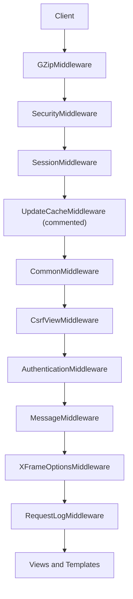
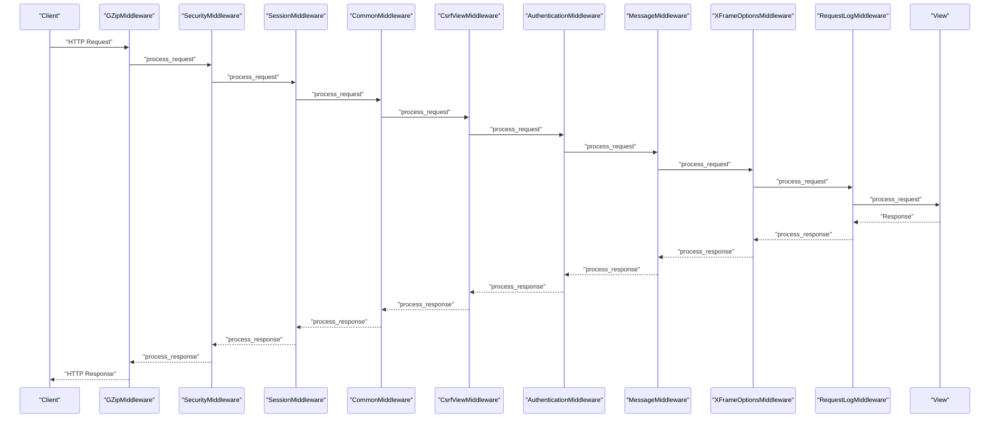
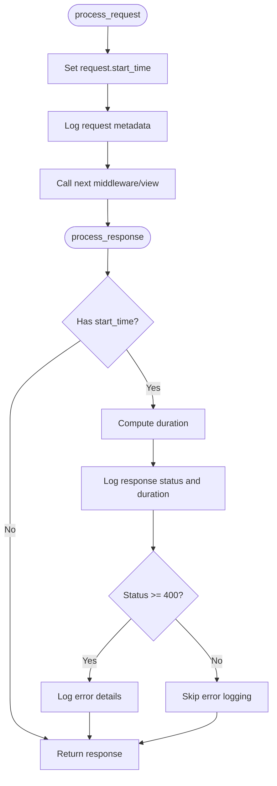
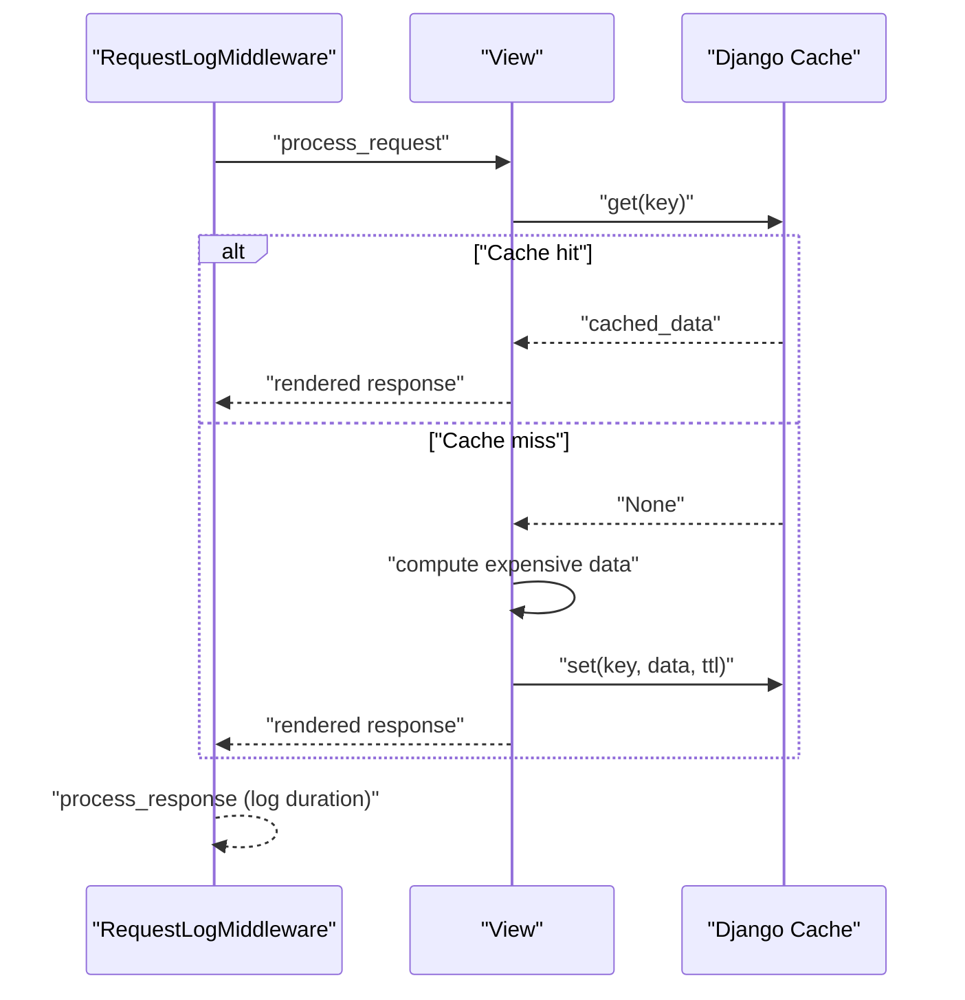
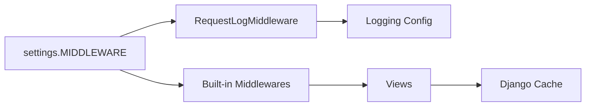

# Middleware Performance

<cite>
**Referenced Files in This Document**
- [tasks/middleware.py](file://tasks/middleware.py)
- [taskmanager/settings.py](file://taskmanager/settings.py)
- [taskmanager/urls.py](file://taskmanager/urls.py)
- [tasks/urls.py](file://tasks/urls.py)
- [tasks/views/dashboard_views.py](file://tasks/views/dashboard_views.py)
- [logging.conf](file://logging.conf)
</cite>

## Table of Contents
1. [Introduction](#introduction)
2. [Project Structure](#project-structure)
3. [Core Components](#core-components)
4. [Architecture Overview](#architecture-overview)
5. [Detailed Component Analysis](#detailed-component-analysis)
6. [Dependency Analysis](#dependency-analysis)
7. [Performance Considerations](#performance-considerations)
8. [Troubleshooting Guide](#troubleshooting-guide)
9. [Conclusion](#conclusion)
10. [Appendices](#appendices)

## Introduction
This document focuses on Middleware Performance Optimization in the Django application. It explains how middleware ordering affects request processing time, how to optimize custom middleware, and how to tune middleware chains for throughput. It also covers request/response processing optimization, middleware early termination patterns, profiling techniques, GZip compression configuration, security middleware overhead, session middleware optimization, request logging optimization, debugging strategies, benchmarking, performance measurement tools, and replacement strategies for improved performance.

## Project Structure
The middleware stack is configured centrally in Django settings and applies to all requests routed via the project’s URL configurations. The custom middleware is placed last in the chain to capture end-to-end timing and errors after other middlewares have processed the request.

**Diagram sources**
- [taskmanager/settings.py:49-61](file://taskmanager/settings.py#L49-L61)

**Section sources**
- [taskmanager/settings.py:49-61](file://taskmanager/settings.py#L49-L61)
- [taskmanager/urls.py:6-11](file://taskmanager/urls.py#L6-L11)
- [tasks/urls.py:38-100](file://tasks/urls.py#L38-L100)

## Core Components
- RequestLogMiddleware: A custom middleware that measures per-request duration and logs request/response metadata and errors. It stores a start timestamp on the request object during process_request and computes elapsed time in process_response.
- Django’s built-in middleware stack: Includes GZip, Security, Session, Common, CSRF, Authentication, Messages, and X-Frame-Options. The project also includes commented cache middleware entries for upstream caching.

Key performance characteristics:
- Timing is captured around the entire request lifecycle, including view resolution and template rendering.
- Logging is directed to dedicated handlers and levels to minimize overhead in production.

**Section sources**
- [tasks/middleware.py:9-43](file://tasks/middleware.py#L9-L43)
- [taskmanager/settings.py:49-61](file://taskmanager/settings.py#L49-L61)

## Architecture Overview
The middleware chain executes in order for both request and response phases. The custom RequestLogMiddleware runs after all other middlewares, ensuring it captures the final response status and any exceptions raised by downstream middlewares or views.

**Diagram sources**
- [taskmanager/settings.py:49-61](file://taskmanager/settings.py#L49-L61)
- [tasks/middleware.py:12-35](file://tasks/middleware.py#L12-L35)

## Detailed Component Analysis

### RequestLogMiddleware
- Purpose: Capture request start time, log request metadata, compute and log response duration, and log 4xx/5xx responses and unhandled exceptions.
- Performance impact:
  - Minimal CPU overhead due to simple timestamp arithmetic and lightweight logging calls.
  - Uses separate loggers and handlers to avoid excessive console output in production.
- Early termination pattern: Not applicable; it always computes duration and logs.

**Diagram sources**
- [tasks/middleware.py:12-35](file://tasks/middleware.py#L12-L35)

**Section sources**
- [tasks/middleware.py:9-43](file://tasks/middleware.py#L9-L43)
- [logging.conf:1-30](file://logging.conf#L1-L30)

### Built-in Middleware Chain
- GZipMiddleware: Compresses responses when appropriate. Place near the top to reduce bandwidth and improve latency for large payloads.
- SecurityMiddleware: Adds security headers and sets secure defaults.
- SessionMiddleware: Enables session support; consider optimization for anonymous users.
- CommonMiddleware: Handles common tasks like cleaning the PATH_INFO.
- CsrfViewMiddleware: Validates CSRF tokens; essential for POST safety.
- AuthenticationMiddleware: Attaches user to request.
- MessageMiddleware: Enables framework messages.
- XFrameOptionsMiddleware: Protects against clickjacking.

Optimization opportunities:
- Reorder middleware to minimize repeated work (e.g., GZip near the top).
- Disable or conditionally enable heavy middlewares for static or public endpoints.
- Use cache middleware for upstream caching if traffic warrants it.

**Section sources**
- [taskmanager/settings.py:49-61](file://taskmanager/settings.py#L49-L61)

### View Layer Interaction
- Views may leverage caching to reduce database load and improve response times.
- Example: Organization chart view caches expensive computations for a fixed TTL.

**Diagram sources**
- [tasks/views/dashboard_views.py:14-109](file://tasks/views/dashboard_views.py#L14-L109)

**Section sources**
- [tasks/views/dashboard_views.py:14-109](file://tasks/views/dashboard_views.py#L14-L109)

## Dependency Analysis
- Middleware ordering is explicit in settings and determines the request/response phase execution order.
- Custom middleware depends on Django’s MiddlewareMixin and standard logging facilities.
- Views depend on Django’s ORM and cache framework.

**Diagram sources**
- [taskmanager/settings.py:49-61](file://taskmanager/settings.py#L49-L61)
- [tasks/middleware.py:7](file://tasks/middleware.py#L7)
- [logging.conf:1-30](file://logging.conf#L1-L30)

**Section sources**
- [taskmanager/settings.py:49-61](file://taskmanager/settings.py#L49-L61)
- [tasks/middleware.py:7](file://tasks/middleware.py#L7)
- [logging.conf:1-30](file://logging.conf#L1-L30)

## Performance Considerations

### Middleware Ordering Impact
- Place GZipMiddleware near the top to compress early and reduce network time.
- Keep security/session middlewares early to establish identity and headers before view logic.
- Put RequestLogMiddleware last to capture the final response and any exceptions.

Evidence from settings:
- GZip is first; Security is second; Session is third; RequestLogMiddleware is last.

**Section sources**
- [taskmanager/settings.py:49-61](file://taskmanager/settings.py#L49-L61)

### Custom Middleware Performance Considerations
- Minimize allocations and I/O in process_request/process_response.
- Use efficient logging levels and formatters.
- Avoid expensive operations unless necessary.

Recommendations:
- Use asynchronous logging handlers in production if needed.
- Reduce log verbosity for high-throughput endpoints.

**Section sources**
- [tasks/middleware.py:9-43](file://tasks/middleware.py#L9-L43)
- [logging.conf:1-30](file://logging.conf#L1-L30)

### Middleware Chain Optimization
- Conditional middleware: Enable/disable middlewares based on endpoint patterns (e.g., skip CSRF for GETs to public pages).
- Static/media bypass: Serve static assets outside Django to avoid middleware overhead.
- Cache middleware: Uncomment and configure upstream cache middleware for frequently accessed pages.

**Section sources**
- [taskmanager/settings.py:49-61](file://taskmanager/settings.py#L49-L61)

### Request/Response Processing Optimization
- Early exit: Raise exceptions or return short-circuit responses in middleware for invalid requests.
- Lightweight response bodies: Prefer JSON APIs with GZip for large payloads.

**Section sources**
- [taskmanager/settings.py:49-61](file://taskmanager/settings.py#L49-L61)

### Middleware Early Termination Patterns
- Raise Http404 or HttpResponseBadRequest in process_request for malformed requests.
- Short-circuit in process_response for monitoring or metrics.

Note: The custom middleware logs and does not terminate early; implement early exits in specialized middlewares as needed.

**Section sources**
- [tasks/middleware.py:12-35](file://tasks/middleware.py#L12-L35)

### Middleware Profiling Techniques
- Use Python’s cProfile or yep to profile middleware and views.
- Instrument process_request/process_response with timers to measure overhead.
- Monitor logs for slow endpoints and high error rates.

**Section sources**
- [tasks/middleware.py:12-35](file://tasks/middleware.py#L12-L35)

### GZip Compression Configuration
- GZipMiddleware is enabled; ensure it targets appropriate content types and sizes.
- Consider tuning compression level and minimum length thresholds for payload sizes.

Current configuration evidence:
- GZipMiddleware is present in MIDDLEWARE.

**Section sources**
- [taskmanager/settings.py:49-61](file://taskmanager/settings.py#L49-L61)

### Security Middleware Overhead
- SecurityMiddleware adds headers and checks; overhead is low but can be reduced by disabling unnecessary headers in production.
- Use CDN/proxy for additional security headers to offload work.

**Section sources**
- [taskmanager/settings.py:49-61](file://taskmanager/settings.py#L49-L61)

### Session Middleware Optimization
- Disable sessions for read-only public endpoints.
- Use database-backed sessions only if required; otherwise prefer cache-backed sessions.
- Set appropriate session cookie attributes (HttpOnly, SameSite, Secure) to reduce client-side overhead.

**Section sources**
- [taskmanager/settings.py:49-61](file://taskmanager/settings.py#L49-L61)

### Request Logging Optimization
- Separate loggers for different concerns (e.g., tasks) to avoid cross-contamination.
- Use rotating file handlers and appropriate levels to limit disk I/O.
- Consider structured logging for machine parsing.

**Section sources**
- [taskmanager/settings.py:180-249](file://taskmanager/settings.py#L180-L249)
- [logging.conf:1-30](file://logging.conf#L1-L30)

### Middleware Debugging Strategies
- Enable DEBUG mode temporarily to inspect request/response flow.
- Add granular logs in custom middleware for specific endpoints.
- Use Django Debug Toolbar for SQL and template timing insights.

**Section sources**
- [taskmanager/settings.py:31](file://taskmanager/settings.py#L31)
- [tasks/middleware.py:12-35](file://tasks/middleware.py#L12-L35)

### Middleware Benchmarking and Measurement Tools
- Use locust or wrk to simulate load and measure middleware overhead.
- Track response times per endpoint and correlate with middleware logs.
- Monitor error rates and 5xx durations to identify problematic middlewares.

**Section sources**
- [tasks/middleware.py:18-35](file://tasks/middleware.py#L18-L35)

### Middleware Replacement Strategies
- Replace heavy middlewares with lighter alternatives (e.g., minimal CSRF for read-heavy APIs).
- Offload compression and caching to reverse proxies (Nginx, CDN).
- Use streaming responses for large payloads to reduce memory and CPU usage.

**Section sources**
- [taskmanager/settings.py:49-61](file://taskmanager/settings.py#L49-L61)

## Troubleshooting Guide
- Excessive logging: Lower log levels or route logs to files only in production.
- Slow responses: Profile middleware and views; check cache hits and database queries.
- CSRF failures: Verify middleware order and token presence for POST requests.
- Session issues: Confirm session backend configuration and cookie attributes.

**Section sources**
- [tasks/middleware.py:12-43](file://tasks/middleware.py#L12-L43)
- [taskmanager/settings.py:180-249](file://taskmanager/settings.py#L180-L249)

## Conclusion
Middleware performance hinges on ordering, selective enabling, and efficient logging. Place GZip early, keep security/session middlewares close to the top, and position custom logging last. Optimize session usage, leverage caching, and use profiling tools to identify bottlenecks. Tune logging levels and handlers for production, and consider replacing heavy middlewares with proxy-based solutions for better throughput.

## Appendices

### Middleware Stack Reference
- Order: GZip → Security → Session → Common → CSRF → Authentication → Messages → X-Frame → RequestLog

**Section sources**
- [taskmanager/settings.py:49-61](file://taskmanager/settings.py#L49-L61)