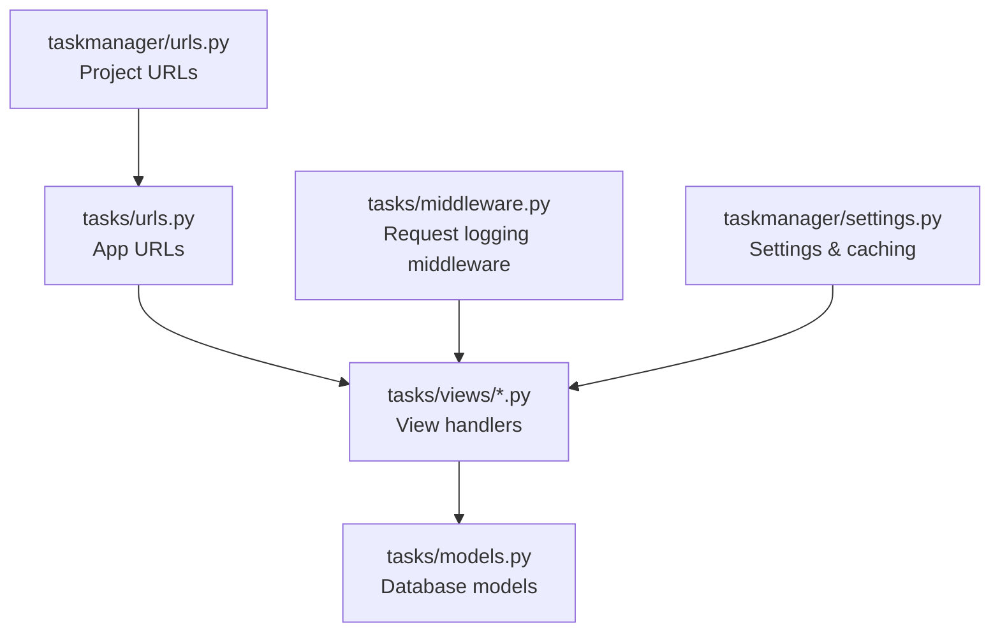
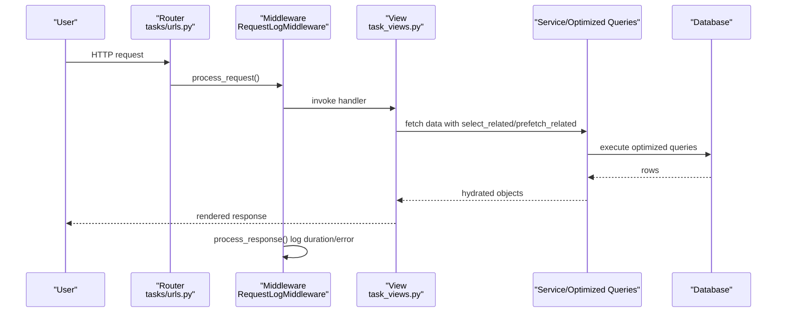
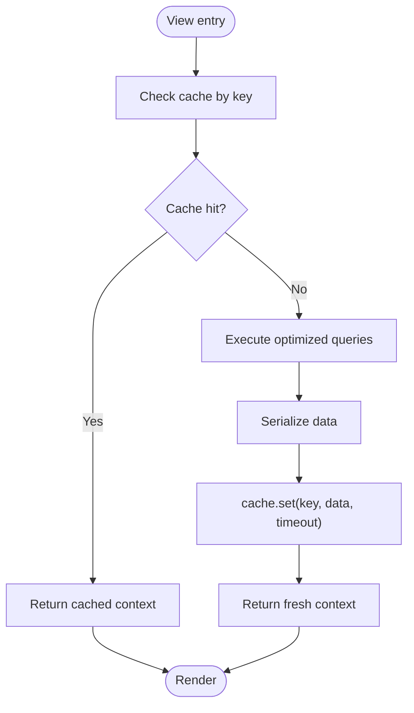
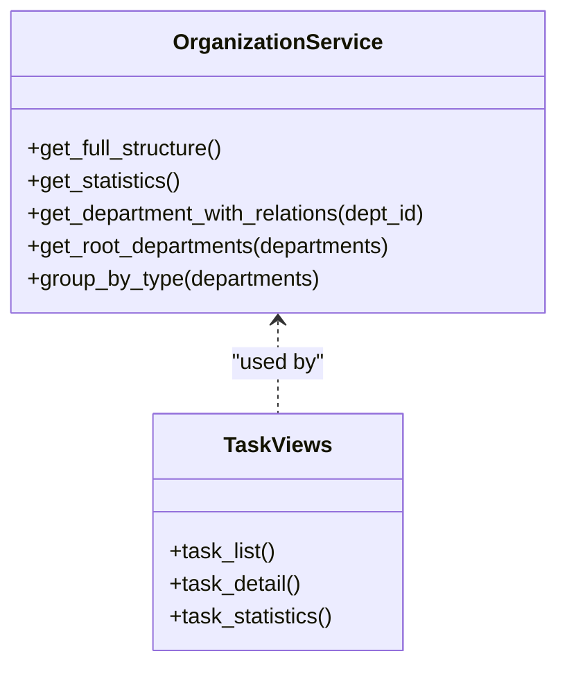
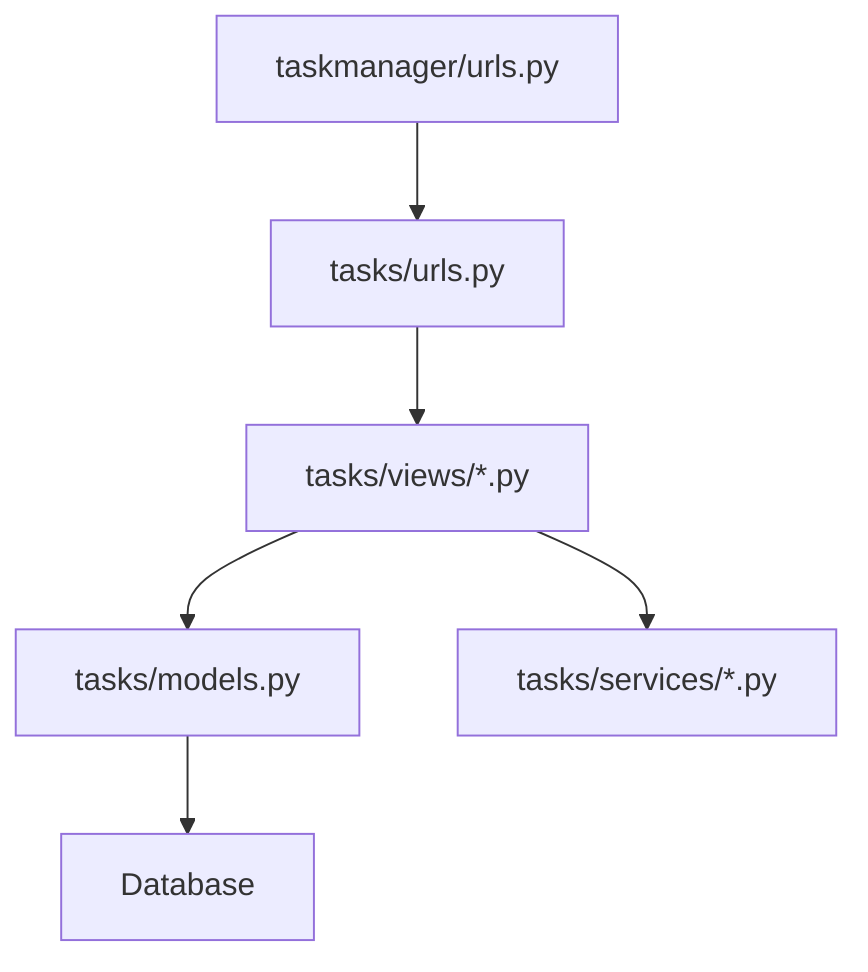

# Performance and Optimization

<cite>
**Referenced Files in This Document**
- [settings.py](file://taskmanager/settings.py)
- [middleware.py](file://tasks/middleware.py)
- [models.py](file://tasks/models.py)
- [urls.py](file://tasks/urls.py)
- [task_views.py](file://tasks/views/task_views.py)
- [dashboard_views.py](file://tasks/views/dashboard_views.py)
- [base.py](file://tasks/views/base.py)
- [api.py](file://tasks/api.py)
- [org_service.py](file://tasks/services/org_service.py)
- [docx_importer.py](file://tasks/utils/docx_importer.py)
- [taskmanager/urls.py](file://taskmanager/urls.py)
</cite>

## Table of Contents
1. [Introduction](#introduction)
2. [Project Structure](#project-structure)
3. [Core Components](#core-components)
4. [Architecture Overview](#architecture-overview)
5. [Detailed Component Analysis](#detailed-component-analysis)
6. [Dependency Analysis](#dependency-analysis)
7. [Performance Considerations](#performance-considerations)
8. [Troubleshooting Guide](#troubleshooting-guide)
9. [Conclusion](#conclusion)
10. [Appendices](#appendices)

## Introduction
This document focuses on performance and optimization strategies for the Task Manager application. It covers database query optimization, indexing strategies, caching implementation, middleware performance considerations, request processing optimization, response time improvements, static file optimization, asset compression, CDN integration, performance monitoring, profiling techniques, bottleneck identification, scalability considerations, load balancing, deployment optimization, memory management, garbage collection, and resource cleanup strategies. The guidance is grounded in the repository’s current configuration and codebase.

## Project Structure
The application follows a standard Django layout with a dedicated app for tasks and supporting modules for models, views, services, utilities, and middleware. URLs are routed via the app’s URL configuration and included in the project-level router.

**Diagram sources**
- [taskmanager/urls.py:1-11](file://taskmanager/urls.py#L1-L11)
- [tasks/urls.py:1-100](file://tasks/urls.py#L1-L100)
- [tasks/views/task_views.py:1-471](file://tasks/views/task_views.py#L1-L471)
- [tasks/models.py:1-858](file://tasks/models.py#L1-L858)
- [tasks/middleware.py:1-43](file://tasks/middleware.py#L1-L43)
- [taskmanager/settings.py:1-288](file://taskmanager/settings.py#L1-L288)

**Section sources**
- [taskmanager/urls.py:1-11](file://taskmanager/urls.py#L1-L11)
- [tasks/urls.py:1-100](file://tasks/urls.py#L1-L100)

## Core Components
- Settings and caching: The project currently uses a dummy cache backend and disables page caching. Compression is configured but disabled by default. GZip middleware is enabled.
- Middleware: A custom RequestLogMiddleware logs request durations and errors, aiding performance monitoring.
- Models: Indexes are defined on frequently filtered/sorted fields to optimize queries.
- Views: Several views implement select_related and prefetch_related to reduce N+1 queries and improve rendering performance.
- Services: An organization service encapsulates optimized queries for hierarchical data.
- Utilities: A DOCX importer parses and creates research structures; it includes logging for performance visibility.

Key performance-relevant settings and components:
- CACHES default backend set to DummyCache; CACHE_MIDDLEWARE_SECONDS set to zero.
- GZipMiddleware enabled.
- COMPRESS_* settings present but COMPRESS_ENABLED is False.
- RequestLogMiddleware logs timing and errors.

**Section sources**
- [settings.py:85-162](file://taskmanager/settings.py#L85-L162)
- [settings.py:266-288](file://taskmanager/settings.py#L266-L288)
- [middleware.py:1-43](file://tasks/middleware.py#L1-L43)
- [models.py:58-67](file://tasks/models.py#L58-L67)
- [models.py:199-209](file://tasks/models.py#L199-L209)
- [models.py:312-317](file://tasks/models.py#L312-L317)
- [models.py:565-571](file://tasks/models.py#L565-L571)
- [models.py:668-674](file://tasks/models.py#L668-L674)

## Architecture Overview
The request lifecycle integrates routing, middleware, views, and models. Logging middleware measures request duration and captures errors. Views leverage optimized database queries and optional caching.

**Diagram sources**
- [tasks/urls.py:1-100](file://tasks/urls.py#L1-L100)
- [tasks/middleware.py:9-35](file://tasks/middleware.py#L9-L35)
- [tasks/views/task_views.py:19-69](file://tasks/views/task_views.py#L19-L69)
- [tasks/views/dashboard_views.py:14-109](file://tasks/views/dashboard_views.py#L14-L109)

## Detailed Component Analysis

### Database Query Optimization and Indexing Strategies
- Model indexes:
  - Employee: indexes on name, email, activity, and department to accelerate filtering and sorting.
  - Task: indexes on user, status, priority, due_date, and created_date.
  - Subtask: indexes on task, status, priority, and planned end date.
  - Department: indexes on parent, type, name, full path, and level to support hierarchical navigation.
  - StaffPosition: indexes on department, employee, position, activity, and employment type.
- Query optimization patterns:
  - Views use select_related and prefetch_related to avoid N+1 queries when accessing foreign keys and many-to-many relations.
  - Aggregation and annotation are used for counts and summaries to minimize Python-side computation.
  - OrganizationService demonstrates reusable optimized query patterns for hierarchical data.

Recommendations:
- Add composite indexes for frequent filter combinations (e.g., Task by user and status).
- Monitor slow queries with Django Debug Toolbar or similar tools and add targeted indexes.
- Use database EXPLAIN plans to validate index usage.

**Section sources**
- [models.py:62-67](file://tasks/models.py#L62-L67)
- [models.py:204-209](file://tasks/models.py#L204-L209)
- [models.py:313-317](file://tasks/models.py#L313-L317)
- [models.py:566-571](file://tasks/models.py#L566-L571)
- [models.py:669-674](file://tasks/models.py#L669-L674)
- [task_views.py:20-69](file://tasks/views/task_views.py#L20-L69)
- [task_views.py:408-458](file://tasks/views/task_views.py#L408-L458)
- [dashboard_views.py:27-48](file://tasks/views/dashboard_views.py#L27-L48)
- [org_service.py:10-14](file://tasks/services/org_service.py#L10-L14)

### Caching Implementation
Current state:
- Default cache backend is DummyCache; page caching middleware is commented out.
- One view caches organization chart data for 10 minutes.

Optimization opportunities:
- Enable a real cache backend (e.g., LocMemCache or Redis) for production.
- Re-enable page caching middleware and set appropriate CACHE_MIDDLEWARE_SECONDS.
- Use per-view or template fragment caching for expensive renders.
- Cache API responses where feasible.

**Diagram sources**
- [dashboard_views.py:15-21](file://tasks/views/dashboard_views.py#L15-L21)
- [dashboard_views.py:106-107](file://tasks/views/dashboard_views.py#L106-L107)

**Section sources**
- [settings.py:85-98](file://taskmanager/settings.py#L85-L98)
- [dashboard_views.py:15-21](file://tasks/views/dashboard_views.py#L15-L21)
- [dashboard_views.py:106-107](file://tasks/views/dashboard_views.py#L106-L107)

### Middleware Performance Considerations
- RequestLogMiddleware measures request duration and logs errors, enabling performance monitoring and error detection.
- GZipMiddleware is enabled to reduce payload sizes.

Recommendations:
- Keep middleware order optimal; place lightweight middlewares early.
- Avoid heavy processing in middleware; offload to views or services.
- Consider rate limiting middleware for public endpoints.

**Section sources**
- [settings.py:49-61](file://taskmanager/settings.py#L49-L61)
- [middleware.py:9-43](file://tasks/middleware.py#L9-L43)

### Request Processing Optimization
- Efficient filtering and sorting via model indexes.
- select_related and prefetch_related to eliminate N+1 queries.
- Aggregated statistics computed server-side to reduce client-side work.
- OrganizationService centralizes optimized queries for reuse.

**Diagram sources**
- [org_service.py:4-53](file://tasks/services/org_service.py#L4-L53)
- [task_views.py:19-69](file://tasks/views/task_views.py#L19-L69)
- [task_views.py:366-406](file://tasks/views/task_views.py#L366-L406)

**Section sources**
- [task_views.py:20-69](file://tasks/views/task_views.py#L20-L69)
- [task_views.py:366-406](file://tasks/views/task_views.py#L366-L406)
- [org_service.py:7-32](file://tasks/services/org_service.py#L7-L32)

### Response Time Improvements
- Logging middleware provides timing metrics for requests and errors.
- GZip reduces transfer size.
- Optimized queries reduce database latency.

Recommendations:
- Add response headers for caching and compression.
- Consider asynchronous processing for long-running tasks.
- Profile hotspots with Django Debug Toolbar or similar.

**Section sources**
- [middleware.py:18-35](file://tasks/middleware.py#L18-L35)
- [settings.py:50](file://taskmanager/settings.py#L50)

### Static File Optimization, Asset Compression, and CDN Integration
- Static files served via STATIC_URL and STATIC_ROOT.
- Compression settings exist (COMPRESS_ENABLED=False, filters configured).
- No CDN integration configured.

Recommendations:
- Enable compression for production builds.
- Collect static files with hashed filenames for cache busting.
- Integrate a CDN for static assets and configure appropriate cache headers.

**Section sources**
- [settings.py:147-156](file://taskmanager/settings.py#L147-L156)
- [settings.py:266-288](file://taskmanager/settings.py#L266-L288)

### API Optimization
- API endpoints use basic filtering and JSON serialization.
- Consider pagination, caching, and bulk operations for improved throughput.

**Section sources**
- [api.py:10-21](file://tasks/api.py#L10-L21)
- [api.py:24-39](file://tasks/api.py#L24-L39)

### Data Import Performance
- DOCX importer logs parsing and creation steps, aiding performance diagnostics.
- Bulk deletion and creation patterns are used during import.

Recommendations:
- Stream large file processing.
- Use transactions for batch operations.
- Add progress reporting for long-running imports.

**Section sources**
- [docx_importer.py:14-44](file://tasks/utils/docx_importer.py#L14-L44)
- [docx_importer.py:374-441](file://tasks/utils/docx_importer.py#L374-L441)

## Dependency Analysis
The app’s URL routing includes the tasks app, which exposes numerous endpoints for tasks, employees, research, and dashboards. Views depend on models and services to deliver optimized data.

**Diagram sources**
- [taskmanager/urls.py:6-11](file://taskmanager/urls.py#L6-L11)
- [tasks/urls.py:38-100](file://tasks/urls.py#L38-L100)

**Section sources**
- [taskmanager/urls.py:1-11](file://taskmanager/urls.py#L1-L11)
- [tasks/urls.py:1-100](file://tasks/urls.py#L1-L100)

## Performance Considerations
- Database
  - Use indexes on filter/sort fields.
  - Prefer select_related and prefetch_related.
  - Aggregate data at the database level.
- Caching
  - Enable a real cache backend.
  - Re-enable page caching middleware.
  - Cache expensive renders and API responses.
- Middleware
  - Keep middleware lightweight.
  - Use GZip for compression.
- Static Assets
  - Enable compression and collect static with hashed names.
  - Use a CDN for distribution.
- Monitoring
  - Use RequestLogMiddleware timing and error logs.
  - Add profiling tools and slow query detection.

[No sources needed since this section provides general guidance]

## Troubleshooting Guide
- Use RequestLogMiddleware logs to identify slow endpoints and error rates.
- Enable Django logging handlers for file-based debugging.
- For import-heavy operations, monitor temporary file cleanup and transaction boundaries.

**Section sources**
- [middleware.py:18-43](file://tasks/middleware.py#L18-L43)
- [settings.py:180-249](file://taskmanager/settings.py#L180-L249)
- [task_views.py:100-145](file://tasks/views/task_views.py#L100-L145)

## Conclusion
The Task Manager application includes several performance foundations: model indexes, optimized query patterns, middleware logging, and compression settings. To achieve production-grade performance, enable a real cache backend, activate page caching, integrate a CDN, and adopt continuous monitoring and profiling. These steps will improve response times, reduce database load, and scale the application effectively.

[No sources needed since this section summarizes without analyzing specific files]

## Appendices

### Checklist for Production Performance
- Enable and configure cache backend.
- Re-enable page caching middleware.
- Enable asset compression and CDN.
- Add profiling and slow query detection.
- Monitor middleware overhead and logging verbosity.
- Optimize database indexes based on query patterns.

[No sources needed since this section provides general guidance]