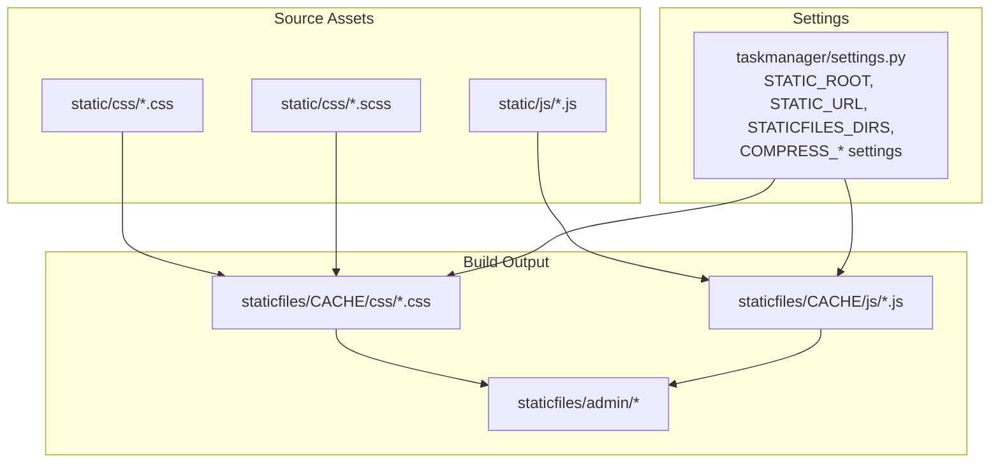
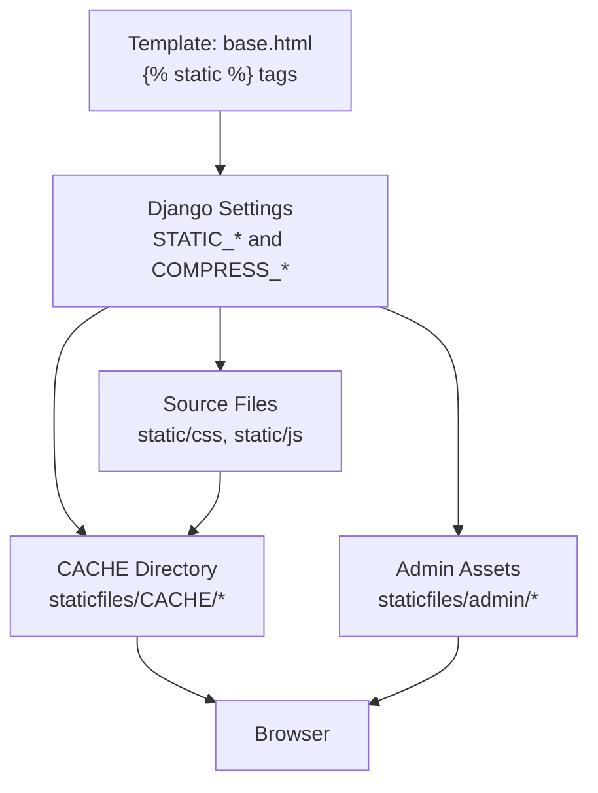
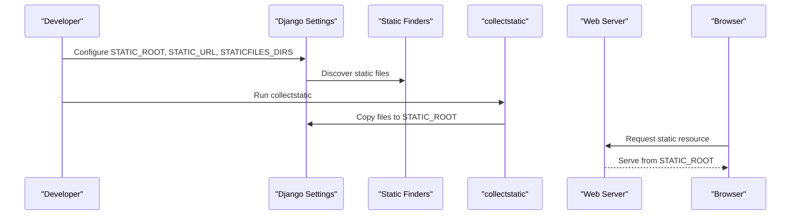
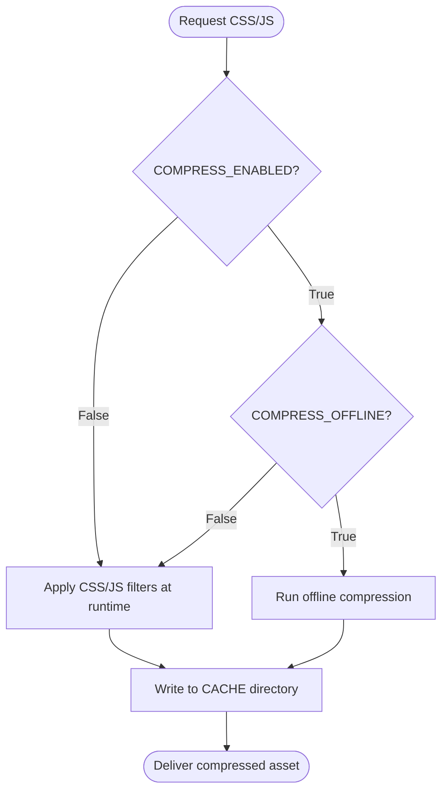
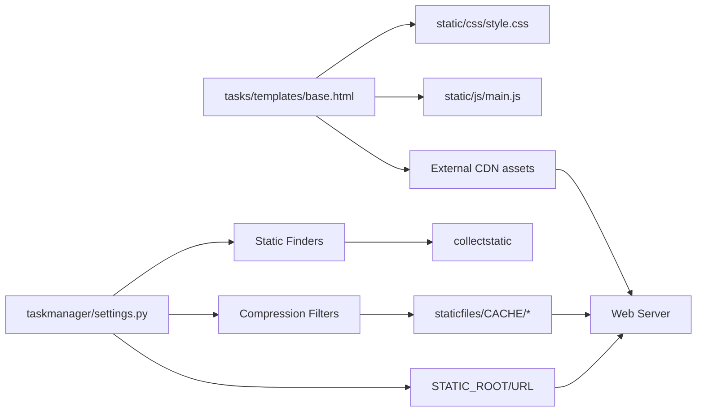

# Static Assets Optimization

<cite>
**Referenced Files in This Document**
- [settings.py](file://taskmanager/settings.py)
- [urls.py](file://taskmanager/urls.py)
- [manage.py](file://manage.py)
- [base.html](file://tasks/templates/base.html)
- [style.css](file://static/css/style.css)
- [style.scss](file://static/css/style.scss)
- [main.js](file://static/js/main.js)
- [output.*.css](file://staticfiles/CACHE/css/output.1d07d529aead.css)
- [output.*.js](file://staticfiles/CACHE/js/output.8f5ac3cbc3ba.js)
- [responsive.css](file://staticfiles/admin/css/responsive.css)
- [urlify.js](file://staticfiles/admin/js/urlify.js)
</cite>

## Table of Contents
1. [Introduction](#introduction)
2. [Project Structure](#project-structure)
3. [Core Components](#core-components)
4. [Architecture Overview](#architecture-overview)
5. [Detailed Component Analysis](#detailed-component-analysis)
6. [Dependency Analysis](#dependency-analysis)
7. [Performance Considerations](#performance-considerations)
8. [Troubleshooting Guide](#troubleshooting-guide)
9. [Conclusion](#conclusion)

## Introduction
This document explains how static assets are organized and optimized in the project. It covers static file serving, compression and minification configuration, bundling strategies, CDN integration, caching headers, and build-time optimizations. The project leverages Django’s built-in static files pipeline and optional third-party compression via django-compressor. Current configuration enables compression filters but keeps offline compression disabled, relying on runtime processing and GZip middleware for transport compression.

## Project Structure
The project organizes static assets under two primary locations:
- Source assets: static/ and taskmanager/static/
- Built and cached assets: staticfiles/ and taskmanager/staticfiles/

Key directories and files:
- Source styles: static/css/style.css, static/css/style.scss
- Source scripts: static/js/main.js
- Built cache: staticfiles/CACHE/css and staticfiles/CACHE/js
- Admin assets: staticfiles/admin/ for CSS and JS used by Django Admin
- Templates: tasks/templates/base.html loads static resources via Django’s  tag

**Diagram sources**
- [settings.py](file://taskmanager/settings.py)
- [style.css](file://static/css/style.css)
- [style.scss](file://static/css/style.scss)
- [main.js](file://static/js/main.js)
- [output.*.css](file://staticfiles/CACHE/css/output.1d07d529aead.css)
- [output.*.js](file://staticfiles/CACHE/js/output.8f5ac3cbc3ba.js)
- [responsive.css](file://staticfiles/admin/css/responsive.css)
- [urlify.js](file://staticfiles/admin/js/urlify.js)

**Section sources**
- [settings.py](file://taskmanager/settings.py)
- [base.html](file://tasks/templates/base.html)

## Core Components
- Static files configuration
  - STATIC_URL defines the public URL prefix for static files.
  - STATIC_ROOT is the directory where collected static files are stored during deployment.
  - STATICFILES_DIRS points to additional directories containing source static files.
- Compression pipeline
  - django-compressor is configured with finders and filters for CSS and JS.
  - Compression is currently disabled at runtime and offline compression is disabled.
  - Precompilers section exists for potential Sass compilation.
- Transport compression
  - GZip middleware is enabled to compress responses at runtime.

These components collectively define how assets are discovered, processed, cached, and delivered.

**Section sources**
- [settings.py](file://taskmanager/settings.py)

## Architecture Overview
The asset pipeline integrates source files, compression filters, and Django’s static collection. The template layer resolves static URLs via the  tag. During development, assets are served directly from source directories. For production, collectstatic gathers files into STATIC_ROOT, and compression filters operate on-demand or offline depending on configuration.

**Diagram sources**
- [base.html](file://tasks/templates/base.html)
- [settings.py](file://taskmanager/settings.py)
- [output.*.css](file://staticfiles/CACHE/css/output.1d07d529aead.css)
- [output.*.js](file://staticfiles/CACHE/js/output.8f5ac3cbc3ba.js)
- [responsive.css](file://staticfiles/admin/css/responsive.css)

## Detailed Component Analysis

### Static Files Serving and Collection
- Source discovery
  - FileSystemFinder and AppDirectoriesFinder locate static files under STATICFILES_DIRS and app directories.
- Deployment collection
  - collectstatic copies collected files into STATIC_ROOT for web server serving.
- Template resolution
  - The base template uses  to resolve URLs, ensuring compatibility with both development and production setups.

**Diagram sources**
- [settings.py](file://taskmanager/settings.py)
- [base.html](file://tasks/templates/base.html)

**Section sources**
- [settings.py](file://taskmanager/settings.py)
- [base.html](file://tasks/templates/base.html)

### Asset Compression and Minification
- Enabled filters
  - CSS filters include absolute URL normalization and rCSSMinFilter.
  - JS filter includes JSMinFilter.
- Runtime vs offline compression
  - COMPRESS_ENABLED is set to False, so compression runs at request time.
  - COMPRESS_OFFLINE is False, meaning offline compression is not executed.
- Preprocessors
  - COMPRESS_PRECOMPILERS section is present for future Sass support.

**Diagram sources**
- [settings.py](file://taskmanager/settings.py)
- [output.*.css](file://staticfiles/CACHE/css/output.1d07d529aead.css)
- [output.*.js](file://staticfiles/CACHE/js/output.8f5ac3cbc3ba.js)

**Section sources**
- [settings.py](file://taskmanager/settings.py)

### Bundling and Concatenation Strategies
- Current state
  - The base template links individual CSS and JS files directly without explicit concatenation blocks.
  - django-compressor finders are configured, enabling potential  usage in templates.
- Recommended approach
  - Use  blocks around groups of CSS/JS in templates to enable concatenation and minification.
  - Keep frequently used libraries external (CDN) and local assets for small, project-specific code.

Note: The current template disables compressor blocks and loads local CSS and JS directly.

**Section sources**
- [base.html](file://tasks/templates/base.html)
- [settings.py](file://taskmanager/settings.py)

### Image and Font Optimization
- Current assets
  - Fonts and images are not present in the provided static directories.
  - Admin CSS includes responsive styles that adapt layouts for smaller screens.
- Recommendations
  - Prefer modern formats (e.g., WebP, AVIF) and vector graphics (SVG) where applicable.
  - Use appropriate resolutions and lazy-loading for images.
  - Subset and preload critical fonts to reduce render-blocking.

**Section sources**
- [responsive.css](file://staticfiles/admin/css/responsive.css)

### Media File Compression
- Media files
  - MEDIA_URL and MEDIA_ROOT are configured for user-uploaded content.
- Recommendations
  - Use compression-friendly formats and consider server-side compression for media responses.
  - Implement CDN caching policies tailored to media assets.

**Section sources**
- [settings.py](file://taskmanager/settings.py)

### Static File Caching Headers and Browser Caching
- GZip middleware
  - GZipMiddleware is enabled to compress responses at runtime.
- Cache configuration
  - Default cache backend is a dummy cache, and cache middleware seconds is zero, disabling page caching.
- Recommendations
  - Set long cache-control headers for immutable static assets (e.g., hashed filenames).
  - Use far-future expires for vendor libraries; shorter TTL for application assets.
  - Implement ETags or Last-Modified for conditional requests.

**Section sources**
- [settings.py](file://taskmanager/settings.py)

### CDN Integration Strategies
- Current template
  - External CDN-hosted Bootstrap CSS/JS are used.
- Recommendations
  - Host project-specific CSS/JS on CDN with versioned URLs.
  - Use signed URLs or tokenized assets for private content.
  - Implement fallback to origin if CDN fails.

**Section sources**
- [base.html](file://tasks/templates/base.html)

### Asset Versioning and Delivery Network
- Hash-based versioning
  - COMPRESS_CSS_HASHING_METHOD is set to hash, which helps with cache busting.
- Recommendations
  - Adopt filename-based hashing (e.g., output.<hash>.css/js) and serve via CDN.
  - Maintain separate buckets/paths for different asset types.

**Section sources**
- [settings.py](file://taskmanager/settings.py)

### Build Process Optimization
- Current state
  - collectstatic is used to gather assets into STATIC_ROOT.
  - Compression runs at runtime; offline compression is disabled.
- Recommendations
  - Enable COMPRESS_OFFLINE in CI/CD to pre-compress assets.
  - Integrate asset hashing and fingerprinting into the build pipeline.
  - Add linting/minification steps for SCSS/JS in CI.

**Section sources**
- [settings.py](file://taskmanager/settings.py)
- [manage.py](file://manage.py)

## Dependency Analysis
The following diagram maps how templates depend on static files and how settings influence asset processing.

**Diagram sources**
- [base.html](file://tasks/templates/base.html)
- [settings.py](file://taskmanager/settings.py)
- [style.css](file://static/css/style.css)
- [main.js](file://static/js/main.js)
- [output.*.css](file://staticfiles/CACHE/css/output.1d07d529aead.css)
- [output.*.js](file://staticfiles/CACHE/js/output.8f5ac3cbc3ba.js)

**Section sources**
- [base.html](file://tasks/templates/base.html)
- [settings.py](file://taskmanager/settings.py)

## Performance Considerations
- Compression
  - Keep COMPRESS_ENABLED False for simplicity; rely on GZip middleware for transport compression.
  - Enable COMPRESS_OFFLINE in production builds to avoid runtime overhead.
- Caching
  - Use long cache-control headers for immutable assets; implement cache-busting via filenames.
  - Consider CDN caching tiers: edge cache for public assets, origin cache for dynamic content.
- Delivery
  - Prefer CDNs for large libraries; host application assets close to users.
  - Enable HTTP/2 or HTTP/3 and connection reuse for multiplexing.
- Monitoring
  - Track TTFB, transfer sizes, and asset loading times; optimize largest assets first.

## Troubleshooting Guide
- Assets not found in production
  - Ensure collectstatic has been run and STATIC_ROOT is served by the web server.
- Compressed assets missing
  - Verify django-compressor finders are active and COMPRESS_ENABLED is set appropriately.
- Template static URLs incorrect
  - Confirm  is used and STATIC_URL is properly configured.
- GZip not applied
  - Ensure GZipMiddleware is included in MIDDLEWARE and the web server supports compression.

**Section sources**
- [settings.py](file://taskmanager/settings.py)
- [base.html](file://tasks/templates/base.html)

## Conclusion
The project’s static assets pipeline leverages Django’s built-in mechanisms with optional compression via django-compressor. Current configuration prioritizes simplicity with runtime compression disabled and offline compression turned off. To achieve optimal performance, enable offline compression in CI/CD, adopt filename-based hashing, configure CDN caching headers, and continue using CDNs for third-party libraries while hosting application assets with long-term caching and efficient delivery strategies.