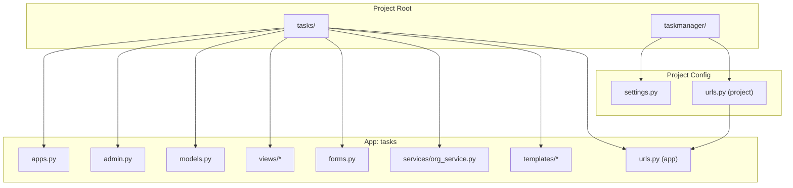
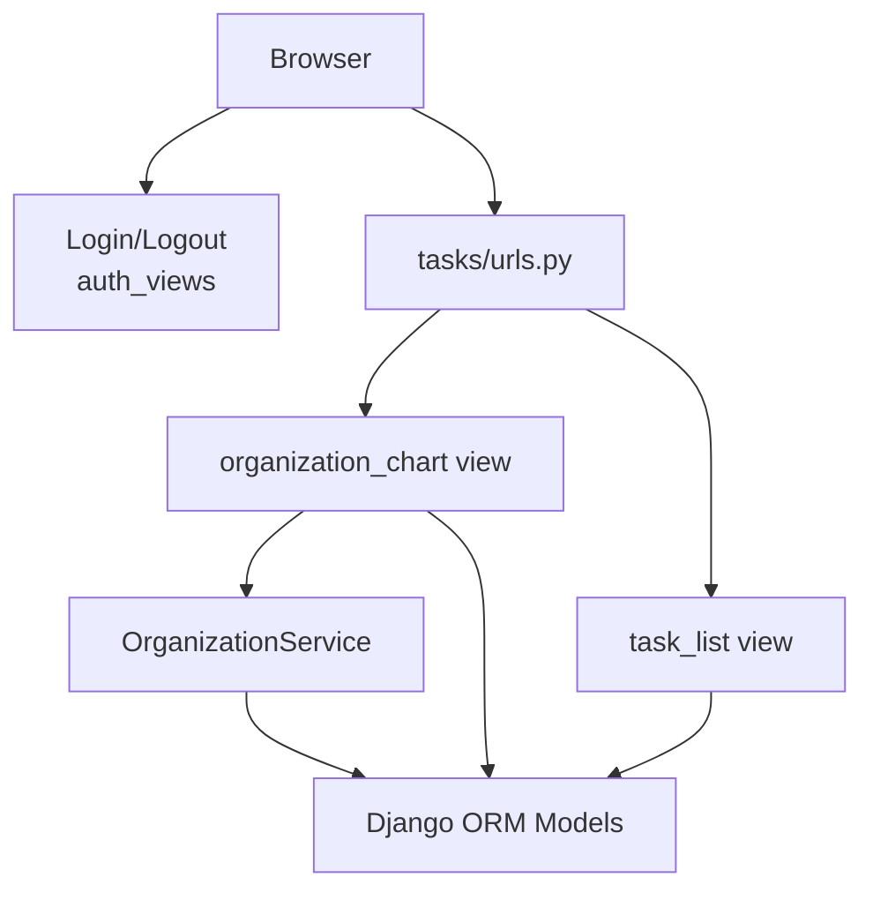
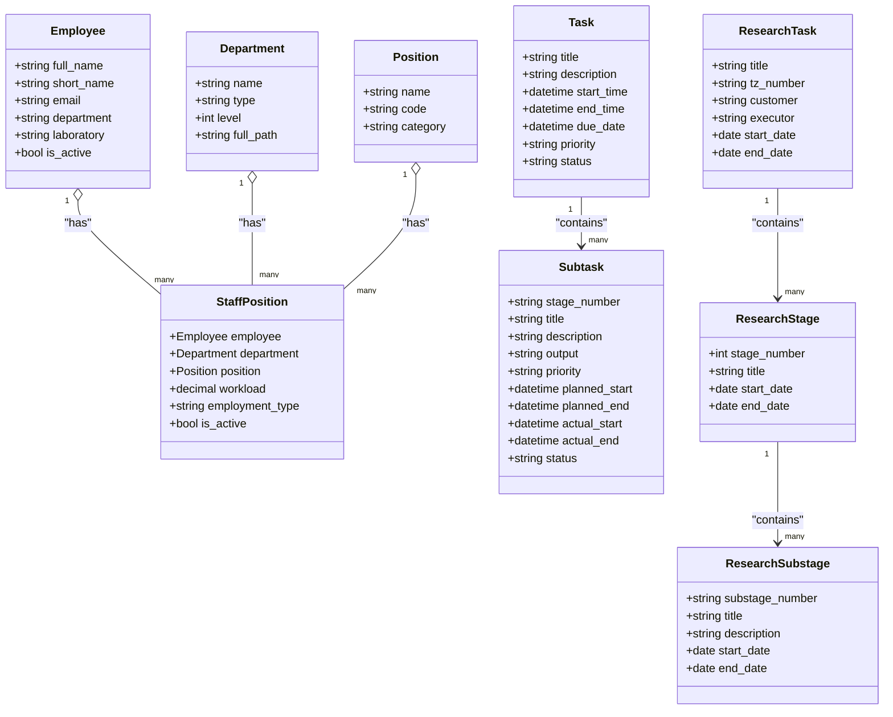
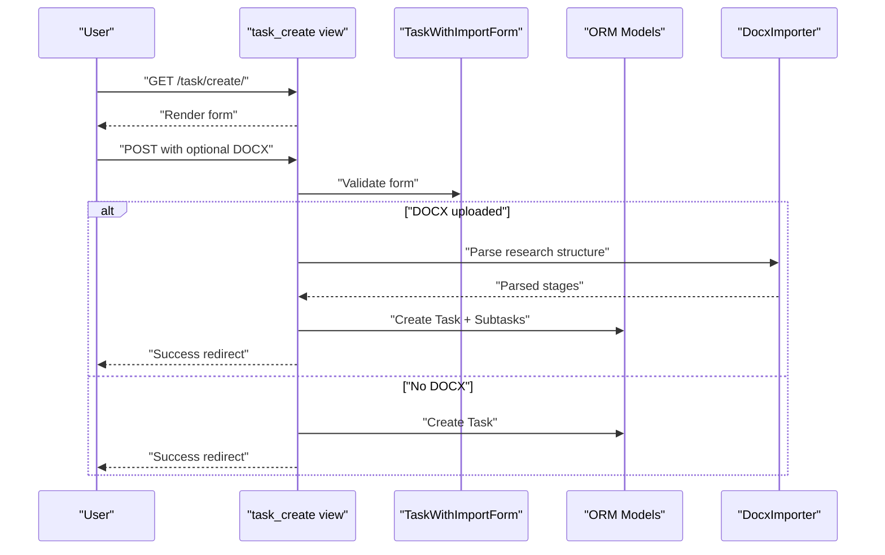
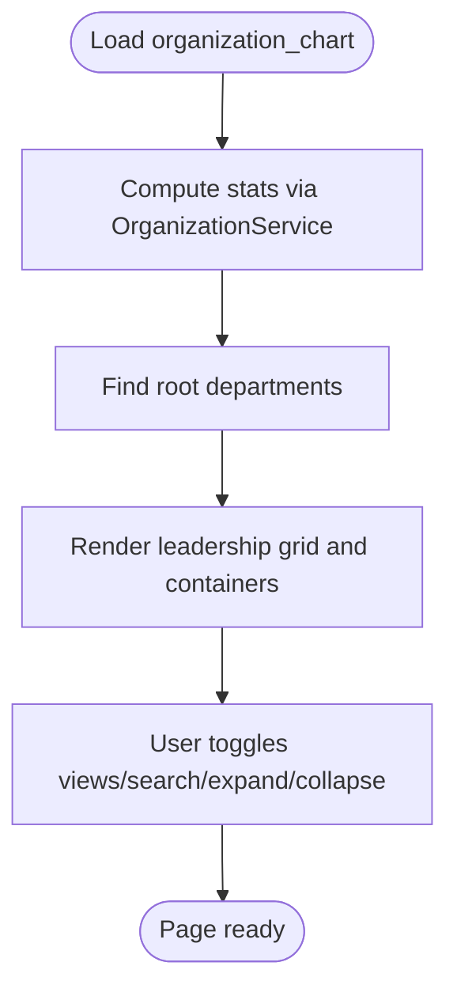
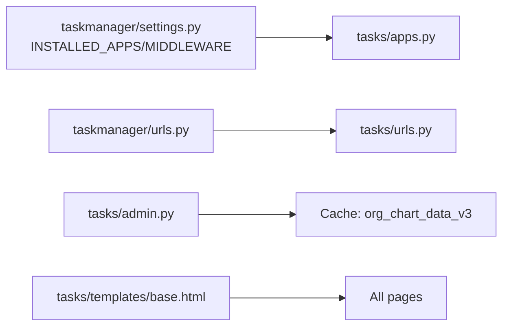

# Project Overview

<cite>
**Referenced Files in This Document**
- [settings.py](file://taskmanager/settings.py)
- [urls.py](file://taskmanager/urls.py)
- [urls.py](file://tasks/urls.py)
- [models.py](file://tasks/models.py)
- [admin.py](file://tasks/admin.py)
- [apps.py](file://tasks/apps.py)
- [base.html](file://tasks/templates/base.html)
- [organization_chart.html](file://tasks/templates/tasks/organization_chart.html)
- [org_service.py](file://tasks/services/org_service.py)
- [task_views.py](file://tasks/views/task_views.py)
- [forms.py](file://tasks/forms.py)
</cite>

## Table of Contents
1. [Introduction](#introduction)
2. [Project Structure](#project-structure)
3. [Core Components](#core-components)
4. [Architecture Overview](#architecture-overview)
5. [Detailed Component Analysis](#detailed-component-analysis)
6. [Dependency Analysis](#dependency-analysis)
7. [Performance Considerations](#performance-considerations)
8. [Troubleshooting Guide](#troubleshooting-guide)
9. [Conclusion](#conclusion)

## Introduction
This Task Manager project is a Django-based web application designed to support organizational task and project management, with a strong focus on scientific research institutions. It provides integrated capabilities for managing daily tasks, tracking multi-level research projects (НИР), organizing employee records, and visualizing organizational structure. The platform targets institutional users who need structured planning, reporting, and collaboration across hierarchical departments, laboratories, and working groups.

Key value propositions:
- Scientific research-aligned modeling of multi-stage research projects with clear performer assignments
- Integrated task management with time tracking and status controls
- Organizational structure visualization and department/employee administration
- Import workflows for research documents and staff data to accelerate onboarding
- Role-based access with login/logout flows and user-scoped task ownership

## Project Structure
The project follows a standard Django layout with a single reusable app (tasks) and a minimal project-level configuration. The application exposes a set of URL endpoints grouped by functional areas (tasks, employees, research, products, imports, dashboards), and renders templates layered over a shared base.

**Diagram sources**
- [settings.py:38-47](file://taskmanager/settings.py#L38-L47)
- [urls.py:6-11](file://taskmanager/urls.py#L6-L11)
- [urls.py:38-100](file://tasks/urls.py#L38-L100)
- [apps.py:3-8](file://tasks/apps.py#L3-L8)
- [admin.py:1-21](file://tasks/admin.py#L1-L21)
- [models.py:13-800](file://tasks/models.py#L13-L800)
- [org_service.py:4-53](file://tasks/services/org_service.py#L4-L53)
- [base.html:1-118](file://tasks/templates/base.html#L1-L118)
- [organization_chart.html:1-131](file://tasks/templates/tasks/organization_chart.html#L1-L131)

**Section sources**
- [settings.py:38-47](file://taskmanager/settings.py#L38-L47)
- [urls.py:6-11](file://taskmanager/urls.py#L6-L11)
- [urls.py:38-100](file://tasks/urls.py#L38-L100)
- [apps.py:3-8](file://tasks/apps.py#L3-L8)
- [admin.py:1-21](file://tasks/admin.py#L1-L21)
- [models.py:13-800](file://tasks/models.py#L13-L800)
- [org_service.py:4-53](file://tasks/services/org_service.py#L4-L53)
- [base.html:1-118](file://tasks/templates/base.html#L1-L118)
- [organization_chart.html:1-131](file://tasks/templates/tasks/organization_chart.html#L1-L131)

## Core Components
- Models and data domains
  - Task: user-owned tasks with priority/status, optional time tracking, and assignment to Employees
  - Subtask: stages within a Task with performers, responsible person, and progress tracking
  - ResearchTask, ResearchStage, ResearchSubstage: multi-level research project hierarchy aligned to institutional needs
  - Employee, Department, Position, StaffPosition: organizational structure and employment relationships
  - ResearchProduct and ProductPerformer: scientific output tracking and performer roles
- Views and routing
  - URL patterns expose CRUD and specialized workflows for tasks, employees, research items, products, and imports
  - Views implement filtering, sorting, search, AJAX updates, and import flows
- Forms and validation
  - Model forms for tasks, research stages/substages, and import scenarios with client-side constraints
- Services
  - OrganizationService encapsulates optimized queries for organizational structure rendering and statistics
- Templates and UI
  - Shared base template with navigation, Bootstrap integration, and reusable blocks
  - Organization chart page with interactive views and statistics cards

**Section sources**
- [models.py:165-238](file://tasks/models.py#L165-L238)
- [models.py:239-382](file://tasks/models.py#L239-L382)
- [models.py:384-531](file://tasks/models.py#L384-L531)
- [models.py:532-678](file://tasks/models.py#L532-L678)
- [models.py:681-791](file://tasks/models.py#L681-L791)
- [urls.py:38-100](file://tasks/urls.py#L38-L100)
- [forms.py:5-44](file://tasks/forms.py#L5-L44)
- [forms.py:96-140](file://tasks/forms.py#L96-L140)
- [forms.py:164-200](file://tasks/forms.py#L164-L200)
- [org_service.py:4-53](file://tasks/services/org_service.py#L4-L53)
- [base.html:27-92](file://tasks/templates/base.html#L27-L92)
- [organization_chart.html:10-126](file://tasks/templates/tasks/organization_chart.html#L10-L126)

## Architecture Overview
The system follows a classic Django MTV pattern: URLs route to views, views fetch data via models and services, and templates render the UI. Authentication is enforced at the view level, and the project integrates caching hooks for organizational charts.

**Diagram sources**
- [urls.py:38-100](file://tasks/urls.py#L38-L100)
- [task_views.py:19-69](file://tasks/views/task_views.py#L19-L69)
- [org_service.py:4-53](file://tasks/services/org_service.py#L4-L53)
- [models.py:532-678](file://tasks/models.py#L532-L678)

**Section sources**
- [urls.py:38-100](file://tasks/urls.py#L38-L100)
- [task_views.py:19-69](file://tasks/views/task_views.py#L19-L69)
- [org_service.py:4-53](file://tasks/services/org_service.py#L4-L53)
- [models.py:532-678](file://tasks/models.py#L532-L678)

## Detailed Component Analysis

### Data Model Overview
The data model centers around Tasks and Subtasks for day-to-day work, and a multi-level hierarchy (ResearchTask → ResearchStage → ResearchSubstage) for scientific projects. Employees are linked to Departments and Positions through StaffPosition, enabling hierarchical organization and workload tracking.

**Diagram sources**
- [models.py:13-163](file://tasks/models.py#L13-L163)
- [models.py:532-678](file://tasks/models.py#L532-L678)
- [models.py:165-238](file://tasks/models.py#L165-L238)
- [models.py:239-382](file://tasks/models.py#L239-L382)
- [models.py:384-531](file://tasks/models.py#L384-L531)

**Section sources**
- [models.py:13-163](file://tasks/models.py#L13-L163)
- [models.py:532-678](file://tasks/models.py#L532-L678)
- [models.py:165-238](file://tasks/models.py#L165-L238)
- [models.py:239-382](file://tasks/models.py#L239-L382)
- [models.py:384-531](file://tasks/models.py#L384-L531)

### Task Management Workflow
The task management flow supports creation with optional research document import, assignment to employees, time tracking, and status transitions. Filtering, search, and sorting are supported on the task list.

**Diagram sources**
- [task_views.py:79-179](file://tasks/views/task_views.py#L79-L179)
- [forms.py:164-200](file://tasks/forms.py#L164-L200)
- [models.py:165-238](file://tasks/models.py#L165-L238)
- [models.py:239-382](file://tasks/models.py#L239-L382)

**Section sources**
- [task_views.py:79-179](file://tasks/views/task_views.py#L79-L179)
- [forms.py:164-200](file://tasks/forms.py#L164-L200)
- [models.py:165-238](file://tasks/models.py#L165-L238)
- [models.py:239-382](file://tasks/models.py#L239-L382)

### Organizational Structure Visualization
The organization chart page aggregates statistics, presents leadership cards, and offers interactive views (tree, compact, cards) with expand/collapse and search capabilities. It leverages OrganizationService to prefetch related data efficiently.

**Diagram sources**
- [organization_chart.html:10-126](file://tasks/templates/tasks/organization_chart.html#L10-L126)
- [org_service.py:17-23](file://tasks/services/org_service.py#L17-L23)
- [org_service.py:35-39](file://tasks/services/org_service.py#L35-L39)

**Section sources**
- [organization_chart.html:10-126](file://tasks/templates/tasks/organization_chart.html#L10-L126)
- [org_service.py:17-23](file://tasks/services/org_service.py#L17-L23)
- [org_service.py:35-39](file://tasks/services/org_service.py#L35-L39)

## Dependency Analysis
- App registration and middleware
  - The tasks app is registered in INSTALLED_APPS, and RequestLogMiddleware is included in MIDDLEWARE
- URL composition
  - Project-level urls.py includes app-level urls.py under the empty namespace
- Admin integration
  - Admin clears organization chart cache after Department changes to keep the visualization consistent
- Template inheritance
  - All pages extend base.html, ensuring consistent navigation and assets

**Diagram sources**
- [settings.py:38-61](file://taskmanager/settings.py#L38-L61)
- [apps.py:3-8](file://tasks/apps.py#L3-L8)
- [urls.py:6-11](file://taskmanager/urls.py#L6-L11)
- [urls.py:38-100](file://tasks/urls.py#L38-L100)
- [admin.py:11-19](file://tasks/admin.py#L11-L19)
- [base.html:1-118](file://tasks/templates/base.html#L1-L118)

**Section sources**
- [settings.py:38-61](file://taskmanager/settings.py#L38-L61)
- [apps.py:3-8](file://tasks/apps.py#L3-L8)
- [urls.py:6-11](file://taskmanager/urls.py#L6-L11)
- [urls.py:38-100](file://tasks/urls.py#L38-L100)
- [admin.py:11-19](file://tasks/admin.py#L11-L19)
- [base.html:1-118](file://tasks/templates/base.html#L1-L118)

## Performance Considerations
- Database access optimization
  - OrganizationService uses prefetch_related and select_related to minimize N+1 queries when rendering the organization chart
  - Model indexes are defined on frequently filtered/sorted fields (e.g., status, priority, due_date, parent, type)
- Caching
  - Cache keys for organization charts are explicitly managed in admin to avoid stale data after structural changes
- Logging and monitoring
  - Dedicated log handlers for general, Django, and tasks logs facilitate operational visibility

**Section sources**
- [org_service.py:10-14](file://tasks/services/org_service.py#L10-L14)
- [org_service.py:28-32](file://tasks/services/org_service.py#L28-L32)
- [models.py:62-67](file://tasks/models.py#L62-L67)
- [models.py:203-209](file://tasks/models.py#L203-L209)
- [models.py:312-317](file://tasks/models.py#L312-L317)
- [models.py:565-571](file://tasks/models.py#L565-L571)
- [admin.py:11-19](file://tasks/admin.py#L11-L19)
- [settings.py:180-249](file://taskmanager/settings.py#L180-L249)

## Troubleshooting Guide
- Authentication redirects
  - LOGIN_URL, LOGIN_REDIRECT_URL, and LOGOUT_REDIRECT_URL are configured in settings to control login/logout behavior
- Logging configuration
  - Console and rotating file handlers are defined; tasks-specific logs are separated for easier debugging
- Middleware and compression
  - GZipMiddleware is enabled; static file compression settings are present but disabled by default
- Database configuration
  - DATABASES uses dj_database_url with a SQLite fallback; ensure DATABASE_URL is set appropriately in production

**Section sources**
- [settings.py:164-166](file://taskmanager/settings.py#L164-L166)
- [settings.py:180-249](file://taskmanager/settings.py#L180-L249)
- [settings.py:49-61](file://taskmanager/settings.py#L49-L61)
- [settings.py:106-110](file://taskmanager/settings.py#L106-L110)

## Conclusion
This Task Manager provides a focused, research-oriented solution built on Django. Its modular design—centered on Tasks, Subtasks, and the multi-level Research hierarchy—combined with robust organizational modeling and visualization, enables scientific institutions to coordinate complex workflows, track deliverables, and maintain clear structure. The separation of concerns across models, views, services, and templates, along with practical caching and logging strategies, positions the system for maintainability and scalability.