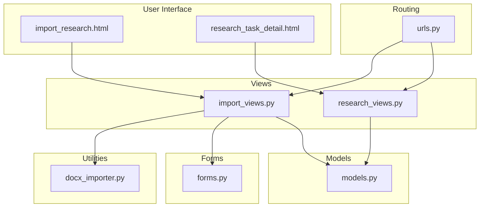
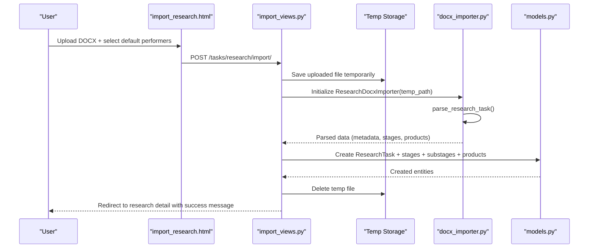
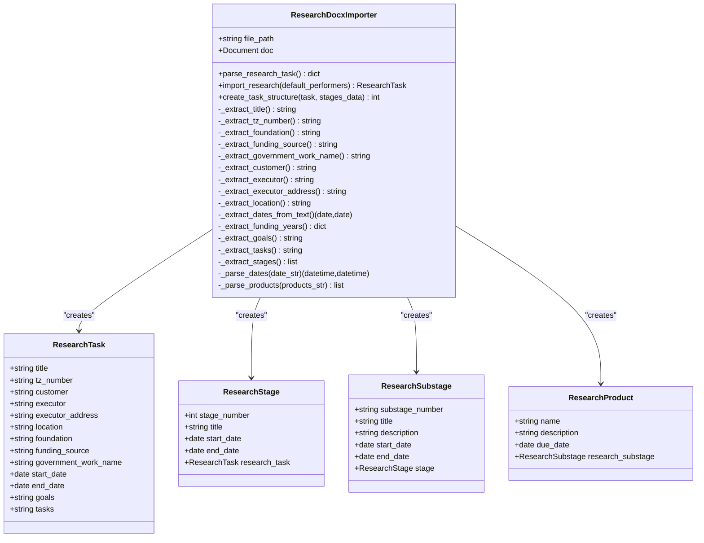
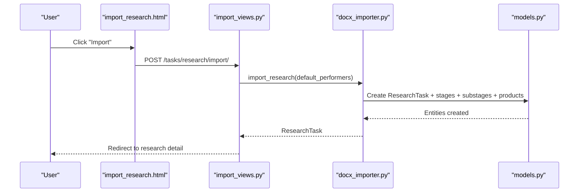
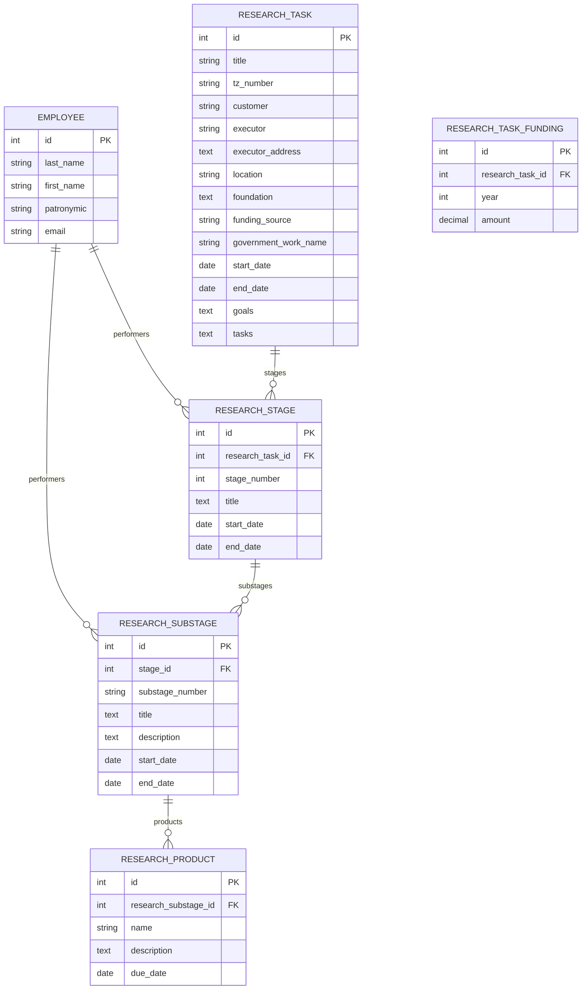
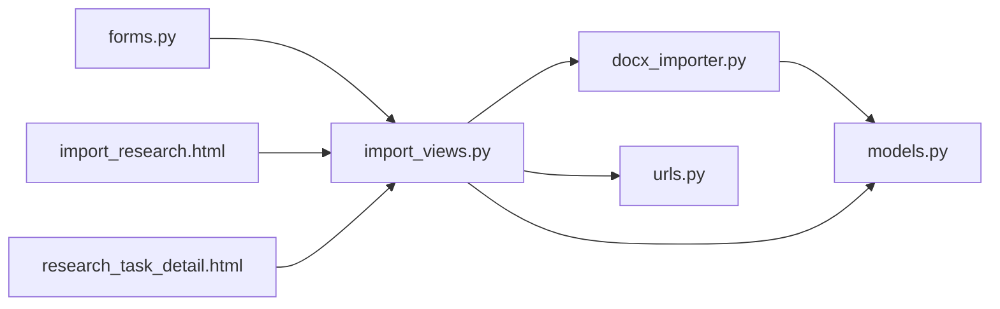

# DOCX Import System

<cite>
**Referenced Files in This Document**
- [docx_importer.py](file://tasks/utils/docx_importer.py)
- [import_views.py](file://tasks/views/import_views.py)
- [research_views.py](file://tasks/views/research_views.py)
- [models.py](file://tasks/models.py)
- [forms.py](file://tasks/forms.py)
- [urls.py](file://tasks/urls.py)
- [import_research.html](file://tasks/templates/tasks/import_research.html)
- [research_task_detail.html](file://tasks/templates/tasks/research_task_detail.html)
- [test_import.py](file://test_import.py)
</cite>

## Table of Contents
1. [Introduction](#introduction)
2. [Project Structure](#project-structure)
3. [Core Components](#core-components)
4. [Architecture Overview](#architecture-overview)
5. [Detailed Component Analysis](#detailed-component-analysis)
6. [Dependency Analysis](#dependency-analysis)
7. [Performance Considerations](#performance-considerations)
8. [Troubleshooting Guide](#troubleshooting-guide)
9. [Conclusion](#conclusion)
10. [Appendices](#appendices)

## Introduction
The DOCX Import System enables automated ingestion of research project documents (Technical Specifications or "Техническое задание") into the research management platform. It parses DOCX content to extract metadata, funding information, goals, tasks, and structured stages/substages with associated deliverables. The system supports two primary workflows:
- Direct import from a DOCX file into a new research project with automatically created stages, substages, and deliverables.
- Preview mode to inspect parsed content before committing to import.

The system integrates with Django forms, views, and models to create ResearchTask, ResearchStage, ResearchSubstage, and ResearchProduct entities, and assigns default performers and responsible parties when provided.

## Project Structure
The DOCX Import System spans several modules:
- Utilities: DOCX parsing and import logic
- Views: Request handling, temporary file management, and response rendering
- Forms: Validation and UI controls for import operations
- Models: Research domain entities and relationships
- Templates: User interface for import and preview
- URLs: Routing for import endpoints

**Diagram sources**
- [import_research.html](file://tasks/templates/tasks/import_research.html)
- [research_task_detail.html](file://tasks/templates/tasks/research_task_detail.html)
- [import_views.py](file://tasks/views/import_views.py)
- [research_views.py](file://tasks/views/research_views.py)
- [forms.py](file://tasks/forms.py)
- [docx_importer.py](file://tasks/utils/docx_importer.py)
- [models.py](file://tasks/models.py)
- [urls.py](file://tasks/urls.py)

**Section sources**
- [import_research.html](file://tasks/templates/tasks/import_research.html)
- [research_task_detail.html](file://tasks/templates/tasks/research_task_detail.html)
- [import_views.py](file://tasks/views/import_views.py)
- [research_views.py](file://tasks/views/research_views.py)
- [forms.py](file://tasks/forms.py)
- [docx_importer.py](file://tasks/utils/docx_importer.py)
- [models.py](file://tasks/models.py)
- [urls.py](file://tasks/urls.py)

## Core Components
- ResearchDocxImporter: Parses DOCX content and constructs a structured representation suitable for creating research entities.
- Import Views: Handle file upload, temporary storage, parsing, and creation of research entities; provide preview functionality.
- Research Forms: Validate user input and provide UI controls for selecting default performers/responsible parties.
- Research Models: Define ResearchTask, ResearchStage, ResearchSubstage, ResearchProduct, and related relationships.
- URL Routing: Exposes endpoints for import, preview, and research detail pages.

Key responsibilities:
- Text extraction: Title, customer, executor, address, location, funding source, government work name, foundation, goals, tasks, and date ranges.
- Table processing: Funding per year, goals/tasks, and stages/substages with products.
- Metadata extraction: TZ number, dates, performers, responsible parties.
- Validation: Form-level validation and runtime error handling.
- Transformation: Converting parsed strings into model instances and relationships.
- Integration: Creating ResearchTask, ResearchStage, ResearchSubstage, and ResearchProduct; assigning performers and responsible parties.

**Section sources**
- [docx_importer.py](file://tasks/utils/docx_importer.py)
- [import_views.py](file://tasks/views/import_views.py)
- [forms.py](file://tasks/forms.py)
- [models.py](file://tasks/models.py)

## Architecture Overview
The import pipeline follows a clear flow from user input to persisted research entities.

**Diagram sources**
- [import_research.html](file://tasks/templates/tasks/import_research.html)
- [import_views.py](file://tasks/views/import_views.py)
- [docx_importer.py](file://tasks/utils/docx_importer.py)
- [models.py](file://tasks/models.py)

## Detailed Component Analysis

### ResearchDocxImporter
Responsibilities:
- Load DOCX and iterate paragraphs/tables.
- Extract metadata fields using pattern matching and text parsing.
- Parse funding by year from tables.
- Extract goals and tasks from designated tables.
- Parse stages and substages from a table with a specific structure (columns and row characteristics).
- Parse scientific products from stage/substage descriptions.
- Create research entities via Django ORM and assign default performers.

Parsing logic highlights:
- Title extraction uses patterns around "по теме".
- Funding per year extraction uses numeric patterns around year markers.
- Stages/substages detection relies on table dimensions and row content; substages are identified by dot-separated numbering under a main stage.
- Products are extracted from stage/substage product cells, filtered and normalized.

Import workflow:
- Creates ResearchTask with metadata.
- Creates ResearchStage entries with optional performers and responsible.
- Creates ResearchSubstage entries with optional performers and responsible.
- Creates ResearchProduct entries linked to ResearchSubstage.

**Diagram sources**
- [docx_importer.py](file://tasks/utils/docx_importer.py)
- [models.py](file://tasks/models.py)

**Section sources**
- [docx_importer.py](file://tasks/utils/docx_importer.py)
- [models.py](file://tasks/models.py)

### Import Views
Responsibilities:
- Handle POST requests for DOCX import.
- Manage temporary file lifecycle.
- Initialize ResearchDocxImporter and parse content.
- Create research entities and redirect to detail view.
- Provide preview endpoint to return parsed stages/products for UI feedback.

Preview flow:
- Accepts a DOCX file, parses it, and returns JSON with title, stages count, and stage details.

Error handling:
- Catches exceptions during parsing and import, adds user-friendly messages, and logs stack traces.

**Diagram sources**
- [import_research.html](file://tasks/templates/tasks/import_research.html)
- [import_views.py](file://tasks/views/import_views.py)
- [docx_importer.py](file://tasks/utils/docx_importer.py)
- [models.py](file://tasks/models.py)

**Section sources**
- [import_views.py](file://tasks/views/import_views.py)

### Research Forms
Responsibilities:
- Validate file uploads and performer selections.
- Provide UI controls for selecting default performers and responsible parties.
- Support optional fields for preview and import.

Validation highlights:
- File type validation for DOCX.
- Optional selection of default performers and responsible parties.

**Section sources**
- [forms.py](file://tasks/forms.py)

### Research Models
Domain entities and relationships:
- ResearchTask: Top-level research project with metadata and funding years.
- ResearchStage: Major stages linked to ResearchTask.
- ResearchSubstage: Sub-stages linked to ResearchStage.
- ResearchProduct: Deliverables linked to ResearchSubstage.

**Diagram sources**
- [models.py](file://tasks/models.py)

**Section sources**
- [models.py](file://tasks/models.py)

### URL Routing
Endpoints:
- POST /tasks/research/import/: Import from DOCX
- POST /task/preview-import/: Preview parsed stages/products
- GET /research/<int:task_id>/: Research detail page

**Section sources**
- [urls.py](file://tasks/urls.py)

### User Interface for Import Operations
The import page provides:
- Instructions for uploading a DOCX file.
- Selection of default performers and responsible parties.
- CSRF protection and Select2-powered multi-select controls.
- Immediate feedback via Django messages.

Preview UI:
- JSON response includes title, stages count, and stage details for quick validation before import.

**Section sources**
- [import_research.html](file://tasks/templates/tasks/import_research.html)
- [research_task_detail.html](file://tasks/templates/tasks/research_task_detail.html)

## Dependency Analysis
- Views depend on Forms for validation and on Utilities for parsing.
- Utilities depend on Models for entity creation.
- Templates depend on Views for rendering and on Models for data display.
- URL routing connects endpoints to views.

**Diagram sources**
- [forms.py](file://tasks/forms.py)
- [import_views.py](file://tasks/views/import_views.py)
- [docx_importer.py](file://tasks/utils/docx_importer.py)
- [models.py](file://tasks/models.py)
- [import_research.html](file://tasks/templates/tasks/import_research.html)
- [research_task_detail.html](file://tasks/templates/tasks/research_task_detail.html)
- [urls.py](file://tasks/urls.py)

**Section sources**
- [import_views.py](file://tasks/views/import_views.py)
- [docx_importer.py](file://tasks/utils/docx_importer.py)
- [models.py](file://tasks/models.py)
- [forms.py](file://tasks/forms.py)
- [urls.py](file://tasks/urls.py)

## Performance Considerations
- Temporary file handling: Uploaded DOCX files are saved to disk and deleted after processing. Ensure sufficient disk space and appropriate permissions.
- Regex parsing: Pattern matching for dates and funding uses regular expressions; keep patterns concise to avoid catastrophic backtracking.
- Table scanning: Stage detection scans multiple tables; ensure documents adhere to expected structure to minimize false positives.
- ORM operations: Bulk creation is not used; each entity is created individually. For very large documents, consider batching to reduce database round-trips.

## Troubleshooting Guide
Common issues and resolutions:
- Unsupported DOCX format: Ensure the file is a valid .docx and contains the expected structure (paragraphs and tables).
- Missing metadata: If title, dates, or funding are absent, verify the document matches the expected patterns.
- Stage table not detected: The parser looks for a table with specific dimensions and content. Adjust the table structure to meet expectations.
- Product parsing errors: Products are extracted from stage/substage product cells; ensure proper formatting and avoid links or overly short entries.
- Temporary file cleanup failures: If the server fails to delete the temp file, check filesystem permissions and disk space.
- Preview errors: Verify the uploaded file is readable and not corrupted.

Validation and error handling:
- Form validation ensures correct file type and optional performer selections.
- Runtime exceptions are caught and surfaced to the user with error messages.

**Section sources**
- [import_views.py](file://tasks/views/import_views.py)
- [docx_importer.py](file://tasks/utils/docx_importer.py)

## Conclusion
The DOCX Import System provides a robust mechanism to transform research project documents into structured research entities. It supports metadata extraction, funding parsing, stage/substage creation, and product assignment, with optional default performers and responsible parties. The system integrates seamlessly with Django forms, views, models, and templates, offering both import and preview capabilities for reliable data ingestion.

## Appendices

### Supported DOCX Formats and Structure Requirements
- File format: .docx
- Required elements:
  - Title extraction area near "по теме"
  - Metadata paragraphs for customer, executor, address, location, funding source, government work name, foundation
  - Date range paragraph for start/end dates
  - Funding table with year and amount patterns
  - Goals table (index 2)
  - Tasks table (index 3)
  - Stages table with four columns and rows containing stage numbers, titles, products, and date ranges

### Import Validation Criteria
- File type: .docx
- Performers: Optional; if selected, assigned to stages and substages
- Responsible: Optional; assigned to stages and substages
- Stage table: Four columns, significant row count, stage numbers as integers or dot-separated decimals
- Products: Non-empty, non-link entries, filtered by length and punctuation

### Practical Examples
- Importing a research proposal: Upload a DOCX containing the required metadata and tables; review preview; confirm import to create ResearchTask, stages, substages, and products.
- Project description processing: Ensure goals and tasks tables are present; the system extracts and stores them as part of the ResearchTask record.
- Deliverable specifications: Products are parsed from stage/substage product cells and stored as ResearchProduct entries linked to ResearchSubstage.

### Data Quality Checks
- Funding amounts: Cleaned and validated; non-numeric values are logged and skipped.
- Dates: Strictly parsed with awareness; invalid formats are logged and skipped.
- Products: Filtered to exclude links and very short entries; numbering prefixes removed.

### User Interface and Progress Tracking
- Import page: Clear instructions, Select2 selectors for performers/responsible, and CSRF protection.
- Preview endpoint: Returns parsed stages and products for validation before import.
- Research detail page: Displays created stages, substages, and products with progress indicators and status controls.

**Section sources**
- [import_research.html](file://tasks/templates/tasks/import_research.html)
- [research_task_detail.html](file://tasks/templates/tasks/research_task_detail.html)
- [import_views.py](file://tasks/views/import_views.py)
- [docx_importer.py](file://tasks/utils/docx_importer.py)
- [models.py](file://tasks/models.py)
- [forms.py](file://tasks/forms.py)
- [urls.py](file://tasks/urls.py)
- [test_import.py](file://test_import.py)