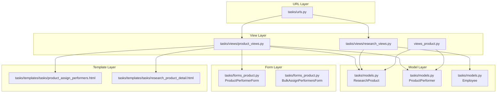
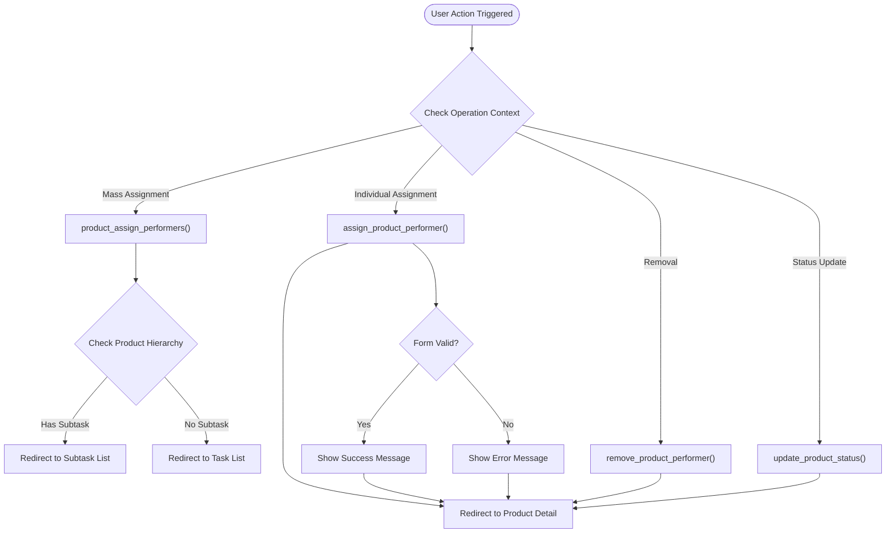
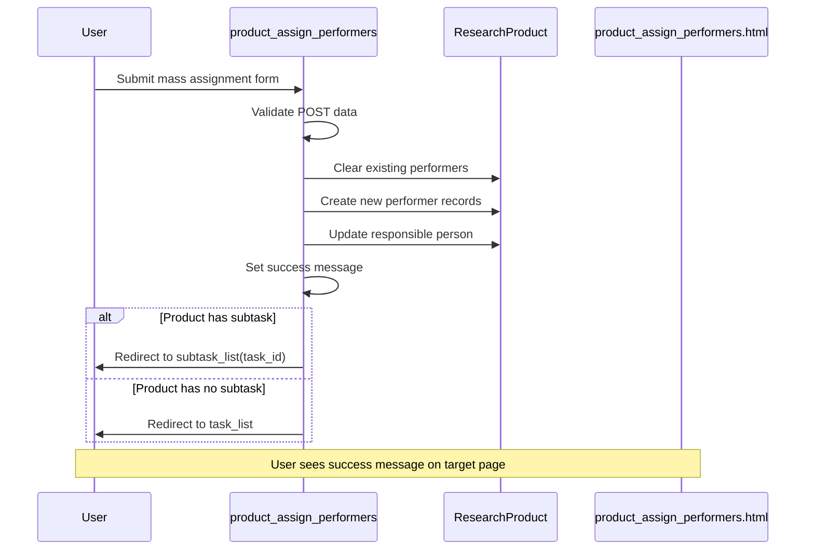
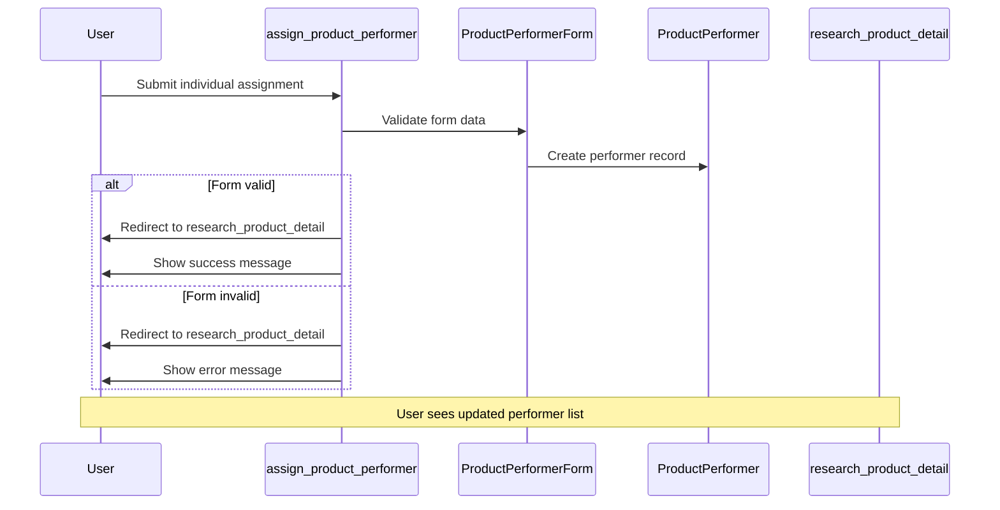
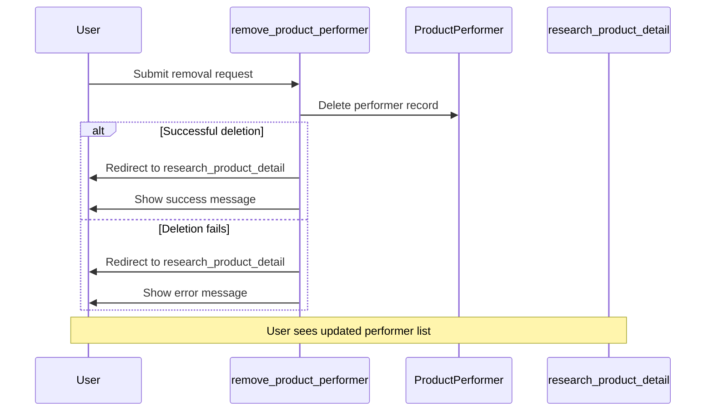
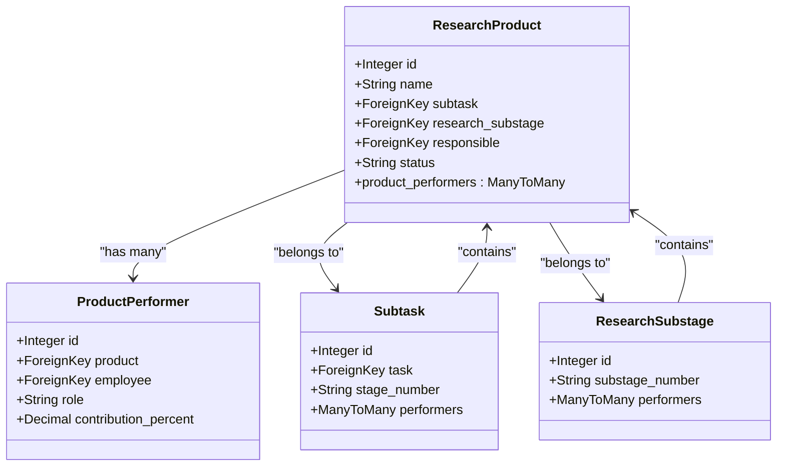
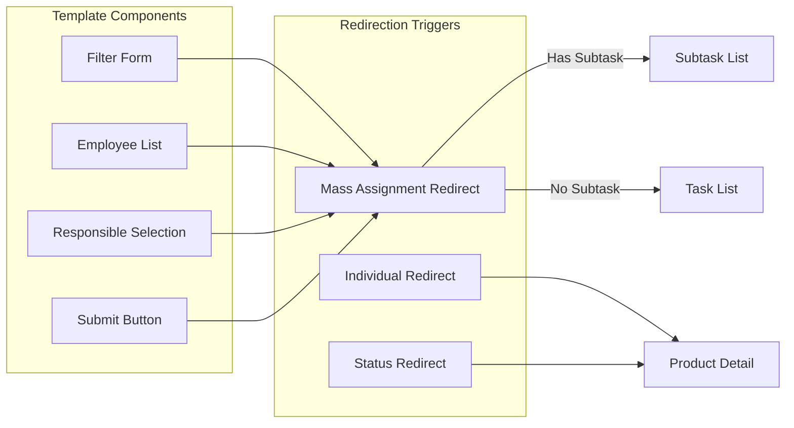
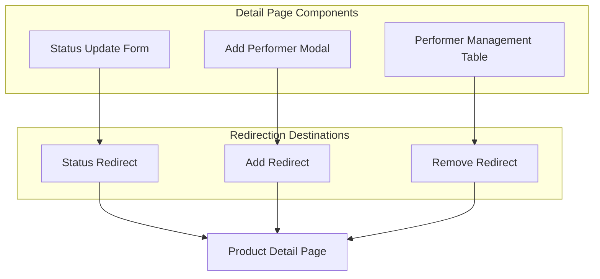
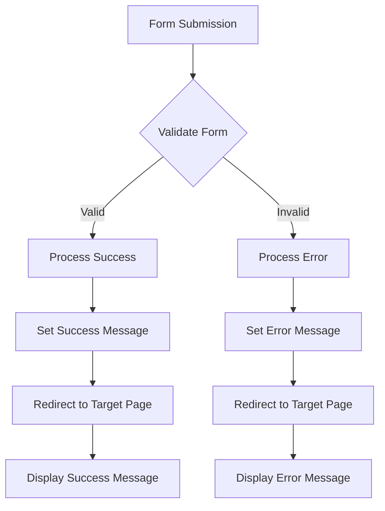

# Product Assignment Redirection Logic

<cite>
**Referenced Files in This Document**
- [tasks/views/product_views.py](file://tasks/views/product_views.py)
- [tasks/views/research_views.py](file://tasks/views/research_views.py)
- [tasks/forms_product.py](file://tasks/forms_product.py)
- [tasks/models.py](file://tasks/models.py)
- [tasks/urls.py](file://tasks/urls.py)
- [tasks/templates/tasks/product_assign_performers.html](file://tasks/templates/tasks/product_assign_performers.html)
- [tasks/templates/tasks/research_product_detail.html](file://tasks/templates/tasks/research_product_detail.html)
- [views_product.py](file://views_product.py)
</cite>

## Table of Contents
1. [Introduction](#introduction)
2. [System Architecture](#system-architecture)
3. [Redirection Logic Components](#redirection-logic-components)
4. [Core Redirection Workflows](#core-redirection-workflows)
5. [Data Model Relationships](#data-model-relationships)
6. [Template Integration](#template-integration)
7. [Error Handling and Validation](#error-handling-and-validation)
8. [Performance Considerations](#performance-considerations)
9. [Troubleshooting Guide](#troubleshooting-guide)
10. [Conclusion](#conclusion)

## Introduction

The Product Assignment Redirection Logic in this Django-based task management system governs how users are redirected after performing various operations related to assigning performers to research products. This system handles multiple redirection scenarios depending on the context of the operation, the type of product being modified, and the hierarchical relationship between research stages, substages, and products.

The redirection logic ensures users are sent to appropriate pages after:
- Mass assignment of performers to products
- Individual performer assignment
- Removal of performers from products
- Status updates of products
- Bulk performer assignments

## System Architecture

The system follows a layered architecture with clear separation between views, models, forms, and templates:

**Diagram sources**
- [tasks/urls.py:1-100](file://tasks/urls.py#L1-L100)
- [tasks/views/product_views.py:1-246](file://tasks/views/product_views.py#L1-L246)
- [tasks/views/research_views.py:1-165](file://tasks/views/research_views.py#L1-L165)
- [views_product.py:1-212](file://views_product.py#L1-L212)

## Redirection Logic Components

### Primary Redirection Functions

The system implements several key redirection functions that handle different scenarios:

**Diagram sources**
- [tasks/views/product_views.py:50-163](file://tasks/views/product_views.py#L50-L163)
- [views_product.py:81-127](file://views_product.py#L81-L127)

### Redirection Decision Matrix

| Operation Type | Context Check | Target Page | Redirect Condition |
|----------------|---------------|-------------|-------------------|
| Mass Assignment | Product has subtask? | Subtask List | Yes, if product.subtask exists |
| Mass Assignment | No subtask present | Task List | Always |
| Individual Assignment | Form validation success | Product Detail | Always |
| Removal | Operation success | Product Detail | Always |
| Status Update | Status change successful | Product Detail | Always |

**Section sources**
- [tasks/views/product_views.py:50-83](file://tasks/views/product_views.py#L50-L83)
- [tasks/views/product_views.py:166-196](file://tasks/views/product_views.py#L166-L196)
- [views_product.py:81-127](file://views_product.py#L81-L127)

## Core Redirection Workflows

### Mass Assignment Redirection Workflow

The mass assignment process follows a structured workflow that determines the appropriate redirect destination:

**Diagram sources**
- [tasks/views/product_views.py:50-83](file://tasks/views/product_views.py#L50-L83)

### Individual Assignment Redirection Workflow

Individual performer assignment follows a simpler but equally important workflow:

**Diagram sources**
- [tasks/views/product_views.py:166-182](file://tasks/views/product_views.py#L166-L182)
- [views_product.py:81-108](file://views_product.py#L81-L108)

### Removal Operation Redirection Workflow

The removal of performers maintains consistency in user navigation:

**Diagram sources**
- [tasks/views/product_views.py:185-196](file://tasks/views/product_views.py#L185-L196)
- [views_product.py:111-127](file://views_product.py#L111-L127)

## Data Model Relationships

The redirection logic relies on specific model relationships that influence redirect destinations:

**Diagram sources**
- [tasks/models.py:681-858](file://tasks/models.py#L681-L858)

**Section sources**
- [tasks/models.py:681-858](file://tasks/models.py#L681-L858)

## Template Integration

The template layer provides the user interface that triggers redirection events:

### Product Assignment Template Integration

The assignment template integrates multiple redirection scenarios:

**Diagram sources**
- [tasks/templates/tasks/product_assign_performers.html:186-280](file://tasks/templates/tasks/product_assign_performers.html#L186-L280)

### Detail Page Redirection Integration

The product detail template provides context for all redirection operations:

**Diagram sources**
- [tasks/templates/tasks/research_product_detail.html:97-220](file://tasks/templates/tasks/research_product_detail.html#L97-L220)

**Section sources**
- [tasks/templates/tasks/product_assign_performers.html:1-594](file://tasks/templates/tasks/product_assign_performers.html#L1-L594)
- [tasks/templates/tasks/research_product_detail.html:1-221](file://tasks/templates/tasks/research_product_detail.html#L1-L221)

## Error Handling and Validation

The redirection logic incorporates comprehensive error handling:

### Form Validation and Redirection

### Context-Aware Error Handling

The system handles errors differently based on the operation context:

- **Mass Assignment Errors**: Redirects to the same assignment page with error messages
- **Individual Assignment Errors**: Redirects to product detail with error messages
- **Removal Errors**: Redirects to product detail with error messages
- **Status Update Errors**: Redirects to product detail with error messages

**Section sources**
- [tasks/views/product_views.py:166-196](file://tasks/views/product_views.py#L166-L196)
- [views_product.py:81-127](file://views_product.py#L81-L127)

## Performance Considerations

The redirection logic is designed for optimal performance through several mechanisms:

### Efficient Query Patterns

The system minimizes database queries by:
- Using `select_related()` and `prefetch_related()` in view functions
- Implementing efficient filtering with `Q` objects
- Utilizing `values_list()` for simple field extraction

### Template Optimization

Templates are optimized for:
- Minimal JavaScript dependencies
- Efficient form rendering
- Proper caching of frequently accessed data

### Memory Management

The system manages memory efficiently by:
- Limiting the number of objects loaded into memory
- Using generator expressions where appropriate
- Implementing proper cleanup in view functions

## Troubleshooting Guide

### Common Redirection Issues

**Issue**: Users not redirected after form submission
- **Cause**: Missing CSRF token or invalid form data
- **Solution**: Ensure CSRF protection is enabled and form validation passes

**Issue**: Wrong redirect destination
- **Cause**: Incorrect product hierarchy detection
- **Solution**: Verify product relationships in the database

**Issue**: Error messages not displayed
- **Cause**: Session message storage issues
- **Solution**: Check Django messages framework configuration

### Debugging Redirection Logic

To debug redirection issues:

1. **Enable Logging**: Check Django logs for redirection events
2. **Inspect Context Variables**: Verify the presence of required context variables
3. **Trace Execution Flow**: Use Django debug toolbar to trace view execution
4. **Validate Model Relationships**: Ensure foreign key relationships are intact

**Section sources**
- [tasks/views/product_views.py:1-246](file://tasks/views/product_views.py#L1-L246)
- [views_product.py:1-212](file://views_product.py#L1-L212)

## Conclusion

The Product Assignment Redirection Logic provides a robust and user-friendly navigation system for managing research product performers. The implementation ensures that users are consistently directed to appropriate pages based on the operation performed and the product's hierarchical context.

Key strengths of the system include:
- **Context-Aware Redirection**: Different operations trigger different redirect destinations
- **Hierarchical Awareness**: The system considers the product's position in the research hierarchy
- **User Experience Focus**: Clear success/error messages accompany all redirections
- **Performance Optimization**: Efficient query patterns minimize loading times
- **Error Resilience**: Comprehensive error handling prevents broken user experiences

The modular design allows for easy maintenance and extension of redirection logic as the system evolves to meet changing requirements.