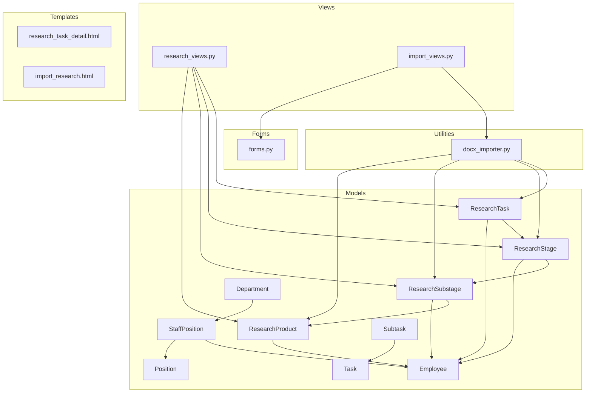
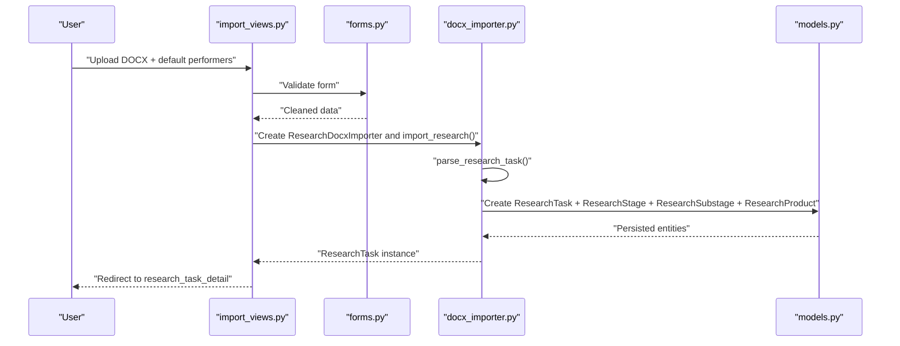
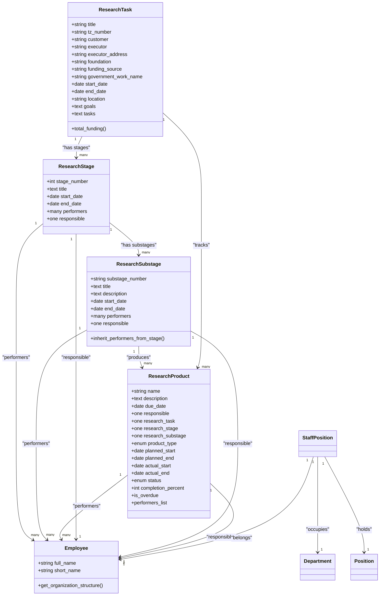
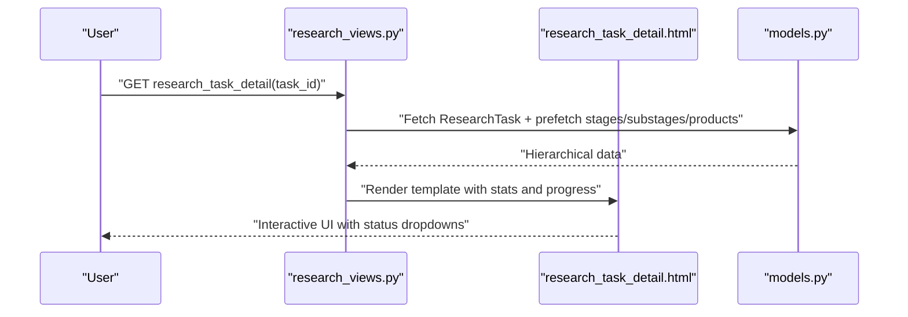
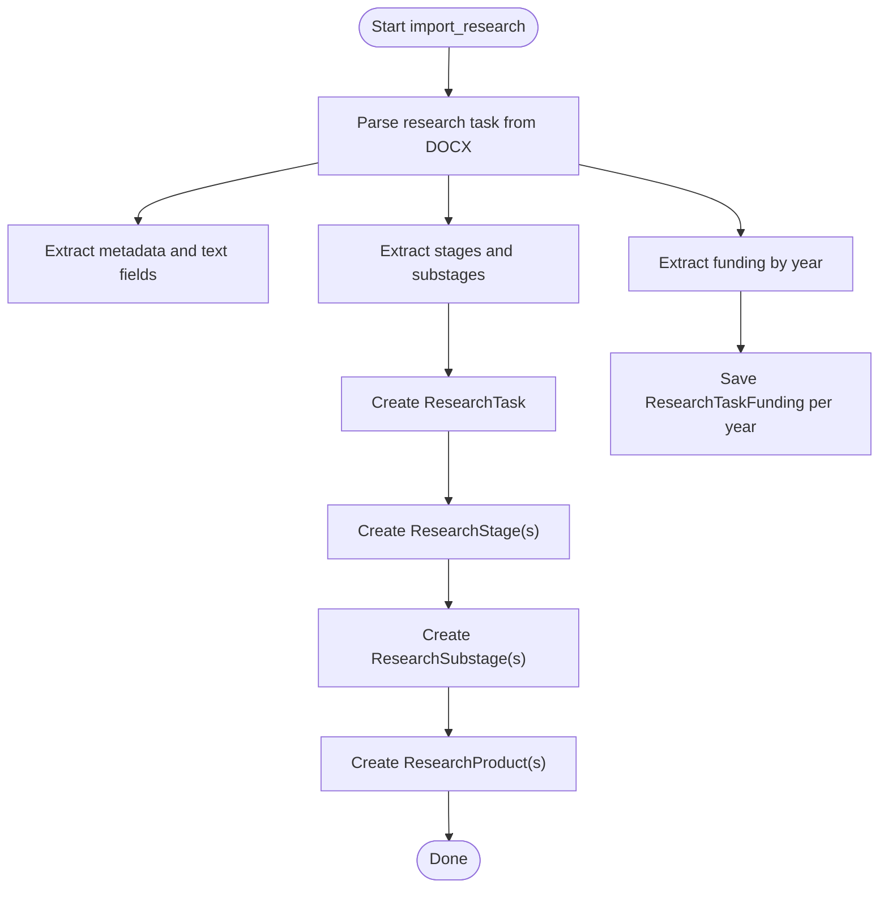
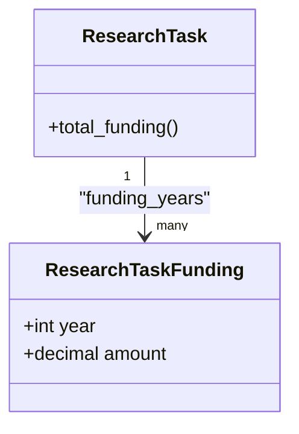
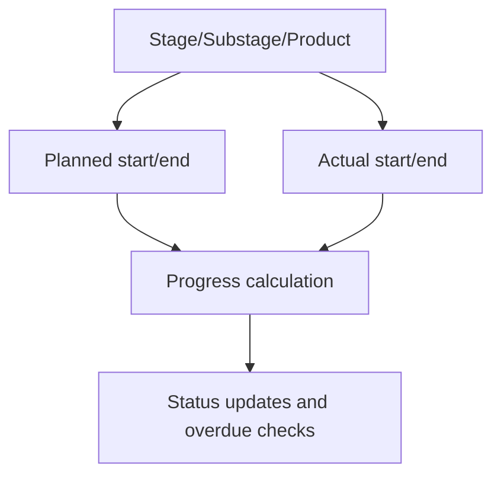
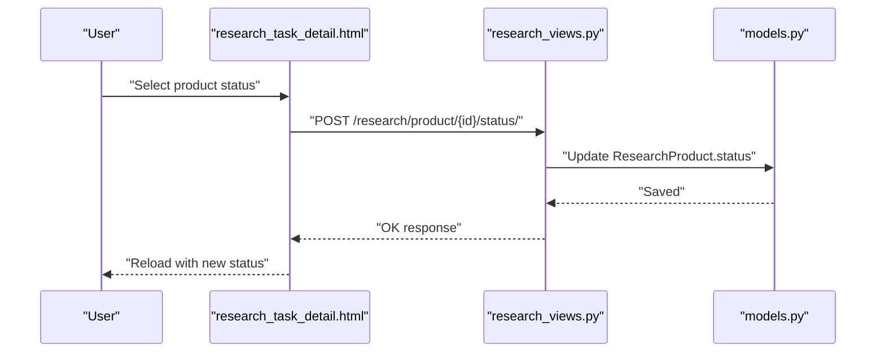
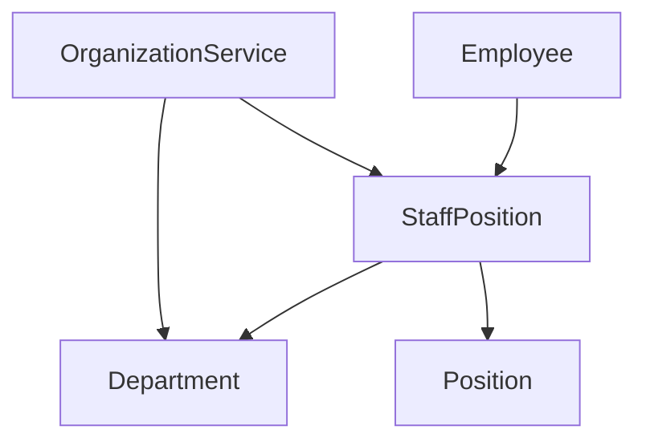
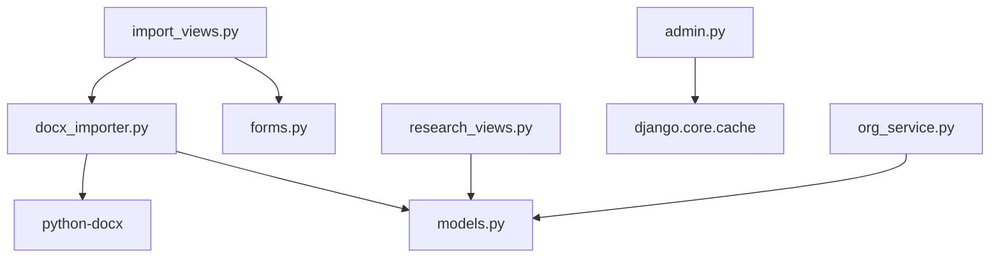

# Research Project Management

<cite>
**Referenced Files in This Document**
- [tasks/models.py](file://tasks/models.py)
- [tasks/views/research_views.py](file://tasks/views/research_views.py)
- [tasks/utils/docx_importer.py](file://tasks/utils/docx_importer.py)
- [tasks/forms.py](file://tasks/forms.py)
- [tasks/views/import_views.py](file://tasks/views/import_views.py)
- [tasks/templates/tasks/import_research.html](file://tasks/templates/tasks/import_research.html)
- [tasks/templates/tasks/research_task_detail.html](file://tasks/templates/tasks/research_task_detail.html)
- [tasks/urls.py](file://tasks/urls.py)
- [tasks/services/org_service.py](file://tasks/services/org_service.py)
- [tasks/migrations/0001_initial.py](file://tasks/migrations/0001_initial.py)
- [tasks/migrations/0002_add_m2m_performers.py](file://tasks/migrations/0002_add_m2m_performers.py)
- [tasks/migrations/0003_remove_researchproduct_performers_and_more.py](file://tasks/migrations/0003_remove_researchproduct_performers_and_more.py)
- [tasks/migrations/0004_remove_researchproduct_subtask.py](file://tasks/migrations/0004_remove_researchproduct_subtask.py)
</cite>

## Table of Contents
1. [Introduction](#introduction)
2. [Project Structure](#project-structure)
3. [Core Components](#core-components)
4. [Architecture Overview](#architecture-overview)
5. [Detailed Component Analysis](#detailed-component-analysis)
6. [Dependency Analysis](#dependency-analysis)
7. [Performance Considerations](#performance-considerations)
8. [Troubleshooting Guide](#troubleshooting-guide)
9. [Conclusion](#conclusion)
10. [Appendices](#appendices)

## Introduction
This document describes the Research Project Management system within the Task Manager application. It focuses on the hierarchical structure of research projects (ResearchTasks, ResearchStages, ResearchSubstages, and ResearchProducts), scientific workflow integration, funding management, and timeline tracking. It also documents the DOCX import functionality for research data processing, including document parsing, validation, and data extraction. The guide covers research project creation, stage management, milestone tracking, and output documentation, along with integration into the broader task management system and organizational structure. Finally, it addresses research-specific reporting, statistics generation, and compliance requirements.

## Project Structure
The system is organized around Django models, views, forms, URLs, and templates. The research domain is represented by dedicated models for tasks, stages, substages, and products, with supporting models for employees, departments, positions, and staff positions. Views handle research CRUD operations, performer assignment, and product status updates. Forms encapsulate validation and UI behavior. DOCX import utilities parse structured research documents and populate the database accordingly.

**Diagram sources**
- [tasks/models.py:384-791](file://tasks/models.py#L384-L791)
- [tasks/views/research_views.py:1-165](file://tasks/views/research_views.py#L1-L165)
- [tasks/views/import_views.py:1-113](file://tasks/views/import_views.py#L1-L113)
- [tasks/utils/docx_importer.py:6-521](file://tasks/utils/docx_importer.py#L6-L521)
- [tasks/forms.py:47-224](file://tasks/forms.py#L47-L224)
- [tasks/templates/tasks/research_task_detail.html:1-344](file://tasks/templates/tasks/research_task_detail.html#L1-L344)
- [tasks/templates/tasks/import_research.html:1-111](file://tasks/templates/tasks/import_research.html#L1-L111)

**Section sources**
- [tasks/models.py:384-791](file://tasks/models.py#L384-L791)
- [tasks/views/research_views.py:1-165](file://tasks/views/research_views.py#L1-L165)
- [tasks/views/import_views.py:1-113](file://tasks/views/import_views.py#L1-L113)
- [tasks/utils/docx_importer.py:6-521](file://tasks/utils/docx_importer.py#L6-L521)
- [tasks/forms.py:47-224](file://tasks/forms.py#L47-L224)
- [tasks/templates/tasks/research_task_detail.html:1-344](file://tasks/templates/tasks/research_task_detail.html#L1-L344)
- [tasks/templates/tasks/import_research.html:1-111](file://tasks/templates/tasks/import_research.html#L1-L111)

## Core Components
- ResearchTask: Top-level research project entity with metadata, customer/executor info, funding source, goals, tasks, and timeline.
- ResearchStage: First-level breakdown of a ResearchTask with performers and responsible person.
- ResearchSubstage: Second-level breakdown under a stage with inherited performers/responsible when applicable.
- ResearchProduct: Output items produced during substages, tracked with status, dates, responsible, and performers.
- ResearchTaskFunding: Yearly funding allocation per ResearchTask.
- Employee, Department, Position, StaffPosition: Organizational backbone for performers and assignments.
- Subtask and Task: General-purpose task hierarchy used for non-research tasks; research structures mirror this hierarchy conceptually.

Key responsibilities:
- Hierarchical modeling of research workflow from task to product.
- Funding tracking per year with aggregated totals.
- Timeline management via planned/actual start/end dates.
- Performer assignment and responsibility tracking across levels.
- DOCX import pipeline for automated creation of research structures.

**Section sources**
- [tasks/models.py:384-791](file://tasks/models.py#L384-L791)
- [tasks/migrations/0001_initial.py:33-270](file://tasks/migrations/0001_initial.py#L33-L270)
- [tasks/migrations/0003_remove_researchproduct_performers_and_more.py:62-77](file://tasks/migrations/0003_remove_researchproduct_performers_and_more.py#L62-L77)

## Architecture Overview
The system integrates research-specific models with the broader task management framework. ResearchTask mirrors the general Task concept, while ResearchStage/Substage align with Subtask. ResearchProduct captures deliverables and milestones. Import flows convert DOCX content into ResearchTask, ResearchStage, ResearchSubstage, and ResearchProduct entries. Views orchestrate CRUD, performer assignment, and status updates. Forms validate inputs and restrict selections to active employees. Templates render research dashboards and import UI.

**Diagram sources**
- [tasks/views/import_views.py:14-46](file://tasks/views/import_views.py#L14-L46)
- [tasks/forms.py:47-69](file://tasks/forms.py#L47-L69)
- [tasks/utils/docx_importer.py:442-521](file://tasks/utils/docx_importer.py#L442-L521)
- [tasks/models.py:384-791](file://tasks/models.py#L384-L791)

**Section sources**
- [tasks/views/import_views.py:14-46](file://tasks/views/import_views.py#L14-L46)
- [tasks/utils/docx_importer.py:442-521](file://tasks/utils/docx_importer.py#L442-L521)
- [tasks/models.py:384-791](file://tasks/models.py#L384-L791)

## Detailed Component Analysis

### Research Data Model Layer
The model layer defines the research hierarchy and related entities. ResearchTask encapsulates project metadata and funding source. ResearchStage and ResearchSubstage form the two-tier breakdown with performers and responsible persons. ResearchProduct represents deliverables with status and performer roles. Supporting models include Employee, Department, Position, and StaffPosition for organizational context.

**Diagram sources**
- [tasks/models.py:384-791](file://tasks/models.py#L384-L791)
- [tasks/models.py:532-678](file://tasks/models.py#L532-L678)

**Section sources**
- [tasks/models.py:384-791](file://tasks/models.py#L384-L791)
- [tasks/migrations/0001_initial.py:33-270](file://tasks/migrations/0001_initial.py#L33-L270)
- [tasks/migrations/0003_remove_researchproduct_performers_and_more.py:62-77](file://tasks/migrations/0003_remove_researchproduct_performers_and_more.py#L62-L77)

### Research Workflow Views and UI
Research views provide listing, creation, editing, and detail pages for ResearchTask, plus stage and substage detail pages. A generic performer assignment view supports stages, substages, and products. The research detail page aggregates counts and progress, lists stages with substages and products, and allows inline status updates for products.

**Diagram sources**
- [tasks/views/research_views.py:54-86](file://tasks/views/research_views.py#L54-L86)
- [tasks/templates/tasks/research_task_detail.html:174-302](file://tasks/templates/tasks/research_task_detail.html#L174-L302)
- [tasks/models.py:384-791](file://tasks/models.py#L384-L791)

**Section sources**
- [tasks/views/research_views.py:1-165](file://tasks/views/research_views.py#L1-L165)
- [tasks/templates/tasks/research_task_detail.html:1-344](file://tasks/templates/tasks/research_task_detail.html#L1-L344)

### DOCX Import Pipeline
The DOCX importer parses a structured research document and creates ResearchTask, ResearchStage, ResearchSubstage, and ResearchProduct records. It extracts metadata (title, tz_number, foundation, funding_source, government_work_name, customer, executor, executor_address, location), goals, tasks, and stages with substages and products. It also parses yearly funding and dates, then persists the hierarchy.

**Diagram sources**
- [tasks/utils/docx_importer.py:14-44](file://tasks/utils/docx_importer.py#L14-L44)
- [tasks/utils/docx_importer.py:442-521](file://tasks/utils/docx_importer.py#L442-L521)

**Section sources**
- [tasks/utils/docx_importer.py:14-44](file://tasks/utils/docx_importer.py#L14-L44)
- [tasks/utils/docx_importer.py:442-521](file://tasks/utils/docx_importer.py#L442-L521)

### Funding Management
ResearchTask stores funding-related metadata and aggregates total funding via ResearchTaskFunding. Funding is stored per year with unique constraints on (research_task, year). The detail view displays yearly allocations and the total.

**Diagram sources**
- [tasks/models.py:427-446](file://tasks/models.py#L427-L446)
- [tasks/migrations/0003_remove_researchproduct_performers_and_more.py:62-77](file://tasks/migrations/0003_remove_researchproduct_performers_and_more.py#L62-L77)

**Section sources**
- [tasks/models.py:427-446](file://tasks/models.py#L427-L446)
- [tasks/migrations/0003_remove_researchproduct_performers_and_more.py:62-77](file://tasks/migrations/0003_remove_researchproduct_performers_and_more.py#L62-L77)

### Timeline Tracking
Timeline fields are present at ResearchStage, ResearchSubstage, and ResearchProduct levels. The importer parses date ranges from text and tables. The research detail page displays stage/substage durations and product status progression.

**Diagram sources**
- [tasks/models.py:448-531](file://tasks/models.py#L448-L531)
- [tasks/models.py:681-791](file://tasks/models.py#L681-L791)

**Section sources**
- [tasks/models.py:448-531](file://tasks/models.py#L448-L531)
- [tasks/models.py:681-791](file://tasks/models.py#L681-L791)

### Research Product Status and Milestone Tracking
Products support status transitions (pending, in_progress, completed, delayed, cancelled). The detail page renders a dropdown to update status via AJAX, enabling milestone tracking and progress reporting.

**Diagram sources**
- [tasks/templates/tasks/research_task_detail.html:304-343](file://tasks/templates/tasks/research_task_detail.html#L304-L343)
- [tasks/views/research_views.py:118-165](file://tasks/views/research_views.py#L118-L165)
- [tasks/models.py:681-791](file://tasks/models.py#L681-L791)

**Section sources**
- [tasks/templates/tasks/research_task_detail.html:273-282](file://tasks/templates/tasks/research_task_detail.html#L273-L282)
- [tasks/views/research_views.py:118-165](file://tasks/views/research_views.py#L118-L165)

### Integration with Task Management and Organization
ResearchTask mirrors Task in structure and can be integrated into the broader task system. The organizational service provides hierarchical department data with staff positions and statistics. Employee profiles include organization structure helpers and active status filtering.

**Diagram sources**
- [tasks/models.py:13-162](file://tasks/models.py#L13-L162)
- [tasks/models.py:532-678](file://tasks/models.py#L532-L678)
- [tasks/services/org_service.py:1-53](file://tasks/services/org_service.py#L1-L53)

**Section sources**
- [tasks/models.py:13-162](file://tasks/models.py#L13-L162)
- [tasks/services/org_service.py:1-53](file://tasks/services/org_service.py#L1-L53)

### Research-Specific Reporting and Statistics
The research detail page computes and displays:
- Stage, substage, and product counts
- Completed product count and overall progress percentage
- Funding totals per year and aggregated total

These metrics enable research-specific reporting and compliance tracking.

**Section sources**
- [tasks/views/research_views.py:54-86](file://tasks/views/research_views.py#L54-L86)
- [tasks/models.py:427-446](file://tasks/models.py#L427-L446)

## Dependency Analysis
The research domain depends on Django ORM models and leverages Django’s built-in admin caching for organizational charts. The import pipeline depends on python-docx for parsing DOCX content and Django forms/validation for user inputs.

**Diagram sources**
- [tasks/utils/docx_importer.py:1-12](file://tasks/utils/docx_importer.py#L1-L12)
- [tasks/views/import_views.py:1-10](file://tasks/views/import_views.py#L1-L10)
- [tasks/admin.py:1-21](file://tasks/admin.py#L1-L21)
- [tasks/services/org_service.py:1-2](file://tasks/services/org_service.py#L1-L2)

**Section sources**
- [tasks/utils/docx_importer.py:1-12](file://tasks/utils/docx_importer.py#L1-L12)
- [tasks/views/import_views.py:1-10](file://tasks/views/import_views.py#L1-L10)
- [tasks/admin.py:1-21](file://tasks/admin.py#L1-L21)
- [tasks/services/org_service.py:1-2](file://tasks/services/org_service.py#L1-L2)

## Performance Considerations
- Use prefetch_related in research detail views to minimize N+1 queries when rendering stages, substages, and products.
- Apply database indexes on frequently filtered fields (status, priority, dates) to improve query performance.
- Cache organizational chart data after administrative changes to avoid repeated computation.
- Batch operations during import to reduce transaction overhead.
- Validate DOCX content early to fail fast and avoid unnecessary persistence.

## Troubleshooting Guide
Common issues and resolutions:
- DOCX parsing errors: Verify the document structure matches expected patterns (titles, tables, date formats). Use preview_import to inspect parsed data before committing.
- Missing performers: Ensure default performers are selected in the import form; the importer assigns them to stages and substages.
- Status update failures: Confirm AJAX endpoint availability and CSRF token handling in the template.
- Funding discrepancies: Check unique constraints on (research_task, year) and ensure years are correctly parsed.
- Overdue checks: Products and stages use timezone-aware datetimes; ensure server timezone settings are correct.

**Section sources**
- [tasks/views/import_views.py:48-75](file://tasks/views/import_views.py#L48-L75)
- [tasks/utils/docx_importer.py:120-131](file://tasks/utils/docx_importer.py#L120-L131)
- [tasks/templates/tasks/research_task_detail.html:304-343](file://tasks/templates/tasks/research_task_detail.html#L304-L343)

## Conclusion
The Research Project Management system provides a robust, hierarchical framework for managing scientific workflows, integrating DOCX-based research intake, performer assignment, timeline tracking, and product status monitoring. Its design cleanly separates concerns across models, views, forms, and utilities, while leveraging Django’s ORM and admin ecosystem. The system supports research-specific reporting and compliance through structured metadata, funding tracking, and milestone visibility.

## Appendices

### URL Endpoints for Research Features
- List research tasks: GET /research/
- Create research task: GET/POST /research/create/
- View research task: GET /research/{task_id}/
- Edit research task: GET/POST /research/{task_id}/edit/
- Stage detail: GET /research/stage/{stage_id}/
- Substage detail: GET /research/substage/{substage_id}/
- Assign performers: GET/POST /research/assign/{item_type}/{item_id}/
- Product detail: GET /research/product/{product_id}/
- Update product status: POST /research/product/{product_id}/status/
- Import research from DOCX: GET/POST /research/import/
- Preview import: POST /task/preview-import/

**Section sources**
- [tasks/urls.py:73-100](file://tasks/urls.py#L73-L100)

### Database Schema Highlights
- ResearchTask: title, tz_number, customer, executor, foundation, funding_source, government_work_name, start_date, end_date, location, goals, tasks.
- ResearchStage: research_task, stage_number, title, start_date, end_date, performers, responsible.
- ResearchSubstage: stage, substage_number, title, description, start_date, end_date, performers, responsible.
- ResearchProduct: name, description, due_date, responsible, research_task, research_stage, research_substage, product_type, planned_start, planned_end, actual_start, actual_end, status, completion_percent, notes.
- ResearchTaskFunding: research_task, year, amount.

**Section sources**
- [tasks/migrations/0001_initial.py:33-270](file://tasks/migrations/0001_initial.py#L33-L270)
- [tasks/migrations/0003_remove_researchproduct_performers_and_more.py:62-77](file://tasks/migrations/0003_remove_researchproduct_performers_and_more.py#L62-L77)
- [tasks/migrations/0004_remove_researchproduct_subtask.py:13-17](file://tasks/migrations/0004_remove_researchproduct_subtask.py#L13-L17)