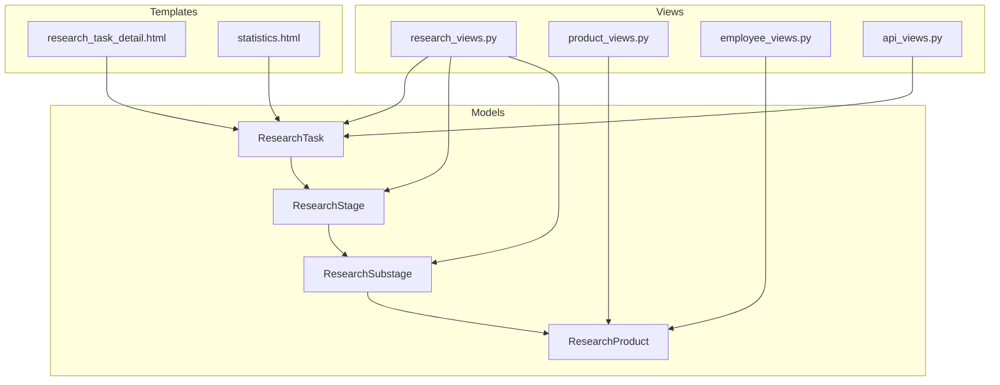
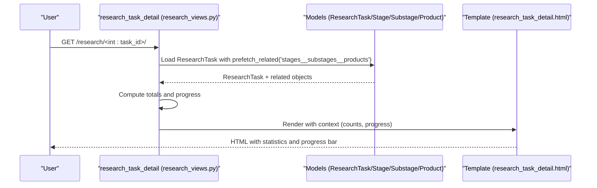
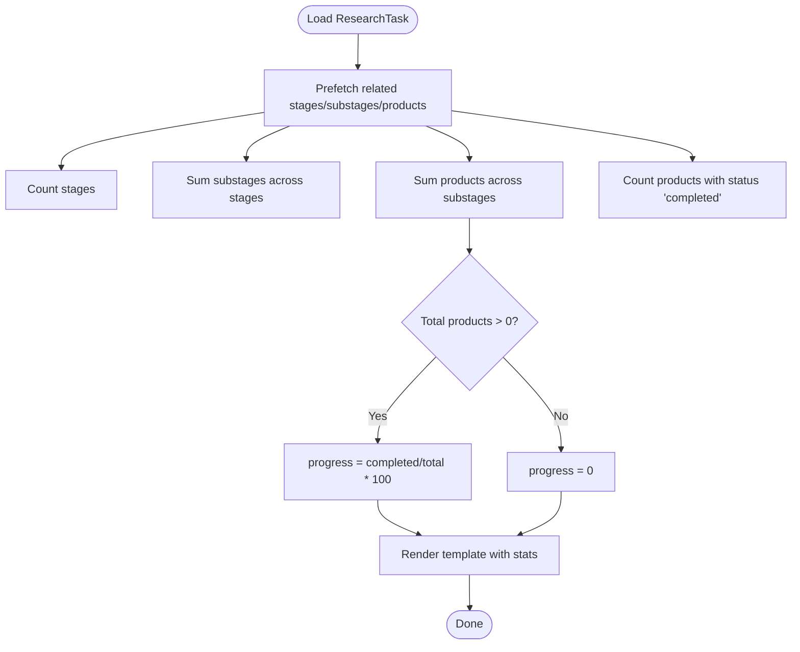
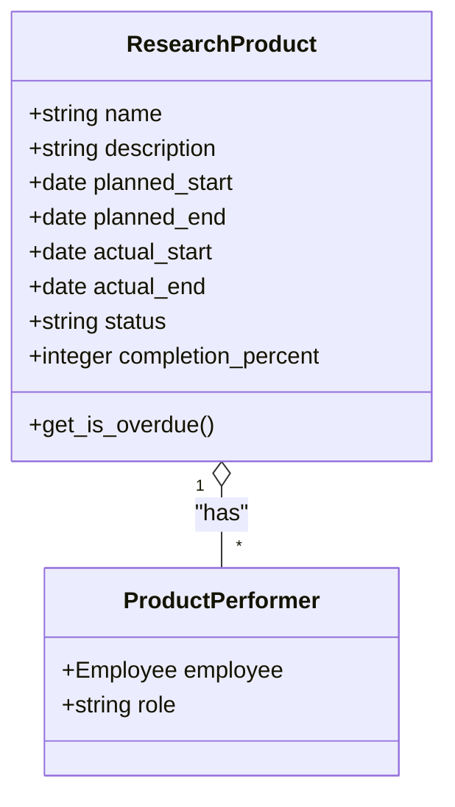
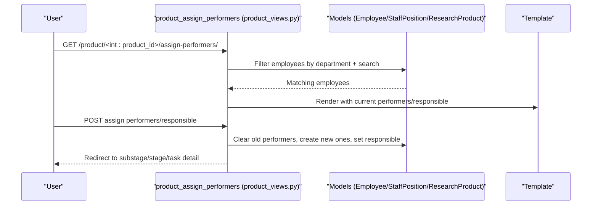
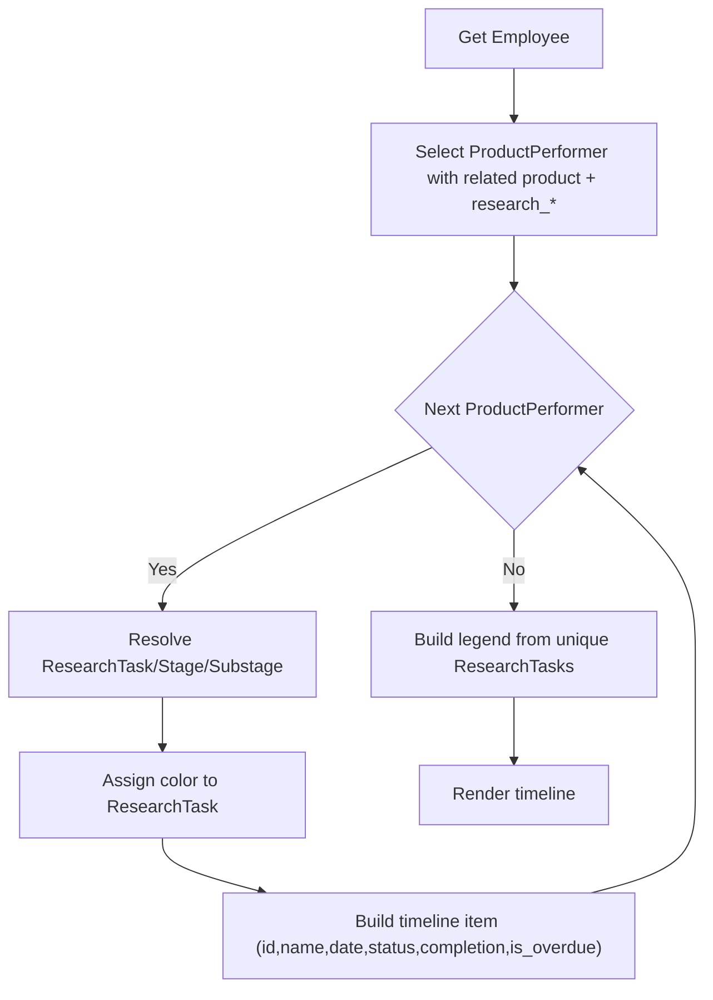
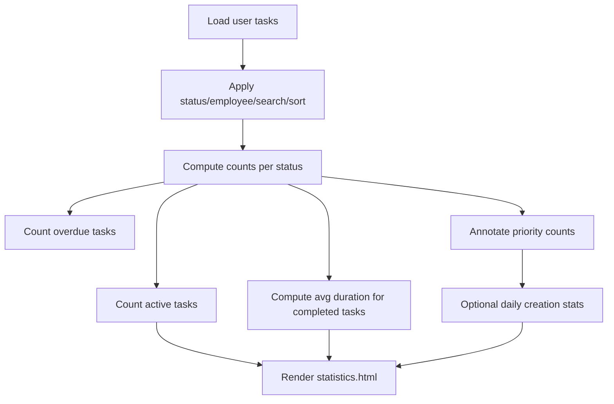
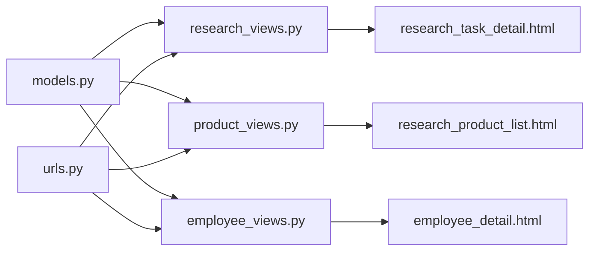

# Research Project Statistics and Reporting

<cite>
**Referenced Files in This Document**
- [models.py](file://tasks/models.py)
- [research_views.py](file://tasks/views/research_views.py)
- [product_views.py](file://tasks/views/product_views.py)
- [research_task_detail.html](file://tasks/templates/tasks/research_task_detail.html)
- [statistics.html](file://tasks/templates/tasks/statistics.html)
- [urls.py](file://tasks/urls.py)
- [task_extras.py](file://tasks/templatetags/task_extras.py)
- [employee_views.py](file://tasks/views/employee_views.py)
- [api_views.py](file://tasks/views/api_views.py)
- [forms.py](file://tasks/forms.py)
</cite>

## Table of Contents
1. [Introduction](#introduction)
2. [Project Structure](#project-structure)
3. [Core Components](#core-components)
4. [Architecture Overview](#architecture-overview)
5. [Detailed Component Analysis](#detailed-component-analysis)
6. [Dependency Analysis](#dependency-analysis)
7. [Performance Considerations](#performance-considerations)
8. [Troubleshooting Guide](#troubleshooting-guide)
9. [Conclusion](#conclusion)
10. [Appendices](#appendices)

## Introduction
This document describes the Research Project Statistics and Reporting system, focusing on automated statistics generation for scientific research projects. It covers research task counts, stage and substage distribution, product completion rates, and progress tracking metrics. It explains calculation methods for completion percentages, productivity measurements, and research output tracking. It also documents the statistical reporting interface with filtering capabilities by date ranges, departments, and research categories, along with integration points for performance monitoring and progress visualization. Examples of generating research reports, analyzing productivity trends, and identifying bottlenecks are included, alongside custom report generation, export capabilities, and dashboard integration. Finally, it documents data aggregation processes and caching strategies for performance optimization.

## Project Structure
The system centers around Django models representing research hierarchies (ResearchTask, ResearchStage, ResearchSubstage) and outputs (ResearchProduct). Views orchestrate data retrieval and rendering, templates present statistics and dashboards, and URLs route requests. Utility helpers and forms support filtering and data manipulation.

**Diagram sources**
- [models.py:384-779](file://tasks/models.py#L384-L779)
- [research_views.py:54-86](file://tasks/views/research_views.py#L54-L86)
- [product_views.py:10-26](file://tasks/views/product_views.py#L10-L26)
- [employee_views.py:127-641](file://tasks/views/employee_views.py#L127-L641)
- [api_views.py:10-70](file://tasks/views/api_views.py#L10-L70)
- [research_task_detail.html:1-344](file://tasks/templates/tasks/research_task_detail.html#L1-L344)
- [statistics.html:1-329](file://tasks/templates/tasks/statistics.html#L1-L329)

**Section sources**
- [models.py:384-779](file://tasks/models.py#L384-L779)
- [urls.py:20-82](file://tasks/urls.py#L20-L82)

## Core Components
- Research hierarchy models:
  - ResearchTask: top-level research project with metadata, timelines, and funding.
  - ResearchStage: numbered stages within a research task.
  - ResearchSubstage: granular sub-stages under stages.
  - ResearchProduct: deliverables produced at sub-stage level with status and completion percent.
- Views:
  - research_task_detail: aggregates counts and computes progress percentage for a research task.
  - research_substage_detail: lists products under a substage.
  - research_product_list: filters and summarizes research products by type, status, and task.
  - product_assign_performers: assigns performers to a product with department and search filters.
  - employee_tasks: builds Gantt-like timeline of research products per employee.
- Templates:
  - research_task_detail.html: renders progress cards, stage/substage counts, and product lists.
  - statistics.html: displays task statistics and productivity insights.
- Utilities:
  - task_extras.py: template filter to retrieve dictionary values by key.
- API:
  - task_update_status_ajax: updates task status via AJAX and timestamps.

Key statistics computed:
- Task counts: total, todo, in_progress, done, overdue.
- Priority distribution: high, medium, low.
- Time-based metrics: active now, completed count, average duration.
- Research progress: total stages, substages, products, completed products, and completion percentage.

**Section sources**
- [models.py:384-779](file://tasks/models.py#L384-L779)
- [research_views.py:54-86](file://tasks/views/research_views.py#L54-L86)
- [product_views.py:207-252](file://tasks/views/product_views.py#L207-L252)
- [research_task_detail.html:136-170](file://tasks/templates/tasks/research_task_detail.html#L136-L170)
- [statistics.html:14-133](file://tasks/templates/tasks/statistics.html#L14-L133)
- [task_extras.py:5-8](file://tasks/templatetags/task_extras.py#L5-L8)
- [api_views.py:47-70](file://tasks/views/api_views.py#L47-L70)

## Architecture Overview
The system follows a layered Django architecture:
- Models define the research domain and relationships.
- Views fetch aggregated data and render templates.
- Templates present statistics and interactive dashboards.
- URLs route requests to appropriate views.
- Caching is used to optimize frequently accessed organization chart data.

**Diagram sources**
- [research_views.py:54-86](file://tasks/views/research_views.py#L54-L86)
- [research_task_detail.html:136-170](file://tasks/templates/tasks/research_task_detail.html#L136-L170)
- [models.py:384-531](file://tasks/models.py#L384-L531)

## Detailed Component Analysis

### Research Task Progress Calculation
The research task detail view computes:
- Stage, substage, and product counts.
- Completed product count.
- Completion percentage as completed_products / total_products * 100 (or 0 if no products).

**Diagram sources**
- [research_views.py:58-85](file://tasks/views/research_views.py#L58-L85)

**Section sources**
- [research_views.py:58-85](file://tasks/views/research_views.py#L58-L85)
- [research_task_detail.html:144-169](file://tasks/templates/tasks/research_task_detail.html#L144-L169)

### Research Product Completion Tracking
ResearchProduct tracks:
- Status lifecycle: pending, in_progress, completed, delayed, cancelled.
- Planned and actual dates.
- Completion percent.
- Responsible and performers.

Views and templates:
- research_product_detail: shows product details and assigned performers.
- research_product_list: filters by type, status, research task, and free-text search; computes summary stats (total, in_progress, completed, overdue).
- product_assign_performers: assigns performers with department and search filters; resolves department via StaffPosition.

**Diagram sources**
- [models.py:681-791](file://tasks/models.py#L681-L791)
- [product_views.py:10-26](file://tasks/views/product_views.py#L10-L26)

**Section sources**
- [models.py:681-791](file://tasks/models.py#L681-L791)
- [product_views.py:10-26](file://tasks/views/product_views.py#L10-L26)
- [product_views.py:207-252](file://tasks/views/product_views.py#L207-L252)

### Product Performer Assignment and Filtering
The assignment view supports:
- Filtering employees by department (via StaffPosition).
- Free-text search across name and position.
- Assigning multiple performers and a responsible person.
- Redirecting to appropriate parent page (substage, stage, or task).

**Diagram sources**
- [product_views.py:51-170](file://tasks/views/product_views.py#L51-L170)
- [models.py:604-677](file://tasks/models.py#L604-L677)

**Section sources**
- [product_views.py:51-170](file://tasks/views/product_views.py#L51-L170)

### Employee Research Timeline (Gantt-style)
The employee detail view aggregates research products for a given employee:
- Iterates through ProductPerformer entries to avoid duplicates.
- Resolves ResearchTask, ResearchStage, ResearchSubstage for each product.
- Builds timeline items with planned_end/due_date, status, completion percent, overdue flag, and colors per ResearchTask.
- Generates a legend of unique ResearchTasks with colors.

**Diagram sources**
- [employee_views.py:127-641](file://tasks/views/employee_views.py#L127-L641)
- [models.py:681-791](file://tasks/models.py#L681-L791)

**Section sources**
- [employee_views.py:127-641](file://tasks/views/employee_views.py#L127-L641)

### Task Statistics and Productivity Metrics
The task statistics view computes:
- Totals and counts per status.
- Overdue count based on due_date.
- Priority distribution.
- Active tasks (in_progress with start_time but no end_time).
- Average duration for completed tasks (hours).
- Daily creation stats (optional).

**Diagram sources**
- [statistics.html:14-329](file://tasks/templates/tasks/statistics.html#L14-L329)

**Section sources**
- [statistics.html:14-329](file://tasks/templates/tasks/statistics.html#L14-L329)

### Reporting Interface and Filtering
- Research task detail: shows stage/substage/product counts and progress bar.
- Research product list: filter by type, status, research task, and search text; shows summary stats.
- Product performer assignment: filter by department and search; assign performers and responsible.
- Task statistics: filter by status, employee, search, and sort; shows productivity insights.

URL routing:
- Research endpoints: list, create, detail, edit, stage/substage detail, assign performers, update product status.
- Product endpoints: list, detail, update status, assign performers.
- Team dashboard and organization chart endpoints.

**Section sources**
- [urls.py:74-100](file://tasks/urls.py#L74-L100)
- [research_views.py:9-16](file://tasks/views/research_views.py#L9-L16)
- [research_views.py:54-86](file://tasks/views/research_views.py#L54-L86)
- [product_views.py:207-252](file://tasks/views/product_views.py#L207-L252)
- [product_views.py:51-170](file://tasks/views/product_views.py#L51-L170)

### Integration with Performance Monitoring and Visualization
- AJAX status updates: task_update_status_ajax updates task status and timestamps, returning JSON for client-side updates.
- Template utilities: task_extras.get_item filter enables dictionary lookups in templates.
- Organization chart caching: organization_chart caches rendered data for 10 minutes to reduce database load.

**Section sources**
- [api_views.py:47-70](file://tasks/views/api_views.py#L47-L70)
- [task_extras.py:5-8](file://tasks/templatetags/task_extras.py#L5-L8)
- [dashboard_views.py:14-109](file://tasks/views/dashboard_views.py#L14-L109)

## Dependency Analysis
The system exhibits clear separation of concerns:
- Models encapsulate domain logic and relationships.
- Views orchestrate data aggregation and rendering.
- Templates focus on presentation and user interaction.
- Forms and utilities support filtering and data manipulation.
- URLs connect endpoints to views.

**Diagram sources**
- [models.py:384-779](file://tasks/models.py#L384-L779)
- [research_views.py:54-86](file://tasks/views/research_views.py#L54-L86)
- [product_views.py:207-252](file://tasks/views/product_views.py#L207-L252)
- [employee_views.py:127-641](file://tasks/views/employee_views.py#L127-L641)
- [urls.py:20-100](file://tasks/urls.py#L20-L100)

**Section sources**
- [models.py:384-779](file://tasks/models.py#L384-L779)
- [urls.py:20-100](file://tasks/urls.py#L20-L100)

## Performance Considerations
- Database optimization:
  - Prefetch related objects to minimize N+1 queries (e.g., stages with substages and products).
  - Use annotations and aggregations (Count) to compute statistics efficiently.
- Caching:
  - Organization chart data cached for 10 minutes to reduce repeated heavy queries.
- Pagination and filtering:
  - Apply filters early in the query chain to limit result sets.
- Rendering:
  - Prefer server-side aggregation over client-side computation.
- Asynchronous updates:
  - Use AJAX endpoints for dynamic status updates to avoid full page reloads.

[No sources needed since this section provides general guidance]

## Troubleshooting Guide
Common issues and resolutions:
- Overdue tasks not detected:
  - Verify due_date comparisons and timezone handling in views.
- Empty progress percentage:
  - Ensure total products > 0 before computing percentage.
- Missing performers after assignment:
  - Confirm POST parameters and model relationships; check redirect targets.
- Slow page loads:
  - Enable caching for heavy pages; use select_related/prefetch_related; apply filters early.

**Section sources**
- [research_views.py:69-85](file://tasks/views/research_views.py#L69-L85)
- [product_views.py:51-90](file://tasks/views/product_views.py#L51-L90)
- [api_views.py:47-70](file://tasks/views/api_views.py#L47-L70)

## Conclusion
The Research Project Statistics and Reporting system provides robust automation for tracking research workflows. It aggregates counts, computes completion percentages, and surfaces productivity insights through dedicated views and templates. Filtering and AJAX integrations enable efficient, real-time reporting. Caching and optimized queries ensure responsiveness at scale. The modular design supports extension for custom reports, export capabilities, and dashboard integration.

[No sources needed since this section summarizes without analyzing specific files]

## Appendices

### Example Workflows

- Generating a research report for a single task:
  - Navigate to the task detail page to view stage/substage/product counts and progress.
  - Use the progress bar and summary cards to assess completion.

- Analyzing productivity trends:
  - Use the task statistics page to review counts per status, overdue tasks, priority distribution, and average duration.
  - Export or capture snapshots for trend analysis.

- Identifying bottlenecks:
  - Drill down from task to substage to product to pinpoint delays.
  - Use product status dropdowns to mark delays and track remediation.

- Custom report generation:
  - Build custom views that aggregate ResearchProduct data by ResearchTask, ResearchStage, or ResearchSubstage.
  - Apply filters by date range, department, and product type.

- Dashboard integration:
  - Embed progress bars and summary cards into dashboards using the existing template blocks.
  - Use AJAX endpoints to refresh metrics without reloading pages.

[No sources needed since this section provides general guidance]