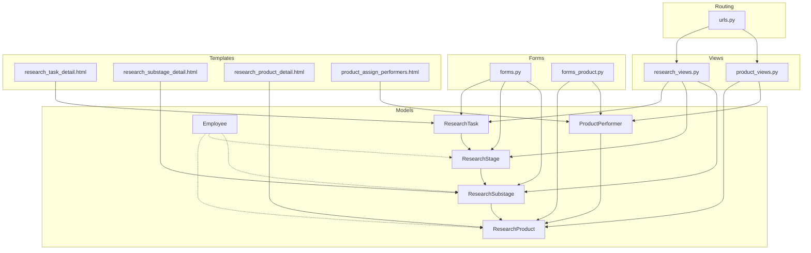
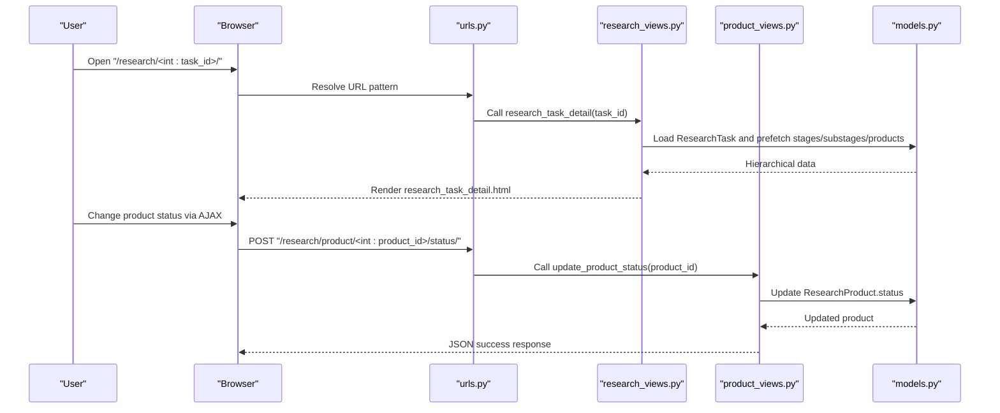
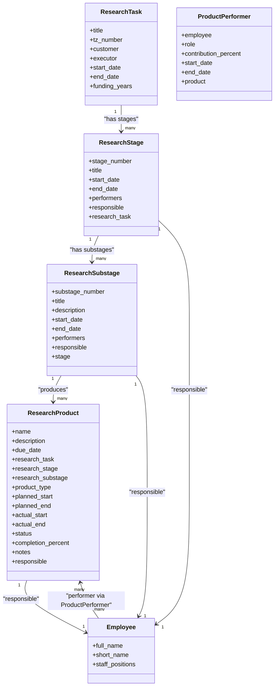
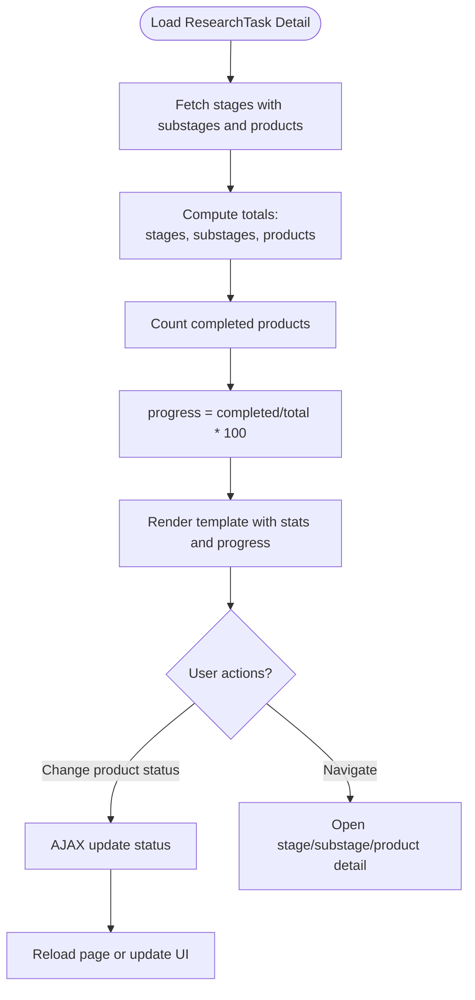
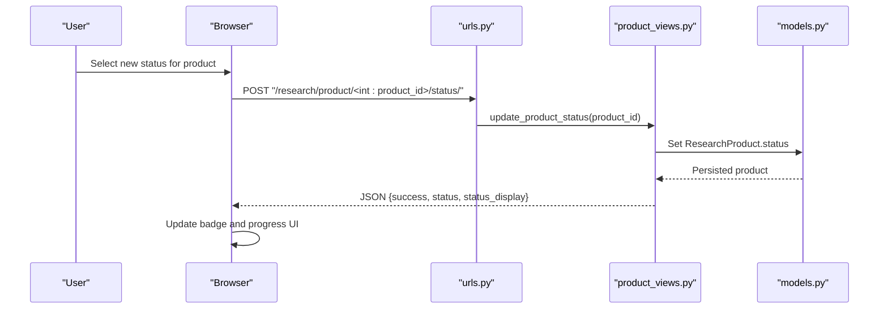
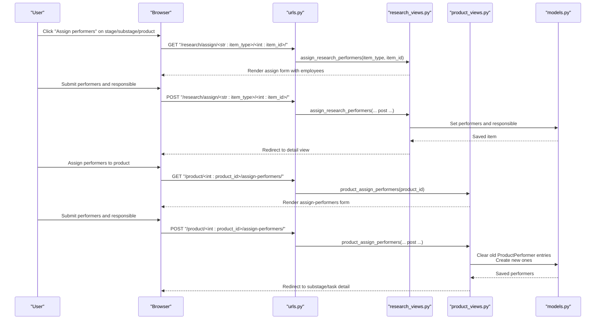
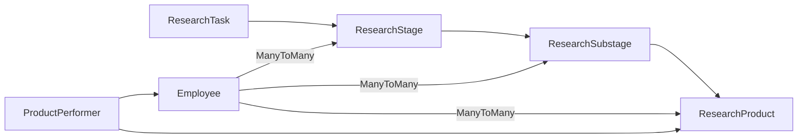

# Research Workflow Management

<cite>
**Referenced Files in This Document**
- [models.py](file://tasks/models.py)
- [research_views.py](file://tasks/views/research_views.py)
- [product_views.py](file://tasks/views/product_views.py)
- [forms.py](file://tasks/forms.py)
- [forms_product.py](file://tasks/forms_product.py)
- [urls.py](file://tasks/urls.py)
- [research_task_detail.html](file://tasks/templates/tasks/research_task_detail.html)
- [research_substage_detail.html](file://tasks/templates/tasks/research_substage_detail.html)
- [research_product_detail.html](file://tasks/templates/tasks/research_product_detail.html)
- [product_assign_performers.html](file://tasks/templates/tasks/product_assign_performers.html)
- [0001_initial.py](file://tasks/migrations/0001_initial.py)
</cite>

## Table of Contents
1. [Introduction](#introduction)
2. [Project Structure](#project-structure)
3. [Core Components](#core-components)
4. [Architecture Overview](#architecture-overview)
5. [Detailed Component Analysis](#detailed-component-analysis)
6. [Dependency Analysis](#dependency-analysis)
7. [Performance Considerations](#performance-considerations)
8. [Troubleshooting Guide](#troubleshooting-guide)
9. [Conclusion](#conclusion)

## Introduction
This document describes the Research Workflow Management system that organizes scientific research projects into a three-tier hierarchy: ResearchTask (main project), ResearchStage (major phases), and ResearchSubstage (specific activities). It also supports ResearchProduct deliverables and integrates with the broader task management system and organizational structure. The system enables lifecycle management, status tracking, milestone management, performer assignment, and progress reporting across the hierarchy.

## Project Structure
The system is implemented within the tasks application and consists of:
- Models defining the research hierarchy and deliverables
- Views handling CRUD and workflow operations
- Forms for data entry and validation
- Templates rendering the UI for each hierarchy level
- URL routing connecting endpoints to views
- Migrations establishing database schema

**Diagram sources**
- [models.py:384-791](file://tasks/models.py#L384-L791)
- [research_views.py:1-165](file://tasks/views/research_views.py#L1-L165)
- [product_views.py:1-253](file://tasks/views/product_views.py#L1-L253)
- [forms.py:71-140](file://tasks/forms.py#L71-L140)
- [forms_product.py:8-126](file://tasks/forms_product.py#L8-L126)
- [urls.py:38-100](file://tasks/urls.py#L38-L100)
- [research_task_detail.html:1-344](file://tasks/templates/tasks/research_task_detail.html#L1-L344)
- [research_substage_detail.html:1-105](file://tasks/templates/tasks/research_substage_detail.html#L1-L105)
- [research_product_detail.html:1-221](file://tasks/templates/tasks/research_product_detail.html#L1-L221)
- [product_assign_performers.html:1-594](file://tasks/templates/tasks/product_assign_performers.html#L1-L594)

**Section sources**
- [models.py:384-791](file://tasks/models.py#L384-L791)
- [urls.py:38-100](file://tasks/urls.py#L38-L100)

## Core Components
- ResearchTask: Top-level research project with metadata, timeline, and funding.
- ResearchStage: Major phases of a ResearchTask with performers and responsible person.
- ResearchSubstage: Specific activities under a stage with performers and responsible person.
- ResearchProduct: Deliverables produced during substages, with status, dates, and performers.
- ProductPerformer: Links employees to products with roles and contribution percentages.
- Employee: Organizational member with department and position associations.
- Views: Provide CRUD and workflow operations for the hierarchy and deliverables.
- Forms: Validate and present forms for creating/editing hierarchy items and performers.
- Templates: Render detailed views, progress dashboards, and performer assignment UI.

**Section sources**
- [models.py:384-791](file://tasks/models.py#L384-L791)
- [research_views.py:19-165](file://tasks/views/research_views.py#L19-L165)
- [product_views.py:9-253](file://tasks/views/product_views.py#L9-L253)
- [forms.py:71-140](file://tasks/forms.py#L71-L140)
- [forms_product.py:8-126](file://tasks/forms_product.py#L8-L126)

## Architecture Overview
The system follows a layered architecture:
- Presentation layer: Templates render views for ResearchTask, ResearchStage, ResearchSubstage, and ResearchProduct.
- Business logic layer: Views orchestrate data retrieval, updates, and redirects.
- Data access layer: Models define relationships and constraints; migrations establish schema.
- Integration layer: URLs route requests to appropriate views.

**Diagram sources**
- [urls.py:74-82](file://tasks/urls.py#L74-L82)
- [research_views.py:54-86](file://tasks/views/research_views.py#L54-L86)
- [product_views.py:29-48](file://tasks/views/product_views.py#L29-L48)
- [models.py:681-791](file://tasks/models.py#L681-L791)

## Detailed Component Analysis

### Three-Tier Hierarchy and Lifecycle
- ResearchTask: Root entity with project metadata, timeline, and funding. It aggregates ResearchStages.
- ResearchStage: Phase-level grouping with performers and responsible person. It aggregates ResearchSubstages.
- ResearchSubstage: Activity-level grouping with performers and responsible person. It aggregates ResearchProducts.
- ResearchProduct: Deliverable with status, dates, responsible person, and multiple performers via ProductPerformer.

**Diagram sources**
- [models.py:384-791](file://tasks/models.py#L384-L791)

**Section sources**
- [models.py:448-531](file://tasks/models.py#L448-L531)
- [models.py:487-524](file://tasks/models.py#L487-L524)
- [models.py:681-791](file://tasks/models.py#L681-L791)

### ResearchTask Detail View: Statistics, Progress, Completion Metrics
The ResearchTask detail view aggregates:
- Stage, substage, and product counts
- Completed product count and overall progress percentage
- Per-stage and per-substage lists with links to deeper views
- Inline status updates for products via AJAX

**Diagram sources**
- [research_views.py:54-86](file://tasks/views/research_views.py#L54-L86)
- [research_task_detail.html:136-170](file://tasks/templates/tasks/research_task_detail.html#L136-L170)

**Section sources**
- [research_views.py:54-86](file://tasks/views/research_views.py#L54-L86)
- [research_task_detail.html:136-170](file://tasks/templates/tasks/research_task_detail.html#L136-L170)

### ResearchStage Detail View
Displays stage-level information, associated substages, and quick navigation to performer assignment.

**Section sources**
- [research_views.py:89-99](file://tasks/views/research_views.py#L89-L99)

### ResearchSubstage Detail View
Shows substage details, progress bar, and list of associated products with status badges and performer information.

**Section sources**
- [research_views.py:103-116](file://tasks/views/research_views.py#L103-L116)
- [research_substage_detail.html:1-105](file://tasks/templates/tasks/research_substage_detail.html#L1-L105)

### ResearchProduct Detail View and Status Tracking
- Displays product metadata, status, timeline, and notes.
- Provides a dropdown to update status and a progress bar.
- Lists assigned performers with roles and contribution percentages.

**Diagram sources**
- [urls.py:81-82](file://tasks/urls.py#L81-L82)
- [product_views.py:29-48](file://tasks/views/product_views.py#L29-L48)
- [research_product_detail.html:305-326](file://tasks/templates/tasks/research_product_detail.html#L305-L326)

**Section sources**
- [research_product_detail.html:1-221](file://tasks/templates/tasks/research_product_detail.html#L1-L221)
- [product_views.py:9-26](file://tasks/views/product_views.py#L9-L26)

### Performer Assignment Across Hierarchy
- Assign performers and responsible person at ResearchStage, ResearchSubstage, and ResearchProduct levels.
- ResearchSubstage inherits performers from its parent stage if not set.
- ResearchProduct uses ProductPerformer to associate multiple employees with roles and contribution percentages.

**Diagram sources**
- [urls.py:81-82](file://tasks/urls.py#L81-L82)
- [research_views.py:118-165](file://tasks/views/research_views.py#L118-L165)
- [product_assign_performers.html:122-284](file://tasks/templates/tasks/product_assign_performers.html#L122-L284)
- [product_views.py:51-170](file://tasks/views/product_views.py#L51-L170)

**Section sources**
- [research_views.py:118-165](file://tasks/views/research_views.py#L118-L165)
- [product_assign_performers.html:122-284](file://tasks/templates/tasks/product_assign_performers.html#L122-L284)
- [product_views.py:51-170](file://tasks/views/product_views.py#L51-L170)
- [models.py:525-531](file://tasks/models.py#L525-L531)

### Practical Examples

- Creating a ResearchWorkflow
  - Use the ResearchTask form to create a project with title, customer, executor, dates, and goals.
  - Add ResearchStage entries with stage numbers and titles.
  - Add ResearchSubstage entries under each stage with activity titles and dates.
  - Create ResearchProduct entries under substages to represent deliverables.

- Managing Stage Transitions
  - Update ResearchStage start/end dates and status.
  - Assign performers/responsible at stage level; ResearchSubstage can inherit performers automatically.

- Tracking Project Completion
  - Monitor progress percentage computed from completed products.
  - Use ResearchProduct status updates to reflect completion milestones.

- Integration with Task Management and Organization
  - ResearchTask integrates with the broader task system via shared Employee and Department models.
  - Performer assignment leverages Employee and StaffPosition relationships.

**Section sources**
- [forms.py:71-140](file://tasks/forms.py#L71-L140)
- [models.py:13-162](file://tasks/models.py#L13-L162)
- [models.py:525-531](file://tasks/models.py#L525-L531)

## Dependency Analysis
- Model dependencies:
  - ResearchTask → ResearchStage
  - ResearchStage → ResearchSubstage
  - ResearchSubstage → ResearchProduct
  - Employee ↔ ResearchProduct via ProductPerformer
  - Employee ↔ ResearchStage, ResearchSubstage via ManyToMany
- View dependencies:
  - research_task_detail depends on ResearchTask and prefetches stages/substages/products.
  - product_assign_performers depends on filtering Employees by Department via StaffPosition.
- Template dependencies:
  - research_task_detail.html renders nested accordion and progress UI.
  - product_assign_performers.html provides a searchable, filterable employee grid with Select2.

**Diagram sources**
- [models.py:384-791](file://tasks/models.py#L384-L791)

**Section sources**
- [models.py:384-791](file://tasks/models.py#L384-L791)
- [product_assign_performers.html:96-157](file://tasks/templates/tasks/product_assign_performers.html#L96-L157)

## Performance Considerations
- Use select_related and prefetch_related in views to minimize N+1 queries when rendering hierarchical data.
- Leverage database indexes on foreign keys and frequently filtered fields (e.g., status, dates).
- Cache organization chart data and avoid recalculating expensive computations on each request.
- Limit rendered lists to paginated subsets when dealing with large hierarchies.

## Troubleshooting Guide
- Status update failures:
  - Verify CSRF token presence in AJAX requests.
  - Confirm endpoint routes match URL patterns.
- Missing performers after assignment:
  - Ensure POST parameters include performers list and responsible ID.
  - Check that ProductPerformer entries are cleared and recreated properly.
- Inheritance issues:
  - ResearchSubstage inherit_performers_from_stage only applies when substage performers are empty.

**Section sources**
- [research_task_detail.html:305-326](file://tasks/templates/tasks/research_task_detail.html#L305-L326)
- [product_views.py:56-89](file://tasks/views/product_views.py#L56-L89)
- [models.py:525-531](file://tasks/models.py#L525-L531)

## Conclusion
The Research Workflow Management system provides a structured approach to organizing research projects across three hierarchical levels, with robust support for performer assignment, status tracking, and milestone management. Its integration with the broader task management and organizational structure ensures scalability and maintainability for complex research portfolios.