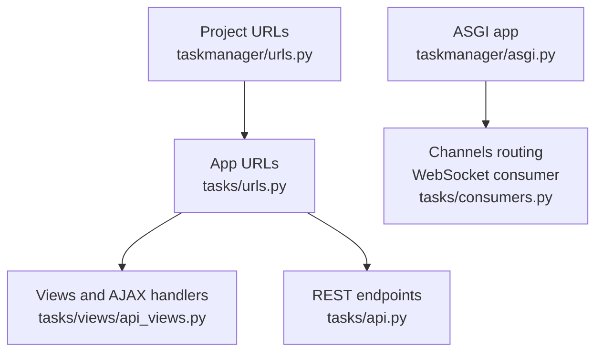
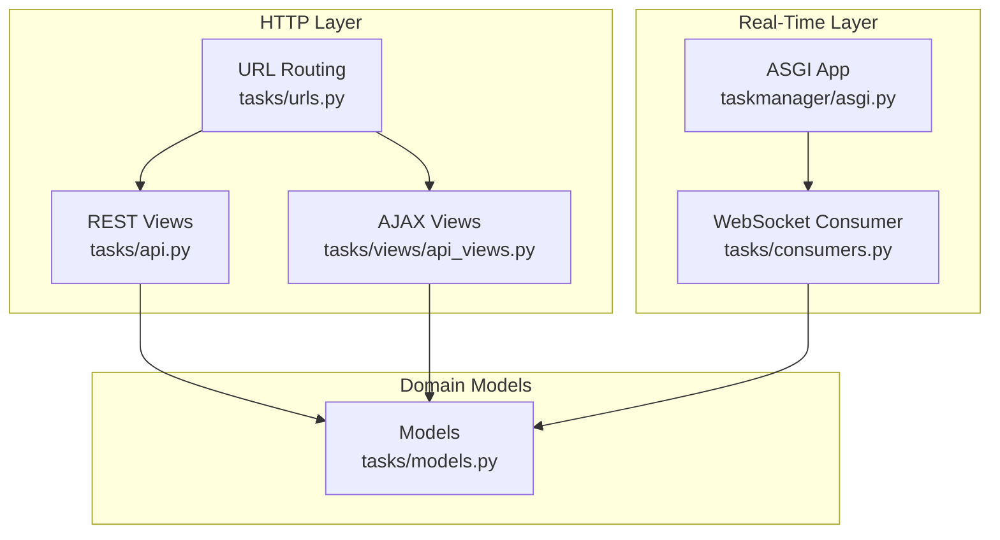
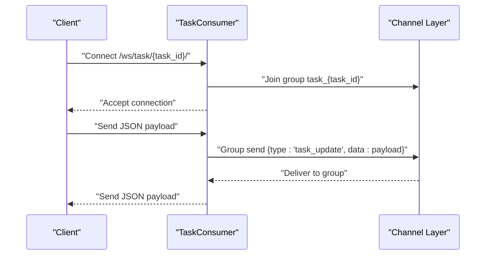
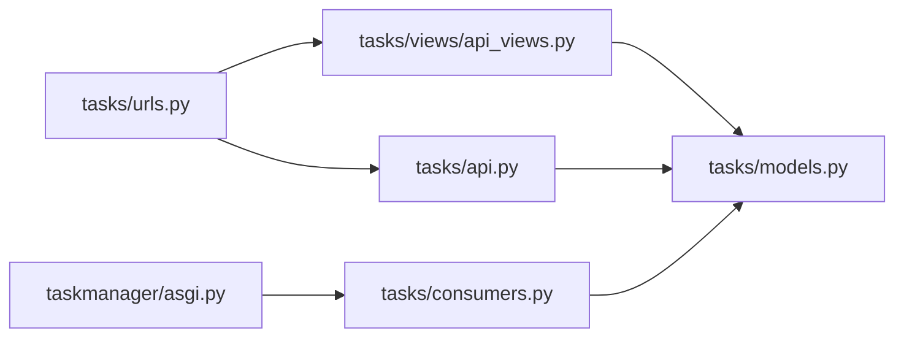

# API Endpoints and External Integration

<cite>
**Referenced Files in This Document**
- [tasks/urls.py](file://tasks/urls.py)
- [tasks/api.py](file://tasks/api.py)
- [tasks/views/api_views.py](file://tasks/views/api_views.py)
- [tasks/consumers.py](file://tasks/consumers.py)
- [taskmanager/urls.py](file://taskmanager/urls.py)
- [taskmanager/asgi.py](file://taskmanager/asgi.py)
- [taskmanager/settings.py](file://taskmanager/settings.py)
- [tasks/models.py](file://tasks/models.py)
- [tasks/templates/tasks/partials/employee_list_ajax.htm](file://tasks/templates/tasks/partials/employee_list_ajax.htm)
- [tasks/templates/tasks/partials/department_children.html](file://tasks/templates/tasks/partials/department_children.html)
- [tasks/tests/test_api.py](file://tasks/tests/test_api.py)
</cite>

## Table of Contents
1. [Introduction](#introduction)
2. [Project Structure](#project-structure)
3. [Core Components](#core-components)
4. [Architecture Overview](#architecture-overview)
5. [Detailed Component Analysis](#detailed-component-analysis)
6. [Dependency Analysis](#dependency-analysis)
7. [Performance Considerations](#performance-considerations)
8. [Troubleshooting Guide](#troubleshooting-guide)
9. [Conclusion](#conclusion)
10. [Appendices](#appendices)

## Introduction
This document provides comprehensive documentation for API endpoint implementation and external integration capabilities in the task manager application. It covers RESTful API design patterns, AJAX endpoint specifications, and WebSocket communication via Django Channels. It also documents request/response schemas, authentication methods, data serialization formats, real-time updates, endpoint specifications with HTTP methods, URL patterns, parameter specifications, response codes, client integration examples, error handling strategies, rate limiting considerations, API versioning, backward compatibility, and third-party integration patterns.

## Project Structure
The application is organized around a single Django app (tasks) with URL routing delegated to the app’s urls.py and included in the project-level urls.py. The tasks app exposes:
- REST endpoints for task retrieval and quick assignment
- AJAX endpoints for dynamic UI updates (task status, employee assignment, employee search, department details)
- WebSocket consumer for real-time updates per task room group

**Diagram sources**
- [taskmanager/urls.py:6-11](file://taskmanager/urls.py#L6-L11)
- [tasks/urls.py:38-100](file://tasks/urls.py#L38-L100)
- [tasks/views/api_views.py:1-130](file://tasks/views/api_views.py#L1-L130)
- [tasks/api.py:1-39](file://tasks/api.py#L1-L39)
- [taskmanager/asgi.py:10-17](file://taskmanager/asgi.py#L10-L17)
- [tasks/consumers.py:1-36](file://tasks/consumers.py#L1-L36)

**Section sources**
- [taskmanager/urls.py:6-11](file://taskmanager/urls.py#L6-L11)
- [tasks/urls.py:38-100](file://tasks/urls.py#L38-L100)

## Core Components
- REST endpoints:
  - GET /api/tasks/: Returns JSON array of tasks for the authenticated user with selected fields.
  - POST /api/quick-assign/: Assigns an employee to a task and returns a success payload.
- AJAX endpoints:
  - GET/POST /task/<int:task_id>/status/: Updates task status and timestamps, returns JSON with status and timing info.
  - POST /task/<int:task_id>/assign/: Assigns multiple employees to a task, returns JSON with counts and IDs.
  - GET /api/employee-search/: Searches employees by name/email, returns paginated results.
  - GET /department/<int:dept_id>/ajax/: Optimized department subtree rendering with counts, returns HTML and counts.
- WebSocket:
  - /ws/task/<int:task_id>/: Real-time broadcast to a task-specific group.

**Section sources**
- [tasks/api.py:10-39](file://tasks/api.py#L10-L39)
- [tasks/views/api_views.py:9-129](file://tasks/views/api_views.py#L9-L129)
- [tasks/consumers.py:4-36](file://tasks/consumers.py#L4-L36)

## Architecture Overview
The system integrates traditional HTTP endpoints (REST and AJAX) with real-time WebSocket updates. Authentication is enforced at the view layer for HTTP endpoints. WebSocket rooms are task-scoped for targeted real-time updates.

**Diagram sources**
- [tasks/api.py:10-39](file://tasks/api.py#L10-L39)
- [tasks/views/api_views.py:9-129](file://tasks/views/api_views.py#L9-L129)
- [tasks/urls.py:38-100](file://tasks/urls.py#L38-L100)
- [taskmanager/asgi.py:10-17](file://taskmanager/asgi.py#L10-L17)
- [tasks/consumers.py:4-36](file://tasks/consumers.py#L4-L36)
- [tasks/models.py:13-238](file://tasks/models.py#L13-L238)

## Detailed Component Analysis

### REST Endpoints

#### GET /api/tasks/
- Purpose: Retrieve tasks owned by the authenticated user.
- Authentication: login_required decorator.
- Request
  - Method: GET
  - Headers: Authorization (session cookie)
  - Query params: none
- Response
  - 200 OK: JSON array of task objects with keys id, title, status, priority, due_date (ISO date string or null).
  - 401 Unauthorized: If not authenticated.
- Notes
  - Uses Django JsonResponse for direct serialization.
  - Exposes minimal fields suitable for lightweight client consumption.

**Section sources**
- [tasks/api.py:10-21](file://tasks/api.py#L10-L21)

#### POST /api/quick-assign/
- Purpose: Rapidly assign an employee to a task.
- Authentication: login_required decorator.
- Request
  - Method: POST
  - Content-Type: application/json
  - Body fields:
    - task_id: integer
    - employee_id: integer
- Response
  - 200 OK: JSON with success flag, task title, and employee short name.
  - 400 Bad Request: If task_id or employee_id missing or invalid.
  - 404 Not Found: If task does not belong to the user or employee not found/active.
  - 401 Unauthorized: If not authenticated.
- Notes
  - Uses Django REST Framework Response for structured JSON.

**Section sources**
- [tasks/api.py:24-39](file://tasks/api.py#L24-L39)

### AJAX Endpoints

#### GET/POST /task/<int:task_id>/status/
- Purpose: Update task status and timestamps; supports GET for rendering selection UI.
- Authentication: login_required decorator.
- Request
  - Method: POST (update), GET (render)
  - POST body (application/x-www-form-urlencoded or multipart):
    - status: one of task status choices
  - GET query params:
    - search: optional substring filter for employees (used in assignment UI)
- Response
  - POST 200 OK: JSON with success flag, status, display label, and formatted start/end times.
  - POST 400 Bad Request: On invalid status.
  - GET 200 OK: JSON with success flag, rendered HTML snippet, and count.
  - GET 404 Not Found: If task not found.
  - 401 Unauthorized: If not authenticated.
- Notes
  - On status transition to in_progress, sets start_time if unset.
  - On status transition to done, sets end_time if unset.
  - Renders HTML via template partial for dynamic UI updates.

**Section sources**
- [tasks/views/api_views.py:47-70](file://tasks/views/api_views.py#L47-L70)
- [tasks/templates/tasks/partials/employee_list_ajax.htm:1-8](file://tasks/templates/tasks/partials/employee_list_ajax.htm#L1-L8)

#### POST /task/<int:task_id>/assign/
- Purpose: Assign multiple employees to a task via checkbox lists.
- Authentication: login_required decorator.
- Request
  - Method: POST
  - Body (application/x-www-form-urlencoded): employees[] repeated values (employee IDs)
- Response
  - 200 OK: JSON with success flag, message, and assigned IDs.
  - 404 Not Found: If task not found.
  - 401 Unauthorized: If not authenticated.
- Notes
  - Uses get_object_or_404 for safety.
  - Sets many-to-many relationship atomically.

**Section sources**
- [tasks/views/api_views.py:10-21](file://tasks/views/api_views.py#L10-L21)

#### GET /api/employee-search/
- Purpose: Search employees for UI autocompletion/search.
- Authentication: login_required decorator.
- Request
  - Method: GET
  - Query params:
    - q: search term (substring match on name/email)
- Response
  - 200 OK: JSON with results array of objects containing id, text (formatted display), and email.
  - 401 Unauthorized: If not authenticated.
- Notes
  - Limits results to 10 items.
  - Filters only active employees.

**Section sources**
- [tasks/views/api_views.py:73-93](file://tasks/views/api_views.py#L73-L93)

#### GET /department/<int:dept_id>/ajax/
- Purpose: Efficiently fetch department subtree and staff positions for rendering.
- Authentication: login_required decorator.
- Request
  - Method: GET
  - Path params:
    - dept_id: integer
- Response
  - 200 OK: JSON with success flag, rendered HTML snippet, children_count, and staff_count.
  - 404 Not Found: If department not found.
  - 401 Unauthorized: If not authenticated.
- Notes
  - Uses prefetch_related and select_related to minimize N+1 queries.
  - Renders HTML via template partial for dynamic UI updates.

**Section sources**
- [tasks/views/api_views.py:95-129](file://tasks/views/api_views.py#L95-L129)
- [tasks/templates/tasks/partials/department_children.html:1-27](file://tasks/templates/tasks/partials/department_children.html#L1-L27)

### WebSocket Communication (Django Channels)

#### Endpoint: /ws/task/<int:task_id>/
- Protocol: WebSocket
- Room group: task_<task_id>
- Behavior
  - On connect: Join the task-specific group.
  - On receive: Parse JSON payload and broadcast to the group.
  - On broadcast: Send JSON payload back to all clients in the group.
- Message format
  - Client sends: JSON object (arbitrary structure).
  - Server broadcasts: Exact JSON object received.
- Typical use cases
  - Live updates for task comments, status changes, or notifications.
- Security
  - No server-side authentication check; clients must enforce access control.
  - Room membership is implicit via URL route.

**Diagram sources**
- [tasks/consumers.py:4-36](file://tasks/consumers.py#L4-L36)

**Section sources**
- [tasks/consumers.py:4-36](file://tasks/consumers.py#L4-L36)

### Data Models and Serialization

#### Task model
- Fields relevant to REST/AJAX:
  - id, title, status, priority, due_date, start_time, end_time, user, assigned_to
- Status and priority choices are defined as model constants.
- Duration calculation and overdue checks support derived metrics.

**Section sources**
- [tasks/models.py:165-238](file://tasks/models.py#L165-L238)

#### Employee model
- Fields relevant to search and assignment:
  - id, full_name, short_name, position, email, is_active
- Used by AJAX endpoints for search and assignment UI.

**Section sources**
- [tasks/models.py:13-107](file://tasks/models.py#L13-L107)

#### Department and StaffPosition
- Used by department AJAX endpoint to render hierarchical data efficiently.

**Section sources**
- [tasks/models.py:532-678](file://tasks/models.py#L532-L678)

### Request/Response Schemas

#### GET /api/tasks/
- Response item shape:
  - id: integer
  - title: string
  - status: string (one of task status choices)
  - priority: string (one of task priority choices)
  - due_date: string (ISO date) or null

**Section sources**
- [tasks/api.py:14-21](file://tasks/api.py#L14-L21)

#### POST /api/quick-assign/
- Request body:
  - task_id: integer
  - employee_id: integer
- Response:
  - success: boolean
  - task: string
  - employee: string

**Section sources**
- [tasks/api.py:27-39](file://tasks/api.py#L27-L39)

#### GET/POST /task/<int:task_id>/status/
- POST request body:
  - status: string (one of task status choices)
- POST response:
  - success: boolean
  - status: string
  - status_display: string
  - start_time: string or null
  - end_time: string or null

**Section sources**
- [tasks/views/api_views.py:51-68](file://tasks/views/api_views.py#L51-L68)

#### POST /task/<int:task_id>/assign/
- POST request body (form-encoded):
  - employees[]: repeated integers
- Response:
  - success: boolean
  - message: string
  - assigned: array[int]

**Section sources**
- [tasks/views/api_views.py:14-21](file://tasks/views/api_views.py#L14-L21)

#### GET /api/employee-search/
- Query param:
  - q: string
- Response:
  - results: array of objects with id, text, email

**Section sources**
- [tasks/views/api_views.py:75-93](file://tasks/views/api_views.py#L75-L93)

#### GET /department/<int:dept_id>/ajax/
- Path param:
  - dept_id: integer
- Response:
  - success: boolean
  - html: string (rendered HTML)
  - children_count: integer
  - staff_count: integer

**Section sources**
- [tasks/views/api_views.py:124-129](file://tasks/views/api_views.py#L124-L129)

### Authentication Methods
- Session-based authentication via Django’s login_required decorator on HTTP endpoints.
- Login and logout URLs are configured at the project level.
- CSRF protection is enabled by default for session-authenticated requests.

**Section sources**
- [tasks/api.py:10-11](file://tasks/api.py#L10-L11)
- [tasks/views/api_views.py:9-9](file://tasks/views/api_views.py#L9-L9)
- [taskmanager/urls.py:8-10](file://taskmanager/urls.py#L8-L10)
- [taskmanager/settings.py:50-61](file://taskmanager/settings.py#L50-L61)

### Data Serialization Formats
- REST endpoints return JSON directly or via DRF Response.
- AJAX endpoints return JSON with either raw data arrays or rendered HTML fragments.
- WebSocket messages are JSON objects sent as text.

**Section sources**
- [tasks/api.py:21-21](file://tasks/api.py#L21-L21)
- [tasks/api.py:35-39](file://tasks/api.py#L35-L39)
- [tasks/views/api_views.py:41-45](file://tasks/views/api_views.py#L41-L45)
- [tasks/views/api_views.py:124-129](file://tasks/views/api_views.py#L124-L129)
- [tasks/consumers.py:22-36](file://tasks/consumers.py#L22-L36)

### Real-Time Communication via Django Channels
- Room groups: task_<task_id>
- Broadcast pattern: server forwards received JSON to all group members.
- Client responsibility: maintain access control and handle incoming events.

**Section sources**
- [tasks/consumers.py:4-36](file://tasks/consumers.py#L4-L36)

### Endpoint Documentation

#### REST Endpoints
- GET /api/tasks/
  - Auth: Required
  - Response codes: 200, 401
- POST /api/quick-assign/
  - Auth: Required
  - Request: application/json
  - Response codes: 200, 400, 401, 404

**Section sources**
- [tasks/api.py:10-39](file://tasks/api.py#L10-L39)

#### AJAX Endpoints
- GET/POST /task/<int:task_id>/status/
  - Auth: Required
  - Response codes: 200, 400, 401, 404
- POST /task/<int:task_id>/assign/
  - Auth: Required
  - Response codes: 200, 401, 404
- GET /api/employee-search/
  - Auth: Required
  - Response codes: 200, 401
- GET /department/<int:dept_id>/ajax/
  - Auth: Required
  - Response codes: 200, 401, 404

**Section sources**
- [tasks/views/api_views.py:9-129](file://tasks/views/api_views.py#L9-L129)

#### WebSocket
- /ws/task/<int:task_id>/
  - Protocol: WebSocket
  - Room: task_<task_id>
  - Message format: JSON object

**Section sources**
- [tasks/consumers.py:4-36](file://tasks/consumers.py#L4-L36)

### Client Integration Examples
- REST client
  - Fetch tasks: GET /api/tasks/ with session cookie.
  - Quick assign: POST /api/quick-assign/ with JSON { task_id, employee_id }.
- AJAX client
  - Update status: POST /task/{id}/status/ with form field status.
  - Assign employees: POST /task/{id}/assign/ with employees[].
  - Search employees: GET /api/employee-search/?q=<term>.
  - Load department subtree: GET /department/{id}/ajax/.
- WebSocket client
  - Connect to /ws/task/{id}/ and send JSON payloads; listen for broadcast updates.

**Section sources**
- [tasks/api.py:10-39](file://tasks/api.py#L10-L39)
- [tasks/views/api_views.py:9-129](file://tasks/views/api_views.py#L9-L129)
- [tasks/consumers.py:4-36](file://tasks/consumers.py#L4-L36)

### Error Handling Strategies
- HTTP endpoints:
  - 400 Bad Request: Invalid status values or missing fields.
  - 404 Not Found: Task or employee not found.
  - 401 Unauthorized: Missing or invalid session.
- AJAX endpoints:
  - Return JSON with success flag and error message for graceful UI handling.
- WebSocket:
  - No explicit authentication; ensure clients validate access before sending.

**Section sources**
- [tasks/views/api_views.py:51-70](file://tasks/views/api_views.py#L51-L70)
- [tasks/views/api_views.py:14-21](file://tasks/views/api_views.py#L14-L21)
- [tasks/consumers.py:4-36](file://tasks/consumers.py#L4-L36)

### Rate Limiting Considerations
- No built-in rate limiting is present in the current implementation.
- Recommendations:
  - Apply Django’s cache framework-backed throttling for DRF endpoints.
  - Use middleware to track per-user or per-IP request rates.
  - Consider external rate limiting at the web server or CDN layer.

[No sources needed since this section provides general guidance]

### API Versioning and Backward Compatibility
- Current endpoints do not include explicit versioning prefixes.
- Recommendations:
  - Prefix URLs with /api/v1/ to establish a version namespace.
  - Maintain backward compatibility by deprecating old endpoints with 410 Gone after a migration period.
  - Use Accept-Version headers or URL segments consistently.

[No sources needed since this section provides general guidance]

### Third-Party Integration Patterns
- REST endpoints can be consumed by external clients using session cookies or token-based auth (e.g., JWT).
- AJAX endpoints are designed for browser clients; external systems should prefer REST endpoints.
- WebSocket endpoints can integrate with real-time dashboards or chat-like features; ensure clients implement access control.

[No sources needed since this section provides general guidance]

## Dependency Analysis
The HTTP endpoints depend on domain models for data access and rendering. The WebSocket consumer depends on the channel layer for group messaging.

**Diagram sources**
- [tasks/urls.py:38-100](file://tasks/urls.py#L38-L100)
- [tasks/views/api_views.py:1-130](file://tasks/views/api_views.py#L1-L130)
- [tasks/api.py:1-39](file://tasks/api.py#L1-L39)
- [tasks/consumers.py:1-36](file://tasks/consumers.py#L1-L36)
- [tasks/models.py:13-238](file://tasks/models.py#L13-L238)
- [taskmanager/asgi.py:10-17](file://taskmanager/asgi.py#L10-L17)

**Section sources**
- [tasks/urls.py:38-100](file://tasks/urls.py#L38-L100)
- [tasks/views/api_views.py:1-130](file://tasks/views/api_views.py#L1-L130)
- [tasks/api.py:1-39](file://tasks/api.py#L1-L39)
- [tasks/consumers.py:1-36](file://tasks/consumers.py#L1-L36)
- [tasks/models.py:13-238](file://tasks/models.py#L13-L238)
- [taskmanager/asgi.py:10-17](file://taskmanager/asgi.py#L10-L17)

## Performance Considerations
- AJAX endpoints use optimized database queries with prefetch_related and select_related to reduce N+1 queries.
- Employee search limits results to 10 entries.
- Consider enabling gzip compression and caching for static assets and read-heavy AJAX responses.

**Section sources**
- [tasks/views/api_views.py:99-108](file://tasks/views/api_views.py#L99-L108)
- [tasks/views/api_views.py:85-85](file://tasks/views/api_views.py#L85-L85)
- [taskmanager/settings.py:50-61](file://taskmanager/settings.py#L50-L61)

## Troubleshooting Guide
- Authentication failures:
  - Ensure session cookie is attached to requests for protected endpoints.
  - Verify login/logout URLs and redirect policies.
- AJAX errors:
  - Check returned success flag and error messages in JSON responses.
  - Confirm correct form encoding for POST endpoints.
- WebSocket issues:
  - Verify client connects to the correct URL with the task ID.
  - Ensure the channel layer is configured and reachable.

**Section sources**
- [tasks/views/api_views.py:51-70](file://tasks/views/api_views.py#L51-L70)
- [tasks/consumers.py:4-36](file://tasks/consumers.py#L4-L36)
- [taskmanager/urls.py:8-10](file://taskmanager/urls.py#L8-L10)

## Conclusion
The application provides a pragmatic set of REST and AJAX endpoints backed by robust domain models, along with real-time WebSocket updates for task-specific collaboration. Authentication is enforced at the view layer, and AJAX endpoints deliver efficient UI updates with optimized queries. Extending the system with versioning, rate limiting, and standardized error responses will improve reliability and developer experience for third-party integrations.

## Appendices

### Endpoint Reference Summary
- GET /api/tasks/ → JSON array of tasks
- POST /api/quick-assign/ → JSON success payload
- GET/POST /task/<int:task_id>/status/ → JSON status and timing
- POST /task/<int:task_id>/assign/ → JSON assignment summary
- GET /api/employee-search/ → JSON results
- GET /department/<int:dept_id>/ajax/ → JSON with HTML and counts
- /ws/task/<int:task_id>/ → WebSocket room broadcast

**Section sources**
- [tasks/api.py:10-39](file://tasks/api.py#L10-L39)
- [tasks/views/api_views.py:9-129](file://tasks/views/api_views.py#L9-L129)
- [tasks/consumers.py:4-36](file://tasks/consumers.py#L4-L36)

### Test Coverage Reference
- Employee search API test verifies response structure and filtering behavior.

**Section sources**
- [tasks/tests/test_api.py:25-38](file://tasks/tests/test_api.py#L25-L38)