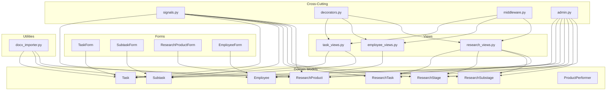
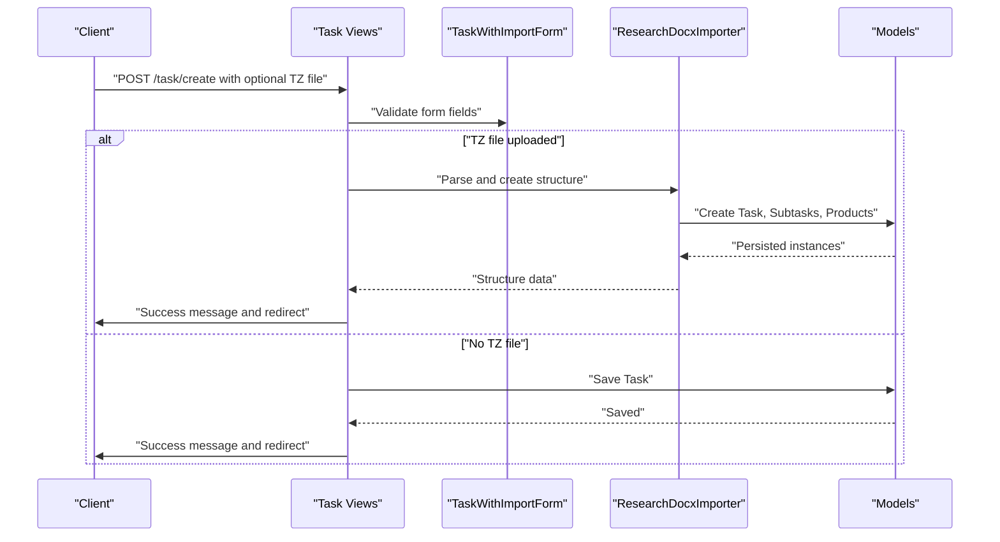
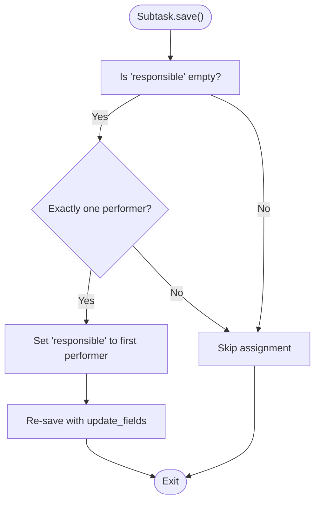
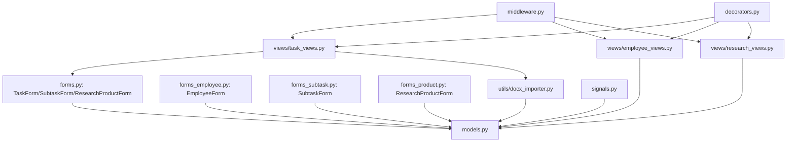

# Business Rules and Data Validation

<cite>
**Referenced Files in This Document**
- [models.py](file://tasks/models.py)
- [forms.py](file://tasks/forms.py)
- [forms_employee.py](file://tasks/forms_employee.py)
- [forms_subtask.py](file://tasks/forms_subtask.py)
- [forms_product.py](file://tasks/forms_product.py)
- [task_views.py](file://tasks/views/task_views.py)
- [employee_views.py](file://tasks/views/employee_views.py)
- [research_views.py](file://tasks/views/research_views.py)
- [docx_importer.py](file://tasks/utils/docx_importer.py)
- [signals.py](file://tasks/signals.py)
- [middleware.py](file://tasks/middleware.py)
- [decorators.py](file://tasks/decorators.py)
- [admin.py](file://tasks/admin.py)
</cite>

## Table of Contents
1. [Introduction](#introduction)
2. [Project Structure](#project-structure)
3. [Core Components](#core-components)
4. [Architecture Overview](#architecture-overview)
5. [Detailed Component Analysis](#detailed-component-analysis)
6. [Dependency Analysis](#dependency-analysis)
7. [Performance Considerations](#performance-considerations)
8. [Troubleshooting Guide](#troubleshooting-guide)
9. [Conclusion](#conclusion)
10. [Appendices](#appendices)

## Introduction
This document explains how business rules and data validation are enforced across the application. It covers domain-specific validations, workflow automation rules, constraint enforcement patterns, model-level and form-level validation, decorator-based access control, and error handling. It also provides guidance for extending validation logic consistently and maintaining business rule integrity.

## Project Structure
The validation and business rule enforcement spans models, forms, views, utilities, middleware, and signals:
- Models define domain constraints and computed properties.
- Forms encapsulate field-level and cross-field validation.
- Views orchestrate business workflows and enforce operational rules.
- Utilities implement specialized parsing and creation logic with embedded validation.
- Middleware and decorators provide cross-cutting concerns like logging and access control.
- Signals maintain data integrity and cache consistency.

**Diagram sources**
- [models.py:13-800](file://tasks/models.py#L13-L800)
- [forms.py:5-224](file://tasks/forms.py#L5-L224)
- [forms_employee.py:6-53](file://tasks/forms_employee.py#L6-L53)
- [forms_subtask.py:4-129](file://tasks/forms_subtask.py#L4-L129)
- [forms_product.py:8-126](file://tasks/forms_product.py#L8-L126)
- [task_views.py:1-471](file://tasks/views/task_views.py#L1-L471)
- [employee_views.py:1-1013](file://tasks/views/employee_views.py#L1-L1013)
- [research_views.py:1-165](file://tasks/views/research_views.py#L1-L165)
- [docx_importer.py:6-521](file://tasks/utils/docx_importer.py#L6-L521)
- [signals.py:7-32](file://tasks/signals.py#L7-L32)
- [middleware.py:9-43](file://tasks/middleware.py#L9-L43)
- [decorators.py:8-21](file://tasks/decorators.py#L8-L21)
- [admin.py:11-19](file://tasks/admin.py#L11-L19)

**Section sources**
- [models.py:13-800](file://tasks/models.py#L13-L800)
- [forms.py:5-224](file://tasks/forms.py#L5-L224)
- [forms_employee.py:6-53](file://tasks/forms_employee.py#L6-L53)
- [forms_subtask.py:4-129](file://tasks/forms_subtask.py#L4-L129)
- [forms_product.py:8-126](file://tasks/forms_product.py#L8-L126)
- [task_views.py:1-471](file://tasks/views/task_views.py#L1-L471)
- [employee_views.py:1-1013](file://tasks/views/employee_views.py#L1-L1013)
- [research_views.py:1-165](file://tasks/views/research_views.py#L1-L165)
- [docx_importer.py:6-521](file://tasks/utils/docx_importer.py#L6-L521)
- [signals.py:7-32](file://tasks/signals.py#L7-L32)
- [middleware.py:9-43](file://tasks/middleware.py#L9-L43)
- [decorators.py:8-21](file://tasks/decorators.py#L8-L21)
- [admin.py:11-19](file://tasks/admin.py#L11-L19)

## Core Components
- Domain models define business entities and enforce structural constraints via field choices, unique constraints, and computed properties.
- Forms implement field-level and cross-field validation, ensuring data integrity before persistence.
- Views coordinate business workflows, apply operational rules, and handle user feedback via messages.
- Utilities encapsulate complex parsing and creation logic with embedded validation and error reporting.
- Middleware and decorators provide logging and access control across requests.
- Signals maintain cache consistency and organizational structure integrity after model changes.

Key validation and rule enforcement areas:
- Time and date ordering across tasks, subtasks, and research items.
- Assignment constraints (active employees, mutual inclusion of responsible among performers).
- Import workflows with robust parsing and fallbacks.
- Cache invalidation to keep derived data consistent.

**Section sources**
- [models.py:165-382](file://tasks/models.py#L165-L382)
- [forms.py:32-44](file://tasks/forms.py#L32-L44)
- [forms_subtask.py:63-78](file://tasks/forms_subtask.py#L63-L78)
- [forms_product.py:41-53](file://tasks/forms_product.py#L41-L53)
- [task_views.py:79-179](file://tasks/views/task_views.py#L79-L179)
- [docx_importer.py:14-441](file://tasks/utils/docx_importer.py#L14-L441)

## Architecture Overview
The system enforces business rules through a layered approach:
- Model layer: structural and semantic constraints.
- Form layer: input validation and normalization.
- View layer: workflow orchestration and user feedback.
- Utility layer: specialized parsing and creation with validation.
- Cross-cutting layer: logging, access control, and cache maintenance.

**Diagram sources**
- [task_views.py:79-179](file://tasks/views/task_views.py#L79-L179)
- [forms.py:164-201](file://tasks/forms.py#L164-L201)
- [docx_importer.py:14-441](file://tasks/utils/docx_importer.py#L14-L441)

**Section sources**
- [task_views.py:79-179](file://tasks/views/task_views.py#L79-L179)
- [docx_importer.py:14-441](file://tasks/utils/docx_importer.py#L14-L441)

## Detailed Component Analysis

### Model-Level Validation and Constraints
- Choice constraints: Priority, status, department, and type choices limit acceptable values.
- Unique constraints: Composite uniqueness for staff positions and research funding per year.
- Indexes: Optimized queries for frequent filters and joins.
- Computed properties: Overdue checks, durations, progress indicators, and derived organization structure.

Examples of model-level rules:
- Task overdue check and duration calculation.
- Subtask automatic responsible assignment when only one performer exists.
- Department hierarchy and full path computation.
- Research product overdue detection and performers aggregation.

**Section sources**
- [models.py:165-382](file://tasks/models.py#L165-L382)
- [models.py:328-340](file://tasks/models.py#L328-L340)
- [models.py:576-584](file://tasks/models.py#L576-L584)
- [models.py:781-786](file://tasks/models.py#L781-L786)

### Form-Level Validation
- TaskForm: Ensures start/end/due date ordering and excludes inactive employees from selection.
- SubtaskForm: Validates responsible person is among performers and dates are consistent.
- ResearchProductForm: Enforces planned start/end ordering and due date alignment.
- EmployeeForm: Normalizes phone numbers and validates file uploads for imports.

Validation patterns:
- Field-level cleaners for normalization and basic checks.
- Cross-field clean methods to enforce temporal and relational constraints.
- Dynamic queryset filtering to constrain selections to active records.

**Section sources**
- [forms.py:32-44](file://tasks/forms.py#L32-L44)
- [forms_subtask.py:63-78](file://tasks/forms_subtask.py#L63-L78)
- [forms_product.py:41-53](file://tasks/forms_product.py#L41-L53)
- [forms_employee.py:32-39](file://tasks/forms_employee.py#L32-L39)
- [forms_employee.py:49-52](file://tasks/forms_employee.py#L49-L52)

### Workflow Automation Rules
- Subtask.save(): Automatically assigns responsible when there is exactly one performer.
- Department.save(): Computes hierarchical level and full path.
- Task lifecycle controls: start, finish, reset time, and completion checks.
- Research import pipeline: Parses DOCX, creates stages/substages/products, and assigns defaults.

**Diagram sources**
- [models.py:328-340](file://tasks/models.py#L328-L340)

**Section sources**
- [models.py:328-340](file://tasks/models.py#L328-L340)
- [task_views.py:250-281](file://tasks/views/task_views.py#L250-L281)

### Decorator-Based Access Control
- log_view: Decorator logs view execution duration and exceptions, aiding monitoring and debugging.

**Section sources**
- [decorators.py:8-21](file://tasks/decorators.py#L8-L21)

### Middleware and Logging
- RequestLogMiddleware: Logs request/response metadata and errors for observability.
- Signals: Clear organization chart cache on model changes to prevent stale derived data.

**Section sources**
- [middleware.py:9-43](file://tasks/middleware.py#L9-L43)
- [signals.py:7-32](file://tasks/signals.py#L7-L32)
- [admin.py:11-19](file://tasks/admin.py#L11-L19)

### Complex Validation Scenarios
- Conditional business rules:
  - Responsible must be selected from performers.
  - Planned start cannot exceed planned end.
  - Due date cannot precede planned end.
- Data integrity checks:
  - Active employee filters in multiple forms.
  - Unique combinations for staff positions and research funding.
  - Hierarchical path and level consistency for departments.

**Section sources**
- [forms_subtask.py:70-72](file://tasks/forms_subtask.py#L70-L72)
- [forms_product.py:47-51](file://tasks/forms_product.py#L47-L51)
- [models.py:667-674](file://tasks/models.py#L667-L674)
- [models.py:442-442](file://tasks/models.py#L442-L442)

### Audit Trail and User Feedback
- Messages framework: Success and error notifications for user feedback.
- Logging: Structured logs for view execution and request lifecycle.
- Middleware exception logging: Centralized error capture for debugging.

**Section sources**
- [task_views.py:138-151](file://tasks/views/task_views.py#L138-L151)
- [task_views.py:164-166](file://tasks/views/task_views.py#L164-L166)
- [middleware.py:37-42](file://tasks/middleware.py#L37-L42)

### Extending Validation Logic
Guidelines:
- Add form-level validators in clean() methods for cross-field checks.
- Use model save() hooks for derived assignments and consistency.
- Leverage signals to maintain caches and derived data integrity.
- Centralize shared validation logic in utilities (e.g., parsing helpers).
- Keep business rules close to domain models to minimize duplication.

**Section sources**
- [forms_subtask.py:63-78](file://tasks/forms_subtask.py#L63-L78)
- [models.py:328-340](file://tasks/models.py#L328-L340)
- [signals.py:7-32](file://tasks/signals.py#L7-L32)
- [docx_importer.py:14-441](file://tasks/utils/docx_importer.py#L14-L441)

## Dependency Analysis
The following diagram highlights key dependencies among components involved in validation and business rules:

**Diagram sources**
- [forms.py:5-224](file://tasks/forms.py#L5-L224)
- [forms_employee.py:6-53](file://tasks/forms_employee.py#L6-L53)
- [forms_subtask.py:4-129](file://tasks/forms_subtask.py#L4-L129)
- [forms_product.py:8-126](file://tasks/forms_product.py#L8-L126)
- [task_views.py:1-471](file://tasks/views/task_views.py#L1-L471)
- [employee_views.py:1-1013](file://tasks/views/employee_views.py#L1-L1013)
- [research_views.py:1-165](file://tasks/views/research_views.py#L1-L165)
- [models.py:13-800](file://tasks/models.py#L13-L800)
- [docx_importer.py:6-521](file://tasks/utils/docx_importer.py#L6-L521)
- [signals.py:7-32](file://tasks/signals.py#L7-L32)
- [middleware.py:9-43](file://tasks/middleware.py#L9-L43)
- [decorators.py:8-21](file://tasks/decorators.py#L8-L21)

**Section sources**
- [forms.py:5-224](file://tasks/forms.py#L5-L224)
- [forms_employee.py:6-53](file://tasks/forms_employee.py#L6-L53)
- [forms_subtask.py:4-129](file://tasks/forms_subtask.py#L4-L129)
- [forms_product.py:8-126](file://tasks/forms_product.py#L8-L126)
- [task_views.py:1-471](file://tasks/views/task_views.py#L1-L471)
- [employee_views.py:1-1013](file://tasks/views/employee_views.py#L1-L1013)
- [research_views.py:1-165](file://tasks/views/research_views.py#L1-L165)
- [models.py:13-800](file://tasks/models.py#L13-L800)
- [docx_importer.py:6-521](file://tasks/utils/docx_importer.py#L6-L521)
- [signals.py:7-32](file://tasks/signals.py#L7-L32)
- [middleware.py:9-43](file://tasks/middleware.py#L9-L43)
- [decorators.py:8-21](file://tasks/decorators.py#L8-L21)

## Performance Considerations
- Use indexes strategically to support frequent filters (status, priority, dates).
- Prefer bulk operations for mass assignments and avoid N+1 queries in views.
- Cache derived data (e.g., organization charts) and invalidate on model changes via signals.
- Minimize repeated computations in templates by passing precomputed values from views.

[No sources needed since this section provides general guidance]

## Troubleshooting Guide
Common issues and resolutions:
- Validation errors on save:
  - Review form clean() methods and model save() hooks for conflicting rules.
  - Check active employee filters and mutual performer/responsible constraints.
- Import failures:
  - Verify DOCX parsing logic and fallbacks; inspect logs for parsing exceptions.
- Stale UI data:
  - Confirm cache invalidation signals and middleware logging for cache keys.
- Access control and logging:
  - Ensure log_view decorator and RequestLogMiddleware are applied to relevant views.

**Section sources**
- [forms_subtask.py:70-72](file://tasks/forms_subtask.py#L70-L72)
- [docx_importer.py:14-441](file://tasks/utils/docx_importer.py#L14-L441)
- [signals.py:7-32](file://tasks/signals.py#L7-L32)
- [middleware.py:37-42](file://tasks/middleware.py#L37-L42)
- [decorators.py:8-21](file://tasks/decorators.py#L8-L21)

## Conclusion
The application enforces business rules and validation through a cohesive stack of models, forms, views, utilities, middleware, and signals. By keeping validation close to domain logic, centralizing cross-cutting concerns, and leveraging caching and logging, the system maintains data integrity and predictable workflows. Extending validation should follow established patterns to preserve consistency and reliability.

[No sources needed since this section summarizes without analyzing specific files]

## Appendices
- Best practices checklist:
  - Encapsulate domain logic in models and forms.
  - Use signals for cache and derived data maintenance.
  - Log and notify users for both success and failure.
  - Keep validation messages clear and actionable.

[No sources needed since this section provides general guidance]