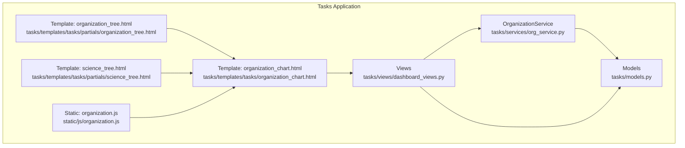
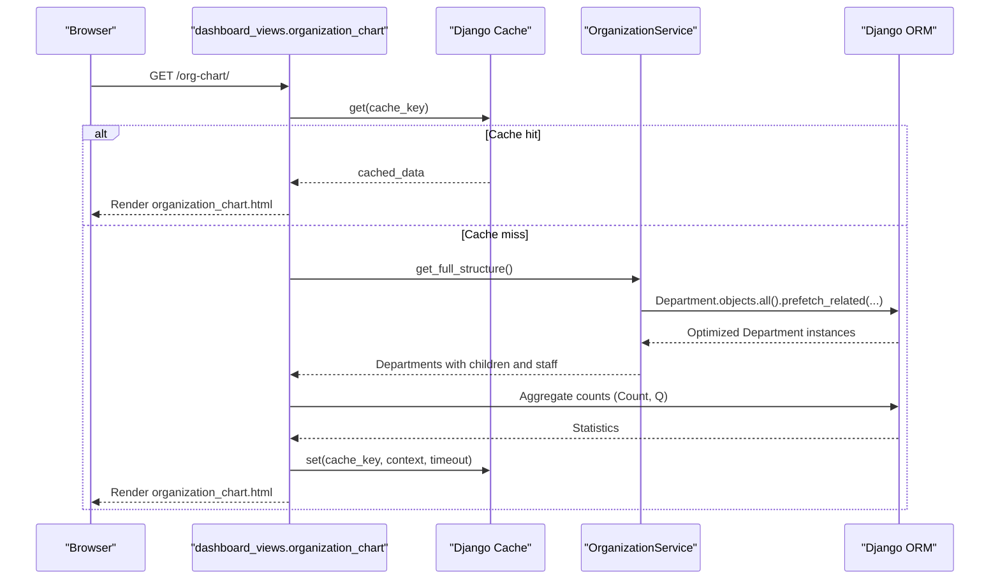
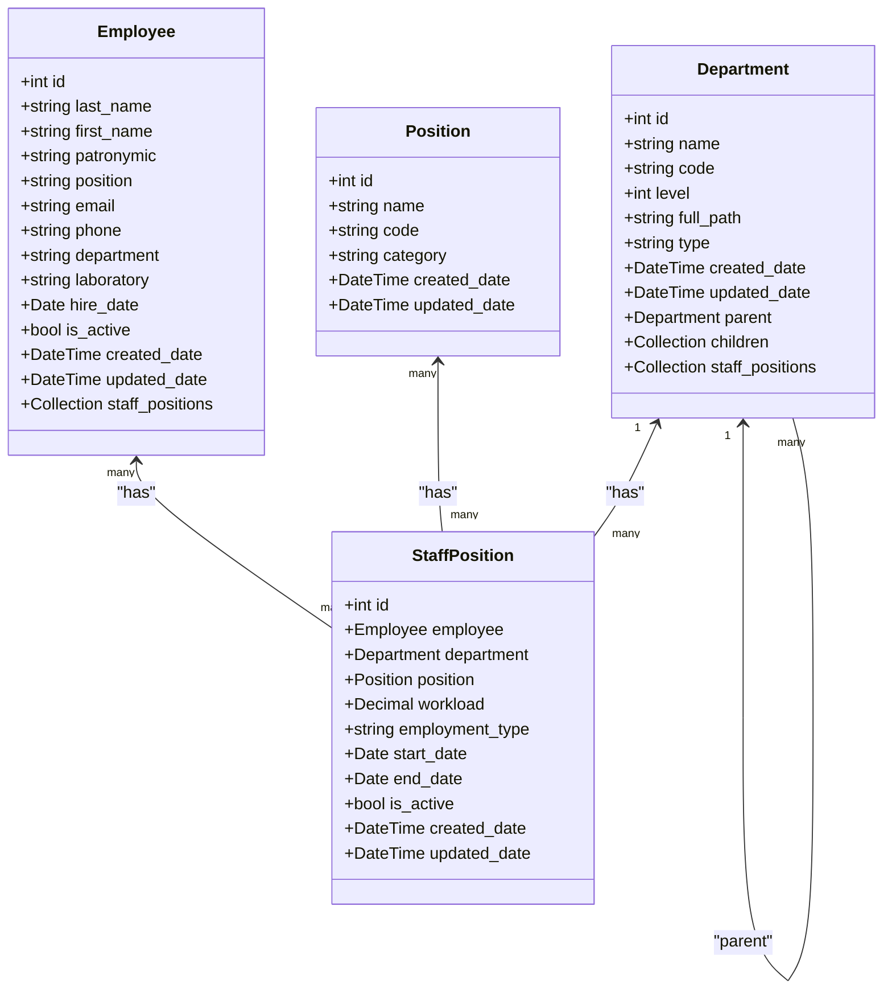
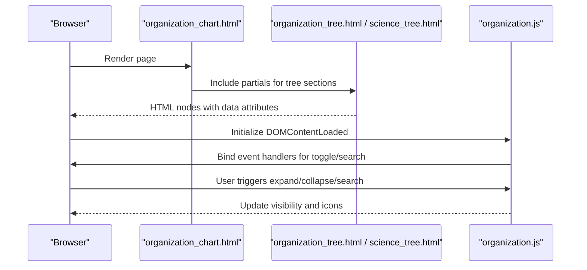
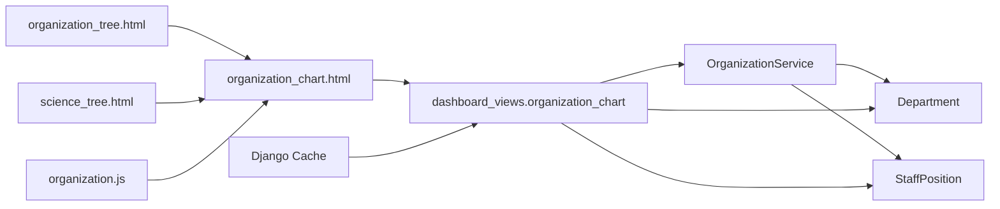

# Organization Service

<cite>
**Referenced Files in This Document**
- [org_service.py](file://tasks/services/org_service.py)
- [models.py](file://tasks/models.py)
- [organization_chart.html](file://tasks/templates/tasks/organization_chart.html)
- [organization_tree.html](file://tasks/templates/tasks/partials/organization_tree.html)
- [science_tree.html](file://tasks/templates/tasks/partials/science_tree.html)
- [organization.js](file://static/js/organization.js)
- [dashboard_views.py](file://tasks/views/dashboard_views.py)
- [settings.py](file://taskmanager/settings.py)
</cite>

## Table of Contents
1. [Introduction](#introduction)
2. [Project Structure](#project-structure)
3. [Core Components](#core-components)
4. [Architecture Overview](#architecture-overview)
5. [Detailed Component Analysis](#detailed-component-analysis)
6. [Dependency Analysis](#dependency-analysis)
7. [Performance Considerations](#performance-considerations)
8. [Troubleshooting Guide](#troubleshooting-guide)
9. [Conclusion](#conclusion)

## Introduction
This document provides comprehensive technical documentation for the OrganizationService implementation that manages hierarchical organizational structures. It covers tree traversal, relationship optimization, department statistics calculation, prefetch-related optimizations to prevent N+1 query problems, active staff position filtering, and department type categorization. The documentation includes method specifications, performance characteristics, caching strategies, and practical usage examples in Django views and templates.

## Project Structure
The OrganizationService resides in the tasks application and integrates with Django models, views, and templates to present an interactive organizational chart.

**Diagram sources**
- [org_service.py:1-53](file://tasks/services/org_service.py#L1-L53)
- [models.py:532-678](file://tasks/models.py#L532-L678)
- [dashboard_views.py:14-109](file://tasks/views/dashboard_views.py#L14-L109)
- [organization_chart.html:1-131](file://tasks/templates/tasks/organization_chart.html#L1-L131)
- [organization_tree.html:1-55](file://tasks/templates/tasks/partials/organization_tree.html#L1-L55)
- [science_tree.html](file://tasks/templates/tasks/partials/science_tree.html)
- [organization.js:1-179](file://static/js/organization.js#L1-L179)

**Section sources**
- [org_service.py:1-53](file://tasks/services/org_service.py#L1-L53)
- [models.py:532-678](file://tasks/models.py#L532-L678)
- [dashboard_views.py:14-109](file://tasks/views/dashboard_views.py#L14-L109)
- [organization_chart.html:1-131](file://tasks/templates/tasks/organization_chart.html#L1-L131)
- [organization_tree.html:1-55](file://tasks/templates/tasks/partials/organization_tree.html#L1-L55)
- [science_tree.html](file://tasks/templates/tasks/partials/science_tree.html)
- [organization.js:1-179](file://static/js/organization.js#L1-L179)

## Core Components
- OrganizationService: Provides optimized methods for loading organizational structure, statistics, and grouping by department type.
- Department model: Hierarchical structure with parent-child relationships, type classification, and indexing for efficient queries.
- StaffPosition model: Links employees to departments and positions with active filtering and indexing.
- Views and Templates: Render the organizational chart with caching and client-side interactivity.

Key responsibilities:
- Efficient tree loading with prefetch_related and select_related to minimize database queries.
- Active staff filtering to exclude inactive positions.
- Department statistics aggregation.
- Type-based categorization for UI rendering.

**Section sources**
- [org_service.py:4-53](file://tasks/services/org_service.py#L4-L53)
- [models.py:532-678](file://tasks/models.py#L532-L678)

## Architecture Overview
The service orchestrates data loading and preprocessing for the organizational chart page. It leverages Django ORM’s prefetch_related and select_related to reduce N+1 queries and aggregates statistics for quick rendering.

**Diagram sources**
- [dashboard_views.py:14-109](file://tasks/views/dashboard_views.py#L14-L109)
- [org_service.py:8-32](file://tasks/services/org_service.py#L8-L32)

## Detailed Component Analysis

### OrganizationService Methods

#### get_full_structure()
- Purpose: Load the complete organizational structure with optimized relationships.
- Parameters: None
- Return type: QuerySet of Department with prefetched children and active staff_positions.
- Behavior:
  - Prefetches children ordered by name.
  - Prefetches staff_positions filtered by is_active=True and selects related employee and position.
  - Orders departments by name.
- Performance characteristics:
  - Reduces N+1 queries by fetching related objects in bulk.
  - Uses select_related for foreign keys to avoid additional queries.
  - Suitable for building tree structures in views.

**Section sources**
- [org_service.py:8-14](file://tasks/services/org_service.py#L8-L14)

#### get_statistics()
- Purpose: Compute organization-wide statistics.
- Parameters: None
- Return type: Dictionary with aggregated counts.
- Behavior:
  - Counts total departments.
  - Counts distinct employees via staff_positions__employee.
  - Counts active staff_positions using a conditional filter.
- Performance characteristics:
  - Single database round-trip via aggregation.
  - Efficient for rendering summary cards.

**Section sources**
- [org_service.py:17-23](file://tasks/services/org_service.py#L17-L23)

#### get_department_with_relations(dept_id)
- Purpose: Retrieve a specific department with all related objects.
- Parameters:
  - dept_id: Integer identifier of the target department.
- Return type: Department instance with prefetched children and active staff_positions.
- Behavior:
  - Prefetches children.
  - Prefetches staff_positions filtered by is_active=True and selects related employee and position.
  - Retrieves the department by id.
- Performance characteristics:
  - Optimized for deep inspection of a single department.
  - Prevents N+1 queries when accessing children and staff.

**Section sources**
- [org_service.py:26-32](file://tasks/services/org_service.py#L26-L32)

#### get_root_departments(departments=None)
- Purpose: Extract top-level departments (no parent).
- Parameters:
  - departments: Optional list or QuerySet of Department. Defaults to full structure if None.
- Return type: List of Department instances.
- Behavior:
  - If departments is None, loads full structure via get_full_structure().
  - Filters departments where parent is None.
- Performance characteristics:
  - Linear scan over the provided collection.
  - Lightweight post-processing after data loading.

**Section sources**
- [org_service.py:35-39](file://tasks/services/org_service.py#L35-L39)

#### group_by_type(departments=None)
- Purpose: Group departments by type for UI segmentation.
- Parameters:
  - departments: Optional list or QuerySet of Department. Defaults to full structure if None.
- Return type: Dictionary mapping type categories to lists of Department.
- Behavior:
  - If departments is None, loads full structure via get_full_structure().
  - Groups by predefined categories: institute, department, laboratory, group, service.
  - Treats 'institute' and 'directorate' as equivalent under 'institute'.
- Performance characteristics:
  - Single pass over the collection with constant-time dictionary updates.
  - Efficient for rendering categorized sections.

**Section sources**
- [org_service.py:42-53](file://tasks/services/org_service.py#L42-L53)

### Model Relationships and Indexing
The Department and StaffPosition models define the hierarchical and relational structure used by OrganizationService.

**Diagram sources**
- [models.py:532-678](file://tasks/models.py#L532-L678)

**Section sources**
- [models.py:532-678](file://tasks/models.py#L532-L678)

### Template Integration and Client-Side Interactions
The organization chart template renders statistics, leadership cards, and interactive tree nodes. JavaScript handles expand/collapse, search, and toggling sections.

**Diagram sources**
- [organization_chart.html:1-131](file://tasks/templates/tasks/organization_chart.html#L1-L131)
- [organization_tree.html:1-55](file://tasks/templates/tasks/partials/organization_tree.html#L1-L55)
- [science_tree.html](file://tasks/templates/tasks/partials/science_tree.html)
- [organization.js:1-179](file://static/js/organization.js#L1-L179)

**Section sources**
- [organization_chart.html:1-131](file://tasks/templates/tasks/organization_chart.html#L1-L131)
- [organization_tree.html:1-55](file://tasks/templates/tasks/partials/organization_tree.html#L1-L55)
- [science_tree.html](file://tasks/templates/tasks/partials/science_tree.html)
- [organization.js:1-179](file://static/js/organization.js#L1-L179)

## Dependency Analysis
- OrganizationService depends on Department and StaffPosition models.
- Views depend on OrganizationService and models for data aggregation.
- Templates depend on view-provided context and client-side scripts.
- Caching is integrated at the view level using Django’s cache framework.

**Diagram sources**
- [org_service.py:1-53](file://tasks/services/org_service.py#L1-L53)
- [models.py:532-678](file://tasks/models.py#L532-L678)
- [dashboard_views.py:14-109](file://tasks/views/dashboard_views.py#L14-L109)
- [organization_chart.html:1-131](file://tasks/templates/tasks/organization_chart.html#L1-L131)
- [organization_tree.html:1-55](file://tasks/templates/tasks/partials/organization_tree.html#L1-L55)
- [science_tree.html](file://tasks/templates/tasks/partials/science_tree.html)
- [organization.js:1-179](file://static/js/organization.js#L1-L179)

**Section sources**
- [org_service.py:1-53](file://tasks/services/org_service.py#L1-L53)
- [models.py:532-678](file://tasks/models.py#L532-L678)
- [dashboard_views.py:14-109](file://tasks/views/dashboard_views.py#L14-L109)
- [organization_chart.html:1-131](file://tasks/templates/tasks/organization_chart.html#L1-L131)
- [organization_tree.html:1-55](file://tasks/templates/tasks/partials/organization_tree.html#L1-L55)
- [science_tree.html](file://tasks/templates/tasks/partials/science_tree.html)
- [organization.js:1-179](file://static/js/organization.js#L1-L179)

## Performance Considerations
- Prefetching and Selecting:
  - get_full_structure() uses prefetch_related for children and staff_positions, and select_related for employee and position to eliminate N+1 queries.
  - get_department_with_relations() applies the same pattern for a single department.
- Aggregation:
  - get_statistics() performs a single database round-trip using Count with conditional filters for efficient computation.
- Caching:
  - The view caches the entire rendered context for 10 minutes, significantly reducing database load on repeated requests.
  - Settings include a dummy cache backend for testing environments to disable caching during tests.
- Memory Usage:
  - Loading entire organizational structures can be memory-intensive. Consider pagination or lazy loading for very large hierarchies.
  - Client-side JavaScript toggles visibility rather than re-fetching data, minimizing network overhead.

**Section sources**
- [org_service.py:8-32](file://tasks/services/org_service.py#L8-L32)
- [org_service.py:17-23](file://tasks/services/org_service.py#L17-L23)
- [dashboard_views.py:14-109](file://tasks/views/dashboard_views.py#L14-L109)
- [settings.py:252-265](file://taskmanager/settings.py#L252-L265)

## Troubleshooting Guide
- N+1 Query Symptoms:
  - Excessive database queries when iterating over departments and accessing related staff_positions or children.
  - Solution: Ensure OrganizationService methods are used to load data with prefetch_related and select_related.
- Inactive Staff Display:
  - Unexpected inactive staff appear in results.
  - Solution: Verify that filtering by is_active=True is applied in prefetch queries.
- Missing Children or Staff:
  - Empty children or staff lists in templates.
  - Solution: Confirm that get_full_structure() or get_department_with_relations() is used to load data; avoid raw queries without prefetching.
- Cache Issues:
  - Outdated data displayed after structure changes.
  - Solution: Clear the cache key 'org_chart_data_v3' or adjust cache timeout.
- Template Rendering Errors:
  - Accessing attributes like staff_count or children_list without prior loading.
  - Solution: Use the provided templates and views that pre-load data; avoid manual tree construction in templates.

**Section sources**
- [org_service.py:8-32](file://tasks/services/org_service.py#L8-L32)
- [dashboard_views.py:14-109](file://tasks/views/dashboard_views.py#L14-L109)
- [organization_tree.html:1-55](file://tasks/templates/tasks/partials/organization_tree.html#L1-L55)
- [science_tree.html](file://tasks/templates/tasks/partials/science_tree.html)

## Conclusion
The OrganizationService provides a robust, optimized foundation for managing hierarchical organizational structures in Django. By leveraging prefetch_related, select_related, and aggregation, it minimizes database queries and enables efficient rendering of complex tree views. Combined with caching and client-side interactivity, it delivers a responsive user experience suitable for large-scale organizational charts.